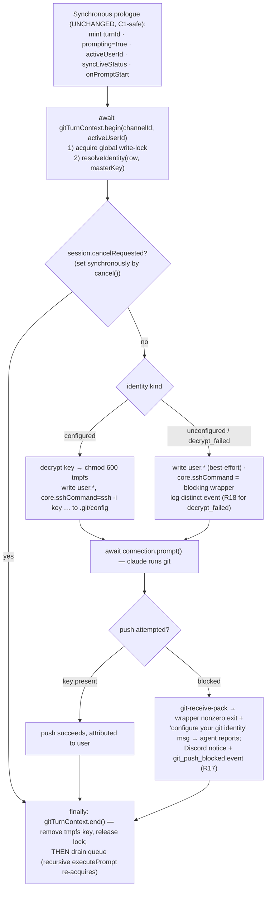
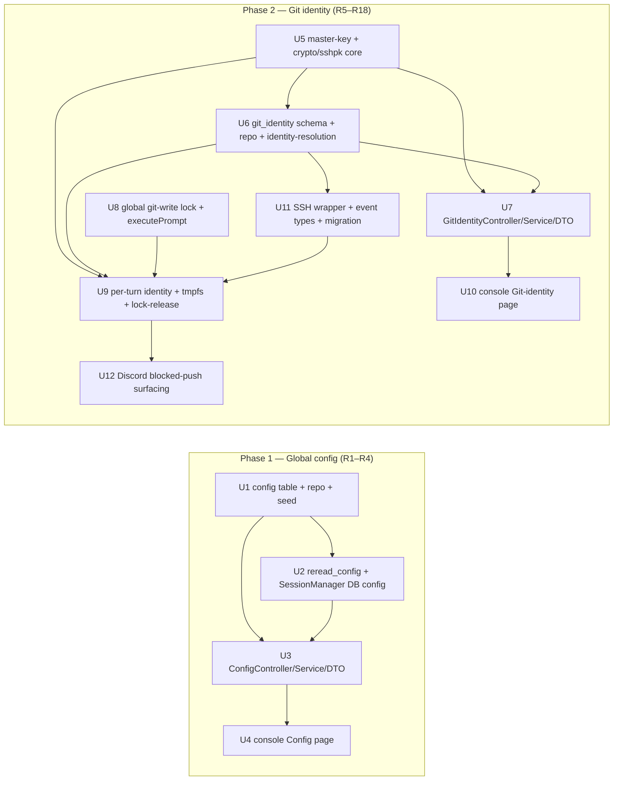

# feat: tdr-code Phase C — Global Config & Per-User Git Identity

## Overview

Phase C adds the two **write** surfaces the `@lilnas/tdr-code` operator console still lacks, on top of the shipped Phase A (two-process substrate) and Phase B (persistence + read surfaces):

1. **Global config, editable without a redeploy.** The four operator settings currently frozen in env and cached in `SessionManagerService`'s constructor (`cwd`, idle timeout, max concurrent sessions, claude command/args) move to a new SQLite `config` table, edited from the console, applied on documented per-setting timing via a main→bot re-read signal.
2. **Per-user git identity.** A new `git_identity` table maps a Discord snowflake → (name, email, AES-256-GCM-encrypted SSH private key, fingerprint, key_version). At each turn start the bot applies the triggering user's identity to the single shared workspace's `.git`, under a **global git-write lock**, and blocks pushes for users with no configured (or no longer decryptable) identity — no fallback identity, no silent mis-attribution.

The work splits into two delivery phases matching the origin's own framing: **config (R1–R4)** is a clean early win with no auth/concurrency entanglement; **git identity (R5–R18)** carries the encryption, write-lock, per-turn application, and push-enforcement work.

---

## Problem Frame

Everything shipped so far in tdr-code is a **read/recover** surface. Phase C is the first time the console *writes* to the running system.

- **Config is frozen at construction.** `SessionManagerService` caches `claudeCommand` / `claudeCwd` / `idleTimeoutSec` / `maxConcurrentSessions` from `env()` in its constructor (`apps/tdr-code/src/agent/session-manager.service.ts:73-82`). Changing any of them requires editing env and redeploying.
- **The agent has no per-user git identity.** Under `--dangerously-skip-permissions` it commits/pushes with whatever ambient identity the host `.git` carries — no attribution to the human who triggered the turn, no push-authorization boundary per user.

**Sequencing (shapes the whole git-identity half):** Phase C ships **before** auth (Phase D). During Phase C the console has no notion of "who is logged in," so the git-identity UI is **admin-managed by Discord ID** (an operator enters/selects a snowflake), not self-service. Because the API is keyed by snowflake either way, self-service is a small UI change when Phase D lands — the API contract does not change (see origin: `docs/brainstorms/2026-07-01-tdr-code-phase-c-config-git-identity-requirements.md`).

---

## Requirements Trace

**Global configuration**

- R1. Editable global config persisted to SQLite: `cwd`, idle timeout, max concurrent sessions, claude command **and args** — exactly these, all global (no per-channel overrides).
- R2. Config changes apply with no redeploy: main writes the config row and signals the bot to re-read; the bot replaces its cached values.
- R3. Apply timing is per-setting and surfaced in the UI as a "takes effect when" label: `cwd` + claude command/args → **new sessions only**; idle timeout → **next idle-timer reset**; max sessions → **next create** (lowering below the active count never evicts running sessions).
- R4. Config input is validated before persistence (`cwd` a usable path, numeric fields in range); invalid input is rejected with a message and nothing is persisted.

**Git identity — data & encryption**

- R5. A git-identity mapping keyed by Discord user ID: name, email, encrypted SSH private key, key fingerprint, `key_version`, timestamps.
- R6. Identity is **all-or-nothing**: name + email + key together constitute "configured." Modeled as a discriminated union + type guard, not a nullable column with `!`.
- R7. SSH private keys encrypted at rest with **AES-256-GCM** (`crypto.createCipheriv`): per-row random 12-byte IV + 16-byte auth tag + ciphertext as separate blobs; AAD binds ciphertext to its `discord_user_id`; a `key_version` column reserves rotation.
- R8. The 32-byte master key lives in a `chmod 600` host file, validated at boot; it is not read from the process environment.

**Identity management UX**

- R9. **Write-only:** the API never returns a stored private key. The UI shows only the fingerprint (`sshpk` sha256, matching `ssh-keygen -lf`) plus status.
- R10. On entry the key is parse-validated; **passphrase-protected keys are rejected**; a size cap is enforced. A bad key is rejected and nothing is stored.
- R11. The UI shows one of **three** per-user states: **Configured**, **Not configured**, **Decrypt/parse-failed** (a key exists but is unreadable — treated as unconfigured for enforcement, shown distinctly).
- R12. An identity can be **replaced** (overwrite bumps `key_version`) or **cleared**. Identity changes take effect on the **next turn**, not mid-turn.
- R13. Until Phase D, the git-identity UI is **admin-managed by Discord ID**. The API is keyed by snowflake regardless; Phase D changes only the UI's *source* of the snowflake, not the API contract.

**Per-turn application & concurrency**

- R14. At turn start the bot applies the triggering user's identity to the shared workspace's git for that turn: name/email + an SSH key path via an out-of-band channel git reads per invocation (decrypted key → `chmod 600` tmpfs file, removed at turn end). Env vars are frozen at `claude` spawn and cannot carry per-turn identity.
- R15. A **single global write-lock** serializes git-writing turns across all channels; the single shared workspace is preserved. Because identity is applied via the shared `.git/config`, the lock spans a git-writing turn's duration.

**Git-write enforcement**

- R16. The enforcement boundary is **push** (the SSH key). Unconfigured/undecryptable → no key for the turn → pushes fail. Local commits are **not** hard-blocked. There is **no fallback/bot identity**.
- R17. A blocked push surfaces three ways: the agent receives a clear "configure your git identity at `<console>`" message (SSH-command wrapper's nonzero exit), a Discord message tells the user, and a structured **blocked-write event** is logged.
- R18. A decrypt/parse failure of a stored key is treated as effectively-unconfigured (push blocked) and logged as a **distinct event type** from "never configured."

**Origin actors:** A1 (Operator), A2 (Main server / control plane), A3 (Discord ACP bot / data plane), A4 (claude agent session), A5 (Triggering Discord user).
**Origin flows:** F1 (edit global config without redeploy), F2 (configure a user's git identity, admin-by-snowflake), F3 (per-turn identity application under the global write-lock), F4 (blocked push when identity unconfigured/unreadable).
**Origin acceptance examples:** AE1 (covers R2, R3), AE2 (covers R16, R17), AE3 (covers R9, R10), AE4 (covers R15), AE5 (covers R11, R18), AE6 (covers R12).

---

## Scope Boundaries

- **No self-service git identity** — admin-managed by Discord ID until Phase D (then the snowflake field becomes session-derived; the API is unchanged).
- **No per-channel config and no per-channel workspaces/worktrees** — config is global; the single shared workspace is preserved (global write-lock, not worktrees).
- **No fallback/bot git identity** — an unconfigured user's pushes are blocked, never pushed under a shared identity.
- **No hard block on local commits** — only pushes are enforceable; commits are inert-without-push. No unenforceable commit block beyond the friendly wrapper message.
- **No envelope encryption / KMS / HSM** — a single AES-256-GCM master key in a host file; `key_version` reserves future rotation but rotation tooling is out of scope.
- **No passphrase-protected keys** — rejected at entry.
- **No management of secrets other than git identity** — no Discord token / API key editing in the config surface.
- **`forward-auth` is NOT removed in this phase.** This plan adds no auth and leaves `apps/tdr-code/deploy.yml`'s `forward-auth` middleware in place; its removal is Phase D's cutover (replaced by Better Auth). This is a deliberate, safety-motivated narrowing of the origin's "forward-auth is simply removed" wording — see Key Technical Decisions #11 and the Open Questions entry. Rationale: the new git-identity write route accepts a private key and is the most sensitive route in the app; removing the only gate before Phase D auth exists would expose it if the console is ever deployed.

### Deferred to Follow-Up Work

- **SSH key rotation tooling** (re-encrypt all rows under a new master key): `key_version` reserves the column; the migration/rotation command is a later iteration.
- **Self-service identity UI** (session-derived snowflake): Phase D, UI-only change on top of this phase's API.

---

## Context & Research

### Relevant Code and Patterns

- **Config caching + turn lifecycle:** `apps/tdr-code/src/agent/session-manager.service.ts` — four config fields cached at construction (L52-85); consumed in `createSession` (`spawn`, L296-320; cwd L303; args hardcoded `['--dangerously-skip-permissions']` L300), `startIdleTimer` (L485-490), `evictIfNeeded` (L279). The per-turn snowflake is `session.activeUserId` (L46, set L214). **`executePrompt` (L203-264) carries the C1/C2/C3 concurrency invariants** — notably C1 (L221-222): *no `await` between the synchronous prologue and the finally-drain*, which the git-write lock must respect.
- **Command transport (main→bot signal):** DB-polled `commands` table (`schema.ts:108-129`) + `command.repo.ts` (`enqueue`, `claimPending` with `BEGIN IMMEDIATE`) + `CommandPollerService` (`src/commands/command-poller.service.ts` — deny-by-default `validate`/`dispatch`, poll every `BOT_COMMAND_POLL_MS`). Enqueue precedent: `LifecycleController.teardown` (`src/console/lifecycle.controller.ts:62-97`).
- **Schema house style:** `apps/tdr-code/src/db/schema.ts` — the cross-phase map comment (L26-29) already anticipates `config` and `git_identity`; enum-as-`text({enum})` + `check(...)`; discriminated subtypes + type-guard exports (`isRunningGeneration` L83, `isActiveSession` L213); `timestamp_ms` integers; `integer({mode:'boolean'})` + CHECK. No `blob` column exists yet — Phase C introduces the first (`blob({mode:'buffer'})`).
- **Repo layer:** functions-over-classes, one file per table (`src/db/sessions.repo.ts`, `command.repo.ts`); `BEGIN IMMEDIATE` for read-then-write.
- **Mutation API pattern:** `src/console/lifecycle.controller.ts` — `@Post` + `@HttpCode(202)`, `@Headers('origin')` + `requireSameOrigin`, `DiscordSnowflakeSchema` (17–20 digit regex), manual `zod.safeParse` + Nest exceptions (NOT `createZodDto`, NOT a global pipe), and the "Phase D (D6) must enumerate these routes" trust-boundary comment. Module registration: `src/console/console.module.ts` (main side); providers `src/discord/discord.module.ts` (bot side).
- **Frontend:** `src/app/lib/api.ts` (typed `api` + `queryKeys`; `postJson` currently sends **no body**), `src/app/components/nav-shell.tsx` (`NAV_LINKS`), `src/app/page.tsx` (the `useMutation` + `invalidateQueries` + inline-confirm form pattern to mirror). `cns()` mandated for class composition. Frontend is excluded from Jest coverage.
- **Crypto / restricted-file precedent:** `import crypto from 'crypto'` (`apps/equations/src/utils/hash.ts`, `apps/yoink/src/auth/auth.controller.ts`); `process.umask(0o077)` in `src/bootstrap.ts:14` (with a comment already anticipating Phase C SSH-key ciphertext); the reaper's every-termination-path cleanup discipline (`src/supervisor/reaper.ts`) is the model for guaranteed tmpfs-key cleanup.
- **Bot shutdown authority:** `src/bot-bootstrap.ts` — the sole ordered SIGTERM/SIGINT sequence (`stopLiveStatusHeartbeat` → `onApplicationShutdown` → `finalizeGeneration`); the tmpfs-key crash sweep hooks here.
- **Env + bootstraps:** `src/env.ts` (`EnvKeys` registry), `env()` helper (`packages/utils/src/env.ts` — plain `process.env`, no validation); main `bootstrap.ts` (migrate:true) vs bot `bot.module.ts` (migrate:false).
- **Test harness:** `src/db/test-db.ts` (`createTestDb()` in-memory + migrations); `src/__tests__/setup.ts` (mocks `discord.js`/`node:child_process`/ACP/`necord`; `sshpk`/`crypto` are real); controller tests direct-construct with stub deps (`src/console/__tests__/lifecycle.controller.spec.ts`).

### Institutional Learnings

- `docs/solutions/conventions/begin-immediate-for-read-then-write-mutations-2026-05-27.md` — use `db.transaction(cb, { behavior: 'immediate' })` for every read-then-write; **its single-process cost model does not hold under two processes** (both main and bot write). WAL + `busy_timeout=5000` are already set; keep write transactions short.
- `docs/solutions/conventions/type-guards-over-nonnull-assertions-on-db-rows-2026-05-30.md` — model R6 "configured vs not" as a discriminated union + type guard (house style; mirrors `isActiveSession`/`isRunningGeneration`).
- `docs/solutions/architecture-patterns/pure-fsm-core-for-stateful-domain-logic-2026-05-27.md` — put the crypto + identity-resolution rules in a **pure, framework-free core** so the main-side controller and the bot-side per-turn application consume identical logic and cannot diverge; matrix-cover *every* public function.
- `docs/solutions/conventions/atomicity-tests-must-reach-the-write-phase-2026-06-03.md` — the concurrency test for the git-write lock (AE4) must contend at the real lock acquire, not a pre-check; confirm the Jest module system (CJS/ts-jest) for any spy-seam.

### External References

- `docs/research/2026-06-28-tdr-code-web-ui-feature-landscape.md` (§ "SSH key encryption at rest", "Per-turn git identity", "Blocking git writes") — the external research is already done and pinned here: AES-256-GCM via `createCipheriv` + `setAAD(recordId)`; master key = 32 bytes from a `chmod 600` file; `sshpk` **1.18.0** for fingerprint/validation (`parsePrivateKey(blob,'auto').toPublic().fingerprint('sha256')`, catch `KeyEncryptedError` to reject passphrase keys); per-turn `.git/config` rewrite + tmpfs key with `IdentitiesOnly=yes StrictHostKeyChecking=accept-new -F /dev/null`; client-side hooks are **not** a security boundary — withhold the key + rely on server-side branch protection.

---

## Key Technical Decisions

1. **Config storage: a single-row typed `config` table** (`CHECK (id = 1)`), one typed column per setting, seeded from env defaults. **Main is the sole seeder** (it runs migrations, `migrate:true`): `getOrSeedConfig(db)` seeds row id=1 from `env()` under `BEGIN IMMEDIATE`. **Seed at a guaranteed-before-bot-spawn seam:** call `getOrSeedConfig` inside the main `DatabaseModule` provider `useFactory` immediately after `runMigrations` (the `migrate:true` branch only) — this runs before any `onModuleInit`, so it completes before `SupervisorService.onModuleInit` spawns the bot. The **bot's** `SessionManager` calls `getConfig(db)` (not seed) and treats a missing row as a **hard boot error** — the bot should never be the first seeder (if it is, main didn't boot). Without this seam the bot's `getConfig` returns undefined on a fresh DB → hard boot error → crash loop. This removes the two-process seed race and the nondeterminism of both processes seeding from possibly-divergent env. Migrates env→DB cleanly: env values become the seed defaults, so existing deployments keep current behavior on first boot. Rejected a key-value/EAV table — only ~5 settings, and typed columns give compile-time safety and CHECK-validated ranges. *(R1)*
2. **Config re-read signal reuses the `commands` table** (Decision: lowest machinery). Add a `reread_config` command type (`target: null`); `ConfigController` enqueues it **best-effort** on write (only when a running generation exists — mirrors `teardown`); the bot's poller dispatches to a new `SessionManagerService.rereadConfig()`. Config **persists regardless of bot liveness**; if the bot is offline, `SessionManager` reads the DB row at its next construction, so the change still applies at next boot with no signal needed. A `reread_config` enqueued against a generation that ends before the bot polls it is **harmlessly abandoned** — `claimPending` filters on the command's `generation_id` + `status='pending'` + an `EXISTS` check that the referenced `bot_generation` row has `ended_at IS NULL` (there is no `commands.ended_at` column); the successor generation reads current config at construction. *(R2; resolves origin deferred question [Affects R2])*
3. **R3 apply-timing falls out structurally.** `rereadConfig()` only updates the four (now-mutable) instance fields; the existing read sites already read them fresh: `createSession` reads `claudeCwd`/`claudeCommand`/args (→ new sessions only), `startIdleTimer` reads `idleTimeoutSec` on each arm (→ next reset), `evictIfNeeded` reads `maxConcurrentSessions` on each create (→ next create, no eviction of running sessions). **claude args become configurable** (stored as a JSON string array; default `['--dangerously-skip-permissions']`), replacing the hardcoded L300 literal. *(R3)*
4. **Global git-write lock = a process-global async mutex in the bot** (tracking its current holder channelId), acquired inside `executePrompt` after the synchronous prologue and before `connection.prompt`, and **released unconditionally at the top of the `finally` — above the `if (this.sessions.has(...))` drain guard.** This placement is load-bearing: on the error/teardown path `executePrompt`'s `finally` runs but the session has already been deleted from the map, so a release nested inside the drain guard would leak the lock and deadlock every other channel. It spans the **whole turn** because the agent runs git at arbitrary, undetectable points; scoping to a "detected git-op window" is not cleanly achievable against an arbitrary-shell agent. **Consequence (surfaced honestly): the lock is turn-scoped, not git-scoped** — the lock spans the entire `connection.prompt` (potentially minutes of LLM+tool work), so *any* active turn in one channel blocks the *start* of every other channel's turn, even turns that never touch git. Accepted per the origin's Decision 2 (concurrent cross-channel work is rare); the narrower git-only lock is a rejected alternative (unachievable) and worktree-per-channel is the real escape hatch if serialization pain appears. A second-order effect: `maxConcurrentSessions` shifts meaning from "concurrent active turns" to "concurrent resident sessions" (only one prompts at a time). *(R15; resolves origin deferred question [Affects R15])*
5. **C1 cancel-race across the new lock `await` is *narrowed* (not eliminated) by a synchronous `cancelRequested` flag.** The new `await` (lock acquire + identity application) sits between the synchronous prologue and `connection.prompt`, which the C1 comment forbids. To restore the pre-lock guarantee, `cancel()` sets `session.cancelRequested = true` synchronously (its `!session.prompting` early-return is passed because `prompting=true` is set in the prologue *before* the new await); the flag is reset at the top of the prologue *before* `prompting=true`, in the same synchronous span as the C3 turn-id mint (so a drained turn cannot resurrect a stale flag). `executePrompt` checks the flag **once, immediately before `connection.prompt`, after identity application fully resolves** (latest possible point) and short-circuits to the `finally` if a cancel arrived during the wait. **Honest framing:** a cancel landing in the residual check→`prompt` tick still relies on the existing ACP `connection.cancel` tolerance (unchanged from today) — the flag closes the lock-wait window, not the sub-tick window. Per-channel serialization is unchanged. As defense-in-depth, `teardown`/proc-exit/`onApplicationShutdown` also call a best-effort `gitTurnContext.abort(channelId)` that releases the lock only if this channel holds it and removes its tmpfs key — idempotent with the `finally` — covering the case where a force-killed turn's `connection.prompt` somehow fails to settle. *(preserves C1; R15)*
6. **Per-turn identity mechanism:** under the lock, rewrite the shared workspace's **local `.git/config`** (`user.name`, `user.email`, `core.sshCommand`) per turn; decrypt the key to a `chmod 600` file in **tmpfs** (`/run/tdr-code/keys/`, a `0700` run-uid-owned dir — preferred over the often-world-accessible `/dev/shm`), removed at turn end. Configured turn → `core.sshCommand` runs `ssh` directly with the tmpfs key: `-i <key> -o IdentitiesOnly=yes -o StrictHostKeyChecking=accept-new -F /dev/null` **plus `-o ControlMaster=no -o ControlPath=none`** — the latter is load-bearing: without disabling connection multiplexing, a persisted master connection from an earlier turn could carry a *different* user's already-authenticated session into a later turn (the single shared workspace + per-turn key makes this design unusually exposed to it), defeating both attribution and the push block. Unconfigured/decrypt-failed turn → `core.sshCommand` points at a **blocking wrapper script**. The wrapper reads the git verb from **its own argv** (git appends `<host> git-receive-pack '<repo>'` / `git-upload-pack '<repo>'`) — **not** `SSH_ORIGINAL_COMMAND`, which is server-side-only and would be empty client-side, silently making the block a no-op. It **default-denies** (blocks any unrecognized verb): blocks `git-receive-pack` (push) with the friendly message + nonzero exit; allows only `git-upload-pack`/`git-upload-archive` (fetch/clone/reads). **`StrictHostKeyChecking=accept-new` is TOFU, and because `-F /dev/null` discards `known_hosts` every turn is a "first connection"** — resolve by writing a fixed `UserKnownHostsFile` with the git host's key at deploy and switching to `StrictHostKeyChecking=yes` (preferred), or explicitly accept the per-turn-TOFU risk in the threat model. **These git-side controls are UX + a friendly-message mechanism, not a containment boundary** — see Decision #10a and the threat-model note. *(R14, R16; resolves origin deferred questions [Affects R14], [Affects R16])*
7. **Master key: 32 bytes in a `chmod 600` host file OUTSIDE the Tier-1-backed `/storage/app-data/` tree**, path from a new env key `TDR_CODE_MASTER_KEY_FILE`, validated at boot in **both** processes (main encrypts on save + decrypts for the UI health-check; bot decrypts per turn). `loadMasterKey()` verifies the file is a **regular file, owned by the current uid, mode `600`, exactly 32 bytes**, and its **parent directory is `0700`, run-uid-owned** (a loose parent dir enables key-swap/rename attacks) — and **fails fast and loud** on any violation. This is critical: a mis-provisioned key must NOT let the bot boot and silently treat every user as `decrypt_failed` (a fleet-wide push outage disguised as "everyone unconfigured"). This is load-bearing on the headline criterion: `/storage/app-data/tdr-code/` is **Backup Priority Tier 1** (`docs/semantic-storage.md`), so co-locating the key with the DB would let a stolen backup yield both — defeating "stolen backup yields no plaintext keys." The defended vector is **backup theft specifically**; whole-disk/root compromise is out of scope (the agent can read the key). **Core dumps must be disabled** for both processes (`RLIMIT_CORE`/`ulimit -c 0`) or excluded from backup — a core dump re-introduces the master key into the very backup-theft vector this decision closes. *(R8; resolves origin deferred question [Affects R8])*
8. **AES-256-GCM record layout:** separate blob columns (`key_iv` 12B, `key_auth_tag` 16B, `key_ciphertext`), `setAAD(Buffer.from(discordUserId, 'utf8'))` to bind ciphertext to its row (byte-identical AAD on decrypt), `key_version` integer (default 1). **IV = `crypto.randomBytes(12)` per encrypt call** — random, not a counter; the 96-bit birthday bound is ~2³² encryptions under one key, ~9 orders of magnitude beyond this workload, so per-*save* encryption is safe (stated so nobody "optimizes" it into a reused/counter IV, which is how GCM is most often broken). **Decrypt pins `authTagLength: 16` and rejects any stored tag ≠ 16 bytes** — Node 26 throws for a non-128-bit GCM tag without an explicit length, and a truncated tag must map to `decrypt_failed`, not an uncaught throw. `createDecipheriv` → `setAAD` → `setAuthTag` → `final()`; any throw (tamper/wrong key/bad AAD) is caught and mapped to the `decrypt_failed` state. **`key_version` ambiguity resolved now (cheap at schema-creation, expensive after rows accumulate):** `keyVersion` is a per-row *overwrite counter* (R12) and does NOT identify which master key encrypted the row. Rather than defer, U6 adds a **separate `masterKeyVersion` column** (seeded to 1, never incremented this phase) so the two meanings never collide; deferred rotation tooling reads it to decrypt old rows. This freezes the v1 contract: the AAD stays `discordUserId`-only for v1, and any future rotation must either bump `masterKeyVersion` per row or bind the version into the AAD before re-encrypting. Node's `createCipher` (keyless) is removed in Node 22 — only `createCipheriv` is used. *(R7; resolves origin deferred question [Affects R7])*
9. **Identity model: all-or-nothing enforced by all-`notNull` columns.** A `git_identity` row present ⇒ configured (name + email + all key blobs present); "not configured" ⇒ no row; "decrypt/parse-failed" ⇒ runtime (decrypt/`sshpk` parse throws). A domain function `resolveIdentity(row | undefined, masterKey)` returns a discriminated union `{ kind: 'configured', ... } | { kind: 'unconfigured' } | { kind: 'decrypt_failed', fingerprint }` with a type guard — this is the R6/R11/R18 model, not a nullable column with `!`. *(R6, R11, R18)*
10. **Shared framework-free core, placed to respect the two-plane boundary.** The crypto (encrypt/decrypt/AAD), key-file loading, `sshpk` validation/fingerprint, **and `resolveIdentity`** live in framework-free modules under `src/crypto/` — specifically `resolveIdentity` + the `IdentityResolution` union + `isConfigured` guard live in `src/crypto/identity-resolution.ts` (importing only `key-cipher.ts`/`ssh-key.ts` + the row *type* from `src/db/schema`). **It must NOT live in `src/agent/`** (a bot-plane-only module wired in `BotModule`/`DiscordModule`): the main-side `GitIdentityController` consumes it, and importing a bot module into the main process would breach the control-plane/data-plane split. Both planes import it downward — preventing logic drift (per the pure-core learning).
10a. **The push block is UX + a friendly-message mechanism, NOT a containment boundary.** Against a `--dangerously-skip-permissions` agent (arbitrary shell, same uid as the bot), the wrapper is trivially bypassable: `git -c core.sshCommand=…`, `GIT_SSH_COMMAND=… git push`, editing `.git/config` directly, generating its own key, or a HTTPS remote all evade it; the agent can also read the live tmpfs key during a configured turn and reuse it. The real boundaries are **withholding the key** (unconfigured ⇒ no key file ⇒ SSH auth fails) + **server-side branch protection / per-user key scope**. The success criterion and R16 language are scoped accordingly: pushes are blocked *for a cooperating agent using the ambient git config*; an actively-circumventing agent is explicitly out of the enforcement model.
11. **`forward-auth` stays until Phase D.** See Scope Boundaries. Phase C does not touch `deploy.yml`'s auth middleware; the backend remains loopback-only (`127.0.0.1:8082`), and every new mutating route carries `requireSameOrigin` + the trust-boundary comment. **Note the layered controls are not per-resource authorization:** `forward-auth` = authN (who reaches the app), `requireSameOrigin` = CSRF-ish; neither restricts *which* identities an operator may manage. In Phase C any operator past `forward-auth` can set/replace/clear *any* snowflake's key (a mis-attribution lever); the loopback API is also reachable by the on-host agent (write-only, so no key readback, but it can tamper/clear identities). Acceptable for a single-operator admin console; Phase D decides self-only vs admin-any.

---

## Open Questions

### Resolved During Planning

- **Per-turn identity mechanism / tmpfs / cleanup** ([Affects R14]) → Decision #6 (per-turn `.git/config` rewrite + tmpfs key + wrapper); cleanup in `executePrompt`'s `finally` + a bot-boot/shutdown sweep of the key dir.
- **Write-lock home + span + composition with per-channel serialization** ([Affects R15]) → Decisions #4/#5 (process-global mutex in the bot, whole-turn span, `cancelRequested` flag preserves C1; per-channel `prompting`/queue unchanged).
- **SSH wrapper allowed/blocked op set** ([Affects R16]) → Decision #6 (block `git-receive-pack`, allow `git-upload-pack`).
- **Config re-read signal** ([Affects R2]) → Decision #2 (reuse `commands` table + new `reread_config` type).
- **Master-key file path/perms/provisioning** ([Affects R8]) → Decision #7 (`chmod 600`, outside the Tier-1 backup tree, `TDR_CODE_MASTER_KEY_FILE`, boot-validated in both processes).
- **GCM record layout + AAD + has-identity type guard** ([Affects R7]) → Decisions #8/#9.
- **`forward-auth` removal timing** → Decision #11 (keep until Phase D). *Operator may override during plan review — the origin's stated assumption permits removal, but this plan defaults to the safer posture because the git-identity route accepts private keys.*

### Deferred to Implementation

- Exact SSH wrapper script contents (the argv verb-scan + default-deny logic is decided in Decision #6; the shell details are implementation).
- Whether to pin the git host key (fixed `UserKnownHostsFile` + `StrictHostKeyChecking=yes`, preferred) or explicitly accept per-turn TOFU (Decision #6) — resolve at the deploy unit against the actual git host.
- Read-path behavior for unconfigured users (whether `git-upload-pack` uses an ambient/default key or fails naturally when none exists) — a refinement, not a correctness requirement.
- The async-mutex implementation (a small hand-rolled promise-chain mutex vs a tiny dependency), including the holder-tracking needed by `gitTurnContext.abort()`.
- Exact config validation ranges (upper bounds for idle timeout and max sessions) and `claudeCommand`/`claudeArgs` sanity bounds (non-empty command, no shell metacharacters, args = `string[]` with a size cap, no NUL bytes).
- **Whether to denylist high-capability claude flags** in `claudeArgs` validation (e.g. `--mcp-server`, `--add-dir`) — a size cap alone does not constrain capability expansion, and config is an operator-editable spawn lever. Decide accept-any vs denylist at implementation (security judgment call).
- Master-key literal path + the backup-exclusion mechanism + core-dump disabling (deploy unit + host conventions; cross-check `docs/semantic-storage.md`).
- Whether the UI identity-list health-check can avoid full plaintext decryption (a cheaper verifier) rather than decrypting every private key on each list load (see Risks).

---

## Output Structure

New files this plan adds (existing files modified are listed per-unit):

    apps/tdr-code/
      src/
        db/
          config.repo.ts                      # U1
          git-identity.repo.ts                # U6
          migrations/0004_*.sql … 0007_*.sql  # U1, U2, U6, U11 (generated; four migrations, start at 0004)
        crypto/
          master-key.ts                       # U5  (load + boot-validate the 32-byte key file)
          key-cipher.ts                       # U5  (AES-256-GCM encrypt/decrypt + AAD)
          ssh-key.ts                          # U5  (sshpk validate / fingerprint / passphrase-reject)
          identity-resolution.ts              # U6  (resolveIdentity union + isConfigured guard — framework-free, both planes)
          __tests__/{key-cipher,ssh-key,master-key,identity-resolution}.spec.ts
        agent/
          git-turn-context.ts                 # U9  (per-turn apply/cleanup, lock-release, abort, sweep)
          git-write-lock.ts                   # U8  (process-global async mutex + holder tracking)
          __tests__/{git-write-lock,git-turn-context}.spec.ts
        console/
          config.controller.ts  config.service.ts  config.dto.ts        # U3
          git-identity.controller.ts  git-identity.service.ts  git-identity.dto.ts   # U7
          __tests__/{config,git-identity}.controller.spec.ts
        app/
          config/page.tsx                     # U4
          git-identity/page.tsx               # U10
        scripts/
          git-ssh-wrapper.sh                  # U11 (blocking wrapper: argv verb-scan, default-deny, friendly message on push)

---

## High-Level Technical Design

> *This illustrates the intended approach and is directional guidance for review, not implementation specification. The implementing agent should treat it as context, not code to reproduce.*

**Config re-read round-trip (F1 / AE1):**

```mermaid
sequenceDiagram
  participant Op as Operator (console)
  participant Main as Main server (ConfigController)
  participant DB as SQLite (config, commands)
  participant Bot as Bot (CommandPoller → SessionManager)
  Op->>Main: PUT /config { cwd, idleTimeout, maxSessions, command, args }
  Main->>Main: zod.safeParse + fs check(cwd) — reject → 400, nothing persisted
  Main->>DB: UPDATE config row (id=1)  [BEGIN IMMEDIATE]
  Main->>DB: enqueue reread_config  (best-effort: only if running generation)
  Main-->>Op: 200 { config }
  Bot->>DB: claimPending → reread_config
  Bot->>DB: SELECT config row
  Bot->>Bot: rereadConfig(): replace 4 in-memory fields
  Note over Bot: running session keeps spawn-time cwd/args (R3);<br/>next idle-timer reset uses new timeout;<br/>next create uses new maxSessions
```

**Per-turn identity under the global write-lock (F3 / F4), inside `executePrompt`:**



**Identity resolution states (R11 / R6 / R18):**

| DB row for snowflake | Decrypt/parse of stored key | `resolveIdentity` kind | UI state | Push |
|---|---|---|---|---|
| absent | — | `unconfigured` | Not configured | blocked |
| present (all cols) | succeeds | `configured` | Configured (fingerprint shown) | works |
| present (all cols) | throws (wrong master key / tamper / bad blob) | `decrypt_failed` | Decrypt/parse-failed | blocked |

---

## Implementation Units

Delivered in two phases. Phase 1 (U1–U4) is independently shippable and carries no encryption/concurrency risk. Phase 2 (U5–U12) builds the git-identity half.

> **U-IDs are stable identifiers, not an execution sequence.** Execute in **dependency-graph order** (below), not numeric order. Notably U11 (wrapper + event types) is a prerequisite of U9, and U10 (console page) depends only on U7 and can land in parallel with U8/U9/U11. The prose orders units in dependency order; the numbers are permanent labels (U9 kept its ID when the original unit was split into U9/U11/U12).



---

### Phase 1 — Global config (R1–R4)

- U1. **Config table + repo + boot seed**

**Goal:** Persist the four (five, counting args) global settings in a single-row `config` table with idempotent env-seeded defaults.

**Requirements:** R1, R4 (schema-level CHECKs)

**Dependencies:** None

**Files:**
- Modify: `apps/tdr-code/src/db/schema.ts` (add `config` table + row type)
- Create: `apps/tdr-code/src/db/config.repo.ts` (`getConfig`, `getOrSeedConfig`, `updateConfig`)
- Modify: `apps/tdr-code/src/db/database.module.ts` (main provider `useFactory` calls `getOrSeedConfig` right after `runMigrations`, `migrate:true` branch only — the guaranteed-before-bot-spawn seam per Decision #1)
- Create: `apps/tdr-code/src/db/migrations/000X_*.sql` (via `pnpm db:generate`)
- Test: `apps/tdr-code/src/db/__tests__/config.repo.spec.ts`

**Approach:**
- Columns: `id` (PK, `CHECK (id = 1)`), `cwd` text, `claudeCommand` text, `claudeArgs` `text({mode:'json'}).$type<string[]>()`, `idleTimeoutSec` integer (`CHECK > 0`), `maxConcurrentSessions` integer (`CHECK >= 1`), `updatedAt` `timestamp_ms`.
- `getOrSeedConfig(db)` reads row id=1; if absent, inserts defaults from `env()` (preserving today's behavior) inside `db.transaction(cb, { behavior: 'immediate' })` — read-then-write atomic, so a concurrent seeder serializes and re-reads. **Only the main process calls this** (see Decision #1); `getConfig(db)` is the plain read the bot uses (it must not seed).
- `updateConfig(db, patch)` writes id=1 under `BEGIN IMMEDIATE`.

**Patterns to follow:** `src/db/schema.ts` enum+check style; `src/db/command.repo.ts` (`BEGIN IMMEDIATE`); functions-over-classes repo.

**Test scenarios:**
- Happy path: `getOrSeedConfig` on an empty DB inserts one row with env-derived defaults; a second call returns the same row without inserting a duplicate.
- Happy path: `updateConfig` changes fields; `getConfig` reflects them; `updatedAt` advances.
- Edge case: seeding is idempotent under **concurrent** callers (exercise the real `BEGIN IMMEDIATE` write window, per the atomicity-tests learning — not two sequential calls) — exactly one row, id=1.
- Error path: inserting a second row (id=2) or `idleTimeoutSec <= 0` / `maxConcurrentSessions < 1` violates a CHECK and throws.
- Edge case: `getConfig` on an unseeded DB returns undefined (the bot maps this to a hard boot error — tested in U2).

**Verification:** Migration applies in `createTestDb()`; repo round-trips; the single-row invariant holds.

---

- U2. **`reread_config` transport + DB-backed `SessionManager` config + configurable args**

**Goal:** Make `SessionManagerService` read config from the DB (not env), add `rereadConfig()`, and wire the main→bot re-read signal through the command poller.

**Requirements:** R2, R3

**Dependencies:** U1

**Files:**
- Modify: `apps/tdr-code/src/db/schema.ts` (`COMMAND_TYPES` += `reread_config`; extend the `commands_type_check`)
- Create: `apps/tdr-code/src/db/migrations/000X_*.sql` (CHECK-recreate for the new command type)
- Modify: `apps/tdr-code/src/agent/session-manager.service.ts` (drop `readonly` on the four fields; read via `getOrSeedConfig` in the constructor; add `rereadConfig()`; spawn with configurable `claudeArgs`)
- Modify: `apps/tdr-code/src/commands/command-poller.service.ts` (add a `RereadConfigSchema` validator + a `reread_config` dispatch case → `sessionManager.rereadConfig()`)
- Test: `apps/tdr-code/src/agent/__tests__/session-manager.config.spec.ts`, `apps/tdr-code/src/commands/__tests__/command-poller.spec.ts` (extend)

**Approach:**
- Constructor: replace the four `env()` reads with `getConfig(this.db)` (the bot does NOT seed — Decision #1); a missing row is a **hard boot error** (main should have seeded first). Keep env only as the seed default inside the repo (main side).
- `rereadConfig()`: re-`getConfig` and overwrite the four instance fields. No re-spawn, no timer reset — R3 timing is satisfied because read sites read fresh.
- Spawn: `spawn(this.claudeCommand, this.claudeArgs, …)` (L300-305) instead of the hardcoded arg array.
- Poller: `reread_config` has `target: null`; validate shape, dispatch to `rereadConfig()`, log; unknown/invalid still records a `command_anomaly` (existing deny-by-default path).

**Execution note:** Preserve the C1/C2/C3 invariants in `executePrompt` — this unit does not touch that method; it only mutates fields the method reads.

**Patterns to follow:** `command-poller.service.ts` `validate`/`dispatch`; `TeardownChannelSchema`; the existing generation-guard style.

**Test scenarios:**
- Covers AE1. Happy path: after `updateConfig` changes `cwd` + a `reread_config` dispatch, a **new** session spawns with the new cwd while an already-running session keeps its spawn-time cwd.
- Happy path: lowering `maxConcurrentSessions` below the active count does not evict; the next `createSession` sees the lower ceiling in `evictIfNeeded`.
- Happy path: changing `idleTimeoutSec` then arming a fresh idle timer uses the new value.
- Happy path: `claudeArgs` from config are passed to `spawn` (assert on the mocked `spawn` args); default remains `['--dangerously-skip-permissions']` when unset.
- Edge case: `rereadConfig()` when the config row is unchanged is a no-op (fields identical).
- Error path: a `reread_config` command with a non-null `target` is rejected as an anomaly (deny-by-default), not dispatched.
- Happy path (unsignaled boot path — Decision #2): a `SessionManager` constructed against a DB whose config row was updated while the bot was offline reads the new values at construction (no `reread_config` needed).

**Verification:** A config change signaled via `reread_config` updates the bot's live values on the documented per-setting timing; `spawn` receives configured command + args.

---

- U3. **ConfigController / ConfigService / DTO**

**Goal:** Expose GET (current config) and update endpoints with validation, same-origin protection, and best-effort re-read signaling.

**Requirements:** R1, R2, R4

**Dependencies:** U1, U2

**Files:**
- Create: `apps/tdr-code/src/console/config.controller.ts`, `config.service.ts`, `config.dto.ts`
- Modify: `apps/tdr-code/src/console/console.module.ts` (register controller + service)
- Test: `apps/tdr-code/src/console/__tests__/config.controller.spec.ts`

**Approach:**
- `GET /config` → current row (via `ConfigService`). Update route (`@Post`/`@Put` `/config`, `@HttpCode(200)`) → `requireSameOrigin(origin)`, `zod.safeParse` the body, `fs.statSync(cwd)` must resolve to a directory (R4), numeric ranges enforced; on any failure throw `BadRequestException` and persist nothing.
- **Validate `claudeCommand`/`claudeArgs` as a security-relevant input** (Decision #3 makes them operator-editable, replacing a hardcoded literal — this is an arbitrary-process-spawn lever): non-empty/non-whitespace command, reject shell metacharacters, `claudeArgs` must be a `string[]` with a size cap.
- On success: `updateConfig`, then **best-effort** enqueue `reread_config` **via `command.repo` `enqueue` + `latestGeneration`/`isRunningGeneration` on the injected `Db`** (exactly mirroring `LifecycleController.teardown`) — the main process does NOT reference `SessionManagerService` (it is a bot-only provider); `SessionManagerService.rereadConfig()` is invoked only bot-side by `CommandPollerService.dispatch`. **Do not** fail the request when the bot is offline (unlike teardown): the config still persists and applies at next bot boot.
- Carry the "Phase D (D6) must enumerate these routes … treat as sensitive" trust-boundary comment.

**Patterns to follow:** `src/console/lifecycle.controller.ts` (origin guard, exceptions, enqueue), `src/console/*.dto.ts` (zod schema + `z.infer`), manual-safeParse convention.

**Test scenarios:**
- Happy path: valid body persists and returns the updated config; when a running generation exists, a `reread_config` command is enqueued.
- Happy path: valid body with the bot offline still persists and returns 200 (no enqueue, no error).
- Covers AE1 (label side handled in U4). Edge case: `maxConcurrentSessions` at the boundary (min allowed) accepted; below it rejected.
- Error path: cross-origin request → `ForbiddenException`.
- Error path: non-existent `cwd` → `BadRequestException`, nothing persisted (assert row unchanged).
- Error path: out-of-range idle timeout / non-array `claudeArgs` → `BadRequestException`, nothing persisted.
- Error path: empty/whitespace `claudeCommand`, or a command containing shell metacharacters → `BadRequestException`, nothing persisted.

**Verification:** Round-trip through the controller updates the row, signals the bot when running, and rejects invalid input without persisting.

---

- U4. **Console Config page + api body helper + nav**

**Goal:** An operator form to view and edit config with per-field "takes effect when" labels.

**Requirements:** R1, R3

**Dependencies:** U3

**Files:**
- Create: `apps/tdr-code/src/app/config/page.tsx`
- Modify: `apps/tdr-code/src/app/lib/api.ts` (add a body-carrying `putJsonBody`/`postJsonBody` helper; add `config` to `queryKeys` + `api`)
- Modify: `apps/tdr-code/src/app/components/nav-shell.tsx` (add a `Config` nav entry)
- Test: none — frontend is excluded from Jest coverage (`jest.config.js`); verify via typecheck/lint + manual.

**Approach:**
- `useQuery(queryKeys.config, api.getConfig)` to load; controlled form fields; `useMutation` → `api.updateConfig(body)` → `invalidateQueries(queryKeys.config)`; inline error text on failure (mirror `src/app/page.tsx`).
- **UX states (mirror `page.tsx`; the plan names them so they don't drift):** `LoadingState` while the GET is in flight; Save button `disabled` + `opacity-50` while the mutation is pending; a brief inline "Saved" confirmation on success (or rely on the invalidated refetch, state which); on error, retain field values and show the server's message.
- **Bot-offline notice:** reuse the existing `botOffline` signal (`queryKeys.botStatus`) to render a banner near Save when the bot is offline — "Bot offline — config saved and will apply at next bot start" — so the per-field timing labels aren't misread as immediate (mirrors the existing "Bot is offline" banner in `page.tsx`).
- **`claudeArgs` interaction (lock it in, don't defer):** a textarea validated client-side as a JSON string array with an inline "Invalid JSON array" message *before* the PUT fires (so the operator isn't left with a bare 400); state whether the displayed value is raw JSON or formatted.
- Each field carries a static "takes effect: new sessions / next idle reset / next create" label (R3).
- Nav order: `Live | Sessions | Events | Config | Git identity` — write-surface pages last so read surfaces are encountered first.
- `api.ts`: current `postJson` sends no body; add `putJsonBody<T>(path, body)` with `Content-Type: application/json` + `JSON.stringify`.

**Patterns to follow:** `src/app/page.tsx` (`useMutation` + invalidate + inline confirm/error), `src/app/sessions/page.tsx` (form inputs, dark theme), `cns()` for classes.

**Test scenarios:** Test expectation: none — frontend view code with no isolated behavioral logic; excluded from coverage. Validation/behavior is proven in U3.

**Verification:** The page loads current config, saves valid edits, shows the server's rejection message on invalid input, and labels each field's apply timing.

---

### Phase 2 — Per-user git identity (R5–R18)

- U5. **Master-key loader + crypto/validation core (shared, framework-free)**

**Goal:** The framework-free security primitives: load+validate the master key file; AES-256-GCM encrypt/decrypt with AAD; `sshpk` key validation + fingerprint.

**Requirements:** R7, R8, R9 (fingerprint), R10 (validation)

**Dependencies:** None

**Files:**
- Create: `apps/tdr-code/src/crypto/master-key.ts` (`loadMasterKey()`: read `env(TDR_CODE_MASTER_KEY_FILE)`, verify **regular file, owned by current uid, mode `600`, parent dir `0700`, exactly 32 bytes**, return `Buffer`; throw a clear boot error otherwise)
- Create: `apps/tdr-code/src/crypto/key-cipher.ts` (`encryptKey(plaintext, aad, masterKey) → {iv, authTag, ciphertext}`; `decryptKey({iv, authTag, ciphertext}, aad, masterKey) → Buffer` — throws on tamper/wrong key; best-effort zeroizes intermediate plaintext Buffers after use)
- Create: `apps/tdr-code/src/crypto/ssh-key.ts` (`validateAndFingerprint(pem) → { fingerprint } | reject`: size cap **before** parse, `sshpk.parsePrivateKey(pem,'auto')` with **no passphrase option**, catch `KeyEncryptedError` → passphrase-rejected message, catch `KeyParseError`/other → "invalid key" message, verify the parsed object is a private key of an allowed type, `.toPublic().fingerprint('sha256').toString()`)
- Modify: `apps/tdr-code/src/env.ts` (`EnvKeys.TDR_CODE_MASTER_KEY_FILE`), `apps/tdr-code/.env.example`, `apps/tdr-code/deploy.yml` (host-setup comment: provision the key file + parent dir with `0700`/`600` outside the backup tree; disable core dumps)
- Modify: `apps/tdr-code/package.json` (add `sshpk` ^1.18.0 + `@types/sshpk`; note transitive `asn1`/`tweetnacl`/`bcrypt-pbkdf`)
- Modify: `apps/tdr-code/src/bootstrap.ts` and `apps/tdr-code/src/bot-bootstrap.ts` (call `loadMasterKey()` at boot → fail fast; the **bot** must fail-fast independently of main — never boot into silent fleet-wide `decrypt_failed`). **Also add `process.umask(0o077)` to the top of `bootstrapBot()`** — `bootstrap.ts:14` sets it but `bot-bootstrap.ts` does not, so without it the bot's tmpfs key (U9) is created world-readable before its `chmod 600` (a TOCTOU window).
- **Modify: `apps/tdr-code/src/supervisor/supervisor.service.ts` (`buildBotEnv` allowlist).** The supervisor spawns the bot with an explicit env allowlist ("never inherit the full process.env so … Phase-C keys cannot reach the skip-permissions agent tree"); `TDR_CODE_MASTER_KEY_FILE` must be added to it or the bot's `loadMasterKey()` throws on every boot → crash loop. **Deliberate tension to note:** this passes the key-file *path* (not the bytes) into the bot/agent env — consistent with the honest threat model (Decision #10a already concedes the same-uid agent can read the key), but it relaxes the allowlist's "no Phase-C keys reach the agent tree" comment; call it out there.
- Test: `apps/tdr-code/src/crypto/__tests__/{key-cipher,ssh-key,master-key}.spec.ts`

**Approach:**
- `import crypto from 'crypto'` (house style). GCM: `createCipheriv('aes-256-gcm', masterKey, iv)` with `crypto.randomBytes(12)`, `setAAD(Buffer.from(discordUserId, 'utf8'))`, capture `getAuthTag()`. Decrypt: `createDecipheriv('aes-256-gcm', masterKey, iv, { authTagLength: 16 })` + `setAAD` + `setAuthTag` + `final()`; **reject any stored tag ≠ 16 bytes** (Node 26 throws otherwise) and map every throw (tamper/wrong key/bad AAD) to a caught failure the caller turns into `decrypt_failed`.
- Size cap (and a small floor) on the pasted key **before** `parsePrivateKey` (DoS guard). Never pass a passphrase to `parsePrivateKey` — that would *accept* an encrypted key and defeat R10.
- `loadMasterKey` validates file type/owner/mode/parent-dir/length and surfaces a boot-blocking error; both bootstraps call it before serving. Store the key as a `Buffer`, never a hex string (which lingers interned); best-effort `fill(0)` after use is defense-in-depth only (V8 may have copied — see threat-model note).

**Execution note:** Test-first for the crypto core — write the round-trip and tamper/passphrase/size tests before the implementation; use real key material (setup mocks `child_process` but leaves `crypto`/`sshpk`/`fs` real).

**Patterns to follow:** `apps/equations/src/utils/hash.ts` (crypto import), `src/bootstrap.ts:14` umask precedent, reaper cleanup discipline (referenced in U9).

**Test scenarios:**
- Covers AE3 (encryption side). Happy path: encrypt→decrypt round-trips the exact key bytes with the correct AAD.
- Covers AE5. Error path: decrypt with a **different** master key throws (→ maps to `decrypt_failed`).
- Error path: decrypt with mismatched AAD (wrong `discordUserId`) throws (row-swap protection — the load-bearing justification for AAD).
- Error path: tampered **ciphertext**, tampered **authTag**, AND tampered **IV** each throw (complete the GCM authenticity matrix).
- Error path: a stored authTag of length ≠ 16 bytes is rejected (no uncaught throw).
- Covers AE3. Error path: `validateAndFingerprint` rejects a **passphrase-protected key** — both classic encrypted PEM (`KeyEncryptedError` `format:'pem'`) **and** encrypted OpenSSH ed25519 (`KeyEncryptedError` `format:'OpenSSH'`); rejects garbage/`KeyParseError`, a mistakenly-pasted **public** key, and input over the size cap — each with the intended distinct message.
- Happy path: fingerprint (`SHA256:…` token) of a known unencrypted ed25519 `openssh-key-v1` test key equals `ssh-keygen -lf` for that key (golden test, guards against an sshpk default change).
- Error path: `loadMasterKey` throws when the file is missing, wrong length, not a regular file, wrong owner/mode, or the parent dir is looser than `0700`.

**Verification:** Round-trip and all rejection paths pass with real key material; both bootstraps fail fast on a missing/invalid master key.

---

- U6. **`git_identity` schema + repo + identity domain union**

**Goal:** Persist configured identities and expose a typed lookup that produces the three-state discriminated union.

**Requirements:** R5, R6, R7 (columns), R11, R18 (domain)

**Dependencies:** U5 (crypto types)

**Files:**
- Modify: `apps/tdr-code/src/db/schema.ts` (`git_identity` table + row type; **add `blob` to the existing `drizzle-orm/sqlite-core` import** — this is the first `blob` column in the codebase)
- Create: `apps/tdr-code/src/db/git-identity.repo.ts` (`getIdentity`, `listIdentities`, `upsertIdentity`, `deleteIdentity`)
- Create: `apps/tdr-code/src/crypto/identity-resolution.ts` (`resolveIdentity(row | undefined, masterKey) → IdentityResolution` union + `isConfigured` guard). **Must live under `src/crypto/` (framework-free), NOT `src/agent/`** — the main-side `GitIdentityController` (U7) consumes it, and `src/agent` is bot-plane-only; a main→agent import would breach the two-plane split (Decision #10).
- Create: `apps/tdr-code/src/db/migrations/000X_*.sql`
- Test: `apps/tdr-code/src/db/__tests__/git-identity.repo.spec.ts`, `apps/tdr-code/src/crypto/__tests__/identity-resolution.spec.ts`

**Approach:**
- Table (all columns `notNull` so a row ⇒ configured, satisfying all-or-nothing without nullable `!`): `discordUserId` text PK, `name`, `email`, `keyCiphertext`/`keyIv`/`keyAuthTag` `blob({mode:'buffer'})`, `keyFingerprint` text, `keyVersion` integer default 1 (**per-row overwrite counter**, R12), `masterKeyVersion` integer notNull default 1 (**which master key encrypted this row** — seeded to 1, never incremented this phase; disambiguates the two `*Version` meanings so rotation tooling can decrypt old rows — see Decision #8), `createdAt`/`updatedAt` `timestamp_ms`.
- `upsertIdentity` overwrites on conflict and bumps `keyVersion` (R12). `deleteIdentity` clears back to unconfigured.
- `resolveIdentity` imports only `key-cipher.ts`/`ssh-key.ts` + the row *type* from `src/db/schema`: no row → `{kind:'unconfigured'}`; row present → attempt `decryptKey` (AAD = discordUserId); success → `{kind:'configured', name, email, keyPlaintext, fingerprint}` where the **fingerprint is recomputed from the decrypted plaintext at resolve time** (not trusted from the stored column, which could diverge from the ciphertext on a partial write); throw → `{kind:'decrypt_failed', fingerprint}` (stored column). The type guard narrows for callers.

**Patterns to follow:** `src/db/schema.ts` discriminated subtypes + guards (`isActiveSession`), `blob` import from `drizzle-orm/sqlite-core`; `src/db/sessions.repo.ts` repo style.

**Test scenarios:**
- Happy path: `upsertIdentity` then `getIdentity` round-trips name/email/blobs/fingerprint; a second upsert bumps `keyVersion`.
- Happy path: `deleteIdentity` removes the row; `getIdentity` returns undefined.
- Covers AE5, R18. Domain: `resolveIdentity(undefined)` → `unconfigured`; a row whose blobs decrypt → `configured`; a row that fails to decrypt (wrong master key) → `decrypt_failed` with fingerprint preserved.
- Edge case: `isConfigured` type guard narrows so callers get `keyPlaintext` without a non-null assertion.

**Verification:** Migration applies; repo round-trips blob columns; `resolveIdentity` produces the correct three-way discriminant for each state.

---

- U7. **GitIdentityController / Service / DTO (write-only management API)**

**Goal:** Admin-by-snowflake CRUD for identities: list with status+fingerprint, upsert (validate+encrypt), clear. Never returns key material.

**Requirements:** R9, R10, R11, R12, R13

**Dependencies:** U5, U6

**Files:**
- Create: `apps/tdr-code/src/console/git-identity.controller.ts`, `git-identity.service.ts`, `git-identity.dto.ts`
- Modify: `apps/tdr-code/src/console/console.module.ts`
- Test: `apps/tdr-code/src/console/__tests__/git-identity.controller.spec.ts`

**Approach:**
- `GET /git-identity` → list of `{ discordUserId, name, email, fingerprint, status }` where `status` is derived per row (health-check) — **never** the key. `status ∈ {configured, decrypt_failed}` (rows only exist for these; absent snowflakes are "not configured" client-side). **Confidentiality caveat (see Risks):** a full `resolveIdentity` decrypts every private key to plaintext in the main process on each list load (transient heap exposure + N-decrypts-per-call DoS angle). Prefer a **cheaper verifier** (authTag-only verification without materializing full plaintext) where feasible; if full decryption is used, `fill(0)` the plaintext Buffer immediately.
- `POST /git-identity` (upsert): `requireSameOrigin`; `zod.safeParse` `{ discordUserId (DiscordSnowflakeSchema), name, email, privateKey }`; `validateAndFingerprint(privateKey)` (rejects passphrase/oversized/garbage/public-key → `BadRequestException`, nothing stored); `encryptKey(privateKey, aad=discordUserId, masterKey)`; `upsertIdentity`. Response echoes fingerprint + status only.
- `DELETE /git-identity/:discordUserId` (clear): `requireSameOrigin` + snowflake validation → `deleteIdentity`.
- Trust-boundary comment noting this is the **most sensitive route** (accepts a private key): never log the key, never echo it. **No per-identity authorization in Phase C** — any operator past `forward-auth` can write/clear any snowflake's key (Decision #11); the reachable-by-on-host-agent loopback tamper vector is accepted (write-only, no readback).

**Patterns to follow:** `src/console/lifecycle.controller.ts` (origin guard, snowflake schema, exceptions); DTO = zod schema + `z.infer`.

**Test scenarios:**
- Covers AE3, R9. Happy path: upsert a valid key → 200 with fingerprint only; the response and a subsequent GET never contain the private key.
- Covers AE3, R10. Error path: passphrase-protected key → `BadRequestException`, nothing stored (assert no row).
- Error path: oversized key / malformed key → `BadRequestException`, nothing stored.
- Error path: invalid snowflake → `BadRequestException`; cross-origin → `ForbiddenException`.
- Covers R12. Happy path: re-upsert for an existing snowflake overwrites and bumps `keyVersion`; delete clears to unconfigured.
- Covers AE5, R11. Happy path: GET reports `decrypt_failed` status for a row planted with a key encrypted under a different master key (never surfaces plaintext).

**Verification:** The write-only contract holds (key never returned/logged); validation rejects bad keys without persisting; status reflects the three states.

---

- U8. **Global git-write lock + `executePrompt` integration**

**Goal:** A process-global async mutex that serializes git-writing turns across channels, integrated into `executePrompt` without breaking the C1/C2/C3 invariants.

**Requirements:** R15

**Dependencies:** None structurally (precedes U9 logically)

**Files:**
- Create: `apps/tdr-code/src/agent/git-write-lock.ts` (a process-global async mutex **tracking its current holder channelId**: `acquire(channelId) → release`; `releaseIfHeldBy(channelId)`)
- Modify: `apps/tdr-code/src/agent/session-manager.service.ts` (add `cancelRequested` to `ManagedSession`; set it in `cancel()`; acquire the lock + (in U9) apply identity before `connection.prompt`; check `cancelRequested` once immediately before `connection.prompt`; **release unconditionally at the TOP of `finally`, above the `if (this.sessions.has(...))` drain guard**)
- Test: `apps/tdr-code/src/agent/__tests__/git-write-lock.spec.ts`, extend `session-manager` tests for the cancel-during-lock and teardown-during-lock cases

**Approach:**
- Mutex: a promise-chain mutex (single global instance shared by all channels' turns). `acquire()` resolves when the previous holder releases.
- `executePrompt`: keep the synchronous prologue unchanged (C1) — reset `cancelRequested = false` there, in the same synchronous span as the C3 turn-id mint and before `prompting = true`. After the prologue, `const release = await gitLock.acquire(channelId)` (in U9 wrapped by `gitTurnContext.begin`, which also applies identity). Check `if (session.cancelRequested)` **once, immediately before `connection.prompt`**, and short-circuit to the `finally` if set.
- **Release placement is load-bearing (correctness):** release **unconditionally at the top of the `finally`**, *above* the `if (this.sessions.has(session.channelId))` drain guard. On the error/teardown path `teardown()` deletes the session from the map before `finally` runs, so a release nested inside the drain guard would be skipped → permanent cross-channel deadlock. Releasing at the top also precedes the recursive drain (`queue.shift()` → `executePrompt`), so the drained turn re-acquires cleanly.
- **Force-kill paths** (`teardown`/evict/idle, `onApplicationShutdown`) kill the claude process, which rejects the in-flight `connection.prompt`, routing through the `finally` release. **But the raw `proc.on('error')` and `proc.on('exit')` handlers (`session-manager.service.ts:319-384`) are separate code paths from `teardown()`** — they delete the session from the map directly. If the process dies during the lock-acquire/identity-application window (before `connection.prompt` is even called), there is no in-flight prompt to reject, so `executePrompt`'s `finally` never runs. **Therefore `proc.on('error')` and `proc.on('exit')` MUST each call `gitTurnContext.abort(channelId)` → `releaseIfHeldBy(channelId)`** after deleting the session (idempotent with the `finally`; never releases another channel's lock). This closes the die-before-prompt deadlock the "prompt-rejection drives release" reasoning alone does not cover.

**Execution note:** Preserve C1 — the only new `await` is the lock acquire + identity application; the single `cancelRequested` check immediately before `connection.prompt` narrows the stop-cancel window (a cancel in the residual check→prompt tick still relies on the existing ACP `connection.cancel` tolerance). The AE4 concurrency test must contend at the real `acquire()`, not a pre-check (institutional learning). `DiscordHandlerService.onPromptComplete` must stay synchronous (its own C1) — cross-reference it.

**Patterns to follow:** existing C1/C2/C3 comments in `executePrompt`; `killProcessTree`/timer discipline for release-on-every-path.

**Test scenarios:**
- Covers AE4, R15. Integration: two channels enter `executePrompt` concurrently; assert the second's identity application/prompt does not begin until the first releases (contend at the real mutex).
- Happy path: lock releases at the top of `finally`; the queued-drain recursion re-acquires without deadlock.
- Edge case (the load-bearing one): a turn that throws in `connection.prompt` (→ `teardown` deletes the session before `finally`) still releases the lock — assert a *second* channel can acquire afterward (proves the release is above the `sessions.has` guard).
- Edge case: `teardown`/proc-exit of a lock-holding channel releases the lock (via prompt-rejection and/or `abort`); another channel is not wedged.
- Covers the cancel race: `cancel()` during the lock-acquire await sets `cancelRequested`; the turn short-circuits without calling `connection.prompt`, releases the lock, and `onPromptComplete('cancelled')`/finalize still fires exactly once.
- Edge case: a stale Stop for turn N arriving during the finally-drain does not cancel the already-minted turn N+1 (C3 id mint + flag reset in the same synchronous span); a Stop for N+1 is honored.
- Edge case: mutex under N queued acquirers releases them in FIFO order.

**Verification:** Cross-channel turns never overlap; the lock is released on every path (success, error, cancel, teardown, proc-exit) with no wedge; C1 stop-cancel behavior is preserved.

---

- U11. **SSH blocking wrapper + enforcement event types + migration**

**Goal:** The leaf artifacts U9 consumes: the push-blocking SSH wrapper script and the two new event types (with their CHECK migration).

**Requirements:** R16, R17, R18 (event type)

**Dependencies:** U6 (schema baseline)

**Files:**
- Create: `apps/tdr-code/scripts/git-ssh-wrapper.sh`
- Modify: `apps/tdr-code/src/db/schema.ts` (`EVENT_TYPES` += `git_push_blocked`, `git_key_decrypt_failed`; extend the literal `events_type_check` string)
- Create: `apps/tdr-code/src/db/migrations/000X_*.sql` (CHECK-recreate on `events`, byte-for-byte precedent = `0003_small_rhino.sql`)
- Test: `apps/tdr-code/scripts/__tests__/git-ssh-wrapper.spec.ts` (or a shell test harness)

**Approach:**
- Wrapper reads the git verb from **its own argv** (git appends `<host> git-receive-pack '<repo>'` etc.), **not** `SSH_ORIGINAL_COMMAND` (server-side-only; empty here → silent no-op). Scan argv for `^git-(receive-pack|upload-pack|upload-archive)$` (not always positional). **Default-deny:** `git-receive-pack` → print "configure your git identity at `<console>`" to stderr + exit nonzero (R17); `git-upload-pack`/`git-upload-archive` → exec real `ssh`; anything unrecognized → blocked.
- Event enum grows exactly as Phase B did (`0003` added `transcript_write_failed` to this same CHECK); drizzle-kit generates the recreate automatically.

**Test scenarios:**
- Covers AE2, R16. Happy path (wrapper): argv with `git-upload-pack` / `git-upload-archive` → exit 0 / exec path; `git-receive-pack` → nonzero exit + the exact R17 message; unrecognized verb → blocked (default-deny).
- Edge case: migration applies in `createTestDb()`; inserting a `git_push_blocked` / `git_key_decrypt_failed` event succeeds; an out-of-enum type still fails the CHECK.

**Verification:** The wrapper blocks push and only push (default-deny), reading argv; both event types insert cleanly post-migration.

---

- U9. **Per-turn identity application + tmpfs lifecycle + lock release**

**Goal:** Under the global lock, apply the triggering user's identity to the shared `.git` for the turn (or install the blocking wrapper), guarantee tmpfs-key cleanup and lock release on every path, and emit the enforcement events.

**Requirements:** R12 (next-turn), R14, R16, R18

**Dependencies:** U5, U6, U8, U11

**Files:**
- Create: `apps/tdr-code/src/agent/git-turn-context.ts` (`begin(channelId, userId)`, `end(channelId)`, `abort(channelId)`, `sweep()`)
- Modify: `apps/tdr-code/src/agent/session-manager.service.ts` (wire `begin`/`end` into `executePrompt`; call `abort` from `teardown`/proc-exit/`onApplicationShutdown`; pass `session.activeUserId`)
- Modify: `apps/tdr-code/src/bot-bootstrap.ts` (add a **boot-time** `sweep()` — there is no boot hook today, only shutdown; and add a `sweep()` step between shutdown steps 2b and 3, using `fs.rmSync` since the shutdown sequence is synchronous/non-awaiting)
- Test: `apps/tdr-code/src/agent/__tests__/git-turn-context.spec.ts`

**Approach:**
- `begin`: under the lock (acquired in U8's `executePrompt` integration), `resolveIdentity(getIdentity(userId), masterKey)`. Defensively `mkdir -p` the `0700` run-uid key dir first (idempotent) — `/run` subdirs are not auto-created for non-root and are wiped on reboot; a missing dir would fail every configured turn's key-write (a fleet-wide block disguised as "everyone unconfigured"). Also document the dir in host provisioning.
  - `configured` → write decrypted key to a `chmod 600` tmpfs file (`/run/tdr-code/keys/`, `0700` dir); set `.git/config` `user.name`/`user.email` + `core.sshCommand` = direct `ssh -i <key> -o IdentitiesOnly=yes -o StrictHostKeyChecking=accept-new -F /dev/null -o ControlMaster=no -o ControlPath=none`.
  - `unconfigured` / `decrypt_failed` → best-effort set `user.*`; set `core.sshCommand` to the U11 wrapper; log `git_push_blocked` (and, for `decrypt_failed`, the distinct `git_key_decrypt_failed` — R18). **Guard the event write on `this.generationId != null`** like every other `insertEvent` site (`events.generation_id` is NOT NULL). Event `context` = allowlisted `{ discordUserId, reason }` (+ optional `keyFingerprint` for decrypt_failed) — **never** key/ciphertext/iv/authTag/keyPath; pass a matching `channelId` whenever `sessionId` is non-null (schema writer invariant).
- `.git/config` writes are atomic (`git config --local` or temp-then-rename); serialized by the lock so identities never interleave (AE4 — proven in U8).
- `end`/`abort`: **release the lock synchronously first, then** best-effort async `fs.rm` the tmpfs key — never the reverse (else the next channel waits on an unlink). `abort(channelId)` releases only if this channel holds the lock (holder-tracked) and is idempotent with `end`.
- Cleanup guaranteed by `executePrompt`'s `finally` (unconditional, top-of-finally per U8) + `abort` from force-kill paths + a bot **boot + shutdown** `sweep()` of the key dir (mirrors reaper discipline; enumerates the *directory*, not a DB ledger; tmpfs also clears on reboot).

**Execution note:** Guarantee key cleanup AND lock release on every termination path (turn success, turn error, cancel, teardown/evict/idle, proc-exit, bot SIGTERM, bot crash → next-boot sweep). Do not rely solely on the happy-path `end()`.

**Technical design:** *(directional)* see the `executePrompt` flow diagram above — `begin` runs after the synchronous prologue; the single `cancelRequested` check sits immediately before `connection.prompt`.

**Patterns to follow:** `src/supervisor/reaper.ts` (every-path cleanup, idempotent swallow), `session-manager.service.ts` `syncLiveStatus` try/catch + `killProcessTree` (double-attempt swallow), `recordSpawn`/`markExited` (write-before-referenceable), `insertEvent` usage.

**Test scenarios:**
- Covers R14. Happy path: a configured user's turn writes their name/email + a key-bearing `core.sshCommand`; after `end()` the tmpfs key file is gone and the lock is released.
- Covers AE5, R18. Error path: a `decrypt_failed` user's turn installs the wrapper, is treated as unconfigured, and logs the **distinct** `git_key_decrypt_failed` event (not "never configured").
- Covers R18, security. Error path: the logged event `context` contains **none** of `privateKey`/`ciphertext`/`iv`/`authTag`/`keyPath` (assert the allowlist shape).
- Covers AE6, R12. Integration: an identity replaced mid-turn does not affect the in-flight turn (captured at `begin`); the new key applies next turn.
- Edge case: `end()`/`abort()` remove the tmpfs key even when `connection.prompt` threw or the session was force-torn-down; `sweep()` clears an orphaned key on both boot and shutdown.
- Covers AE2. Edge case: local commits in a blocked turn are not force-blocked (only push fails).

**Verification:** Turns are attributed to the triggering user; the lock is released and the tmpfs key removed on every path; enforcement events carry no secret material.

---

- U12. **Discord surfacing of blocked pushes**

**Goal:** Tell the Discord user (beyond the agent's reported wrapper stderr) when their push was blocked.

**Requirements:** R17

**Dependencies:** U9

**Files:**
- Modify: `apps/tdr-code/src/agent/agent.types.ts` (add `onGitPushBlocked(channelId, reason)` to the `AcpEventHandlers` interface)
- Modify: `apps/tdr-code/src/discord/discord-handler.service.ts` (implement `onGitPushBlocked` → post a notice via the existing `fetchChannel` + `channel.send` path)
- Modify: `apps/tdr-code/src/agent/git-turn-context.ts` / `session-manager.service.ts` (fire `this.handlers.onGitPushBlocked(...)` on a blocked turn)
- Test: covered via the handler unit + the U9 integration test.

**Approach:**
- **Do not inject `DiscordHandlerService` into `SessionManagerService`** — both are `DiscordModule` providers and the dependency runs the other way (`DiscordHandlerService` gets `SessionManager` via `moduleRef`), so a direct injection risks a circular dependency. Instead extend the existing `AcpEventHandlers` token the bot already holds (`this.handlers`), mirroring `onPromptStart`/`onPromptComplete`. `DiscordHandlerService` injects `Client`, so it is the correct home for the send.
- The primary surfacing (agent reports the wrapper's stderr through the normal output path) needs no new seam; this unit adds the *dedicated* notice.

**Execution note:** Keep the new handler method synchronous like `onPromptComplete` (C1 in `DiscordHandlerService` — do not make it async/await inside the ACP callback); fire-and-forget the `channel.send`.

**Patterns to follow:** the `AcpEventHandlers` callback pattern (`onPromptStart`/`onPromptComplete` call sites), `DiscordHandlerService.fetchChannel` + `channel.send` with `allowedMentions: { parse: [] }`.

**Test scenarios:**
- Covers AE2, R17. Integration: a blocked-push turn fires `onGitPushBlocked`; `DiscordHandlerService` posts a notice to the channel (assert on the mocked `channel.send`).
- Edge case: `onGitPushBlocked` for an unfetchable channel is a no-op (mirrors existing `fetchChannel` null-guards), never throws into the turn.

**Verification:** A blocked push surfaces three ways — agent message (wrapper stderr), Discord notice (this unit), and the `git_push_blocked` event (U9).

---

- U10. **Console Git-identity page + api + nav**

**Goal:** An admin surface to enter a snowflake + name/email/key, list configured identities with status badges + fingerprint, and replace/clear.

**Requirements:** R9, R11, R12, R13

**Dependencies:** U7

**Files:**
- Create: `apps/tdr-code/src/app/git-identity/page.tsx`
- Modify: `apps/tdr-code/src/app/lib/api.ts` (add `gitIdentity` to `queryKeys` + `api`: list, upsert (body helper from U4), clear)
- Modify: `apps/tdr-code/src/app/components/nav-shell.tsx` (add a `Git identity` nav entry)
- Test: none — frontend excluded from Jest coverage.

**Approach:**
- List with a status badge per row (Configured=green, Decrypt/parse-failed=red) + fingerprint; a snowflake-not-in-list is implicitly "Not configured." **Empty/first-run state:** `EmptyState` "No git identities configured — use the form above to add one."
- Add/replace form: snowflake, name, email, private-key textarea → `useMutation` → `api.upsertGitIdentity` → invalidate. The key field is write-only (never populated from the server). **Field/state handling:** Submit `disabled` + `opacity-50` while pending; on success clear **only** the private-key textarea (retain snowflake/name/email so the operator can verify); on error retain **all** fields including the key (write-only refers to the GET, not local form state) and show the server's message (passphrase rejected, etc.).
- **Clear action** per row → inline confirm (mirror `page.tsx` teardown: "Remove identity? Confirm / Cancel") → `api.clearGitIdentity`; clearing immediately blocks that user's next push (R16), so a direct-action button is wrong.
- **Decrypt/parse-failed remediation (R11/R18):** a red row shows both a **Replace** affordance (pre-fills the snowflake into the upsert form) and **Clear** (with confirm), plus a secondary label "Key cannot be decrypted — pushes blocked. Re-upload a key to restore access." — otherwise the operator sees only a red badge with no path forward.
- Admin-by-snowflake entry (R13); note in a comment that Phase D swaps the snowflake *source* to session-derived without an API change.

**Patterns to follow:** `src/app/page.tsx` (mutation + inline confirm/error), status-badge styling from `LiveRow`, `cns()`.

**Test scenarios:** Test expectation: none — frontend view code; the write-only contract, validation, and status derivation are proven in U7.

**Verification:** The operator can configure, replace, and clear identities by snowflake; the key is never displayed; the three states render distinctly.

---

## System-Wide Impact

- **Interaction graph:** `executePrompt` gains a lock+identity `begin`/`end` wrapping every turn (the highest-traffic change); `CommandPollerService.dispatch` gains a `reread_config` case; both bootstraps gain `loadMasterKey()` (fail-fast) and a boot + shutdown tmpfs `sweep()`; `SessionManagerService` config becomes DB-backed. `ConsoleModule` and `DiscordModule`/agent providers gain the new controllers/services/context; `AcpEventHandlers` gains `onGitPushBlocked`.
- **Concurrency semantics shift:** the whole-turn global lock means **`maxConcurrentSessions` changes meaning from "concurrent active turns" to "concurrent resident sessions"** — N sessions may exist but only one prompts at a time. A single multi-minute turn in one channel blocks the start of every other channel's turn (Decision #4).
- **Error propagation:** config + key validation → `BadRequestException`, nothing persisted; decrypt failure → mapped to `decrypt_failed` (never a crash) + distinct event; master key missing/invalid → boot fails **loud** in **both** processes (never silent fleet-wide `decrypt_failed`); DB writes inside timers/turn paths stay best-effort try/catch (SQLITE_BUSY must not crash the process).
- **State lifecycle risks:** tmpfs key must be removed AND the lock released on **every** turn-end path — including force-kill paths where `executePrompt`'s `finally` still runs only because process death rejects `connection.prompt` (release sits at the top of `finally`, above the drain guard; `abort()` is the belt-and-suspenders); config seed is main-only + idempotent; `.git/config` rewrites atomic + lock-serialized (interleave = wrong attribution); `end()`/`abort()` release the lock *before* async fs cleanup.
- **API surface parity:** every new mutating route carries `requireSameOrigin` + the "Phase D (D6)" trust-boundary comment; the git-identity upsert route is the most sensitive (accepts a private key) — never logged, never echoed; **no per-identity authorization** in Phase C (any operator can manage any snowflake). The frontend `api.ts` gains its first body-carrying helper (existing `postJson` sent none).
- **Confidentiality surfaces:** the main-process identity-list health-check transiently materializes each private key in the heap (prefer a non-plaintext verifier; else zeroize); event `context` must never carry key material (allowlisted shape + negative test); the stored **fingerprint** is plaintext in the Tier-1 backup and the event/identity read surfaces (a conscious accept); **both** processes must `umask(0o077)` before opening the DB so `-wal`/`-shm` are not world-readable (they hold ciphertext only — no plaintext side channel).
- **Two-plane boundary:** `resolveIdentity` lives in framework-free `src/crypto/` so the main-side controller and bot-side turn-context share it without the main process importing a `src/agent`/bot module.
- **Deploy ordering:** main (`migrate:true`) must run migrations `0004`–`0007` **before** the bot generation that depends on them starts (bot is `migrate:false`); confirm the supervisor sequences main's migration ahead of the bot spawn.
- **Integration coverage (unit tests alone won't prove):** concurrent cross-channel turns contending at the real mutex (AE4); decrypt-failure at real turn time (AE5); the `reread_config` main→bot round-trip changing live behavior (AE1); the wrapper's push-block vs fetch-allow distinction (AE2); back-to-back turns by different users not reusing an SSH connection (`ControlMaster=no`).
- **Unchanged invariants:** the C1 synchronous span + synchronous `onPromptComplete` in `executePrompt`/`DiscordHandlerService` (the lock await + single `cancelRequested` check preserve stop-cancel semantics); generation-id guarding on bot writes; the single shared workspace (no worktrees); Phase B schema/read surfaces; `forward-auth` in `deploy.yml` (untouched — removal is Phase D).

---

## Risks & Dependencies

| Risk | Mitigation |
|------|------------|
| **Master key co-located with the DB in a Tier-1 backup** would defeat the "stolen backup yields no keys" criterion. | Provision the key OUTSIDE `/storage/app-data/` (Decision #7); `loadMasterKey` verifies file+parent-dir owner/mode; disable core dumps (a core dump re-introduces the key into the backup vector); cross-check `docs/semantic-storage.md`. |
| **Bot crash-loop: master-key path not in the supervisor's `buildBotEnv` allowlist** (bot's `loadMasterKey()` throws every boot). Invisible to `createTestDb()` tests. | Add `TDR_CODE_MASTER_KEY_FILE` to `buildBotEnv` (U5 Files) + note the allowlist-comment tension. |
| **Bot crash-loop: no main-side seed runs before the supervisor spawns the bot** → fresh-DB `getConfig` returns undefined → hard boot error. Invisible to `createTestDb()` tests. | Seed in the main `DatabaseModule` `useFactory` right after `runMigrations` (Decision #1, U1 Files) — runs before any `onModuleInit`. |
| **tmpfs key dir `/run/tdr-code/keys/` missing at turn time** → every configured turn's key-write fails → fleet-wide push block disguised as "everyone unconfigured." | Defensive `mkdir -p` (0700, run-uid) in `git-turn-context.begin` + host-provisioning note (U9, deploy note). |
| **Bot process default umask** creates the tmpfs key world-readable before `chmod 600` (TOCTOU). | Add `process.umask(0o077)` to `bootstrapBot()` (U5), matching `bootstrap.ts:14`. |
| **Force-killed turn's `finally` leaks the lock/tmpfs key → permanent cross-channel deadlock.** | Release **at the top of `finally`** above the drain guard (U8); force-kill paths also call `abort()`/`releaseIfHeldBy` (belt-and-suspenders); dedicated teardown-during-lock test. |
| **Lock await reopens the C1 stop-cancel race.** | Synchronous `cancelRequested` flag, single check immediately before `connection.prompt` (Decision #5) — narrows the window; residual sub-tick relies on existing ACP cancel tolerance; dedicated cancel-during-lock test (U8). |
| **Whole-turn lock serializes all cross-channel turns** (turn-scoped, not git-scoped) — a long turn blocks all other channels. | Accepted per origin Decision 2; surfaced honestly (Decision #4); `maxConcurrentSessions` meaning shift noted; worktree-per-channel is the escape hatch if pain appears. |
| **Push block is bypassable by the arbitrary-shell agent** (`-c core.sshCommand`, `GIT_SSH_COMMAND`, `.git/config` edit, own key, HTTPS remote, reusing the live tmpfs key). | Not a containment boundary (Decision #10a); real boundary = withhold key + server-side branch protection; success criterion/R16 scoped to a cooperating agent; a known-limitation test documents the boundary. |
| **SSH connection multiplexing leaks a prior turn's identity into a later turn.** | `-o ControlMaster=no -o ControlPath=none` in `core.sshCommand` (Decision #6); back-to-back-different-user integration test. |
| **`accept-new` TOFU every turn** (`-F /dev/null` discards `known_hosts`). | Prefer a pinned `UserKnownHostsFile` + `StrictHostKeyChecking=yes` at deploy, or explicitly accept per-turn TOFU (Decision #6). |
| **tmpfs key readable by the same-uid agent** → attribution only as strong as agent cooperation. | Honest threat model; `0700` run-uid `/run/tdr-code/keys/` dir; server-side per-user key scope is the real blast-radius limit. |
| **UI health-check decrypts every private key to plaintext** on each list load (heap exposure + N-decrypt DoS). | Prefer an authTag-only verifier; else zeroize the plaintext Buffer immediately (U7). |
| **Config now controls the spawned command/args** (arbitrary-process-spawn lever). | Same route protections + R4 validation of `claudeCommand`/`claudeArgs` (non-empty, no shell metacharacters, string[] + size cap) (U3). |
| **No per-identity authorization** — any operator can plant/overwrite any snowflake's key (mis-attribution). | Accepted for a single-operator admin console (Decision #11); Phase D decides self-only vs admin-any. |
| **Enforcement-event `context` could leak key material.** | Allowlisted `{ discordUserId, reason }` shape + negative test (U9). |
| **Removing `forward-auth`** on the key-upload route before Phase D auth. | Keep `forward-auth` in Phase C (Decision #11); backend stays loopback-only; operator can override in review. |
| **Two writers under WAL** (main + bot) contend. | WAL + `busy_timeout=5000` already set; keep write transactions short; `BEGIN IMMEDIATE` for read-then-write. |
| **CHECK-constraint migrations** (new command + event types) require SQLite's recreate-table dance. | Generate via `pnpm db:generate`; verify each applies in `createTestDb()`; **four** migration-producing units (U1 config, U2 commands-CHECK, U6 git_identity, U11 events-CHECK), generated strictly in unit order starting at `0004`. |
| **`sshpk` error-class handling** (passphrase vs garbage) and API drift. | Catch **both** `KeyEncryptedError` and `KeyParseError`/other with distinct messages; pin `^1.18.0`; golden fingerprint test vs `ssh-keygen -lf`. |

---

## Documentation / Operational Notes

- **Deploy provisioning (U5, U9):** document the one-time host setup in `deploy.yml`: (a) `TDR_CODE_MASTER_KEY_FILE` — 32 random bytes, key file `chmod 600` + parent dir `0700`, `chown` to the run uid, path OUTSIDE the backup tree; (b) the `/run/tdr-code/keys/` tmpfs dir (`0700`, run-uid; created via `tmpfiles.d` or the defensive `mkdir` in U9 since `/run` is wiped on reboot); (c) **disable core dumps** for both processes; (d) `TDR_CODE_MASTER_KEY_FILE` must be added to the supervisor's `buildBotEnv` allowlist so the bot can read the path. Mirror the existing chown/chmod comment style. Update `.env.example`.
- **Threat-model note:** record honestly (README or a code comment): at-rest encryption defends the **backup-theft** vector only; a `--dangerously-skip-permissions` agent (same uid as the bot) can read the master key, the tmpfs key, and the bot env, and can bypass the push wrapper (`-c`, `GIT_SSH_COMMAND`, `.git/config` edit, own key, HTTPS). So **"pushes are blocked" holds only for a cooperating agent using the ambient git config** — the real push boundary is the git host's branch protection + each user's key scope. Buffer zeroization of the master/decrypted keys is best-effort defense-in-depth (V8 may have copied), not a guarantee; core dumps must not be backed up (they re-introduce the key into the defended vector).
- **Post-phase learnings:** encryption-at-rest, git per-turn identity, and the two-process re-read signal are all greenfield for `docs/solutions/` — strong `/ce-compound` candidates after landing.

---

## Alternative Approaches Considered

- **Per-channel git worktrees** instead of a single shared workspace + global lock — rejected (origin Decision 2): changes the product boundary and needs a cross-worktree integration story; the global lock is the simplest correct fix given rare concurrency.
- **Lock scoped to a detected git-op window** rather than the whole turn — rejected as **unachievable**: an arbitrary-shell agent runs git at undetectable points and the bot cannot mediate individual git calls, so a narrow lock cannot guarantee no `.git/config` interleave. Whole-turn is the only correct scope; if the resulting cross-channel serialization becomes painful, the real escape hatch is worktree-per-channel (itself rejected here for changing the product boundary), not lock narrowing.
- **Key-value/EAV config table** — rejected: only ~5 settings; typed columns give compile-time safety and CHECK-validated ranges.
- **Master key in env** — rejected (R8): env is inherited by children and appears in dumps; a `chmod 600` file shrinks the accidental-exposure surface.
- **A dedicated IPC channel for the config re-read signal** — rejected: the existing `commands` table + poller already provides at-most-once main→bot delivery with the least new machinery.

---

## Sources & References

- **Origin document:** [docs/brainstorms/2026-07-01-tdr-code-phase-c-config-git-identity-requirements.md](docs/brainstorms/2026-07-01-tdr-code-phase-c-config-git-identity-requirements.md)
- **Feature-landscape research (pinned versions/schemes):** `docs/research/2026-06-28-tdr-code-web-ui-feature-landscape.md`
- **Storage backup tiers:** `docs/semantic-storage.md`
- **Institutional learnings:** `docs/solutions/conventions/begin-immediate-for-read-then-write-mutations-2026-05-27.md`, `docs/solutions/conventions/type-guards-over-nonnull-assertions-on-db-rows-2026-05-30.md`, `docs/solutions/architecture-patterns/pure-fsm-core-for-stateful-domain-logic-2026-05-27.md`, `docs/solutions/conventions/atomicity-tests-must-reach-the-write-phase-2026-06-03.md`
- **Key code:** `apps/tdr-code/src/agent/session-manager.service.ts`, `src/db/schema.ts`, `src/commands/command-poller.service.ts`, `src/db/command.repo.ts`, `src/console/lifecycle.controller.ts`, `src/discord/discord-handler.service.ts`, `src/bootstrap.ts`, `src/bot-bootstrap.ts`, `src/app/lib/api.ts`, `src/db/test-db.ts`
