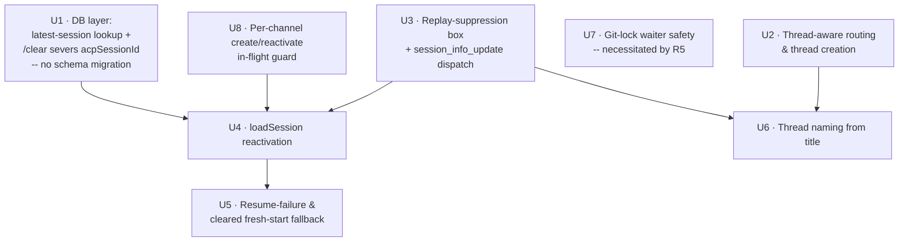

# feat: tdr-code thread-addressed agent sessions

## Overview

Today a `@lilnas/tdr-code` agent session is keyed by Discord **channel id** — one live conversation per channel, no parallelism, no deliberate return to an earlier conversation. This plan re-homes each conversation into its own **Discord thread**: a top-level `@mention` opens a thread and runs the session inside it; a mention inside that thread continues it. Because a Discord thread has its own channel id, the thread id simply *becomes* the session key — the entire channel-keyed runtime (`SessionManagerService`, `SqliteWriterService`, `live_status`, git identity, all `DiscordHandlerService` UI maps) keeps working with the thread id as its key. The audit in Phase 1 confirmed **14 of 15** channelId-keyed sites treat the id as an opaque snowflake and need no structural change.

(For DMs and non-threadable channels the key is simply the message's own channel id — the "inline fallback" — so the runtime is keyed by "thread id, or channel id when no thread exists"; both are opaque snowflakes to everything downstream.)

On top of re-keying, this plan adds **reactivation via ACP `loadSession`**: a dormant thread (idle-evicted, LRU-evicted, or lost to a bot restart) spawns a fresh agent, replays its persisted transcript with all replay events suppressed, and continues with full memory on the next mention. Combined, users get multiple parallel Claude Code conversations per channel, each visually isolated in a thread, each resumable indefinitely.

---

## Problem Frame

Everything keys off `channelId` in `SessionManagerService`, so a channel holds exactly one live conversation and there is no way to run parallel conversations or return to an earlier one (see origin: `docs/brainstorms/2026-07-01-tdr-code-thread-sessions-requirements.md`). Threads solve this cheaply because a thread carries its own channel id — the decision that makes this a re-keying + reactivation feature rather than a full re-architecture. The agent process is ephemeral (killed by idle-timeout, eviction, `/clear`, or bot restart), but `claude-agent-acp` persists each session's history as on-disk JSONL, and the DB already stores `acpSessionId` + `cwd` per session — the exact linkage `loadSession` needs to make ephemerality recoverable.

---

## Requirements Trace

- R1. A top-level `@mention` in a threadable channel creates a thread anchored to the mention message; the session runs entirely inside that thread and the mention text is turn 1. → **U2**
- R2. The session key is the thread's channel id; every existing per-`channelId` runtime site works unchanged with the thread id as its key. → **U2** (front door), validated by Phase 1 audit
- R3. A `@mention` inside an existing thread continues the session keyed by that thread id; no nested thread is created. → **U2**
- R4. In a DM (threads unsupported), the session runs inline keyed by the DM channel id. → **U2**
- R5. Multiple independent sessions may exist under the same parent channel at once, bounded only by the max-concurrent cap. → **U2**, **U4** (concurrency correctness precondition: **U7**)
- R6. The bot only acts on messages that `@mention` it, in threads and channels alike. → **U2** (existing early-return, extended coverage)
- R7. Each qualifying mention inside a thread is the next turn, queued behind any in-flight turn. → **U2** (existing `prompt()` queue, now thread-keyed)
- R8. A mention targeting a thread whose process is no longer live spawns a fresh agent and resumes via ACP `loadSession(acpSessionId, cwd)`. → **U1**, **U4**
- R9. If resume fails, the bot starts fresh in the same thread and posts a one-line notice that prior context was lost. → **U5**
- R10. While `loadSession` replay is in flight, all `session/update` notifications are suppressed (no Discord post, no SQLite write). → **U3**, **U4**
- R11. Idle-timeout and LRU eviction may tear down any non-active session silently, because reactivation restores it transparently. → **U4** (consumer), existing eviction preserved
- R12. The thread is named from the agent's session title via the ACP `session_info_update` notification, seeded with a truncated first-prompt placeholder. → **U3** (dispatch), **U6** (rename)
- R13. Max-concurrent-sessions and LRU eviction continue to apply unchanged, now counting/evicting thread-keyed sessions. → **U4** (no change beyond re-keying)
- R14. `/clear` inside a thread ends that thread's session, re-keyed to the thread id. → **U1**, **U5**

**Origin actors:** A1 (requesting Discord user(s), per-author git identity), A2 (Discord handler — routing/thread creation/rendering), A3 (ephemeral agent process), A4 (ACP JSONL transcript store).
**Origin flows:** F1 (start a session), F2 (continue a live session), F3 (reactivate a dormant session), F4 (resume-failure fallback).
**Origin acceptance examples:** AE1 (covers R1, R2), AE2 (covers R6), AE3 (covers R8, R10), AE4 (covers R9), AE5 (covers R5), AE6 (covers R4).

---

## Scope Boundaries

- **No session forking/branching** — sessions stay linear per thread (ACP exposes `unstable_forkSession`; not a goal).
- **No moving or merging sessions across threads** — a session is bound to the thread it was born in.
- **Mention-gating is not relaxed** — plain un-mentioned messages never trigger the bot, even inside a thread.
- **Creation model is fixed to always-thread** — promote-on-continue and opt-in-button models were considered and rejected upstream.
- **Private threads / per-session privacy config are out of scope for v1** (default public threads).
- **Resume across loss of `~/.claude` is out of scope** (host migration / containerization without a persistent volume) — a deployment concern.
- **"Quote an earlier message" disambiguation (v2)** — replying to an older bot message to prepend `Responding to: "<quoted>"` is deferred; the thread already gives the agent full context.
- **Worktree-per-session is not introduced** — the global git-write-lock stays turn-scoped (see Risks; this is the accepted tradeoff for parallel same-channel sessions).

### Deferred to Follow-Up Work

- **`/ce-compound` capture after landing:** ACP `loadSession`/resume + replay suppression, Discord thread creation/naming + rename rate limits, and thread-as-session-key re-keying are all absent from `docs/solutions/` and were pre-flagged as compound candidates. Capture once verified in production.

---

## Context & Research

### Relevant Code and Patterns

- **Session lifecycle:** `apps/tdr-code/src/agent/session-manager.service.ts` — `sessions = new Map<string, ManagedSession>()` keyed by channelId; `getOrCreate` → `createSession` (spawn → `initialize` → `newSession` → `insertSession`); `evictIfNeeded` (LRU, non-prompting only); `teardown(channelId, endReason='teardown')`; idle timer → `teardown(channelId, 'evicted')`.
- **Front door:** `apps/tdr-code/src/discord/discord-handler.service.ts` — `@On(Events.MessageCreate) onMessage` returns early unless `message.mentions.has(bot)`; `channelId = message.channelId` → `sessionManager.prompt(channelId, text, userId, images)`. **Zero thread primitives exist today** (no `startThread`/`isThread`/`parentId` anywhere in `src/`). Four per-channelId UI maps: `channelStates`, `clearedTurnId`, `typingIntervals`, `sendChains`.
- **ACP dispatcher:** `apps/tdr-code/src/agent/acp-client.ts` — `createAcpClient(channelId, handlers)` returns a `Client`; `sessionUpdate(params)` switches on `update.sessionUpdate` and handles only `agent_message_chunk`/`tool_call`/`tool_call_update`. **No default branch** — `session_info_update` and replayed chunks are already silently ignored, which is the seam for both R10 and R12.
- **Handler contract:** `apps/tdr-code/src/agent/agent.types.ts` — `AcpEventHandlers` interface (6 synchronous methods); fanned out by `apps/tdr-code/src/discord/composite-acp-handler.ts` (Discord + SQLite), wired via the `ACP_EVENT_HANDLERS` token.
- **Persistence:** `apps/tdr-code/src/discord/sqlite-writer.service.ts` — `channelState` map; `onPromptStart` re-seeds `turnIndexCounter = maxTurnIndex(db, sessionRowId)` **when `sessionRowId` changes**, so a reactivated session with a new row continues turn numbering correctly. Schema in `apps/tdr-code/src/db/schema.ts`; repos in `apps/tdr-code/src/db/sessions.repo.ts` (`getActiveSession` = newest WHERE `endedAt IS NULL`; **no "latest regardless of endedAt" query yet**).
- **Git identity:** `apps/tdr-code/src/agent/git-turn-context.ts` + `git-write-lock.ts` + `scripts/git` (PATH wrapper reads `TDR_CHANNEL_ID` → per-turn tmpfs identity dir). `globalGitWriteLock` is a **process-global** async mutex tracking its holder by channelId.
- **Test conventions:** Jest + ts-jest; global mocks in `apps/tdr-code/src/__tests__/setup.ts` (mocks `discord.js`, `@agentclientprotocol/sdk`, `necord`; `ChannelType` mock is only `{ GuildText: 0, DM: 1, GuildVoice: 2 }` — **no thread types**); helpers in `apps/tdr-code/src/__tests__/test-utils.ts`. Services mock the `DB` token; repos use the real in-memory DB via `apps/tdr-code/src/db/test-db.ts`.

### Institutional Learnings

No `docs/solutions/` entries are tdr-code-specific; the durable knowledge lives in prior plans:
- **`docs/plans/2026-07-01-001-feat-tdr-code-phase-c-config-git-identity-plan.md`** — the git-write-lock + tmpfs identity machinery this plan re-keys. Its Decision #4/#5 enumerate the **three teardown paths** (`executePrompt` finally, `teardown()`, raw `proc.on('error'/'exit')`) that each release the lock by holder id; all must stay consistent under thread-keying.
- **`docs/plans/2026-06-30-002-feat-tdr-code-phase-b-writers-plan.md`** — the synchronous SQLite writer (C1 invariant: making any handler `async` reopens the cancel-vs-drain race). Adding an event type there **required a migration widening `events_type_check`** (a leaf-table rebuild). This plan deliberately stays **migration-free** — reusing existing columns/event types — after a data-integrity review found that a `sessions` *parent*-table CHECK rebuild is unsafe under drizzle's single-transaction migrator (see Key Decisions, Risks).
- **`docs/plans/2026-06-27-001-feat-tdr-code-stop-clear-plan.md`** — the C1–C4 invariants and the cleared-channel guard. **C4** (service-global turn counter) and the `resetChannel`/`clearedTurnId` watermark become *more* load-bearing as eviction/reactivation churns sessions per thread.
- **`docs/solutions/conventions/type-guards-over-nonnull-assertions-on-db-rows-*.md`** and **`begin-immediate-for-read-then-write-mutations-*.md`** — house style: model "live vs dormant / resume-ok vs failed" as discriminated unions, not `!`/`as`; use IMMEDIATE for read-then-write (but its single-process cost model doesn't hold under the two-process bot/main split — keep write transactions short; WAL + `busy_timeout` already set).

### External References

- **Discord thread rename rate limit** ([discord.js #6651](https://github.com/discordjs/discord.js/issues/6651), [discord-api-docs #1900](https://github.com/discord/discord-api-docs/issues/1900)): **~2 renames per 10 minutes, per thread.** Critically, the failure mode is a **silent hang** — `ThreadChannel.setName()`'s promise may never resolve *or* reject when rate-limited. The limit is per-thread (renaming distinct threads is fine). This directly shapes U6: renames must be deduped, fire-and-forget, timeout-guarded, and never awaited on the turn path.
- **`@agentclientprotocol/sdk@0.15.0`** (installed; verified): `loadSession({ sessionId, cwd, mcpServers })` exists, gated on `agentCapabilities.loadSession?: boolean`, and **replays full history via `session/update` notifications** then resolves. `unstable_resumeSession` (no-replay) and `unstable_forkSession` exist but are experimental.

---

## Key Technical Decisions

- **Thread id as session key (no re-keying of internals):** the front door resolves a single id (thread id / DM channel id) and passes it into the existing `channelId`-parameterized runtime. Rationale: Phase 1 audit confirmed 14/15 sites treat the id as opaque; this is the decision that makes the feature cheap.
- **Reactivation lives in `SessionManagerService.getOrCreate`, not the router:** the router always calls `prompt(threadId, …)`; the session manager decides fresh-vs-resume. Rationale: keeps `DiscordHandlerService` ignorant of live/dormant state and localizes the resume path.
- **`loadSession` + replay suppression (not `unstable_resumeSession`):** honor the origin decision and use the stable, capability-advertised API; suppress replay rather than depend on an experimental no-replay method. Rationale: `unstable_resumeSession` requires an unconfirmed `session.resume` capability; replay suppression is cheap and needed as a safety net regardless. (See Alternatives.)
- **`/clear` severs resume by nulling `acpSessionId` (NOT a new endReason) — zero migrations:** the resume predicate is simply `acpSessionId != null && capability`, and `/clear` sets the channel's latest session row's `acpSessionId = NULL` so a cleared thread starts fresh while idle/evicted/restarted threads (linkage intact) reactivate. Rationale: the originally-considered `'cleared'` endReason would require widening `sessions_end_reason_check`, and **drizzle's migrator wraps all migrations in one transaction where `PRAGMA foreign_keys=OFF` is a no-op** — rebuilding the `sessions` *parent* table (unlike the safe leaf-table rebuild precedents) risks cascade-deleting the entire `turns`/`turn_content` corpus. `acpSessionId` is already nullable, so nulling it is a plain UPDATE — no schema change, no rebuild, and it directly encodes "not resumable" in the existing linkage column. `/clear`'s own reply already promises "next @mention starts fresh," so this is confirmed intent. (See Alternatives; Risks; verified endReason mapping: idle/LRU → `'evicted'`, `/clear`/shutdown/prompt-error → `'teardown'`, raw process death → `'interrupted'` — but we no longer discriminate on it.)
- **Observability via existing event types (no new types → no migration):** reactivation emits `session_created` with `context: { resumed: true }`; a resume-failure-then-fresh emits `session_created` with `context: { resumeFailed: true, reason }`. Rationale: distinct `session_reactivated`/`session_resume_failed` types would require widening `events_type_check` (a leaf-table rebuild — safe, but still an availability risk under the two-process migrator, see Risks). `events.context` is free-form JSON; overloading it keeps this feature migration-free. Distinct types deferred (see Alternatives).
- **Replay suppression via a per-spawn-attempt `replaying` box created BEFORE the ACP connection:** the SDK's receive loop is live from `Connection` construction (it can stream `session/update` during `initialize`, before any `ManagedSession` exists), so the suppression state must live in a stable holder — a fresh `{ replaying }` box per `createSession`/`reactivateSession` attempt — created *before* `createAcpClient` and passed only into that attempt's client, **not** a closure over the not-yet-registered session. Per-attempt (not per-channel) so a killed attempt's box can stay `true` to drop its own stragglers while a subsequent fresh attempt gets a clean `false` box. Set `replaying = true` before `initialize`; the single guard at `acp-client.ts::sessionUpdate` drops all agent-streamed `session/update` variants for both sinks (the composite fan-out sits below the dispatcher). **Scope note:** `onPromptStart`/`onPromptComplete` are fired *directly* by `SessionManagerService`, not through `sessionUpdate`, so the guard does NOT cover them — the invariant is that **`loadSession` replay opens no turn** (no `onPromptStart` until replay is done and the live prompt begins). The read is synchronous (no C1 violation).
- **Un-suppress on the live turn, not on `loadSession` resolution:** the ACP spec makes no ordering guarantee between the `session/load` response and the last replayed notification, so clearing `replaying` the instant `loadSession` resolves can leak a replay tail. Clear it synchronously immediately before the live `executePrompt`/`onPromptStart`, and rely on the existing "no open turn → drop event" backstop (SQLite writer's `currentTurnRowId` guard; Discord's `clearedTurnId` watermark) for any straggler. Rationale: gate on a positive live signal rather than a boolean racing the replay tail.
- **Reactivation creates a new `sessions` row (same `acpSessionId` + `cwd`) and MUST close the dangling prior row first:** rather than reopening the old row. Rationale: `sessions.generationId` is a restrict FK and turns are per-generation; a fresh row sidesteps cross-generation FK inconsistency after a restart, and the writer re-seeds turn numbering on `sessionRowId` change. The `sessions_active_lookup_idx` non-uniqueness is a *crash-recovery* tolerance, not a license to intentionally create two open rows — so closing the prior open row (`closeSession(prior.id, 'interrupted')`) must be **mandatory and close-first** (before inserting the new row, ideally same transaction), preserving "at most one open row per channel from normal operation."
- **Runtime capability gate + version verification:** the origin cited `claude-agent-acp@0.54.1`; the installed **client SDK is 0.15.0** and the agent wrapper is resolved at runtime via `npx`. Reactivation is gated on `initResult.agentCapabilities.loadSession` at each spawn; if absent → fresh-start fallback (R9). Rationale: the two versions are independent; trust the runtime handshake, not the doc's version string.
- **Non-threadable guild channel → inline fallback:** a guild channel that can't host threads (or where the bot lacks thread perms, or `startThread` throws) runs the session inline keyed by the channel id — the same path as the DM fallback. Rationale: preserves usability; unifies the two non-thread cases into one "inline" path.

---

## Open Questions

### Resolved During Planning

- **How to distinguish `/clear` from bot-restart for reactivation?** → `/clear` nulls the session row's `acpSessionId`; the resume predicate is `acpSessionId != null && capability`. This avoids a dangerous `sessions` parent-table CHECK-widening rebuild (see Key Decisions, Risks). Cleared → fresh; idle/evicted/restarted (linkage intact) → resume.
- **Where does replay suppression hook?** → A per-**spawn-attempt** `replaying` box (created *before* the ACP connection, since the SDK receive loop is live from construction), consulted at `acp-client.ts::sessionUpdate` (single point, upstream of both `session/update` sinks). Per-attempt (not per-channel) so a failed attempt's box can stay `true` while a fresh attempt gets a clean `false` box. `onPromptStart`/`onPromptComplete` bypass the dispatcher and are governed instead by the "replay opens no turn" invariant.
- **How to detect "process dead but resumable" at mention time?** → `sessions.has(threadId)` = live; else `getLatestSessionForChannel(db, threadId)` (new query) → resumable iff `acpSessionId != null` and the agent advertises `loadSession`.
- **`loadSession` vs `unstable_resumeSession`?** → `loadSession` + suppression (stable API, capability-advertised).
- **Non-threadable channel behavior?** → inline fallback (unified with DM path).
- **SDK version discrepancy (0.54.1 vs 0.15.0)?** → runtime capability gate resolves it; both SDK generations expose `loadSession`.

### Deferred to Implementation

- **Does `loadSession`'s promise resolve strictly *after* all replay `session/update` notifications are delivered?** The ACP spec does not guarantee this. The plan hedges by un-suppressing on the live turn (not on resolution) plus the "no open turn → drop" backstop; confirm the observed ordering at implementation and keep both guards.
- **Does the runtime `claude-agent-acp` wrapper actually advertise `loadSession: true`?** Confirm via a logged `initResult.agentCapabilities` at first spawn; the fresh-start fallback covers a `false`.
- **Exact `permissionsFor` flag names for thread creation** (`CreatePublicThreads`, `SendMessagesInThreads`) and the precise discord.js v14 `message.startThread` option set (`name`, `autoArchiveDuration`) — resolve against the installed discord.js types.
- **`autoArchiveDuration` default** for created threads (60 / 1440 / 4320 / 10080 min) — a UX choice; pick at implementation. Reactivation restores agent *memory* regardless of Discord's archive state; a *locked* thread still blocks output *delivery* (handled in U4).
- **Should the admin `teardown_channel` command also null `acpSessionId`** (force fresh, like `/clear`) rather than leaving it resumable? Low-stakes; default to leaving it resumable unless it feels wrong in use.
- **[Security] Who may `/clear` a thread session?** Public threads are readable/joinable by any server member, and `/clear` now *permanently* severs resume (nulls `acpSessionId`), a materially worse consequence than the pre-thread behavior (stop a live, still-reactivatable process). Recommended default: restrict `/clear` to the session originator (compare `interaction.user.id` to the session row's `triggeringUserId`) or the thread owner; decide before implementation. (Surfaced by security review.)
- **[Security] Reactivation-author git attribution.** Per-turn git identity is per-author (origin A1) — so if user B reactivates a thread user A created, B's turn commits as B. This is the intended per-turn model, but the multi-author-in-one-thread attribution should be stated in operator docs so it isn't mistaken for a bug. (Surfaced by security review.)

---

## High-Level Technical Design

> *This illustrates the intended approach and is directional guidance for review, not implementation specification. The implementing agent should treat it as context, not code to reproduce.*

### Front-door routing (U2)

```
onMessage(message):
  if author is bot or not message.mentions.has(botUser): return          # R6 mention-gate (existing)
  text, images ← strip mention markup, extract images
  channel ← message.channel

  if channel.isThread():                    key ← channel.id             # R3 continue in thread
  elif channel.isDMBased():                 key ← channel.id             # R4 DM inline
  elif channel.type ∈ {GuildText, GuildAnnouncement}
       and bot has CreatePublicThreads + SendMessagesInThreads:
     thread ← message.startThread({ name: truncate(text, ~90) })         # R1 create thread
     (on throw → key ← channel.id, inline fallback)                      # resilience
     key ← thread.id
  else:                                      key ← channel.id            # non-threadable → inline

  sessionManager.prompt(key, text, message.author.id, images)           # R7 queueing unchanged
```

Every top-level mention in a threadable channel **always** creates a new thread (R1/R5) — there is no "find my existing session in this channel" branch. Continuation happens only *inside* threads.

### Reactivation decision (U4) — `acpSessionId` linkage → fresh vs resume

| Latest session row for thread | Agent advertises `loadSession` | Action |
|---|---|---|
| none (never seen) | — | fresh `newSession` |
| `acpSessionId IS NULL` (severed by `/clear`) | — | fresh `newSession` (silent — expected after `/clear`) |
| `acpSessionId` present (idle/evicted/restarted — linkage intact) | yes | **reactivate** via `loadSession` |
| `acpSessionId` present but capability absent | no | fresh + notice (R9) |
| `acpSessionId` present, `loadSession` throws / transcript missing | yes | fresh + notice (R9) |

`endReason` is **not** consulted for this decision — `/clear` encodes "not resumable" by nulling `acpSessionId` (avoids a `sessions` parent-table rebuild; see Key Decisions).

### Reactivation + replay-suppression sequence (U3 + U4)

```mermaid
sequenceDiagram
  participant D as DiscordHandler (onMessage)
  participant SM as SessionManager
  participant AC as acp-client (sessionUpdate)
  participant H as Composite handlers (Discord+SQLite)
  participant A as Agent process

  D->>SM: prompt(threadId, text, userId)
  SM->>SM: getOrCreate → not live → getLatestSessionForChannel (acpSessionId present?)
  Note over SM: acpSessionId present & agent capable → reactivate
  SM->>SM: replaying[threadId] = true  (BEFORE the connection exists)
  SM->>A: spawn + new ClientSideConnection + initialize (read agentCapabilities.loadSession)
  A-->>AC: session/update during setup + replay ×N
  AC-->>AC: replaying? → drop (no Discord post, no SQLite write)  %% R10
  SM->>A: loadSession({ sessionId, cwd, mcpServers: [] })
  A-->>SM: loadSession resolves
  SM->>SM: close dangling prior open row; insert NEW row (same acpSessionId); emit session_created{resumed:true}
  SM->>SM: replaying[threadId] = false  (immediately before the live turn)
  SM->>H: onPromptStart (live turn opens — direct call, NOT via sessionUpdate)
  SM->>A: prompt({ sessionId, prompt })
  A-->>AC: session/update (live)
  AC->>H: onAgentMessageChunk / onToolCall …                       %% rendered + persisted
```

---

## Implementation Units



U1, U2, U3, U7, U8 are independent and can land in parallel/any order. U2 alone delivers thread isolation (dormant threads start fresh until U4). U4 depends on U1 (lookup + `/clear` sever), U3 (suppression), and U8 (in-flight guard — reactivation's seconds-long window makes concurrent-entry races common). U5 depends on U4. U6 depends on U2 (a thread to rename) and U3 (the dispatch case). U7 and U8 are concurrency hardening that R5 makes urgent (land before/with U4).

---

- U1. **DB layer: latest-session lookup + `/clear` severs `acpSessionId` (no schema migration)**

**Goal:** Add the repo primitives reactivation needs, and make `/clear` sever the resume linkage so a cleared thread starts fresh (not resumes) on the next mention — **without any schema change**.

**Requirements:** R8, R14

**Dependencies:** None

**Files:**
- Modify: `apps/tdr-code/src/db/sessions.repo.ts` (new `getLatestSessionForChannel(db, channelId): SessionRow | undefined` — newest by `createdAt DESC, id DESC`, **no `endedAt` filter**; new `clearAcpSessionId(db, channelId)` — blind-guarded UPDATE nulling `acp_session_id` for the channel's latest session row, live or dormant)
- Modify: `apps/tdr-code/src/discord/clear-command.service.ts` (call `clearAcpSessionId(db, channelId)` alongside `resetChannel` + `teardown`, so the linkage is severed whether or not a live session exists)
- Test: `apps/tdr-code/src/db/__tests__/sessions.repo.spec.ts` (real DB), `apps/tdr-code/src/discord/__tests__/clear-command.service.spec.ts`

**Approach:**
- **Deliberately migration-free.** `acp_session_id` is already nullable, so severing resume is a plain UPDATE — no CHECK-widening, no table rebuild. This avoids the P0 hazard that killed the `'cleared'`-endReason approach: drizzle's migrator runs all migrations in a single transaction where `PRAGMA foreign_keys=OFF` is a no-op, so rebuilding the `sessions` *parent* table (to widen its CHECK) risks cascade-deleting `turns`/`turn_content` (all prior rebuilds were leaf tables — no precedent for a parent rebuild). Reactivation then discriminates on `acpSessionId != null`, not `endReason`.
- `getLatestSessionForChannel` is the reactivation lookup: unlike `getActiveSession` it returns closed rows too, so the manager can read `acpSessionId` + `cwd` from an ended/orphaned session.
- `clearAcpSessionId` must target the channel's **latest** row regardless of `endedAt`, because `/clear` may run when the session is already dormant (no in-memory session → `teardown` early-returns, so severing can't be folded into `teardown`). Since the key is the thread id, this only affects that thread's rows. `/clear` must also invalidate any **pending reactivation** for the channel (U8's `cancelPending`) so a reactivation mid-replay doesn't re-link the just-nulled `acpSessionId`.

**Patterns to follow:** `getActiveSession` in `sessions.repo.ts` (ordering, `Db` free-function style); `closeSession`'s blind-guarded UPDATE returning `changes`; `type-guards-over-nonnull` for the returned row.

**Test scenarios:**
- Happy path: `getLatestSessionForChannel` returns the newest row for a channel even when its `endedAt` is set. *(real DB)*
- Happy path: with two closed rows + one open row for a channel, returns the one with the greatest `createdAt`/`id`. *(real DB)*
- Edge case: returns `undefined` when no session row exists for the channel.
- Happy path (covers R14): `clearAcpSessionId` nulls `acp_session_id` on the channel's latest row; a subsequent `getLatestSessionForChannel` shows `acpSessionId === null`. *(real DB)*
- Edge case: `clearAcpSessionId` on a channel with a *dormant* (ended) latest row still nulls its `acpSessionId` (proves the dormant-`/clear` path works). *(real DB)*
- Edge case: `clearAcpSessionId` on a channel with no session row is a no-op (returns 0 changes, no throw).
- Integration (covers R14): `/clear` → the channel's latest session row ends with `acpSessionId === null`, so U4's predicate treats it as non-resumable.

**Verification:** New queries pass against the real test DB; after `/clear` (live or dormant), the channel's latest row has `acpSessionId === null`; no migration file is added.

---

- U2. **Thread-aware routing & thread creation (front door)**

**Goal:** Route each mention to the correct session key — create a thread for top-level mentions, continue inside existing threads, fall back to inline for DMs and non-threadable channels.

**Requirements:** R1, R3, R4, R5, R6, R7

**Dependencies:** None

**Files:**
- Modify: `apps/tdr-code/src/discord/discord-handler.service.ts` (`onMessage` routing: thread/DM/threadable/non-threadable branching; `startThread` with truncated-prompt placeholder name; perm check; try/catch → inline fallback)
- Modify: `apps/tdr-code/src/__tests__/setup.ts` (add thread `ChannelType`s: `GuildAnnouncement: 5`, `AnnouncementThread: 10`, `PublicThread: 11`, `PrivateThread: 12`, `GuildForum: 15`; extend the `discord.js` mock so channels expose `isThread()`/`isDMBased()` and messages expose `startThread()`; add `PermissionFlagsBits`)
- Modify: `apps/tdr-code/src/__tests__/test-utils.ts` (`createMockThreadChannel(overrides)`; extend `createMockMessage` with `startThread` + `channel` reference + `mentions.has`)
- Test: `apps/tdr-code/src/discord/__tests__/discord-handler.service.spec.ts`

**Approach:**
- Resolve a single `key` (thread id or channel id) then call the **unchanged** `sessionManager.prompt(key, …)`. All downstream state is opaque-keyed (Phase 1 audit), so output renders in the thread automatically because `fetchChannel(key)` resolves the thread.
- Always-thread: a top-level mention in a threadable channel creates a *new* thread every time — no "continue my channel session" branch (R5/AE5).
- Mention-gate (R6) is the existing early-return; it already covers threads. Discord replies auto-mention, so replying naturally continues a thread.
- Thread creation is resilient: missing perms or a `startThread` throw degrade to inline (never drop the user's turn).
- **Typing indicator must follow the resolved key, not the parent.** Today `onMessage` calls `startTyping(message.channelId)` before routing; after thread creation the session key is the thread id, so `onPromptComplete → stopTyping(threadId)` would never clear the *parent* channel's 8s typing interval → a perpetual "typing…" leak in the parent. Move `startTyping`/`stopTyping` (and the queued/error-path stop calls) onto the resolved `key` so start/stop are symmetric.
- **Thread name seeding:** strip mention markup first, then truncate the prompt at a word boundary to ≤100 chars (Discord's limit; seed ~90 to leave headroom). If the stripped prompt is empty (bare ping), use a non-empty fallback (e.g. `"New session"`) — Discord rejects empty thread names. U6 later replaces this with the real title.
- **Parent-channel acknowledgment:** for v1, rely on Discord's native "started a thread" system message in the parent (no extra bot post) as the navigation cue — state this explicitly so implementers don't add an inconsistent parent reply.

**Patterns to follow:** existing `onMessage` structure, `startTyping`/`stopTyping`/`typingIntervals`, and `extractImages`/mention-strip logic in `discord-handler.service.ts`; the local `createMockClient(channelMap)` + private-state-cast test style in `discord-handler.service.spec.ts`.

**Test scenarios:**
- Happy path (covers AE1, R1/R2): top-level mention in a mocked GuildText channel → `startThread` called with a truncated-name option → `sessionManager.prompt` called with the **thread** id, not the parent channel id.
- Happy path (covers R3): mention inside a `PublicThread` (`isThread()===true`) → no `startThread`; `prompt` called with the thread id.
- Happy path (covers AE6, R4): mention in a DM (`isDMBased()===true`) → no `startThread`; `prompt` called with the DM channel id.
- Happy path (covers AE5, R5): two top-level mentions on two different messages in the same channel → `startThread` called twice → two distinct thread ids passed to `prompt`.
- Edge case: non-threadable guild channel (e.g. `GuildVoice`) or bot lacking `CreatePublicThreads` → no `startThread`; inline fallback with the channel id.
- Error path: `message.startThread` rejects → caught → inline fallback with the channel id; the turn is still submitted.
- Edge case (covers AE2, R6): non-mention message in a thread → early return, `sessionManager.prompt` never called.
- Edge case: bare-ping mention (empty after mention-strip) → thread created with the `"New session"` fallback name (never an empty name).
- Edge case (typing symmetry): a completed turn in a thread leaves **no** lingering typing interval on the parent channel (proves `startTyping` moved to the resolved key).

**Verification:** In-thread and top-level mentions route to the right key; DMs and non-threadable channels never call `startThread`; no un-mentioned message triggers a turn; no orphaned parent-channel typing indicator; thread names are always non-empty and ≤100 chars.

---

- U3. **Replay-suppression flag + `session_info_update` dispatch**

**Goal:** Give the ACP dispatcher a single, synchronous suppression gate and a route for the session-title notification, without touching the C1 hot path.

**Requirements:** R10, R12 (dispatch half)

**Dependencies:** None

**Files:**
- Modify: `apps/tdr-code/src/agent/agent.types.ts` (add `onSessionInfoUpdate(channelId, title)` to `AcpEventHandlers`)
- Modify: `apps/tdr-code/src/agent/acp-client.ts` (`createAcpClient(channelId, handlers, isReplaying?: () => boolean)`; guard the top of `sessionUpdate` with `if (isReplaying?.()) return`; add a `case 'session_info_update'` → `handlers.onSessionInfoUpdate(channelId, title)`)
- Modify: `apps/tdr-code/src/discord/composite-acp-handler.ts` (fan `onSessionInfoUpdate` to both handlers)
- Modify: `apps/tdr-code/src/discord/sqlite-writer.service.ts` (`onSessionInfoUpdate` no-op — no title column in v1)
- Modify: `apps/tdr-code/src/discord/discord-handler.service.ts` (`onSessionInfoUpdate` stub; real rename lands in U6)
- Test: `apps/tdr-code/src/agent/__tests__/acp-client.spec.ts` (create if absent)

**Approach:**
- `createAcpClient` takes an `isReplaying?: () => boolean` predicate. The read is synchronous (a boolean check) — no `await`, no C1 violation. Because the composite fan-out sits below `sessionUpdate`, one guard suppresses both Discord and SQLite for every agent-streamed `session/update` variant (R10).
- **Predicate must resolve via a stable holder, not the session object.** The SDK's receive loop is live from `ClientSideConnection` construction and can stream `session/update` during `initialize` — *before* any `ManagedSession` exists. So the predicate must read from a holder that exists before `createAcpClient` is called (a per-channel `{ replaying }` box or a `Map<channelId, …>` owned by `SessionManagerService`); U3 only defines the predicate parameter and the guard, U4 owns the box and its lifecycle. A closure over the not-yet-registered session would read `undefined` (falsy → not suppressed).
- **Scope note (important):** this guard covers only `session/update`. `onPromptStart`/`onPromptComplete` are fired *directly* by `SessionManagerService` (not through `sessionUpdate`), so they are **not** gated here — the governing invariant (enforced in U4) is that `loadSession` replay opens no turn.
- `session_info_update` was previously ignored (no default branch); the new case extracts the title and forwards it. During replay it is dropped along with everything else — fine, since a reactivated thread already has its name.

**Patterns to follow:** the existing `switch (update.sessionUpdate)` in `acp-client.ts`; synchronous handler discipline (never `async`) documented across the ACP handlers; the 6-method `AcpEventHandlers` implementation pattern across composite/discord/sqlite.

**Test scenarios:**
- Happy path: `sessionUpdate({ agent_message_chunk })` with `isReplaying()===false` → `handlers.onAgentMessageChunk` called.
- Happy path (covers R10): same event with `isReplaying()===true` → **no** handler method called (both sinks suppressed via the single gate).
- Happy path (covers R10): `tool_call` and `tool_call_update` are also suppressed while replaying (proves the gate covers tool events, not just message chunks — see U4's turn-index reseed dependency).
- Happy path (covers R12 dispatch): `sessionUpdate({ session_info_update, title })` → `handlers.onSessionInfoUpdate(channelId, title)` called with the title.
- Edge case: `session_info_update` while replaying → suppressed (no `onSessionInfoUpdate`).
- Edge case: `isReplaying` undefined (not passed) → behaves as non-replaying (all events dispatched).
- Edge case: a predicate that flips `true→false` between two calls suppresses the first and dispatches the second (proves the guard reads live holder state each call, not a captured value).
- Integration: composite `onSessionInfoUpdate` forwards to both Discord and SQLite handlers.

**Verification:** With the box's `replaying` on, no `session/update` reaches any handler; with it off, all handled variants dispatch as before; `session_info_update` reaches the new handler method; the predicate reflects live holder state.

---

- U4. **`loadSession` reactivation in `SessionManagerService`**

**Goal:** When a mention targets a thread whose process isn't live, spawn a fresh agent and restore full context via `loadSession` with replay suppressed, then run the mention as the next turn.

**Requirements:** R8, R10, R11, R13

**Dependencies:** U1 (lookup + `/clear` sever), U3 (suppression predicate + dispatch), U8 (in-flight guard — required for correctness under concurrent mentions)

**Files:**
- Modify: `apps/tdr-code/src/agent/session-manager.service.ts` (`getOrCreate` branches live → reactivate → fresh, under U8's in-flight guard; new `reactivateSession(channelId, userId)`; a **per-spawn-attempt** `replaying` box created before the connection; pass `() => box.replaying` into `createAcpClient`; capability check from `initResult.agentCapabilities.loadSession`; emit `session_created` with `context.resumed`)
- Test: `apps/tdr-code/src/agent/__tests__/session-manager.service.spec.ts`

**Approach:**
- `getOrCreate(channelId, userId)` (inside U8's in-flight guard): if in `sessions` map → return (live, F2). Else `getLatestSessionForChannel`: resumable iff `acpSessionId != null` → `reactivateSession`; else → existing `createSession` (fresh). No `endReason` check — `/clear` already nulled `acpSessionId` (U1).
- **Suppression lifecycle (order matters):** the `replaying` box is **per-spawn-attempt, not per-channel** (a fresh box per `createSession`/`reactivateSession` call, passed only into that attempt's `createAcpClient`) — so a killed attempt's box stays `true` and drops its own stragglers while a subsequent fresh attempt gets a new box defaulting to `false` (fixes the fresh-after-failed-resume ambiguity). **Set `replaying = true` BEFORE constructing `ClientSideConnection`** (the SDK receive loop is live from construction and can stream setup/replay `session/update` before any session exists). Sequence: new box (true) → spawn → `new ClientSideConnection` (with `() => box.replaying`) → `initialize` (capture `imageCapable`; read `agentCapabilities.loadSession`) → if capability absent → hand off to U5 → else `connection.loadSession({ sessionId: oldAcpSessionId, cwd, mcpServers: [] })` → **re-check `getLatestSessionForChannel(channelId).acpSessionId != null` and that U8 hasn't cancelled this attempt** (a `/clear` may have landed mid-replay) → **close the dangling prior open row (mandatory, close-first) then insert the new `sessions` row** (same `acpSessionId` + `cwd`) → emit `session_created{ resumed: true }` → register `ManagedSession` → set `box.replaying = false` **immediately before** the live `executePrompt` (which fires `onPromptStart`). Do not clear it on `loadSession` resolution (avoids the replay-tail race, F5); the "no open turn → drop" backstop covers any straggler.
- **Invariant: replay opens no turn.** No `onPromptStart`/`onPromptComplete` is fired between `loadSession` start and the live turn, so the direct (non-`sessionUpdate`) handler path emits nothing during replay.
- **Closing the dangling prior row is mandatory and close-first** (`closeSession(prior.id, 'interrupted')` before the new insert, ideally same transaction) — the non-unique active index is a crash tolerance, not a license to create two open rows in normal operation. U8 guarantees only one reactivation runs at a time, so the close+insert is not racing a sibling attempt.
- R11: eviction/idle teardown stays silent — LRU only evicts non-prompting sessions and idle only fires when not prompting, so no in-flight "aborted" message; reactivation restores transparently. R13: the cap counts live map entries; dormant threads don't count → eviction is nearly free.
- No git lock is held during spawn/initialize/loadSession (replay touches no git); the lock is acquired only when the post-replay `executePrompt` reaches its `acquire`. `evictIfNeeded` cannot steal a live lock (it only evicts non-prompting sessions; the lock is prompting-scoped).
- **Output delivery vs. memory:** reactivation restores agent *memory* regardless of Discord archive state, but *delivery* still requires a writable thread — a **locked** (or un-unarchivable) thread makes every `channel.send` throw (swallowed by the pervasive `.catch`), so a resumed turn would consume the git lock and silently drop all output. Before running a reactivated turn, detect a locked/undeliverable thread and post a "reopen this thread to continue" notice via a writable surface (or refuse the turn) rather than working silently.
- **"Resuming…" feedback is a decision, not deferred:** during the spawn+replay window (seconds for a long transcript, all `session/update` suppressed), maintain a Discord **typing indicator** on the resolved thread (reuse the `typingIntervals` mechanism) so the user isn't left in silence; an optional "🔄 Resuming…" message may be added but the typing indicator is the baseline.

**Execution note:** Reactivation is the highest-risk seam (concurrency + resume). Start with a failing test that drives a dormant→reactivate turn end-to-end (mocked `connection.loadSession` + `prompt`), asserting `replaying` is already `true` before the connection is constructed and only flips `false` at the live turn.

**Patterns to follow:** `createSession` (spawn/initialize/`newSession`/`insertSession` sequence, `imageCapable` capture, `proc.on('error'/'exit')` cleanup); the `session as unknown as { sessions: Map }` + plain-object `connection` mock in `session-manager.service.spec.ts`.

**Test scenarios:**
- Happy path (covers AE3, R8): thread not in map, latest row has `acpSessionId`, capability true → `loadSession` called with that `sessionId`/`cwd`; the dangling prior open row is closed; a new `sessions` row is inserted with the same `acpSessionId`; the mention runs as the next turn.
- Happy path (covers R10): the `replaying` box is `true` before `ClientSideConnection` is constructed, stays `true` across `initialize`+`loadSession`, and flips `false` only immediately before `executePrompt`/`onPromptStart` — asserted via the predicate passed to `createAcpClient`.
- Edge case (covers R14): latest row has `acpSessionId === null` (post-`/clear`) → fresh `newSession`, `loadSession` **not** called.
- Edge case: thread **is** in the map (live) → no `loadSession`, no spawn; existing `prompt`/queue path (F2/R7).
- Edge case: no prior session row → fresh `newSession`.
- Edge case (R13): reactivation at the cap → `evictIfNeeded` runs first before spawning.
- Integration (turn-index reseed): after a reactivation whose replay contains N tool calls + M message chunks, `turn_content` for the new session row has **zero** replay rows and the first *live* turn gets `turn_index = 1` (not N+1) — proves the gate covers tool events and the writer re-seeds on the new `sessionRowId`.
- Integration (stale Stop button / C4): teardown a session at turn N (its Stop button still rendered) → reactivate the thread → the new turn mints N+k > N → clicking the stale N button is a no-op and does not cancel the fresh turn; the `clearedTurnId` watermark is cleared by the reactivated turn's `onPromptStart`.
- Race (replay tail, F5): an agent that emits one trailing `agent_message_chunk` *after* the `loadSession` response resolves → the straggler is dropped (not posted/persisted), because `replaying` is still true until the live turn opens and the "no open turn" backstop covers the boundary.
- Race (covers R14): `/clear` lands mid-replay (nulls `acpSessionId`, cancels the pending attempt via U8) → the reactivation's pre-insert re-check aborts: no new `sessions` row, no re-link of the nulled `acpSessionId`, the thread starts fresh on the next mention.
- Edge case (per-attempt box): a failed reactivation leaves its box `true`; the subsequent fresh `createSession` uses a brand-new box (`false`) so its live output is **not** suppressed.
- Edge case (locked thread): a reactivated turn against a locked/undeliverable thread posts a "reopen to continue" notice (or refuses) rather than acquiring the git lock and dropping all output silently.
- Error/handoff: capability `loadSession === false` → delegates to the U5 fresh+notice path (no `loadSession` call).

**Verification:** A dormant thread reactivates with `loadSession`, nothing from the replay (including a trailing straggler) is posted or persisted, exactly one open `sessions` row per channel exists after reactivation, and the mention runs as the next turn; live threads bypass reactivation entirely.

---

- U5. **Resume-failure & cleared fresh-start fallback**

**Goal:** When resume can't happen, start fresh in the same thread — with a one-line notice on genuine failure, silently on `/clear`.

**Requirements:** R9, R14

**Dependencies:** U4

**Files:**
- Modify: `apps/tdr-code/src/agent/session-manager.service.ts` (`reactivateSession` failure paths: `loadSession` throws, capability absent, or transcript missing → clean up the half-spawned agent, `createSession` fresh, signal the notice; emit `session_created` with `context.resumeFailed`)
- Modify: `apps/tdr-code/src/discord/discord-handler.service.ts` (a one-line notice, e.g. `⚠️ Couldn't restore the earlier conversation — starting fresh.`, posted into the thread; surfaced via a `prompt()` return variant)
- Test: `apps/tdr-code/src/agent/__tests__/session-manager.service.spec.ts`, `apps/tdr-code/src/discord/__tests__/discord-handler.service.spec.ts`

**Approach:**
- Two fresh-start reasons: `/clear` (expected — `acpSessionId` was null, so `getOrCreate` never enters reactivation → silent, no notice) vs resume-failure (unexpected — notice + `session_created{ resumeFailed: true, reason }`). Both converge on `createSession`.
- **Notice text + ordering:** post a fixed, channel-visible one-line notice — `⚠️ Couldn't restore the earlier conversation — starting fresh.` — into the thread **from within `reactivateSession`, before handing off to `createSession`**, so it precedes the fresh turn's output. (Do *not* surface it via a `prompt()` return discriminant: `prompt()` resolves only after the fresh turn completes, so the notice would land *after* the agent's reply — counter-intuitive.) The notice is public (ephemeral interaction replies aren't available for a message-triggered turn).
- **Half-spawn cleanup (must be complete):** on this path the agent never entered `executePrompt`, so (a) **no git lock is ever held** — `gitTurnContext.abort`/`releaseIfHeldBy` are belt-and-suspenders no-ops here, and the plan should not imply they do real work; (b) kill the process tree; (c) **`markExited` the `claude_process` PGID row** if one was recorded during the half-spawn (else it lingers as a live-looking process); (d) the failed attempt's **per-spawn-attempt `replaying` box stays `true`** so any late replayed `session/update` from the dying connection is dropped; the fresh `createSession` gets a *new* box (default `false`) so its live output is never suppressed; (e) do **not** insert a `sessions` row for the failed reactivation.

**Patterns to follow:** the existing `prompt()` result-discriminant handling in `onMessage` (`queued`, `no_image_support`, busy-error → `reply`); `killProcessTree`/`markExited` in `teardown`; the `resolveIdentity` `decrypt_failed`/`unconfigured`/configured discriminated-union style.

**Test scenarios:**
- Happy path (covers AE4, R9): resumable row but `connection.loadSession` rejects → fresh `newSession` in the same thread; a one-line notice is emitted; a `session_created{ resumeFailed: true }` event is written.
- Edge case (R9): agent reports `loadSession` capability `false` → fresh + notice (no `loadSession` call).
- Edge case (covers R14): `acpSessionId === null` (post-`/clear`) → fresh start with **no** notice and **no** `resumeFailed` event (never enters the failure path).
- Error path (F8): the failed half-spawned agent is cleaned up — process tree killed, its `claude_process` row `markExited`, no `sessions` row inserted, no orphaned process; git lock was never held.
- Error path (F8): a late replayed `session/update` arriving after the kill is dropped (no orphan channel state, no SQLite write).
- Integration: after a resume-failure fresh start, the next mention reactivates normally — one failure doesn't permanently disable resume for the thread.

**Verification:** A missing/broken transcript yields a fresh session plus exactly one notice; `/clear` yields a fresh session with no notice; no orphaned processes, `claude_process` rows, or held locks after a failed resume; late post-kill notifications are dropped.

---

- U6. **Thread naming from session title**

**Goal:** Name each thread from the agent's own session title, seeded with a truncated first-prompt placeholder, respecting Discord's rename rate limit and silent-hang failure mode.

**Requirements:** R12

**Dependencies:** U2 (thread exists + placeholder seed), U3 (`onSessionInfoUpdate` dispatch)

**Files:**
- Modify: `apps/tdr-code/src/discord/discord-handler.service.ts` (implement `onSessionInfoUpdate(channelId, title)` → fetch the thread, `setName` with dedupe + rate-limit-safe handling; track last-applied title + last-rename time per thread)
- Test: `apps/tdr-code/src/discord/__tests__/discord-handler.service.spec.ts`

**Approach:**
- Seed: U2 creates the thread with `name = truncate(firstPrompt)`; this unit updates it to the real title when `session_info_update` arrives.
- **Rate-limit safety (external research):** Discord allows ~2 renames per 10 min *per thread* and — critically — a rate-limited `setName()` **silently hangs** (never resolves/rejects). So: (1) skip if the new title equals the last applied title (dedupe); (2) **fire-and-forget** — never `await` `setName` on any turn-processing path; (3) wrap in a timeout so a hung promise can't leak; (4) throttle to at most one rename per thread per ~5+ min, dropping intermediate title changes (last-write-wins on the next allowed slot); (5) **exempt the first rename** (placeholder → real title) from the throttle — it's the rename users are most likely to notice and it spends the first, always-available quota slot. Catch and swallow errors.
- **Accepted UX lag:** after the first rename, a title that changes again within the throttle window keeps the earlier name until the next slot — a deliberate tradeoff, not a bug (recorded so it isn't re-filed post-launch).
- Only fetch/rename actual threads (guard on `isThread()`); a title update for an inline/DM session is a no-op.

**Patterns to follow:** `fetchChannel(channelId)` in `discord-handler.service.ts`; the per-channel timer/dedupe style of `typingIntervals`/`clearedTurnId`; `.catch(() => {})` best-effort Discord calls used throughout the handler.

**Test scenarios:**
- Happy path (covers R12): `onSessionInfoUpdate(threadId, "Refactor auth module")` → thread `setName` called once with the title.
- Edge case (dedupe): a second `onSessionInfoUpdate` with the **same** title → `setName` not called again.
- Edge case (throttle): two distinct titles within the throttle window → at most one `setName` in the window; the later title wins on the next slot.
- Edge case (silent hang): `setName` returns a never-settling promise → the handler returns promptly (fire-and-forget + timeout); no unhandled rejection, turn processing unaffected.
- Edge case: `onSessionInfoUpdate` for a non-thread (DM/inline) channel → no `setName`.
- Error path: `setName` rejects (e.g. missing Manage Threads) → caught/swallowed; no crash.

**Verification:** A thread's name updates to the agent's title at most as often as the rate limit allows, duplicate titles never re-issue a rename, and a rate-limited/hung `setName` never blocks or crashes the handler.

---

- U7. **Git-lock waiter safety under parallel same-channel sessions**

**Goal:** Prevent a session parked on the git-write-lock `acquire` from being idle-torn-down and orphaning its queued grant — a pre-existing race that R5 (many concurrent threads contending one process-global lock) turns from rare into common.

**Requirements:** R5 (correctness precondition), R13

**Dependencies:** None (standalone hardening; best landed before/with U4)

**Scope note:** this fixes a *pre-existing* bug (present in the single-session world but nearly unreachable there); R5 makes it common. It is cleanly separable — consider landing it as its own bug-fix PR *before* the feature so the thread-sessions work stays atomic and independently revertable. Kept in this plan because shipping R5 without it is unsafe.

**Files:**
- Modify: `apps/tdr-code/src/agent/git-write-lock.ts` (add a `cancelWaiter(channelId)` that splices a queued waiter out of the internal `queue`; today `releaseIfHeldBy` only touches the *holder*, never the queue)
- Modify: `apps/tdr-code/src/agent/session-manager.service.ts` (do not let the idle timer fire against a prompting/parked session: clear the idle timer when a turn starts prompting and re-arm only on drain/completion; on `teardown` of a session that is parked on `acquire`, call `cancelWaiter(channelId)`)
- Test: `apps/tdr-code/src/agent/__tests__/git-write-lock.spec.ts`, `apps/tdr-code/src/agent/__tests__/session-manager.service.spec.ts`

**Approach:**
- The hazard (verified): `executePrompt` sets `prompting = true` and fires `onPromptStart`, *then* awaits `globalGitWriteLock.acquire`. If another thread holds the lock for a long turn, this session parks in the queue while `prompting`. Its idle timer (armed in `prompt()`) can fire `teardown('evicted')` while parked; `teardown`→`releaseIfHeldBy` is a no-op (it doesn't hold the lock), so its queue entry survives — when the holder releases, the lock is briefly granted to the now-dead session (blocking the next real waiter, writing tmpfs identity post-teardown, then throwing on a dead connection).
- Primary fix: **a prompting session is by definition not idle** — clear the idle timer while a turn is in flight (including while parked on `acquire`), re-arming on drain. Secondary fix: `cancelWaiter` makes teardown of a parked session remove it from the lock queue cleanly (defense in depth).
- This is the concurrency correctness precondition for R5; without it, common same-channel contention leaks a ghost lock holder.

**Execution note:** Characterization-first — add a failing test reproducing the parked-waiter idle-teardown (Thread A holds the lock; Thread B parks; fire B's idle timeout) before changing the timer/lock logic.

**Patterns to follow:** the existing `GitWriteLock` queue/`grant` mechanics and `releaseIfHeldBy` in `git-write-lock.ts`; the `startIdleTimer`/`resetIdleTimer`/`clearTimeout(session.idleTimer)` handling in `session-manager.service.ts`; the contention-at-the-real-acquire testing style from `docs/solutions/conventions/atomicity-tests-must-reach-the-write-phase-*.md`.

**Test scenarios:**
- Happy path: `cancelWaiter(channelId)` removes a queued waiter; when the holder releases, the lock passes to the *next* real waiter (or goes idle), never to the cancelled one.
- Edge case: `cancelWaiter` for a channel that is the current holder (not queued) is a no-op; for an unknown channel is a no-op.
- Integration (the core race): Thread A holds the lock; Thread B's turn parks on `acquire`; fire B's idle-timeout → B is removed from the queue and its process killed; when A releases, the lock does **not** transiently pass to dead B.
- Edge case: idle timer does not fire against a session while it is prompting/parked (proves the primary fix); it re-arms after the turn drains.
- Edge case: normal (uncontended) turn still acquires/releases and re-arms the idle timer exactly as before (no regression).

**Verification:** Under contention, an idle-timed-out parked session is cleanly removed from the lock queue with no ghost grant, no post-teardown tmpfs writes, and no spurious dead-connection error; uncontended turns behave unchanged.

---

- U8. **Per-channel session-creation / reactivation in-flight guard**

**Goal:** Serialize `getOrCreate` per channel so a second mention arriving during a create/reactivate — whose window is *seconds long* for reactivation (spawn + full replay) — awaits the same in-flight attempt instead of spawning a parallel agent, and so `/clear`/teardown can invalidate a pending reactivation.

**Requirements:** R5 (correctness precondition), R8, R14

**Dependencies:** None (structural prerequisite for U4; also fixes a latent fresh-create race)

**Files:**
- Modify: `apps/tdr-code/src/agent/session-manager.service.ts` (a `Map<channelId, Promise<ManagedSession>>` of pending creates/reactivations; `getOrCreate` returns the pending promise if one exists, else registers a new one; clear the entry on settle; a `cancelPending(channelId)`/abort hook for teardown/`/clear`)
- Modify: `apps/tdr-code/src/discord/clear-command.service.ts` (invalidate any pending reactivation for the channel before/with `clearAcpSessionId` + `teardown`)
- Test: `apps/tdr-code/src/agent/__tests__/session-manager.service.spec.ts`

**Approach:**
- Today `getOrCreate` is `existing? → return; else evictIfNeeded(); createSession(...)` with **no in-flight guard** — the session is registered in the map only *after* the full async setup, so two near-simultaneous mentions both see an empty map and both spawn. This is latent for fresh create (millisecond window) but acute for reactivation (the replay window is seconds long, and R5 makes multiple mentions-per-thread common).
- The pending-promise map closes both: the first mention registers a pending entry; concurrent mentions await it; the entry clears on resolve/reject. This makes U4's "close dangling row + insert new row" safe (only one reactivation runs) and preserves "at most one open row per channel."
- **`/clear`/teardown during a pending reactivation:** `cancelPending(channelId)` marks the in-flight attempt aborted so that, when its `loadSession` resolves, it does **not** insert a new `sessions` row or register the session (it kills the half-spawned agent instead — reuses U5 cleanup). Combined with U4's "re-check `acpSessionId != null` immediately before inserting the new row," a `/clear` that lands mid-replay reliably forces fresh (R14) instead of silently re-linking the just-nulled `acpSessionId`.

**Execution note:** Characterization-first — add failing tests for (a) two concurrent mentions on a dormant thread producing exactly one spawn/one open row, and (b) `/clear` during reactivation forcing fresh, before adding the guard.

**Patterns to follow:** the existing `getOrCreate`/`createSession` structure and `sessions` map in `session-manager.service.ts`; the `sendChains` per-channel promise-chaining pattern in `discord-handler.service.ts` (an existing in-repo example of per-key promise serialization).

**Test scenarios:**
- Integration (covers R5): two `prompt(threadId, …)` calls in the same tick on a dormant thread → exactly one spawn, one `loadSession`, one new open `sessions` row; the second awaits and runs as the next queued turn.
- Integration: two concurrent mentions on a never-seen channel (fresh create) → one `createSession`, one session row (proves the latent fresh-create race is also closed).
- Edge case (covers R14): `/clear` fires while a reactivation is mid-replay → the pending reactivation is cancelled (no new row, half-spawn killed), `acpSessionId` stays null, the next mention starts fresh.
- Edge case: the pending entry is cleared after both success and failure (no permanent "stuck pending" that blocks all future mentions for the channel).
- Edge case: a mention for a *live* (already-registered) session bypasses the guard entirely (existing fast path).

**Verification:** Concurrent mentions on one channel never spawn two agents or two open rows; a `/clear` during reactivation forces fresh; the pending map never leaks a stuck entry.

---

## System-Wide Impact

- **Interaction graph:** the only new entry-point behavior is in `onMessage` (thread creation/routing) and `SessionManagerService.getOrCreate` (reactivate branch). ACP events gain one suppression gate (`acp-client.ts`) and one new route (`session_info_update`). Everything downstream is unchanged and opaque-keyed.
- **Git-write-lock serialization (important tradeoff + correctness fix):** `globalGitWriteLock` is process-global and **turn-scoped** — it serializes the *start* of every git-touching turn across all sessions. This plan deliberately makes concurrent sessions common within one parent channel (R5), so two threads can no longer run git-touching turns simultaneously; one waits. Accepted for v1 (worktree-per-session is the scoped-out escape hatch). Two consequences: (1) the three lock-release paths (`executePrompt` finally, `teardown`, raw `proc.on('error'/'exit')`) must all use the thread id consistently — a mismatch is a permanent cross-thread deadlock; (2) a session **parked** on `acquire` can be idle-torn-down and orphan its queued grant — R5 makes this common, so **U7** adds a `cancelWaiter` + idle-timer-off-while-prompting fix. Note eviction itself cannot steal a *live* lock: LRU only evicts non-prompting sessions and the lock is prompting-scoped.
- **Reactivation holds no lock during replay:** spawn/initialize/`loadSession` run with no git lock held (replay touches no git); the lock is acquired only when the post-replay `executePrompt` reaches its `acquire`.
- **In-flight session-creation window:** because a session registers in the `sessions` map only *after* setup completes (seconds long for reactivation's replay), `getOrCreate` needs the U8 in-flight guard so concurrent mentions don't spawn parallel agents, and `teardown`/`/clear` must be able to cancel a *pending* (not-yet-registered) reactivation — not just a live session. This is the concurrency backbone that keeps "one open row per channel" and "`/clear` starts fresh" true under R5.
- **Output delivery is separate from memory restoration:** reactivation restores agent memory regardless of Discord archive state, but a locked/undeliverable thread still swallows all sends — U4 guards against silently consuming a turn (and the git lock) with no visible output.
- **Authorization surface (new):** routing `/clear` and turns by thread id means any public-thread member can invoke them; `/clear` now permanently severs resume. The authorization model for `/clear` is an open decision (see Open Questions / Operational Notes) — the thread model widens who can affect a session.
- **Error propagation:** resume failure degrades to a fresh session + notice (R9); thread-creation failure degrades to inline (U2); a hung `setName` is contained (U6). No failure drops the user's turn.
- **State lifecycle risks:** the `replaying` box must be set *before* the ACP connection is constructed and cleared only at the live turn (not on `loadSession` resolution — replay-tail race); the failed-spawn path must kill the process tree and `markExited` its `claude_process` row (git lock is never held on that path). The service-global turn counter (C4) and the `clearedTurnId` watermark become more load-bearing under per-thread eviction/reactivation churn — preserve both.
- **Persistence lifecycle / reconcile:** reactivation creates multiple `sessions` rows sharing one `(cwd, acpSessionId)`, and the console reconcile (`reconcile.service.ts`) maps a row to its JSONL purely by that pair — so all such rows resolve to the same transcript file and only the latest fully reconciles. Document expected reconcile semantics for reactivated sessions (latest row is the reconcilable one) so B-phase readers don't read the deltas as data loss. `/clear` nulls `acpSessionId`, so cleared rows drop out of reconcile — acceptable (the JSONL still exists on disk).
- **API surface parity:** `AcpEventHandlers` gains `onSessionInfoUpdate` — all three implementers (composite, discord, sqlite) must define it.
- **Integration coverage:** dormant→reactivate→turn (replay suppressed, including a trailing straggler); reactivated turn numbering continues via the writer's `sessionRowId`-change re-seed; `/clear`(acpSessionId null)→fresh vs evicted(linkage intact)→resume discrimination.
- **Unchanged invariants:** the 6-method synchronous `AcpEventHandlers` contract (C1), the `prompt()` queueing model (R7), LRU/idle eviction mechanics (R13), per-author git identity resolution, and the `sessions`/`events` schema (no migration) all stay as-is — they operate on whatever id the front door supplies.

---

## Risks & Dependencies

| Risk | Mitigation |
|------|------------|
| **Parent-table CHECK-widening could cascade-delete `turns`/`turn_content`** — drizzle wraps all migrations in one transaction where `PRAGMA foreign_keys=OFF` is a no-op; a `sessions` rebuild is the first *parent*-table rebuild (precedents were leaf tables) | **Avoided by design:** `/clear` nulls `acpSessionId` instead of adding a `'cleared'` endReason → no `sessions` rebuild, no migration at all (U1). If any future need forces a parent-table CHECK change, hand-author the migration with FKs disabled *outside* the transaction and assert `PRAGMA foreign_key_check` returns no rows on a populated copy. |
| Runtime `claude-agent-acp` wrapper doesn't advertise/implement `loadSession` (version cited in origin ≠ installed SDK 0.15.0) | Gate reactivation on `initResult.agentCapabilities.loadSession`; fresh-start fallback (R9) covers absence; log `agentCapabilities` at first spawn to confirm. |
| `loadSession` resolves before the last replay `session/update` is delivered → a stray replayed event leaks (ACP gives no ordering guarantee) | Un-suppress on the live turn, not on resolution (U4); keep the "no open turn → drop" backstop; test a trailing-straggler agent. |
| Suppression flag read before the session exists (SDK receive loop live from `Connection` construction) | The `replaying` box is created and set `true` *before* `createAcpClient`/`ClientSideConnection`; the predicate reads the box, never the session object (U3/U4). |
| Parked git-lock waiter idle-torn-down → ghost lock grant to a dead session (common under R5) | U7: idle timer off while prompting/parked + `cancelWaiter` on teardown of a parked session. |
| Thread rename silent-hang / rate limit (2 per 10 min/thread) | Fire-and-forget + timeout + dedupe + per-thread throttle in U6; never await `setName` on the turn path. |
| A prior-generation bot holding a DB connection during a *future* rebuild migration → `SQLITE_BUSY`/rollback or stale-schema writes | Not triggered by this plan (migration-free). If a rebuild migration is ever added, reap the prior-generation bot **before** main migrates, or take brief full-service downtime (documented in Operational Notes). |
| Turn-scoped git lock serializes parallel same-channel sessions (new under R5) | Documented tradeoff; worktree-per-session escape hatch scoped out; ensure lock holder id == thread id across all three release paths to avoid deadlock (+ U7). |
| Reactivation leaks a half-spawned process on failure | U5 kills the process tree + `markExited`s the `claude_process` row before fresh start (no lock held on this path); covered by test. |
| Two open `sessions` rows per channel from reactivation | U4 closes the dangling prior open row close-first (mandatory), preserving one-open-row-per-channel. |
| **Concurrent mention during reactivation's seconds-long replay window → two spawned agents / two open rows** (R5 makes multi-mention common; the session registers only after replay) | U8 in-flight guard: a pending-promise map serializes per-channel create/reactivate so concurrent mentions await one attempt. Also closes the latent fresh-create race. |
| **`/clear` during reactivation silently ignored** (`teardown` early-returns pre-registration → reactivation re-links the just-nulled `acpSessionId` and resumes, violating R14) | U8 `cancelPending` aborts the in-flight reactivation; U4 re-checks `acpSessionId != null` immediately before inserting the new row. |
| Parent-channel typing indicator leaks (startTyping fires on parent before routing; stopTyping targets the thread) → perpetual "typing…" in parent | U2 moves `startTyping`/`stopTyping` onto the resolved session key. |
| Locked/undeliverable thread → resumed turn consumes git lock but all output is swallowed silently | U4 detects a locked thread before running the turn and posts a "reopen to continue" notice (or refuses) instead of working silently. |
| **Any public-thread member can `/clear` another user's session** (now permanently severs resume) | Open Question + Operational Note: decide the `/clear` authorization model (recommended: restrict to session originator/thread owner) before implementation. |
| Discord permissions missing (Create Public Threads / Send Messages in Threads) | U2 perm-checks before `startThread` and degrades to inline; deployment note to grant the two permissions. |

**Deployment dependency (confirm at implementation):** the bot runs as a host process (`apps/tdr-code/deploy.yml` is an nginx shim health-checking `host.docker.internal:8080`), so `~/.claude` lives on host disk and survives restarts — the precondition for restart-time reactivation. If tdr-code is ever containerized, `~/.claude` must be on a persistent volume or resume breaks across container restarts.

---

## Alternative Approaches Considered

- **`unstable_resumeSession` (no replay) instead of `loadSession` + suppression:** would avoid the suppression machinery entirely, but it's an experimental (`unstable_`) API gated on a `session.resume` capability we haven't confirmed the wrapper advertises. Rejected for v1 in favor of the stable, advertised `loadSession`; suppression is cheap and needed as a safety net regardless. Revisit if `loadSession` replay proves slow on long transcripts.
- **Reopen the old `sessions` row on reactivation (vs. insert a new one):** would keep one transcript row per thread, but `sessions.generationId` is a restrict FK and turns are per-generation, so reopening across a bot restart leaves the row pointing at a dead generation. Rejected; a new row (same `acpSessionId`) is cleaner and the writer already handles per-row turn re-seeding.
- **Propagate the `replaying` flag into each handler (origin's tentative approach):** rejected in favor of a single gate at `acp-client.ts::sessionUpdate`, which sits upstream of the composite fan-out and covers both `session/update` sinks with one synchronous check (with the scope caveat that `onPromptStart`/`onPromptComplete` bypass it — governed by the "replay opens no turn" invariant).
- **Add a `'cleared'` endReason to discriminate fresh-vs-resume:** rejected — it requires widening `sessions_end_reason_check`, and drizzle's single-transaction migrator neutralizes `PRAGMA foreign_keys=OFF`, so rebuilding the `sessions` *parent* table risks cascade-deleting the `turns`/`turn_content` corpus (no leaf-table precedent covers a parent rebuild). Chosen instead: `/clear` nulls `acpSessionId` (a plain UPDATE on an already-nullable column) and reactivation gates on `acpSessionId != null` — migration-free and unambiguous.
- **Distinct `session_reactivated` / `session_resume_failed` event types:** deferred — would require widening `events_type_check` (a *leaf*-table rebuild — safe, but still a migration with an availability cost under the two-process migrator). For v1, reuse `session_created` with `context.resumed` / `context.resumeFailed`. Add distinct types later via the safe leaf-table migration if observability warrants.

---

## Phased Delivery

- **Phase 1 — Foundations (parallelizable):** U1 (DB lookup + `/clear` sever), U2 (thread routing), U3 (suppression + dispatch), U7 (git-lock waiter safety), U8 (in-flight guard). After this phase, threads work with visual isolation and same-channel contention is safe; dormant threads start fresh (no memory yet). Independently shippable. U7 and U8 should land before/with U4 since reactivation makes contention common.
- **Phase 2 — Reactivation:** U4 (loadSession resume) then U5 (failure/cleared fallback). Delivers full-memory resume and the R9 fallback.
- **Phase 3 — Polish:** U6 (thread naming). Cosmetic; safe to land last.

---

## Success Metrics

- Two top-level mentions in one channel produce two independent thread sessions that run without cross-talk (AE5).
- A thread idle-evicted (or surviving a bot restart) resumes on the next mention with full context and **zero** re-posted transcript (AE3).
- A thread with a missing transcript starts fresh with exactly one notice (AE4).
- No un-mentioned message ever triggers a turn, in channels or threads (AE2).

---

## Documentation / Operational Notes

- Grant the bot **Create Public Threads** and **Send Messages in Threads** (and unarchive-on-send) in target guilds.
- **Data classification (public threads, v1):** threads are public by default (private threads deferred), so all agent output — tool calls, diffs, file contents, stdout — is visible to every member who can see the parent channel. Restrict tdr-code parent channels to trusted roles, and treat the mention gate + thread visibility as the only access controls until private threads land. Pair this with the **`/clear` authorization** decision in Open Questions (any thread member can otherwise permanently sever another user's session).
- **This plan is migration-free.** If a future change ever needs a table-rebuild migration (widening a CHECK), note two hard-won constraints: (1) drizzle's migrator runs all migrations in one transaction where `PRAGMA foreign_keys=OFF` is a no-op — a *parent*-table rebuild must be hand-authored to disable FKs outside the transaction, or it can cascade-delete children; (2) the prior-generation bot must be reaped before the main server migrates (it's SIGTERM'd but reaped only after migration today), or take brief full-service downtime to avoid `SQLITE_BUSY`.
- **Reconcile semantics:** after reactivation, multiple `sessions` rows share one `(cwd, acpSessionId)`; the console reconcile treats the latest row as the reconcilable one. Surface this in the reconcile UI/docs so operators don't misread the older rows' deltas as data loss.
- After landing, run `/ce-compound` to capture the greenfield learnings (ACP resume + replay suppression + the receive-loop-live-from-construction gotcha; Discord thread creation/rename rate limits + silent-hang; thread-as-session-key re-keying; the drizzle single-transaction FK-off-noop parent-rebuild hazard) into `docs/solutions/`.

---

## Sources & References

- **Origin document:** [docs/brainstorms/2026-07-01-tdr-code-thread-sessions-requirements.md](docs/brainstorms/2026-07-01-tdr-code-thread-sessions-requirements.md)
- Prior plans: `docs/plans/2026-07-01-001-feat-tdr-code-phase-c-config-git-identity-plan.md`, `docs/plans/2026-06-30-002-feat-tdr-code-phase-b-writers-plan.md`, `docs/plans/2026-06-27-001-feat-tdr-code-stop-clear-plan.md`
- Core code: `apps/tdr-code/src/agent/session-manager.service.ts`, `apps/tdr-code/src/discord/discord-handler.service.ts`, `apps/tdr-code/src/agent/acp-client.ts`, `apps/tdr-code/src/db/schema.ts`, `apps/tdr-code/src/db/sessions.repo.ts`, `apps/tdr-code/src/discord/sqlite-writer.service.ts`
- ACP SDK: `@agentclientprotocol/sdk@0.15.0` — `loadSession` / `AgentCapabilities.loadSession` (verified in installed types)
- Discord rename rate limit: [discord.js#6651](https://github.com/discordjs/discord.js/issues/6651), [discord-api-docs#1900](https://github.com/discord/discord-api-docs/issues/1900)
