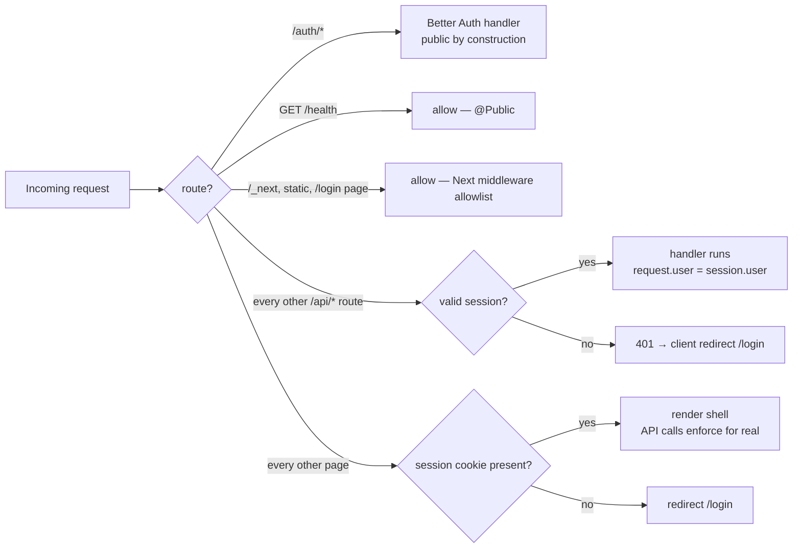
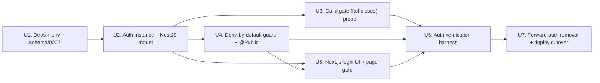

# feat: tdr-code Phase D — Authentication & access (the security cutover)

## Overview

Phase D makes `@lilnas/tdr-code` **own its own authentication** and removes the Traefik
`forward-auth` middleware that currently gates the whole host. After this phase, the app is the
**sole security boundary** in front of a `claude` agent running `--dangerously-skip-permissions`
that can commit and push to git as real users. That posture sets the bar: **deny-by-default on
every `/api/*` route and every page**, public-allow only the auth endpoints, the login page, the
health probe, and static assets.

Authentication is **Login with Discord** via **Better Auth** (Discord OAuth provider + Drizzle/
better-sqlite3 adapter sharing the same SQLite file the app already opens). Sign-in is **gated to
members of the configured Discord guild** — non-members are rejected and (subject to an early
probe) provision zero rows. Every authenticated guild member is a **flat full admin** (no in-UI
roles). The Discord snowflake stored on the Better Auth `account` row is the same id the bot sees
as `message.author.id`, which keys the per-user git identity built in Phase C.

Phases A (two-process substrate), B (persistence + read surfaces), and C (config + git identity +
SSH encryption) are already implemented. Phase D is the final phase and the highest-risk one: a
mistake here either locks the operator out or, worse, exposes the agent's control surface to the
public internet.

---

## Problem Frame

Today tdr-code is protected only by Traefik `forward-auth` (`apps/tdr-code/deploy.yml:42`,
middleware defined in `infra/proxy.yml`). That middleware supplies an opaque "is this a known
person" gate but **cannot supply the Discord identity** the git-attribution feature needs, and it
gates at the edge rather than in the app. The origin brainstorm's Key Decision is explicit:
"Forward-auth is removed because it can't supply the Discord identity the git mapping needs."

The app already exposes nine HTTP controllers (live, sessions, reconcile, events, config,
git-identity, lifecycle, bot-status, health) — **all currently unauthenticated at the app layer**,
relying entirely on the edge middleware. Several are highly sensitive: `git-identity` accepts
private SSH keys, `lifecycle` restarts the bot / kills sessions, `reconcile` returns raw agent diff
content. Most sharply, **`PUT /config` is RCE-equivalent**: `config.dto.ts` lets a caller rewrite the spawn
line of a `claude` process that already runs `--dangerously-skip-permissions`. `claudeCommand` has a
shell-metacharacter denylist, but **`claudeArgs` (an arbitrary string array, only NUL-checked) and
`cwd` (any non-empty string) are the real vector** — argv injection needs no shell metacharacters
(e.g. `--mcp-config`, `--add-dir`, or overriding the permissions/model posture) and `cwd` can be
repointed. Once
`forward-auth` is removed, the Better Auth session is the **only** thing between the internet and
operator-editable process spawn on the host. The moment `forward-auth` is removed, every one of
these routes must be guarded by app-owned auth or it is world-reachable.

**Request-path reality (verified):** the browser does not hit NestJS directly. The path is
`Browser → Traefik (forward-auth) → nginx:80 (container) → host:8080 (Next.js) → /api rewrite →
127.0.0.1:8082 (NestJS)`. TLS terminates at Traefik. Note `nginx.conf` sets
`X-Forwarded-Proto $scheme` and listens on `:80`, so it **overwrites** the header to `http` — this is
benign here **because** Better Auth derives cookie `secure`/`__Secure-` and the OAuth `redirect_uri`
from the configured `https://` `baseURL`, not from `X-Forwarded-Proto`. State that explicitly so
nobody adds a proto-consulting check that then sees `http`. This double-proxy chain is load-bearing
for the cutover and the cookie config.

*(Note on IDs: "D1–D10" throughout this plan are the Phase D feature ids from the feature-landscape
catalog `docs/research/2026-06-28-tdr-code-web-ui-feature-landscape.md` §"Phase D", not a locally
enumerated decision list.)*

The work is a **cutover**, not a greenfield feature: app-owned auth must be stood up and *verified*
while `forward-auth` still protects the host, and only then is the edge middleware removed. Getting
the ordering wrong is the dominant risk.

(See origin: `docs/brainstorms/2026-06-27-tdr-code-web-ui-requirements.md`, and the master feature
catalog `docs/research/2026-06-28-tdr-code-web-ui-feature-landscape.md` §"Phase D".)

---

## Requirements Trace

- R17. Web UI requires authentication via Login with Discord (Better Auth Discord provider,
  Drizzle/SQLite adapter sharing the same database). Traefik `forward-auth` is removed for
  tdr-code; the app owns auth. → **U1, U2, U7**
- R18. Sign-in is restricted to members of the configured Discord guild; non-members are rejected.
  → **U3** (AE5)
- R19. Every authenticated user is a full admin; there are no in-UI sub-roles. Deny-by-default on
  all surfaces. → **U4, U6**
- R14 / R16 (linkage). The Discord ID that keys per-user git identity is the same id Better Auth
  stores as `account.accountId` and the bot sees as `message.author.id`. → **U1 (schema), U4 (session→discordUserId)**
- F3. "Configure your git identity" begins with "A1 logs in with Discord." Phase D provides that
  login; the git-settings UI itself shipped in Phase C. → **U6**
- R20 (non-goal). The console is observe-and-control only; it does not send prompts to the agent.
  Phase D adds **no** prompt input / web chat. → **Scope Boundaries**

**Origin actors:**
- A1 — Operator / admin (the human logging in; a guild member; full admin).
- A2 — Main server (control plane): owns the SQLite system-of-record and now owns auth.
- A3 — Discord ACP bot (data plane): auth is deliberately **independent** of it.
- A4 — claude agent session: attributed to the triggering Discord user via the linked id.

**Origin flows:** F3 (Configure your git identity — its login step).
**Origin acceptance examples:** AE5 (non-member sign-in rejected, no rows provisioned — U3),
AE6 (SSH key write-only — shipped in Phase C; Phase D now puts it behind auth).

---

## Scope Boundaries

- **No agent driving from the web (R20).** No prompt input, no web chat. Conversing stays in
  Discord. Phase D adds only auth; it does not expand the control surface.
- **No in-UI roles or permissions (R19).** Authentication *is* authorization — every authenticated
  guild member has full access. No admin/viewer split, no per-user scoping of what can be seen or
  edited.
- **No continuous / mid-session guild re-validation.** Guild membership is checked **at sign-in
  only** (D10). A user who leaves the guild retains access until their session expires. This keeps
  auth independent of the (possibly-down) bot and of Discord's availability per-request.
- **No password / email-magic-link / other providers.** Discord OAuth is the only method.
- **No change to the SSH-encryption or git-identity mechanisms** (Phase C). Phase D only puts the
  git-identity controller behind the new guard and confirms the id linkage.
- **No migration off `forward-auth` for any other lilnas app.** The shared `forward-auth`
  middleware and its service in `infra/proxy.yml` stay in place for the Traefik dashboard and every
  other app. Only tdr-code drops its label.

### Deferred to Follow-Up Work

- **Orphan-user hardening beyond the chosen fail-closed seam.** If the U3 probe selects the
  database-hook seam (which can leave an accountless `user` row), the compensating sweep lands in
  U3; any richer rate-limiting of anonymous sign-in attempts is a follow-up.
- **Supervising the supervisor / main-server auto-recovery.** Out of scope per origin; unchanged.

---

## Context & Research

### Relevant Code and Patterns

- **HTTP bootstrap (where auth mounts): `apps/tdr-code/src/bootstrap.ts` `bootstrapApp()`** — creates
  the main-server Nest app via `NestFactory.create(AppModule, …)`, applies `helmet()`, `cookieParser()`
  (already global), `enableShutdownHooks()`, binds `127.0.0.1:8082`. **No `setGlobalPrefix('api')`**
  (the `/api` prefix lives only in the Next rewrite, which strips it), **no global guard, no global
  pipe**. This is where `bodyParser: false` and the Better Auth mount attach.
- **Bot is headless: `apps/tdr-code/src/bot-bootstrap.ts` `bootstrapBot()`** loads `BotModule` via
  `createApplicationContext` — no HTTP surface. **Auth is entirely a main-server concern.**
- **Controller guard surface (the deny-by-default target):** `src/console/console.module.ts` wires
  `LiveController` (`GET /live`), `SessionsController` (`GET /sessions`, `/sessions/:id`),
  `ReconcileController` (`GET /sessions/:id/jsonl-status`, `/reconcile`), `EventsController`
  (`GET /events`), `ConfigController` (`GET/PUT /config`), `GitIdentityController`
  (`GET/POST/DELETE /git-identity`), `LifecycleController` (`POST /bot/restart`,
  `/channels/:id/teardown`). `src/app.module.ts` registers `BotStatusController` (`GET /bot/status`)
  and `HealthController` (`GET /health`). Every one carries a comment "Phase D (D6) must enumerate
  this route." **`GET /health` is intentionally public** (Docker healthcheck) — the sole allowlisted
  console route.
- **Existing same-origin defense to preserve:** `config`, `git-identity`, and `lifecycle`
  controllers each define `requireSameOrigin(origin)` keyed on `ALLOWED_CONSOLE_ORIGIN`
  (default `https://tdr-code.lilnas.io`). Keep it as CSRF defense-in-depth alongside sessions.
- **DB layer: `src/db/database.module.ts`** — `DB` injection token, `Db =
  BetterSQLite3Database<typeof schema>`, WAL pragmas, boot-time `migrate()` **only in the main
  server** (`AppModule` uses `migrate: true`; `BotModule` uses `migrate: false`). Better Auth's
  adapter reuses this exact `DB`-token client. `resolveMigrationsFolder()` uses
  `path.resolve(process.cwd(), 'src/db/migrations')` — Phase D migration `0007` follows the same
  `process.cwd()` convention (see learnings).
- **Schema already reserves Phase D: `src/db/schema.ts:31-36`** documents the anticipated
  `user`/`session`/`account`/`verification` tables and notes `sessions.triggering_user_id` /
  `turns.user_id` are raw Discord snowflakes (no FK) so the auth `account` can attach without
  migration churn. Existing migrations run `0000`–`0006`; Phase D adds `0007`.
- **Functional-repo convention:** data access is free functions in `src/db/*.repo.ts` taking `db`
  first (`config.repo.ts`, `git-identity.repo.ts`, …). Any Phase D DB access (orphan sweep, session
  lookups) follows this, not injectable repository classes.
- **Env: `src/env.ts`** — a plain `EnvKeys` string-map (no zod). Has `DISCORD_API_TOKEN` (the **bot
  token**, not an OAuth secret) and `DISCORD_GUILD_ID`. Access via `env(key, default?)` from
  `@lilnas/utils/env`. Phase D adds Discord **OAuth** client id/secret, a Better Auth secret, and a
  public base URL. A `chmod 600` file-secret precedent exists (`src/crypto/master-key.ts`), but the
  established pattern for deploy secrets is `infra/.env.*` env files.
- **Next.js: `apps/tdr-code/next.config.js`** — rewrite `'/api/:path*' → 'http://localhost:8082/:path*'`
  **strips `/api`**; `output: 'standalone'`; `serverExternalPackages: ['better-sqlite3']`; **no
  `allowedDevOrigins`**. **All pages under `src/app/` are `'use client'`; there is no RSC session-read
  pattern in the repo.** The single API client is `src/app/lib/api.ts` (`request<T>` prepends `/api`,
  same-origin cookies flow automatically; a 401 currently throws `Error('HTTP 401')`). Nav lives in
  `src/app/components/nav-shell.tsx`.
- **DTO/validation:** raw `zod` `safeParse` in `*.dto.ts` (NOT `nestjs-zod`/`createZodDto`). Frontend
  imports backend DTO types across the `/api` boundary via the `src/*` path alias.
- **Auth-shape precedent (mirror shape, not library): `apps/yoink/`** is **Passport.js + JWT**
  (`@nestjs/jwt`, `@nestjs/passport`, `passport-google-oauth20`, `jose`). Useful shapes:
  `getAuthenticatedUser()` RSC helper (cookie → verify → DB lookup → attach; returns `null` on
  failure), `JwtAuthGuard implements CanActivate` (reads cookie, verifies, checks status with a
  60s cache), and its `deploy.yml` has **no** forward-auth label (app owns auth).

### External References (verified July 2026 — see feature-landscape §"Consolidated research")

- **`better-auth` 1.6.23** is the current fully-patched stable (June-2026 OAuth/device-flow CVEs are
  fixed in the 1.6.x line). **1.7.x is still RC/beta — do not use.** (June note said "≥1.6.22"; 1.6.23
  is the concrete pin.)
- **`@better-auth/drizzle-adapter` 1.6.23** — separately versioned; **peer `drizzle-orm ^0.45.2`**
  (tdr-code has `^0.45.1` → confirm/bump in U1). Pass the app's existing `db`:
  `drizzleAdapter(db, { provider: 'sqlite' })`; it opens no connection of its own.
- **`@thallesp/nestjs-better-auth` 2.6.1** — current, maintained; peers satisfied by
  `@nestjs/platform-express@11`. Requires `NestFactory.create(App, { bodyParser: false })`; its
  `SkipBodyParsingMiddleware` skips parsing on the mount `basePath` and **re-adds `express.json()`/
  `urlencoded()` for all other routes** (needed for the console controllers' `@Body()`).
- **State strategy defaults to `database`** whenever an adapter is configured → the OAuth `state`
  lives in the `verification` table keyed by the URL query param, **not** a cookie. This **neutralizes
  the `state_mismatch`-via-rewrite hazard** the June pass worried about, *provided* we keep the
  default (do not set `storeStateStrategy: 'cookie'`).
- **basePath/baseURL split:** server `baseURL = https://tdr-code.lilnas.io/api/auth` (public path,
  used to build the Discord `redirect_uri`); NestJS mount + the middleware `basePath = /auth`
  (internal, post-strip); client `baseURL = /api/auth`. Discord portal redirect URI must be
  `https://tdr-code.lilnas.io/api/auth/callback/discord` **byte-identical**.
- **Discord provider:** default scopes are already `['identify','email']`; append only
  `'guilds.members.read'`. `mapProfileToUser` synthesizes an email when Discord returns null. Guild
  check: `GET https://discord.com/api/users/@me/guilds/{GUILD_ID}/member` — 200 = member; treat
  **any non-200 (incl. 5xx / network) as non-member (fail-closed)**.
- **Session read (guards + server):** `auth.api.getSession({ headers: fromNodeHeaders(req.headers) })`
  (Nest) / `auth.api.getSession({ headers: await headers() })` (Next server). Cookie defaults:
  `httpOnly`, `sameSite:'lax'`, `secure` auto-on for `https://` baseURL (adds `__Secure-` prefix).
  `sameSite:'lax'` is required for the OAuth redirect; do **not** use `strict`.
- **Schema management:** `@better-auth/cli generate` emits the Drizzle table defs → manage with the
  app's `drizzle-kit generate` + boot-time `migrate()`. **Never** use Better Auth's Kysely-only
  `migrate`.

### Institutional Learnings

- **`docs/solutions/conventions/type-guards-over-nonnull-assertions-on-db-rows-2026-05-30.md`** — a
  deny-by-default layer must never let a null session type as authenticated. Model "authenticated vs
  not" as a type guard (`isAuthenticated(req): req is AuthedRequest`) / discriminated union, not
  `session!` or `as`. Applies to U4 and any server-side session read.
- **`docs/solutions/conventions/atomicity-tests-must-reach-the-write-phase-2026-06-03.md`** — the
  guild-gate rejection test must not be vacuous. "Seed a non-member, assert zero rows" passes even
  with no gate because the check fires before any write. The real test seeds a **valid member**,
  injects a fault *after* provisioning begins, and asserts rollback/cleanup. Verify tdr-code's jest
  module mode before relying on `jest.spyOn` on a seam (silently no-ops under native-ESM). Applies to U3.
- **`docs/solutions/conventions/begin-immediate-for-read-then-write-mutations-2026-05-27.md`** — the
  orphan-user **sweep** (if U3 chooses the DB-hook seam) is a read-then-write; run it under
  `db.transaction(cb, { behavior: 'immediate' })` with all calls through `tx`. **Caveat, load-bearing
  for this plan:** this convention does **not** let us wrap Better Auth's *own* provisioning in
  `BEGIN IMMEDIATE` — better-sqlite3 is synchronous and Better Auth's transaction callback is async,
  so `transaction: true` on the adapter throws `Transaction function cannot return a promise` and
  breaks all sign-in (verified). Back the fail-closed invariant with a **partial unique index** on
  the account identity as paired defense.
- **`docs/solutions/architecture-patterns/expose-external-compose-via-lilnas-proxy-2026-06-25.md`** —
  cutover gotchas for U7: production uses **bare** `forward-auth` (Docker-provider), not
  `forward-auth@file` — remove the whole label line; Traefik silently **shadows** duplicate `Host()`
  routers (watch tdr-code vs the reserved `tdr-bot`); if `infra/proxy.yml` networks are ever touched,
  **append** `default`, never replace; set Next `allowedDevOrigins` for a TLS dev origin.
- **No tdr-code-specific `docs/solutions/` entries exist yet** — Phase A/B/C knowledge lives only in
  `docs/plans/`. The fail-closed provisioning seam, the two-writer WAL interaction, and the
  forward-auth cutover are strong `/ce-compound` candidates once this lands.

---

## Key Technical Decisions

- **Better Auth via `@thallesp/nestjs-better-auth` 2.6.1 for the mount + body-parser handling only —
  its global guard is disabled.** The library handles the raw-body requirement correctly
  (`bodyParser: false` + `SkipBodyParsingMiddleware` re-adding parsers for non-auth routes). It *also*
  auto-registers its own deny-by-default `AuthGuard` as an `APP_GUARD` **unless** you pass
  `disableGlobalAuthGuard: true` — and we **do** disable it, because we use a hand-rolled guard (next
  decision). Leaving it on would run two global guards; the library's honors *its own* `@Public()`
  metadata, not ours, so `GET /health` (annotated with our `@Public()`) would still 401 → a
  self-inflicted health-probe outage the moment U4 deploys. So: `AuthModule.forRoot({ auth,
  disableGlobalAuthGuard: true })`. Hand-rolling `toNodeHandler` + a custom mount is the fallback if
  the library fights the rewrite (see Alternatives). *Rationale:* the raw-body footgun is the kind of
  subtle break a proven integration de-risks, but the boundary itself stays ours.
- **Pin `better-auth`/`@better-auth/drizzle-adapter` to `1.6.23`; do not adopt 1.7.x.** Fully patched
  stable; 1.7 is pre-release.
- **Keep better-sqlite3; do NOT set adapter `transaction: true`; do NOT switch to libsql.** The
  synchronous driver cannot run Better Auth's async transaction callback. The fail-closed guarantee
  comes from a **pre-provision rejection seam** (and/or an orphan sweep), not from a DB transaction
  around provisioning. *Rationale:* switching the SQLite driver would destabilize the entire
  two-process WAL substrate built in Phase A for a benefit we can achieve another way.
- **Keep the default `database` state strategy.** It removes the `state_mismatch`-via-rewrite failure
  mode; setting `storeStateStrategy: 'cookie'` would reintroduce it.
- **Public path `/api/auth`, internal mount `/auth` — via instance `basePath`, not `forRoot`.**
  `@thallesp` 2.6.1 derives the mount + skip-middleware path **only** from the `betterAuth()` instance's
  `basePath` (there is no `basePath` param on `AuthModule.forRoot`), matched against the post-strip
  `req.originalUrl`. So set **`basePath: '/auth'` on the `betterAuth()` instance** (the internal path
  NestJS sees after Next strips `/api`) and set **`baseURL: 'https://tdr-code.lilnas.io/api/auth'`**
  (public path). Because `baseURL` already carries a path, Better Auth's link generation uses it
  verbatim, so the Discord `redirect_uri` stays the browser-correct `/api/auth/callback/discord` even
  though the handler matches `/auth/*`. Client `baseURL = /api/auth`. *(Getting this wrong — e.g.
  leaving the instance `basePath` at its `/api/auth` default — means the handler never matches the
  post-strip request and OAuth is dead on arrival; assert reachability at the first commit.)*
- **Two-layer deny-by-default: the API guard is the real boundary; the page gate is UX.** The NestJS
  global guard on every `/api/*` controller is the enforcement. The Next.js page redirect-to-login is
  a **cookie-presence** check in `middleware.ts` (cheap, no DB) plus redirect-on-401 in the API
  client. *Rationale:* Better Auth uses **DB-backed opaque sessions** (a session id looked up in
  SQLite), not stateless JWTs — so edge-side cryptographic validation (as `apps/yoink/src/proxy.ts`
  does with `jose`) does **not** transfer, and importing Better Auth's server verifier into Next's
  edge middleware would pull in the native `better-sqlite3` driver, which can't run there. A
  cookie-presence gate sidesteps both while the guarded API stays authoritative.
  **Load-bearing invariant (must be enforced, not assumed):** *no Next server component or route
  handler may read app data directly; all reads flow through the guarded `/api`.* This holds today
  only because the repo has no RSC/`getServerSideProps` data path (every page is `'use client'`). If
  RSC data-fetching is ever introduced, the page gate must upgrade from cookie-presence to full
  session-validation. Record this in U6 so nobody "fixes" the gate by importing the auth server into
  the edge.
- **The deny-by-default guard is hand-rolled (`CanActivate`), not the library's `AuthGuard`.** Use
  `@thallesp/nestjs-better-auth` for the *mount + body-parser handling* only; write our own global
  `CanActivate` that calls `auth.api.getSession({ headers })` and attaches a **type-guarded**
  `req.user` (`isAuthenticated(req): req is AuthedRequest`). *Rationale:* this matches the existing
  `apps/yoink/src/auth/jwt-auth.guard.ts` idiom and satisfies the `type-guards-over-nonnull-assertions`
  learning (the library guard's attached session may not narrow cleanly); the library's `@Public()`
  and a hand-rolled `@Public()` can't both be the source of truth. Library guard is the fallback if
  the hand-rolled path fights the mount.
- **No secret may reach the pino/Loki sink.** `src/logger.ts` currently configures `pino-http` with
  **no `redact`** and `autoLogging` on. Putting auth + the SSH-key intake on this server makes the
  HTTP logger a new leak path (request URLs carry the OAuth `code`/`state`; a body/error serializer
  could capture the SSH private key or Discord token). Add explicit `redact` paths (cookies, auth
  headers, `privateKey`, and `code`/`state`/`access_token` query params) and strip the query string
  on `/api/auth/*`. Owned by U2 (redaction) + U3 (guild-gate error logging).
- **Do not persist the Discord OAuth token beyond the sign-in guild check.** Better Auth's `account`
  table stores `accessToken`/`refreshToken` by default. R18 is a sign-in-only check (D10), so there
  is no need to retain them. Configure Better Auth to not store provider tokens; if the adapter
  always stores them, **encrypt at rest reusing the Phase C cipher** (`src/crypto/master-key.ts`) and
  confirm `/api/auth/*` (esp. `get-session`) never returns token material.
- **Frame protection on the Next-served pages.** `helmet()` wraps only the Nest app (`:8082`); the
  login/console pages are served by Next (`:8080`) and are unprotected against clickjacking. Add
  `X-Frame-Options: DENY` / CSP `frame-ancestors 'none'` via Next `headers()` (or nginx). This is an
  unowned gap between the two servers today.
- **`requireSameOrigin` is retained on every mutating route; no mutating GET is introduced.** With
  `sameSite:'lax'` cookies, top-level-navigation GETs carry the cookie cross-site, so any
  state-changing GET would be CSRF-exposed. Keep the existing Origin check on `config`/`git-identity`/
  `lifecycle` and forbid mutating GETs as an invariant.
- **Only the Discord social provider is enabled — no Better Auth plugins.** The mounted handler's
  public route set is limited to sign-in / callback / sign-out / get-session; enabling admin/org/
  multi-session/list-accounts plugins would add public-by-construction routes. Keep the surface minimal.
- **Flat admin = authentication is authorization (R19).** The guard checks only for a valid session;
  there are no role/scope checks. The git-identity controller keeps taking a `discordUserId` param
  (any admin edits anyone).
- **Guild check at sign-in only (D10).** Bot-independent, Discord-availability-independent per
  request.
- **Bounded session lifetime + an explicit kill-switch (not left to library defaults).** Sign-in-only
  guild checking (D10) means a kicked/compromised member keeps access until expiry — in front of an
  RCE-equivalent surface — so the TTL is a security knob, not an implementation detail. Better Auth's
  default is 7 days; **override it** to a short rolling window (proposed **`expiresIn: 12h`,
  `updateAge` rolling** — confirm the value) and make a **"revoke all sessions" path a required U4
  deliverable** (delete a user's `session` rows; rotating `BETTER_AUTH_SECRET` is the fleet-wide
  variant). D10 stays about *Discord membership*; this is the orthogonal *session-validity* axis.
- **Deploy secrets in `infra/.env.*` env files** (Discord OAuth client id/secret, `BETTER_AUTH_SECRET`),
  matching the `.env.forward-auth` / `infra/.env.<app>` precedent. The `chmod 600` master-key file
  stays reserved for the SSH-encryption key (Phase C).
- **Cutover ordering (U7): verify app-owned auth in place *then* remove the `forward-auth` label.**
  During A/B/C and through U1–U6, `forward-auth` stays. Removing it is the last, separately-verified
  step.

---

## Open Questions

### Resolved During Planning

- *Which auth library?* → Better Auth 1.6.23 + `@better-auth/drizzle-adapter` + `@thallesp/nestjs-better-auth` 2.6.1.
- *Library `AuthGuard` or hand-rolled?* → Hand-rolled `CanActivate` with a type-guarded `req.user`;
  `@thallesp` used for the mount + body-parser only.
- *How does the `/api` rewrite affect OAuth state?* → Default `database` state strategy sidesteps it;
  public/internal path split handles link generation.
- *Where does the guild check run per-request vs sign-in?* → Sign-in only (D10).
- *Do we need a DB transaction around provisioning for fail-closed?* → No; not viable with
  better-sqlite3. Use a pre-provision seam and/or sweep + partial unique index.
- *Does removing forward-auth touch nginx / other apps?* → No. One label line in
  `apps/tdr-code/deploy.yml`; `infra/proxy.yml` and `nginx.conf` unchanged.
- *Which Better Auth plugins?* → None beyond the Discord social provider (keeps the public handler
  surface minimal).
- *Is `jest.spyOn` on a seam reliable for the U3 atomicity test?* → Yes — `jest.config.js` uses
  `ts-jest` (CommonJS), so module-seam spies fire (the ESM-noop hedge does not apply here). The
  "reach the write phase" substance still fully applies.

### Deferred to Implementation

- **[U3, load-bearing] Which fail-closed seam?** Determined by an early runtime probe (mirrors the
  Phase B "B6 JSONL probe"): stand up Better Auth locally, complete a Discord OAuth as a **non-member**,
  and observe exactly which rows are written and where the Discord access token is available.
  - *Option A (preferred):* a **request-level `hooks.before`** on the callback path that performs the
    guild check and throws `APIError('FORBIDDEN')` **before any provisioning** → literally zero rows.
    Open point the probe resolves: is the Discord access token available at that seam, or must we do a
    separate token step?
  - *Option B (fallback):* `databaseHooks.account.create.before` throw — token is in the account
    payload (possibly encrypted → `decryptOAuthToken`); fail-closes **access** (no account, no
    session, no cookie) but can leave an accountless `user` row → pair with the orphan sweep + partial
    unique index so AE5's "no rows" is honored.
  - Either way the **access** boundary is fail-closed (the guard requires a session; a rejected
    sign-in never gets one). The probe only decides how "zero rows" is achieved.
- **[U2] Exact `@thallesp` `basePath` vs the rewrite.** Confirm `SkipBodyParsingMiddleware` matches
  the **internal** `/auth` (it matches `req.originalUrl` after Next strips `/api`) and that the
  console controllers still receive parsed JSON bodies.
- **[U2] `drizzle-orm` bump.** Confirm whether the adapter's `^0.45.2` peer requires bumping
  tdr-code's `^0.45.1` (and any lockfile ripple across the monorepo).
- **[U6] Page-gate mechanism final form.** `middleware.ts` cookie-presence vs a `layout.tsx` session
  read — decide once the cookie name (`__Secure-`-prefixed) is known. The gate must match the
  **session** cookie **exactly**, not "any better-auth cookie" — a half-completed OAuth round-trip
  (transient cookies, no session) must still redirect.
- **[U3/U4, security] Session TTL + a "revoke all sessions" break-glass.** Flat-admin + sign-in-only
  guild check (D10) means a kicked/compromised user keeps full access until expiry, in front of an
  RCE-equivalent surface. Pick a concrete `expiresIn`/`updateAge` and decide whether a manual
  session-revocation path (delete `session` rows) exists.
- **[U3, security] Token storage.** Confirm Better Auth can be told not to persist the Discord
  access/refresh token, and that `get-session` returns no token material; else encrypt at rest (Phase
  C cipher).
- **[H2, security] Should `claudeArgs`/`cwd` get stricter-than-auth validation?** The RCE vector is
  argv injection via `claudeArgs` (`--mcp-config`, `--add-dir`, permission/model overrides) and an
  unconstrained `cwd`, reachable by *any* authed guild member (R19 = authn is authz). Decide whether
  this one route deserves defense-in-depth independent of auth — reject `claudeArgs` entries beginning
  with high-risk flags, pin/forbid removal of the permissions posture, and/or allowlist `cwd` roots —
  or record the accepted risk **naming the argv vector specifically** (not "command injection", which
  is already denylisted).
- **[U3, conditional scope] Anonymous sign-in rate-limiting.** If the probe selects **Option B**
  (which allows unauthenticated `user`-row creation), rate-limiting the sign-in endpoint moves
  **in-scope for U3** (not deferred) — Option B otherwise permits orphan-row / WAL-churn spam on the
  shared DB.
- **[U7] `allowedDevOrigins`.** Whether dev-behind-TLS needs it; prod standalone does not.

---

## High-Level Technical Design

> *This illustrates the intended approach and is directional guidance for review, not implementation
> specification. The implementing agent should treat it as context, not code to reproduce.*

### Sign-in + guild-gate request flow

```mermaid
sequenceDiagram
  participant B as Browser (A1)
  participant N as Next.js (:8080)
  participant M as Main server / NestJS (:8082)
  participant BA as Better Auth handler (/auth/*)
  participant D as Discord OAuth
  participant DB as SQLite (user/session/account/verification)

  B->>N: GET /login
  N-->>B: login page (public)
  B->>N: click "Login with Discord" → /api/auth/sign-in/social
  N->>M: rewrite strips /api → /auth/sign-in/social
  M->>BA: (mounted handler, outside the Nest guard)
  BA->>DB: store state in verification
  BA-->>B: 302 → Discord authorize (redirect_uri = /api/auth/callback/discord)
  B->>D: consent
  D-->>B: 302 → /api/auth/callback/discord?code&state
  B->>N: callback
  N->>M: /auth/callback/discord
  M->>BA: handler exchanges code → Discord token
  Note over BA,D: GUILD GATE (seam per U3 probe):<br/>GET /users/@me/guilds/{GUILD_ID}/member
  alt member (200)
    BA->>DB: provision user + account + session
    BA-->>B: Set-Cookie __Secure-… (httpOnly, sameSite=lax) → redirect app
  else non-member (any non-200) — FAIL CLOSED
    BA-->>B: throw FORBIDDEN → redirect /login?error (no session cookie; zero rows*)
  end
```

\* "zero rows" strictness depends on the seam the probe selects (Option A vs B + sweep).

### Deny-by-default surfaces (D6)



### Guild-gate seam decision matrix (resolved by the U3 probe)

| Seam | Token availability | Access fail-closed? | Zero rows on reject? | Hidden cost |
|---|---|---|---|---|
| **A. request-level `hooks.before`** | must confirm token present pre-provision | ✅ (throws before session) | ✅ literally none | **may require a bespoke OAuth code→token exchange that duplicates the adapter's** — a drift-prone second code path |
| **B. `databaseHooks.account.create.before`** | in account payload (maybe encrypted) | ✅ (no account/session/cookie) | ⚠ accountless `user` may persist | orphan sweep + unique index; **the sweep runs inside the OAuth callback under `BEGIN IMMEDIATE`, competing with the bot process for the WAL write lock (≤5s `busy_timeout` ceiling)** |
| ~~C. adapter `transaction:true`~~ | n/a | — | — | **rejected — breaks all sign-in on better-sqlite3 (async callback)** |

**Pre-committed inversion rule (the probe is a scope-determining precondition to U3, not a mid-unit
branch):** the stated default is A, but the probe must resolve one of **three** outcomes, and B
materially enlarges U3 (adds the sweep, the WAL-contention test, and in-scope rate-limiting) — so
if the probe points to B, **pre-size U3 for B** rather than treating that work as a surprise:
- **A works cleanly** — the Discord token *and* identity are available at `hooks.before` without
  re-implementing the exchange → A (literally zero rows).
- **A is costly** — A would require a **hand-rolled token exchange** duplicating Better Auth's OAuth
  step → **prefer B** (keep the library's exchange; pay for a cheap, narrow orphan sweep).
- **A is impossible** — the callback `hooks.before` seam lacks the identity/token entirely (the
  code→token exchange is what *produces* the identity) → **B is mandatory.**

Under B, AE5's "zero rows" is redefined as "no *usable* rows — the accountless `user` is swept";
state this so the AE5 test author and the probe agree on what "passing" means.

---

## Implementation Units



---

- U1. **Dependencies, env, and Better Auth schema**

**Goal:** Land the non-behavioral foundation: dependencies pinned, env keys defined, the four Better
Auth tables authored in the app's Drizzle schema, and migration `0007` generated. Nothing
authenticates yet.

**Requirements:** R17 (adapter/schema), R14/R16 linkage (schema).

**Dependencies:** None.

**Files:**
- Modify: `apps/tdr-code/package.json` (add `better-auth@1.6.23`, `@better-auth/drizzle-adapter@1.6.23`,
  `@thallesp/nestjs-better-auth@2.6.1`; refresh the lockfile so `drizzle-orm` resolves to ≥0.45.2 —
  the existing `^0.45.1` spec already permits it, so **no version-string edit is needed**, but all
  apps share one resolved version so run a monorepo build after; **pin Node ≥ 22.22.1** — the
  `@thallesp` engine floor, and the observed env is 22.22.0, one patch below)
- Modify: `apps/tdr-code/src/env.ts` (add `DISCORD_CLIENT_ID`, `DISCORD_CLIENT_SECRET`,
  `BETTER_AUTH_SECRET`, `BETTER_AUTH_URL` / public base URL keys)
- Modify: `apps/tdr-code/.env.example` (document the new keys + how they differ from `DISCORD_API_TOKEN`)
- Modify: `apps/tdr-code/src/db/schema.ts` (author `user`, `session`, `account`, `verification` per
  `@better-auth/cli generate` output, adapted to the file's `sqliteTable` + `timestamp_ms` conventions;
  add a **partial unique index** on `account(providerId, accountId)`)
- Create: `apps/tdr-code/src/db/migrations/0007_*.sql` (+ `meta/` snapshot) via `pnpm --filter @lilnas/tdr-code db:generate`
- Test: `apps/tdr-code/src/db/__tests__/auth-schema.spec.ts`

**Approach:**
- Run `@better-auth/cli generate` to get the canonical table shapes, then hand-place them in
  `schema.ts` so `drizzle-kit generate` (not Better Auth's Kysely `migrate`) owns them — matching the
  reserved-tables note at `schema.ts:31-36`.
- Keep the Discord snowflake reachable as `account.accountId` (string). Document the invariant:
  `account.accountId` (providerId `discord`) === `git_identity.discord_user_id` === the bot's
  `message.author.id`.
- The partial unique index is the paired-defense backstop for U3's fail-closed guarantee — add a
  schema comment cross-referencing U3 so its purpose isn't a mystery to a future reader.
- The `drizzle-orm` change is a **lockfile refresh, not a spec bump** (`^0.45.1` already permits
  0.45.2); but all apps share one resolved version, so run a **monorepo-wide** `type-check`/`build`
  after `pnpm install`, not just `--filter`.
- Pin the **Node engine ≥ 22.22.1** (`.nvmrc`, tdr-code `engines`, and the `lilnas-node-base` image) —
  `@thallesp/nestjs-better-auth@2.6.1` requires it and the current env is a patch below.

**Patterns to follow:** existing `sqliteTable` defs + `integer(..., { mode: 'timestamp_ms' })` in
`src/db/schema.ts`; migration generation via the `db:generate` script; `process.cwd()`-relative
migrations folder (`database.module.ts`).

**Test scenarios:**
- Happy path: after `migrate()`, `user`/`session`/`account`/`verification` tables exist with the
  expected columns and types (assert via a `:memory:` test db, mirroring
  `apps/tdr-code/src/db/__tests__/*`).
- Edge case: inserting two `account` rows with the same `(providerId, accountId)` is rejected by the
  partial unique index.
- Edge case: migration `0007` applies cleanly on top of a db already at `0006` (no conflict with
  existing tables; foreign_keys stays ON).

**Verification:** `db:generate` produces `0007`; the schema spec passes; **monorepo-wide `type-check`
and `build` are clean after the `drizzle-orm` bump** (not just the tdr-code filter — the bump can
ripple to sibling apps).

---

- U2. **Better Auth instance + NestJS mount**

**Goal:** Stand up the `betterAuth()` instance on the shared `DB` client and mount it in the main
server so `/api/auth/*` (browser) → `/auth/*` (Nest) works end-to-end, without breaking JSON body
parsing on the existing console controllers.

**Requirements:** R17 (Discord provider, session cookies, same DB), R14/R16 linkage.

**Dependencies:** U1.

**Files:**
- Create: `apps/tdr-code/src/auth/auth.ts` (the `betterAuth()` config: `drizzleAdapter(db, {provider:'sqlite'})`,
  **`basePath: '/auth'`** (internal), **`baseURL: 'https://tdr-code.lilnas.io/api/auth'`** (public),
  **`trustedOrigins: ['https://tdr-code.lilnas.io']`** (string array — a function form throws at boot
  under NestJS; must match `ALLOWED_CONSOLE_ORIGIN`), a concrete **session `expiresIn` + `updateAge`**
  (see the session-TTL decision), Discord provider with `scope: ['guilds.members.read']` +
  `mapProfileToUser` email synthesis, cookie/advanced config; **guild gate wired in U3**)
- Create: `apps/tdr-code/src/auth/auth.module.ts` (register `@thallesp`
  **`AuthModule.forRoot({ auth, disableGlobalAuthGuard: true })`** — no `basePath` param exists on
  `forRoot`; the mount path comes from the instance `basePath` above, and we disable the library guard
  so our hand-rolled one is the single global guard)
- Modify: `apps/tdr-code/src/bootstrap.ts` (`NestFactory.create(AppModule, { bodyParser: false, … })`;
  confirm ordering with `helmet()`/`cookieParser()`)
- Modify: `apps/tdr-code/src/app.module.ts` (import `AuthModule`)
- Modify: `apps/tdr-code/src/logger.ts` (add `redact` paths + auth-path query-string stripping)
- Test: `apps/tdr-code/src/auth/__tests__/auth-mount.spec.ts`

**Approach:**
- Build the auth instance around the injected `DB` token so it shares the app's single better-sqlite3
  connection (no second handle → no WAL surprise).
- Set `bodyParser: false` globally and rely on `SkipBodyParsingMiddleware` to re-add parsers for every
  non-`/auth` route; **the console controllers' `@Body()` must still receive parsed JSON** — this is
  the primary regression risk of the unit. Assert as first-commit checks: (a) app-level `helmet()`/
  `cookieParser()` run before the skip-middleware and do **not** consume the auth body; (b)
  `SkipBodyParsingMiddleware` matches the **internal** `/auth` (post-`/api`-strip `req.originalUrl`);
  (c) `helmet()`'s default CSP does not block the top-level OAuth navigation / callback (relax
  `form-action`/`connect-src` for the auth paths if it does).
- Add the **pino redaction** config here (cookies, auth headers, OAuth `code`/`state`, `access_token`;
  strip the query string on `/api/auth/*`) so the auth handler never leaks secrets to the logger/Loki
  from its first commit. `buildLoggerOptions()` has **two branches** (prod `{ pinoHttp: { level } }` and
  a dev `pino-pretty` transport) — add `redact` to **both**, and verify the dev pretty-printer honors
  it (pretty transports can bypass redaction).
- Keep the default `database` state strategy (do not set `storeStateStrategy`).
- Do **not** set adapter `transaction: true`.

**Execution note:** Begin with an integration test that drives a request through the mounted handler
and a request through an existing console controller in the same app instance, so the body-parser
split is proven from the first commit.

**Technical design:** *(directional)* — the public/internal split lives on the **instance**:
`betterAuth({ basePath: '/auth', baseURL: 'https://tdr-code.lilnas.io/api/auth', … })`;
`AuthModule.forRoot({ auth, disableGlobalAuthGuard: true })` (no `basePath` param on `forRoot`); Next
rewrite maps `/api/auth/:path*` → `:8082/auth/:path*`; client uses `/api/auth`. The instance
`basePath` (`/auth`) is what both the handler and `SkipBodyParsingMiddleware` match against the
post-strip `req.originalUrl`.

**Patterns to follow:** `src/bootstrap.ts` existing middleware wiring; the `DB` token injection used
across `src/db/*`; `apps/yoink` auth-module wiring shape (not its library).

**Test scenarios:**
- Happy path: a request to the **post-strip** internal path (`/auth/*`, as NestJS sees it after Next
  strips `/api`) reaches the Better Auth handler — the load-bearing assertion that instance `basePath`
  matches `req.originalUrl` (a wrong `basePath` here = OAuth dead on arrival).
- Edge case: exactly **one** global guard is registered (the hand-rolled one) — i.e.
  `disableGlobalAuthGuard: true` took effect — and `GET /health` returns 200 with no cookie (would
  fail if the library guard were still active).
- Integration: `PUT /config` and `POST /git-identity` still parse a JSON body correctly after
  `bodyParser: false` (regression guard for the body-parser skip).
- Edge case: a request to `/auth/*` is **not** consumed by `express.json()` (raw body reaches the
  handler) even though app-level `cookieParser`/`helmet` ran first.
- Error path: missing `BETTER_AUTH_SECRET` / Discord client env fails fast at boot with a clear message.
- Integration (redaction): a request whose body/URL carries a fake SSH key / OAuth `code` produces a
  log line with those values **redacted** (asserts the pino config, guarding the Loki leak path).

**Verification:** the auth handler answers under `/auth/*`; console controllers still accept bodies;
`type-check` + `lint` clean.

---

- U3. **Guild-membership gate (fail-closed) + early seam probe**

**Goal:** Reject sign-in for non-members of `DISCORD_GUILD_ID` such that access is fail-closed and no
usable rows are provisioned, honoring AE5. Resolve the seam (Option A vs B) with an early probe.

**Requirements:** R18, AE5; D10 (sign-in-only membership check lives here).

**Dependencies:** U2.

**Files:**
- Create: `apps/tdr-code/src/auth/guild-gate.ts` (pure predicate + Discord API call:
  `GET /users/@me/guilds/{GUILD_ID}/member`; non-200 ⇒ not a member)
- Modify: `apps/tdr-code/src/auth/auth.ts` (wire the gate into the chosen seam — `hooks.before` or
  `databaseHooks.account.create.before`)
- Create (if Option B): `apps/tdr-code/src/db/auth-sweep.repo.ts` (delete accountless `user` rows under
  `BEGIN IMMEDIATE`)
- Modify: `apps/tdr-code/src/__tests__/setup.ts` (correct the `DISCORD_BOT_TOKEN` → `DISCORD_API_TOKEN`
  fixture name mismatch)
- Test: `apps/tdr-code/src/auth/__tests__/guild-gate.spec.ts`

**Approach:**
- **Probe first** (execution note): stand up the instance locally, run a real Discord OAuth as a
  non-member, and record which rows appear + where the access token is available. Apply the
  **pre-committed inversion rule** (see the decision matrix): default to Option A only if the token
  is available at the seam *without* a hand-rolled OAuth token exchange; if A would duplicate the
  library's exchange, prefer Option B + sweep.
- If Option B: the orphan sweep runs **inside the OAuth callback** under `BEGIN IMMEDIATE`, so it
  competes with the bot process for the WAL write lock (≤5s `busy_timeout`). Keep it a single narrow
  `DELETE`; this concurrency cost is a further argument for Option A.
- Keep the guild decision in a **single pure predicate** (`isGuildMember(memberLookupResult)`) so the
  seam and any test both call the same rule (avoids the two-paths-diverge failure mode from the FSM
  learning).
- Treat network errors / 5xx from Discord as **not a member** (fail-closed), never as "allow."
- Do **not** persist the Discord access/refresh token past this check (or encrypt it via the Phase C
  cipher if the adapter insists on storing it).
- The partial unique index from U1 backstops any missed cleanup.
- **If the probe selects Option B**, add sign-in-endpoint **rate-limiting in this unit** (not
  deferred) — Option B allows unauthenticated `user`-row creation, so anonymous OAuth spam is an
  orphan-row / WAL-churn vector on the shared DB.

**Execution note:** Lead with the runtime probe (mirrors Phase B's B6 JSONL probe); it decides the
seam before the gate is wired. Then write the atomicity test to **reach the write phase** — seed a
valid member, inject a fault after provisioning starts, assert cleanup/rollback — not the vacuous
"non-member ⇒ zero rows" check. Jest here is `ts-jest` (CommonJS), so `jest.spyOn` on a module seam
fires reliably (no ESM-noop concern). While touching auth test setup, fix the stale
`DISCORD_BOT_TOKEN` fixture in `src/__tests__/setup.ts` to the name the code actually reads
(`DISCORD_API_TOKEN`) so guild-gate tests don't pass for the wrong reason.

**Patterns to follow:** functional-repo style (`src/db/*.repo.ts`, `db` first arg);
`begin-immediate-for-read-then-write-mutations` for the sweep; `atomicity-tests-must-reach-the-write-phase`
for the test.

**Test scenarios:**
- Covers AE5. Happy path: a guild member completes OAuth → `user`+`account`+`session` provisioned,
  session cookie set.
- Covers AE5. Error path: a non-member completes OAuth → rejected, **no `account` and no `session`
  row**, no session cookie (and no `user` row under Option A, or swept under Option B).
- Error path (fail-closed): the Discord member-lookup returns 500 / times out → treated as non-member
  (rejected), not allowed.
- Edge case: Discord returns a null email → `mapProfileToUser` synthesizes one; member still allowed.
- Integration (atomicity, non-vacuous): seed a valid member, inject a post-first-write fault inside
  the provisioning path → assert no partial/orphan rows survive. First confirm jest module mode so the
  seam spy actually fires.
- Edge case: `isGuildMember` predicate unit-tested across {200 member, 404, 403, 500, malformed body}.

**Verification:** a non-member cannot obtain a session; the row-count assertions hold; the pure
predicate is exhaustively covered.

---

- U4. **Deny-by-default NestJS auth guard + `@Public()` allowlist**

**Goal:** Every `/api/*` route requires a valid Better Auth session except an explicit allowlist;
attach the authenticated user (and its Discord id) to the request. Flat admin — no role checks.

**Requirements:** R19 (deny-by-default, flat admin), R14/R16 linkage (session → discordUserId).

**Dependencies:** U2 (needs `auth.api.getSession`). Independent of U3 but verified together in U5.

**Files:**
- Create: `apps/tdr-code/src/auth/auth.guard.ts` (**hand-rolled** global `CanActivate` via
  `auth.api.getSession({ headers: fromNodeHeaders(req.headers) })`; `isAuthenticated` type guard;
  attaches `req.session`/`req.user`) — the library `AuthGuard` is the documented fallback only
- Create: `apps/tdr-code/src/auth/public.decorator.ts` (`@Public()` `SetMetadata`)
- Modify: `apps/tdr-code/src/app.module.ts` (register the guard globally, e.g. `APP_GUARD`)
- Modify: `apps/tdr-code/src/bot/health.controller.ts` (annotate `@Public()`)
- Create: `apps/tdr-code/src/auth/session-user.ts` (helper: session → Discord snowflake for
  git-identity attribution / display)
- Create: `apps/tdr-code/src/auth/protected-routes.ts` (the **canonical route enumeration** — the
  single source of truth U5 imports for its sweep)
- Test: `apps/tdr-code/src/auth/__tests__/auth.guard.spec.ts`

**Approach:**
- Register **one** global guard; deny-by-default. Allowlist **only** `GET /health` via `@Public()`.
  The Better Auth `/auth/*` handler is served outside Nest controllers, so it is not subject to the
  guard (the "callback reachable" assertion moves to U5, where U2's mount + U3's gate exist).
  `GET /bot/status` is **guarded, not public** — an anonymous status probe is a recon signal about
  whether the dangerous agent is live.
- **Health-probe timing (verified):** the guard sits in the Docker healthcheck's path
  (`:8080` Next `/api/health` → `:8082` Nest `@Get('health')`). A missing/mis-scoped `@Public()` is a
  **self-inflicted outage the moment this unit deploys** (before U7). The allowlist must key on the
  right form at each layer: internal `/health` (Nest `@Public()`), public `/api/health` (U6 Next
  middleware).
- Use a **type guard**, never `session!`/`as`, to narrow authenticated requests (per the DB-row-type
  learning) — a null session must never type as authed.
- **`getSession` failure contract (do NOT mirror yoink's 500):** `getSession` reads SQLite on the
  connection the bot contends with, so a `SQLITE_BUSY`/read error can throw on an otherwise-valid
  session. Catch **all** throws and **fail closed → 401, never 500 and never allow** — but emit a
  **distinct `auth_check_error`** log (separate from `auth_denied`) so a WAL-contention lockout is
  distinguishable from "no cookie," and add a Loki watch for it. The cited yoink guard throws 500 here;
  deliberately diverge.
- **Flat admin:** the guard checks authentication only; there is no authorization/role logic. Keep the
  existing `requireSameOrigin()` checks on the mutating controllers as CSRF defense-in-depth alongside
  `sameSite:lax` cookies.
- Expose `session → account.accountId (discord snowflake)` so downstream (git-identity attribution,
  nav display) reads one helper.
- **Audit trail:** emit a structured **log line** (to Loki) for `auth_denied` at the guard and for
  every mutating console action keyed by the actor's Discord id (`req.user`). Use log lines, not the
  Phase B `events` table — that table requires a non-null `generationId` an anonymous/auth request
  lacks (surfacing auth events in the UI feed is a follow-up needing a nullable-generation schema
  accommodation).

**Patterns to follow:** `apps/yoink/src/auth/jwt-auth.guard.ts` (guard shape: read cookie/headers →
verify → attach → deny) and `apps/yoink/src/auth-user.ts` (null-on-failure helper) — shape only;
`type-guards-over-nonnull-assertions-on-db-rows` for narrowing.

**Test scenarios:**
- Happy path: a request carrying a valid session cookie to `GET /live` (and each enumerated route)
  passes and `req.user` is populated.
- Error path: the same request with **no** cookie → 401, for **every** enumerated route
  (`/live`, `/sessions`, `/sessions/:id`, `/sessions/:id/reconcile`, `/sessions/:id/jsonl-status`,
  `/events`, `/config` GET+PUT, `/git-identity` GET+POST+DELETE, `/bot/restart`,
  `/channels/:id/teardown`, `/bot/status`) — 13 guarded routes + `/health` public = 14 total.
- Error path: `getSession` throws (simulated `SQLITE_BUSY`) → **401 + `auth_check_error` log**, not 500,
  not allow.
- Error path: an expired/invalid session cookie → 401 (not a 500).
- Edge case: `GET /health` succeeds with **no** cookie (Docker probe unaffected — a regression here
  is a self-inflicted outage at *this* unit's deploy, so it is a U4 gate).
- Integration: `POST /git-identity` with a valid session but a **cross-origin** `Origin` → still
  rejected by `requireSameOrigin` (defense-in-depth preserved).
- Happy path: `session → discordUserId` helper returns the account snowflake for an authed request.
- Happy path: the enumerated-route iteration reads from the canonical `protected-routes.ts` constant
  (so U5 and U4 test the same list). *(The "OAuth callback reachable / not guarded" assertion lives in
  U5, which has the mount + gate to exercise it.)*

**Verification:** every enumerated route is 401 without a session and 200/expected with one;
`/health` stays public; same-origin checks intact; flat-admin (no role gate) confirmed.

---

- U5. **End-to-end auth verification harness (pre-cutover gate)**

**Goal:** Prove the whole app-owned auth boundary works **while `forward-auth` is still in place**, so
U7 can remove the edge middleware with confidence. This is the "verify then cutover" gate.

**Requirements:** R17, R18, R19 (the verification that the cutover is safe).

**Dependencies:** U3, U4, U6.

**Files:**
- Create: `apps/tdr-code/src/auth/__tests__/auth-e2e.spec.ts` (or a documented manual verification
  runbook if a full OAuth e2e can't be automated headlessly)
- Create/Modify: `docs/` runbook note or the plan's Operational section referenced by the checklist

**Approach:**
- The automated sweep **iterates the canonical `protected-routes.ts` constant from U4** (single source
  of truth) so a route added later can't be guarded-but-untested or tested-but-unguarded. Assert the
  **read** routes 401 explicitly — they have **no `requireSameOrigin` backstop** (only mutations do),
  so a read hole (e.g. `GET /sessions/:id/reconcile` leaking raw agent diffs) has nothing else
  catching it.
- Assert failure modes return **401, not 500** (expired/tampered cookie) — an auth layer that 500s on
  bad input is a fragility that pages you post-cutover. Assert the OAuth callback path is reachable
  (not blocked by the guard) — this assertion lives here because it needs U2's mount + U3's gate.
- For the live Discord OAuth leg that can't run headless, capture an explicit **manual checklist**
  (sign in as a member; attempt as a non-member → no working session; confirm `/api/health` still
  200) captured with a **commit sha / timestamp**.
- The harness is the objective "deny-by-default is real everywhere" evidence that must be green
  (automated sweep + manual OAuth legs) before U7 removes `forward-auth`.

**Execution note:** This unit is a gate, not a feature — it exists so the cutover in U7 is
evidence-based rather than hopeful.

**Patterns to follow:** existing `apps/tdr-code/src/__tests__/setup.ts` mocks; swole's `server-only`
jest stub if a db-backed path needs it.

**Test scenarios:**
- Integration: unauthenticated sweep over the canonical `protected-routes.ts` list → all 401 except
  `/health`; assert the **reads** (`reconcile`, `sessions`, `live`, `events`, `bot-status`, GET
  `config`/`git-identity`) explicitly (no same-origin backstop).
- Integration: authenticated member sweep → all routes reachable.
- Integration: the Better Auth OAuth callback path is reachable (not blocked by the guard).
- Error path: logout (`/api/auth/sign-out`) clears the session → subsequent `/api/live` is 401.
- Error path: a tampered/expired cookie → **401, not 500**, across the board.

**Verification:** the harness (automated sweep + manual OAuth legs, captured with a commit sha) is
fully green; this is the recorded precondition for U7.

---

- U6. **Next.js login UI, page gate, and redirect-on-401**

**Goal:** Give A1 a login page, redirect unauthenticated page visits to it, redirect API 401s to it,
and show who's logged in with a logout control.

**Requirements:** R17 (login UI, session-aware pages), R19 (pages deny-by-default), F3 (login step).

**Dependencies:** U2 (auth client `baseURL`), U4 (401 contract).

**Files:**
- Create: `apps/tdr-code/src/app/login/page.tsx` (`'use client'` login page; "Login with Discord"
  via the Better Auth client `signIn.social({ provider: 'discord' })`; renders the `?error=<code>` copy)
- Create: `apps/tdr-code/src/app/login/layout.tsx` (route-group layout so `/login` renders **outside**
  `NavShell` — a minimal centered card in the app's dark flat palette)
- Create: `apps/tdr-code/src/app/lib/auth-client.ts` (Better Auth React/client instance, `baseURL: '/api/auth'`)
- Create: `apps/tdr-code/middleware.ts` (page-level cookie-presence gate → redirect to `/login`;
  allowlist `/login`, `/_next/*`, static, favicon)
- Modify: `apps/tdr-code/src/app/lib/api.ts` (redirect to `/login` on 401 instead of bare throw)
- Modify: `apps/tdr-code/src/app/components/nav-shell.tsx` (logged-in user display + logout via
  `signOut()`)
- Modify: `apps/tdr-code/next.config.js` (frame-protection `headers()` for Next-served pages; add
  `allowedDevOrigins` only if the dev-behind-TLS probe shows it's needed)
- Test: `apps/tdr-code/src/app/__tests__/login.spec.tsx`, `middleware.spec.ts`

**Approach:**
- The middleware is a **cheap cookie-presence** check — matching the **session** cookie **exactly**
  (by its `__Secure-`-prefixed name), not "any better-auth cookie," so a half-completed OAuth
  round-trip (transient cookies, no session) still redirects. Not a DB validation — the real
  enforcement is the API guard (U4). This avoids importing the better-sqlite3-backed auth server into
  the edge runtime. **The allowlist must explicitly include `/api/health`** so the Docker probe (which
  hits Next `:8080`) isn't redirected to `/login` (a 3xx fails the probe even though the Nest route is
  public).
- The `api.ts` **401-handler interaction contract** (this is not a one-liner): redirect **once**
  (guard against loops / a storm from concurrent 401s and the 5s `refetchInterval` polls), and do
  **not** swallow the `onError` path the existing inline error UI relies on (the codebase uses inline
  `text-red-400` text + the shared `ErrorState` component — **there is no toast library**; do not
  introduce one). On session-expiry, land on `/login?error=session_expired` (see error-copy below) so
  a mid-task bounce is explained, not silent.
- **Open-redirect is a hard requirement, not soft:** any post-login `returnTo`/`callbackURL` must be a
  **relative internal path only** (reject absolute URLs and protocol-relative `//host`) — an open
  redirect on the login flow is a phishing primitive. The frontend has no `returnTo` handling today,
  so this is net-new and must be built safe.
- **Frame protection on the Next-served pages** (`X-Frame-Options: DENY` / CSP `frame-ancestors 'none'`
  via Next `headers()` or nginx) — `helmet()` covers only Nest, leaving login/console clickjackable.
- All pages stay `'use client'`; the redirect-on-401 in `api.ts` covers the case where a stale cookie
  passes the middleware but the session is actually invalid (the API 401s → redirect).
- **Middleware `matcher` (state it explicitly — it's the security-relevant line):** reconcile the
  `apps/yoink/src/proxy.ts` precedent, whose matcher **excludes all `/api`**, with the `/api/health`
  allowlist. Pick one and write it down: **either** mirror yoink (matcher excludes `/api/*` entirely,
  so the gate only touches pages — then the `/api/health` allowlist is a *Nest `@Public()`* concern,
  not a middleware one) **or** a matcher covering `/api`, in which case allowlist **both**
  `/api/auth/*` (else the OAuth callback redirects to `/login`) **and** `/api/health`. Mirroring yoink
  is the simpler, proven choice.
- **`layout.tsx` invariant (this phase can break it):** `src/app/layout.tsx` is a **server component**
  that renders `NavShell`. The tempting way to show the logged-in user is a server-side session read
  in `layout.tsx` — which violates the "no server-side app-data read" invariant *inside U6* and pulls
  `better-sqlite3` into the server render. **Forbid it:** the user display MUST be **client-sourced**
  (Better Auth React client / a `/api/auth/get-session` fetch). `layout.tsx` imports no auth-server
  module.
- **Login-page placement:** `/login` must render **outside `NavShell`** (a route-group layout or a
  `pathname` guard in `NavShell`) — otherwise an unauthenticated visitor sees the full 5-link app nav
  above the login button, every link bouncing back to `/login`. Use a minimal centered card: the
  `tdr-code` wordmark + "Login with Discord", **in the app's existing dark flat palette**
  (`bg-gray-950`, `border-gray-800`, `text-gray-400`/`white`) — no gradient/hero/marketing chrome
  (AI-slop guard).
- **Error-page copy (`/login?error=<code>`):** use a **stable enum** (`not_guild_member`,
  `session_expired`, `oauth_failed`), not raw Better Auth error strings in the URL. Specify copy:
  guild-rejection = "You don't have access to tdr-code — this console is limited to members of the
  configured Discord server."; `session_expired` = "Your session expired. Please sign in again.";
  `oauth_failed` = a distinct generic "sign-in didn't complete" so a transient Discord outage isn't
  misread as "not a member." Logout lands on a **bare `/login`** (no error banner) — distinct from the
  involuntary `session_expired` state.
- **Nav user display states:** show the Discord **global/display name** (better recognition than
  username) with an avatar (Discord CDN) + **initial-letter fallback** (avoid the generic-person-icon
  slop); **truncate** long names (`max-w-[…] truncate`) in the `h-14` header; render a **fixed-width
  loading placeholder** while the client session resolves (no layout shift, no flash of logged-out
  chrome).
- **Login button pending state:** disable + label→"Redirecting…" on click to prevent double-invoking
  `signIn.social` before the full-page navigation.
- Validate that the `signIn.social()` call site passes a **hardcoded** relative `callbackURL` (not
  derived from a query param / `document.location` / referrer); `trustedOrigins` (U2) is the backstop.
- Use `cns()` for all class composition (CLAUDE.md mandate); mirror `nav-shell.tsx` styling.

**Technical design:** *(directional)* — three cooperating gates: (1) middleware cookie-presence →
`/login`; (2) API guard → 401; (3) `api.ts` 401 handler → `/login`. Gate (2) is authoritative.

**Patterns to follow:** `src/app/components/nav-shell.tsx` + `src/app/providers.tsx` (client shell);
`src/app/lib/api.ts` request wrapper; `apps/yoink` login/return-to shape (validate any post-login
redirect target to avoid open redirect).

**Test scenarios:**
- Happy path: visiting `/` with no session cookie redirects to `/login`.
- Happy path: `/login` renders and the Discord button initiates the OAuth flow (client `signIn.social`).
- Error path: an API call returning 401 triggers a redirect to `/login` (assert the `api.ts` handler).
- Edge case: `/login`, `/_next/static/*`, and `/favicon` are reachable without a cookie (allowlist).
- Edge case: logout calls `signOut()` and lands on `/login`.
- Error path (open redirect): a post-login `returnTo` of an absolute/`//host` URL is **rejected**;
  only relative internal paths are honored.
- Edge case: `/api/health` is in the middleware allowlist (Docker probe not redirected to `/login`).
- Edge case: a request carrying only OAuth-transient cookies (no session cookie) is still redirected.
- Error path (401 storm): concurrent 401s / a polling 401 trigger **one** redirect, not a loop, and
  don't suppress the existing inline `ErrorState`/`text-red-400` error UI.
- Happy path (copy): `/login?error=not_guild_member` renders the guild-rejection message;
  `?error=session_expired` renders the expiry message; `?error=oauth_failed` renders the generic
  message; each is visually distinct so a transient Discord outage isn't misread as "not a member".
- Edge case (placement): visiting `/login` renders **no** app nav (`NavShell` chrome absent) — a
  centered card only.
- Edge case (nav display): the logged-in name/avatar is sourced client-side; `layout.tsx` imports no
  auth-server module (invariant guard); a long display name truncates and there's no logged-out flash
  before the session resolves.

**Verification:** unauthenticated navigation always lands on `/login`; authenticated users see their
identity + logout; 401s redirect; static/login are public.

---

- U7. **Forward-auth removal + deploy cutover**

**Goal:** Remove the Traefik `forward-auth` middleware from tdr-code so the app is the sole boundary —
executed only after U5's verification is green — and provision the OAuth prerequisites.

**Requirements:** R17 (forward-auth removed; app owns auth).

**Dependencies:** U5 (verification gate), and transitively U1–U6.

**Files:**
- Modify: `apps/tdr-code/deploy.yml` (remove the single line
  `traefik.http.routers.tdr-code.middlewares=forward-auth`; keep every other label, volume, network,
  the healthcheck, `stop_grace_period`)
- Modify: `infra/.env.tdr-code` (or the app's deploy env file) — add `DISCORD_CLIENT_ID`,
  `DISCORD_CLIENT_SECRET`, `BETTER_AUTH_SECRET`, public base URL (not committed; documented in `.env.example`)
- Modify: `apps/tdr-code/.env.example` / a deploy note documenting the Discord Developer Portal
  redirect URI `https://tdr-code.lilnas.io/api/auth/callback/discord`
- No change: `apps/tdr-code/deploy/nginx.conf`, `infra/proxy.yml` (forward-auth service + shared
  middleware stay for other apps)

**Approach:**
- **Ordering is the whole point:** `forward-auth` stays through U1–U6; U5 proves deny-by-default; only
  then does this unit drop the label and redeploy. If anything regresses, re-adding the one label
  restores the edge gate instantly (documented rollback).
- **Guard against the deploy race (artifact-level, not just phase-level):** deploy the
  guard-carrying app image **first, with the label still present**, and confirm the app itself is
  denying (Go/No-Go check A) *behind* the still-live edge gate. Only then remove the label and reload
  Traefik. This closes the **old-image** window (a redeploy briefly running the guardless image while
  the label is gone) — but **two residual windows remain**, so don't over-claim: (1) the guard lives
  in the *host* main-server process, not the container Traefik sees, so confirm the **host process**
  (not just the container) is the guard-carrying build and healthy *immediately before* the flip, and
  pause any concurrent host redeploy during it; (2) Traefik's label reload isn't instantaneous — after
  removing the label, **poll Traefik's API until the router shows the empty middleware chain** before
  declaring cutover done. Confirm the running build via image digest / boot log line, not a cached
  `monorepo-builder` image.
- **Trust Traefik's runtime view, not the file edit:** after redeploy, confirm in Traefik's
  dashboard/API that exactly one `tdr-code` router serves the host and its middleware chain is as
  intended (empty post-cutover). This defends both "didn't reload" and silent `Host()` shadowing
  (tdr-code vs the reserved `tdr-bot`). Do not touch `infra/proxy.yml` networks.
- **Browser-session transition:** a pre-cutover `forward-auth` SSO cookie must grant **no** app access
  afterward (the app ignores it and 401s → forces a real Discord sign-in). Conversely, right after
  cutover nobody has an app session yet — the operator running the cutover must confirm **their own**
  Discord sign-in works, or risk self-lockout at the moment they most need the console.
- Provision the Discord OAuth application + redirect URI and the secrets **before** removing the label.

**Execution note:** Cutover step — verify app-owned auth in a prod-like check, then remove
`forward-auth`, then re-verify from an unauthenticated client that sensitive routes are still denied.

**Patterns to follow:** `apps/yoink/deploy.yml` (an app with no forward-auth label);
`expose-external-compose-via-lilnas-proxy` learning (bare-label removal, Host shadowing, networks).

**Test scenarios:**
- Test expectation: none (deploy config) — replaced by a **Go/No-Go gate** and a **post-cutover
  external sweep** (see Operational / Rollout Notes for the full checklist). Binary summary:
  - **Go/No-Go (label still present, from inside the network so forward-auth doesn't mask the app):**
    every enumerated route (esp. the reads with no same-origin backstop — `reconcile`, `sessions`)
    returns **401** with no cookie; `/api/health` returns **200** with no cookie; a guild member
    signs in end-to-end; a non-member gets no working session; expired/tampered cookie → 401 not 500;
    secrets + Discord redirect URI provisioned (proven by the member sign-in, not just "the file
    exists"). Any red = No-Go.
  - **Post-cutover (external, unauthenticated):** the sensitive routes 401 with an **app-sourced** body
    (Better Auth / Nest JSON), **not** a forward-auth redirect-to-SSO — a redirect means the cutover
    didn't take; `/api/health` 200; an old forward-auth SSO cookie grants nothing; a member can still
    sign in through the real edge.

**Verification:** the Go/No-Go gate was green before the label came off, `forward-auth` is confirmed
gone from the live Traefik router (not just the file), every sensitive route is app-denied to
anonymous external callers, the health probe is unaffected, and the one-line rollback is confirmed to
work.

---

## System-Wide Impact

- **Interaction graph:** the global guard sits in front of **every** main-server controller
  (`console/*`, `bot-status`, `health`). The Better Auth handler mounts alongside them but is served
  outside the guard. The bot process is untouched — it has no HTTP surface and auth is deliberately
  independent of it (satisfies AE1/R3: the console + login work even when the bot is down).
- **Error propagation:** unauthenticated/expired → 401 at the API (not 500); the frontend translates
  401 → redirect-to-login. A rejected guild sign-in surfaces as an OAuth-flow redirect back to
  `/login?error`, never a 500.
- **State lifecycle risks:** the fail-closed seam must not leave usable rows for a rejected sign-in
  (AE5). Access is fail-closed regardless of seam (no session issued); the "zero rows" strictness is
  handled by the U3 probe's choice + the U1 partial unique index + (Option B) the orphan sweep.
- **API surface parity:** the guard must cover **all nine** controllers uniformly — a single
  un-annotated public route is a hole. The canonical enumerated route list (`protected-routes.ts`,
  U4) is the parity checklist, imported by U5's sweep so guard and test can't diverge.
- **Flat-admin data-exposure blast radius (accepted per R19, named here so it's a decision):** every
  authenticated guild member can read **every** user's prompts, transcripts, and diffs
  (`GET /sessions/:id/reconcile` egresses raw agent content) and can change the RCE-equivalent spawn
  config. A large guild is a broad audience for potentially sensitive repo content. This is the
  intended R19 model; it is stated so it's an accepted risk, not an accident. **Legibility cross-check
  (U5):** confirm the existing Sessions/Events/Live views display *whose* session/turn is whose (via
  the same `session → discordUserId` helper), so flat-admin reads as attributed, not silently
  anonymized.
- **Accepted residual — `/health` is a DB-liveness oracle.** The public `/health` runs `SELECT 1`, so
  an anonymous caller can distinguish "DB reachable" from "not." Accepted as the cost of the Docker
  readiness probe; if pure liveness suffices later, a static `{ok:true}` would shrink the oracle.
- **No WebSocket/SSE surface is added.** The event feed is poll-based; nginx forwards `Upgrade`
  headers but there is no WS/SSE endpoint. Important because a NestJS `CanActivate` guard does **not**
  cover a raw upgrade / Next-served stream — "deny-by-default on every surface" is precisely
  deny-by-default on *Nest HTTP controllers*. If a WS/SSE channel is ever added it must carry its own
  auth.
- **Read-endpoint CSRF/CORS posture:** the read routes have no `requireSameOrigin` (only mutations
  do). With `httpOnly` + `sameSite:'lax'` cookies, a cross-site ``/navigation can *execute* a
  read GET, but the browser/CORS prevents script from *reading* the cross-site response, and no read
  endpoint has side effects — so exfil-to-script is blocked. Mutating routes keep the Origin check as
  the CSRF posture. Confirm no read endpoint acquires a side effect later.
- **Audit trail:** sign-in / sign-in-rejected and every mutating console action emit a structured log
  line (actor Discord id) to Loki — the only forensic record of "who changed the spawn line / restarted
  the bot," since the Phase B `events` table can't hold auth events (needs a `generationId`).
- **Secret-leak surface:** adding auth + SSH-key intake to this server makes `pino`/Loki a new leak
  path; the U2 redaction config is the mitigation and the invariant is *no secret, SSH key, OAuth code,
  or token reaches the log sink.*
- **Body-parser interaction:** `bodyParser: false` + the skip-middleware must keep JSON parsing intact
  for the console controllers' `@Body()` — a silent break here degrades config/git-identity writes
  (covered by U2 regression tests).
- **Two-writer WAL:** Better Auth reuses the existing `DB` connection (no second handle). Provisioning
  writes are small and infrequent; they ride the existing WAL + `busy_timeout` model. Do **not**
  introduce adapter transactions (incompatible with better-sqlite3).
- **Unchanged invariants:** the Phase C SSH-encryption + git-identity mechanisms are unchanged; Phase D
  only guards the controller and confirms the id linkage. The nginx config and the shared
  `forward-auth` service/middleware for other apps are unchanged. The `/api` rewrite and standalone
  build are unchanged except an optional `allowedDevOrigins`.

---

## Risk Analysis & Mitigation

| Risk | Likelihood | Impact | Mitigation |
|------|-----------|--------|------------|
| `forward-auth` removed before app auth actually works → control surface exposed to the internet | Med | Critical | U5 verification gate is a hard precondition for U7; one-line rollback re-adds the label; re-verify from an unauthenticated client post-cutover |
| A single controller route left un-guarded (public hole) | Med | High | U4 enumerates every route; deny-by-default (allowlist, not blocklist); U5 sweeps all routes for 401 |
| `bodyParser: false` silently breaks console `@Body()` parsing | Med | Med | U2 integration test asserts `PUT /config` / `POST /git-identity` still parse; verify `SkipBodyParsingMiddleware` basePath matches internal `/auth` |
| Guild gate leaves orphan/usable rows on reject (AE5 violation) | Med | Med | Early probe selects the pre-provision seam; partial unique index + orphan sweep as paired defense; non-vacuous atomicity test |
| OAuth `state_mismatch` / redirect mismatch under the `/api` strip | Low | High | Default `database` state strategy (no cookie round-trip); public/internal path split; Discord portal redirect URI byte-identical to generated `redirect_uri`; backend request-log verification |
| Discord API down at sign-in → users locked out or (worse) fail-open | Low | High | Treat any non-200 as non-member (fail-closed = locked out, not exposed); auth is otherwise Discord-independent per request (sign-in-only check) |
| `drizzle-orm` peer bump (`^0.45.2`) ripples across the monorepo | Low | Med | Confirm in U1; scope the bump; run monorepo `type-check`/`build` |
| Better Auth server bundle pulled into Next edge middleware (better-sqlite3 can't run there) | Low | Med | Page gate is cookie-presence only (no auth-server import in middleware); real enforcement is the Node-side API guard |
| `PUT /config` is RCE-equivalent (edits `claudeCommand`/`claudeArgs`); the session is the sole gate post-cutover | Med | Critical | Named as RCE in Problem Frame + weighted accordingly; Open Question on stricter-than-auth validation for this route; audit-logged |
| Secrets (SSH key, OAuth code/token) leak to pino/Loki (logger has no redaction today) | Med | High | U2 adds `redact` + auth-path query stripping; invariant that no secret reaches the log sink; redaction test |
| Deploy race: label removed while a cached/old (guardless) image is briefly serving | Med | Critical | U7 deploys guard-carrying image first (label still on), confirms app is denying behind the edge, verifies running image digest, *then* drops label; watch the Loki "200-with-no-session" query across redeploy |
| Event feed is structurally blind to auth denials and is itself behind the guard → operator flies blind | Med | High | Loki request-status (401/200 + session-present) is the primary cutover watch, not the event feed; auth-denied/guild-rejected log lines |
| Clickjacking on Next-served login/console (helmet covers only Nest) | Med | Med | `X-Frame-Options: DENY` / `frame-ancestors 'none'` on Next pages (U6) |
| Open redirect via post-login `returnTo`/`callbackURL` | Med | Med | U6 hard requirement: relative internal paths only; reject absolute/`//host` |
| Anonymous OAuth spam → orphan `user` rows / WAL churn on the shared DB (Option B only) | Med | Med | If probe selects Option B, sign-in rate-limiting is in-scope for U3; partial unique index; bounded sweep |
| Auth-outage / expired-session self-lockout of the recovery console (Discord down, secret rotation) | Med | Med | Break-glass = the documented one-line `forward-auth` re-add; concrete session TTL + optional revoke path |
| Operator self-lockout at cutover (no pre-existing app session; must sign in fresh) | Low | High | U7: operator confirms their own Discord sign-in works before/at cutover |
| Next middleware redirects `/api/health` → Docker probe fails → site pulled from LB | Low | High | U6 middleware allowlist explicitly includes `/api/health`; U4 verifies `@Public()` at guard-deploy time |

---

## Operational / Rollout Notes

- **Prerequisites before U7 cutover:** register a Discord OAuth application (or reuse the bot's app's
  OAuth credentials — the **client secret**, distinct from the bot token in `DISCORD_API_TOKEN`); add
  the redirect URI `https://tdr-code.lilnas.io/api/auth/callback/discord` (and a localhost variant for
  dev); generate a strong `BETTER_AUTH_SECRET`; populate the deploy env file.
- **Origin-config parity:** the app origin must agree in **four** places — `ALLOWED_CONSOLE_ORIGIN`
  (env), Better Auth `baseURL`/`trustedOrigins` (`auth.ts`), the Discord portal redirect URI, and the
  client `baseURL`. Keep them in one documented note so dev/prod don't drift.
- **Go/No-Go gate (all TRUE, label still present, from inside the network):** (A) unauthenticated
  request → 401 on **every** enumerated route incl. the reads (`reconcile`/`sessions` have no
  same-origin backstop); (B) allowlist is exactly `/health` — `/api/health` 200 with no cookie, nothing
  else public; (C) a guild member completes the full OAuth flow and reaches a guarded read; (D) a
  non-member is rejected with no working session; (E) expired/tampered cookie → 401 not 500; (F)
  secrets + Discord redirect URI provisioned (proven by C, not by "the file exists"); (G) main server
  boots clean with the new env (missing secret fails fast); (H) the one-line rollback diff is
  pre-staged and forward-auth's upstream is healthy. Any red = No-Go.
- **Cutover runbook:** deploy the guard-carrying image with `forward-auth` still on → confirm the app
  itself denies (Go/No-Go A) behind the live edge → confirm the running image is the guard-carrying
  build → remove the one `forward-auth` label → redeploy → confirm in Traefik's runtime view the
  router has no `forward-auth` → external anonymous sweep shows **app-sourced** 401s (not SSO
  redirects) on sensitive routes and `/api/health` 200 → a member signs in through the real edge.
- **Rollback triggers (pull fast):** any sensitive route returns 200 to an anonymous external caller;
  a member cannot sign in; the container healthcheck flips unhealthy or `/api/health` 401/500s; the
  main server crash-loops. **Procedure:** re-add `- traefik.http.routers.tdr-code.middlewares=forward-auth`,
  redeploy, confirm in Traefik's runtime view the middleware is back. **No DB rollback is needed** —
  U7 changes only a label + env, runs no migration; `0007` (auth tables, from U1) stays. Keep
  *cutover rollback* (the label) distinct from *code rollback* (U1–U6, heavier — reverting U1's
  migration is not a plain redeploy).
- **The label rollback only covers "auth absent."** Re-adding `forward-auth` restores the edge gate,
  but the app's own hand-rolled guard still runs and still 401s (it doesn't trust the forward-auth
  cookie — that's by design). So for the *more likely* post-cutover failure — auth **present but
  broken** (e.g. `getSession` 500s under load, cookie `secure`/domain wrong so no one holds a session,
  guild scope mis-provisioned) — re-adding the label does **not** restore console access. For that
  case provide a second break-glass: an env-gated `AUTH_DISABLED=true` that makes the global guard
  fall back to allow **only when the `forward-auth` label is simultaneously re-added** (never on its
  own), or a documented fast `git revert` of U4/U6 that explicitly does not touch `0007`.
- **Monitoring reality (do not rely on the event feed):** the Phase B `events` feed cannot observe
  auth denials (every row needs a `generationId`; an anonymous 401 has none) and is itself behind the
  guard. The **primary cutover watch is Loki request-status**: expected steady `401`s to
  unauthenticated `/api/*` and `200`s to `/api/health` + authed routes; a **`200` on a sensitive
  `/api/*` with no session is the "slipping through" alarm** (alert `>0`). Watch `/api/health` non-200
  and the Docker healthcheck for lockout, and Traefik's router state for cutover-took. Ensure the main
  server emits per-request status logs (method, path, status, session-present) to Loki — add it as a
  small U4/U7 task if not already structured.
- **Break-glass for an auth outage:** if Discord OAuth is down and an operator's session has expired
  (locking them out of the very console they'd use to recover a wedged agent), re-add the
  `forward-auth` label as the documented break-glass path — the same one-line change as the cutover
  rollback.
- **`/ce-compound` candidates once landed:** the fail-closed provisioning seam (better-sqlite3 async-
  transaction limitation), the `bodyParser: false` + skip-middleware split under a prefix-stripping
  rewrite, the forward-auth cutover ordering + deploy-race sequencing, and the "event feed blind to
  auth → Loki status is the boundary monitor" insight — none currently captured in `docs/solutions/`.

---

## Alternative Approaches Considered

- **Hand-rolled mount (`toNodeHandler`) instead of `@thallesp/nestjs-better-auth`.** Rejected as the
  default because the library solves the raw-body footgun (`bodyParser:false` + skip-middleware);
  hand-rolling the *mount* reintroduces that hazard. Note we still hand-roll the *guard* and disable
  the library's (`disableGlobalAuthGuard:true`) — so we take the library's mount/body-parser value
  without ceding the boundary. Full hand-rolled mount is the fallback if the library fights the
  `/api`-strip rewrite in U2.
- **Adapter `transaction: true` (or switch to libsql) for atomic guild-gate provisioning.** Rejected:
  `transaction: true` breaks all sign-in on synchronous better-sqlite3 (verified), and swapping to
  libsql would destabilize the Phase A two-process WAL substrate for a guarantee we get more cheaply
  via the pre-provision seam + sweep + unique index.
- **Keep `forward-auth` and layer Better Auth behind it.** Rejected per origin Key Decision:
  forward-auth cannot supply the Discord identity the git mapping needs, and double-gating adds no
  security while blocking the OAuth callback.
- **RSC session reads for the page gate (import the auth server into `layout.tsx`).** Deferred: the
  repo has no RSC data-fetching pattern and all pages are client components; a cookie-presence
  middleware + API-guard-as-truth is simpler and avoids the better-sqlite3-in-edge problem. Can be
  revisited if server-rendered session context is later wanted.

---

## Sources & References

- **Origin document:** [docs/brainstorms/2026-06-27-tdr-code-web-ui-requirements.md](docs/brainstorms/2026-06-27-tdr-code-web-ui-requirements.md)
- **Master feature catalog / research:** [docs/research/2026-06-28-tdr-code-web-ui-feature-landscape.md](docs/research/2026-06-28-tdr-code-web-ui-feature-landscape.md) (§"Phase D", §"Consolidated research → Better Auth + Discord")
- **Prior-phase plans:** `docs/plans/2026-06-29-001-feat-tdr-code-two-process-substrate-plan.md` (A),
  `docs/plans/2026-06-30-001..003-*-phase-b-*.md` (B),
  `docs/plans/2026-07-01-001-feat-tdr-code-phase-c-config-git-identity-plan.md` (C)
- **Key current files:** `apps/tdr-code/src/bootstrap.ts`, `apps/tdr-code/src/app.module.ts`,
  `apps/tdr-code/src/console/console.module.ts`, `apps/tdr-code/src/db/database.module.ts`,
  `apps/tdr-code/src/db/schema.ts`, `apps/tdr-code/src/env.ts`, `apps/tdr-code/next.config.js`,
  `apps/tdr-code/src/app/lib/api.ts`, `apps/tdr-code/src/bot/health.controller.ts`,
  `apps/tdr-code/deploy.yml`, `apps/tdr-code/deploy/nginx.conf`, `infra/proxy.yml`
- **Patterns to mirror (shape):** `apps/yoink/src/auth/jwt-auth.guard.ts`, `apps/yoink/src/auth-user.ts`,
  `apps/yoink/deploy.yml`, `apps/swole/deploy.yml`
- **External:** better-auth.com (options, drizzle adapter, discord, hooks, nestjs),
  github.com/thallesp/nestjs-better-auth (v2.6.1), Discord developer docs (Get Current User Guild
  Member, OAuth2 scopes), WiseLibs/better-sqlite3 docs
- **Institutional:** `docs/solutions/conventions/type-guards-over-nonnull-assertions-on-db-rows-2026-05-30.md`,
  `docs/solutions/conventions/atomicity-tests-must-reach-the-write-phase-2026-06-03.md`,
  `docs/solutions/conventions/begin-immediate-for-read-then-write-mutations-2026-05-27.md`,
  `docs/solutions/architecture-patterns/expose-external-compose-via-lilnas-proxy-2026-06-25.md`
