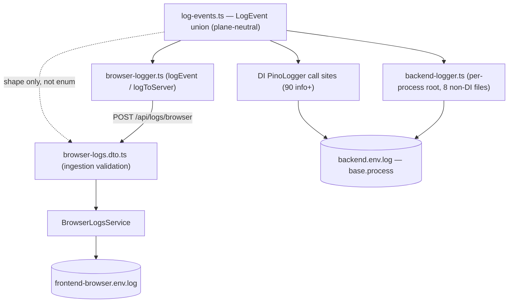
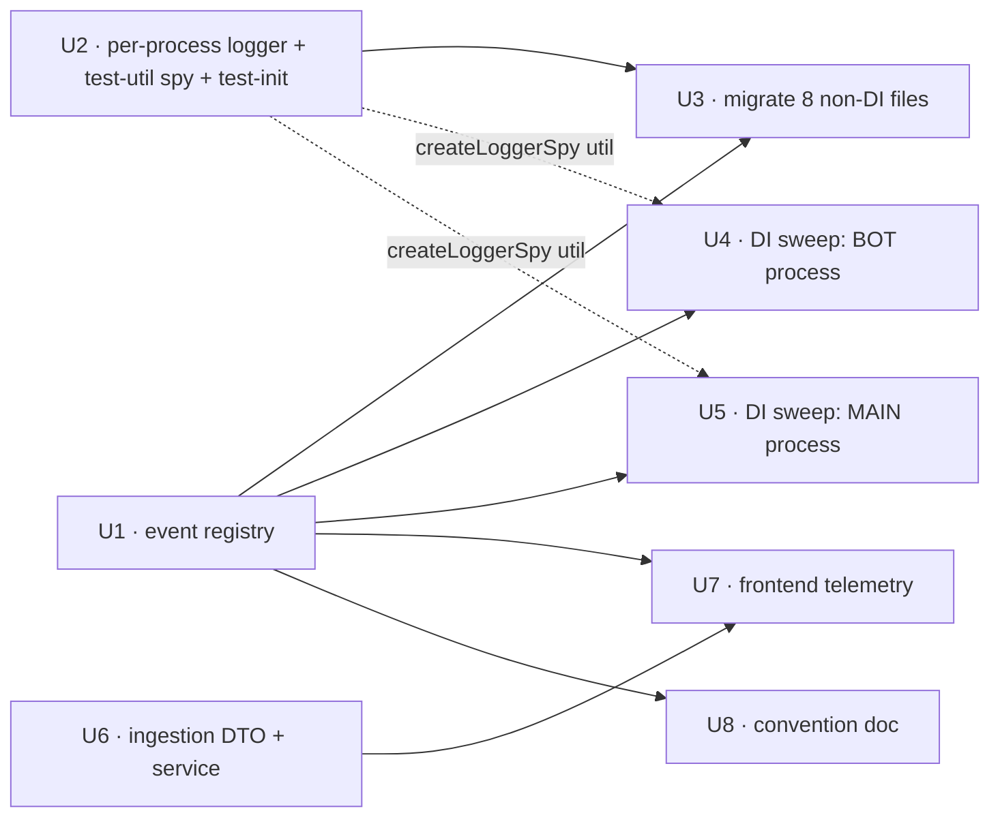

# feat: tdr-code structured-logging call-site standardization

## Overview

tdr-code's logging **plumbing** is already built (commit `5c04950`): three streams
(`backend`, `frontend-server`, `frontend-browser`) resolved through
`apps/tdr-code/src/logging/log-paths.ts`, shared redaction
(`REDACT_PATHS`/`redactionCensor` in `apps/tdr-code/src/logger.ts`), and a
browser-telemetry ingestion pipeline (`POST /api/logs/browser` → `BrowserLogsService`).

What is **not** standardized is the *call-site convention*. This plan introduces a single
typed, plane-neutral **event registry** that call sites import, requires a
machine-queryable `event` slug on every `info`/`warn`/`error`/`fatal` line alongside a
free-text human `msg`, ratifies the `err` error-key rule and extends it to the frontend,
and migrates the non-DI `@nestjs/common` `Logger` files (which cannot emit structured
fields) onto a shared per-process pino logger that reuses redaction. The outcome: an
operator can filter any stream by a stable `event` and get every occurrence; a developer
still reads prose `msg`; and auth/SSH-key redaction is provably unchanged.

This is a **call-site-convention refactor**, not a plumbing redesign. The sinks, transports,
dual dev/prod pino targets, and the `REDACT_PATHS`/`redactionCensor` machinery from `5c04950`
are reused, not rebuilt.

---

## Problem Frame

Message text is currently a free-for-all: capitalized sentences, lowercase fragments,
`namespace:`-prefixed strings, ad-hoc event constants. Frontend event slugs are snake_case
while errors log raw `error.message` into the human slot. The backend runs two logger styles —
DI `PinoLogger` (object-first, can emit structured fields) and a handful of non-DI
`@nestjs/common` `Logger` files (interpolated strings only, no structured fields possible).

The result: logs cannot be reliably queried. There is no stable field to filter or alert on,
so every new log line is a fresh judgment call and Loki/grep queries are unreliable — worst of
all in the auth/crypto/SSH-key files, which emit exactly the events an operator would want to
alert on. This work defines one convention, encodes it as a typed registry so a typo or
unregistered slug fails type-check, and fixes the deviations.

The convention serves three log *consumers* (origin actors): the **developer** in dev mode
(reads prose `msg` off the pino-pretty console), the **operator** in prod (queries the
`.prod.log` files filtering by `event`), and the **browser telemetry pipeline** (client events
→ `POST /api/logs/browser` → `frontend-browser` log; must stay fire-and-forget).

---

## Requirements Trace

- R1. Every `info`+ record carries a structured `event` slug (from the typed registry) plus a free-text human `msg`.
- R2. Event slugs are kebab-case (`session-teardown-failed`, `auth-denied`, `page-view`).
- R3. `event` is **required** on `info`/`warn`/`error`/`fatal`; **exempt** on `debug` (dev-only, dropped at the prod `info` threshold). *(User-confirmed Option A.)*
- R4. The error object is always logged under key `err` (never `error`/`e`) — **except** where the error's `.message`/`.stack` can carry secret material, in which case it is coarsened at the call site (see Key Technical Decisions, redaction control hierarchy). Backend mostly complies; ratify it, extend to the frontend, and normalize the stray `{ e }` sites.
- R5. Level semantics are documented (see [Level Semantics](#level-semantics) table) so the choice is not per-author guesswork.
- R6. A single plane-neutral registry module exports the event slugs and a `LogEvent` union; every event-emitting logger surface imports it. Unregistered slug ⇒ type-check failure. *(Enforcement covers the DI `PinoLogger`, the per-process backend logger, and the browser telemetry helpers; `frontendServerLogger` has no call sites today and adopts the union when it gains any — see the logger table.)*
- R7. The registry is organized into domain-prefixed sections (`auth-`, `session-`, `reconcile-`, `git-`, `git-identity-`, `mutation-`, `page-`, …).
- R8. Ad-hoc event strings fold into the registry as kebab-case: `auth_denied` → `auth-denied`, `auth_check_error` → `auth-check-error`, `guild_gate_rejected` → `guild-denied`, `guild_gate_check_error` → `guild-check-error`, `guild_gate_sweep` → `guild-sweep` (the guild slugs live in `auth.ts`), the `guild-gate.ts` lookup-outcome line → `guild-lookup-complete`, and the frontend snake_case slugs → kebab equivalents.
- R9. The non-DI `@nestjs/common` `Logger` files migrate to a shared **per-process** pino logger that writes the same `backend.<env>.log` sink and reuses `redactionCensor`, following the `browser-logs.service.ts` precedent. They gain the object-first API and emit structured `event` fields.
- R10. DI `PinoLogger` `info`+ call sites (90) are updated to carry an `event`. Where a message is already a de-facto event (e.g. `AUTH_DENIED_EVENT`), it becomes the structured `event` with a human `msg`.
- R11. The migration must not weaken secret hygiene. **Redaction control hierarchy:** call-site hygiene first (don't log secret-bearing strings), shape-anchored redact paths second (defense-in-depth). Load-bearing — the migrated files include the SSH-key and auth paths, and several secret shapes (`err.message`, stringified commands, dynamic keys, stack traces) are structurally un-pathable. **This hierarchy applies to the frontend browser stream too (U7), not only the backend** — a client-side `error.message`/`stack` is the same un-pathable free-text shape.
- R12. `logEvent` / `logToServer` carry a typed `event: LogEvent` and a human `msg`, preserving the fire-and-forget + `keepalive` + self-error-swallowing contract (never redirect on 401, never throw).
- R13. The browser ingestion DTO (`logging/browser-logs.dto.ts`) gains a validated `event` field (bounded kebab string); `BrowserLogsService` writes it as a structured field. The React Query cache chokepoint keeps working, now emitting typed events.
- R14. A documented set of common context keys (camelCase): `err`, `channelId`, `userId`, `discordUserId`, `sessionId`, `path`, plus the pino base `process`. Only `event` is type-enforced; context keys are conventional.
- R15. A `docs/solutions/` pattern doc captures the whole convention. The typed registry is the compile-time floor; an ESLint rule is desirable but deferred (see Scope Boundaries).

**Origin actors:** A1 (Developer, dev mode), A2 (Operator, prod), A3 (Browser telemetry pipeline)
**Origin flows:** none defined in origin
**Origin acceptance examples:**
- AE1 (covers R1, R4, R10) — realized at the **existing** `session-manager.service.ts` `'Session-row insert failed'` error log (a field-add: it already logs `{ err, channelId }`; U4 adds `event: 'session-insert-failed'`). This matches the origin example almost verbatim; the earlier "no such site" reading grepped the slug, not the message.
- AE2 (covers R9, R11) — realized at the guild-membership **rejection** log, which lives in `auth.ts` (`guild_gate_rejected` → `event: 'guild-denied'`), **not** `guild-gate.ts` (whose only info+ line is a lookup-complete line → `guild-lookup-complete`).
- AE3 (covers R3)
- AE4 (covers R8, R12, R13) — R13's server half is realized in U6; U7 emits the client half.

---

## Scope Boundaries

- **tdr-code only** — not standardizing logging across other lilnas apps.
- **Not redesigning the log transport / sinks / redaction** built in `5c04950`. In particular, **`buildLoggerOptions()` in `logger.ts` is not refactored** — the new per-process logger reuses the exported `redactionCensor` and authors its own shape-anchored paths (the `browser-logs.service.ts` precedent), rather than extracting a shared config factory (see Alternatives Considered).
- **Not building metrics/alerting off events.** Events *could* later feed Prometheus/Loki alerts; that pipeline is out of scope.
- **Not verifying or enabling Loki/promtail ingestion** of tdr-code's `/tmp` log files. The `.log` files are formally treated as the query surface for this work.
- **Not rewriting historical log data.** The snake_case → kebab-case rename creates a cutover point in existing browser-log history — acceptable this early. Verified: no external consumer (Grafana dashboard, alert rule, promtail label) references any snake_case slug — only tdr-code's own `src/app` code and its specs, all in-scope for U7.
- **Not tightening the ingestion DTO's `context` field.** `context: z.record(z.string(), z.unknown())` already accepts arbitrary shapes and continues to; a future call site that stuffs a secret into `context` bypasses the narrow `privateKey` paths exactly as it could before this work.
- **`debug` lines are not required to carry registry events** (R3, Option A). The 7 non-DI debug lines still migrate to the per-process logger (object-first shape) but carry no `event`; the 25 DI debug lines are left untouched.

### Deferred to Follow-Up Work

- **ESLint rule flagging `info`+ log calls missing an `event`** (R15): desirable enforcement beyond the type floor, out-of-scope here. The typed `LogEvent` union is the enforcement floor for now.
- **Shared logger-config factory consumed by `buildLoggerOptions()` too** — the fuller refactor that would make transport/level assembly impossible to drift between the DI and non-DI sinks (see Alternatives Considered). Deferred because it refactors the DI plumbing this work otherwise leaves alone; the security-critical piece (`redactionCensor`) is already single-source, so only a maintainability smell remains.
- **Wiring `frontendServerLogger` to the registry** — it has zero call sites today; when Next.js server code first needs an event log, it imports `LogEvent` then.
- **`/ce-compound` capture** of the plane-neutral registry decision, the per-process-logger migration approach, and the redaction control hierarchy — zero prior art exists (partially satisfied by U8's convention doc; a compound learning is the follow-up).

---

## Context & Research

### Relevant Code and Patterns

- **`apps/tdr-code/src/logging/log-paths.ts`** — the plane-neutral discipline the registry must mirror. Its entire import surface is framework-free (Node stdlib + dependency-free local modules). No `@nestjs/*`, no `react`/`next`, no `pino`.
- **`apps/tdr-code/src/env.ts`** (`EnvKeys`) — the established `as const` object-literal → derived-type convention the registry follows.
- **`apps/tdr-code/src/logging/browser-logs.service.ts`** — **the correct template** for the new per-process logger: it authored its **own** `BROWSER_LOG_REDACT_PATHS` anchored to its object shape (`context.*`), reusing `redactionCensor` but not `REDACT_PATHS`.
- **`apps/tdr-code/src/logging/frontend-server-logger.ts`** — **the anti-template.** It reuses `REDACT_PATHS` as-is and is safe *only because it has zero call sites* (its own header says so). The new logger has real call sites, so it must not copy this stance.
- **`apps/tdr-code/src/logger.ts`** — `buildLoggerOptions(processName)`, `REDACT_PATHS`, `redactionCensor`. Paths are **root-anchored and literal**: `*.privateKey` matches one level of nesting and does **not** match a flat root-level `privateKey`. `base: { process }` disambiguates the main + bot processes that both append `backend.<env>.log` under O_APPEND. **No custom `err` serializer is configured** — the pino default emits `err.message` + full `err.stack`.
- **Bootstrap wiring** (`src/bootstrap.ts`, `src/bot-bootstrap.ts`): each is a separate process entrypoint; `app.useLogger(app.get(Logger))` already routes `@nestjs/common` `Logger` output into `backend.<env>.log`. The non-DI migration is about call-site *shape* (a real top-level `event` field) and correct per-process `base.process`.
- **`apps/tdr-code/src/auth/auth.guard.ts`** — holds `AUTH_DENIED_EVENT`/`AUTH_CHECK_ERROR_EVENT` (R8 targets); `auth.guard.spec.ts` **already asserts these log calls** across multiple `toHaveBeenCalledWith` sites (unit + HTTP-mount describe blocks) using the exported constants — the one place log-assertions already exist.
- **`apps/tdr-code/src/auth/auth.ts`** — **two loggers coexist:** the `@nestjs/common` `Logger` (`const logger = new Logger('Auth')`) and Better Auth's injected `context.logger`. The guild-gate events (`guild_gate_rejected`, `guild_gate_check_error`, `guild_gate_sweep`) are logged here, several as *pairs* (one nest-Logger call + one framework call). Only the nest-Logger calls migrate.
- **`apps/tdr-code/src/auth/guild-gate.ts`** — its only info+ line is a *lookup-complete* line (`'Guild membership lookup complete …'`), not a rejection.
- **`apps/tdr-code/src/agent/session-manager.service.ts`** — `insertSession` at ~:670 (`'Reactivation session-row insert failed'`) and ~:828 (`'Session-row insert failed'`); both catch blocks already log `{ err, channelId }`. The ~:828 site realizes AE1.
- **`apps/tdr-code/src/discord/composite-acp-handler.ts`** — `handleWriterError` logs `{ err, op, channelId, code }, 'Writer fault'` (`event: 'writer-fault'`).
- **`apps/tdr-code/src/crypto/identity-resolution.ts`** — dual-plane (imported by the main-process `console/git-identity.service.ts` and the bot-process `agent/git-turn-context.ts`); logs `err.message` on the SSH-key parse-failure path (C1). Carries a hard **never-throw** contract (all errors map to `decrypt_failed`).
- **`apps/tdr-code/src/app/providers.tsx`** — the React Query cache chokepoint; logs `message: errorMessage(error)` (raw `.message`) for query/mutation failures.

### Institutional Learnings

- **No direct prior art.** `ce-learnings-researcher` found zero learnings on pino, nestjs-pino, redaction, NestJS logger migration, Loki, or tdr-code telemetry. Two conceptual analogues transfer:
  - `docs/solutions/architecture-patterns/pure-fsm-core-for-stateful-domain-logic-2026-05-27.md` — validates the "framework-free shared module consumed by every plane" instinct.
  - `docs/solutions/conventions/type-guards-over-nonnull-assertions-on-db-rows-2026-05-30.md` — compiler-enforced narrowing over casts; a strict `LogEvent` union makes an off-registry slug a compile error.
- Capture this work with `/ce-compound` after it lands (Deferred to Follow-Up Work).

### External References

- **None gathered.** Strong local pino patterns exist; the convention is decided; the security risk (R11) is a *regression* risk mitigated by real-serialized-output tests, not external docs.

### Technology Context

- pino **10.3.1**, nestjs-pino **4.4.1**, pino-http **11.0.0**, NestJS **11.1.6**, React **19.2.0**, Next.js **15.5.4**, Zod **4.1.12**, TypeScript path alias `src/*`.
- Build: **SWC** (`nest build -b swc --type-check`); `tsc --noEmit` is the type-check gate.
- Tests: **Jest 30**, three projects in `apps/tdr-code/jest.config.js`: `backend` (node, `src/**`, shared setup `src/__tests__/setup.ts`), `frontend` (jsdom, `src/app/**/*.tsx`), `scripts`. Mixed `.spec.ts`/`.test.ts` naming; `session-manager` and `discord-handler` each have both. The `backend` setup does only `jest.clearAllMocks()` today — it does **not** initialize any per-process logger.
- **Test gotcha:** full-suite runs crash on a `better-sqlite3` native-binding ABI mismatch under the default Node. Run specs/`tsc` under the Node-24 PATH override (`env PATH="$HOME/.local/share/nvm/v24.15.0/bin:$PATH" …`; verify ABI `137` first).
- **No barrel exports** in `apps/tdr-code/src` — import by concrete path; do not add `index.ts`.

---

## Key Technical Decisions

- **Single plane-neutral typed registry** (`src/logging/log-events.ts`): `as const` object literal grouped by domain, `LogEvent` derived via indexed access — mirroring `env.ts` and `log-paths.ts`. *(D1, D3, R6, R7)*
- **kebab-case slugs.** *(D2, R2)*
- **Per-process pino logger, not a module-level singleton, and not a second config source.** The 8 non-DI files log through a pino root **constructed per process at bootstrap** (`initBackendLogger('main')` in `bootstrap.ts`, `initBackendLogger('bot')` in `bot-bootstrap.ts`), retrieved by module-scope code via `getBackendLogger()` **called at log time** (never `.child()` at import time). Load-bearing because: (1) a fixed module singleton **cannot** stamp `base.process` correctly, and `crypto/identity-resolution.ts` is dual-plane — `getBackendLogger()` returns whichever process's root was initialized in *that* process, so the dual-plane file is correct automatically; (2) it preserves the O_APPEND line-attribution guarantee. **Invariant (load-bearing):** non-DI files must never log at module-eval time (verified true today — all 8 log only inside functions), or the fail-fast throw would crash bootstrap import. *(D4, R9 — supersedes the origin's "module-level logger" framing)*
- **Redaction control hierarchy (R11).** *Call-site hygiene first, redact paths second.* The new logger reuses `redactionCensor` (single source of truth for the mask value + `/auth/*` URL handling) and authors its own **flat-shape-anchored** `BACKEND_MODULE_REDACT_PATHS` (following `browser-logs.service.ts`), because the root-anchored `*.privateKey` does **not** match a flat `{ privateKey }`. Path redaction is defense-in-depth only: secrets inside `err.message`/`err.stack`, stringified git commands, dynamic-key maps (`env`), or array elements are structurally un-pathable and **must be prevented at the call site** — on the frontend (U7) as much as the backend (U3). *(R11)*
- **`err` logging is not blanket `{ err }`.** No custom `err` serializer exists, so converting a `${err.message}` string to `{ err }` would emit the full stack and *increase* leak surface. Low-risk errors use `{ err }`; the crypto-parse path (C1) and any error whose message can embed secret bytes are coarsened to `{ errName, ... }` (name/class only). Whether to add a scrubbing `err` serializer is decided in U2 (default lean: per-call-site, since a global serializer can't distinguish the crypto-parse case). *(R4, R11)*
- **Ingestion validates event *shape*, not *membership*.** The browser-logs DTO validates `event` as an optional bounded kebab string (≤64 chars), **not** a `z.enum` — ingestion stays robust across deploy skew. Safe against log-forging (pino escapes embedded newlines). Type-safety on the *emit* side (frontend `LogEvent`) is where R6 enforcement lives. **Never promote the client-supplied `event` to a Loki label** (attacker-influenced cardinality). *(R13)*
- **Frontend helper signatures:** `logEvent(event: LogEvent, context?)` (msg defaults to the slug) and `logToServer(level, event: LogEvent, msg, context?)`. Both preserve `keepalive` + `.catch(() => {})`. *(R12)*
- **`event` required on `info`+, exempt on `debug`.** User-confirmed Option A. *(D5, R3)*
- **DI sweep split by process, not domain.** U4 = **BOT-process** DI sites (agent + discord + commands, 9 files), U5 = **MAIN-process** DI sites (supervisor + bot-status + console + auth, 11 files). The process seam is clean (no main module imports a bot provider); the domain seam straddled it. *(Supersedes the origin's domain-cluster split)*
- **DI-sweep verification is "type-check + no-behavior-change" — and that has a known gap.** No shared logger-spy exists and almost no service spec asserts log calls today; the `session-manager` suite asserts zero log content. So green specs prove the service still works, **not** that the added event slugs are correct. Type-check catches *unregistered* slugs but **cannot** catch a *registered-but-wrong* slug (a copy-pasted `auth-denied` on a session site compiles and passes every spec). Mitigations: (a) U2 adds a shared `createLoggerSpy()` to `src/__tests__/test-utils.ts`; (b) log-content assertions are written for the AE-bearing sites; (c) a lightweight per-file structural check that every migrated `info`+ call has an `event:` key (catches *missing*, not *wrong*); (d) reviewers eyeball each slug against its call context. Accepted residual: a registered-but-semantically-wrong slug can still slip through.
- **Migrate all 8 non-DI files, not the origin's 5.** Inventory found 3 more (`agent/git-turn-context.ts`, `agent/git-write-lock.ts`, `supervisor/reaper.ts`). *(Corrects origin scope)*
- **`.log` files are the query surface; Loki ingestion out of scope.** *(Matches origin scope boundary)*
- **No barrel; pino eslint-disable** (`// eslint-disable-next-line import/no-named-as-default` on the pino import — repo-wide known false positive).

---

## Alternatives Considered

- **A second independent module-level pino instance** (the origin's framing, this plan's first draft). Rejected: a fixed `export const logger = pino(...)` singleton cannot know which process imported it, so it cannot set `base.process` correctly — and `crypto/identity-resolution.ts` runs in both processes. Replaced by a per-process root constructed at bootstrap + `getBackendLogger()` accessor.
- **A shared config factory consumed by `buildLoggerOptions()` too** (extract level/base/transport so the two sinks can never drift). The cleanest anti-drift design, but it refactors the DI plumbing the scope boundary excludes, and the security-critical piece (`redactionCensor`) is already single-source via exports. Chosen instead: follow the `browser-logs.service.ts` precedent (own shape-anchored paths + shared censor). Only transport/level assembly is re-derived per logger — a maintainability smell, not a redaction-value drift. Recorded as Deferred to Follow-Up Work.
- **Keep non-DI files on `@nestjs/common` `Logger`, embed the event in the message string.** Rejected in origin (D4): cannot produce a queryable top-level field.

---

## Open Questions

### Resolved During Planning

- **Registry location & shape** → `src/logging/log-events.ts`, `as const` grouped → derived `LogEvent`.
- **Backend logger shape** → per-process root via `initBackendLogger(processName)` + `getBackendLogger()` (called at log time), not a module singleton; own flat redact paths reusing `redactionCensor`.
- **Debug exemption** → Option A (event required `info`+ only). User-confirmed.
- **Ingestion validation** → validate `event` shape (bounded kebab, ≤64), not membership; never a Loki label.
- **DI sweep sequencing** → split by process (BOT / MAIN); verification is type-check + no-behavior-change + targeted AE assertions + structural `event:`-presence check.
- **Frontend helper signatures** → `logEvent(event, context?)` + `logToServer(level, event, msg, context?)`.
- **Query surface** → `.log` files; Loki out of scope.
- **Non-DI file scope** → all 8.
- **AE1 realization** → the existing `session-manager.service.ts` `'Session-row insert failed'` error log (~:828) gets `event: 'session-insert-failed'`; the ~:670 reactivation catch gets `reactivation-insert-failed`. Both already log `{ err, channelId }` — these are ordinary field-adds in U4, **no new error branch**. `writer-fault` (composite-acp-handler) is a separate related event.
- **AE2 realization** → the guild rejection log in `auth.ts` (`guild_gate_rejected` → `event: 'guild-denied'`), not `guild-gate.ts`.
- **`test-init` for the fail-fast logger** → the `backend` Jest setup (`src/__tests__/setup.ts`) initializes the per-process logger (or U3's migrated-file specs `jest.mock` the backend-logger module) so existing specs that reach a migrated log line stay green (see U2/U3).

### Deferred to Implementation

- **Scrubbing `err` serializer vs per-call-site coarsening** — decide in U2. Default lean: per-call-site (C1 coarsened, low-risk `{ err }` allowed).
- **Exact enumeration of all ~90 backend event slugs** — the registry grows as sites are touched (R6). U1 seeds structure + known slugs.
- **Exact locations of the stray `{ e }` sites** (R4) — inventory found 3 in supervisor/non-DI contexts; normalized to `{ err }` within whichever unit owns each file.
- **Reconcile slug parity across frontend/backend** — nice-to-have for cross-plane correlation; decided when U5 (`reconcile.service.ts`) and U7 (`reconcile-logging.ts`) are implemented.
- **Whether `auth.ts` keeps or drops the current double-logging** (both the nest `Logger` and Better Auth's `context.logger` fire for each guild-gate event today) — decided when U3 migrates `auth.ts`; the `context.logger` calls do **not** migrate to `getBackendLogger()` regardless.

---

## High-Level Technical Design

> *This illustrates the intended approach and is directional guidance for review, not implementation specification. The implementing agent should treat it as context, not code to reproduce.*

### Registry shape

```ts
// src/logging/log-events.ts
// Plane-neutral: Node stdlib + dependency-free local imports ONLY.
// No @nestjs/*, no react/next, no pino. Mirrors src/env.ts EnvKeys.

const AUTH_EVENTS = {
  authDenied: 'auth-denied',
  authCheckError: 'auth-check-error',
  guildDenied: 'guild-denied',          // auth.ts rejection (AE2)
  guildLookupComplete: 'guild-lookup-complete',  // guild-gate.ts
} as const

const SESSION_EVENTS = {
  sessionInsertFailed: 'session-insert-failed',  // session-manager (AE1)
  reactivationInsertFailed: 'reactivation-insert-failed',
  writerFault: 'writer-fault',
} as const

// …RECONCILE_EVENTS, GIT_IDENTITY_EVENTS, MUTATION_EVENTS, PAGE_EVENTS, etc.

export const LOG_EVENTS = { ...AUTH_EVENTS, ...SESSION_EVENTS /* …merge all */ } as const
export type LogEvent = (typeof LOG_EVENTS)[keyof typeof LOG_EVENTS]
export const LOG_EVENT_VALUES: readonly LogEvent[] = Object.values(LOG_EVENTS)
```

### Per-process backend logger (resolves the dual-plane `base.process` gap)

```ts
// src/logging/backend-logger.ts — reuses redactionCensor; authors flat-shape paths.
// initBackendLogger('main' | 'bot') is called ONCE at each process entrypoint;
// getBackendLogger() (called at log time) returns that process's root. A dual-plane
// file that calls getBackendLogger() gets the correct per-process logger automatically.

// bootstrap.ts        -> initBackendLogger('main')
// bot-bootstrap.ts    -> initBackendLogger('bot')
// jest backend setup  -> initBackendLogger('bot')   // so migrated-file specs stay green
// non-DI module code  -> getBackendLogger().warn({ event, ...ctx }, 'msg')
```

### How the registry feeds every stream



### Level Semantics

| Level | When | Example event |
|---|---|---|
| `debug` | Dev-only tracing; dropped in prod; **no event required** | *(eventless — e.g. per-permission ACP trace)* |
| `info` | Lifecycle milestones + audit of state-changing successes | `prompt-received`, `mutation-success` |
| `warn` | Recoverable / degraded; handled but notable | `auth-denied`, `reconcile-mismatch` |
| `error` | An operation failed and needs attention | `writer-fault`, `session-insert-failed` |
| `fatal` | Process-ending only | `bot-spawn-fatal` |

### Which logger to use where

| Context | Logger | Call shape |
|---|---|---|
| Nest service/controller with DI | injected `PinoLogger` (`nestjs-pino`) | `logger.info({ event, ...ctx }, msg)` |
| Module-level backend code (the 8 non-DI files) | `getBackendLogger()` | `getBackendLogger().info({ event, ...ctx }, msg)` |
| Next.js server code | `frontendServerLogger` *(no call sites yet; not wired to the registry — imports `LogEvent` when it gains callers, per Deferred to Follow-Up Work)* | `logger.info({ event, ...ctx }, msg)` |
| Browser | `logEvent` / `logToServer` | `logEvent(event, ctx)` / `logToServer(level, event, msg, ctx)` |

Pino call shape everywhere: **`logger.level(mergingObject, message)`** — the `event` field goes in the *first* (object) arg; the human message is the *second* arg.

---

## Unit Dependency Graph



U1, U2, and U6 are independent roots (parallelizable). U4/U5 hard-depend on U1 and soft-depend on U2 for the shared `createLoggerSpy()` util.

---

## Implementation Units

- U1. **Event registry module**

**Goal:** Create the single plane-neutral typed registry exporting kebab-case event slugs and the `LogEvent` union, grouped by domain, seeded with the already-known slugs.

**Requirements:** R2, R6, R7, R8 (seed)

**Dependencies:** None

**Files:**
- Create: `apps/tdr-code/src/logging/log-events.ts`
- Test: `apps/tdr-code/src/logging/log-events.spec.ts`

**Approach:**
- `as const` domain-grouped object literals merged into `LOG_EVENTS`; `LogEvent` via indexed access; `LOG_EVENT_VALUES` runtime catalog.
- Seed known slugs: `auth-denied`, `auth-check-error` (from `auth.guard.ts`); the guild slugs `guild-denied`, `guild-check-error`, `guild-sweep` (from `auth.ts`) and `guild-lookup-complete` (from `guild-gate.ts`); `session-insert-failed`, `reactivation-insert-failed` (from `session-manager.service.ts`, for AE1); `writer-fault` (from `composite-acp-handler.ts`); and the seven frontend kebab conversions. Subsequent units add their domain slugs.
- **Plane-neutrality is load-bearing:** imports limited to Node stdlib / dependency-free local modules — no `@nestjs/*`, `react`/`next`, or `pino`.

**Patterns to follow:**
- `apps/tdr-code/src/env.ts` (`EnvKeys` `as const` → derived type); `apps/tdr-code/src/logging/log-paths.ts` (framework-free imports; no barrel).

**Test scenarios:**
- Happy path: every value in `LOG_EVENT_VALUES` matches `/^[a-z0-9]+(-[a-z0-9]+)*$/` (kebab-case, R2).
- Edge case: no duplicate slugs across domain groups (`new Set(values).size === values.length`).
- Edge case: seeded slugs present (`auth-denied`, `auth-check-error`, `guild-denied`, `session-insert-failed`, `writer-fault`, the 7 frontend slugs) — guards the R8 fold-in.
- Happy path (compile): a known slug is assignable to `LogEvent`; a bogus string is a `// @ts-expect-error`.

**Verification:**
- Registry compiles with no framework imports; `LogEvent` narrows at call sites; spec green.

---

- U2. **Per-process backend logger + shared test-util spy + test-init**

**Goal:** Create a per-process pino logger for non-DI backend code (correct `base.process`, reused `redactionCensor`, flat-shape-anchored redact paths incl. poison-pills), add a shared `createLoggerSpy()`, and initialize the logger in the `backend` Jest setup so migrated-file specs stay green.

**Requirements:** R9, R11

**Dependencies:** None *(parallel with U1; U3 needs both)*

**Files:**
- Create: `apps/tdr-code/src/logging/backend-logger.ts` (`initBackendLogger(processName)`, `getBackendLogger()`, `BACKEND_MODULE_REDACT_PATHS`)
- Modify: `apps/tdr-code/src/bootstrap.ts` (call `initBackendLogger('main')` early)
- Modify: `apps/tdr-code/src/bot-bootstrap.ts` (call `initBackendLogger('bot')` early)
- Modify: `apps/tdr-code/src/__tests__/setup.ts` (call `initBackendLogger('bot')` so specs reaching a migrated log line don't hit the fail-fast throw)
- Modify: `apps/tdr-code/src/__tests__/test-utils.ts` (add `createLoggerSpy()` returning a captured pino-shaped jest-mock)
- Test: `apps/tdr-code/src/logging/backend-logger.spec.ts`

**Approach:**
- `initBackendLogger(processName: 'main' | 'bot')` builds a pino root with `base: { process: processName }`, level (`info` prod / `debug` dev), `redact: { paths: BACKEND_MODULE_REDACT_PATHS, censor: redactionCensor }`, dev/prod dual transport (mirror `frontend-server-logger.ts`, with a real redact set). Store in a module var; `getBackendLogger()` returns it (throws if uninitialized — fail-fast so a missing bootstrap call is loud).
- **`BACKEND_MODULE_REDACT_PATHS` (flat-anchored + poison-pills):** flat root + one-level nesting for `privateKey`, `keyPlaintext`, `accessToken`, `refreshToken`, `cookie`, `authorization`, `token`, `secret`; poison-pills `env`, `signingKey`/`signing_key`, `sshCommand`, `keyPath`, `GIT_CONFIG_VALUE_1`. (Note: `sshCommand` today carries only a tmpfs key *path*, not key bytes — the poison-pill is defense-in-depth against a future edit that logs key content.) Reuse `redactionCensor` unchanged.
- **Test-init (fail-fast handling):** because `getBackendLogger()` throws when uninitialized and the `backend` setup currently only clears mocks, specs that exercise a migrated file's non-debug log line would throw post-U3. Initialize the logger once in `src/__tests__/setup.ts`. (U3 may alternatively `jest.mock` the module per-file; U2 states the default is setup-level init.)
- **`err` serializer decision:** default lean is *no* global serializer — error hygiene per-call-site in U3. If a scrubbing serializer is chosen, document why and test it.
- Add `// eslint-disable-next-line import/no-named-as-default` on the pino import.

**Execution note:** Author the redaction test harness first (real-serialized-output style) so redaction is proven before any real call site writes through this logger.

**Patterns to follow:**
- `apps/tdr-code/src/logging/browser-logs.service.ts` (own shape-anchored paths + reused censor) — **the correct template**, not `frontend-server-logger.ts`.
- `apps/tdr-code/src/auth/__tests__/auth-mount.spec.ts` (`pino redaction — real serialized output`) and `apps/tdr-code/src/logging/browser-logs.service.spec.ts` (write real lines, read bytes back, assert `[Redacted]` **and** `not.toContain(sentinel)`).
- `apps/tdr-code/src/logging/log-paths.spec.ts` (`setNodeEnv` `Object.defineProperty` workaround).

**Test scenarios:**
- Happy path: after `initBackendLogger('bot')`, `getBackendLogger().warn({ event: 'x', channelId }, 'msg')` writes a line with `event`, `channelId`, `msg`, and `process: 'bot'` as top-level JSON.
- Error path / redaction (R11): logging `{ event, privateKey: 'SENTINEL' }` masks `privateKey` **and** `not.toContain('SENTINEL')`; repeat for a flat `accessToken` and a poison-pill `env` object.
- Error path: `getBackendLogger()` before `initBackendLogger()` throws (fail-fast).
- Edge case: prod transport is file-only at `info`; dev adds pino-pretty at `debug`.
- Edge case: `process` differs between a `'main'` root and a `'bot'` root.
- Happy path: `createLoggerSpy()` returns a mock whose `.info/.warn/.error/.debug` are assertable via `expect.objectContaining({ event })` on arg 1.
- Integration: a spec that imports a would-be-migrated function and reaches its log line does not throw once `setup.ts` initializes the logger.

**Verification:**
- Redaction proven (both `[Redacted]` and `not.toContain`); `base.process` correct per process; `createLoggerSpy()` usable by U4/U5; backend specs reaching migrated log lines stay green; spec green.

---

- U3. **Migrate the 8 non-DI files to the per-process logger**

**Goal:** Replace `@nestjs/common` `Logger` in all 8 files with `getBackendLogger()` object-first calls, apply call-site secret hygiene, handle `auth.ts`'s dual-logger structure, and prove redaction is intact.

**Requirements:** R4, R8, R9, R10 (non-DI subset), R11, R14; **AE2**

**Dependencies:** U1, U2

**Files:**
- Modify: `apps/tdr-code/src/agent/acp-client.ts` (canonical header comment — update the rationale)
- Modify: `apps/tdr-code/src/crypto/identity-resolution.ts` (**C1 fix** — dual-plane, never-throw)
- Modify: `apps/tdr-code/src/discord/image-attachments.ts`
- Modify: `apps/tdr-code/src/auth/guild-gate.ts` (lookup-complete line → `guild-lookup-complete`)
- Modify: `apps/tdr-code/src/auth/auth.ts` (**dual-logger** — migrate only the nest `Logger` calls; realizes AE2)
- Modify: `apps/tdr-code/src/agent/git-turn-context.ts`
- Modify: `apps/tdr-code/src/agent/git-write-lock.ts`
- Modify: `apps/tdr-code/src/supervisor/reaper.ts`
- Test: extend `apps/tdr-code/src/logging/backend-logger.spec.ts` (the real shapes these files log); add/extend a spec for the C1 coarsening (`apps/tdr-code/src/crypto/__tests__/identity-resolution.spec.ts`); the existing specs for these files (`guild-gate.spec.ts`, `git-turn-context`, `git-write-lock`, `reaper`, `image-attachments`, `identity-resolution`) must stay green under the U2 test-init

**Approach:**
- Per file: swap `new Logger('Name')` + interpolated calls for `getBackendLogger()` object-first calls. The ~14 `info`+ nest-`Logger` sites (3 `log`→`info`, 9 `warn`, 2 `error`) get a registered `event`; the 7 `debug` sites migrate **eventless** (R3/AE3). Exact per-file counts are settled during migration (see the `auth.ts` note).
- **`auth.ts` dual-logger (A-1):** the file has BOTH `const logger = new Logger('Auth')` and Better Auth's injected `context.logger`; several guild-gate events log as *pairs*. Migrate **only** the nest-`Logger` calls to `getBackendLogger()`. Leave the `context.logger` calls untouched (framework plumbing, message-first signature). Decide whether to keep or drop the now-redundant double-log (see Open Questions). This is the AE2 site: the `guild_gate_rejected` nest-Logger warn becomes `{ event: 'guild-denied', ... }`.
- **C1 (critical): `identity-resolution.ts` decrypt/parse-failure path must NOT interpolate `err.message`** (sshpk parse errors embed decoded private-key bytes). Log `discordUserId`, `keyFingerprint`, `err.name`/class only — mirroring `console/git-identity.service.ts`. The GCM decrypt-failure message (`"Unsupported state or unable to authenticate data"`) is secret-free and may be logged.
- **Never-throw guard (F-2):** `resolveIdentity` must not throw. Ensure the `getBackendLogger()` call on the decrypt-failed path cannot escape that boundary — either wrap it (`try { … } catch {}`) or rely on the invariant that both bootstraps call `initBackendLogger` before any `resolveIdentity` path is reachable (the log-time-only accessor makes this safe in practice); record whichever guarantee is chosen next to the C1 fix.
- **H1/L3 invariants:** grep-gate (expected count zero) that `env`, `process.env`, `keyPlaintext`, `signing_key`, `sshCommand`, `GIT_CONFIG*`, `rawInput`/`newText`/`oldText`/`update.content` are never logger arguments. Record the "never log at module-eval time" invariant next to the `git-turn-context.ts` key handling.
- **M2:** preserve the `guild-gate.ts`/`auth.ts` OAuth-token discipline (they never log the token); distinguish the low-risk guild-fetch `err.message` from the dangerous crypto-parse one.
- Normalize any `{ e }` → `{ err }` found here (`reaper.ts`). Apply the R14 context-key vocabulary.

**Execution note:** Migrate `acp-client.ts` first (canonical header), then `identity-resolution.ts` (the C1 fix is highest-severity).

**Patterns to follow:**
- Object-first shape in `apps/tdr-code/src/discord/composite-acp-handler.ts`; the "don't log parse errors" discipline in `apps/tdr-code/src/console/git-identity.service.ts`.

**Test scenarios:**
- Covers AE2. The `auth.ts` guild rejection logs `{ event: 'guild-denied', ... }` as structured fields (real-serialized-output assertion) — asserted at the `auth.ts` nest-`Logger` site, not `guild-gate.ts`.
- Error path / redaction (C1): a decrypt/parse failure in `identity-resolution.ts` produces a line carrying `keyFingerprint` + `err.name`, containing **no** `err.message`, and **`not.toContain(<planted key-byte sentinel>)`**.
- Error path / redaction: for each secret-adjacent field the 8 files emit, a real-serialized-output test asserts `[Redacted]` **and** `not.toContain(sentinel)`.
- Happy path: `guild-gate.ts`'s lookup-complete line emits `{ event: 'guild-lookup-complete', durationMs, ok, status }`.
- Edge case (AE3): a migrated `debug` line writes with no `event` and passes type-check.
- Regression: `auth.ts`'s `context.logger` calls are unchanged; the existing file specs stay green under the U2 test-init.
- Guard: grep-gate assertions confirm the H1/L3 fields never appear as logger args.

**Verification:**
- All 8 files free of `@nestjs/common` `Logger` for the nest-Logger calls; `auth.ts` framework calls untouched; C1 fixed; `info`+ sites carry registered events; redaction tests prove no secret leaks; existing specs green.

---

- U4. **DI PinoLogger event sweep — BOT process**

**Goal:** Add `event` fields to the `info`+ DI sites in the bot-process cluster (9 files), realizing AE1 at the existing session-insert error log — without changing behavior.

**Requirements:** R1, R4, R8, R10; **AE1**

**Dependencies:** U1 *(soft: U2 for `createLoggerSpy()`)*

**Files:**
- Modify: `apps/tdr-code/src/agent/session-manager.service.ts` (29 sites incl. debug — **isolate as its own commit**. Its `insertSession` catch blocks at ~:670 / ~:828 already log `{ err, channelId }`; add `event: 'reactivation-insert-failed'` / `'session-insert-failed'` — **AE1**, a field-add, no new branch)
- Modify: `apps/tdr-code/src/discord/composite-acp-handler.ts` (`handleWriterError` → add `event: 'writer-fault'`)
- Modify: `apps/tdr-code/src/commands/command-poller.service.ts` (7; the pre-existing `type: 'reread_config'` is a separate field — add `event` alongside it, do not rename it)
- Modify: `apps/tdr-code/src/discord/bot-lifecycle.service.ts` (11)
- Modify: `apps/tdr-code/src/discord/sqlite-writer.service.ts` (3)
- Modify: `apps/tdr-code/src/discord/context-usage.service.ts` (4)
- Modify: `apps/tdr-code/src/discord/discord-handler.service.ts` (5)
- Modify: `apps/tdr-code/src/discord/clear-command.service.ts` (3)
- Modify: `apps/tdr-code/src/discord/stop-button.service.ts` (1)
- Test: add `createLoggerSpy()` assertions in `apps/tdr-code/src/agent/__tests__/session-manager.service.spec.ts` (AE1 `session-insert-failed`) and `apps/tdr-code/src/discord/__tests__/composite-acp-handler.spec.ts` (`writer-fault`) — both assert **new** scaffolding, since neither suite asserts log content today; other files rely on type-check + existing specs + the structural `event:`-presence check

**Approach:**
- For each `info`/`warn`/`error` site, add `event: <registered slug>` to the existing first (object) arg; keep the human `msg`. Add slugs to the registry (U1) as encountered. `debug` sites left untouched.
- **AE1:** the origin example maps verbatim to the existing `session-manager.service.ts` `'Session-row insert failed'` error log — add the slug, no new error branch.
- **Naming caution:** the new `event` field is distinct from pre-existing `op:` and `type:` fields; do **not** rename the `type` DB column on `insertEvent`.
- **Correctness guard (see Key Technical Decisions):** because `session-manager`'s suite asserts no log content, add a lightweight per-file check that every migrated `info`+ call has an `event:` key from the registry (catches *missing* events; type-check cannot catch a registered-but-wrong slug — reviewers eyeball each slug against its call context).

**Patterns to follow:**
- Existing object-first calls (`composite-acp-handler.ts`, `clear-command.service.ts`); `createLoggerSpy()` from U2; the assertion style in `auth.guard.spec.ts`.

**Test scenarios:**
- Covers AE1. `session-manager.service.ts`'s insert-failure error log carries `{ event: 'session-insert-failed', err, channelId }`; assert via a new `createLoggerSpy()` capture (`expect.objectContaining({ event: 'session-insert-failed' })` on arg 1).
- Happy path: `handleWriterError` carries `{ event: 'writer-fault', err, op, channelId }` (new spy assertion).
- Edge case: `debug` sites remain eventless/unchanged.
- Structural: every migrated `info`+ call in the cluster has an `event:` key (presence check).
- Regression: existing bot-service specs stay green; `tsc --noEmit` passes.

**Verification:**
- AE1 + `writer-fault` asserted; all bot-process `info`+ sites carry registered events; structural presence check passes; `tsc --noEmit` passes; existing specs green; no behavior change.

---

- U5. **DI PinoLogger event sweep — MAIN process**

**Goal:** Add `event` fields to the `info`+ DI sites in the main-process cluster (11 files), and convert `auth.guard.ts`'s ad-hoc event string-constants into structured events.

**Requirements:** R1, R4, R8, R10

**Dependencies:** U1 *(soft: U2 for `createLoggerSpy()`)*

**Files:**
- Modify: `apps/tdr-code/src/auth/auth.guard.ts` (`AUTH_DENIED_EVENT`/`AUTH_CHECK_ERROR_EVENT` msg-strings → `event: 'auth-denied'` / `'auth-check-error'` with human `msg`)
- Modify: `apps/tdr-code/src/supervisor/supervisor.service.ts` (21; normalize any `{ e }`→`{ err }`)
- Modify: `apps/tdr-code/src/bot/bot-status.service.ts` (1)
- Modify: `apps/tdr-code/src/console/lifecycle.controller.ts` (8)
- Modify: `apps/tdr-code/src/console/discord-directory.service.ts` (3)
- Modify: `apps/tdr-code/src/console/git-identity.service.ts` (3)
- Modify: `apps/tdr-code/src/console/config.service.ts` (3)
- Modify: `apps/tdr-code/src/console/reconcile.service.ts` (3)
- Modify: `apps/tdr-code/src/console/auth-admin.controller.ts` (2)
- Modify: `apps/tdr-code/src/console/sessions.service.ts` (1)
- Modify: `apps/tdr-code/src/console/live.service.ts` (1)
- Test: update **all** `auth.guard.ts` log assertions in `apps/tdr-code/src/auth/__tests__/auth.guard.spec.ts` — the constants are asserted across ~4 `toHaveBeenCalledWith` sites (unit + HTTP-mount describe blocks), each moving the event from the msg position (arg 2) into `event:` (arg 1). **Do not assume a spec exists per file** — `config.service.ts`, `git-identity.service.ts`, `auth-admin.controller.ts` have no dedicated spec.

**Approach:**
- Same field-addition approach as U4; `debug` sites untouched; structural `event:`-presence check applies here too.
- `auth.guard.ts`: the string constants become the structured `event` values (kebab). Security-relevant and already asserted — update every assertion site (not just one).
- `reconcile.service.ts`: choose reconcile slugs; with U7, decide whether backend/frontend reconcile slugs are identical for cross-plane correlation.

**Patterns to follow:**
- The existing `auth.guard.spec.ts` assertions (the model); `createLoggerSpy()` from U2.

**Test scenarios:**
- Happy path (security-relevant): the auth-denied path logs `{ event: 'auth-denied', path, ... }` (kebab) — update every existing `auth.guard.spec.ts` assertion site.
- Happy path: the auth-check-error path logs `{ event: 'auth-check-error', err, ... }`; keep the constant-inequality assertion (`auth-check-error !== auth-denied`).
- Edge case: `debug` sites unchanged.
- Structural: every migrated `info`+ call has an `event:` key.
- Regression: existing auth/console specs stay green; `tsc --noEmit` passes.

**Verification:**
- `auth.guard.ts` emits structured kebab events (all assertion sites updated); all main-process `info`+ sites carry registered events; `tsc --noEmit` passes; existing specs green.

---

- U6. **Browser ingestion DTO + service accept a validated `event`**

**Goal:** Extend the browser-logs ingestion contract to accept and persist a validated `event` field, without coupling ingestion to registry membership.

**Requirements:** R13

**Dependencies:** None *(independent root; U7 depends on it)*

**Files:**
- Modify: `apps/tdr-code/src/logging/browser-logs.dto.ts` (add `event`: optional, kebab regex, `.max(64)`)
- Modify: `apps/tdr-code/src/logging/browser-logs.service.ts` (write `event` as a top-level field)
- Test: extend `apps/tdr-code/src/logging/browser-logs.service.spec.ts` and `apps/tdr-code/src/logging/browser-logs.controller.spec.ts`

**Approach:**
- DTO: `event: z.string().regex(kebabPattern).max(64).optional()`. **Not** a `z.enum` (tolerate slug drift). Length cap is a per-line size guard.
- Service: destructure `event` alongside `level`/`message`; include it as a top-level field. Preserve `BROWSER_LOG_REDACT_PATHS` + `redactionCensor` and the `context`-vs-`rest` naming.
- Note in code: `event` is a queryable field, **never** a Loki stream label.

**Patterns to follow:**
- `apps/tdr-code/src/logging/browser-logs.service.ts` (`write` destructure + per-service redact paths); `browser-logs.dto.ts` (Zod schema, length caps).

**Test scenarios:**
- Happy path: an entry with `event: 'button-click'` → written line has `event` as a top-level field (real-serialized-output).
- Edge case: an entry with **no** `event` (legacy/omitted) is still written, no crash.
- Error path: an `event` over 64 chars or non-kebab fails `safeParse` → controller returns 400.
- Error path / log-forging: `event: 'x\nfake-line'` cannot manufacture a second log line (pino escapes the newline) — assert one line written.
- Error path / redaction: adding `event` does not disturb existing redaction — `context.privateKey` still masked, OAuth `code`/`state` still stripped.

**Verification:**
- DTO validates `event` shape; service persists it; existing browser-log redaction/level specs green.

---

- U7. **Frontend telemetry — typed events**

**Goal:** Give `logEvent`/`logToServer` a typed `event: LogEvent` + human `msg`, migrate all 13 call sites to kebab slugs, assign real events to the 3 raw-`error.message` sites, apply the redaction control hierarchy to the browser stream, and preserve the fire-and-forget contract.

**Requirements:** R1, R2, R4, R8, R11 (frontend), R12, R13 (client half; server half in U6); **AE4**

**Dependencies:** U1, U6

**Files:**
- Modify: `apps/tdr-code/src/app/lib/browser-logger.ts` (new signatures; keep `keepalive`, `.catch(() => {})`, no-401-redirect, path+query-only URL)
- Modify: `apps/tdr-code/src/app/lib/page-view-tracker.tsx` (`page_view` → `page-view`)
- Modify: `apps/tdr-code/src/app/lib/click-tracker.tsx` (`button_click` → `button-click`)
- Modify: `apps/tdr-code/src/app/providers.tsx` (React Query chokepoint: `query_error`, `mutation_error`, `mutation_success` → kebab; coarsen the logged `message: errorMessage(error)` per the hygiene note below)
- Modify: `apps/tdr-code/src/app/lib/reconcile-logging.ts` (`reconcile_result`, `reconcile_mismatch` → kebab)
- Modify: `apps/tdr-code/src/app/lib/error-reporter.tsx` (2 raw-message sites → typed error event + `err` in context)
- Modify: `apps/tdr-code/src/app/lib/error-boundary-logging.ts` (1 raw-message site → typed error event + `err`)
- Test: `apps/tdr-code/src/app/__tests__/browser-logger.spec.tsx`, `providers.spec.tsx`, `error.spec.tsx`, `page-view-tracker.spec.tsx`, `reconcile-logging.spec.tsx`, `click-tracker.spec.tsx` (these currently hard-assert the snake_case values — update them)

**Approach:**
- `logEvent(event: LogEvent, context?)` — telemetry; internally `logToServer('info', event, event, context)` (msg defaults to the self-describing slug).
- `logToServer(level, event: LogEvent, msg, context?)` — body `{ level, event, message: msg, context, url, userAgent }`.
- The 3 raw-`error.message` sites → `logToServer('error', 'unhandled-error' | 'error-boundary-caught' | …, error.message, { err })`.
- **Frontend redaction hygiene (R11, S-1):** a browser `error.message`/`stack` is the same un-pathable free-text shape the backend coarsens (C1). The `frontend-browser` sink only redacts `context.privateKey`. So: **size-cap `stack`** before it leaves the browser (the DTO caps `message` at 2000 but not `context.stack`), and treat a raw stack as lower-risk than a backend SSH key but not zero-risk — document the decision. Apply the same reasoning to `providers.tsx`'s raw query/mutation `error.message` (a failed config/git-identity save message could carry secret-adjacent text): cap/scrub it rather than shipping it verbatim.
- Add the frontend slugs to the registry (U1). Preserve every line of the fire-and-forget contract.

**Patterns to follow:**
- Existing `browser-logger.ts` contract (must not reuse `api.ts`'s `request()`); existing `browser-logger.spec.tsx` body assertions.

**Test scenarios:**
- Covers AE4. `logEvent('button-click', { id })` POSTs `{ event: 'button-click', level: 'info', message, ... }` with `keepalive: true` — assert body + `keepalive` (unload delivery).
- Happy path: the 7 renamed slugs emit kebab (`page-view`, not `page_view`).
- Error path: an error-reporter site posts `{ event: 'unhandled-error', level: 'error', message, context: { err } }` with the `stack` size-capped.
- Error path / contract: a rejected `fetch` is swallowed (no throw, no 401 redirect) — existing contract test still passes.
- Edge case (compile): an unregistered slug is a type error (`// @ts-expect-error`).

**Verification:**
- All 13 sites emit typed kebab events; error sites carry `err` with a size-capped `stack`; fire-and-forget contract intact; frontend specs green.

---

- U8. **Convention pattern doc**

**Goal:** Document the whole convention so it guides new code beyond this change.

**Requirements:** R5, R14, R15

**Dependencies:** U1 *(best written after the convention is proven across U2–U7)*

**Files:**
- Create: `docs/solutions/conventions/tdr-code-structured-logging-convention-2026-07-03.md`

**Approach:**
- YAML frontmatter (`module: tdr-code/logging`, `tags`, `problem_type: convention`, `component`).
- Capture: the `event` + `msg` record shape (R1); the Level Semantics table (R5); registry usage + how to add a slug (R6/R7); the context-key vocabulary (R14); the "which logger to use where" matrix incl. the per-process `getBackendLogger()` pattern and the `frontendServerLogger` "wire on first call site" note; **the redaction control hierarchy** (call-site hygiene first, paths second; the un-pathable `err.message`/command/dynamic-key/stack cases; that it applies to the frontend browser stream too; the real-serialized-output `not.toContain` test model); and the debug exemption (R3).

**Patterns to follow:**
- Existing `docs/solutions/conventions/*.md` frontmatter + slug + date format.

**Test scenarios:**
- Test expectation: none — documentation, no behavioral change.

**Verification:**
- Doc exists under `docs/solutions/conventions/`, frontmatter valid, covers every element listed.

---

## System-Wide Impact

- **Interaction graph:** Two backend logger styles collapse to one object-first convention over two logger *instances* (DI `PinoLogger` + the per-process `getBackendLogger()` root), both writing `backend.<env>.log` disambiguated by `base.process`. The React Query cache chokepoint (`app/providers.tsx`) routes query/mutation success+error through typed events.
- **Error propagation:** Errors are logged under `err` (backend ratified, frontend moved out of the `msg` slot, stray `{ e }` normalized) — **except** where `err.message`/`err.stack` can carry secrets (backend crypto-parse C1; frontend stack traces), which are coarsened/size-capped at the call site.
- **State lifecycle risks:** Logging is side-effect-only. The load-bearing invariant is **redaction correctness**, defended in depth on both planes: call-site hygiene (primary) + shape-anchored paths (secondary). `getBackendLogger()`'s fail-fast guards an uninitialized-logger bug; the "never log at module-eval time" invariant keeps the fail-fast from crashing bootstrap import; `resolveIdentity`'s never-throw contract is preserved around its log call.
- **API surface parity:** `POST /api/logs/browser` DTO gains `event` (shape-validated, ≤64, never a Loki label); both `logEvent` and `logToServer` carry it.
- **Integration coverage:** Redaction is proven with **real-serialized-output** tests asserting both `[Redacted]` **and** `not.toContain(sentinel)`. `keepalive` delivery on unload is asserted (AE4). Migrated non-DI files' existing specs stay green via the U2 test-init.
- **Unchanged invariants:** `buildLoggerOptions()` and its `REDACT_PATHS` are untouched; `log-paths.ts` stream resolution is untouched; the pino-http DI logger's transport/levels are untouched; the `/tmp/tdr-code/*.log` sinks are untouched; the `type` DB column on `insertEvent` is not renamed; `auth.ts`'s Better Auth `context.logger` calls are not migrated. The existing `auth-mount.spec.ts` redaction suite must stay green as the proof.

---

## Risks & Dependencies

| Risk | Likelihood | Impact | Mitigation |
|------|-----------|--------|------------|
| **C1:** `identity-resolution.ts` logs `err.message`, which embeds decoded private-key bytes on the sshpk parse-failure path — un-pathable by redaction | Med | **Critical** | U3 fixes at the call site: log `keyFingerprint` + `err.name` only; test asserts `not.toContain(<key-byte sentinel>)` |
| **H1:** spawn `env` (`...process.env` + key path), `sshCommand`, `keyPlaintext` are one careless edit from leaking | Low | High | U2 poison-pill redact paths; U3 grep-gate assertions; invariant recorded next to `git-turn-context.ts` key handling |
| **H2:** reused `redactionCensor` no-ops on flat shapes; several secret shapes are structurally un-pathable | Med | High | Redaction control hierarchy (hygiene first, paths second); `browser-logs.service.ts` template; real-serialized-output `not.toContain` tests |
| **F-1:** the `backend` Jest setup never initializes the per-process logger, so `getBackendLogger()` fail-fast throws in ~6 migrated-file specs — breaking the "specs stay green" bar | High | Med | U2 calls `initBackendLogger('bot')` in `src/__tests__/setup.ts` (or U3 `jest.mock`s the module per-file) |
| **S-1:** frontend telemetry ships raw browser `stack`/`message` unredacted into `frontend-browser.log` | Med | Med | U7 extends the control hierarchy to the frontend: size-cap `stack`, coarsen `providers.tsx` error messages, document the browser-vs-backend risk asymmetry |
| **F-2:** `getBackendLogger()` fail-fast could escape `resolveIdentity`'s never-throw contract | Low | Med | U3 guards the log call (try/catch) or relies on the bootstrap-before-reachable invariant (log-time-only accessor); recorded next to the C1 fix |
| Converting `${err.message}` strings to `{ err }` dumps full stacks via pino's default serializer | Med | Med | Per-call-site error hygiene; U2 decides whether a scrubbing `err` serializer is warranted |
| Module-level logger singleton stamps wrong `base.process` for dual-plane `identity-resolution.ts` | — | — | **Designed out:** per-process root via `initBackendLogger(processName)`; `getBackendLogger()` returns the calling process's root |
| **A-1:** `auth.ts`'s dual-logger (nest `Logger` + Better Auth `context.logger`) mishandled by a uniform swap | Med | Med | U3 migrates only the nest-`Logger` calls; `context.logger` calls untouched; per-line triage; double-log kept/dropped decision flagged |
| DI sweep assigns a registered-but-wrong slug (type-check + green specs can't catch it) | Med | Med | Structural `event:`-presence check + AE-site spy assertions + reviewer eyeball per slug; accepted residual for semantic correctness |
| Strict ingestion validation drops logs during a slug rename/deploy skew | Low | Low | DTO validates `event` *shape* (≤64 kebab), not membership; `event` optional; near-zero because old bundles never send `event` |
| snake_case → kebab-case cutover breaks queries over historical browser logs | High | Low | Accepted; no external consumer references the slugs (verified) — only tdr-code's own code + specs, all in-scope for U7 |
| Full-suite `pnpm test` crashes on `better-sqlite3` ABI mismatch | High | Low | Run specs/`tsc` under the Node-24 PATH override; verify ABI `137` first |
| pino default-import ESLint false positive fails lint | High | Low | `// eslint-disable-next-line import/no-named-as-default` (repo-wide precedent) |

**Dependencies / prerequisites:**
- Node 24.x via nvm for running DB-backed specs / `tsc` locally.
- The `5c04950` plumbing present (it is, on this branch).

---

## Phased Delivery

### Phase 1 — Foundations (parallelizable)
- U1 (event registry), U2 (per-process logger + redaction floor + `createLoggerSpy()` + test-init), U6 (ingestion DTO + service). Independent roots; each lands with its own tests.

### Phase 2 — Backend call-site migration
- U3 (non-DI migration — security-critical, C1 fix, auth.ts dual-logger; needs U1 + U2), then U4 (BOT-process DI sweep — session-manager isolated) and U5 (MAIN-process DI sweep). U4/U5 need U1 and use U2's `createLoggerSpy()`; independent of each other and of U3.

### Phase 3 — Frontend + documentation
- U7 (browser telemetry — needs U1 + U6), U8 (convention doc — needs U1, best last).

---

## Documentation / Operational Notes

- **U8** delivers the durable convention doc under `docs/solutions/conventions/`, including the (cross-plane) redaction control hierarchy.
- **Post-landing:** capture the plane-neutral registry, the per-process-logger migration, and the redaction control hierarchy with `/ce-compound` (zero prior art).
- **Operational:** no rollout/monitoring change — the `.log` files are the query surface. Loki ingestion of `/tmp/tdr-code/*.log` is a separate change (out of scope); if pursued, `event` stays a field, never a stream label. The kebab cutover in `frontend-browser` history is a known, accepted discontinuity with no external consumers.

---

## Sources & References

- **Origin document:** [docs/brainstorms/2026-07-03-tdr-code-structured-logging-requirements.md](../brainstorms/2026-07-03-tdr-code-structured-logging-requirements.md)
- Plumbing built in commit `5c04950` (`feat(tdr-code): add unified logging`); SSH-signing in `d236bcd`
- Key code: `apps/tdr-code/src/logging/log-paths.ts`, `apps/tdr-code/src/logger.ts`, `apps/tdr-code/src/logging/frontend-server-logger.ts` (anti-template), `apps/tdr-code/src/logging/browser-logs.service.ts` (template), `apps/tdr-code/src/logging/browser-logs.dto.ts`, `apps/tdr-code/src/app/lib/browser-logger.ts`, `apps/tdr-code/src/env.ts`, `apps/tdr-code/src/crypto/identity-resolution.ts`, `apps/tdr-code/src/auth/auth.ts`, `apps/tdr-code/src/auth/guild-gate.ts`, `apps/tdr-code/src/agent/session-manager.service.ts`, `apps/tdr-code/src/discord/composite-acp-handler.ts`, `apps/tdr-code/src/auth/auth.guard.ts`
- Redaction test model: `apps/tdr-code/src/auth/__tests__/auth-mount.spec.ts` (`pino redaction — real serialized output`), `apps/tdr-code/src/logging/browser-logs.service.spec.ts`
- Institutional analogues: `docs/solutions/architecture-patterns/pure-fsm-core-for-stateful-domain-logic-2026-05-27.md`, `docs/solutions/conventions/type-guards-over-nonnull-assertions-on-db-rows-2026-05-30.md`
