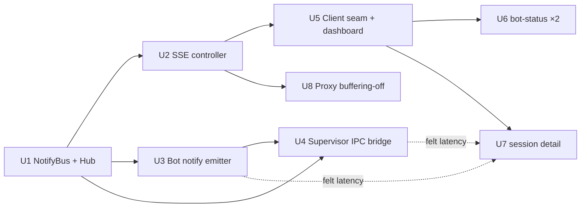

# feat: tdr-code SSE push — replace UI polling with notify-driven Server-Sent Events

## Overview

The `@lilnas/tdr-code` web console keeps four live surfaces fresh by React Query polling the NestJS REST API on a fixed `refetchInterval: 5_000`. This plan replaces that polling with **server→client push over SSE**, driven by the ACP bot **notifying** the main server (over an `spawn` IPC channel) whenever it writes live data to the shared SQLite file.

The chosen delivery model is **signal-driven invalidation** (Decision 2A): the bot's notify advances a per-topic change watermark on the main server; when a watermark advances, the server pushes a tiny `{ topic }` signal over one multiplexed `@Sse()` stream; the browser receives it and invalidates the matching React Query key, which refetches the *existing* REST endpoint and its already-consistent transactional snapshot. React Query stays the client cache/store — only its **feed** changes (SSE signal instead of a 5s timer). A slow (~30s) server-side fallback tick remains as the correctness backstop for dropped notifies, bot-down windows, and the bot-status staleness edge.

The felt win: watching a session tracks the agent within a fraction of a second instead of stepping every 5 seconds; bot-status transitions (including restart convergence) appear live; and no pushed data is ever lost or duplicated because a snapshot refetch is inherently complete and idempotent.

> **Relationship to the origin document (read this before implementing).** The origin brainstorm describes an *earlier* cursor + delta-push model — R6 "monotonic read cursor … reads rows strictly after the cursor, pushes them", F1 "pushes a delta", AE4 "last-seen cursor". Decision 2A **supersedes that wording**: the server pushes a *signal* (not a row delta), the client refetches a consistent *snapshot* (not a cursor-tailed delta), and reconnect *re-invalidates* (no `Last-Event-ID` cursor). Where this plan and the origin's mechanism wording disagree, **this plan is authoritative** — `ce-work` must implement the snapshot-refetch model, not the origin's delta phrasing. The origin's *intent* (near-real-time, no loss/dup, cursor-as-correctness-truth) is fully preserved; only the mechanism changed.

---

## Problem Frame

Every live surface is a React Query poll on a 5-second strobe (verified — see origin):

- `src/app/page.tsx` — dashboard `/live` (`queryKeys.live`, `refetchInterval: 5_000`)
- `src/app/components/bot-status-widget.tsx` and `src/app/config/page.tsx` — `/bot/status` (`queryKeys.botStatus`, ×2)
- `src/app/sessions/[id]/page.tsx` — session detail `/sessions/:id` (`queryKeys.session(id)`)

Operator mutations already feel instant (restart/teardown/config invalidate their own queries on success). The latency the operator actually feels is **ambient convergence** — state that keeps changing *after* an action: the bot booting `starting → online`, and above all the **session page**, where the agent streams turns, message chunks, tool calls, and diffs into SQLite continuously while the operator watches through a 5-second strobe.

The console is **observe-only** — it never sends prompts to the agent — so the live data is strictly one-directional (server→client), which is why SSE (not WebSockets, not tRPC) is the fit. See origin for the full transport rationale; both premises ("reuse tRPC", "reuse WS") were rejected because no app in the monorepo uses tRPC and bidirectionality is never needed.

---

## Requirements Trace

- R1. One multiplexed SSE endpoint (`@Sse('stream')`) holds an open connection and pushes JSON messages tagged by topic (`live`, `bot-status`, `session:<id>`) so the client can route each. → **U2**
- R2. Messages are pushed only when the underlying data has actually advanced; a low-frequency keepalive comment is allowed to hold the connection open. **Carve-out for derived topics:** for `bot-status` and `live`, "advanced" means the *derived DTO* changed — which can happen with **zero DB writes** (heartbeat-staleness `online→offline` is time-driven), so the fallback must be permitted to emit on a recomputed-derived-state change, not only on a row change. → **U1, U2**
- R3. The endpoint is covered by the existing cookie-based global `AuthGuard`; no new auth path (`EventSource` sends same-origin cookies automatically). → **U2**
- R4. When the bot writes live data in its ACP fan-out / session manager / lifecycle, it notifies the main server that data changed. The notify is a wake-up signal, not the payload. **The supervisor also writes `bot_generation` in the *main* process (`insertGeneration`/`markStopping`/`finalize`) — those cannot ride a bot IPC notify and are published to the bus in-process.** → **U3, U4**
- R5. The notify covers every streamed table — `turn_content`, `turns`, `live_status`, `bot_generation` — not just the coarse `events` table, so the session page streams smoothly. → **U3 (bot emit sites), U4 (supervisor in-process bot-status), U1 (topics)**
- R6. The server tracks a per-topic change signal that **gates emission**; delivery correctness is provided by consistent-snapshot refetch (a snapshot is inherently complete and idempotent → "no row delivered twice, none skipped"). **The gate's change-detector must be at least as sensitive as the set of observable changes**, split by topic shape: append streams may use `max(id)`; **update-bearing and derived streams use `PRAGMA data_version` (whole-DB commit counter) + a recomputed-derived-state diff — never `max(id)` alone**, because in-place UPDATEs (`updateToolCallStatus`, `closeTurn`, `closeSession`, all `live_status`/`bot_generation` mutations) do not advance `max(id)`. → **U1 + snapshot refetch in U5/U6/U7**
- R7. Notifies are debounced/coalesced so a burst of writes produces a bounded number of pushes: bot-side per-topic coalescing + a server-side gate **using a fixed-window throttle (leading+trailing) or debounce-with-`maxWait` — never a bare `debounceTime`, which a continuous token stream resets indefinitely, starving the session page until the agent pauses**; plus the client throttles signal→refetch (see R9), because React Query v5 `invalidateQueries` cancels-and-restarts in-flight fetches rather than deduping them. Every stage must emit at least once per window during sustained input. → **U3, U1, U5/U7**
- R8. A dropped or missed notify cannot lose data: the fallback tick re-detects the change and the client refetch delivers the full current snapshot. **This holds only because the fallback keys on `PRAGMA data_version` (+ derived recompute), not `max(id)`** — otherwise an update-only change across a dropped notify (e.g. a tool-call status flip with no following insert) would never re-emit and the transcript would show it stuck forever. Fire-and-forget without this reconciliation is not acceptable. → **U1 (fallback), U3/U4 (notify) + snapshot refetch**
- R9. React Query stays the client cache/store, fed by the SSE stream via `invalidateQueries`; `refetchInterval` is removed from migrated queries; pages migrate one at a time behind one seam. → **U5, U6, U7**
- R10. A slow (~30s) fallback tick (the same watermark read on a long interval) runs as the backstop for bot-down/silent windows and reconnect gaps — the safety net, not the primary path. → **U1, U4**
- R11. All four current poll sites move to push. → **U5 (live), U6 (bot-status ×2), U7 (session detail)**
- R12. When the bot is down, every migrated surface degrades to last-known state plus the existing offline indicator (parity with today), and resumes live on respawn without a full page reload. → **U1 (fallback catch-up), U5/U7, U4 (respawn notify)**
- R13. Response buffering is disabled for the SSE route across the whole path (Next `/api/*` rewrite → nginx → Traefik), so events are delivered incrementally. → **U8**
- R14. The notify channel between the two processes stays loopback-only with no externally reachable surface. **IPC via `spawn` stdio adds *zero* network surface — the strongest satisfaction of R14.** → **U3, U4**

**Origin actors:** A1 Operator (browser holds the SSE connection), A2 Main server (SSE endpoint, per-topic watermarks, pushes signals; reads SQLite, never writes live data), A3 ACP bot (writes live data, notifies A2, the part that can wedge/crash), A4 SQLite/WAL (system of record; the only *durable* coupling).
**Origin flows:** F1 Watch the agent work (core win), F2 Bot restart converges live, F3 Bot down → degrade then catch up, F4 Reconnect loses nothing.
**Origin acceptance examples:** AE1 (covers R5, R9 — session page reflects each write ~1s, no 5s step), AE2 (covers R6, R8 — dropped notify, 3 rows delivered exactly once), AE3 (covers R3, R12 — bot down: loads, offline, no error; respawn resumes without reload), AE4 (covers R6 — reconnect continues with no gap/dup).
**Plan-added acceptance example (from confidence check):** AE5 (covers R6, R8) — given a notify is dropped and the *only* change was an in-place UPDATE (a tool-call status flip via `updateToolCallStatus`, or a `closeTurn`), with no following INSERT, the fallback still delivers the change (because it keys on `PRAGMA data_version`, not `max(id)`). AE2's three-INSERT case structurally cannot catch this — AE5 is the update-only counterpart. → **U1 test scenarios**

---

## Scope Boundaries

- **No WebSockets, no bidirectional channel.** Live data is one-directional; control actions stay plain POSTs. The console never sends prompts to the agent.
- **No tRPC adoption.**
- **React Query is not removed** — only its feed changes.
- **Existing mutation invalidation is not reworked** — operator mutations already update instantly; SSE targets ambient convergence and is purely additive.
- **`relative-time.tsx`'s 30s label timer is untouched** — it re-formats "5m ago" client-side and makes no API call.
- **No change to config-apply semantics, per-user git identity, transcript retention, or the auth model.**
- **The `events` page (`src/app/events/page.tsx`) is out of scope** — it does not poll today. Its `id`-cursor is the cleanest of the set, so it is a trivial future addition, but it is not one of the four migrated surfaces.
- **Delta-push is not adopted for v1** — Decision 2A uses snapshot-refetch. See Deferred to Follow-Up Work.

### Deferred to Follow-Up Work

- **`?since=<blockId>` delta for `/sessions/:id`**: turn the session-transcript refetch into a true append-only delta (server returns only blocks after the cursor; client merges via `setQueryData`) behind the *same* SSE transport and client seam — no transport change. **Trip-wire (instrument to observe):** pull it forward when typical active sessions exceed **~150–200 `turn_content` blocks while streaming** or **~200–300 KB combined diff text per response**. **Caveat:** a naive `id > cursor` append delta *misses* the `json_set` tool-status flips (the reason 2A was chosen), so it needs a flip-handling companion (re-send tool_call rows touched since a marker) — non-trivial, which is why it is deferred rather than shipped in v1. The v1 diff-truncation (U7) captures most of the byte-cost win without this machinery.
- **Env-tunable bot-side coalesce window**: v1 uses a code constant; promote to an `EnvKey` (allowlisted through `buildBotEnv`) only if tuning is needed in the field.
- **`events` topic + live events page**: add `events` as a fifth topic if/when the events page gains live updates.

---

## Context & Research

### Relevant Code and Patterns

**Two-process topology** (verified):
- MAIN server — `src/main.ts` → `src/bootstrap.ts` → `AppModule` (`src/app.module.ts`). `NestFactory.create`, binds `127.0.0.1:${BACKEND_PORT}` (8082), owns DB (`migrate: true`), supervisor, all read/lifecycle controllers, auth. `bootstrap.ts` calls `SupervisorService.start()` **after** `app.listen()` wins the port (the port bind is the single-instance guard).
- BOT — `src/bot-main.ts` → `src/bot-bootstrap.ts` → `BotModule`. `NestFactory.createApplicationContext` (**headless, no HTTP listener**), `migrate: false`. This is why the notify must ride IPC/stdio, not HTTP — the bot has no HTTP surface of its own.

**Read surfaces to reuse (snapshot refetch targets):**
- `GET /live` → `LiveController` → `LiveService.getLive()` → `LiveResponseDto` (`src/console/live.controller.ts`, `live.service.ts`, `live.dto.ts`). Wraps reads in `db.transaction(..., { behavior: 'deferred' })`.
- `GET /bot/status` → `BotStatusController` → `BotStatusService.getStatus()` → `BotStatusDto` (`src/bot/bot-status.controller.ts`). Status derives from `latestGeneration()` + heartbeat staleness (`src/bot/staleness.ts`).
- `GET /sessions/:id` → `SessionsController.getOne()` → `SessionsService.getSessionTranscript(id)` → `SessionDetailResponseDto` (`src/console/sessions.controller.ts`). Also transaction-wrapped.

**Cursor / watermark reality per streamed table** (verified in `src/db/schema.ts` + migrations — load-bearing):

Primary trigger for all topics is the **notify** (fires on *any* write, insert or update). The columns below are the **fallback change-detector** (what the ~30s backstop uses when a notify is missed) — where `max(id)` alone is insufficient, `PRAGMA data_version` (whole-DB commit counter) or a derived-state recompute is the correct detector:

| Table | Insert cursor | In-place UPDATE mutations (invisible to an id cursor) | Fallback change-detector (R2/R6/R8) |
|---|---|---|---|
| `turn_content` | `id` (rowid; no `AUTOINCREMENT`, no `seq`) | `updateToolCallStatus` (json_set) | **`PRAGMA data_version`** (sees the UPDATE); `max(id)` only as a precision aid |
| `turns` | `id` (rowid) | `closeTurn` | **`data_version`**; snapshot delivers closes |
| `sessions` | `id` (rowid) | `closeSession`, `clearAcpSessionId` | **`data_version`**; snapshot delivers closes |
| `live_status` | **none** (PK is `channel_id` text) | `upsert`, `heartbeat`, `remove` | **`data_version`** or a **derived-`LiveResponseDto` digest** (also covers `working/stale/idle` time-derived state) |
| `bot_generation` | `id` (rarely advances) | `markRunning`/`heartbeat`/`markStopping`/`finalize` + **time-derived staleness** | **recomputed derived-status string** each tick (fires even with zero DB writes — the `online→offline` staleness flip) |

The presence of in-place UPDATEs, the id-less `live_status`, and the time-derived `bot-status`/`live` transitions are exactly why (a) pure delta-push was rejected in favor of snapshot refetch, and (b) the fallback detector is `PRAGMA data_version` + derived recompute, **not** `max(id)` — a `max(id)`-only fallback would silently lose update-only changes across a dropped notify (the R8 hole surfaced in the confidence check).

**Bot write chokepoints (where notify is emitted):**
- `CompositeAcpHandler` (`src/discord/composite-acp-handler.ts`) — the single ACP fan-out point; every method calls `this.writer.X()` in its own try/catch. Emit `session:<id>` after writer success (transcript changed).
- `SessionManagerService` (`src/agent/session-manager.service.ts`) — sole writer of `live_status` (`syncLiveStatus`, `removeLiveStatus`) and `sessions` (`insertSession`, `closeSession`). Emit `live` / `sessions` / `session:<id>` at those chokepoints (already wrapped in try/catch today).
- `BotLifecycleService` (`src/discord/bot-lifecycle.service.ts`) — sole bot-side writer of `bot_generation` (`markRunning`, `heartbeat`, `finalize`). Emit `bot-status`.

**Supervisor spawn (IPC insertion point):** `defaultSpawn()` in `src/supervisor/supervisor.service.ts` does `spawn('node', [botEntry], { stdio: 'inherit', ... })`. Change stdio to `['inherit','inherit','inherit','ipc']`; bind `child.on('message', ...)` in the `'spawn'` FSM effect next to the existing `child.once('exit')`/`child.once('error')`. `buildBotEnv(generationId)` is a strict allowlist — v1 needs **no** new bot env (`process.send` is available purely from the stdio channel). Working tree note: `supervisor.service.ts` currently has an uncommitted refactor (`onModuleInit` → idempotent `start()`); this plan builds on that state.

**Auth:** single `APP_GUARD` = `AuthGuard` (`src/app.module.ts`), deny-by-default, Better Auth cookie session; only `@Public()` bypasses. A new `@Sse()` route is covered automatically. `EventSource` carries the same-origin cookie; it cannot send custom headers, which is fine (cookie auth). The `request()` wrapper in `src/app/lib/api.ts` already latches a 401 → `/login?error=session_expired` redirect — the next React Query refetch after a dead session routes there.

**React Query:** `createQueryClient()` in `src/app/providers.tsx` (`refetchOnWindowFocus: false`, `staleTime: 10_000`); query keys + typed `api` fns + the `/api` fetch wrapper in `src/app/lib/api.ts`. Migration pattern: keep each `useQuery` (cache shape + `queryKeys` + existing mutation invalidations all keep working), drop `refetchInterval`, and drive `invalidateQueries` from one shared `EventSource` hook.

**Prod proxy path (R13):** browser → Traefik (TLS) → nginx:alpine (`proxy_pass http://host.docker.internal:8080`, `apps/tdr-code/deploy/nginx.conf`) → Next `/api/:path*` rewrite (`apps/tdr-code/next.config.js`) → NestJS `127.0.0.1:8082`. The backend is loopback-bound and unreachable from the nginx container, so SSE **must** traverse the Next rewrite — no bypass exists.

**Testing:** Jest, three `projects` in `apps/tdr-code/jest.config.js` — `backend` (node, ts-jest, `src/**`), `frontend` (jsdom, `src/app/__tests__/**/*.tsx`), `scripts`. `createTestDb()` (`src/db/test-db.ts`) = in-memory better-sqlite3 with real migrations. Mirror `src/console/__tests__/live.service.spec.ts` (service + repo seeding + `fakeLogger()`), `src/bot/__tests__/health.controller.spec.ts` (DI via `Test.createTestingModule`), `src/supervisor/__tests__/supervisor.service.spec.ts` (`FakeChild extends EventEmitter` + `FakeClock`).

### Institutional Learnings

- **`docs/solutions/conventions/tdr-code-structured-logging-convention-2026-07-03.md`** — every `info`+ log needs a registered kebab-case `event` in `src/logging/log-events.ts` or `tsc` fails. The registry is deliberately **plane-neutral** (no `@nestjs/*`/`react`/`pino` imports) because it is imported by all four planes the SSE path crosses. Route SSE client errors through `providers.tsx`'s existing `capMessage` (300-char) React Query error chokepoint — never log raw stream-error text.
- **`docs/solutions/architecture-patterns/pure-fsm-core-for-stateful-domain-logic-2026-05-27.md`** — put the SSE topic/message contract in one framework-free module imported by both server and client (mirrors `log-events.ts` plane-neutrality), so the two sides can't drift.
- **`docs/plans/2026-06-29-001-feat-tdr-code-two-process-substrate-plan.md`** — the two-process plan rejected `fork` because "its IPC channel would become a second coupling and dies exactly when the child wedges." Decision 1A adopts that same IPC channel *consciously*: the reliability concern is neutralized by the fallback + snapshot refetch (a dead notify is expected and handled), and the *durable* coupling remains SQLite alone (the notify is ephemeral). See Key Technical Decisions.
- **`docs/plans/2026-06-30-002-feat-tdr-code-phase-b-writers-plan.md`** (Decision 5) — hot-path writes are single-statement guarded mutations (no `IMMEDIATE`), block order is the monotonic `id` (no `seq` column). **Do not wrap the watermark/fallback reads in `BEGIN IMMEDIATE`** — WAL reads are non-blocking snapshots; an `IMMEDIATE` on the hot path would stall the event loop under two processes.
- **`docs/research/2026-06-28-tdr-code-web-ui-feature-landscape.md`** — generalized rule: "every long-lived handle (child process, timers, polling intervals) created once per key, never overwritten without release." Applies to every `EventSource`, the per-connection keepalive interval, and the hub's fallback interval — created once per connection/hub, torn down on disconnect, or they leak and double-push.
- **`docs/runbooks/tdr-code-phase-d-forward-auth-cutover.md`** — the app owns cookie auth; `apps/tdr-code/deploy/nginx.conf` and `next.config.js` are the proxy surfaces where R13 lands.
- **Auto-memory `tdr-code-node-version-mismatch`** — DB-backed specs fail under the shell's default Node 22 with `NODE_MODULE_VERSION 137 … requires 127`. Run cursor/tailing specs with the Node 24 PATH override: `env PATH="$HOME/.local/share/nvm/v24.15.0/bin:$PATH" pnpm jest …`.

### External References

Verified against installed source + official docs (see Sources):
- **Next.js 15.5.4 rewrites stream SSE** so long as the response carries `Cache-Control: no-transform` (the gzip `compression` middleware is the only buffering vector and it skips `no-transform`). **NestJS `@Sse()` emits `no-transform` + `X-Accel-Buffering: no` by default** (proven in installed `sse-stream.js`) → the rewrite passes SSE through incrementally with no code change. Fallback if ever needed: an App Router Route Handler proxy (`app/api/stream/route.ts`, `dynamic = 'force-dynamic'`, return `new Response(upstream.body, …)`).
- **nginx** is the one hop buffering by default (`proxy_buffering on`); it honors an upstream `X-Accel-Buffering: no` per-response (since 1.1.6) — but chained-proxy header-stripping is a known trap, so set `proxy_buffering off` on the SSE location **and** re-assert the header via `next.config.js` `headers()` (defense in depth).
- **NestJS `@Sse()`** maps `MessageEvent` fields to `event:`/`id:`/`retry:`/`data:`. **Always set `id` yourself** (otherwise NestJS auto-assigns a broken synthetic counter). Read the resume header via `@Headers('last-event-id')`. Keepalive = merge a `timer()` Observable (benign event) or write `:\n\n` to the raw `@Res({ passthrough: true })` response on an interval cleared on `req.on('close')`.
- **`EventSource`** auto-reconnects, resends `Last-Event-ID`, respects `retry:`, fires `onerror`; an HTTP `204` tells it to stop reconnecting. Cannot send custom headers/body (cookies only).
- **Traefik** does not buffer streams by default — just ensure no `buffering`/`compress` middleware on the router (the tdr-code labels add neither).

---

## Key Technical Decisions

- **SSE over WebSockets/tRPC** (origin) — data is server→client only; native `EventSource` reconnect; works with the cookie `AuthGuard`; ~zero new deps (`rxjs` 7.8.1 + NestJS `@Sse()` already present).
- **Decision 1A — notify over `spawn` IPC stdio.** `stdio: ['inherit','inherit','inherit','ipc']`; bot `process.send({ type:'notify', topics })`, parent `child.on('message')` in the supervisor's spawn effect. Chosen over loopback HTTP (adds a loopback-reachable, auth-needing surface; harder to test) and Unix socket (on-disk lifecycle). IPC adds **zero network surface** (best R14), is trivial to test (`FakeChild` already extends `EventEmitter`), and the "IPC dies when the child wedges" concern from the two-process plan is *neutralized* by the fallback + snapshot refetch — a dead notify is an expected, handled case. SQLite remains the only **durable** coupling; the IPC message is an ephemeral wake-up. **Addendum (confidence check): `bot_generation` is also written by `SupervisorService` in the *main* process** (`insertGeneration` on spawn — the `starting` state, `markStopping`, `finalize`/reap). Those transitions produce **no** bot IPC notify, so the supervisor publishes `bot-status` to the bus **in-process** at its own write-sites (no IPC needed — same process). This is what makes F2 restart-convergence (`starting → online`) appear live, since `starting` is written before the bot boots.
- **Decision 2A — signal-driven invalidation, not delta-push.** The server pushes `{ topic }` signals; the client invalidates the React Query key and refetches the existing endpoint's consistent snapshot. Reinterprets R6: the per-topic change-detector gates *emission* (R2), and snapshot completeness+idempotency provides delivery correctness (R6/R8). Chosen because the schema breaks pure delta-push (`live_status` has no monotonic id; tool-status flips / turn & session closes are in-place UPDATEs; bot-status is time-derived). Uniform across all tables, reuses the transaction-snapshot read services, no schema migration. The transcript's whole-snapshot re-read is the known cost, deferred to a `?since` delta optimization.
- **Fallback change-detection uses `PRAGMA data_version`, not `max(id)` (confidence check).** `data_version` is a whole-DB commit counter that increments on every commit by *another* connection (it does not move for the reader's own writes — perfect, since the main server never writes live data). It is the one cheap detector that sees in-place UPDATEs and is the correctness backbone for R8/AE5. `max(id)` is retained only as an optional *precision* aid for append streams, never as the sole detector for update-bearing or derived topics. For `bot-status`/`live`, the fallback additionally recomputes the derived DTO/status-string each tick and emits on change (the time-driven `online→offline` flip has no backing write at all).
- **Client refetch coalescing is explicit, not assumed (confidence check).** React Query v5 `invalidateQueries` defaults `cancelRefetch: true`, which *cancels and restarts* an in-flight fetch rather than deduping onto it (verified in `@tanstack/query-core@5.90.2`). So raw signal→invalidate 1:1 produces abort/restart churn under a token-burst storm, not the bounded stream the origin assumed. Mitigation is **v1, not deferred**: pass `cancelRefetch: false` on the session invalidation *and* apply a client-side trailing throttle (~250–400ms during an active turn). See U5/U7.
- **Snapshot-replace delivery discharges AE4/R6-dedupe.** Because delivery replaces the cached snapshot (never appends), a duplicate signal (reconnect redelivery, or notify+fallback both firing) causes at most a redundant refetch — never a duplicated transcript row. This is the property that makes reconnect trivial (re-invalidate, no `Last-Event-ID` cursor) and per-child late-message attribution non-critical. **Do not "optimize" this into an append-delta model** without reintroducing the dedupe burden it removes.
- **Process-scoping invariant (confidence check).** `SseModule` (bus + hub + `@Sse` controller + fallback scheduler) is imported **only** by `AppModule` — it must never be reachable from `BotModule`, or the hub/scheduler would silently instantiate in the bot process (no HTTP server, no subscribers). `NotifyEmitterService` is **bot-only** (a `DiscordModule` provider, and `DiscordModule` is loaded only by `BotModule`) and is a **no-op when `process.send` is undefined** (dev-standalone `SUPERVISE_BOT=false`, tests). The two never share a process; the only shared symbol is the wire-message type, defined in a process-neutral types file.
- **One multiplexed `/api/stream`** (origin) — a single `@Sse('stream')`; the client selects topics per page via query param (`?topics=live`, `?topics=bot-status`, `?topics=session:<id>`). One `EventSource` per page, scoped to what that page renders, so a client watching session A never receives session B's signals.
- **`Last-Event-ID` is hygiene, not load-bearing.** We set `id:`/`retry:` on messages, but under 2A reconnect correctness rests on re-invalidation (the client refetches the current snapshot on `onopen`), so no per-topic cursor encoding into a single `Last-Event-ID` is needed. This is what makes the multiplexed stream + reconnect simple.
- **Framework-neutral topic/message contract** (`src/sse/sse.types.ts`) imported by both the NestJS producer and the browser client, mirroring `log-events.ts` plane-neutrality.
- **Watermark reads stay plain WAL reads** (no `BEGIN IMMEDIATE`) — per the Phase B writers ruling, to avoid stalling the event loop under two processes.

---

## Open Questions

### Resolved During Planning

- Notify transport → **IPC stdio (1A)**.
- Delivery model → **signal-driven invalidation (2A)**.
- Endpoint shape → **one multiplexed `/api/stream`**, topics via query param.
- Cursor/detector granularity → **notify is the primary per-topic trigger; the fallback change-detector is `PRAGMA data_version` (+ derived-state recompute for `bot-status`/`live`), not `max(id)`** — so update-only changes and time-derived transitions are never lost.
- R13 buffering → **NestJS default headers already stream through the Next rewrite; add nginx `proxy_buffering off` on the SSE location + `X-Accel-Buffering: no` via `next.config.js` (defense in depth); Traefik unchanged.**
- Reconnect resume → **re-invalidate on `onopen`** (no `Last-Event-ID` cursor encoding required under 2A).
- Coalesce/gate → **bot-side per-topic fixed-window coalesce (~50ms) + server-side per-topic fixed-window throttle (~50ms, leading+trailing) — never a bare `debounceTime` (which starves sustained streams) + client trailing throttle (~250–400ms, U7)**.
- Fallback → **two cadences**: derived-status recompute ≤ `staleThresholdMs()` (~10s) + `data_version` backstop ~30s (5s interim in Phase A); started lazily on first subscriber, stopped on last.

### Deferred to Implementation

- Exact RxJS operator composition for per-topic throttle + fan-out (e.g. `groupBy` + `throttleTime(50, asyncScheduler, {leading:true, trailing:true})` — or a debounce with `maxWait`; **NOT bare `debounceTime`**, per A1 above — upstream of per-connection `filter`) — settle against real `@Sse()` Observable ergonomics.
- Whether the keepalive is a merged `timer()` event vs a raw `:\n\n` write — pick during U2 based on how the merged-Observable form renders on the wire.
- Whether the `live` fallback detector uses a `data_version` gate vs a derived-`LiveResponseDto` digest (both satisfy R8; the digest is more precise on R2) — decide when wiring U1.
- The exact throttle window for the session key (~250–400ms) and whether it should relax between turns vs during active streaming — tune against real streaming feel in U7.
- Final `EnvKey` names/defaults (`SSE_FALLBACK_INTERVAL_MS`, `SSE_KEEPALIVE_MS`).

---

## Output Structure

```
apps/tdr-code/src/
  sse/                              # NEW — main-process SSE subsystem
    sse.module.ts                   # @Global for NotifyBusService; declares SseController
    sse.controller.ts              # @Sse('stream') endpoint
    sse-hub.service.ts             # subscriber registry, per-topic debounce, fallback tick, watermarks
    notify-bus.service.ts          # framework-light RxJS Subject bridge (publish/stream$)
    sse.types.ts                   # plane-neutral SSE topic + message contract (imported server AND browser)
    notify.types.ts                # process-neutral IPC wire type {type:'notify', topics} (bot AND main; types only, no providers)
    __tests__/
      sse-hub.service.spec.ts
      notify-bus.service.spec.ts
      sse.controller.spec.ts
  discord/
    notify-emitter.service.ts      # NEW — bot-process guarded process.send + per-topic coalesce (DiscordModule provider)
    __tests__/notify-emitter.service.spec.ts
  app/lib/
    use-live-stream.ts             # NEW — client EventSource → invalidateQueries hook
```

---

## High-Level Technical Design

> *This illustrates the intended approach and is directional guidance for review, not implementation specification. The implementing agent should treat it as context, not code to reproduce.*

**F1 — the core flow (agent streams a chunk → session page updates):**

```mermaid
sequenceDiagram
    participant Agent as ACP agent
    participant W as CompositeAcpHandler/Writer (bot)
    participant NE as NotifyEmitter (bot)
    participant Sup as SupervisorService (main)
    participant Bus as NotifyBusService (main)
    participant Hub as SseHubService (main)
    participant ES as EventSource (browser)
    participant RQ as React Query (browser)
    participant API as GET /sessions/:id (main)

    Agent->>W: agent_text chunk
    W->>W: appendBlock (turn_content INSERT)
    W->>NE: notify('session:123')
    NE->>NE: coalesce ~50ms (bounds token-burst volume)
    NE-->>Sup: process.send({type:'notify', topics:['session:123']})  (IPC)
    Sup->>Bus: publish('session:123')
    Bus->>Hub: stream$ next
    Hub->>Hub: watermark advanced? debounce ~50ms
    Hub-->>ES: MessageEvent {topic:'session:123', id:<n>}
    ES->>RQ: invalidateQueries(['session','123'], {cancelRefetch:false})
    RQ->>API: refetch (consistent snapshot; client-throttled ~250-400ms)
    API-->>RQ: SessionDetailResponseDto
    RQ->>RQ: re-render (only changed nodes)
    Note over Hub: Fallback tick (~30s): if PRAGMA data_version advanced<br/>(or derived bot-status/live state changed), re-emit —<br/>catches update-only changes a missed notify dropped (R8/R10)
```

**Component wiring (DI direction, cycle-free):**
- `SseModule` is `@Global` and exports `NotifyBusService` → `SupervisorService` (in `SupervisorModule`, imported by `ConsoleModule`) injects `NotifyBusService` with no module cycle. `SseHubService` subscribes to `NotifyBusService.stream$` at construction. `SseController` returns per-connection Observables from `SseHubService`.
- Bot side: `NotifyEmitterService` is a `DiscordModule` provider; `CompositeAcpHandler`, `BotLifecycleService`, and `SessionManagerService` are all already `DiscordModule` providers, so each injects it directly (single module, no cross-import, cycle-free). Note: `src/agent/agent.module.ts` is not a Nest module — it only exports the `ACP_EVENT_HANDLERS` token.

**Topic ↔ table ↔ React Query key map:**

Primary trigger is always the notify; the "fallback detector" column is what the backstop tick uses when a notify is missed (never a bare `max(id)` for update-bearing/derived topics — see Decisions):

| Topic | Notify producer(s) | Fallback detector (gates emission when notify missed) | Client key invalidated | Surfaces |
|---|---|---|---|---|
| `live` | bot `SessionManagerService` (live_status/session lifecycle) | `PRAGMA data_version` or derived-`LiveResponseDto` digest (covers time-derived `working/stale/idle`) | `queryKeys.live` = `['live']` | dashboard |
| `bot-status` | bot `BotLifecycleService` (markRunning/heartbeat) **+ main-process `SupervisorService`** (insertGeneration/markStopping/finalize) | recomputed derived-status string each recompute tick (≤ `staleThresholdMs()`) — fires even with zero writes | `queryKeys.botStatus` = `['bot-status']` | widget + config |
| `session:<id>` | bot `CompositeAcpHandler` (turns/turn_content, incl. updates) + `SessionManagerService` (session close) | `PRAGMA data_version` (sees in-place UPDATEs); `max(turn_content.id)` only as a precision aid | `queryKeys.session(id)` = `['session', id]` | session detail |

---

## Implementation Units

Grouped into four phases (see Phased Delivery). U-IDs are stable and never renumbered.

### Phase A — Server push backbone (no bot changes; fallback-only)

- U1. **NotifyBus + SSE hub service**

**Goal:** The in-process signal backbone: a publish/subscribe bus, a per-connection subscriber registry, per-topic debounce/coalesce, a lazily-started fallback tick that gates emission on per-topic watermark advancement, and the bot-status staleness recompute.

**Requirements:** R2, R6, R7, R8, R10, R12

**Dependencies:** None

**Files:**
- Create: `apps/tdr-code/src/sse/notify-bus.service.ts`, `apps/tdr-code/src/sse/sse-hub.service.ts`, `apps/tdr-code/src/sse/sse.types.ts`, `apps/tdr-code/src/sse/sse.module.ts`
- Modify: `apps/tdr-code/src/env.ts` (add `SSE_FALLBACK_INTERVAL_MS` default `30000` — the `data_version` backstop; `SSE_STALENESS_RECOMPUTE_MS` default `10000` — the derived-status recompute, kept ≤ `staleThresholdMs()`; `SSE_KEEPALIVE_MS` default `25000`), `apps/tdr-code/src/logging/log-events.ts` (register `notify-received`, `sse-signal-emitted`, `sse-fallback-tick`, `sse-fallback-interval-started`, `sse-fallback-interval-stopped`)
- Test: `apps/tdr-code/src/sse/__tests__/sse-hub.service.spec.ts`, `apps/tdr-code/src/sse/__tests__/notify-bus.service.spec.ts`

**Approach:**
- `NotifyBusService`: framework-light wrapper over an RxJS `Subject<NotifySignal>` with `publish(signal)` and `stream$`. Provided by `@Global` `SseModule` so both `SupervisorService` (publisher) and `SseHubService` (subscriber) inject it without a module cycle.
- `SseHubService`: injects `DB` (global) + `PinoLogger` + `NotifyBusService`. Maintains `Map<connectionId, Set<Topic>>`. `subscribe(topics)` returns an Observable filtered to those topics, per-topic **fixed-window throttled (~50ms, leading+trailing) — NOT a bare `debounceTime`** (doc-review: a sustained sub-50ms coalesced stream resets a trailing debounce forever, freezing the session page until the agent pauses; a throttle or debounce-with-`maxWait` emits at a steady cadence during continuous input). Owns the fallback timers (per the "one handle per key" learning): started when the registry goes 0→1, cleared when it goes 1→0. (Hand-rolled `setInterval` rather than `@nestjs/schedule`'s `SchedulerRegistry` — doc-review S1: the scheduler would need `ScheduleModule.forRoot()` in `AppModule` for timers used by one service; a private interval keyed to subscriber count is simpler and self-contained.)
- **Per-topic change-detectors (the correctness core — confidence check):**
  - **Fallback wake = `PRAGMA data_version`** (whole-DB commit counter). Each tick, if `data_version` advanced since last tick, *something* committed → evaluate the derived detectors below and re-emit affected topics. This is what closes the R8/AE5 hole (it sees in-place UPDATEs that `max(id)` cannot).
  - `session:<id>`: emit when `data_version` advanced **and** that session has an open subscriber. Scope the check to *currently-subscribed* session ids (from the registry) — do not scan all sessions. `max(turn_content.id)` for the session may be used as a *precision* aid, but the UPDATE-sensitive path is `data_version`.
  - `bot-status`: recompute the derived status string each tick (`latestGeneration` + `src/bot/staleness.ts`, **including the time-based staleness comparison**) and emit on string change — **even with zero DB writes** (the `online→offline` flip is time-driven; R2 carve-out).
  - `live`: recompute a digest of the derived `LiveResponseDto` (or gate on `data_version` + a stale-transition-due timer) and emit on change. `max(id)` is not usable here (`live_status` PK is `channel_id` text).
- **Fan-out once per tick:** read detectors/watermarks a single time per tick in the hub and fan the resulting signals to all matching connections — never re-run detectors per connection.
- **Read discipline:** all detector reads are plain autocommit WAL reads or a fresh per-call `deferred` transaction — **never a read handle held open across the notify boundary** (protects the commit-visibility invariant). No `BEGIN IMMEDIATE`.
- **Two fallback cadences (doc-review: a single 30s tick violated the plan's own staleness-budget constraint).** `staleThresholdMs()` ≈ 15s with current defaults (heartbeat 5s + busy_timeout 5s + margin 5s). A single 30s tick would let a dead bot display "online" for up to ~45s (15s threshold + up to 30s until the recompute runs). So split:
  - **Derived-status recompute (`bot-status`/`live` time-derived flips): cadence ≤ `staleThresholdMs()`** (e.g. ~10s) — this is what the `online→offline` indicator latency depends on (R12/F3).
  - **`data_version` backstop (dropped-notify catch-up for row changes): ~30s** in Phase B+ (relaxed once the notify is primary). In **Phase A** (notify not yet built) this backstop is the *primary* freshness path, so it runs at parity cadence (~5s) to not regress today's poll — see Phased Delivery / P1.

**Patterns to follow:** `src/console/live.service.ts` (service shape, DB injection, `db.transaction({behavior:'deferred'})` reads), `src/bot/bot-status.service.ts` + `src/bot/staleness.ts` (derived-status computation), `src/db/database.module.ts` (`PRAGMA` access), the "one handle per key" release rule.

**Test scenarios:**
- Happy path: `notify('session:1')` → a subscriber to `session:1` receives exactly one signal; a subscriber to `session:2` receives none.
- Edge (coalesce, R7): three `notify('session:1')` within the debounce window → subscriber receives exactly one signal.
- Edge (registry lifecycle): first `subscribe` starts the fallback interval; last `unsubscribe` clears it; no interval/timer left running after teardown (fake timers).
- Covers AE2 (R6/R8): seed 3 new `turn_content` rows for a subscribed session **without** publishing a notify → advance the fallback timer → hub emits `session:1` once (`data_version` advanced); a second tick with no new commits emits nothing (R2).
- **Covers AE5 (R6/R8 — the update-only hole):** with a subscribed session, seed a tool-call INSERT, then apply `updateToolCallStatus` (an in-place UPDATE that does **not** advance `max(id)`) **without** a notify → the fallback tick still emits `session:1` (because `data_version` advanced). Assert that a `max(id)`-only detector would *not* have fired (regression guard for the bug this fixes).
- Covers F3/AE3: with the bot "down" (no notifies, no writes), the fallback tick emits `bot-status` when the derived string flips `online → offline` on heartbeat staleness (time-driven, zero commits — assert `data_version` unchanged yet emission occurs).
- Edge (fan-out): two connections subscribed to `session:1`; one tick → each receives exactly one signal; detectors read once (spy on the detector read count = 1, not 2).
- **Edge (no starvation under sustained stream — doc-review A1):** publish a `session:1` signal every 30ms for 2s (faster than the ~50ms window) → the throttled output emits at a bounded steady cadence throughout (assert emissions ≈ window count, NOT zero-until-stream-stops). This is the regression guard proving the gate is a throttle/`maxWait`, not a bare `debounceTime`.
- **Edge (staleness within budget — doc-review A2):** with the bot silent, advance the derived-status recompute timer (~10s) → `bot-status` flips `online→offline` within `staleThresholdMs()` (~15s), not within the 30s `data_version` backstop.
- Error path: a malformed/unknown topic in `publish` is ignored without throwing; nothing logged above `debug`.

**Verification:** `sse-hub.service.spec.ts` green under the Node 24 PATH override; no leaked timers after teardown; the AE5 regression scenario proves the `data_version` detector catches update-only changes a `max(id)` detector would miss. Add a process-scoping guard (doc-review C4): a test or a header comment in `sse.module.ts` asserting `SseModule` is not imported by `BotModule`.

---

- U2. **SSE controller + module wiring**

**Goal:** The multiplexed `@Sse('stream')` endpoint: parse the connection's topics, return a per-connection Observable merged with a keepalive, set `id:`/`retry:`, and confirm global-`AuthGuard` coverage with no new auth code.

**Requirements:** R1, R2, R3

**Dependencies:** U1

**Files:**
- Create: `apps/tdr-code/src/sse/sse.controller.ts`
- Modify: `apps/tdr-code/src/sse/sse.module.ts` (declare `SseController`), `apps/tdr-code/src/app.module.ts` (import `SseModule`), `apps/tdr-code/src/logging/log-events.ts` (register `sse-connected`, `sse-client-disconnected`)
- Test: `apps/tdr-code/src/sse/__tests__/sse.controller.spec.ts`

**Approach:**
- `@Controller()` with `@Sse('stream')` returning `Observable<MessageEvent>`. Read `?topics` (comma list) / `?session` and `@Headers('last-event-id')`. Build the connection's topic set, call `SseHubService.subscribe(topics)`, `map` signals to `MessageEvent` with `id` = a monotonic per-connection counter or the topic watermark (set explicitly — never rely on NestJS's auto-id), and `merge` a `timer(SSE_KEEPALIVE_MS)` keepalive event. Log `sse-connected` on subscribe and `sse-client-disconnected` on Observable teardown (client disconnect).
- No auth code: the global `APP_GUARD` (`AuthGuard`) already gates every non-`@Public` route. Resolves at `GET /api/stream` via the existing `/api/:path*` rewrite — no `next.config.js` change for routing.

**Patterns to follow:** `src/bot/bot-status.controller.ts` (controller shape), `src/bot/__tests__/health.controller.spec.ts` (both `new Controller(...)` and `Test.createTestingModule` DI specs).

**Test scenarios:**
- Happy path: a request with `?topics=live` yields an Observable that emits a `MessageEvent` (topic `live`, non-null `id`) when the hub signals `live`.
- Happy path (multiplex): `?topics=bot-status,session:5` receives `bot-status` and `session:5` signals but not `live`.
- Edge (keepalive, R2): with no data signals, the stream still emits a keepalive event on the `SSE_KEEPALIVE_MS` cadence (fake timers) and does not error.
- Edge (teardown): unsubscribing the returned Observable deregisters the connection from the hub (assert registry size returns to prior) and logs `sse-client-disconnected`.
- Auth (R3): `Test.createTestingModule` wiring confirms the route carries no `@Public()` decorator (so the global `AuthGuard` applies) — mirror the health-controller DI spec's introspection approach.

**Verification:** endpoint returns `text/event-stream`; `curl --no-buffer` (dev, direct to `:8082/stream`) shows incremental events; unauthenticated request is 401.

---

### Phase B — Bot→server notify (IPC) to collapse latency

- U3. **Bot-side notify emitter**

**Goal:** A guarded, coalescing emitter that turns bot writes into IPC notify messages, wired into the three write chokepoints.

**Requirements:** R4, R5, R7, R14

**Dependencies:** U1 (shares `sse.types.ts` topic contract)

**Files:**
- Create: `apps/tdr-code/src/discord/notify-emitter.service.ts`, `apps/tdr-code/src/sse/notify.types.ts` (process-neutral wire type — types only, no providers, so importing it in the bot never instantiates `SseModule`)
- Modify: `apps/tdr-code/src/discord/discord.module.ts` (add `NotifyEmitterService` to `providers`), `apps/tdr-code/src/discord/composite-acp-handler.ts` (emit `session:<id>` after writer success — covers INSERTs *and* the in-place UPDATEs via `onToolCallUpdate`→`updateToolCallStatus` and `onPromptComplete`→`closeTurn`), `apps/tdr-code/src/agent/session-manager.service.ts` (emit `live` / `sessions` / `session:<id>` at `syncLiveStatus`/`removeLiveStatus`/`insertSession`/`closeSession`), `apps/tdr-code/src/discord/bot-lifecycle.service.ts` (emit `bot-status` at `markRunning`/`heartbeat`), `apps/tdr-code/src/logging/log-events.ts` (register `notify-emitted`, `notify-emit-skipped-no-ipc`)
- Test: `apps/tdr-code/src/discord/__tests__/notify-emitter.service.spec.ts`

**Approach:**
- `NotifyEmitterService.notify(topics)`: coalesce per topic within a ~50ms window (code constant, a `Map<Topic, Timer>`), then `process.send?.({ type:'notify', topics })` **guarded** — if `process.send` is undefined (bot run standalone without IPC, or under test), skip silently (`notify-emit-skipped-no-ipc` at `debug`). This no-op-when-no-IPC behavior is the process-scoping guarantee (Key Decisions). Fire-and-forget; failures are non-fatal (the fallback tick backstops).
- **Three bot chokepoints, all `DiscordModule` providers** (doc-review correction — there is **no `AgentModule`**; `src/agent/agent.module.ts` only exports the `ACP_EVENT_HANDLERS` token, verified on disk): `CompositeAcpHandler` (ACP fan-out, knows `sessionId`, covers all transcript inserts + the two in-place UPDATEs), `BotLifecycleService` (`bot_generation` `markRunning`/`heartbeat`), and `SessionManagerService` (its file lives in `src/agent/` but it is registered as a `DiscordModule` provider — `live_status`/`sessions`). Because all three are already `DiscordModule` providers, `NotifyEmitterService` is added to that **one** `providers` array — no cross-module import, inherently cycle-free. Emit at the existing try/catch sites so a notify never destabilizes a write.
- **Not covered here (by design):** the supervisor's main-process `bot_generation` writes (`insertGeneration`/`markStopping`/`finalize`) produce no bot notify — they are published in-process in U4. The `bot-status` topic therefore has two producers (bot markRunning/heartbeat via IPC; supervisor lifecycle via in-process publish) plus the fallback's time-derived recompute.
- No `buildBotEnv` change (v1 window is a constant; `process.send` needs no env).

**Patterns to follow:** the fail-soft writer error handling in `src/discord/composite-acp-handler.ts` (`handleWriterError`); `SessionManagerService`'s existing `syncLiveStatusFailed` try/catch wrapping.

**Test scenarios:**
- Happy path: `notify(['session:1'])` with a stubbed `process.send` → after the coalesce window, `process.send` called once with `{type:'notify', topics:['session:1']}`.
- Edge (coalesce, R7): five `notify(['session:1'])` in the window → `process.send` called once; distinct topics in one window → one message carrying both topics (or one per topic — assert the chosen shape).
- Edge (no IPC, R14/standalone/tests): `process.send` undefined → `notify` does not throw and sends nothing (logs `notify-emit-skipped-no-ipc` at `debug`).
- Integration (insert path): a simulated `CompositeAcpHandler.onAgentMessageChunk` (writer success) triggers exactly one coalesced `session:<id>` emit; a writer throw still emits nothing extra beyond existing error handling.
- Integration (update path): a simulated `CompositeAcpHandler.onToolCallUpdate` (→ `updateToolCallStatus`, an in-place UPDATE) still triggers a `session:<id>` emit — the notify is the *primary* trigger for updates the fallback's `data_version` also backstops.

**Verification:** `notify-emitter.service.spec.ts` green; manual `dev:main` + `dev:bot` shows IPC messages arriving (see U4).

---

- U4. **Supervisor IPC bridge**

**Goal:** Open the IPC channel on spawn, receive bot notifies, validate them, and forward to `NotifyBusService`; relax the fallback interval to the 30s backstop now that push is primary.

**Requirements:** R4, R10, R14

**Dependencies:** U1 (`NotifyBusService`), U3 (message shape)

**Files:**
- Modify: `apps/tdr-code/src/supervisor/supervisor.service.ts` (`defaultSpawn()` stdio → `['inherit','inherit','inherit','ipc']`; inject `NotifyBusService`; bind `child.on('message', ...)` in the `'spawn'` effect + remove it on exit; publish `bot-status` in-process at the supervisor's own `bot_generation` write-sites), `apps/tdr-code/src/supervisor/__tests__/supervisor.service.spec.ts` (**register a fake `NotifyBusService` provider — e.g. `{ provide: NotifyBusService, useValue: { publish: jest.fn() } }` — in `buildService()`; `@Global` does NOT satisfy a standalone `Test.createTestingModule`, so without this every existing supervisor spec's `.compile()` throws once `SupervisorService` injects it (doc-review A4)**; extend `FakeChild` with `send`/`connected`/`removeListener` + `'message'` emission), `apps/tdr-code/src/logging/log-events.ts` (register `notify-received`, `notify-received-malformed`)
- (No `supervisor.module.ts` change — `NotifyBusService` is `@Global`.)

**Approach:**
- Stdio gains a 4th `ipc` slot; the `SupervisorSpawn` interface (`spawnBot(env): ChildProcess`) is unchanged. Bind the message listener per-child, capturing the generation id in the closure (matching the existing `once('exit')`/`once('error')` pattern). Defensively validate `{type:'notify', topics: string[]}`; drop + log `notify-received-malformed` otherwise; publish valid topics to `NotifyBusService`.
- **Leak guard (confidence check):** use `child.on('message', …)` (messages are a stream, not one-shot) and **remove it explicitly on exit** (in `onExit`, or via an `AbortSignal`) — unlike `once('exit')`/`once('error')` which self-clean, a persistent `message` listener leaks one per restart otherwise.
- **Late-message safety:** a buffered IPC message from a superseded child is harmless under 2A (delivery is idempotent snapshot-replace — Key Decisions), so **no generation-matching logic on the message path** is needed. State this so nobody adds fragile matching.
- **Supervisor publishes `bot-status` in-process (confidence check):** at its own `bot_generation` write-sites — `insertGeneration` (the `starting` state, before the bot boots → drives F2 restart convergence), `markStopping`, and `finalize`/reap — call `notifyBus.publish('bot-status')` directly (same process, no IPC). Without this, those transitions would only surface via the ~30s fallback.
- Fallback interval default is 30s (U1 env); this unit confirms the notify path (bot IPC + supervisor in-process) is primary and the tick is the backstop (F3/AE3 catch-up on respawn).

**Patterns to follow:** the existing spawn-effect handler binding (`child.once('exit', onExit)`) and `FakeChild extends EventEmitter` test harness in `supervisor.service.spec.ts`.

**Test scenarios:**
- Happy path: after `start()`, the `FakeChild` emits `'message' {type:'notify', topics:['live']}` → `NotifyBusService.publish` called with `live` (spy/fake bus).
- Edge (listener leak guard): after a child exits, the `'message'` listener is removed (assert `removeListener` called / listener count returns to baseline); across N restarts the message-listener count does not grow.
- Edge (late/stale child message): a message from an exited `FakeChild` after its listener was removed does not publish; and (documented) a late message from a superseded-but-not-yet-removed child is harmless (idempotent) — no generation-matching asserted.
- Error path: a malformed message (`{}`, wrong `type`, non-array topics) is dropped, logs `notify-received-malformed`, does not throw.
- Integration (supervisor in-process publish): on `StartRequested` → `insertGeneration` (writes `starting`), `NotifyBusService.publish('bot-status')` is called in-process (no IPC); likewise on `markStopping`/`finalize`.
- Integration (R14): assert `defaultSpawn` requests an `ipc` stdio slot (inspect the stdio arg passed to the injected spawn factory).
- Regression: all existing supervisor lifecycle specs still pass (start/restart/exit/backoff unaffected by the stdio + listener change).

**Verification:** supervisor spec green; end-to-end dev run shows a bot write → session page updates sub-second (with U5/U7).

---

### Phase C — Migrate the four surfaces

- U5. **Client SSE seam + dashboard `/live` migration**

**Goal:** The shared `EventSource` hook that drives `invalidateQueries`, applied first to the dashboard; establishes the one client seam every other surface reuses.

**Requirements:** R9, R11, R12; F4/AE4

**Dependencies:** U2

**Files:**
- Create: `apps/tdr-code/src/app/lib/use-live-stream.ts`
- Modify: `apps/tdr-code/src/app/page.tsx` (call `useLiveStream(['live'])`, remove `refetchInterval: 5_000` from the `live` query), `apps/tdr-code/src/app/lib/api.ts` (export a small `streamUrl(topics)` builder + reuse `sse.types.ts` topic constants)
- Test: `apps/tdr-code/src/app/__tests__/use-live-stream.spec.tsx` (frontend project)

**Approach:**
- `useLiveStream(topics)`: one `EventSource('/api/stream?topics=…')` per mount (created once, closed on unmount — the "one handle per key" rule). `onmessage` → parse topic → `queryClient.invalidateQueries({ queryKey }, { cancelRefetch: false })` via the topic→key map. **`cancelRefetch: false` is required (confidence check):** React Query v5's default (`true`) *cancels and restarts* an in-flight fetch instead of riding it, so a signal arriving mid-fetch would abort+restart rather than coalesce. `false` makes a mid-flight signal ride the existing promise (the intended coalescing). `onopen` (initial and post-reconnect) → re-invalidate the subscribed keys so a reconnect refetches the current snapshot with no gap (F4/AE4). `onerror` → let `EventSource` auto-reconnect, **but on a bounded number of consecutive reconnect failures, fire one lightweight authenticated `request()` (doc-review A3)** so the existing 401→`/login` latch triggers. This is required because removing `refetchInterval` removed the only *guaranteed* periodic `request()` — an idle operator whose session expires would otherwise sit on a stale page while `EventSource` reconnects to `/api/stream` on 401 forever (only a `204` stops it; a 401 retries indefinitely and never fires `onopen`, so no signal-driven refetch ever reaches the latch). (Server-side alternative, noted not chosen: have `/api/stream` return `204` to an unauthenticated reconnect so `EventSource` stops and a page-level check redirects.) Route any surfaced error text through `providers.tsx`'s `capMessage` chokepoint.
- The hook exposes an optional trailing-throttle knob (default off; U7 turns it on for the high-churn session key). `live`/`bot-status` are low-volume and need no throttle.
- Remove `refetchInterval` from `queryKeys.live`; the `useQuery` otherwise unchanged (cache shape + mutation invalidations intact). Bot-down parity (R12): the existing `botOffline`/offline-indicator DTO fields render as today.

**Patterns to follow:** `src/app/providers.tsx` (`createQueryClient`, `capMessage`); the `request()` 401 latch in `src/app/lib/api.ts`; existing `useQuery` call sites.

**Test scenarios:**
- Happy path: mount the hook (jsdom `EventSource` mock) → a `live` message triggers `invalidateQueries(['live'])` exactly once.
- Edge (topic scoping): a `session:9` message does not invalidate `['live']`.
- Covers F4/AE4: simulate close→`onopen` → the hook re-invalidates `['live']` (reconnect resync, no gap).
- Edge (lifecycle): unmount closes the `EventSource` (assert `close()` called); no invalidate fires after unmount.
- Covers F3/AE3 (R12): with the `/live` DTO reporting `botOffline: true`, the dashboard renders the existing offline indicator and does not error while the stream is idle.
- **Session-expiry redirect (doc-review A3):** simulate N consecutive `EventSource` `onerror` events (mock a reconnect that never opens) with no data signal → after the bounded threshold the hook issues one authenticated `request()` and the 401→`/login` latch redirects (assert redirect fires without any `onmessage`/`onopen`).

**Verification:** dashboard updates on `live` signals with `refetchInterval` removed; DevTools shows one open `EventSource`, no 5s polling; an expired session on an idle page redirects to `/login` within a bounded time (not never).

---

- U6. **Migrate `/bot/status` (widget + config page)**

**Goal:** Both `bot-status` poll sites move to the SSE seam; one topic invalidates the shared key for both.

**Requirements:** R9, R11, R12; F2

**Dependencies:** U2, U5 (reuses `useLiveStream`)

**Files:**
- Modify: `apps/tdr-code/src/app/components/bot-status-widget.tsx` (subscribe `bot-status`, remove `refetchInterval`), `apps/tdr-code/src/app/config/page.tsx` (subscribe `bot-status`, remove `refetchInterval` from the secondary status query)
- Test: extend `apps/tdr-code/src/app/__tests__/use-live-stream.spec.tsx`

**Approach:**
- Both components use `queryKeys.botStatus` = `['bot-status']`; a single `bot-status` signal invalidates the shared key, updating both mounts. Reuse `useLiveStream(['bot-status'])`. Restart convergence (F2) now appears live: each `bot_generation` transition (`starting → online`) emits `bot-status` (U3) → invalidate → the indicator flips per transition instead of one 5s tick.

**Patterns to follow:** U5's hook; existing `fetchJson<BotStatusDto>('/bot/status')` query definitions.

**Test scenarios:**
- Happy path: a `bot-status` signal invalidates `['bot-status']` once, updating both the widget and config mounts.
- Covers F2: a sequence of `bot-status` signals (`starting`, then `online`) each triggers an invalidate (transitions appear live, not coalesced into one 5s step).
- Edge: no `refetchInterval` remains on either site (assert query options / no timer).

**Verification:** restart the bot in dev → status flips through `starting → online` live; both surfaces update; no polling.

---

- U7. **Migrate session detail `/sessions/:id` (the core win)**

**Goal:** The session page tracks the agent in near-real-time via the `session:<id>` topic.

**Requirements:** R9, R11, R12; F1/AE1

**Dependencies:** U2, U5 (reuses `useLiveStream`); the felt latency win requires U3+U4 landed

**Files:**
- Modify: `apps/tdr-code/src/app/sessions/[id]/page.tsx` (subscribe `session:<id>` via `useLiveStream`, throttle knob **on**, remove `refetchInterval` from `queryKeys.session(id)`), `apps/tdr-code/src/console/sessions.service.ts` + `apps/tdr-code/src/console/sessions.dto.ts` (truncate `diff.newText`/`oldText` to a bounded preview in `SessionDetailResponseDto`)
- Test: extend `apps/tdr-code/src/app/__tests__/use-live-stream.spec.tsx` (session-topic + throttle cases); extend `apps/tdr-code/src/console/__tests__/sessions.service.spec.ts` (diff truncation)

**Approach:**
- Subscribe to the per-session topic; each signal invalidates `['session', id]` (with `cancelRefetch: false`) → refetch `GET /sessions/:id` (consistent transactional snapshot including new blocks, tool-status flips, turn/session closes — all handled uniformly by snapshot refetch, which is why 2A was chosen).
- **Client-side trailing throttle (~250–400ms during an active turn) is required, not optional (confidence check).** This is the real coalescing point: the abort/restart cost lives on the client, and `~50ms` server coalescing alone does not bound the refetch rate against a token stream. At ≤4 refetches/sec the transcript still reads as a smooth live stream to the eye while cutting redundant whole-transcript work by ~5–8× vs a 50ms cadence.
- **Cheap v1 payload win — truncate diff bodies (confidence check).** `diff` blocks carry the full file `newText`/`oldText`; under snapshot-refetch that entire body is re-read + re-serialized + re-sent on *every* burst. The UI already clamps rendering (`max-h-40 overflow-auto`), so shipping the whole file body is pure waste. Truncate to a bounded preview in the DTO. This attacks the dominant per-refetch byte cost without building delta machinery.
- **Deferred (noted, not built): `?since=<blockId>` delta.** Same transport/hook. **Trip-wire to pull it into scope:** typical active sessions exceeding **~150–200 `turn_content` blocks while streaming**, or **~200–300 KB combined diff text per response**. Caveat: a naive append-only `id > cursor` delta *misses* the `json_set` tool-status flips (the exact reason 2A was chosen), so the delta needs a flip-handling companion — which is why it is deferred, not free. Instrument the endpoint (log block count + serialized bytes per `/sessions/:id` response) so the trip-wire is observed, not guessed. **Framing (doc-review P2):** v1 delivers the headline win at typical session lengths; the `?since` delta is a scaling optimization for the long-session tail, not a baseline-feel fix — the deferral is a bet on session-length distribution, made observable by that instrumentation.

**Patterns to follow:** U5's hook; existing `api.getSession(id)` query; `src/console/sessions.service.ts` `getSessionTranscript`.

**Test scenarios:**
- Covers F1/AE1: a `session:<id>` signal invalidates `['session', id]` → refetch returns the transcript including the new block; a `session:<other>` signal does not invalidate this session.
- Edge (throttle, R7): a burst of N `session:<id>` signals within one throttle window → at most one trailing refetch (assert refetch count ≪ N under fake timers); `cancelRefetch: false` means an in-flight refetch is not aborted by a mid-flight signal.
- Edge (updates): a tool-call status flip / turn close (in-place UPDATE) surfaces because the refetch returns the current snapshot (assert the refetched DTO reflects the updated status).
- Edge (diff truncation): a `diff` block with a large `newText` is truncated to the preview bound in `SessionDetailResponseDto` (assert the DTO field length is capped; full text is not shipped).
- Covers F3/AE3 (R12): bot down → last-known transcript renders + offline indicator, no error; on respawn a `session:<id>` signal (or the fallback tick) resumes updates without a page reload.

**Verification:** open a session mid-turn in dev → chunks/tool-calls/diffs appear within ~1s, no 5s strobe; closing/errored turns reflect correctly. **Numeric acceptance criterion:** during a sustained agent turn on a session with ≥100 blocks and ≥1 large diff, the page issues **≤4 `/sessions/:id` refetches per second** and each settles (no abort/restart churn observable in the network panel).

---

### Phase D — Proxy & hardening

- U8. **Disable SSE buffering across the prod path**

**Goal:** Guarantee incremental delivery through nginx → Next rewrite → Traefik in production.

**Requirements:** R13

**Dependencies:** U2 (needs a live endpoint to verify)

**Files:**
- Modify: `apps/tdr-code/deploy/nginx.conf` (add an SSE `location` — `proxy_buffering off; proxy_cache off; chunked_transfer_encoding off; proxy_read_timeout 3600s; proxy_send_timeout 3600s; proxy_set_header Connection '';` — pointing at `http://host.docker.internal:8080`, keeping the existing `location /` WebSocket/HMR upgrade block intact), `apps/tdr-code/next.config.js` (add a `headers()` entry re-asserting `X-Accel-Buffering: no` on `/api/:path*`)
- Test: none (config) — verification is end-to-end.

**Approach:**
- NestJS `@Sse()` already emits `Cache-Control: no-transform` + `X-Accel-Buffering: no`, so the Next rewrite streams and nginx *should* honor the header — but chained-proxy header-stripping is a documented trap, so add the explicit nginx `location` (defense in depth) and re-assert the header at the Next layer. Confirm Traefik has no `buffering`/`compress` middleware on the `tdr-code` router (`apps/tdr-code/deploy.yml` labels add neither today — verify).
- **Execution note:** verify against the real proxy chain, not just the bare NestJS endpoint — this is the exact scenario the research flagged as the highest R13 risk.

**Test scenarios:** No unit test (config/infra). **Auditable config checklist (doc-review C7)** — inspect each hop so a future config change can't silently re-enable buffering: (a) `apps/tdr-code/deploy/nginx.conf` SSE location includes `proxy_buffering off; proxy_cache off; chunked_transfer_encoding off;`; (b) `apps/tdr-code/next.config.js` `headers()` sets `X-Accel-Buffering: no` on `/api/:path*`; (c) `apps/tdr-code/deploy.yml` tdr-code Traefik labels include no `buffering` or `compress` middleware. The end-to-end verification below is the behavioral check.

**Verification:** through the deployed chain (`https://tdr-code.lilnas.io`), an open session streams incrementally (events arrive continuously, not in one buffered flush); `curl -N https://tdr-code.lilnas.io/api/stream?topics=bot-status` shows incremental events and the keepalive; no single buffered dump on connect.

---

## Unit Dependency Graph



Phase A (U1→U2) is independently shippable (SSE seam on the ~30s fallback). Phase B (U3,U4) collapses latency to push. Phase C (U5→U6→U7) migrates surfaces behind one seam. Phase D (U8) hardens the prod path before deploy. The dashed edges mark that the session-detail *felt* win depends on the notify (U3+U4), though U7 is *functionally* correct on the fallback alone.

---

## System-Wide Impact

- **Interaction graph:** new couplings are (a) bot `process.send` → supervisor `child.on('message')` → `NotifyBusService` → `SseHubService` → `@Sse()` → browser `EventSource` → React Query invalidate; (b) supervisor `bot_generation` writes → `NotifyBusService` **in-process** (second `bot-status` producer, no IPC); (c) the fallback tick reads `PRAGMA data_version` + recomputes derived state. The read services (`LiveService`, `BotStatusService`, `SessionsService`) are reused unchanged as refetch targets.
- **Error propagation:** notify is fire-and-forget and fail-soft at every hop (guarded `process.send`, malformed-message drop, try/catch at write chokepoints). A failed/absent notify degrades to the fallback tick, never to data loss or a thrown write.
- **Performance / scaling axis (confidence check):** the real scaling variable is **not** connection count — it is `single synchronous event loop × concurrent watchers of the same active session × O(whole-transcript) refetch cost`. better-sqlite3 is synchronous, so each `/sessions/:id` refetch blocks the one API event loop for its full read+serialize, and separate browsers watching the same hot session each trigger independent full refetches. Mitigations (all in U7): client throttle (cuts refetch rate), `cancelRefetch: false` (cuts abort/restart churn), diff truncation (cuts per-refetch bytes). SSE *lowers* baseline load on `live`/`bot-status` (pure wins); the load concentrates on the one hot surface, which is why U7 carries the only real perf acceptance criteria.
- **State lifecycle risks:** long-lived handles must be created-once/released — each `EventSource` (unmount), the per-connection keepalive (Observable teardown / `req.close`), the hub's single fallback interval (0↔1 subscriber), and the supervisor's per-child `'message'` listener (**explicitly removed on exit** — it does not self-clean like `once`). These are the leak/double-push vectors called out in the learnings.
- **Commit-visibility invariant (confidence check):** all live reads (both the refetch endpoints and the fallback detector reads) MUST be fresh per-request `deferred` transactions or bare autocommit reads — **no read handle may be held open across the notify boundary**. This is what guarantees a signal→refetch always sees the just-committed row (WAL snapshot is taken at first read, strictly after the synchronous bot commit). A future read-caching optimization must not break this.
- **Delivery idempotency:** snapshot-replace means a duplicate signal (reconnect redelivery, notify+fallback both firing, a late superseded-child message) causes at most a redundant refetch — never a duplicated transcript row. This discharges AE4/R6-dedupe structurally and is why reconnect needs no `Last-Event-ID` cursor and the message path needs no generation-matching.
- **API surface parity / session-expiry (doc-review A3):** `EventSource` cannot carry the `request()` wrapper's 401→`/login` behavior directly, and removing `refetchInterval` removed the *guaranteed* periodic `request()` that used to trigger the latch within 5s. An idle operator whose session expires must not be stranded: the client hook fires an authenticated `request()` after a bounded number of consecutive reconnect failures (U5), restoring parity with the old poll-driven redirect.
- **Integration coverage:** the notify→signal→refetch path crosses process + plane boundaries that unit mocks won't fully prove — the dev-run verifications in U4/U7/U8 (real bot write → real refetch → real render; real proxy chain) are the load-bearing integration checks.
- **Unchanged invariants:** SQLite remains the only **durable** coupling between processes (the IPC notify is an ephemeral wake-up — this consciously extends, but does not violate, the two-process substrate plan's principle); the cookie auth model is unchanged (the SSE route is covered by the existing `AuthGuard`); `buildBotEnv` allowlist is unchanged in v1; operator mutation invalidations (restart/teardown/config) are untouched and keep working alongside the new push feed. **Process-scoping:** `SseModule` (hub/bus/scheduler/`@Sse`) instantiates in the main process only; `NotifyEmitterService` in the bot process only — never cross-instantiated. **Notify stays non-authoritative (doc-review P3):** the IPC/in-process notify may never carry load-bearing payload or gain delivery guarantees — it is a wake-up only, and SQLite + snapshot-refetch is the source of truth. Making it authoritative would re-introduce the fork-coupling failure the two-process plan designed around. **Defense-in-depth (doc-review P4):** the `bot-status` topic's three producers (bot IPC, supervisor in-process, fallback recompute) are deliberate — if any producer forgets to publish a transition, the fallback recompute degrades it to bounded lag, never a silent stall.

---

## Risks & Dependencies

| Risk | Likelihood | Impact | Mitigation |
|------|-----------|--------|------------|
| **Update-only change lost across a dropped notify** (fallback keyed on `max(id)` can't see `updateToolCallStatus`/`closeTurn`) — an R8 hole | Med (absent the fix) | High (transcript shows a tool call stuck `pending` forever) | **Fallback keys on `PRAGMA data_version` + derived recompute, not `max(id)`** (U1); AE5 regression test proves it |
| **Signal-storm refetch churn** — React Query v5 `invalidateQueries` defaults `cancelRefetch: true` (cancels+restarts in-flight), so raw signals do **not** coalesce | Med–High (absent the pin) | Med (abort/restart churn; refetch may never settle mid-turn) | `cancelRefetch: false` + client trailing throttle ~250–400ms + diff truncation (U5/U7); numeric U7 acceptance criterion |
| nginx buffers SSE despite NestJS headers (chained-proxy header strip) | Med | High (no live updates in prod) | U8 adds explicit `proxy_buffering off` location **and** re-asserts `X-Accel-Buffering: no` at Next; verify through the real chain, not the bare endpoint |
| Long-session transcript refetch cost (2A snapshot re-read; diff bodies dominate; concurrent watchers × single event loop) | Med | Low–Med (CPU/bytes, not UX) | Truncate diff bodies in DTO (U7); throttle; deferred `?since` delta with instrumented trip-wires (~150–200 blocks or ~200–300 KB) |
| Wrong-process instantiation — `SseModule` reachable from `BotModule` spins up hub/scheduler in the bot | Low | Med | `SseModule` imported only by `AppModule`; `NotifyEmitter` no-op without `process.send`; process-scoping asserted |
| Per-restart `'message'` listener leak (persistent listener not self-cleaning like `once`) | Med (absent the fix) | Low–Med | Remove the `'message'` listener on exit (U4); listener-count regression test |
| bot-status `online→offline` staleness edge missed (time-derived, no write) | Med | Med | Fallback tick recomputes derived-status and emits on change (U1); supervisor publishes `bot-status` in-process on its own writes (U4) — explicitly tested |
| better-sqlite3 Node ABI mismatch fails specs locally | High (local only) | Low | Run DB specs with the Node 24 PATH override (auto-memory); CI unaffected |
| Next 15.5.4 rewrite regresses SSE streaming on upgrade | Low | High | NestJS `no-transform` is the guard; U8 verification + the documented Route Handler fallback if a future Next version buffers |

**Dependencies / prerequisites:**
- Builds on the uncommitted supervisor `start()` refactor in the working tree.
- `rxjs` 7.8.1 + NestJS `@Sse()` already present (no new runtime deps).

---

## Phased Delivery

### Phase A — Server backbone (U1, U2)
SSE endpoint + hub + fallback tick. **Mergeable, but not operator-deployable on its own (doc-review P1):** a 30s-only fallback is ~6× *slower* than today's 5s poll, so shipping the migrated surfaces on it would regress the operator on the exact surfaces this project exists to improve. Two ways to avoid the regression, both acceptable — pick at rollout: (a) gate the deploy of the migrated client surfaces (Phase C) behind Phase B so push is always primary before users see it; or (b) run the Phase A `data_version` backstop at ~5s (parity with today) as an interim primary, relaxing to 30s only once Phase B's notify lands. This phase's *engineering* value is the seam; its user value arrives with Phase B.

### Phase B — Notify (U3, U4)
IPC channel + bot emitter. Collapses latency from 30s-fallback to sub-second push. The fallback relaxes to a pure backstop.

### Phase C — Surface migration (U5 → U6 → U7)
One client seam, applied per page in dependency order. Each removal of `refetchInterval` is an atomic, reversible step. U7 (session detail) is the headline win.

### Phase D — Hardening (U8)
Proxy buffering-off, verified through the real chain. **Must precede any prod deploy of the migrated surfaces.**

---

## Documentation / Operational Notes

- After landing, this is strong `/ce-compound` material: SSE is greenfield in the monorepo (no prior `@Sse`/`EventSource`/`text/event-stream` anywhere), so the transport shape, the IPC-notify decision, the signal-driven-invalidation model, and the nginx SSE-buffering config are all first-of-their-kind learnings worth capturing in `docs/solutions/`.
- New `EnvKey`s (`SSE_FALLBACK_INTERVAL_MS`, `SSE_KEEPALIVE_MS`) are main-process only — document defaults; no `buildBotEnv` allowlist change in v1.
- Operational: the SSE connection holds an open request per browser tab through nginx (`proxy_read_timeout 3600s`) — the keepalive (~25s) sits well under that and any Traefik idle timeout.

---

## Sources & References

- **Origin document:** [docs/brainstorms/2026-07-05-tdr-code-sse-push-requirements.md](docs/brainstorms/2026-07-05-tdr-code-sse-push-requirements.md)
- Related plans: `docs/plans/2026-06-29-001-feat-tdr-code-two-process-substrate-plan.md` (IPC/coupling rationale), `docs/plans/2026-06-30-002-feat-tdr-code-phase-b-writers-plan.md` (WAL/cursor/no-`IMMEDIATE` ruling), `docs/plans/2026-06-30-001-feat-tdr-code-phase-b-persistence-schema-plan.md` (monotonic-`id` primitive)
- Learnings: `docs/solutions/conventions/tdr-code-structured-logging-convention-2026-07-03.md`, `docs/solutions/architecture-patterns/pure-fsm-core-for-stateful-domain-logic-2026-05-27.md`, `docs/research/2026-06-28-tdr-code-web-ui-feature-landscape.md`, `docs/runbooks/tdr-code-phase-d-forward-auth-cutover.md`
- External: [Next.js Streaming guide](https://nextjs.org/docs/app/guides/streaming), [Next.js rewrites](https://nextjs.org/docs/app/api-reference/config/next-config-js/rewrites), [vercel/next.js#45048 (SSE through rewrites, fixed)](https://github.com/vercel/next.js/issues/45048), [WHATWG SSE spec](https://html.spec.whatwg.org/multipage/server-sent-events.html), [MDN Using server-sent events](https://developer.mozilla.org/en-US/docs/Web/API/Server-sent_events/Using_server-sent_events), [nginx proxy module (`X-Accel-Buffering`, `proxy_buffering`)](https://nginx.org/en/docs/http/ngx_http_proxy_module.html), [Traefik buffering middleware](https://doc.traefik.io/traefik/middlewares/http/buffering/)
- Installed-source verification: `@nestjs/core@11.1.6` `router/sse-stream.js` (default SSE headers incl. `no-transform` + `X-Accel-Buffering: no`; `MessageEvent`→wire mapping), `next@15.5.4` `server/lib/router-utils/proxy-request.js` (streaming `http-proxy`) + `dist/compiled/compression` (`no-transform` skip)
