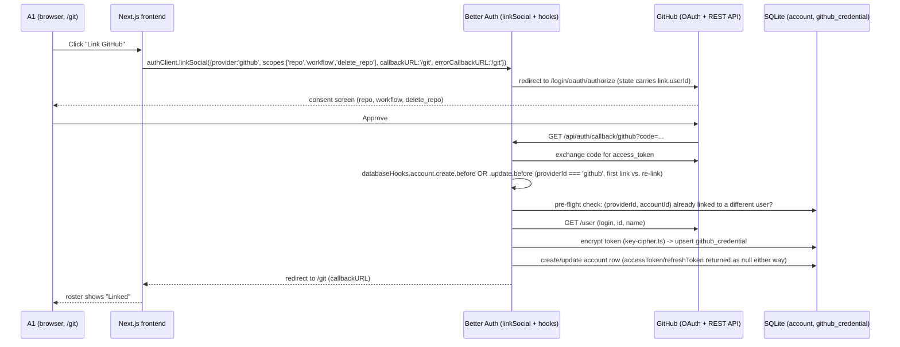

# GitHub Linking, Unified Git Page & Roster

## Overview

This is the **control-plane half** of the Discord ↔ GitHub identity feature: it adds self-service GitHub OAuth account-linking to tdr-code, and replaces the SSH-only `/git-identity` page with a unified `/git` page (GitHub section + SSH section + shared roster). It intentionally excludes all per-turn `gh`/HTTPS-push application and enforcement — that is the sibling plan, [docs/plans/2026-07-08-002-feat-tdr-code-github-per-turn-enforcement-plan.md](./2026-07-08-002-feat-tdr-code-github-per-turn-enforcement-plan.md) ("Plan B"), which depends on this plan's schema and crypto units.

When this plan ships alone (before Plan B), a linked user's GitHub token is encrypted, stored, and visible as "Linked" on the roster, but nothing yet *uses* it — the bot's per-turn `gh`/push behavior is unchanged until Plan B lands. This is deliberate: the origin document calls this split "a clean early win with no concurrency entanglement" (see origin, Next Steps).

---

## Problem Frame

tdr-code already ties each turn's git work to the triggering Discord user via a per-user SSH identity (Phase C) and gates console access via Better Auth + a Discord guild check (Phase D). Neither lets the agent act on GitHub itself (create repos, open PRs/issues) as the user, and the current `/git-identity` page is still "admin-by-snowflake" — any authenticated member can edit *any* other member's SSH key via a dropdown, not just their own.

This plan closes both gaps for the control plane: a member links their own GitHub account once (OAuth), and the page they use to do so becomes the single self-service home for both GitHub and SSH identity, plus a shared roster. (See origin: Problem Frame.)

---

## Requirements Trace

- R1. A single **"Git"** page replaces `/git-identity` and its nav entry. Route becomes `/git`; wrapper/blocked-op messages that reference the old route are updated.
- R2. The page is self-service: SSH key entry is scoped to the logged-in user (no more picking another member's snowflake from a dropdown).
- R3. A shared read-only roster lists all guild members with per-user GitHub (Linked/Not linked) and SSH (Configured/Not configured/Decrypt-failed) status; any member can break-glass clear another member's GitHub link and/or SSH key. Linking stays self-only.
- R4. A "Link GitHub" button with a tooltip explaining what it enables.
- R5. Linking uses a classic GitHub OAuth App via Better Auth account-linking (`linkSocial`), producing an `account` row with `providerId: 'github'` joined to the same `user` as the member's Discord account.
- R6. Requested scopes: `repo` + `workflow` + `delete_repo`. `delete_repo` enables repo deletion on the user's behalf; the system prompt (rule 4) requires the agent to get explicit user confirmation before running `gh repo delete`.
- R7. The GitHub token is encrypted at rest with the same AES-256-GCM master key used for SSH keys, is never nulled from the app's own store, and is never returned by any API.
- R8. On link, commit author identity is auto-derived from the GitHub profile: name = GitHub name (falling back to login), email = the account's `noreply` address.
- R13. Unlink GitHub is self-service (deletes the app's stored credential + best-effort revokes at GitHub); break-glass clear performs the same for another user.
- **Non-requirement, stated explicitly:** guild-kick does not revoke a linked GitHub token (see Scope Boundaries) — this is a deliberate boundary, not an oversight, and is called out here so a reader of Requirements Trace alone doesn't need to reach Scope Boundaries to learn a major security-adjacent decision was made.

**Origin actors:** A1 (guild member / console user — self-service link/unlink, break-glass clear), A3 (main server / control plane — serves the page, owns SQLite, stores the encrypted token).

**Origin flows:** F1 (Link GitHub, self-service OAuth), F4 (Unlink / break-glass clear).

**Origin acceptance examples:** AE1 (covers R4, R5, R8), AE4 (covers R7, R13), AE5 (covers R3, R15 — R15 is Plan B's; this plan is responsible for the "B shows Not linked" half only, not the "next turn is blocked" half).

**Scope note:** This plan delivers R1-R8 and R13 in full, including R8's derived-identity display (computed and shown within this plan; *consumed* for commit-identity precedence only in Plan B's R11). Plan B delivers R9, R10, R11, R12, R14, R15, R16, R17 (the GitHub-primary capability model and per-turn enforcement) — those requirement numbers are not otherwise discussed in this document. R19 (flat-admin / no per-identity authorization) is an origin-document precedent this plan's roster and break-glass-clear extend, not a requirement this plan introduces or numbers itself.

---

## Scope Boundaries

- No GitHub App / fine-grained per-repo least-privilege — a GitHub App cannot create repos on a personal account (origin Key Decisions).
- Personal accounts only; no org-account support in v1.
- No PAT-paste path — OAuth ("Link GitHub") only.
- No multiple-GitHub-accounts per user (enforced at the schema level, see Key Technical Decisions) — and, conversely, no multiple-Discord-users per GitHub account (the existing `account_provider_account_unique_idx` partial unique index on `(providerId, accountId)` already enforces this for `providerId: 'github'` rows exactly as it does for `'discord'` today; no schema change needed).
- No change to Discord-token handling or the guild gate. The existing `databaseHooks.account.create.before` early-exit is scoped to `providerId === 'discord'`; this plan adds a sibling branch for `'github'`, never touching the Discord branch's logic (see Key Technical Decisions).
- No automatic token-refresh machinery — classic GitHub OAuth tokens don't expire; if revoked at GitHub, the user re-links (origin Scope Boundaries; confirmed by research: Better Auth's `getValidAccessToken` refresh check requires both `refreshToken` and `accessTokenExpiresAt`, both absent for GitHub classic tokens, so no refresh cycle ever fires for these rows).
- **Guild-kick does not revoke a linked GitHub token.** The existing guild-membership check is sign-in-only (D10); a member kicked from the guild keeps any already-issued session and any already-linked GitHub credential until someone uses this plan's break-glass clear (F4). This mirrors the accepted, pre-existing gap for SSH keys and session-revoke (`revokeSessionsForDiscordUser` already only deletes session rows, not `account`/`git_identity` rows) — extending the same posture to GitHub is a deliberate continuation of the codebase's "small trusted group, flat-admin, honest threat model" stance, not a new decision. Not treated as blocking; called out here because the blast radius (a live `repo`+`workflow`+`delete_repo`-scoped token) is larger than an SSH key scoped to specific remotes.
- OAuth consent denied/cancelled by the user mid-flow is not an error state: the user lands back on `/git` with no link created (see U2's approach).

### Deferred to Follow-Up Work

- All per-turn `gh`/HTTPS-push application, the `gh` PATH wrapper, commit-identity precedence at push time (R11), commit signing scope (R12), block-when-unlinked enforcement (R16), and the system-prompt `gh` note (R17): [docs/plans/2026-07-08-002-feat-tdr-code-github-per-turn-enforcement-plan.md](./2026-07-08-002-feat-tdr-code-github-per-turn-enforcement-plan.md).
- Retroactively wiring the SSH-side `git_push_blocked` / `git_key_decrypt_failed` structured events (currently unimplemented despite existing in the `EVENT_TYPES` enum — see Context & Research) is bundled into Plan B, since it shares the same `insertEvent` call site as the new GitHub-parity events.

---

## Context & Research

### Relevant Code and Patterns

- `apps/tdr-code/src/db/schema.ts` — `account` table (lines ~623-663) already has `accessToken`/`refreshToken`/`idToken`/`accessTokenExpiresAt`/`refreshTokenExpiresAt`/`scope` columns, and a partial unique index `account_provider_account_unique_idx` on `(providerId, accountId)`. `gitIdentity` table (lines ~553-570) is the exact shape (blob ciphertext/iv/authTag, fingerprint, keyVersion, masterKeyVersion) to mirror for the new `githubCredential` table.
- `apps/tdr-code/src/auth/auth.ts` — `socialProviders.discord` (lines ~180-204) is the config pattern for `socialProviders.github`; scopes concatenate onto Better Auth's provider defaults (confirmed against installed source), not replace. `databaseHooks.account.create.before` (lines ~279-467) currently opens with `if (account.providerId !== 'discord') return` — this plan adds a `providerId === 'github'` branch before that line, leaving the Discord branch untouched. `account.updateAccountOnSignIn: false` (line ~276) is a **global** option, not Discord-scoped — inert for GitHub today since GitHub never becomes a sign-in provider in this plan, but worth a one-line comment so a future change doesn't assume it's scoped.
- `apps/tdr-code/src/auth/guild-gate.ts` — pattern for extracting a `databaseHooks` branch into its own testable module rather than inlining everything in `auth.ts`; this plan's GitHub branch should follow the same extraction (e.g. `src/auth/github-account-hook.ts`).
- `apps/tdr-code/src/auth/auth.module.ts` — the `/api`-stripping rewrite in front of the mounted Better Auth handler runs for every request regardless of provider, so `/callback/github` needs zero additional wiring beyond registering the OAuth App's callback URL at GitHub (mirrors the already-registered Discord callback).
- `apps/tdr-code/src/db/auth-session.repo.ts` — `revokeSessionsForDiscordUser`'s join (`WHERE account.provider_id = 'discord' AND account.account_id = ?`) is the template shape for a new `getGithubCredentialByDiscordUserId` two-hop lookup (Discord snowflake → `account.userId` → `github_credential` row).
- `apps/tdr-code/src/crypto/key-cipher.ts` (`encryptKey`/`decryptKey`) and `apps/tdr-code/src/crypto/master-key.ts` (`loadMasterKey`) — reused unchanged for the GitHub token.
- `apps/tdr-code/src/crypto/identity-resolution.ts` — discriminated-union pattern (`ConfiguredIdentity | UnconfiguredIdentity | DecryptFailedIdentity` with `isConfigured`/etc. type guards) to mirror in a new `github-token-resolution.ts`.
- `apps/tdr-code/src/console/git-identity.controller.ts` / `.service.ts` / `apps/tdr-code/src/db/git-identity.repo.ts` — the existing SSH self-service-to-be, currently admin-by-snowflake (a `<select>` dropdown backed by `GET /git-identity/discord-members`, `DiscordDirectoryService`). R2's self-scoping is real, undone work: the `discordUserId` param plumbing and dropdown must be removed/reworked, not just the page renamed.
- `apps/tdr-code/src/console/auth-admin.controller.ts` — the flat-admin / break-glass precedent (any authenticated member can revoke any other member's sessions, no per-identity authorization) this plan's roster-clear extends to GitHub links. Documented in `docs/plans/2026-07-02-001-feat-tdr-code-phase-d-auth-plan.md` under "Flat admin = authentication is authorization" — not yet generalized into a `docs/solutions/` convention doc despite being the third application of the same decision; worth a `/ce-compound` write-up after this feature ships.
- `apps/tdr-code/src/app/components/nav-shell.tsx` — `NAV_LINKS` array, one-line change plus route directory rename for R1.
- `apps/tdr-code/src/app/lib/auth-client.ts` — Better Auth's React client is already wired (`useSession()`); this plan adds a call to `authClient.linkSocial(...)`.

### Institutional Learnings

- `docs/solutions/conventions/tdr-code-structured-logging-convention-2026-07-03.md` — every `info`+ log needs a registered kebab-case `event` slug from `src/logging/log-events.ts`; redaction is **call-site-first**: never interpolate `err.message`/`err.stack` on a path touching key/token material (this convention exists because of a real leak in this exact area — `identity-resolution.ts`'s decrypt-failure path). Applies directly to this plan's GitHub token decrypt-failure and OAuth-hook error paths.
- `docs/solutions/conventions/begin-immediate-for-read-then-write-mutations-2026-05-27.md` — any read-then-write mutation against `better-sqlite3`/Drizzle (the link-create upsert, the break-glass-clear delete racing a self-service link) should use `db.transaction(fn, { behavior: 'immediate' })`, not the deferred default.
- `docs/solutions/conventions/type-guards-over-nonnull-assertions-on-db-rows-2026-05-30.md` — use type guards (or query-boundary `isNotNull` filters) on the new `githubCredential` table's nullable-until-linked columns rather than `!`/`as`.
- No institutional memory exists yet for: encryption-at-rest patterns as a reusable convention, Better Auth OAuth/`linkSocial`, or NestJS controller conventions — this plan's units are the first application in each area for tdr-code. Budget extra review time; strong `/ce-compound` candidates once shipped.

### External References

- Better Auth 1.6.23 (installed version) `linkSocial`: `authClient.linkSocial({ provider: 'github', scopes: ['repo','workflow','delete_repo'], callbackURL })` hits `POST {baseURL}/link-social`, which shares the **same** `/callback/:id` endpoint and the **same** `databaseHooks.account.create.before` hook as a fresh sign-up (`account.providerId === 'github'`, `account.userId` already the existing user's id) — confirmed by reading `better-auth/dist/api/routes/callback.mjs`'s `link`-branch vs. `handleOAuthUserInfo`-branch split, and `better-auth/dist/db/internal-adapter.mjs`'s `createAccount`/`linkAccount`, which both wrap the same `createWithHooks(..., "account", ...)` call. No dual-callback registration is needed at GitHub.
- `callbackURL` passed to `linkSocial` travels in server-side OAuth `state` (`better-auth/dist/oauth2/state.mjs`) and controls the post-link redirect — passing `/git` avoids landing on the Discord sign-in flow's redirect target.
- GitHub scopes concatenate onto Better Auth's GitHub-provider defaults (`read:user`, `user:email`) — confirmed via `@better-auth/core`'s `github.mjs` source, same behavior as the already-documented Discord provider.
- GitHub OAuth token revocation: `DELETE https://api.github.com/applications/{client_id}/grant` with HTTP Basic Auth (`client_id`/`client_secret`), body `{"access_token": "<token>"}`, `204` on success. Revokes the entire app-to-user grant (all tokens), which matches this app's one-token-per-user-per-app model — the correct endpoint for R13's "best-effort revoke," not the single-token `.../token` variant. Failure modes to handle gracefully: `422` (malformed/already-revoked token), a documented community-reported `404` on Basic-Auth/client mismatches. Better Auth core has a `revokeToken` extension point on its internal `OAuthProvider` interface, but the shipped GitHub provider does not implement it — this must be a hand-rolled `fetch()` call, not a Better Auth config knob.

---

## Key Technical Decisions

- **Dedicated `github_credential` table, not encryption-in-place over Better Auth's `account.accessToken`.** The origin document's own Dependencies section left this as an open question ("app-side AES-256-GCM over `account.accessToken` vs `account.encryptOAuthTokens` vs a dedicated table"). Resolved: a dedicated table, keyed on `userId` (Better Auth's own user id, one row per user — this alone enforces "no multiple-GitHub-accounts per user," R19-adjacent), storing `tokenCiphertext`/`tokenIv`/`tokenAuthTag` plus `githubUserId`, `githubLogin`, `derivedName`, `derivedEmail`, `scope`, `masterKeyVersion`, `createdAt`/`updatedAt` — the exact shape `gitIdentity` already uses. Rationale: Better Auth's own routes (`getAccessToken`, `listUserAccounts`, `unlinkAccount`) read `account.accessToken` directly with no encryption-aware seam; encrypting that column in place risks breaking any internal Better Auth logic that expects a usable plaintext token. A dedicated table keeps the app's encrypted secret store fully separate from Better Auth's own bookkeeping row, mirroring the existing `git_identity`-vs-`account` separation. Better Auth's `encryptOAuthTokens` option was considered and rejected because it would use Better Auth's own key material (its `secret` config), not the app's dedicated master-key file — R7 requires "the same AES-256-GCM master key used for SSH keys."
- **Better Auth's own `account` row for `providerId: 'github'` never carries a plaintext token.** The new `databaseHooks.account.create.before` branch encrypts the token into `github_credential` synchronously (same async-hook pattern the Discord branch already uses for its guild-membership check), then returns `{ data: { accessToken: null, refreshToken: null } }` — the same shape Discord's branch already returns — before Better Auth persists the `account` row. This satisfies R7's "never nulled" from the app's own encrypted store while keeping zero plaintext secrets in Better Auth's own table, which is strictly more defensive than required and costs nothing extra to implement (it is the same hook, the same return shape, already proven for Discord).
- **The hook's `github_credential` write and Better Auth's own `account` row insert are not atomic — never treat a bare `github_credential` row as "linked."** Confirmed by tracing the installed Better Auth source: `linkSocial`-for-an-existing-user goes through `linkAccount` (`better-auth/dist/oauth2/link-account.mjs`), which wraps its `internalAdapter.linkAccount` call in a plain `try/catch` with **no transaction**, and this app's own Drizzle adapter config already sets `transaction: false` (`auth.ts`), making even Better Auth's own transactional paths inert. So the hook's `upsertGithubCredential` write (U1, its own separate `BEGIN IMMEDIATE` transaction) and Better Auth's subsequent `account` insert are two independent operations — if the `account` insert fails afterward (most plausibly a concurrent duplicate-link race hitting `account_provider_account_unique_idx`), the result is an orphaned `github_credential` row with no matching `account` row. This is not a new problem for this codebase: the existing Discord guild-gate hook has the documented mirror-image version of it (an orphaned `user` row when a rejected sign-in's `account` insert never happens), solved by never trusting write-side atomicity across a Better Auth hook boundary and instead enforcing the invariant at every read site, backed by a compensating sweep (see `guild-gate.ts`'s own caveat and `src/db/auth-sweep.repo.ts`'s `sweepAccountlessUsers`). This plan adopts the identical posture rather than inventing a new one: U1's `getGithubCredentialByDiscordUserId` and `listGithubCredentialStatuses` require a matching `account` row before reporting a user as GitHub-linked (inner-join semantics, never a bare `github_credential` table read), so an orphaned row is invisible everywhere that matters and self-heals on next observation. A periodic sweep of unpaired `github_credential` rows is optional cleanup hygiene, not the correctness mechanism.
- **No `user:email` dependency for the noreply email (R8).** GitHub's noreply address is `{githubUserId}+{githubLogin}@users.noreply.github.com` — computable entirely from `GET /user`'s `id` and `login` fields, both always public regardless of the account's email-privacy setting. No `/user/emails` call and no reliance on the `user:email` scope Better Auth requests by default is needed for this derivation (that default scope is harmless to keep, just unused by this feature). `derivedName` = the profile's `name` field, falling back to `login` when `name` is null (many GitHub users have no display name set).
- **The GitHub profile fetch (`GET https://api.github.com/user`) happens inside the app's own hook branch, not by relying on Better Auth's internal link-flow profile fetch.** Research confirmed Better Auth's `linkSocial` callback path (the `link`-branch in `callback.mjs`) does *not* call `handleOAuthUserInfo` the way a normal sign-in does, so there is no guaranteed already-fetched profile object to read from context. Making one explicit HTTP call in the hook (using the freshly-exchanged access token) sidesteps that uncertainty entirely rather than depending on an unconfirmed internal code path.
- **Profile-fetch failure fails the link closed.** If `GET /user` errors or returns an unexpected shape, the hook throws (mirroring the existing Discord branch's fail-closed posture for its own guild check), surfaced via Better Auth's `errorCallbackURL` back to `/git` with a "linking failed, try again" state. A half-linked account with no derived identity is worse than asking the user to retry.
- **OAuth consent denial/cancellation is a benign no-op, not an error.** If the user cancels at GitHub's consent screen, no `account` row is ever created and no hook fires — Better Auth's own redirect lands back on `/git` with nothing to display beyond "not linked." No new error copy is needed for this path.
- **Re-linking an already-linked GitHub account must be handled by an `account.update.before` hook too, not just `create.before`.** Confirmed via document review by tracing the installed Better Auth source: `callback.mjs`'s `link` branch only calls `internalAdapter.createAccount` (→ `databaseHooks.account.create.before`) when no existing `(providerId: 'github', accountId)` row matches; when the same GitHub account is linked again (e.g. after a revoke-and-relink, a double-click, or a retried request), it instead calls `internalAdapter.updateAccount` — a completely different code path that never reaches `create.before` and is not gated by `updateAccountOnSignIn` (that flag only applies to the sign-in `handleOAuthUserInfo` path `linkSocial` never uses). Without a matching `databaseHooks.account.update.before` branch, a re-link would write a fresh plaintext token straight into Better Auth's own `account.accessToken` column — the exact outcome R7 and the decision above forbid. This plan therefore adds the identical encrypt-and-null-out logic as a second branch on `account.update.before`, scoped to `providerId === 'github'`, sharing the same `handleGithubAccountCreate`-style helper as the create branch (see U2).
- **"GitHub account already linked to a different Discord user" is detected with a pre-flight check inside the hook, not by catching the INSERT's constraint violation.** Originally planned as "catch the unique-constraint violation and rethrow a friendly error," but document review traced `createWithHooks` (`better-auth/dist/db/with-hooks.mjs`) and confirmed the `before` hook runs and returns *before* the adapter's `create()` call — and the `callback.mjs` `link` branch that invokes it has no surrounding try/catch. A constraint violation from the actual INSERT therefore propagates as an uncaught exception with no catch point in this call path, making "catch the constraint violation" unreachable as originally described. Resolved: the hook performs a pre-flight `SELECT` for an existing `(providerId: 'github', accountId)` row belonging to a *different* `userId` before doing any encrypt/upsert work, and throws the friendly, distinct error itself when one is found — turning a downstream DB-level race into an app-level check the hook fully controls.
- **`linkSocial`'s `errorCallbackURL` must be passed explicitly — it does not default to `/git`.** The "OAuth consent denial is a benign no-op landing back on `/git`" decision above is only true if `errorCallbackURL` is set on the `linkSocial` call; document review confirmed that without it, `state.mjs`'s `errorURL` falls through to the global `onAPIError.errorURL` (`${betterAuthUrl}/login`) — the same generic sign-in error page, which is a confusing destination for an already-authenticated user (exactly the "mild UX rough edge" already accepted elsewhere in this plan for the profile-fetch-failure and duplicate-link cases, but here contradicting this plan's own stated intent rather than being a knowingly-accepted tradeoff). U4's `linkSocial` call passes `errorCallbackURL: '/git'` explicitly so consent denial, profile-fetch failure, and the duplicate-link conflict all land back on `/git` as this plan intends.
- **Best-effort revoke failure is logged, never blocking.** Per this codebase's existing pattern for best-effort cleanup (e.g., tmpfs removal falling back to boot sweep with a debug log), a failed `DELETE /applications/{client_id}/grant` call is caught and logged at `warn` with `err.name` only (never `err.message`, per the structured-logging convention) — the local `github_credential` row and `account` row are deleted regardless of remote outcome.
- **Roster and unlink/break-glass-clear share the same flat-admin posture as SSH (R19 precedent).** Any authenticated guild member may clear any other member's GitHub link or SSH key; only *linking* is self-only (an OAuth-inherent constraint, not an app decision).

---

## Open Questions

### Resolved During Planning

- Where the encrypted token lives, whether Better Auth's own account-create hook interferes, which GitHub revocation endpoint to use, and how OAuth consent denial/cancellation and duplicate-account-link conflicts should behave: see Key Technical Decisions above (all were explicitly flagged as deferred-to-planning in the origin document).
- Whether `user:email` scope or a `/user/emails` call is needed for R8: no — resolved as unnecessary (see Key Technical Decisions).
- Whether the hook's `github_credential` write and Better Auth's `account` insert need to be forced into one transaction: no — confirmed via deepening review that no shared transaction exists to join (Better Auth's `linkAccount` path is unwrapped, and this app's adapter sets `transaction: false`); resolved read-side via an inner-join requirement instead, mirroring the existing Discord guild-gate orphan-row posture (see Key Technical Decisions, U1).
- Whether a single `databaseHooks.account.create.before` branch is sufficient to keep Better Auth's `account` row token-free: no — confirmed via document review that re-linking an already-linked GitHub account routes through Better Auth's `updateAccount`, not `createAccount`, so a matching `account.update.before` branch is required too (see Key Technical Decisions, U2).
- Whether the duplicate-GitHub-account-link conflict can be caught by wrapping the INSERT's constraint violation: no — confirmed via document review that the hook returns before the adapter's actual `create()`/`update()` call runs, with no surrounding try/catch in the `linkSocial` call path; resolved via a pre-flight `SELECT` inside the hook instead (see Key Technical Decisions, U2).
- Whether Better Auth's stock `unlink-account`/`list-accounts` routes are safe to leave mounted: no — confirmed via document review they bypass this plan's revoke-then-delete flow entirely; resolved by disabling both for this app (see U3).

### Deferred to Implementation

- The precise NestJS route layout for GitHub unlink/break-glass-clear (single consolidated controller vs. a new sibling to `GitIdentityController`) — Approach below states an intended shape, but the implementer should follow whatever keeps the diff smallest against the current `git-identity.controller.ts`/`.service.ts` split.
- Exact Zod DTO shapes for the new roster response and unlink routes — follow `git-identity.dto.ts`'s existing style.
- Whether Better Auth's `linkSocial` surfaces the duplicate-account-link constraint violation as a catchable error inside the hook, or only as a raw DB constraint error surfacing elsewhere in the call stack — needs confirmation while wiring U2's hook branch; the fallback (catching a raw SQLite constraint error) is safe either way.

---

## High-Level Technical Design

> This illustrates the intended approach and is directional guidance for review, not implementation specification. The implementing agent should treat it as context, not code to reproduce.

The unlink/break-glass path is a plain request/response (no OAuth redirect): the console calls a NestJS route, which reads the `github_credential` row, best-effort calls GitHub's revoke endpoint, then deletes both the `github_credential` row and the `account` row.

---

## Implementation Units

- U1. **`github_credential` schema, repo functions, and pure token-resolution module**

**Goal:** Give the rest of this plan (and Plan B) a place to store and read the encrypted GitHub credential, following the exact `git_identity` shape.

**Requirements:** R5, R6, R7 (single-row-per-user schema also enforces "no multiple-GitHub-accounts per user" from Scope Boundaries)

**Dependencies:** None

**Files:**
- Modify: `apps/tdr-code/src/db/schema.ts` (add `githubCredential` table + `GithubCredentialRow` type export)
- Create: `apps/tdr-code/src/db/migrations/<drizzle-kit-generated-name>.sql` (run `drizzle-kit generate` after the schema edit and commit the output — schema changes in this codebase always ship with their generated migration in the same unit; a `githubCredential` table with no migration exists only in `schema.ts`, not in any real database)
- Create: `apps/tdr-code/src/db/github-credential.repo.ts`
- Create: `apps/tdr-code/src/db/__tests__/github-credential.repo.spec.ts`
- Create: `apps/tdr-code/src/crypto/github-token-resolution.ts`
- Create: `apps/tdr-code/src/crypto/__tests__/github-token-resolution.spec.ts`

**Approach:**
- `githubCredential` table: `userId` (text, PK, `references(() => user.id, { onDelete: 'cascade' })`), `githubUserId` (text, not null), `githubLogin` (text, not null), `derivedName` (text, not null), `derivedEmail` (text, not null), `tokenCiphertext`/`tokenIv`/`tokenAuthTag` (blob, not null), `scope` (text, not null — the granted scope string, stored for future scope-narrowing audits per the origin document's open R6 question), `masterKeyVersion` (integer, default 1), `createdAt`/`updatedAt` (timestamp).
- Repo functions mirroring `git-identity.repo.ts`: `getGithubCredential(db, userId)`, `getGithubCredentialByDiscordUserId(db, discordUserId)` (two-hop join: `account` WHERE `providerId = 'discord' AND accountId = ?` → `userId` → `githubCredential` row, following `auth-session.repo.ts`'s join shape), `upsertGithubCredential(db, row)` (wrapped in `db.transaction(fn, { behavior: 'immediate' })` per the BEGIN IMMEDIATE convention), `deleteGithubCredential(db, userId)`, `listGithubCredentialStatuses(db)` (for the roster — returns `userId`/`discordUserId`/`githubLogin`/linked-boolean per row, joined against the Discord directory).
- **Every read of `github_credential` requires a matching `account` row (`providerId = 'github'`) to report a user as linked** — an inner join, never a bare `github_credential` table read — per the write-side non-atomicity finding in Key Technical Decisions. `getGithubCredential`/`getGithubCredentialByDiscordUserId`/`listGithubCredentialStatuses` all apply this join; an orphaned `github_credential` row (no matching `account` row) resolves as not-linked everywhere, mirroring `guild-gate.ts`'s existing "never trust write-side atomicity across a Better Auth hook boundary" posture.
- `github-token-resolution.ts`: a discriminated union mirroring `identity-resolution.ts` — `resolveGithubToken(row: GithubCredentialRow | undefined, masterKey: Buffer): GithubTokenResolution`, variants `{ kind: 'configured', tokenPlaintext, derivedName, derivedEmail, githubLogin }` / `{ kind: 'unconfigured' }` / `{ kind: 'decrypt_failed' }`, with `isGithubConfigured`/etc. type guards. This module is framework-free (`src/crypto/`, importable from both planes) and is the seam Plan B's per-turn resolution will call.

**Patterns to follow:**
- `apps/tdr-code/src/db/schema.ts`'s `gitIdentity` table definition (blob columns, fingerprint-equivalent, masterKeyVersion).
- `apps/tdr-code/src/crypto/identity-resolution.ts` (discriminated union + type guards).
- `apps/tdr-code/src/db/auth-session.repo.ts` (the Discord-scoped join shape).
- `docs/solutions/conventions/begin-immediate-for-read-then-write-mutations-2026-05-27.md` for the upsert.
- `docs/solutions/conventions/type-guards-over-nonnull-assertions-on-db-rows-2026-05-30.md` for nullable-until-linked column access.

**Test scenarios:**
- Happy path: `upsertGithubCredential` then `getGithubCredential` round-trips all fields; `resolveGithubToken` on a freshly-encrypted row returns `configured` with the original plaintext token, name, and email.
- Happy path: `getGithubCredentialByDiscordUserId` resolves correctly through the two-hop join for a linked user.
- Edge case: `getGithubCredentialByDiscordUserId` for a Discord user with no `github_credential` row returns `undefined`, not a throw.
- Edge case: `listGithubCredentialStatuses` includes users with no row (status = not-linked) alongside linked users.
- Error path: `resolveGithubToken` on a row encrypted under a different master key (or with a corrupted `authTag`) returns `decrypt_failed`, not a thrown exception.
- Error path: `resolveGithubToken(undefined, masterKey)` returns `unconfigured`.
- Integration: `upsertGithubCredential` called twice for the same `userId` (re-link) overwrites the prior row rather than creating a second one (schema PK enforces this; test that the overwrite actually happens, not just that no error is thrown).
- Integration: a `github_credential` row with no matching `providerId: 'github'` `account` row (simulating the orphan case from Key Technical Decisions) is reported as not-linked by `getGithubCredentialByDiscordUserId` and excluded from "linked" in `listGithubCredentialStatuses` — the inner-join behavior is the correctness mechanism for the write-side non-atomicity gap, so it must be directly exercised, not just implied.

**Verification:**
- All repo functions round-trip correctly against a real `better-sqlite3` test DB (no mocks — per the existing crypto/db test convention).
- `resolveGithubToken`'s three variants are each independently exercised.

---

- U2. **Better Auth GitHub provider + account-create/update hook branches**

**Goal:** Wire GitHub as a linkable OAuth provider and make both first-time linking and re-linking synchronously produce an encrypted, app-owned credential with zero plaintext ever left in Better Auth's own `account` row.

**Requirements:** R5, R6, R7, R8

**Dependencies:** U1

**Files:**
- Modify: `apps/tdr-code/src/auth/auth.ts` (add `socialProviders.github`; call the new hook branch from both `databaseHooks.account.create.before` and `databaseHooks.account.update.before`)
- Modify: `apps/tdr-code/src/env.ts` (add `GITHUB_CLIENT_ID`/`GITHUB_CLIENT_SECRET` to the `EnvKeys` object, following the existing Discord entries)
- Modify: `apps/tdr-code/src/logging/log-events.ts` (register new event slugs for GitHub-link profile-fetch failure and duplicate-link conflict)
- Create: `apps/tdr-code/src/auth/github-account-hook.ts`
- Create: `apps/tdr-code/src/auth/__tests__/github-account-hook.spec.ts`
- Modify: `apps/tdr-code/.env.example` (document `GITHUB_CLIENT_ID`/`GITHUB_CLIENT_SECRET`, following the existing Discord entries' comment style)

**Approach:**
- `socialProviders.github: { clientId: env(EnvKeys.GITHUB_CLIENT_ID), clientSecret: env(EnvKeys.GITHUB_CLIENT_SECRET), scope: ['repo', 'workflow', 'delete_repo'] }` — mirrors the Discord config exactly; scopes concatenate onto Better Auth's `['read:user', 'user:email']` defaults.
- Extract the GitHub logic into `github-account-hook.ts` (mirroring `guild-gate.ts`'s extraction pattern) exporting a single `handleGithubAccountUpsert(account, db, masterKey): Promise<Partial<Account> | undefined>` function, called from **both** hook sites: `auth.ts`'s `databaseHooks.account.create.before` checks `account.providerId === 'github'` first (delegating to this function) before the existing `if (account.providerId !== 'discord') return` line; a new `databaseHooks.account.update.before` adds the same `providerId === 'github'` check. Both call sites share one function because the encrypt-and-null-out logic is identical regardless of which Better Auth code path (`createAccount` for a first-time link, `updateAccount` for a re-link of an already-linked account) triggered it — confirmed via document review that `callback.mjs`'s `link` branch routes to `updateAccount`, not `createAccount`, whenever a matching `(providerId: 'github', accountId)` row already exists for the same user, so a create-only hook would silently miss every re-link.
- `handleGithubAccountUpsert`: first, a pre-flight `SELECT` for an existing `(providerId: 'github', accountId: account.accountId)` row belonging to a **different** `userId` than `account.userId` — if found, throw a distinct "this GitHub account is already linked to another tdr-code user" error immediately (before any encryption or profile fetch), since the actual INSERT/UPDATE's own unique-constraint violation happens after this hook has already returned and is not catchable from here (document review finding — the original "catch the constraint violation" approach had no reachable catch point). Otherwise: call `GET https://api.github.com/user` with `Authorization: Bearer ${account.accessToken}`; validate the response has a numeric `id` and non-empty string `login` (any other shape, including a network failure or non-200, throws — fail-closed, surfaced via `errorCallbackURL`, logged with a registered event slug and `err.name` only, never `err.message`). Compute `derivedName` (profile `name` ?? `login`) and `derivedEmail` (`${id}+${login}@users.noreply.github.com`). Encrypt `account.accessToken` via `encryptKey` (AAD bound to `${account.userId}:github`, following `key-cipher.ts`'s existing AAD-binding pattern but provider-scoped since, unlike `git_identity`, a `user` row could in principle grow more than one non-Discord provider row in the future). Call `upsertGithubCredential` (safe to call on both first link and re-link — it overwrites the prior row for that `userId`). Return `{ accessToken: null, refreshToken: null }` from both hook sites.
- Register the GitHub OAuth App's callback (`https://tdr-code.lilnas.io/api/auth/callback/github`) as a provisioning step, mirroring the already-registered Discord callback — no code change, an operational step (see Dependencies / Risks).

**Patterns to follow:**
- `apps/tdr-code/src/auth/guild-gate.ts` (extraction of a hook branch into its own testable module).
- `apps/tdr-code/src/auth/auth.ts`'s existing Discord branch (async hook body, fail-closed error handling, returning a partial mutation object).
- `docs/solutions/conventions/tdr-code-structured-logging-convention-2026-07-03.md` (never log `err.message`/`err.stack` on this path — a GitHub API error body is not secret, but the surrounding request context might carry the token; coarsen to `err.name`).

**Test scenarios:**
- Covers AE1. Happy path: a `providerId: 'github'` account create with a valid token and profile response results in a `github_credential` row with correct `derivedName`/`derivedEmail`/`githubLogin`, and the hook returns `{ accessToken: null, refreshToken: null }`.
- Happy path: `derivedName` falls back to `login` when the GitHub profile's `name` is null.
- Happy path: an existing Discord account create (`providerId: 'discord'`) is completely unaffected — the new branch never executes, existing guild-gate tests continue to pass unchanged.
- Edge case: scope assertion — the exact requested scope string includes `repo`, `workflow`, and `delete_repo` (R6).
- Error path: `GET /user` fails (network error or non-200) — the hook throws, no `github_credential` row is created, no partial state persists.
- Error path: `GET /user` succeeds but returns a shape missing `id` or `login` — the hook throws with the same fail-closed behavior as a network failure.
- Error path: a pre-flight match finds `(providerId: 'github', accountId)` already linked to a **different** `userId` — the hook throws the distinct friendly error before any encryption/upsert work happens, and no `github_credential` row is created or modified for either user.
- Integration (closes the P0 gap found in document review). **`databaseHooks.account.update.before`** fires for a re-link of an already-linked GitHub account (simulating the `updateAccount` code path directly, not just `createAccount`): the hook still encrypts and upserts `github_credential` and still returns `{ accessToken: null, refreshToken: null }` — i.e., re-linking never leaves a plaintext token in `account.accessToken`. This is the single most important test in this unit; a regression here silently reintroduces a stored plaintext OAuth token.
- Integration: re-linking (an existing `github_credential` row for this `userId`) overwrites the prior encrypted token and derived identity rather than erroring.

**Verification:**
- A live (or faithfully mocked-HTTP) `linkSocial` round-trip against a running Better Auth instance in the test harness produces a `github_credential` row and a token-free `account` row, for both a first-time link and a re-link of the same account.
- Existing `apps/tdr-code/src/auth/__tests__/guild-gate.spec.ts` and other auth specs remain green (no regression to the Discord path).
- Manually inspect the `account` table row for a `providerId: 'github'` user after both a first link and a re-link — `accessToken`/`refreshToken` are `NULL` in both cases, not just the first.

---

- U3. **Backend API: unlink, break-glass clear, and roster**

**Goal:** Give the frontend the data and mutations it needs beyond what Better Auth's own mounted routes provide (which only cover *linking*, not this app's roster join or GitHub-side revocation).

**Requirements:** R3, R13

**Dependencies:** U1

**Files:**
- Create: `apps/tdr-code/src/console/github-link.controller.ts`
- Create: `apps/tdr-code/src/console/github-link.service.ts`
- Create: `apps/tdr-code/src/console/__tests__/github-link.service.spec.ts`
- Create: `apps/tdr-code/src/console/git-roster.controller.ts`
- Create: `apps/tdr-code/src/console/git-roster.service.ts`
- Create: `apps/tdr-code/src/console/__tests__/git-roster.service.spec.ts`
- Modify: `apps/tdr-code/src/console/git-identity.controller.ts` / `.service.ts` (R2 self-scoping — see U5)
- Modify: `apps/tdr-code/src/logging/log-events.ts` (register event slugs for unlink completion and best-effort-revoke failure)
- Modify: `apps/tdr-code/src/auth/auth.ts` (disable Better Auth's stock `unlinkAccount`/`listUserAccounts` endpoints — see Approach)

**Approach:**
- `GithubLinkController` (`@Controller('git/github')`): `DELETE /git/github` (self-unlink — resolves `userId` from the authenticated session, no body param) and `DELETE /git/github/:userId` (break-glass clear, flat-admin per the `auth-admin.controller.ts` precedent — same `requireSameOrigin` guard as `git-identity.controller.ts`). Both delegate to one `GithubLinkService.unlink(userId)` method: read the `github_credential` row, best-effort `DELETE https://api.github.com/applications/{client_id}/grant` (Basic Auth, catch+log at `warn` on failure per Key Technical Decisions), then delete the `github_credential` row and the `account` row (in one `db.transaction(fn, { behavior: 'immediate' })`) — ordering and the shared transaction mean a failed delete on either side rolls back the other, so the only reachable "torn" state is the same read-side-handled orphan Key Technical Decisions already covers (an `account` row surviving with no `github_credential` row is treated as not-yet-linked-with-a-stale-credential-already-cleared, which is a safe direction to fail in; a `github_credential` row surviving with no `account` row is treated as not-linked by U1's inner join).
- **Better Auth mounts its own stock `unlink-account`/`list-accounts` routes automatically, and they bypass this unit's revoke-then-delete flow entirely.** Document review confirmed Better Auth's built-in `unlinkAccount` handler only calls `internalAdapter.deleteAccount` — it never touches `github_credential` and never calls GitHub's revoke endpoint, so a caller reaching that stock route (directly, or via a generic "connected accounts" UI pattern copied from elsewhere) would delete the `account` row while leaving a live, un-revoked, still-decryptable token orphaned in `github_credential` — U1's inner-join makes it invisible as "linked," but the token itself remains valid at GitHub indefinitely with no local trace prompting anyone to revoke it. This plan disables both stock routes (Better Auth's route-disabling config, scoped to `unlinkAccount`/`listUserAccounts`) so `DELETE /git/github`/`DELETE /git/github/:userId` are the only reachable unlink paths; the frontend (U4) never calls `authClient.unlinkAccount`/`listAccounts` for the GitHub provider.
- `GitRosterController` (`GET /git/roster`): read-only, joins `listGithubCredentialStatuses` (U1) with `DiscordDirectoryService`'s guild member list into one array of `{ discordUserId, displayName, github: 'linked' | 'not-linked', ssh: 'configured' | 'not-configured' | 'decrypt-failed' }`. The SSH status column is not a raw read of `listIdentities` (which only reports row-exists-or-not) — it calls `resolveIdentity` (via `loadMasterKey` + the row from `getIdentity`) per user, the same way `GitTurnContext.begin()` already does, so a decrypt failure is distinguishable from "not configured" on the roster exactly as it would be at turn time.
- Linking itself is **not** a new backend route — the frontend calls Better Auth's own mounted `authClient.linkSocial(...)` directly (U2 supplies the server-side hook that makes that call produce the right result).

**Patterns to follow:**
- `apps/tdr-code/src/console/git-identity.controller.ts` (origin-check guard, flat-admin route shape, Zod `safeParse` DTOs).
- `apps/tdr-code/src/console/auth-admin.controller.ts` (break-glass route precedent, its request/complete event-logging pair).
- `apps/tdr-code/src/console/discord-directory.service.ts` (existing guild-member listing, reused for the roster join).

**Test scenarios:**
- Covers AE4. Happy path: self-unlink for a linked user deletes both rows and a subsequent `GET /git/roster` shows that user as not-linked.
- Covers AE5 (the "B shows Not linked" half). Happy path: break-glass clear by a different member deletes the target's rows identically to self-unlink.
- Happy path: `GET /git/roster` returns correct combined GitHub+SSH status for a user with both, one, or neither configured.
- Edge case: unlink for a user with no `github_credential` row is a no-op (not an error) — covers the case where someone double-clicks "Unlink" or break-glass-clears an already-unlinked user.
- Error path: GitHub's revoke endpoint returns a non-2xx (e.g. `422`) — the local rows are still deleted, and a `warn`-level log records the failure without `err.message` (structured-logging convention).
- Integration: unlink and a concurrent self-service re-link racing the same `userId` do not corrupt state — the `BEGIN IMMEDIATE` transaction on both the delete and the upsert (U1) serializes them; test that one of the two operations' final state wins cleanly rather than a partial/torn row.
- Covers the stock-route-bypass gap found in document review. Integration: Better Auth's own `unlink-account`/`list-accounts` routes return 404/disabled for the GitHub provider (or are unreachable entirely, depending on which disabling mechanism the implementation uses) — a direct request to those stock endpoints must not be able to delete an `account` row while leaving `github_credential` behind.

**Verification:**
- Roster response shape matches what the frontend (U4) expects.
- No route ever returns `tokenCiphertext`/`tokenIv`/`tokenAuthTag` or any decrypted token (R7).

---

- U4. **Frontend: unified `/git` page**

**Goal:** Give A1 one self-service page for GitHub linking, SSH key management (scoped to themselves), and the shared roster.

**Requirements:** R1, R2, R3, R4

**Dependencies:** U2 (for `linkSocial`), U3 (for roster/unlink data)

**Files:**
- Create: `apps/tdr-code/src/app/git/page.tsx`
- Create: `apps/tdr-code/src/app/__tests__/git.page.spec.tsx`
- Modify: `apps/tdr-code/src/app/components/nav-shell.tsx` (`NAV_LINKS`: `/git-identity` → `/git`, label "Git identity" → "Git")

**Approach:**
- Three sections on one page: (1) **GitHub** — status badge (Linked/Not linked); while not linked, a "Link GitHub" button with a tooltip ("Lets tdr-code open PRs, create repos, and push on your behalf as your GitHub account") calling `authClient.linkSocial({ provider: 'github', scopes: ['repo', 'workflow', 'delete_repo'], callbackURL: '/git', errorCallbackURL: '/git' })` — the explicit `errorCallbackURL` is required (see Key Technical Decisions: without it, consent denial and hook failures fall through to the global `/login` error page instead of `/git`); once linked, "Link GitHub" is replaced by (not merely disabled alongside) an "Unlink" button and a "Linked as {derivedName} ({derivedEmail})" line directly under the status badge, so R8's zero-manual-entry identity is visible in the same section the user just linked from, not only in the roster. The tooltip is a native `title` attribute (no existing tooltip component exists elsewhere in this codebase to mirror, and a native attribute is sufficient for a small internal tool). No in-page loading state is needed for the "Link GitHub" click itself (`linkSocial` triggers a full-page navigation to GitHub); (2) **SSH key** — the existing add/replace/clear form from `git-identity/page.tsx`, reworked to act on the *logged-in* user only (no snowflake dropdown — R2); (3) **Roster** — a read-only table from `GET /git/roster`, one row per guild member with independent GitHub and SSH status cells, each with its own "Clear" action gated by the same inline confirm/cancel toggle `git-identity/page.tsx`'s `IdentityRow` already uses for its destructive action (not a native `confirm()` dialog), disabled while that row's own clear mutation is pending. The roster section renders its own `LoadingState`/`ErrorState`/`EmptyState` (the same components `git-identity/page.tsx` already imports) scoped to itself, so a roster-fetch failure never blocks the GitHub or SSH self-service sections above it.
- Uses `useSession()` (already established pattern in `nav-shell.tsx`) to know "who am I" for the self-service sections, and TanStack Query for the roster/status fetches (existing app-wide pattern).

**Patterns to follow:**
- `apps/tdr-code/src/app/git-identity/page.tsx` (form structure, to be adapted rather than rewritten from scratch).
- `apps/tdr-code/src/app/components/nav-shell.tsx`'s `useSession()` usage.
- Existing TanStack Query hook patterns elsewhere in `src/app/`.

**Test scenarios:**
- Test expectation: minimal — per this codebase's stated convention, frontend page components are largely excluded from required coverage, though `git-identity.page.spec.tsx`/`git-identity.page.keys.spec.tsx` show some coverage is still expected in practice. At minimum: renders the three sections; "Link GitHub" is disabled/hidden while session is pending (mirroring `UserBadge`'s pending-state handling); the SSH form never renders a user-picker (covers the R2 AE gap the flow analysis found — a negative-case test that no snowflake-selection UI exists); the roster's own loading/error/empty states render independently of the GitHub/SSH sections' state.
- Covers AE1. Integration (against a mocked "linked" session/status response): the self-service GitHub section (not the roster) shows "Linked," the "Link GitHub" button is gone, an "Unlink" button is present, and "Linked as {derivedName} ({derivedEmail})" renders directly under the status badge (confirms R8's zero-manual-entry claim is visibly true in the place the user actually linked from, not only in the roster or the DB).
- Edge case: the roster's "Clear" action for a given row/credential-type shows its inline confirm/cancel toggle before firing the clear mutation, and is disabled (not double-clickable) while that row's own mutation is in flight.

**Verification:**
- Manual verification in a browser: click "Link GitHub," complete the real GitHub OAuth consent screen against a registered OAuth App, land back on `/git` showing "Linked."
- Nav entry reads "Git" and links to `/git`; no route or link anywhere in the app still points at `/git-identity` after U5.

---

- U5. **Cutover: remove the old page, fix stale wrapper URLs**

**Goal:** Complete R1 — no dangling references to the old admin-by-snowflake page or its route string.

**Requirements:** R1, R2

**Dependencies:** U4

**Files:**
- Delete: `apps/tdr-code/src/app/git-identity/page.tsx`, `apps/tdr-code/src/app/__tests__/git-identity.page.spec.tsx`, `apps/tdr-code/src/app/__tests__/git-identity.page.keys.spec.tsx` (superseded by U4's `git.page.spec.tsx`)
- Modify: `apps/tdr-code/src/console/git-identity.controller.ts` (remove `GET /discord-members` and the `discordUserId`-in-body upsert path per R2; `upsertIdentity`/`deleteIdentity` now resolve the acting user's own id from the session for self-service calls, and continue to accept an explicit id only on the break-glass-clear route)
- Modify: `apps/tdr-code/src/console/discord-directory.service.ts` (drop the now-unused `listGuildMembers` consumer if nothing else calls it; keep the service if `git-roster.service.ts` from U3 still needs guild-member enumeration for the roster's display names)
- Modify: `apps/tdr-code/scripts/git` (line ~113: `${CONSOLE_URL}/git-identity` → `${CONSOLE_URL}/git`)
- Modify: `apps/tdr-code/scripts/git-ssh-wrapper.sh` (lines ~59, 69, 76: same `/git-identity` → `/git` fix)
- Modify: `apps/tdr-code/src/console/__tests__/*` and `apps/tdr-code/scripts/__tests__/*` specs asserting the old URL string

**Approach:**
- This is a cleanup/cutover unit, not new behavior — it exists so R1's "wrapper/blocked-op messages that currently point at `/git-identity` are updated to match" is not silently missed (the repo research found these two scripts still hard-code the old path; the origin document does not call this out as a separate action item, so it is easy to drop).
- Sequenced last so `/git` is fully functional (U4) before the old page and its route string disappear.

**Patterns to follow:**
- N/A — subtractive change.

**Test scenarios:**
- Covers R1 (closes the AE gap the flow analysis found — no origin AE exercises the page-replacement/URL-rename mechanics). Happy path: no file under `apps/tdr-code/src` or `apps/tdr-code/scripts` contains the literal string `git-identity` as a route/URL after this unit (a simple grep-based test or lint rule is sufficient; do not over-engineer this into a runtime check).
- Happy path: `scripts/git`'s existing blocked-push test (if one exists) still passes with the message asserting `/git` instead of `/git-identity`.
- Test expectation: none beyond the above for the deletions themselves — removing dead code has no new behavior to cover.

**Verification:**
- `pnpm run lint` and `pnpm run type-check` pass with the old page and its now-unused controller code paths removed.
- Manually trigger a blocked SSH push in a dev turn and confirm the printed URL reads `.../git`, not `.../git-identity`.

---

## System-Wide Impact

- **Interaction graph:** Better Auth's `databaseHooks.account.create.before` becomes a two-branch dispatcher (Discord, GitHub) instead of a single-provider guard with an early exit. Any future third provider must add a third branch here, not assume the existing early-exit pattern still reads `!== 'discord'` as "safe to ignore."
- **Error propagation:** A thrown error inside the GitHub hook branch propagates through Better Auth's own `onAPIError.errorURL` redirect — the same global error page Discord sign-in failures use (`/login?error=<code>`). Since GitHub-link failures happen to an *already-authenticated* user, landing on `/login` is a mild UX rough edge (not a broken state — the user is still logged in, they just see a login-flavored error page); acceptable for v1, worth revisiting if it confuses users in practice.
- **State lifecycle risks:** Two distinct orphan directions exist and are handled differently. (1) On **unlink**, a `github_credential` row could outlive its `account` row only if the two deletes in `GithubLinkService.unlink` are not actually transactional — U3's approach requires both deletes in one `BEGIN IMMEDIATE` transaction to avoid a half-unlinked state. (2) On **link**, confirmed via deepening review: the hook's `github_credential` write and Better Auth's own `account` insert are two independent, non-transactional operations (Better Auth's `linkAccount` path has no transaction wrapper, and this app's adapter sets `transaction: false`), so an `account`-insert failure after the hook's write already committed leaves an orphaned `github_credential` row. Unlike (1), this is not fixed by wrapping more code in a transaction (there is no shared transaction to join) — it is fixed read-side, per Key Technical Decisions and U1's inner-join requirement, mirroring the identical posture the Discord guild-gate hook already established for its own orphaned-`user`-row case.
- **API surface parity:** No other interface (Discord bot commands, etc.) currently exposes git-identity management, so there is no parity surface to update beyond the one page.
- **Integration coverage:** The full `linkSocial` → hook → encrypted-row → roster round trip is the one scenario no unit test alone proves; U2's verification step explicitly calls for an integration-level test against a running (or faithfully HTTP-mocked) Better Auth instance.
- **Unchanged invariants:** The Discord sign-in flow, the guild gate, and the existing SSH `git_identity` table and its resolution path are untouched by this plan — `resolveIdentity` (SSH) and `resolveGithubToken` (new) are independent, parallel modules; Plan B is what composes them.

---

## Risks & Dependencies

| Risk | Mitigation |
|------|------------|
| GitHub OAuth App must be registered (client id/secret, callback URL) before U2 can be tested end-to-end — an external, human provisioning step, not code | Treat as a Dependencies/Prerequisites item; stub/mock the OAuth exchange for unit tests so U1-U3 don't block on it, but budget a manual verification pass once the App is registered |
| A duplicate-account-link constraint violation might surface at a different layer than expected (raw SQLite error vs. a catchable Better Auth error) inside the hook | Deferred to Implementation (Open Questions); the fallback (catching the raw constraint error) is safe either way, just needs confirming while writing U2 |
| The `/login` redirect on a GitHub-link failure is a UX rough edge for an already-authenticated user | Accepted for v1 (System-Wide Impact); low severity, easy to revisit later with a dedicated `errorCallbackURL` target if it proves confusing |
| Removing the `discordUserId` dropdown (U5) could regress the break-glass-clear flow if it's the only place an operator can currently name another user | U3's roster (`GET /git/roster`) is the replacement source of "which discordUserId to clear," and ships before U5 removes the dropdown |
| The hook's `github_credential` write and Better Auth's `account` insert are non-atomic (confirmed via deepening review — no shared transaction exists to join) | U1's reads require a matching `account` row before reporting "linked" (inner join, not a bare table read), mirroring the existing Discord guild-gate orphan-`user`-row posture; see Key Technical Decisions |
| Re-linking an already-linked GitHub account goes through Better Auth's `updateAccount` path, not `createAccount` — a create-only hook would silently miss it and leave a plaintext token in `account.accessToken` (confirmed via document review) | U2 adds the identical encrypt-and-null-out logic as a second hook on `databaseHooks.account.update.before`, sharing one helper function with the create branch; see Key Technical Decisions and U2's dedicated re-link test |
| Better Auth's stock `unlink-account`/`list-accounts` routes bypass this plan's revoke-then-delete flow entirely, orphaning a live, un-revoked token (confirmed via document review) | U3 disables both stock routes for this app; `DELETE /git/github`/`DELETE /git/github/:userId` are the only reachable unlink paths |
| Without an explicit `errorCallbackURL`, the "consent denial lands back on `/git`" claim was false — it would actually fall through to the global `/login` error page (confirmed via document review) | U4's `linkSocial` call passes `errorCallbackURL: '/git'` explicitly |

---

## Documentation / Operational Notes

- Update `apps/tdr-code/.env.example` with `GITHUB_CLIENT_ID`/`GITHUB_CLIENT_SECRET` and a comment describing the one-time GitHub OAuth App registration + callback URL, following the existing `TDR_CODE_MASTER_KEY_FILE` "one-time host setup" comment style (no existing precedent for a GitHub-specific note, per repo research — this is new ground for this file).
- Once this plan and Plan B both ship, consider a `/ce-compound` write-up generalizing the flat-admin/break-glass pattern (now applied a third time) into a standalone `docs/solutions/` convention doc, and one documenting the app-side-encryption-over-a-second-OAuth-provider pattern for future provider additions.

---

## Sources & References

- **Origin document:** [docs/brainstorms/2026-07-08-tdr-code-github-identity-requirements.md](../brainstorms/2026-07-08-tdr-code-github-identity-requirements.md)
- **Sibling plan:** [docs/plans/2026-07-08-002-feat-tdr-code-github-per-turn-enforcement-plan.md](./2026-07-08-002-feat-tdr-code-github-per-turn-enforcement-plan.md)
- Related prior plans: `docs/plans/2026-07-01-001-feat-tdr-code-phase-c-config-git-identity-plan.md`, `docs/plans/2026-07-02-001-feat-tdr-code-phase-d-auth-plan.md`
- Related code: `apps/tdr-code/src/db/schema.ts`, `apps/tdr-code/src/auth/auth.ts`, `apps/tdr-code/src/crypto/`, `apps/tdr-code/src/console/git-identity.*`
- External docs: [Better Auth — Users & Accounts](https://www.better-auth.com/docs/concepts/users-accounts), [Better Auth — GitHub provider](https://www.better-auth.com/docs/authentication/github), [GitHub REST API — OAuth Applications](https://docs.github.com/en/rest/apps/oauth-applications)
