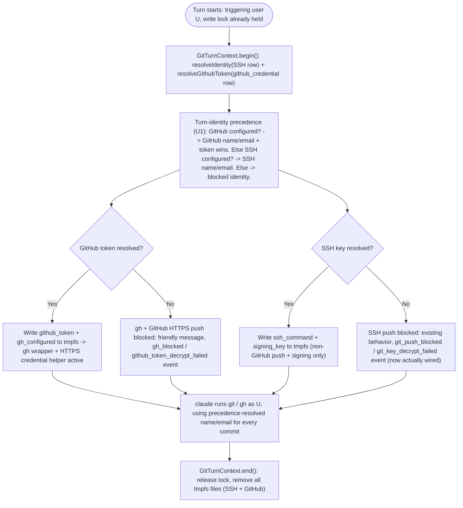
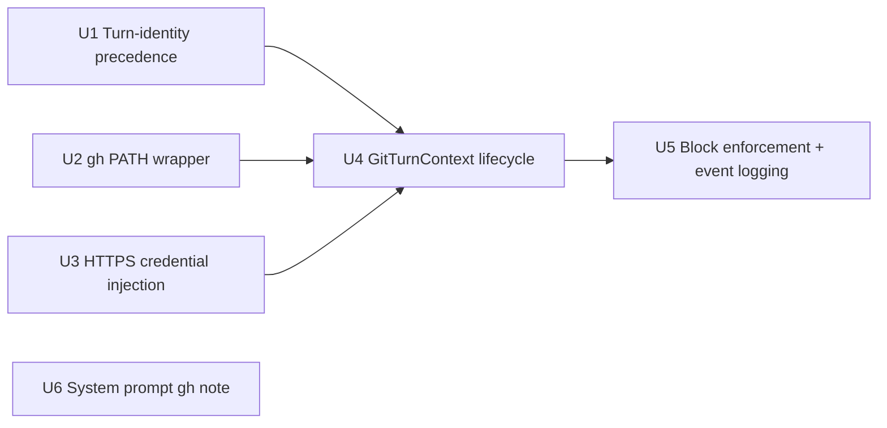

# Per-Turn GitHub Application & Enforcement

## Overview

This is the **data-plane half** of the Discord ↔ GitHub identity feature: it generalizes tdr-code's existing per-turn tmpfs + PATH-wrapper mechanism (built for SSH in Phase C) so the agent can run `gh` and push over HTTPS *as the triggering Discord user*, with GitHub-linked identity taking precedence over SSH-only identity, and a friendly block when the user isn't linked.

This plan depends on the control-plane half, [docs/plans/2026-07-08-001-feat-tdr-code-github-linking-git-page-plan.md](./2026-07-08-001-feat-tdr-code-github-linking-git-page-plan.md) ("Plan A"): specifically its `github_credential` table, repo functions, and `resolveGithubToken` module (Plan A's U1). Do not start this plan's units before Plan A's U1 has landed.

---

## Problem Frame

Once a member has linked GitHub (Plan A), nothing yet uses that link — the bot's `git`/`gh` behavior for that user is unchanged. This plan closes that gap: at each turn, the bot resolves the triggering user's GitHub token (and SSH identity) and applies both to the shared workspace for that turn, exactly generalizing the SSH mechanism Phase C already proved out. (See origin: Problem Frame, Dependencies — "the per-turn tmpfs + PATH-wrapper mechanism generalizes directly to a `gh` wrapper.")

---

## Requirements Trace

- R9. Linking GitHub enables push over HTTPS to GitHub remotes using the token (no SSH key required for GitHub repos) and `gh` CLI API operations as the user.
- R10. The SSH key is an optional add-on, required only for (a) pushing to non-GitHub remotes and (b) SSH commit signing. A user may be GitHub-only, SSH-only, both, or neither.
- R11. Commit-identity precedence: when GitHub is linked, the GitHub-derived identity is used; otherwise an SSH-only user's manually-entered name/email is used. A user with neither is push-blocked as today.
- R12. Commits are unsigned for GitHub-only users; signing is opt-in via the optional SSH key.
- R14. At each turn the bot resolves the triggering user's GitHub token and applies it via the same per-turn tmpfs mechanism used for SSH: a `gh` PATH wrapper mirroring `scripts/git`, plus a per-turn HTTPS push credential. The token file is removed at turn end.
- R15. No ambient/host GitHub token fallback and no other-user substitution.
- R16. Block when unlinked: `gh` commands and GitHub HTTPS pushes fail with a friendly message plus a structured block event. A token that fails to decrypt is treated as unlinked and logged as a distinct event type.
- R17. The agent's system prompt gains a `gh` note mirroring the existing git-wrapper transparency note.

**Origin actors:** A2 (triggering Discord user), A4 (Discord ACP bot / data plane), A5 (claude agent session).

**Origin flows:** F2 (Agent acts on GitHub as the triggering user), F3 (Blocked GitHub op when unlinked).

**Origin acceptance examples:** AE2 (covers R9, R14, R16), AE3 (covers R9, R10), AE5 (covers R3, R15 — the "next turn's push is blocked" half; the roster-clear half belongs to Plan A), AE6 (covers R12).

R1-R8 and R13 (linking, the page, roster, unlink) are Plan A's responsibility; this plan only *reads* the data Plan A produces (the `github_credential` table and `resolveGithubToken`).

---

## Scope Boundaries

- No app-side `gh` verb allowlist/denylist as a security boundary — the real boundary is the token's scope plus GitHub server-side (origin Scope Boundaries; consistent with the existing `scripts/git` wrapper's own stated posture: a UX nudge, not containment).
- No commit-signing requirement for GitHub-only users — unsigned is accepted; signing stays opt-in via the optional SSH key.
- No automatic token-refresh machinery (classic OAuth tokens don't expire; see Plan A).
- **Transient GitHub API failures (5xx, timeout, rate-limit) during a linked turn are ordinary command failures, not block events.** R16's block-event path is reserved specifically for "no token resolves" (unlinked or decrypt-failed) — a valid, linked user whose `gh`/`git push` call fails because GitHub itself is unavailable surfaces to the agent like any other tool-call failure, with no new event type. This distinction is not stated explicitly in the origin document; it is written down here because flow analysis found it could otherwise be conflated with the unlinked-block path.
- **An SSH-configured-but-GitHub-not-linked user pushing specifically to a GitHub HTTPS remote gets Git's own generic authentication failure, not a distinct block event.** This narrow case (found in document review) is not detected or event-logged by this plan: the user's SSH identity satisfies the pre-existing `identityConfigured` gate (so the push isn't blocked pre-flight), but no GitHub credential helper is registered for them, so the push fails at the network layer with Git's own error. Distinguishing this from any other HTTPS-remote auth failure would require parsing the remote URL inside the wrapper — not worth the added complexity for a case where a reasonably clear (if generic) failure already reaches the agent. See U3 for the equivalent detail from the implementation side.
- **Revocation is not instant — it is next-turn.** A turn already in flight when a GitHub link is cleared (Plan A's break-glass or self-unlink) keeps whatever it already resolved into tmpfs at `begin()` for the remainder of that turn; only turns that call `begin()` *after* the clear are blocked. This mirrors the SSH mechanism's existing behavior exactly (there is no live-revocation channel for SSH either) and is written down explicitly here because R15's "no ambient/host fallback" language could otherwise be misread as promising instant cutoff.
- **No new concurrency primitive.** `globalGitWriteLock` (`apps/tdr-code/src/agent/git-write-lock.ts`) is a single **process-global** mutex already held for a turn's entire duration before `GitTurnContext.begin()` runs — at most one turn (any user, any channel) is ever inside `begin()`...`end()` at a time, process-wide. The GitHub-token tmpfs write this plan adds inherits that serialization for free; no per-user or per-channel locking is introduced.
- Guild-kick does not revoke a linked GitHub token at turn-resolution time — this plan's `begin()` resolution keys purely on "Discord snowflake → user → `github_credential` row," with no live guild-membership re-check (matching the existing SSH resolution's posture and the sign-in-only guild gate). See Plan A's Scope Boundaries for the full rationale; the remediation path (break-glass clear) is Plan A's, not this plan's.

### Deferred to Follow-Up Work

- All GitHub linking, the unified `/git` page, and the roster: [docs/plans/2026-07-08-001-feat-tdr-code-github-linking-git-page-plan.md](./2026-07-08-001-feat-tdr-code-github-linking-git-page-plan.md).

---

## Context & Research

### Relevant Code and Patterns

- `apps/tdr-code/scripts/git` — the PATH-wrapper shape to mirror for a new `scripts/gh`: reads `${RUN_DIR}/identity/${TDR_CHANNEL_ID}/...` tmpfs files, exports env, blocks a fixed verb set with a friendly stderr message + nonzero exit when a `configured`-style marker file is absent, then `exec`s the real binary (`$TDR_REAL_GIT` / a new `$TDR_REAL_GH`). Also already does commit-signing config injection via `GIT_CONFIG_COUNT`/`GIT_CONFIG_KEY_n`/`GIT_CONFIG_VALUE_n` (Git ≥2.31 env-based config, no `.git/config` writes) — the same mechanism this plan reuses for the HTTPS credential helper, so `scripts/git`'s existing hardcoded `GIT_CONFIG_COUNT=4` must become additive rather than fixed once a second independent config block (the credential helper) can also be present.
- `apps/tdr-code/scripts/git-ssh-wrapper.sh` — the default-deny blocking wrapper pattern (argv-scans for `git-receive-pack`/`git-upload-pack`/`git-upload-archive`) for the unconfigured/decrypt-failed case; not directly reused here (HTTPS push doesn't go through an SSH command wrapper) but the same "block unless a positive marker file is present" philosophy applies to the new `gh` wrapper and the HTTPS credential-helper branch.
- `apps/tdr-code/src/agent/git-turn-context.ts` — `GitTurnContext.begin(channelId, userId, release)` / `end(channelId)` / `abort(channelId)` / `static sweep()` is the exact lifecycle this plan extends. `begin()` currently: defensively `mkdir`s `KEYS_DIR`/`IDENTITY_DIR`, loads the master key once, reads the SSH `git_identity` row, resolves it, and writes `name`/`email`/`ssh_command`/`signing_key`/`configured` files into a per-channel `IDENTITY_DIR/${channelId}` directory (or just `name`/`email`/`ssh_command` pointing at the blocking wrapper when unconfigured/decrypt-failed). `end()` releases the write lock first, then best-effort removes tmpfs files; `abort()` is the force-kill belt-and-suspenders path; `sweep()` is the boot/shutdown orphan cleanup, enumerating the directory rather than a DB ledger.
- `apps/tdr-code/src/agent/git-write-lock.ts` — `globalGitWriteLock`, a single process-global mutex (`acquire`/`releaseIfHeldBy`/`cancelWaiter`/`currentHolder`). Confirmed: only one turn process-wide ever holds it, for that turn's entire duration — this plan adds no new lock.
- `apps/tdr-code/src/agent/session-manager.service.ts` — `this.scriptsDir` (resolved once, prepended to `PATH` at spawn) and `this.realGit` (`execFileSync('which', ['git'])`, passed as `TDR_REAL_GIT` in the frozen spawn `env`) is the exact pattern to mirror for `this.realGh`/`TDR_REAL_GH`. Env is frozen once at `spawn()` — confirmed no per-turn env mutation is possible after the child process starts, which is precisely why the wrapper reads live per-turn state from tmpfs rather than env.
- `apps/tdr-code/src/db/schema.ts` — `EVENT_TYPES` (currently ending in `'git_push_blocked'`, `'git_key_decrypt_failed'`) is a CHECK-constrained enum column recreated via a drizzle-kit migration each time a value is added; the migration mechanics (not just the enum-array edit) are new, undocumented territory for this codebase (no `docs/solutions/` entry covers CHECK-constraint recreation).
- `apps/tdr-code/src/db/events.repo.ts` — `insertEvent(db, {...})` is an established, already-used pattern (`composite-acp-handler.ts`, `sqlite-writer.service.ts`, `session-manager.service.ts` all call it) — but **`git_push_blocked`/`git_key_decrypt_failed` have zero existing call sites** despite being in the enum since Phase C. This is a confirmed, real gap: the Phase C plan's own dated addendum (2026-07-03) states `GitTurnContext.begin()` "has no `insertEvent` call today, for the original push block or this new local-write block." This plan is the first to actually wire these two SSH-side events, bundled alongside the new GitHub-parity ones since they share the same call site.
- `apps/tdr-code/src/agent/agent.types.ts` — `AcpEventHandlers` interface, fanned out by `apps/tdr-code/src/discord/composite-acp-handler.ts` to three implementers (`discord-handler.service.ts` for the actual Discord-side notice, `sqlite-writer.service.ts` for persistence, `context-usage.service.ts` as a no-op passthrough). A new block-notice method added to this interface needs an implementation (even if trivial) in all three.
- `apps/tdr-code/src/agent/system-prompt.constants.ts` — `BASE_SYSTEM_PROMPT`, a single template string with exactly two numbered rules today; a `gh` note is an additive third rule in the same imperative, terse style.
- `apps/tdr-code/src/crypto/identity-resolution.ts` — the SSH-side discriminated union (`ConfiguredIdentity | UnconfiguredIdentity | DecryptFailedIdentity`) this plan's precedence module composes against Plan A's `resolveGithubToken`.

### Institutional Learnings

- `docs/solutions/conventions/tdr-code-structured-logging-convention-2026-07-03.md` — applies directly to the new `github_token_decrypt_failed` event: never interpolate `err.message`/`err.stack` on this path (coarsen to `err.name`), and every new `info`+ log needs a registered slug in `src/logging/log-events.ts` before it ships.
- No institutional memory exists for Drizzle/better-sqlite3 CHECK-constraint enum-recreation migrations, or for the tmpfs/PATH-wrapper mechanism itself — this plan's U5 (schema migration) and U2-U4 (wrapper/lifecycle extension) are genuinely new ground; the only prior art is the working Phase C code itself, not a distilled writeup. Budget extra review time and treat this as a strong `/ce-compound` candidate once shipped.

### External References

None beyond what Plan A already gathered (Better Auth/GitHub OAuth research does not bear on this plan's per-turn mechanics, which are pure extensions of the existing tmpfs/wrapper pattern).

---

## Key Technical Decisions

- **Commit identity is GitHub-derived globally once linked, regardless of which remote or protocol a given push targets.** This resolves a genuine ambiguity flow analysis found between R10(a) (SSH key needed for non-GitHub remotes) and R11 (GitHub identity used "when linked," with no remote-scoping stated). Adopted reading: R11's literal text wins — a "both" user's name/email is GitHub-derived for *every* commit once linked, full stop; the SSH key's role is strictly limited to (a) authenticating pushes to non-GitHub remotes over SSH and (b) supplying the signing key. It never supplies the name/email once GitHub is linked. Rationale: the origin document's own Key Decisions frame this whole feature as "one identity, zero friction" — a per-remote identity switch would reintroduce exactly the friction R8/R11 are designed to remove, and getting this wrong has low blast radius (a "both" user's non-GitHub commits would show a `noreply` email instead of a real one — cosmetically odd, not a security or attribution failure, consistent with the origin's "commit-identity precision is UX, not a security boundary" framing).
- **`gh` reads its token from `GH_TOKEN`, not a written `hosts.yml`.** `gh` CLI natively supports non-interactive auth via the `GH_TOKEN` environment variable. The new `scripts/gh` wrapper sets `GH_TOKEN` from a per-turn tmpfs file before exec'ing the real binary — far simpler than materializing a full `gh` config file per turn, and it cleanly disappears at turn end along with the rest of the tmpfs identity directory.
- **HTTPS push credential injection extends `scripts/git`, it does not require a second git-facing wrapper.** `git push` over HTTPS to GitHub goes through the *existing* `git` PATH wrapper, not a new one — only `gh` CLI invocations need the new `scripts/gh`. `scripts/git` gains an additional, independent `GIT_CONFIG_KEY_n`/`VALUE_n` pair (a `credential.https://github.com.helper` entry backed by an inline shell snippet that echoes the per-turn token) when a `github_token` tmpfs file is present, following the exact same env-based config-injection mechanism already used for SSH commit signing. Because the signing block and the credential-helper block are now both independently optional, `GIT_CONFIG_COUNT` becomes a running total assembled from whichever blocks are actually present, rather than the current hardcoded `4`.
- **`GitTurnContext` gains GitHub resolution in the same `begin()` call, not a parallel method.** Symmetry with the SSH mechanism (one lifecycle, one lock, one per-channel directory) is simpler to reason about and test than two independent per-turn subsystems that happen to run at the same time. `begin()` now resolves both `resolveIdentity` (SSH) and `resolveGithubToken` (GitHub, from Plan A), composes them via this plan's new precedence module, and writes whichever tmpfs files apply.
- **A missing `gh` CLI on the host must never crash the whole bot.** `this.realGit` (`session-manager.service.ts`) is resolved via a synchronous `execFileSync('which', ['git'])` in the constructor that throws on failure — reasonable for `git`, which every feature depends on. Confirmed via deepening review that `SessionManagerService` is constructed inside the separately-spawned bot child process with no NestJS-level error boundary around provider construction (`bot-bootstrap.ts`/`bot-main.ts` wrap nothing), so a constructor throw is an uncaught exception that kills the entire bot child process; the supervisor's restart-with-backoff loop would then retry the same deterministic failure until it exhausts into a terminal crash-loop, taking down every capability (SSH git included) over a missing dependency for a capability R10 explicitly says can be independently absent ("a user may be GitHub-only, SSH-only, both, or neither"). `this.realGh` is therefore resolved **leniently**: attempt `which gh` at construction, but on failure log a `warn`-level event and leave `this.realGh` unset rather than throwing; the bot boots normally with `git`/SSH fully functional. `scripts/gh` (U2) checks for an unset `TDR_REAL_GH` and prints a distinct "gh is not installed on this host — contact an operator" message (nonzero exit) rather than assuming it is always present, following the same "fail closed with a friendly message" philosophy already used for the unlinked-user block case.
- **Block-event logging for this plan bundles a retroactive fix for the SSH side.** Since `git_push_blocked`/`git_key_decrypt_failed` were never actually wired to an `insertEvent` call (a confirmed gap, not an assumption), and R16 asks for the new GitHub events to have "parity" with them, this plan's U5 implements both the SSH call sites (retroactively) and the new `gh_blocked`/`github_token_decrypt_failed` ones together, since they share the same code path inside `GitTurnContext`. This is a scope decision, not a product change — R16 already asked for parity; parity requires the SSH side to exist first.

---

## Open Questions

### Resolved During Planning

- The R10(a)/R11 commit-identity precedence ambiguity, the exact `gh`-auth mechanism, how HTTPS credential injection composes with existing SSH-signing config injection, and the concurrency model (none needed, given the global lock): see Key Technical Decisions above.
- Whether transient GitHub API failures should be treated as block events: no — see Scope Boundaries.
- Whether `this.realGh` should hard-fail at boot like `this.realGit`: no — confirmed via deepening review that a constructor throw kills the whole bot child process with no error boundary and no supervisor recovery beyond a crash-loop, which is disproportionate for an optional per-user capability (R10); resolved as a lenient warn-and-continue resolution instead (see Key Technical Decisions, U4).
- Whether the pre-existing `configured` marker file stays keyed to SSH alone once a second credential axis exists: no — confirmed via document review this would wrongly block GitHub-only users (no SSH key) at `scripts/git`'s pre-existing verb-block, contradicting AE3/R9/R10; resolved by generalizing the marker's write condition to `TurnIdentity.identityConfigured` (either axis), distinct from the new GitHub-specific `gh_configured` marker (see U1, U4).
- Whether R16's "GitHub HTTPS pushes fail with a structured block event" needs new detection code in U3: no — confirmed via document review that the fully-unconfigured case is already covered by the pre-existing verb-block (now retroactively event-logged by U5); only a narrow SSH-configured-but-GitHub-not-linked-pushing-to-GitHub-specifically edge case falls through to Git's own generic auth error, accepted as a documented scope boundary rather than added remote-URL-parsing complexity (see Scope Boundaries, U3).

### Deferred to Implementation

- The exact inline shell snippet for the git credential helper (e.g. `!f() { echo username=x-access-token; echo password=$(cat "$TOKEN_FILE"); }; f`) — Approach below sketches the shape directionally; the implementer should verify the precise quoting/escaping against the running Git version in the deployment environment.
- Whether `AcpEventHandlers`'s new block-notice method should be one generic `onGitOperationBlocked(kind: 'ssh' | 'github', ...)` method or two separate methods mirroring the existing per-concern split seen elsewhere in the interface — a naming/shape decision best made against the actual interface file during implementation.
- Exact CHECK-constraint migration mechanics for adding `gh_blocked`/`github_token_decrypt_failed` (and retroactively confirming `git_push_blocked`/`git_key_decrypt_failed` need no schema change, only new call sites) — follow whatever drizzle-kit generates for the existing `EVENT_TYPES` array edit; no prior migration write-up exists to cite.

---

## High-Level Technical Design

> This illustrates the intended approach and is directional guidance for review, not implementation specification. The implementing agent should treat it as context, not code to reproduce.



### Unit dependency graph



U1, U2, U3, and U6 have no dependencies on each other and can be built in any order (or in parallel); U4 needs all three of U1-U3 landed since it is the orchestrator that writes the files U2/U3 read using U1's decision; U5 needs U4's call sites to exist before it can hang `insertEvent` calls off them.

---

## Implementation Units

- U1. **Turn-identity precedence module**

**Goal:** One pure function that takes both identity resolutions and produces the single combined decision the rest of this plan applies — the concrete implementation of R11.

**Requirements:** R10, R11, R12

**Dependencies:** Plan A U1 (`resolveGithubToken`, `GithubTokenResolution` type)

**Files:**
- Create: `apps/tdr-code/src/agent/turn-identity.ts`
- Create: `apps/tdr-code/src/agent/__tests__/turn-identity.spec.ts`

**Approach:**
- `resolveTurnIdentity(sshResolution: IdentityResolution, githubResolution: GithubTokenResolution): TurnIdentity`, a pure function (no I/O — both resolutions are already-decrypted inputs) returning a discriminated shape covering: `commitName`/`commitEmail` (GitHub-derived if `githubResolution.kind === 'configured'`, else SSH-derived if `sshResolution` is configured, else a blocked placeholder mirroring today's `${userId}@unconfigured` pattern), `githubToken: string | null` (only from a configured GitHub resolution — independent of the commit-identity decision), `sshKeyPlaintext: Buffer | null` and `signingKeyPath` eligibility (only from a configured SSH resolution), **`identityConfigured: boolean`** (true whenever *either* axis resolved to `configured` — see the marker-file note below), and enough per-axis status (`githubStatus`, `sshStatus`) for U4/U5 to decide which block events (if any) to log.
- Encodes the Key Technical Decision explicitly in code comments: GitHub identity wins for commit name/email whenever linked, independent of which remote a given push targets.
- **`identityConfigured` is a new, distinct concept from either per-axis status, and it is what U4 must use to decide whether `scripts/git`'s pre-existing `configured` marker file gets written.** Today (SSH-only), that marker means "SSH resolved" and gates `scripts/git`'s commit/push/pull verb-block. Left unchanged, a GitHub-only user (no SSH key) would never get that marker written and would be wrongly blocked by the pre-existing SSH-specific gate — directly breaking AE3/R9/R10's "GitHub-only user needs no SSH key to push." `identityConfigured` generalizes the marker's meaning to "this turn has *some* way to attribute and push commits" (GitHub OR SSH), which is the correct condition for the pre-existing verb-block to key on now that two independent credential axes exist.

**Patterns to follow:**
- `apps/tdr-code/src/crypto/identity-resolution.ts`'s discriminated-union style (this module composes two such unions into one, but is itself framework-free and side-effect-free).

**Test scenarios:**
- Covers the R11 precedence gap flow analysis found (no origin AE tests this directly). Happy path: GitHub configured + SSH configured ("both") → `commitName`/`commitEmail` are GitHub-derived, `githubToken` is present, `sshKeyPlaintext`/signing eligibility are also present (independent axis).
- Happy path: GitHub configured + SSH unconfigured ("GitHub-only") → GitHub-derived identity, `githubToken` present, no SSH key material.
- Covers AE3. Happy path: GitHub unconfigured + SSH configured ("SSH-only") → SSH-derived identity (today's existing behavior, unchanged), no `githubToken`.
- Edge case: both unconfigured → blocked placeholder identity, both axes report not-configured (no crash, no thrown exception).
- Error path: GitHub `decrypt_failed` + SSH configured → SSH-derived identity still used for commits (GitHub only "wins" when actually configured, not merely linked-but-undecryptable), but `githubStatus` reports `decrypt_failed` distinctly from `unconfigured` so U5 can log the correct distinct event type.
- Error path: GitHub configured + SSH `decrypt_failed` → GitHub-derived identity used, SSH push/signing unavailable, `sshStatus` reports `decrypt_failed` distinctly.
- Covers AE3, the marker-file gap found in document review. Happy path: GitHub configured + SSH unconfigured → `identityConfigured` is `true` (not tied to SSH alone) — this is the exact case that must not fall through to `scripts/git`'s pre-existing SSH-specific verb-block.
- Edge case: GitHub unconfigured/decrypt-failed + SSH unconfigured/decrypt-failed (all four combinations) → `identityConfigured` is `false` in every one, so the pre-existing verb-block correctly still fires.

**Verification:**
- Every combination of `{configured, unconfigured, decrypt_failed} × {configured, unconfigured, decrypt_failed}` (9 cases) is covered by an assertion on the resulting `TurnIdentity`.

---

- U2. **`gh` PATH wrapper**

**Goal:** Make `gh` on the agent's PATH transparently authenticated as the triggering user, or clearly blocked.

**Requirements:** R9, R14, R15, R16

**Dependencies:** None (defines and consumes its own tmpfs file contract; U4 writes the files this reads)

**Files:**
- Create: `apps/tdr-code/scripts/gh`
- Create: `apps/tdr-code/scripts/__tests__/gh.spec.sh` (or equivalent, following whatever harness `scripts/__tests__/` already uses for `scripts/git`)

**Technical design:** *(directional pseudo-code, not final bash)*

```
if TDR_REAL_GH is unset:
    print "error: gh is not installed on this host — contact an operator."
    exit 1

RUN_DIR = ${TDR_CODE_RUN_DIR:-/run/tdr-code}
IDENTITY_DIR = ${RUN_DIR}/identity/${TDR_CHANNEL_ID}

if TDR_CHANNEL_ID set and IDENTITY_DIR/github_token exists:
    export GH_TOKEN = contents of IDENTITY_DIR/github_token
elif TDR_CHANNEL_ID set:
    print "error: gh is blocked: your GitHub account is not linked."
    print "       Link your GitHub account at: ${CONSOLE_URL}/git"
    exit 1
exec "$TDR_REAL_GH" "$@"
```

**Approach:**
- Mirrors `scripts/git`'s structure exactly: read `TDR_CHANNEL_ID`-scoped tmpfs state, block-with-message-and-nonzero-exit when the positive marker (`github_token` file) is absent, otherwise export and delegate. Unlike `scripts/git`, there is no "unconfigured but allow read-only verbs" nuance to replicate — `gh` has no local-write-vs-read distinction analogous to git's blocked-verb list, so the block is simpler: any `gh` invocation without a resolved token is blocked outright (R15's "no ambient/host fallback" applies to the whole binary, not a verb subset).
- No fallback SSH-style blocking wrapper is needed for `gh` (unlike git's `git-ssh-wrapper.sh`) — `gh` has no separate transport-level command to intercept; blocking at the PATH-wrapper layer is sufficient since `gh` always shells out through this wrapper first.
- Ambient environment variables (e.g. `GH_DEBUG`) are inherited unfiltered into the real `gh` process on `exec`, the same posture `scripts/git` already has for `$TDR_REAL_GIT` — accepted as-is (the installed `gh` version already redacts its own Authorization header in debug trace output), not a new gap this unit introduces.
- Distinguishes two independent block reasons with two distinct messages: `TDR_REAL_GH` unset (the host has no `gh` installed at all — an operator-facing infrastructure gap, per Key Technical Decisions) versus no `github_token` resolved for this turn (a per-user linking gap, user-facing and self-service-fixable at `/git`). Conflating the two into one message would send a user to `/git` to "fix" a problem only an operator can actually fix.

**Patterns to follow:**
- `apps/tdr-code/scripts/git` (structure, tmpfs contract, blocking message style, `set -euo pipefail`, `RUN_DIR` override for macOS dev parity).

**Test scenarios:**
- Covers AE2 (linked half). Happy path: with `github_token` present, `gh <anything>` runs with `GH_TOKEN` exported and delegates to `$TDR_REAL_GH`.
- Covers AE2 (unlinked half) and F3. Error path: with no `github_token` file, `gh <anything>` prints the friendly message pointing at `<console>/git` and exits nonzero without ever invoking the real `gh` binary.
- Edge case: no `TDR_CHANNEL_ID` set at all (e.g. a non-turn shell) — `gh` runs unmodified, mirroring `scripts/git`'s same no-op-outside-a-turn behavior.
- Covers the boot-dependency finding from deepening review. Error path: `TDR_REAL_GH` unset (host has no `gh` installed) — the wrapper prints the distinct "not installed on this host" message and exits nonzero, regardless of whether a `github_token` file exists, and without ever attempting to read the identity directory.

**Verification:**
- A scripted invocation with a fixture tmpfs directory confirms both the pass-through and blocked paths without needing a real GitHub token.

---

- U3. **HTTPS push credential injection**

**Goal:** Make `git push` to a GitHub HTTPS remote authenticate as the triggering user, with no SSH key required.

**Requirements:** R9, R14, R15, R16

**Dependencies:** None (same tmpfs contract as U2; U4 is the writer)

**Files:**
- Modify: `apps/tdr-code/scripts/git`
- Modify: `apps/tdr-code/scripts/__tests__/git.spec.sh` (or equivalent existing spec for this script)

**Technical design:** *(directional pseudo-code, not final bash — illustrates composing two independent optional config blocks into one dynamic `GIT_CONFIG_COUNT`)*

```
config_pairs = []
if IDENTITY_DIR/signing_key exists:
    config_pairs += [(gpg.format, ssh), (user.signingkey, <path>), (commit.gpgsign, true), (gpg.ssh.program, ssh-keygen)]
if IDENTITY_DIR/github_token exists:
    config_pairs += [(credential.https://github.com.helper, "!f() { echo username=x-access-token; echo password=$(cat IDENTITY_DIR/github_token); }; f")]

GIT_CONFIG_COUNT = len(config_pairs)
for i, (key, value) in enumerate(config_pairs):
    export GIT_CONFIG_KEY_i = key
    export GIT_CONFIG_VALUE_i = value
```

**Approach:**
- Extends the existing signing-config block (currently a hardcoded `GIT_CONFIG_COUNT=4` inside the `signing_key`-present branch) into an additive scheme where each independently-optional block appends its own key/value pairs and the final count reflects however many are actually present — needed because a "both" user now has *two* independent optional config blocks (signing, credential-helper) that can each be present or absent.
- The credential helper is scoped to `https://github.com` specifically (`credential.https://github.com.helper`), not a blanket `credential.helper`, so pushes to any other HTTPS remote are unaffected and fall through to the user's own ambient git credential configuration (or fail normally if none exists) — consistent with R10(a)'s "SSH key required for non-GitHub remotes" only describing SSH-protocol remotes, not blocking non-GitHub HTTPS remotes outright (the origin document does not ask for that, and this plan does not add it).
- **R16's "GitHub HTTPS pushes fail with a structured block event" is fully covered for the case that matters, via the pre-existing verb-block, not new code in this unit.** With U1/U4's `identityConfigured` fix, a user with *neither* GitHub nor SSH configured is blocked by `scripts/git`'s existing commit/push/pull verb-block (regardless of remote protocol) before a push attempt ever reaches the network — and U5 retroactively wires that exact path to the `git_push_blocked` event. The one case this unit does *not* specially detect or event-log is narrower than R16's literal wording suggests: an SSH-configured user who has *not* linked GitHub attempting a push specifically to a GitHub HTTPS remote (passing the identity-configured gate via their SSH identity, then failing at the network layer with Git's own generic credential error, since no `credential.https://github.com.helper` is registered for them). Detecting "this specific HTTPS push targets github.com and this specific user lacks a GitHub link" would require parsing the remote URL inside the wrapper — added complexity for a narrow edge case Git's own authentication failure already surfaces clearly enough to the agent. This asymmetry is a documented scope boundary, not an oversight; R9/R14/R16 as cited by this unit's Requirements are satisfied by the combination of the credential-helper injection (the happy path) and the pre-existing verb-block (the fully-unconfigured path), not by this narrow remote-specific edge case.

**Patterns to follow:**
- `apps/tdr-code/scripts/git`'s existing `GIT_CONFIG_COUNT=4` signing block (lines ~64-75), generalized rather than replaced.

**Test scenarios:**
- Covers AE3. Happy path: with both `signing_key` and `github_token` tmpfs files present, `GIT_CONFIG_COUNT` reflects both blocks' combined pairs and a `git push` to a GitHub HTTPS remote succeeds using the injected credential helper.
- Covers AE3. Happy path: with only `github_token` present (no `signing_key`), the credential helper is injected and signing config is absent — GitHub-only users need no SSH key to push (the core AE3 assertion).
- Happy path: with only `signing_key` present (no `github_token`), behavior is byte-for-byte identical to today's SSH-only signing path (regression guard for the generalization).
- Edge case: neither file present — `GIT_CONFIG_COUNT` is unset/zero, `git` runs with no injected config at all (today's unconfigured-user behavior, unchanged).
- Integration: a `git push` to a **non-GitHub** HTTPS remote with `github_token` present does not send the GitHub token as a credential (scoped helper only fires for `https://github.com`) — a real security-relevant scenario worth a dedicated test, not just an inference from the config scoping.

**Verification:**
- Existing SSH-signing tests for `scripts/git` continue to pass unchanged (regression guard).
- A GitHub-only fixture (no SSH key at all) can push to a fixture GitHub-shaped HTTPS remote in a test harness.

---

- U4. **Extend `GitTurnContext` for the GitHub token lifecycle**

**Goal:** Wire U1's precedence decision and U2/U3's tmpfs contract into the existing per-turn begin/end/abort/sweep lifecycle.

**Requirements:** R9, R10, R14, R15

**Dependencies:** Plan A U1, U1, U2, U3

**Files:**
- Modify: `apps/tdr-code/src/agent/git-turn-context.ts`
- Modify: `apps/tdr-code/src/agent/__tests__/git-turn-context.spec.ts`
- Modify: `apps/tdr-code/src/agent/session-manager.service.ts` (add `this.realGh: string | null`, resolved leniently — see Key Technical Decisions — and conditionally include `TDR_REAL_GH` in the frozen spawn `env` only when resolved, alongside the existing unconditional `TDR_REAL_GIT`)
- Modify: `apps/tdr-code/src/agent/__tests__/session-manager.service.test.ts`
- Modify: `apps/tdr-code/src/logging/log-events.ts` (register the `ghBinaryNotFound` slug used by the lenient `this.realGh` resolution below — registered here, not in U5, since U4 is the first and only call site for it)

**Approach:**
- `begin(channelId, userId, release)` additionally calls `getGithubCredentialByDiscordUserId(db, userId)` (Plan A U1) and `resolveGithubToken(row, masterKey)` (Plan A U1), then `resolveTurnIdentity(sshResolution, githubResolution)` (this plan's U1) to get the combined decision. Writes `${idDir}/github_token` (plaintext token, mode 0600, mirroring the existing `.key` file's permissions) and a `gh_configured` marker file only when the GitHub axis resolved to `configured` — mirroring the SSH `configured` marker's fail-closed philosophy (presence, not content, is the gate U2/U3 check). The existing `name`/`email` files now come from `resolveTurnIdentity`'s combined `commitName`/`commitEmail` rather than directly from the SSH resolution.
- **The pre-existing `${idDir}/configured` marker (which gates `scripts/git`'s own commit/push/pull verb-block) is now written whenever `TurnIdentity.identityConfigured` is `true`, not only when the SSH axis resolves.** This is the fix for the gap document review found: without it, a GitHub-only user (no SSH key) would never get this marker and would be wrongly blocked by `scripts/git`'s existing SSH-specific gate, contradicting AE3/R9/R10. The two markers now have distinct, non-overlapping meanings: `configured` = "this turn has *some* identity to commit/push as" (checked by `scripts/git`'s pre-existing verb-block); `gh_configured` = "this turn specifically has a GitHub token" (checked by the new `scripts/gh` wrapper and the HTTPS credential-helper injection in U3).
- `end(channelId)`/`abort(channelId)`: extend the best-effort tmpfs removal to also cover `github_token`/`gh_configured` — since these live inside the same per-channel `idDir` that's already recursively removed (`fs.rmSync(idDir, { recursive: true, force: true })`), this is likely a near-zero-diff change (the existing recursive removal already covers new files added under the same directory) — confirm this during implementation rather than assuming a new removal call is needed.
- `static sweep()`: no change needed if the above holds (the existing `IDENTITY_DIR` directory-level sweep already removes everything under `identity/<channelId>/`, including any new files this unit adds) — confirm during implementation.
- Best-effort zeroize the plaintext GitHub token buffer/string after writing, mirroring the existing `resolution.keyPlaintext.fill(0)` pattern for SSH keys, to the extent a string (not a Buffer) permits (may require reading/handling the token as a `Buffer` up to the point of writing, rather than as a `string`, to make zeroization meaningful).
- `this.realGh` resolution (constructor, alongside `this.realGit`) is lenient per Key Technical Decisions: `execFileSync('which', ['gh'])` wrapped in try/catch; on failure, log a registered `warn`-level event (e.g. `ghBinaryNotFound` in `log-events.ts`) and leave `this.realGh` as `null` rather than rethrowing. The spawn `env` (session-manager.service.ts's existing env object) includes `TDR_REAL_GH` only when `this.realGh` is non-null — an agent process spawned on a host without `gh` simply never sees that env var, and `scripts/gh` treats its absence as the distinct "not installed on this host" block reason (U2).

**Execution note:** Add the `this.realGit`-vs-`this.realGh` behavioral asymmetry (hard-fail vs. lenient) as a code comment at the point of resolution, not just in this plan — the deepening review that surfaced this exists precisely because the two look identical enough to copy-paste without noticing they must diverge.

**Patterns to follow:**
- `apps/tdr-code/src/agent/git-turn-context.ts`'s existing `begin()`/`end()`/`abort()`/`sweep()` bodies — this unit extends them, it does not restructure them.
- `apps/tdr-code/src/agent/session-manager.service.ts`'s existing `this.realGit`/`TDR_REAL_GIT` construction for the `this.realGh`/`TDR_REAL_GH` mirror.

**Test scenarios:**
- Covers AE2, AE3. Happy path: `begin()` for a GitHub-linked user writes `github_token` + `gh_configured` + GitHub-derived `name`/`email`; `end()` removes all of it.
- Happy path: `begin()` for an SSH-only user (today's existing case) is behaviorally unchanged — no `github_token`/`gh_configured` files are written, `name`/`email` remain SSH-derived.
- Happy path: `begin()` for a "both" user writes both GitHub and SSH tmpfs artifacts, with `name`/`email` GitHub-derived per U1's precedence.
- Covers AE3, the marker-file gap found in document review. Happy path: `begin()` for a GitHub-only user (no SSH key at all) writes the pre-existing `configured` marker (so `scripts/git`'s own verb-block does not fire) even though no `signing_key`/SSH-specific files are written — this is the single most important regression guard for AE3's "GitHub-only user needs no SSH key to push" claim, since a wrong `identityConfigured` wiring would silently reintroduce a block this whole plan exists to remove.
- Edge case: `begin()` for a fully-unconfigured user (today's existing case) is unchanged.
- Error path: `begin()` when the GitHub token fails to decrypt (row exists, wrong master key or corrupted ciphertext) does not write `github_token`/`gh_configured`, and does not throw — mirrors the SSH decrypt-failure path's existing fail-safe behavior.
- Integration: `abort()` mid-turn (simulating a force-kill) removes GitHub tmpfs artifacts identically to SSH ones, and is idempotent with a subsequent `end()` call for the same channel (mirrors the existing SSH idempotency test, if one exists, extended to cover the new files).
- Integration: `sweep()` after a simulated crash (files left on disk with no in-memory `activeTurns` entry) removes orphaned GitHub tmpfs files the same way it already removes orphaned SSH ones.

- Covers the boot-dependency finding from deepening review. Error path: `SessionManagerService` construction on a host with no `gh` installed logs a `warn`-level `ghBinaryNotFound` event, leaves `this.realGh` null, and does **not** throw — the service constructs successfully and `git`/SSH functionality is fully unaffected (a regression guard proving the whole bot does not crash-loop over a missing optional dependency).

**Verification:**
- `session-manager.service.ts`'s spawned `claude` process env includes `TDR_REAL_GH` alongside `TDR_REAL_GIT` when `gh` is installed on the host, and omits `TDR_REAL_GH` (with everything else unaffected) when it is not — confirmed via the existing spawn-env test's pattern, extended with a missing-`gh` case.
- No plaintext GitHub token is ever passed via spawn `env` (only via the tmpfs file `scripts/gh`/`scripts/git` read) — this is the R15 "no ambient/host fallback" guarantee applied to the mechanism itself, worth an explicit assertion.

---

- U5. **Block-when-unlinked enforcement + structured event logging**

**Goal:** Make blocked `gh`/GitHub-push operations produce the structured event R16 asks for — and, since it doesn't exist yet, the SSH-side parity event R16 asks to mirror.

**Requirements:** R16

**Dependencies:** U4

**Files:**
- Modify: `apps/tdr-code/src/db/schema.ts` (`EVENT_TYPES`: add `'gh_blocked'`, `'github_token_decrypt_failed'`; CHECK-constraint recreation migration)
- Create: a new drizzle migration file under `apps/tdr-code/src/db/migrations/` (path/name generated by `drizzle-kit generate`, not hand-authored — this is the directory `drizzle.config.ts` actually points `out` at; migration `0006_purple_vin_gonzales.sql` in this same directory, from the original `git_push_blocked`/`git_key_decrypt_failed` enum addition, is a concrete working precedent for the exact CHECK-constraint-recreation shape to expect)
- Modify: `apps/tdr-code/src/agent/git-turn-context.ts` (add `insertEvent` calls: `git_push_blocked`/`git_key_decrypt_failed` for the SSH axis — newly wired, not previously called — and `gh_blocked`/`github_token_decrypt_failed` for the GitHub axis, at the same call sites `begin()` already determines each axis's status)
- Modify: `apps/tdr-code/src/logging/log-events.ts` (register slugs for the four block/decrypt-failure events above — NOT `ghBinaryNotFound`, which U4 already registers)
- Modify: `apps/tdr-code/src/agent/agent.types.ts` (extend `AcpEventHandlers` with a block-notice method; see Open Questions for the exact shape)
- Modify: `apps/tdr-code/src/discord/composite-acp-handler.ts` (`CompositeAcpHandler implements AcpEventHandlers` — a fourth implementer of the interface, not merely an orchestrator sitting outside it; the new method needs a fan-out body here too, mirroring every other method in this file, or the file fails to compile once the interface grows)
- Modify: `apps/tdr-code/src/discord/discord-handler.service.ts` (implement the Discord-side notice — the actual user-visible message in the channel)
- Modify: `apps/tdr-code/src/discord/sqlite-writer.service.ts`, `apps/tdr-code/src/discord/context-usage.service.ts` (no-op or trivial implementations, mirroring how these two already implement every other `AcpEventHandlers` method)
- Modify corresponding `__tests__` files for each of the above

**Approach:**
- `GitTurnContext.begin()` already computes, per U1's `TurnIdentity`, whether each axis (SSH, GitHub) is `configured`/`unconfigured`/`decrypt_failed`. This unit adds one `insertEvent(db, { channelId, generationId, type: ..., level: 'warn', context: { discordUserId } })` call per axis, only when that axis is NOT `configured` (mirrors the existing tmpfs-write conditional exactly): `unconfigured` → `git_push_blocked` / `gh_blocked`; `decrypt_failed` → `git_key_decrypt_failed` / `github_token_decrypt_failed`. The `context` object carries only safe scalars (`discordUserId`, `channelId`) — never `err`, `err.message`, or anything derived from a decrypt/parse failure, since `context` is written verbatim to a column the console UI surfaces (a different, more persistent exposure surface than a pino log line), so the structured-logging convention's "never put decrypt-failure error detail on a key-material-adjacent path" rule applies to this argument just as much as to a logger call.
- After the DB insert, fan out to `AcpEventHandlers` (via whatever the existing `CompositeAcpHandler`-injection point is inside `GitTurnContext` or its caller) so a Discord notice is posted — mirroring how other blocked/anomalous conditions elsewhere in the codebase (e.g. `command_anomaly`) already combine a DB event with a Discord-visible notice.
- Every new log call follows the structured-logging convention: registered slug, no raw `err.message`/`err.stack` on the decrypt-failure paths (coarsen to `err.name`).

**Patterns to follow:**
- `apps/tdr-code/src/db/events.repo.ts`'s `insertEvent` (already used at 4+ call sites elsewhere — this is a well-worn pattern, just never applied to this specific pair of events).
- `apps/tdr-code/src/discord/composite-acp-handler.ts`'s fan-out shape for a new `AcpEventHandlers` method.
- `docs/solutions/conventions/tdr-code-structured-logging-convention-2026-07-03.md`.

**Test scenarios:**
- Covers AE2 (block half), F3. Happy path: a turn for an unlinked user results in exactly one `gh_blocked` event row (`type`, `channelId` captured correctly) and a Discord notice fires.
- Happy path: a turn for a user whose GitHub token fails to decrypt results in exactly one `github_token_decrypt_failed` event row, distinct from `gh_blocked`.
- Happy path (retroactive fix, no prior test to extend since no call site existed): a turn for an unconfigured SSH user now results in a `git_push_blocked` event row — this is new coverage for previously-silent behavior, not a regression guard.
- Happy path (retroactive fix): a turn for an SSH decrypt-failure results in a `git_key_decrypt_failed` event row.
- Happy path: a turn for a fully-configured user (both axes) results in **zero** block events — the conditional must not fire for the happy path.
- Edge case: a "both" user with GitHub configured but SSH decrypt-failed results in exactly one event (`git_key_decrypt_failed`), not two, and the turn is not blocked overall (GitHub-derived identity still lets the turn proceed per U1).
- Error path: the `insertEvent` call itself fails (DB error) — logged, does not crash the turn (mirrors the existing double-fault handling pattern seen in `composite-acp-handler.ts`'s `writerFaultEventInsertFailed`).
- Integration: the Discord notice for a block event actually reaches `AcpEventHandlers`'s Discord implementation, not just the DB — a mock-handlers test asserting the fan-out call, not just the DB row.
- Covers the missing-implementer gap found in document review. Integration: `CompositeAcpHandler`'s own fan-out for the new method actually calls into all three of `discord-handler.service.ts`/`sqlite-writer.service.ts`/`context-usage.service.ts` — this compiles and behaves identically to every other existing `AcpEventHandlers` method's fan-out shape, not just a passthrough that happens to type-check.

**Verification:**
- `EVENT_TYPES`'s CHECK constraint accepts both new values after migration; a manually-crafted invalid value is still rejected (constraint didn't silently widen).
- Manually trigger a blocked `gh` call in a dev turn and confirm both the DB event row and a Discord message appear.

---

- U6. **System prompt: `gh` transparency note**

**Goal:** Tell the agent `gh` is pre-authenticated and how to react to a block, mirroring the existing git-wrapper note.

**Requirements:** R17

**Dependencies:** None

**Files:**
- Modify: `apps/tdr-code/src/agent/system-prompt.constants.ts`
- Modify: `apps/tdr-code/src/agent/__tests__/system-prompt.constants.spec.ts` (if one exists; if not, a minimal snapshot/content assertion is sufficient — see Test scenarios)

**Approach:**
- Append a third numbered rule to `BASE_SYSTEM_PROMPT`, matching rules 1-2's terse, imperative style: `gh` is already authenticated as the triggering user; use it for PRs/issues/repo creation; if a `gh` or push operation is blocked, tell the user to link GitHub in the console rather than working around it (explicitly naming the `/git` route, matching Plan A's R1 rename).

**Patterns to follow:**
- `apps/tdr-code/src/agent/system-prompt.constants.ts`'s existing rule 1 (git-wrapper transparency) — same tone, same "never bypass / never invoke the real binary directly" framing.

**Test scenarios:**
- Test expectation: a content assertion that `BASE_SYSTEM_PROMPT` contains the new `gh` rule and correctly references `/git` (not a stale `/git-identity`), plus a regression assertion that rules 1-2 are unchanged.

**Verification:**
- Manual read-through in a live turn transcript confirms the agent's behavior on a blocked `gh` call matches the new rule's instruction (tells the user to link GitHub, doesn't try to work around the block).

---

## System-Wide Impact

- **Interaction graph:** `GitTurnContext.begin()` becomes the single per-turn seam resolving *two* credential types (SSH, GitHub) instead of one; any future third credential type should extend this same seam rather than inventing a parallel one. `AcpEventHandlers` grows a new method that all three current implementers must handle (even if trivially).
- **Error propagation:** Decrypt failures and API failures on this path must never propagate a raw `Error` up through `executePrompt` in a way that surfaces token bytes to logs or to the agent's own visible output — every new failure path funnels through the same coarsened-error-message discipline the structured-logging convention already mandates for the SSH side.
- **State lifecycle risks:** The GitHub token tmpfs file has the same "revocation is next-turn, not instant" lifecycle risk as the SSH key already has (see Scope Boundaries) — accepted, not new.
- **API surface parity:** The Discord bot is the only consumer of this mechanism; there is no second interface (e.g., a hypothetical future web-based agent trigger) to keep in parity today.
- **Integration coverage:** The full begin→wrapper-read→exec→end round trip (i.e., actually spawning `scripts/gh` or `scripts/git` as a subprocess against a fixture tmpfs tree, not just unit-testing `GitTurnContext` in isolation) is the one scenario no single unit's tests fully prove — worth at least one true subprocess-level integration test alongside the unit-level coverage in U2-U4.
- **Unchanged invariants:** SSH-only users' existing behavior (identity resolution, signing, push-blocking) is explicitly a regression-guarded no-op throughout this plan — every unit's test scenarios include an "SSH-only, unchanged" case specifically to catch accidental behavior drift from the generalization.

---

## Risks & Dependencies

| Risk | Mitigation |
|------|------------|
| This plan cannot be meaningfully implemented or tested before Plan A's U1 (`github_credential` schema + `resolveGithubToken`) exists | Explicit plan-level dependency stated in Overview; sequence Plan A first |
| `gh` CLI must be installed on the host tdr-code's backend runs on (a bare host process, not a container) — an operational prerequisite, not code | Documented in Documentation/Operational Notes. Confirmed via deepening review that mirroring `which git`'s hard-fail-at-boot behavior would crash-loop the *entire* bot (no NestJS error boundary around provider construction; the bot child process has no try/catch around its bootstrap) over a capability R10 defines as optional — `this.realGh` resolves leniently instead (warn + null, see U4/Key Technical Decisions), so a missing `gh` only disables GitHub features, never SSH/git |
| `GIT_CONFIG_COUNT` becoming dynamic (U3) risks an off-by-one if the signing and credential-helper blocks are assembled incorrectly | U3's test scenarios explicitly cover all four presence/absence combinations of the two blocks |
| Extending `AcpEventHandlers` (U5) touches three existing implementer files even though only one (`discord-handler.service.ts`) has real new behavior | Keep the two no-op implementations trivial (one-line passthroughs), mirroring how every other rarely-relevant method already looks in `context-usage.service.ts` |
| `CompositeAcpHandler` is a fourth `AcpEventHandlers` implementer (an orchestrator, not just a fan-out helper) — easy to miss when extending the interface, confirmed via document review it was absent from this plan's original Files list | U5's Files list now names it explicitly, with a dedicated test scenario asserting its fan-out actually reaches all three downstream handlers |
| The pre-existing `configured` marker's meaning silently changing from "SSH resolved" to "either axis resolved" is an easy detail to miss during implementation, confirmed via document review as a real correctness gap in the original plan draft | U1/U4 now state this explicitly with a dedicated `identityConfigured` field and a regression-guard test scenario in U4 |

---

## Documentation / Operational Notes

- Document the `gh` CLI host-provisioning requirement in `apps/tdr-code/.env.example` or a deploy runbook, following the "one-time host setup" comment style already used for `TDR_CODE_MASTER_KEY_FILE` — there is no existing precedent for a host-installed CLI dependency in this app specifically (its `ffmpeg`/`yt-dlp` analogues in `apps/download` are Dockerfile-installed, a different deployment model), so this is a new documentation pattern, not a copy of an existing one.
- Once both this plan and Plan A ship, the tmpfs/PATH-wrapper mechanism (now proven twice, for `git` and `gh`) and the CHECK-constraint enum-migration pattern are strong `/ce-compound` candidates for `docs/solutions/`.

---

## Sources & References

- **Origin document:** [docs/brainstorms/2026-07-08-tdr-code-github-identity-requirements.md](../brainstorms/2026-07-08-tdr-code-github-identity-requirements.md)
- **Sibling plan (hard dependency):** [docs/plans/2026-07-08-001-feat-tdr-code-github-linking-git-page-plan.md](./2026-07-08-001-feat-tdr-code-github-linking-git-page-plan.md)
- Related prior plan: `docs/plans/2026-07-01-001-feat-tdr-code-phase-c-config-git-identity-plan.md` (the SSH mechanism this plan generalizes, including its dated addendum on the unwired block-event gap)
- Related code: `apps/tdr-code/scripts/git`, `apps/tdr-code/scripts/git-ssh-wrapper.sh`, `apps/tdr-code/src/agent/git-turn-context.ts`, `apps/tdr-code/src/agent/git-write-lock.ts`, `apps/tdr-code/src/agent/session-manager.service.ts`, `apps/tdr-code/src/db/events.repo.ts`, `apps/tdr-code/src/agent/agent.types.ts`
