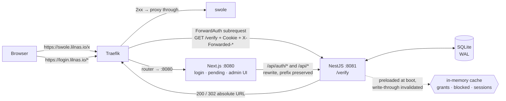

# feat: lilnas-auth — custom forward auth with per-service access requests

## Overview

Replace `thomseddon/traefik-forward-auth:2.1.0` (`infra/proxy.yml:61`) with `apps/lilnas-auth`, an owned
NestJS + Next.js service that keeps Google OAuth but adds per-`(user, service)` grants and a self-service
request → approve → access loop with a live pending page.

The authorization check stays boring: `/verify` is a header read plus two in-memory map lookups. The product
value is the onboarding loop and the admin UI around it.

Migration is incremental — a second Traefik middleware defined alongside the existing one, with routers moving
one at a time and each move revertible by a single label change.

---

## Problem Frame

Access today is binary. An email is on a global `WHITELIST` and reaches every protected service, or it is not
and reaches none. Adding a person means editing `infra/.env.forward-auth` and restarting a container.

Four confirmed drivers (see origin):

1. **Operator toil** — the admin is a manual bottleneck for every access change.
2. **No least privilege** — someone who should only see one service gets Grafana, Prometheus, the Traefik
   dashboard, and Yacht too.
3. **A whole audience is inadmissible** — people who should get exactly one service currently get nothing.
4. **Dependency risk** — `thomseddon/traefik-forward-auth` is effectively unmaintained and sits on the
   critical path of every protected request.

Per-service access alone is nearly free (N containers, N whitelists — the commented-out block at
`infra/proxy.yml:78` is that exact pattern). What that cannot produce is the request loop, the live approval
redirect, and the admin UI (see origin: `docs/brainstorms/2026-07-31-lilnas-auth-requirements.md`).

---

## Requirements Trace

- R1. Google OAuth via `better-auth`, session cookie scoped to `.lilnas.io`.
- R2. `/verify` implementing Traefik's ForwardAuth contract, keyed on `X-Forwarded-Host`. No I/O in steady state.
- R3. Post-sign-in return to the originally requested URL, validated against `*.lilnas.io`.
- R4. Granted + signed-in users pass through with no interstitial and no extra redirect.
- R5. No grant → pending page + an access request for that `(user, service)` pair.
- R6. Pending state is absorbing — re-request bumps a timestamp, never creates a second queue item.
- R7. Rejection is silent and indistinguishable from pending.
- R8. Re-request permitted after a configurable per-pair cooldown (default 24–48h). No lifetime cap.
- R9. Pending page holds a live channel and redirects automatically when a grant is written.
- R10. Queue view: requester, service, age, bulk select and dismiss.
- R11. Approve and reject on individual requests.
- R12. Per-`(user, service)` request history inline in the queue.
- R13. Service registry auto-discovered from Traefik labels.
- R14. User list shows only users with at least one grant, current or historical.
- R15. Admins can add by email (pre-authorize), remove, and edit a user's services.
- R16. Admins can block an account — no further requests, no service access.
- R17. Admin authorization from an `ADMIN_EMAILS` env allowlist, never reading the grants table.
- R18. Introduced as a **new** middleware alongside `forward-auth`; routers migrate one at a time.
- R19. Existing `WHITELIST` members seeded into grants before the first router migrates.
- R20. Health endpoint plus explicit verify-path failure behavior. ForwardAuth cannot fail open.

**Origin actors:** A1 (end user), A2 (admin), A3 (Traefik)
**Origin flows:** F1 (unknown user, ungranted service), F2 (approve while waiting), F3 (rejection and retry),
F4 (returning granted user)
**Origin acceptance examples:** AE1 (covers R6), AE2 (R7, R8), AE3 (R2, R9), AE4 (R3), AE5 (R17), AE6 (R16)

---

## Scope Boundaries

- **Not expanding the footprint.** The 13 currently-unprotected hostnames stay as they are. Expansion is a
  per-service decision after v1 ships.
- **Not solving double-login.** Emby, Immich, and MinIO have their own user systems. Header-based SSO into
  third-party services is out of scope.
- **`tdr-code` is not migrated.** It deliberately left forward-auth for app-owned Discord OAuth
  (`docs/runbooks/tdr-code-phase-d-forward-auth-cutover.md`).
- **No groups or roles.** Grants are per-`(user, service)`.
- **No notification channel.** Silent rejection is a requirement; the live redirect covers approval.
- **No API tokens or service accounts.** Machine-to-machine keeps using the internal Docker network.
- **No lifetime request cap.** Explicitly rejected — see Key Technical Decisions.
- **No path-level authorization.** Grants are per-hostname. The `swole-metrics-deny` IP-allowlist pattern
  (`apps/swole/deploy.yml:45-50`) remains the tool for path scoping.

### Deferred to Follow-Up Work

- **Replacing `trustForwardHeader` with `forwardedHeaders.trustedIPs`.** The deprecated option is used today at
  `infra/proxy.yml:74`. This plan keeps parity and does not change entrypoint config; the migration is a
  separate, independently-revertible change touching every middleware at once.
- **`dashcam` and `download` are unauthenticated and internet-facing.** Discovered during research, not part of
  this plan's scope. Flagged in Risks.
- **The post-v1 expansion pilot.** Which service to bring in first is a user decision, non-blocking.

---

## Context & Research

### Relevant code and patterns

| Concern | Reference |
|---|---|
| Hybrid NestJS + Next in one container | `apps/download/Dockerfile`, `apps/download/next.config.js`, `apps/download/package.json` (`run-p start:*`) |
| Nest bootstrap | `apps/download/src/main.ts`, `apps/download/src/bootstrap.ts` |
| better-auth wiring + its traps | `apps/tdr-code/src/auth/auth.ts`, `apps/tdr-code/src/auth/auth.module.ts` |
| Drizzle + better-sqlite3 in Nest, migrations on boot | `apps/tdr-code/src/db/database.module.ts` |
| WAL pragma order (load-bearing) | `apps/swole/src/db/pragmas.ts` |
| SQLite deploy: UID 1000, `stop_grace_period`, healthcheck | `apps/swole/deploy.yml` |
| Health response shape | `packages/utils/src/health.ts` |
| SSE controller: keepalive, explicit event IDs | `apps/tdr-code/src/sse/sse.controller.ts` |
| SSE buffering through a proxy | `apps/tdr-code/deploy/sse-locations.conf` |
| Traefik label discovery (both paths already written) | `apps/portal/src/utils/hosts.ts` |
| Compose aggregation via `include:` | `docker-compose.yml` |

### Verified facts

- **9 routers carry `forward-auth` today:** `portal`, `swole`, `tdr`, `nexus-code-mbp`, `yacht`, `prometheus`,
  `grafana`, `traefik`, `auth`. The origin doc's count of 9 is right but never names
  **`nexus-code-mbp`** (`infra/nexus-code-mbp.yml:32`) — an nginx proxy to a MacBook dev server.
- **`infra/.env.forward-auth` in this checkout is a placeholder** — byte-identical in shape to
  `infra/.env.forward-auth.example`, with `WHITELIST=foo@example.com`. Production values exist only on the
  deploy host. R19's seed list cannot be read at planning time.
- **Nothing reads `X-Forwarded-User`.** The only two matches repo-wide are the middleware definitions
  themselves (`infra/proxy.yml:75`, `:92`). Setting it is free parity with no consumer to break.
- **`image: traefik` is untagged** → resolves to v3.x. All ForwardAuth semantics below are v3.
- **Unprotected-app auth audit:** `dashcam` — none; `download` — none; `equations` — API-token check on
  `POST /equations` only (`apps/equations/src/equations.controller.ts:270-277`); `theater` — own password auth
  (`apps/theater/src/auth/`). This closes the origin's "[Needs research]" item.
- **`better-auth@1.6.23`** exposes `advanced.crossSubDomainCookies` (`{ enabled, domain, additionalCookies }`)
  and `advanced.disableOriginCheck`, the latter carrying an explicit open-redirect warning in its own JSDoc.
- **`session.cookieCache`** exists (default off, 5-minute `maxAge`).

### Traefik v3 ForwardAuth semantics

Two findings materially shape the design:

- **`preserveLocationHeader` defaults to `false`** — Traefik prefixes the auth server's `Location` with the
  auth server's domain. Since `forwardauth.address` is `http://lilnas-auth:8081`, a *relative* `Location` would
  resolve to a container-internal URL unreachable from a browser. **Every redirect out of `/verify` must be an
  absolute `https://` URL.**
- **`trustForwardHeader` is deprecated** and slated for removal in the next major. Current config uses it.

Supporting behavior:

- `authRequestHeaders` unset → **all** request headers are forwarded, including `Cookie`. This is the
  mechanism R1/R2 depend on.
- `X-Forwarded-Method | Proto | Host | Uri | For` are synthesized by Traefik. `Proto` + `Host` + `Uri`
  reconstruct the original URL for R3.
- Non-2xx from the auth server is returned to the client. The docs do not enumerate byte-for-byte relay of
  `Set-Cookie` / `Location`, which is why U1 proves it empirically.
- `addAuthCookiesToResponse` is the only path for the auth server's own `Set-Cookie` to reach the client.
- `forwardBody` defaults `false` — good, keeps `/verify` cheap.
- `maxResponseBodySize` is unlimited when unset (documented DoS note).

### Institutional learnings

- `docs/solutions/conventions/begin-immediate-for-read-then-write-mutations-2026-05-27.md` — the
  check-then-insert in the absorbing-pending upsert (R6) is exactly this shape.
- `docs/solutions/conventions/atomicity-tests-must-reach-the-write-phase-2026-06-03.md` — concurrency tests for
  R6 must actually reach the write, not stop at the read.
- `docs/solutions/conventions/type-guards-over-nonnull-assertions-on-db-rows-2026-05-30.md` — applies to every
  grant/request row read.
- `docs/solutions/architecture-patterns/expose-external-compose-via-lilnas-proxy-2026-06-25.md` — the
  `lilnas-proxy` network convention `nexus-code-mbp` and `tdr-code` follow.
- `docs/runbooks/tdr-code-phase-d-forward-auth-cutover.md` §5.1 — re-adding the Traefik label restores the edge
  gate but does nothing when app-owned auth is present-but-broken. This is the concrete precedent for R17.

---

## Key Technical Decisions

**Architecture**

- **NestJS + Next.js in one container, `apps/download` shape.** Chosen by the user. Next serves the UI on
  8080; Nest serves `/verify`, the API, better-auth, and SSE on 8081.
- **`/verify` bypasses Next entirely.** `forwardauth.address` points at a raw container port, not through the
  router: `http://lilnas-auth:8081/verify`. The router's `loadbalancer.server.port=8080` governs only UI
  traffic. The hot path therefore has one process, one hop, and no Next.js rewrite. This also gives the
  blast-radius isolation the origin's deferred question wanted — a Next crash breaks the admin UI but not
  `/verify`.
- **One process for verify + admin + OAuth (within Nest).** Splitting Nest further would reintroduce
  cross-process cache invalidation, which is exactly the complexity the origin's "keep authorization boring"
  principle warns against. Hardening instead: healthcheck probes Nest's `/health`, not Next's; the start script
  must not let a Next exit kill Nest.
- **Non-stripping Next rewrite for the auth path.** `apps/tdr-code`'s long `basePath` vs `baseURL` comment
  (`apps/tdr-code/src/auth/auth.ts:60-113`) exists because its app-wide `/api/:path*` → `:path*` rewrite strips
  the prefix before Nest sees it, and changing that rewrite was out of scope there. Greenfield, we write
  `/api/auth/:path*` → `http://localhost:8081/api/auth/:path*` (prefix preserved), so
  `basePath === new URL(baseURL).pathname === '/api/auth'` and the entire trap never arises.

**The verify path**

- **In-memory cache is a design requirement, not an optimization.** `/verify` runs on every request to every
  migrated service including static assets. Grants change a few times a month.
- **Preload grants and blocked accounts at boot; write-through invalidate.** At homelab scale (tens of users,
  tens of services) the whole grant set fits in memory trivially, so grant lookups are zero-I/O even on a cold
  process. Sessions populate via a better-auth `databaseHooks.session.create.after` hook plus a lazy
  DB-read fallback for sessions predating the current process.
- **Own session cache, not `session.cookieCache`.** `cookieCache` has a staleness window (default 5 min) during
  which a revoked session still validates. That directly undermines R16's "a blocked account reaches nothing."
  An in-process cache invalidated on write gives exact revocation.
- **No rolling session refresh from `/verify`.** Zero I/O means `updateAge` never fires on the verify path.
  Compensate with a generous absolute `expiresIn`; UI paths refresh normally.
- **Absolute `https://` Location headers everywhere.** Forced by `preserveLocationHeader`'s default. Set
  `preserveLocationHeader=true` as well, as defense in depth.
- **Fail closed on a missing `X-Forwarded-Host`.** A missing service identity is a misconfiguration, not an
  anonymous user.
- **`lilnas-auth`'s own router carries no auth middleware.** It is the auth server; gating it on its own grants
  table is the failure mode R17 exists to prevent, and the login and pending pages must be reachable without a
  grant. Admin routes are gated internally by `ADMIN_EMAILS`.

**Product semantics (carried from origin)**

- **Cooldown only, no per-account pending cap.** A cap does not defend against the actual threat (many free
  Google accounts) and punishes the best-case legitimate user.
- **Block action instead of a rate-limit ceiling.** Strictly more effective, adjacent to remove-user, nearly free.
- **No lifetime cap on re-requests.** A mis-clicked rejection under a lifetime cap permanently and invisibly
  locks out a real person.
- **Service registry derived, never hand-maintained.** Adding a label is the single action needed.

**Security and operations**

- **Compose-file label parsing, not the Docker socket** (R13). Mounting `/var/run/docker.sock` into the
  internet-facing auth container grants it effective host root; `apps/portal/deploy.yml:8` even mounts it
  read-write. `getHostsFromFiles()` already exists in `apps/portal/src/utils/hosts.ts`. Delivered by
  bind-mounting `infra/` and `apps/*/deploy.yml` read-only, which preserves R13's "adding a label is
  sufficient" (no rebuild needed). A `tecnativa/docker-socket-proxy` sidecar is the alternative if file access
  proves impractical.
- **Temporary hostname, renamed at the end.** Chosen by the user. `lilnas-auth` runs at `login.lilnas.io` while
  thomseddon holds `auth.lilnas.io` (moving thomseddon would break its registered Google redirect URI), then
  takes over `auth.lilnas.io` after thomseddon is deleted. **Register both redirect URIs in the Google console
  up front** so the rename is a Traefik label plus an env change, with no console round-trip at cutover. The
  cookie domain is `.lilnas.io` throughout, so the rename does not invalidate sessions.
- **The two auth systems coexist without interfering.** During migration a user carries both a thomseddon
  cookie (`_forward_auth`) for unmigrated routers and a better-auth cookie (`better-auth.session_token`) for
  migrated ones. Different names, no collision, and each middleware ignores the other's cookie. This is what
  makes a per-router migration safe rather than a flag day — but it does mean a user may be prompted to sign in
  twice during the transition window, once per system. Expected, and it ends when thomseddon is deleted.
- **Seed every current whitelist member with all 9 currently-protected services** (R19). Narrowing at seed time
  would violate "nobody currently working gets bounced at cutover."
- **Set `X-Forwarded-User` for parity.** Free, and nothing reads it today, so it cannot break a migrating router.

---

## Open Questions

### Resolved during planning

| Question (origin) | Resolution |
|---|---|
| [R1, R2] Does Traefik forward `Cookie` on the subrequest? | Yes — `authRequestHeaders` unset forwards all request headers. Proven empirically in U1 rather than trusted from docs. |
| [R9] SSE through Traefik — buffering, idle timeouts | Traefik does not buffer responses unless a `buffering` middleware is configured, and there is no nginx in this chain (unlike `apps/tdr-code`). NestJS `@Sse()` already emits `X-Accel-Buffering: no` and `Cache-Control: no-transform`. Keepalive every ~25s per `apps/tdr-code/src/sse/sse.controller.ts`. Verified in U1. |
| [R13] Docker socket vs compose-file parsing | Compose-file parsing via read-only bind mount. See Key Technical Decisions. |
| [R2, R17, R20] One process or two? | One Nest process, with `/verify` bypassing Next. The hybrid shape supplies the isolation for free. |
| [R18] Migration ordering | `nexus-code-mbp` → `yacht` → `prometheus` → `grafana` → `swole` → `tdr` → `portal` → `traefik`. Lowest-stakes and operator-only first; the one that can lock the operator out last. The old `auth` router is **not** migrated — it is deleted along with the `traefik-forward-auth` service it fronts, after which `lilnas-auth` takes over the hostname. |
| [R19] Whitelist → grant mapping | All current members get all 9 services. |
| [Needs research] Do `dashcam` / `download` / `equations` / `theater` have their own auth? | `dashcam` none, `download` none, `equations` API-token on `POST` only, `theater` own password auth. |

### Deferred to implementation

- **Exact cache invalidation seam for better-auth session writes.** `databaseHooks.session.create.after` is the
  intended hook, but sign-out and expiry sweeps may need separate seams. Determined by reading the installed
  1.6.23 source during U4, the way `apps/tdr-code/src/auth/auth.ts` documents its own hook choices.
- **Whether `addAuthCookiesToResponse` is needed.** Only if `/verify` ever needs to set a cookie. Under the
  no-rolling-refresh decision it should not — confirm in U1.
- **Cooldown default within the 24–48h band.** Configuration; pick during U5 and leave it env-tunable.
- **Traefik/`lilnas-auth` startup ordering.** `depends_on: { condition: service_healthy }` works within the
  aggregated `docker-compose.yml`, but the exact restart-order behavior on host reboot needs observation in U10.

### Non-blocking, deferred past v1

- Which service to pilot for the Approach C expansion. Emby is the natural candidate given driver #3, but it is
  also the worst case for double-login.

---

## Output Structure

    apps/lilnas-auth/
    ├── Dockerfile
    ├── deploy.yml
    ├── deploy.dev.yml
    ├── .env.example
    ├── drizzle.config.ts
    ├── jest.config.js
    ├── next.config.js
    ├── package.json
    ├── tsconfig.json
    ├── eslint.config.cjs
    └── src/
        ├── main.ts
        ├── bootstrap.ts
        ├── app.module.ts
        ├── env.ts
        ├── auth/                 # better-auth instance, Nest mount, redirect validation
        ├── verify/               # /verify controller, cache, decision logic
        ├── requests/             # request lifecycle: create, absorb, cooldown, approve, reject
        ├── grants/               # grant read/write + cache invalidation
        ├── services/             # compose-label service registry
        ├── admin/                # admin authz guard + admin API
        ├── sse/                  # live channel for the pending page
        ├── health/
        ├── db/
        │   ├── schema.ts
        │   ├── database.module.ts
        │   └── migrations/
        └── app/                  # Next.js App Router: /login, /pending, /admin/*

---

## High-Level Technical Design

> *This illustrates the intended approach and is directional guidance for review, not implementation
> specification. The implementing agent should treat it as context, not code to reproduce.*

### Process and routing topology

The key property: the ForwardAuth hot path never touches Next.js.

Both processes live in one container under `run-p`. Traefik reaches `:8081` directly for `/verify` and `:8080`
for everything user-facing.

### The verify decision

The decision flow is specified in the origin document's flowchart
(`docs/brainstorms/2026-07-31-lilnas-auth-requirements.md`, "The verify decision") and is carried forward
unchanged, with two additions this plan makes explicit:

- A missing `X-Forwarded-Host` fails closed with a 5xx rather than being treated as anonymous.
- Every non-200 outcome emits an **absolute** `https://<AUTH_HOST>/...` Location.

### Redirect validation (R3, AE4)

Parse-then-check, never string-match. `new URL(candidate)` and then assert: scheme is `https:`; `hostname`
equals `lilnas.io` or ends with `.lilnas.io`; hostname is not the auth host itself (loop guard). Anything else
falls back to a configured default destination.

Parsing is what defeats the classic bypasses — `https://auth.lilnas.io@evil.com` parses to hostname
`evil.com`, `https://lilnas.io.evil.com` does not end with `.lilnas.io`, and `https://evil-lilnas.io` does not
either (the leading dot matters). A protocol-relative `//evil.com` fails the absolute-`https:`-URL requirement.

---

## Implementation Units

### Phase 1 — Prove the contract, then scaffold

- U1. **ForwardAuth and SSE contract spike**

**Goal:** Empirically prove the four assumptions the whole design rests on, before any of it is built.

**Requirements:** R1, R2, R9, R20

**Dependencies:** None

**Files:**
- Create: `apps/lilnas-auth/src/verify/__tests__/forwardauth-contract.spec.ts` (the durable artifact)
- Create: `docs/plans/2026-07-31-001-feat-lilnas-auth-forward-auth-spike-findings.md` (findings, deleted or
  folded into the plan once U2 lands)
- Modify: `infra/proxy.dev.yml` (temporary second middleware + stub, reverted at the end of the unit)

**Approach:**
- Stand up a throwaway stub that echoes the headers it receives, wire it as a second middleware in the dev
  Traefik, and point one dev router at it.
- Prove, in order: (a) `Cookie` arrives on the subrequest; (b) `X-Forwarded-Host|Proto|Uri|Method|For` all
  arrive with the values expected; (c) an absolute `https://` Location in a 302 reaches the browser unmodified,
  and a relative one does **not** — confirming the `preserveLocationHeader` finding; (d) an SSE response
  through Traefik streams without buffering and survives longer than the keepalive interval.
- Record whether `addAuthCookiesToResponse` is needed for anything in the final design.
- Revert the dev Traefik changes before the unit closes. The stub's assertions graduate into the spec file.

**Execution note:** This is a risk-retirement spike. Its output is a documented finding set, not a feature. If
(a) or (c) come back differently than the docs predict, stop and re-plan — several later units change shape.

**Test scenarios:**
- Happy path: a request carrying a session cookie reaches the stub with that `Cookie` header intact.
- Happy path: `X-Forwarded-Host` equals the original request host, not the auth container's host.
- Happy path: `X-Forwarded-Uri` plus `X-Forwarded-Proto` plus `X-Forwarded-Host` reconstruct the full original
  URL byte-for-byte.
- Edge case: a 302 with a **relative** Location — assert the browser-visible Location is rewritten to a
  container-internal URL (this is the finding, and the reason the absolute-URL rule exists).
- Edge case: a 302 with an **absolute** `https://` Location — assert it reaches the client unmodified.
- Edge case: an SSE stream idle for longer than the keepalive interval stays open through Traefik.
- Error path: a non-2xx stub response is relayed to the client with its status preserved.

**Verification:**
- Each of the four assumptions has a recorded pass/fail with the observed evidence.
- `infra/proxy.dev.yml` is back to its original content.

---

- U2. **App scaffold, schema, and deployment**

**Goal:** A deployable, health-checked, empty `apps/lilnas-auth` with its database and migrations in place.

**Requirements:** R20

**Dependencies:** U1

**Files:**
- Create: `apps/lilnas-auth/package.json`, `tsconfig.json`, `eslint.config.cjs`, `jest.config.js`,
  `next.config.js`, `drizzle.config.ts`, `Dockerfile`, `deploy.yml`, `deploy.dev.yml`, `.env.example`
- Create: `apps/lilnas-auth/src/main.ts`, `src/bootstrap.ts`, `src/app.module.ts`, `src/env.ts`
- Create: `apps/lilnas-auth/src/db/schema.ts`, `src/db/database.module.ts`, `src/db/migrations/`
- Create: `apps/lilnas-auth/src/health/health.controller.ts`
- Modify: `docker-compose.yml`, `docker-compose.dev.yml` (add the new `include:` entry)
- Test: `apps/lilnas-auth/src/db/__tests__/schema.spec.ts`

**Approach:**
- Mirror `apps/download` for the hybrid shape: Next on 8080, Nest on 8081, `run-p start:*`. Mirror
  `apps/swole/deploy.yml` for the SQLite operational envelope — UID 1000 volume note, `stop_grace_period: 30s`,
  Docker healthcheck.
- **Healthcheck probes Nest's `/health` on 8081**, not Next. A dead UI must not restart the container and take
  `/verify` down with it. Conversely the start script must not let a Next exit kill Nest.
- Schema: better-auth's own tables plus `grant (userId, serviceHost)`, `access_request (userId, serviceHost,
  status, createdAt, lastSeenAt, decidedAt)`, and a blocked flag on user. A **unique index on
  `(userId, serviceHost)` in `access_request`** is what makes R6 absorbing by construction rather than by
  application logic.
- Pragmas in the order `apps/swole/src/db/pragmas.ts` documents as load-bearing; migrations on boot per
  `apps/tdr-code/src/db/database.module.ts`.
- Bind-mount `infra/` and `apps/` read-only for U8's label discovery; establish the mount here so U8 does not
  also change deployment.
- Structured logging from the start, per
  `docs/solutions/conventions/tdr-code-structured-logging-convention-2026-07-03.md`. `/verify` is about to
  become the highest-fan-in endpoint in the fleet; retrofitting log structure onto it later means changing the
  hot path.
- Check `jest.config.js`'s `@lilnas/utils` module mapping actually resolves — a stale copy of this config
  elsewhere in the repo points at a nonexistent path.

**Patterns to follow:** `apps/download/Dockerfile`, `apps/download/src/bootstrap.ts`, `apps/swole/deploy.yml`,
`apps/tdr-code/src/db/database.module.ts`, `apps/swole/src/db/pragmas.ts`, `packages/utils/src/health.ts`

**Test scenarios:**
- Happy path: migrations apply cleanly to an empty database and the expected tables exist.
- Happy path: `GET /health` returns 200 with the `@lilnas/utils/health` shape and a SQLite dep probe.
- Edge case: inserting a second `access_request` for an existing `(userId, serviceHost)` pair violates the
  unique index — this is the R6 guarantee, asserted at the schema level before any code depends on it.
- Error path: `/health` returns 503 with `deps.sqlite = 'degraded'` when the SQLite handle is unusable.
- Error path: `foreign_keys` is still `ON` after migrations run (the migrator can toggle it off mid-flow).

**Verification:**
- `docker-compose -f docker-compose.dev.yml up -d lilnas-auth` reaches a healthy state.
- `pnpm --filter=@lilnas/lilnas-auth lint type-check test` passes.
- Neither port is reachable through Traefik yet beyond the router for the UI.

---

### Phase 2 — Authentication core

- U3. **better-auth mount, Google OAuth, cross-subdomain session**

**Goal:** A user can sign in with Google at `login.lilnas.io` and receive a session cookie valid across
`*.lilnas.io`.

**Requirements:** R1

**Dependencies:** U2

**Files:**
- Create: `apps/lilnas-auth/src/auth/auth.ts`, `src/auth/auth.module.ts`
- Modify: `apps/lilnas-auth/src/app.module.ts`, `src/env.ts`, `next.config.js`, `.env.example`
- Create: `apps/lilnas-auth/src/app/login/page.tsx`
- Test: `apps/lilnas-auth/src/auth/__tests__/auth-mount.spec.ts`

**Approach:**
- `advanced.crossSubDomainCookies: { enabled: true, domain: '.lilnas.io' }` for R1.
- Leave `advanced.disableOriginCheck` at its default `false` — its own JSDoc warns it enables open redirects,
  which is the surface R3 exists to close.
- Non-stripping Next rewrite so `basePath` and `new URL(baseURL).pathname` are both `/api/auth`. Read
  `apps/tdr-code/src/auth/auth.ts:60-113` first — it is the record of what goes wrong when they diverge.
- Register **both** `https://login.lilnas.io/api/auth/callback/google` and
  `https://auth.lilnas.io/api/auth/callback/google` in the Google console now, so U11's rename needs no console
  change.
- Generous absolute `session.expiresIn` — `/verify` will not roll it forward.

**Patterns to follow:** `apps/tdr-code/src/auth/auth.ts`, `apps/tdr-code/src/auth/auth.module.ts` (including
`disableGlobalAuthGuard: true` and `forRootAsync` for DI access to the shared DB handle — no second
better-sqlite3 handle)

**Test scenarios:**
- Happy path: a request to `/api/auth/sign-in/social` with `provider: google` returns a Google authorize
  redirect whose `redirect_uri` is byte-identical to the registered URI.
- Happy path: a completed callback issues a session cookie with `Domain=.lilnas.io`, `HttpOnly`, `Secure`,
  `SameSite=Lax`.
- Happy path: the session cookie set at `login.lilnas.io` is presented by the browser on a request to another
  `*.lilnas.io` host.
- Edge case: a request to `/auth/*` (the stripped form) 404s — confirming the rewrite preserves the prefix and
  the tdr-code trap is genuinely absent, not merely unobserved.
- Error path: each missing required env var throws a named "<KEY> not defined" error at boot, not at first
  request.
- Error path: an OAuth error redirects to the styled login page, not better-auth's bare `/error` page.

**Verification:**
- A real Google sign-in at `login.lilnas.io` completes and lands on a signed-in page.
- The session cookie is visible to a request against a different `*.lilnas.io` host.

---

- U4. **Redirect validation**

**Goal:** No crafted `redirect` parameter can send a signed-in user to an external origin.

**Requirements:** R3, AE4

**Dependencies:** U3

**Files:**
- Create: `apps/lilnas-auth/src/auth/redirect.ts`
- Modify: `apps/lilnas-auth/src/auth/auth.module.ts`, `src/app/login/page.tsx`
- Test: `apps/lilnas-auth/src/auth/__tests__/redirect.spec.ts`

**Approach:**
- Parse-then-check as described in High-Level Technical Design. Pure function, no I/O, exhaustively testable in
  isolation — which is why this is its own unit rather than a helper inside U3.
- The allowed suffix is configuration, not a literal, so `*.dev.lilnas.io` works in development.

**Execution note:** Write the rejection cases first. This is the one unit where a passing test suite that
happens to omit a bypass class is worse than no suite at all.

**Test scenarios:**
- Covers AE4. Error path: `https://evil.example.com` → falls back to the default destination.
- Happy path: `https://swole.lilnas.io/some/path?q=1` → returned unchanged, query and path preserved.
- Happy path: `https://lilnas.io/` (apex, no subdomain) → allowed.
- Error path: `https://auth.lilnas.io@evil.com` (userinfo bypass) → rejected; parsed hostname is `evil.com`.
- Error path: `https://lilnas.io.evil.com` (suffix-position bypass) → rejected.
- Error path: `https://evil-lilnas.io` (missing-dot bypass) → rejected.
- Error path: `//evil.com` (protocol-relative) → rejected.
- Error path: `http://swole.lilnas.io` (scheme downgrade) → rejected.
- Error path: `javascript:alert(1)` and other non-http schemes → rejected.
- Edge case: the auth host itself as the redirect target → rejected, to prevent a sign-in loop.
- Edge case: absent, empty, or non-string `redirect` → default destination, no throw.

**Verification:**
- Every rejection case returns the default destination and never the crafted origin.
- No test asserts on substring matching — all assertions go through parsed URL components.

---

- U5. **The verify path: cache and decision**

**Goal:** `/verify` answers correctly, and answers from memory.

**Requirements:** R2, R4, R16 (enforcement half), R20; F4

**Dependencies:** U3, U4

**Files:**
- Create: `apps/lilnas-auth/src/verify/verify.controller.ts`, `src/verify/access-cache.service.ts`,
  `src/verify/verify.service.ts`
- Create: `apps/lilnas-auth/src/grants/grants.repo.ts`
- Modify: `apps/lilnas-auth/src/app.module.ts`
- Test: `apps/lilnas-auth/src/verify/__tests__/verify.service.spec.ts`,
  `src/verify/__tests__/access-cache.service.spec.ts`

**Approach:**
- Implement the origin's decision flowchart. Order matters: session → blocked → grant → request. Blocked is
  checked before grant so a blocked account with a stale grant still reaches nothing (AE6).
- Cache holds grants (`userId → Set<host>`), blocked user IDs, and sessions. Grants and blocked preload at
  boot; sessions populate on write and fall back to a lazy DB read for sessions predating this process.
- Every non-200 emits an absolute `https://<AUTH_HOST>/...` Location, per U1's finding.
- Missing `X-Forwarded-Host` → 5xx, fail closed.
- Set `X-Forwarded-User` on allow, for parity with the middleware being replaced.
- Request creation is **not** in this unit — U6 owns it. This unit's no-grant branch redirects to the pending
  page without writing.

**Test scenarios:**
- Covers F4. Happy path: signed-in user with a grant for the requested host → 200, `X-Forwarded-User` set.
- Covers R2. Happy path: a warm-cache allow performs zero database reads — assert against a query counter or
  spy on the DB handle, not by timing.
- Happy path: no session → 302 to an absolute `https://<AUTH_HOST>/login?redirect=<original URL>`.
- Covers AE6. Happy path: a blocked account with an existing grant for the host → denied, and no request row is
  created for any service.
- Edge case: cold cache — the first verify for a pre-existing session performs exactly one DB read, and the
  second performs zero.
- Edge case: a grant revoked through the admin API stops allowing on the very next verify, with no restart.
- Edge case: a session past its cached `expiresAt` is rejected without a DB read.
- Edge case: two hosts, one granted and one not, for the same user → 200 and a redirect respectively.
- Error path: `X-Forwarded-Host` absent → 5xx, and no request row is created.
- Error path: a malformed or forged session cookie → treated as no session, never as an error page.
- Integration: an end-to-end request through Traefik to a protected dev service returns 200 for a granted user
  and lands on the pending page for an ungranted one.

**Verification:**
- The zero-I/O assertion is enforced by a test, not by inspection.
- A blocked user is denied even while holding a grant.

---

### Phase 3 — The user-facing loop

- U6. **Request lifecycle and the live pending page**

**Goal:** An ungranted user gets a pending page that redirects itself the moment an admin approves.

**Requirements:** R5, R6, R7, R8, R9; F1, F2, F3; AE1, AE2, AE3

**Dependencies:** U5

**Files:**
- Create: `apps/lilnas-auth/src/requests/requests.service.ts`, `src/requests/requests.repo.ts`
- Create: `apps/lilnas-auth/src/sse/sse.module.ts`, `src/sse/sse.controller.ts`, `src/sse/notify-bus.service.ts`
- Create: `apps/lilnas-auth/src/app/pending/page.tsx`
- Modify: `apps/lilnas-auth/src/verify/verify.service.ts` (no-grant branch now creates or absorbs)
- Test: `apps/lilnas-auth/src/requests/__tests__/requests.service.spec.ts`,
  `src/sse/__tests__/sse.controller.spec.ts`,
  `apps/lilnas-auth/src/app/pending/__tests__/pending-page.spec.tsx`

**Approach:**
- Absorbing upsert on the unique `(userId, serviceHost)` index from U2. Use `BEGIN IMMEDIATE` for the
  read-then-write per `docs/solutions/conventions/begin-immediate-for-read-then-write-mutations-2026-05-27.md`.
- **The pending page renders identically in all four non-allowed states** (fresh request, still pending,
  rejected within cooldown, blocked). That visual identity is the entire mechanism behind R7 — it is a
  correctness property with a test, not a styling choice.
- The only state-dependent difference is the re-request control, present solely once a rejection's cooldown has
  elapsed.
- SSE per `apps/tdr-code/src/sse/sse.controller.ts`: keepalive, explicit monotonic event IDs (NestJS's own
  auto-id produces `NaN`). On reconnect the page must re-check state on open — a grant written during a dropped
  connection would otherwise be missed forever.

**Execution note:** Write AE2's byte-identity assertion before implementing the rejected branch. It is very easy
to leak the rejected state through an incidental difference — a title, a timestamp, an ARIA label.

**Test scenarios:**
- Covers AE1 / R6. Happy path: a second verify for an existing pending pair updates `lastSeenAt` and leaves
  exactly one row.
- Covers AE2 / R7. Happy path: the pending page rendered for a rejected-within-cooldown user is byte-identical
  to the still-pending render, and the re-request control is absent.
- Covers AE3 / R9. Integration: with the pending page open, writing a grant pushes over SSE and the page
  navigates to the originally requested URL with no interaction.
- Covers R8. Happy path: once the cooldown elapses, the re-request control appears and re-requesting creates a
  fresh queue item carrying the prior history.
- Edge case: concurrent verifies for the same `(user, service)` produce exactly one row — the test must reach
  the write phase, per
  `docs/solutions/conventions/atomicity-tests-must-reach-the-write-phase-2026-06-03.md`.
- Edge case: a blocked user reaching the pending page creates no request row (the U5 branch, re-asserted here
  now that writes exist).
- Edge case: the SSE connection drops and reconnects — the page re-checks state on open and still redirects if
  the grant landed during the gap.
- Edge case: two tabs open on the pending page for the same pair — both redirect.
- Edge case: a request for a host that is not in the service registry at all.
- Error path: SSE with no matching topics opens successfully and emits only keepalives.

**Verification:**
- The four pending renders are identical apart from the cooldown-gated control.
- Approval-to-redirect requires no reload and no poll.

---

### Phase 4 — Admin

- U7. **Admin authorization and the request queue**

**Goal:** An `ADMIN_EMAILS` address can review, approve, and reject requests — and can still do so when the
grants table is empty.

**Requirements:** R10, R11, R12, R17; F2, F3; AE5

**Dependencies:** U6

**Files:**
- Create: `apps/lilnas-auth/src/admin/admin.guard.ts`, `src/admin/admin.controller.ts`
- Create: `apps/lilnas-auth/src/app/admin/page.tsx`, `src/app/admin/queue/page.tsx`
- Modify: `apps/lilnas-auth/src/requests/requests.service.ts` (approve and reject),
  `src/verify/access-cache.service.ts` (invalidate on approve)
- Test: `apps/lilnas-auth/src/admin/__tests__/admin.guard.spec.ts`,
  `src/admin/__tests__/admin.controller.spec.ts`

**Approach:**
- The guard reads `ADMIN_EMAILS` and the better-auth session. **It never touches the grants table** — that
  independence is R17 and is directly informed by
  `docs/runbooks/tdr-code-phase-d-forward-auth-cutover.md` §5.1.
- Approve writes the grant, invalidates the cache, and publishes to the SSE bus in that order. Publishing
  before invalidating would race the user's redirect against a stale cache and bounce them back to pending.
- Reject writes the decision and publishes nothing. No email, no banner, no status change (R7).
- Queue rows show requester, service, age, and the inline per-pair history that makes "4th request, rejected
  3×" visible (R12) — the only recovery route for a mis-clicked rejection.

**Test scenarios:**
- Covers AE5 / R17. Happy path: with the grants table empty, an `ADMIN_EMAILS` address loads the admin UI and
  it remains usable.
- Edge case: with the grants table unreadable entirely, the admin UI still loads — the guard must not be on a
  code path that reads it.
- Happy path: approve writes a grant, invalidates the cache, and publishes exactly one SSE event.
- Happy path: reject writes the decision and publishes nothing.
- Happy path: the queue shows prior decision count for a repeat requester.
- Happy path: bulk select and dismiss removes several requests in one action.
- Error path: a signed-in non-admin receives 403 on every admin route, including the API, not just the UI.
- Error path: an unauthenticated request to an admin route redirects to login rather than 403-ing.
- Edge case: an `ADMIN_EMAILS` entry differing only in case or surrounding whitespace still authorizes.
- Integration: approve → cache invalidated → the waiting user's next verify returns 200 (the write-order
  property above, proven end to end).

**Verification:**
- Admin access survives an empty grants table.
- Rejection produces no user-visible signal of any kind.

---

- U8. **Service registry from compose labels**

**Goal:** Adding a Traefik label is sufficient for a service to appear in the admin UI.

**Requirements:** R13

**Dependencies:** U7

**Files:**
- Create: `apps/lilnas-auth/src/services/service-registry.service.ts`
- Modify: `apps/lilnas-auth/src/app/admin/page.tsx`
- Test: `apps/lilnas-auth/src/services/__tests__/service-registry.service.spec.ts`

**Approach:**
- Adapt `getHostsFromFiles()` from `apps/portal/src/utils/hosts.ts`. **Do not** adapt `getHostsFromDocker()` —
  see Key Technical Decisions.
- Extend beyond portal's host extraction to correlate router names with middleware chains, so the UI can show
  which services are actually gated by `lilnas-auth` versus still on `forward-auth`. This correlation is the
  part `hosts.ts` does not yet do, and it is what makes the admin UI useful during a staged migration.
- Read from the read-only bind mount established in U2. Cache with a short TTL; a filesystem walk per admin
  page load is fine, per verify request is not — though the verify path never calls this.

**Patterns to follow:** `apps/portal/src/utils/hosts.ts` (`extractHostsFromLabels`, `getHostsFromFiles`)

**Test scenarios:**
- Happy path: a fixture compose file with a `Host(...)` rule yields that hostname.
- Happy path: a router carrying `middlewares=lilnas-auth` is reported as gated by the new middleware; one
  carrying `middlewares=forward-auth` is reported as still on the old one.
- Edge case: a host with two routers (the `swole` + `swole-metrics-deny` shape in
  `apps/swole/deploy.yml:36-49`) appears exactly once.
- Edge case: `*.dev.lilnas.io` hosts are excluded in production and included in development.
- Edge case: the blocklisted hosts portal already filters stay filtered.
- Error path: an unparseable or absent compose file is skipped without failing the whole scan.
- Error path: the bind mount being missing degrades to an empty registry with a logged warning, and does not
  crash the process or affect `/verify`.

**Verification:**
- All 9 currently-protected hosts plus the new one appear, correctly attributed to their middleware.
- No Docker socket is mounted into the container.

---

- U9. **User and grant management**

**Goal:** Admins can pre-authorize, edit, remove, and block users.

**Requirements:** R14, R15, R16; AE6

**Dependencies:** U8

**Files:**
- Create: `apps/lilnas-auth/src/app/admin/users/page.tsx`
- Modify: `apps/lilnas-auth/src/admin/admin.controller.ts`, `src/grants/grants.repo.ts`,
  `src/verify/access-cache.service.ts`
- Test: `apps/lilnas-auth/src/admin/__tests__/user-management.spec.ts`

**Approach:**
- Pre-authorization by email creates grants for an address with no user row yet; the grant binds on first
  sign-in. Decide and document how the binding key works (email at sign-in time) and what happens if the
  address never signs in.
- The user list filters to users with at least one grant, current or historical (R14) — request-only users stay
  out of it, which is what keeps a fully-open request surface from turning the user list into a spam queue.
- Every mutation invalidates the cache. Block is the one with the sharpest requirement: it must take effect on
  the very next verify.

**Test scenarios:**
- Covers AE6 / R16. Happy path: blocking an account means it creates no new request row for any service and
  reaches nothing, on the next verify with no restart.
- Covers R14. Happy path: a user whose only history is unapproved requests does not appear in the user list; a
  user whose grants were all revoked still does.
- Covers R15. Happy path: adding by email pre-authorizes, and that person's first sign-in passes straight
  through with no pending page.
- Happy path: editing a user's services adds and removes grants, and both take effect on the next verify.
- Happy path: unblocking restores the prior behavior.
- Edge case: removing a user with an active session immediately stops that session from passing verify.
- Edge case: pre-authorizing an email that already has a user row attaches to the existing user rather than
  creating a duplicate.
- Edge case: pre-authorizing the same email twice is idempotent.
- Error path: granting a service not in the registry is rejected with a clear message.
- Error path: an admin blocking their own `ADMIN_EMAILS` address still retains admin access — R17 means the
  grants table cannot revoke admin.

**Verification:**
- Block takes effect on the next verify with no restart.
- A pre-authorized address never sees the pending page.

---

### Phase 5 — Cutover

- U10. **Seed, define the middleware, migrate the first router**

**Goal:** One low-stakes router runs on `lilnas-auth` in production, with everyone who works today still working.

**Requirements:** R18, R19, R20

**Dependencies:** U9

**Files:**
- Create: `apps/lilnas-auth/src/db/seed-whitelist.ts`
- Create: `docs/runbooks/lilnas-auth-cutover.md`
- Modify: `infra/proxy.yml` (add the `lilnas-auth` middleware definition alongside `forward-auth`)
- Modify: `infra/nexus-code-mbp.yml` (first router migrated)
- Test: `apps/lilnas-auth/src/db/__tests__/seed-whitelist.spec.ts`

**Approach:**
- **Read the production `WHITELIST` from the deploy host** — this checkout's `infra/.env.forward-auth` is a
  placeholder and cannot be used. Seed every member with grants to all 9 currently-protected hosts.
- The new middleware is **added, not substituted**: `forward-auth` stays defined and every unmigrated router
  keeps pointing at it. Rollback for any router is reverting one label.
- `nexus-code-mbp` goes first: operator-only, low traffic, and its failure mode is a dev-server proxy being
  unreachable, which is both obvious and harmless.
- R20's startup ordering: `depends_on` with `condition: service_healthy`, plus an observed host-reboot test.
  If `lilnas-auth` is not up when Traefik starts, every migrated router 502s.
- The runbook records the per-router migration procedure, the one-line revert, and the verification step, so
  U11 is mechanical.

**Execution note:** Seed and verify the grants table **before** touching any router label. The whole point of
R19 is that nobody is bounced to a pending page at cutover.

**Test scenarios:**
- Covers R19. Happy path: seeding a fixture whitelist creates one grant per member per protected host.
- Happy path: seeding is idempotent — running it twice leaves the same row count.
- Edge case: a whitelist entry with surrounding whitespace or differing case seeds correctly and matches at
  sign-in.
- Edge case: an empty or absent whitelist seeds nothing and does not throw.
- Integration: a seeded user reaches the migrated router with no interstitial (this is the R19 promise).
- Integration: an unseeded signed-in user reaches the pending page on the migrated router, and the request
  appears in the queue.
- Error path: with `lilnas-auth` stopped, the migrated router 502s and every unmigrated router is unaffected —
  proving the blast radius of a staged migration.

**Verification:**
- Seeded users reach `nexus-code-mbp.lilnas.io` with no interstitial.
- Reverting the one label on that router restores the previous behavior exactly.
- A host reboot brings Traefik and `lilnas-auth` up in an order that does not leave migrated routers 502-ing.

---

- U11. **Migrate remaining routers, remove thomseddon, rename**

**Goal:** `thomseddon/traefik-forward-auth` is gone and `lilnas-auth` serves `auth.lilnas.io`.

**Requirements:** R18

**Dependencies:** U10

**Files:**
- Modify: `infra/monitoring.yml` (`yacht`, `prometheus`, `grafana`)
- Modify: `apps/swole/deploy.yml`, `apps/tdr-bot/deploy.yml`, `apps/portal/deploy.yml`
- Modify: `infra/proxy.yml` (the `traefik` router; then delete the `traefik-forward-auth` service and the
  `forward-auth` middleware; then the hostname rename)
- Modify: `apps/lilnas-auth/deploy.yml`, `.env.example`
- Modify: `docs/runbooks/lilnas-auth-cutover.md`
- Modify: `CLAUDE.md` (the `forward-auth@file` reference under Production Deployment)

**Approach:**
- Order: `yacht` → `prometheus` → `grafana` → `swole` → `tdr` → `portal` → `traefik`. Each is one label, each
  verified before the next, each revertible in isolation.
- `traefik.lilnas.io` goes last among the migrations — losing the dashboard while debugging a middleware is a
  bad position to be in.
- Then delete the `traefik-forward-auth` service and the `forward-auth` middleware definition.
- Then rename: `lilnas-auth`'s router moves from `login.lilnas.io` to `auth.lilnas.io` and `AUTH_HOST` follows.
  The Google redirect URI was already registered in U3, so no console change is needed. The `.lilnas.io` cookie
  domain is unchanged, so live sessions survive.
- Leave the commented-out `truereflection-forward-auth` block (`infra/proxy.yml:78-93`) alone — it is a
  different domain and out of scope.

**Test scenarios:**
- Integration, per router: a seeded user reaches it with no interstitial after the label change.
- Integration, per router: an unseeded user lands on the pending page and appears in the queue.
- Edge case: `swole`'s `swole-metrics-deny` router still returns 403 from a non-loopback IP after `swole`
  migrates — the higher-priority router must not be disturbed.
- Edge case: after the rename, an existing session issued against `login.lilnas.io` still validates at
  `auth.lilnas.io` (the cookie-domain property).
- Edge case: after the rename, `login.lilnas.io` no longer resolves to a router, and nothing links to it.
- Error path: with `lilnas-auth` stopped after full migration, every protected service 502s and no service is
  reachable unauthenticated — R20's fail-closed guarantee, verified rather than assumed.
- Error path: `grep -rn "forward-auth" apps/ infra/` returns only the commented `truereflection` block.

**Verification:**
- No `thomseddon` image remains in `infra/proxy.yml`.
- All 9 hosts plus `auth.lilnas.io` are gated by `lilnas-auth`.
- No point in the sequence left a protected service reachable unauthenticated.

---

## System-Wide Impact

- **Interaction graph:** Every migrated router's request path now runs through `lilnas-auth`. Traefik's
  ForwardAuth subrequest is synchronous and blocking — verify latency is added to every request to every
  migrated service, including static assets. This is what makes the cache a correctness requirement rather
  than a performance one.
- **Error propagation:** ForwardAuth cannot fail open. A `/verify` that is unreachable, slow, or throwing takes
  down every migrated service simultaneously. Restart policy, healthcheck target, and startup ordering are
  correctness concerns (R20). The healthcheck deliberately probes Nest, not Next, so a UI crash cannot trigger
  a restart that interrupts `/verify`.
- **State lifecycle risks:** The in-memory cache is the source of truth on the hot path. Any write path that
  forgets to invalidate produces a silent, unbounded authorization staleness — the worst failure class in this
  design. Every mutation in U7 and U9 must invalidate, and the tests assert next-verify behavior rather than
  cache internals.
- **API surface parity:** `X-Forwarded-User` is set for parity. Nothing in the repo reads it (verified), so no
  downstream app changes.
- **Integration coverage:** The properties that unit tests cannot prove — Cookie arriving on the subrequest,
  absolute-Location survival, SSE streaming through Traefik, approve-to-redirect end to end, and the
  fail-closed behavior when `lilnas-auth` is down — are covered by U1, U6, U10, and U11 integration scenarios.
- **Unchanged invariants:** `apps/tdr-code` keeps its own Discord OAuth and is never migrated. The 13
  unprotected hostnames keep their current exposure. `swole`'s `swole-metrics-deny` IP allowlist is untouched.
  The commented `truereflection-forward-auth` block stays as-is. `forwardedHeaders.trustedIPs` and the
  deprecated `trustForwardHeader` are out of scope — parity is maintained, not improved.

---

## Risk Analysis & Mitigation

| Risk | Likelihood | Impact | Mitigation |
|---|---|---|---|
| `/verify` down → every migrated service 502s | Medium | Critical | Staged migration means the blast radius grows only as routers move. Healthcheck on Nest, `restart: unless-stopped`, `depends_on: service_healthy`, observed host-reboot test in U10, explicit fail-closed test in U11. |
| A write path forgets to invalidate the cache → silent stale authorization | Medium | High | Every mutation test asserts next-verify behavior rather than cache internals, so a missed invalidation fails a test rather than passing quietly. |
| Open redirect on a domain users are trained to trust | Low | High | U4 is a dedicated unit with rejection-first tests covering the known bypass classes; `disableOriginCheck` stays off. |
| `preserveLocationHeader` behavior differs from the docs | Low | High | U1 proves it empirically before anything is built on it, and is explicitly a stop-and-re-plan gate. |
| Cutover bounces a currently-working user to pending | Low | Medium | R19 seeding runs and is verified before the first label changes; every router reverts with one line. |
| Rejection is genuinely unrecoverable for a mis-clicked reject | Medium | Medium | Accepted cost of R7. R12's inline history is the only recovery route and is a hard requirement, not a nice-to-have. |
| The request surface is fully open to anyone with a Google account | Medium | Medium | Bounded by R6's absorbing state (one row per user per service), the cooldown, and the block action. Wildcard TLS means individual hostnames are not enumerable via Certificate Transparency. |
| Compose bind mount missing → empty service registry | Low | Low | U8 degrades to an empty registry with a warning; the verify path never reads it. |
| `dashcam` and `download` are unauthenticated and internet-facing | — | Medium | **Pre-existing, discovered during research, out of scope.** Surfaced here because it is a live exposure that this plan deliberately does not fix. |

---

## Alternative Approaches Considered

- **Approach B — an authorization layer on top of thomseddon.** Roughly 40% of the build; skips OAuth, session
  management, and the open-redirect surface entirely. Rejected: chaining `forward-auth,lilnas-authz` requires
  the outer `WHITELIST` to become permissive so the inner gate can do the real work. An outer gate that admits
  everyone is strictly worse than one gate doing both jobs, and it fails driver #4 outright (see origin).
- **Approach C — replace and expand simultaneously.** The per-service model only pays off when there is
  something to grant that users cannot already reach. Rejected for v1: the double-login problem should be
  discovered on one piloted service, not committed to across 13 hostnames up front.
- **Pure Next.js (`apps/swole` shape).** One process, and better-auth's canonical `toNextJsHandler` sidesteps
  the tdr-code `basePath` trap. Not chosen — the user selected the hybrid, and the hybrid turns out to be
  better here anyway: `forwardauth.address` targeting Nest directly keeps Next.js entirely off the hot path.
- **NestJS + Next on the host behind nginx (`apps/tdr-code` shape).** Disqualified rather than rejected: a host
  process with no container restart policy is the wrong shape for something that cannot fail open (R20).
- **Two containers, separate verify and admin processes.** Would give hard blast-radius isolation, but splits
  one SQLite database across two writers and turns cache invalidation into a cross-process problem. The hybrid
  single-container shape supplies most of the isolation benefit for none of that cost.
- **`tecnativa/docker-socket-proxy` sidecar for label discovery.** The standard mitigation for socket exposure,
  and a real option. Not chosen: a read-only bind mount of the compose files has zero attack surface and one
  fewer container, and `getHostsFromFiles()` already exists.

---

## Success Metrics

- Adding a person to one service takes an approval click, not an env edit and a container restart.
- A family member can be given single-service access with no path to Grafana, Prometheus, Yacht, or the Traefik
  dashboard.
- A previously-inadmissible person has a way in that does not require the admin to be present when they ask.
- No point during migration where a protected service is reachable unauthenticated, and no migration step whose
  rollback exceeds one label change.
- `thomseddon/traefik-forward-auth` is absent from `infra/proxy.yml` at the end.

---

## Documentation / Operational Notes

- **`docs/runbooks/lilnas-auth-cutover.md`** (created U10, extended U11): per-router migration procedure, the
  one-line revert, verification steps, and the emergency path if `/verify` is down.
- **One-time host setup:** `sudo chown 1000:1000 /storage/app-data/lilnas-auth` before first boot, per the
  `apps/swole/deploy.yml:17-22` convention.
- **Google console:** both redirect URIs registered during U3 so U11's rename needs no console change.
- **`CLAUDE.md`** references `forward-auth@file` under Production Deployment — update in U11.
- **`.env.prod` on the deploy host** is populated directly and never committed, per the repo's environment
  convention.
- **Monitoring:** `/verify` latency and error rate are the two signals worth a Grafana panel — it is the
  highest-fan-in endpoint in the fleet once migration completes.

---

## Sources & References

- **Origin document:** [docs/brainstorms/2026-07-31-lilnas-auth-requirements.md](../brainstorms/2026-07-31-lilnas-auth-requirements.md)
- Current middleware: `infra/proxy.yml:61-76`
- The 9th protected router the origin never names: `infra/nexus-code-mbp.yml:32`
- better-auth prior art and its documented traps: `apps/tdr-code/src/auth/auth.ts`, `apps/tdr-code/src/auth/auth.module.ts`
- Hybrid container shape: `apps/download/Dockerfile`, `apps/download/next.config.js`
- SQLite operational envelope: `apps/swole/deploy.yml`, `apps/swole/src/db/pragmas.ts`
- SSE prior art: `apps/tdr-code/src/sse/sse.controller.ts`, `apps/tdr-code/deploy/sse-locations.conf`
- Label discovery: `apps/portal/src/utils/hosts.ts`
- Recovery-path precedent for R17: `docs/runbooks/tdr-code-phase-d-forward-auth-cutover.md` §5.1
- Traefik v3 ForwardAuth reference: https://doc.traefik.io/traefik/reference/routing-configuration/http/middlewares/forwardauth/
