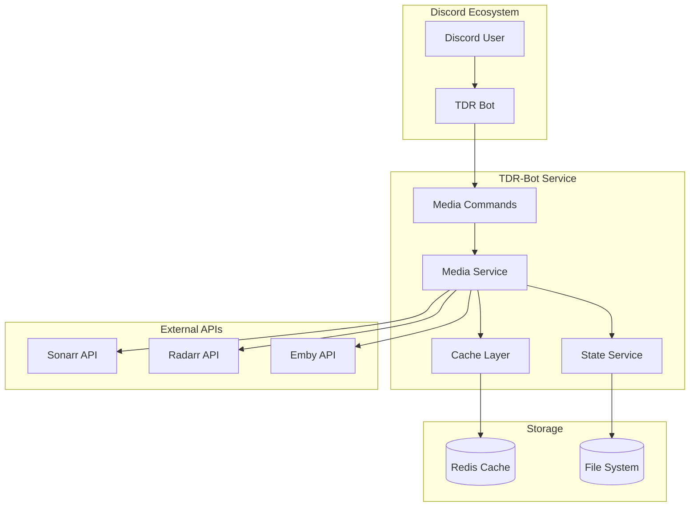
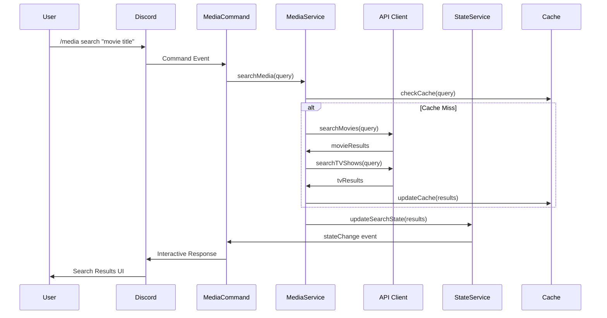
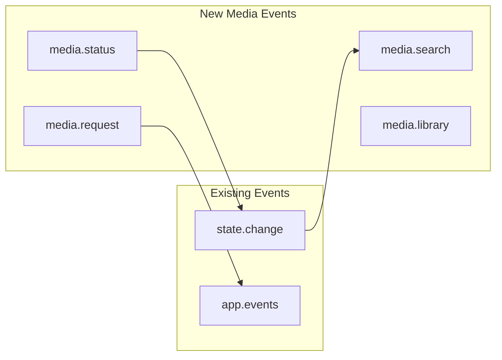
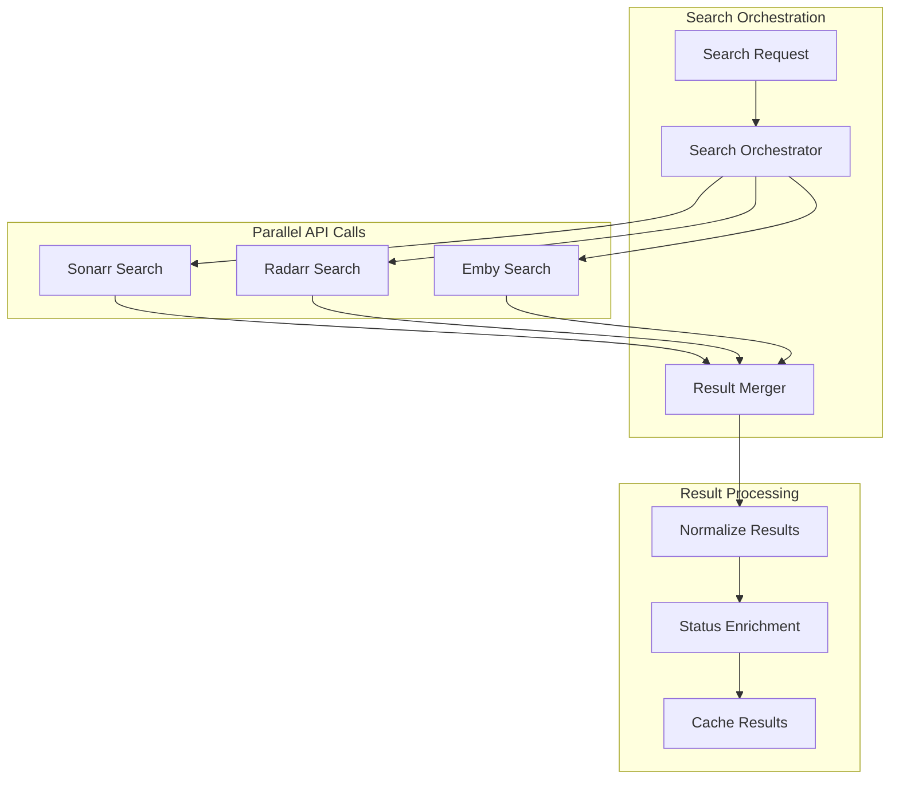
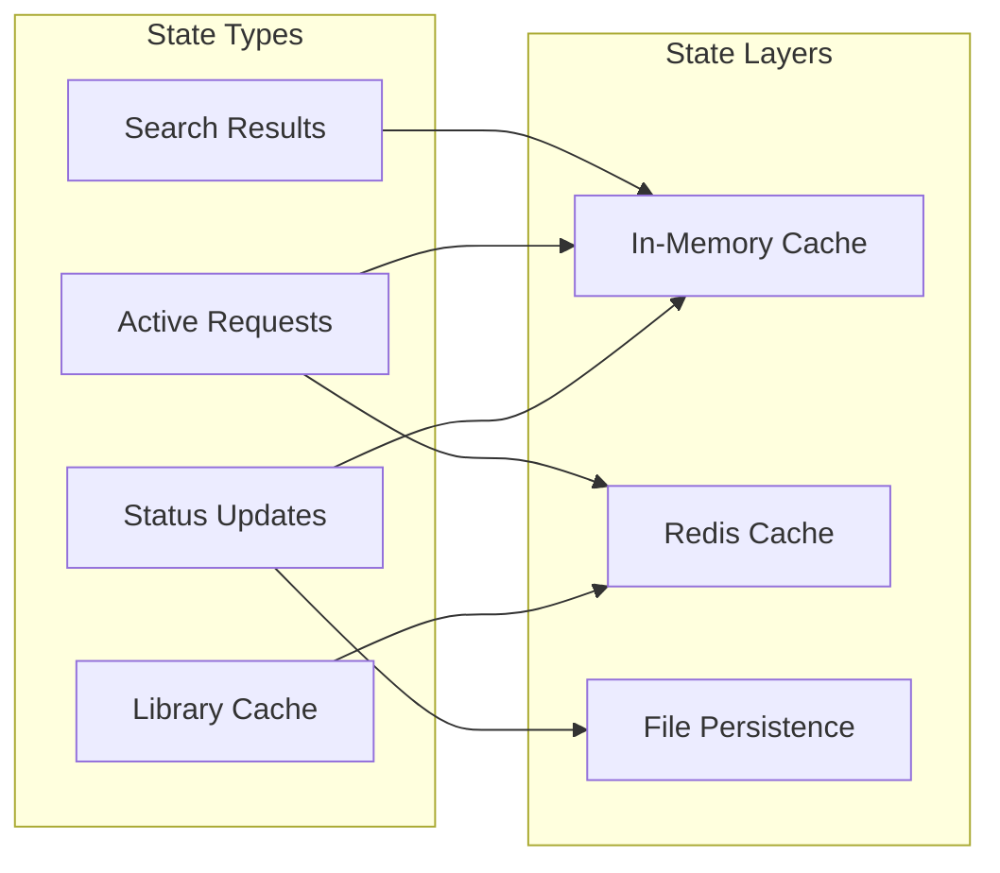
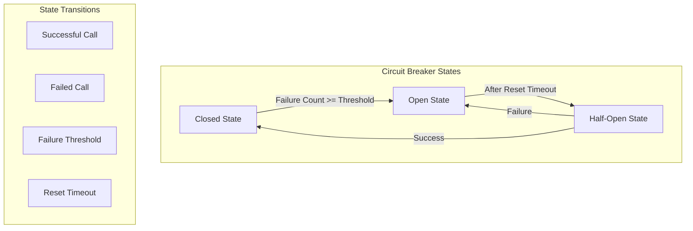
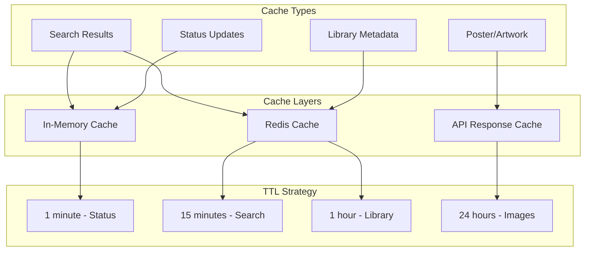

# Technical Design Document: Discord Media Management Feature

## Table of Contents

1. [Executive Summary](#1-executive-summary)
2. [Architecture Overview](#2-architecture-overview)
3. [System Integration](#3-system-integration)
4. [Service Architecture](#4-service-architecture)
5. [API Layer Design](#5-api-layer-design)
6. [Discord Command System](#6-discord-command-system)
7. [State Management](#7-state-management)
8. [Error Handling & Resilience](#8-error-handling--resilience)
9. [Data Models & Schemas](#9-data-models--schemas)
10. [Frontend Integration](#10-frontend-integration)
11. [Security & Validation](#11-security--validation)
12. [Performance & Caching](#12-performance--caching)
13. [Testing Strategy](#13-testing-strategy)
14. [Deployment Architecture](#14-deployment-architecture)
15. [Implementation Plan](#15-implementation-plan)

## 1. Executive Summary

This technical design document defines the implementation architecture for the Discord Media Management feature within the existing tdr-bot service. The design leverages established patterns from the current NestJS + Next.js hybrid architecture, incorporating sophisticated LangChain/LLM integration, Necord-based Discord commands, and event-driven state management.

### Key Design Principles
- **Integration-First**: Seamless integration with existing tdr-bot architecture
- **Event-Driven**: Leverage existing EventEmitter2 infrastructure
- **Resilient**: Apply existing retry mechanisms and error classification
- **Testable**: Follow established Jest testing patterns
- **Scalable**: Design for future feature expansion

### Technical Stack Integration
- **Backend**: NestJS with dependency injection integration
- **Commands**: Necord-based Discord slash commands
- **State**: Event-driven state management with StateService
- **API**: Axios-based clients with retry/circuit breaker patterns
- **Frontend**: Next.js with Material-UI and Jotai state management
- **Testing**: Jest with comprehensive mocking utilities

## 2. Architecture Overview

### System Context Diagram



### Component Interaction Flow



## 3. System Integration

### Module Integration Architecture

The media feature integrates into the existing tdr-bot module structure:

```typescript
// New MediaModule integration
@Module({
  imports: [
    StateModule,        // Existing state management
    ServicesModule,     // Existing service infrastructure
    MessageHandlerModule, // LLM integration capability
  ],
  providers: [
    MediaService,
    MediaCommandService,
    SonarrApiClient,
    RadarrApiClient,
    EmbyApiClient,
    MediaStateService,
  ],
  exports: [MediaService],
})
export class MediaModule {}
```

### Dependency Injection Integration

```typescript
// Integration with existing app.module.ts patterns
@Module({
  imports: [
    // ... existing imports
    MediaModule,         // New media module
  ],
  // ... existing configuration
})
export class AppModule {}
```

### Event System Integration



## 4. Service Architecture

### Core Service Design

```typescript
// MediaService - Central orchestration service
@Injectable()
export class MediaService {
  constructor(
    private readonly sonarrClient: SonarrApiClient,
    private readonly radarrClient: RadarrApiClient,
    private readonly embyClient: EmbyApiClient,
    private readonly mediaStateService: MediaStateService,
    private readonly retryService: RetryService,
    private readonly eventEmitter: EventEmitter2,
    private readonly logger: Logger,
  ) {}

  // Unified search across all media types
  async searchMedia(query: string): Promise<MediaSearchResult[]>
  
  // Request management with duplicate detection
  async requestMedia(request: MediaRequest): Promise<RequestResult>
  
  // Library browsing with filtering
  async browseLibrary(filters: LibraryFilters): Promise<LibraryResult[]>
  
  // Status tracking with real-time updates
  async getMediaStatus(mediaId: string): Promise<MediaStatus>
  
  // Link generation for sharing
  async generateShareLink(mediaId: string): Promise<string>
}
```

### API Client Architecture

Following existing patterns from the tdr-bot codebase:

```typescript
// Base API client with retry/circuit breaker integration
export abstract class BaseMediaApiClient {
  constructor(
    protected readonly retryService: RetryService,
    protected readonly errorClassifier: ErrorClassificationService,
    protected readonly logger: Logger,
  ) {}
  
  // Template method for API calls with retry
  protected async apiCall<T>(
    operation: () => Promise<T>,
    operationName: string,
    errorCategory: ErrorCategory = ErrorCategory.EXTERNAL_API,
  ): Promise<T> {
    return this.retryService.executeWithRetry(
      operation,
      this.getRetryConfig(),
      operationName,
      errorCategory,
    );
  }
  
  // Circuit breaker for external APIs
  protected async apiCallWithCircuitBreaker<T>(
    operation: () => Promise<T>,
    circuitKey: string,
    operationName: string,
  ): Promise<T> {
    return this.retryService.executeWithCircuitBreaker(
      operation,
      circuitKey,
      this.getRetryConfig(),
      operationName,
      ErrorCategory.EXTERNAL_API,
    );
  }
}
```

### Specialized API Clients

```typescript
// Sonarr API Client
@Injectable()
export class SonarrApiClient extends BaseMediaApiClient {
  async searchSeries(query: string): Promise<SonarrSeries[]>
  async addSeries(series: SonarrSeries): Promise<void>
  async getSeriesStatus(seriesId: number): Promise<SeriesStatus>
  async deleteSeries(seriesId: number): Promise<void>
}

// Radarr API Client  
@Injectable()
export class RadarrApiClient extends BaseMediaApiClient {
  async searchMovies(query: string): Promise<RadarrMovie[]>
  async addMovie(movie: RadarrMovie): Promise<void>
  async getMovieStatus(movieId: number): Promise<MovieStatus>
  async deleteMovie(movieId: number): Promise<void>
}

// Emby API Client
@Injectable() 
export class EmbyApiClient extends BaseMediaApiClient {
  async searchLibrary(query?: string): Promise<EmbyItem[]>
  async getItemInfo(itemId: string): Promise<EmbyItemDetails>
  async generatePlaybackUrl(itemId: string): Promise<string>
}
```

## 5. API Layer Design

### Unified Search Architecture



### API Response Normalization

```typescript
// Unified media item interface
export interface MediaItem {
  id: string;
  type: MediaType;
  title: string;
  year?: number;
  overview?: string;
  posterUrl?: string;
  status: MediaStatus;
  source: MediaSource;
  
  // Type-specific fields
  movieData?: RadarrMovie;
  seriesData?: SonarrSeries;
  embyData?: EmbyItem;
}

// Status enrichment service
@Injectable()
export class MediaStatusService {
  async enrichWithStatus(items: MediaItem[]): Promise<MediaItem[]> {
    // Parallel status checks with circuit breaker
    return Promise.all(
      items.map(item => this.checkItemStatus(item))
    );
  }
  
  private async checkItemStatus(item: MediaItem): Promise<MediaItem> {
    // Implement status checking logic
  }
}
```

### Request Management System

```typescript
// Request deduplication and validation
@Injectable()
export class MediaRequestService {
  async processRequest(request: MediaRequest): Promise<RequestResult> {
    // 1. Validate request format
    await this.validateRequest(request);
    
    // 2. Check for duplicates
    const isDuplicate = await this.checkDuplicate(request);
    if (isDuplicate) {
      return { success: false, reason: 'DUPLICATE_REQUEST' };
    }
    
    // 3. Submit to appropriate service
    const result = await this.submitRequest(request);
    
    // 4. Track request in state
    await this.mediaStateService.trackRequest(request, result);
    
    return result;
  }
}
```

## 6. Discord Command System

### Command Architecture

Following established Necord patterns from the existing tdr-bot:

```typescript
@Injectable()
export class MediaCommandService {
  constructor(
    private readonly mediaService: MediaService,
    private readonly logger: Logger,
  ) {}

  @SlashCommand({
    name: 'media',
    description: 'Media management commands',
  })
  async onMediaCommand(
    @Context() [interaction]: SlashCommandContext,
    @Options() options: MediaCommandOptions,
  ) {
    // Delegate to specific handler based on subcommand
    switch (options.subcommand) {
      case 'search':
        return this.handleSearch(interaction, options);
      case 'request':
        return this.handleRequest(interaction, options);
      case 'library':
        return this.handleLibrary(interaction, options);
      case 'status':
        return this.handleStatus(interaction, options);
      case 'link':
        return this.handleLink(interaction, options);
    }
  }
}
```

### Interactive Component System

```typescript
// Search results with interactive components
private async handleSearch(
  interaction: SlashCommandInteraction,
  options: SearchOptions,
): Promise<void> {
  const results = await this.mediaService.searchMedia(options.query);
  
  const embed = this.buildSearchEmbed(results);
  const components = this.buildSearchComponents(results);
  
  await interaction.reply({
    embeds: [embed],
    components,
    ephemeral: true,
  });
}

// Component interaction handlers
@Component('media_select')
async onMediaSelect(@ComponentContext() [interaction]: ComponentContext) {
  const selectedMedia = interaction.values[0];
  const mediaItem = await this.mediaService.getMediaItem(selectedMedia);
  
  // Build contextual action buttons based on status
  const actionRow = this.buildActionButtons(mediaItem);
  
  await interaction.update({
    embeds: [this.buildMediaDetailsEmbed(mediaItem)],
    components: [actionRow],
  });
}
```

### Modal Integration for Requests

```typescript
// Request confirmation modal
@Modal('media_request_modal')
async onRequestModal(@ModalContext() [interaction]: ModalContext) {
  const formData = this.extractModalData(interaction);
  
  try {
    const result = await this.mediaService.requestMedia(formData);
    await interaction.reply({
      content: this.formatRequestResponse(result),
      ephemeral: true,
    });
  } catch (error) {
    await this.handleRequestError(interaction, error);
  }
}
```

### Discord UI Components

```mermaid
graph TD
    subgraph "Search Flow"
        SearchCmd[/media search]
        SearchResults[Search Results Embed]
        MediaSelect[Media Dropdown]
        MediaDetails[Details Embed]
        ActionBtns[Action Buttons]
    end
    
    subgraph "Request Flow"
        RequestBtn[Request Button]
        RequestModal[Request Modal]
        Confirmation[Confirmation]
    end
    
    SearchCmd --> SearchResults
    SearchResults --> MediaSelect
    MediaSelect --> MediaDetails
    MediaDetails --> ActionBtns
    ActionBtns --> RequestBtn
    RequestBtn --> RequestModal
    RequestModal --> Confirmation
```

## 7. State Management

### Integration with Existing StateService

```typescript
// Extend existing state interface
export interface MediaState {
  currentSearch?: MediaSearchResult[];
  activeRequests: Map<string, MediaRequest>;
  libraryCache: Map<string, MediaItem[]>;
  statusUpdates: Map<string, MediaStatus>;
}

// MediaStateService integration
@Injectable()
export class MediaStateService {
  constructor(
    private readonly stateService: StateService,
    private readonly eventEmitter: EventEmitter2,
  ) {}
  
  async updateSearchResults(results: MediaSearchResult[]): Promise<void> {
    const currentState = this.stateService.getState();
    
    this.stateService.setState({
      ...currentState,
      mediaState: {
        ...currentState.mediaState,
        currentSearch: results,
      },
    });
    
    this.eventEmitter.emit('media.search.updated', results);
  }
}
```

### Event-Driven Updates

```typescript
// Real-time status updates
@Injectable()
export class MediaStatusTracker {
  constructor(
    private readonly eventEmitter: EventEmitter2,
    private readonly mediaStateService: MediaStateService,
  ) {}
  
  @OnEvent('media.request.created')
  async handleNewRequest(request: MediaRequest): Promise<void> {
    // Start background status monitoring
    this.startStatusMonitoring(request.id);
  }
  
  @OnEvent('media.status.changed')
  async handleStatusChange(statusUpdate: MediaStatusUpdate): Promise<void> {
    // Update cached status
    await this.mediaStateService.updateStatus(statusUpdate);
    
    // Notify interested components
    this.eventEmitter.emit(`media.status.${statusUpdate.mediaId}`, statusUpdate);
  }
}
```

### State Persistence Strategy



## 8. Error Handling & Resilience

### Integration with Existing Error Infrastructure

The media feature leverages the existing sophisticated error handling system:

```typescript
// Media-specific error classifications
export class MediaErrorClassifier extends ErrorClassificationService {
  classifyMediaError(error: Error, operation: string): ErrorClassification {
    // API-specific error patterns
    if (this.isSonarrError(error)) {
      return this.classifySonarrError(error);
    }
    
    if (this.isRadarrError(error)) {
      return this.classifyRadarrError(error);
    }
    
    if (this.isEmbyError(error)) {
      return this.classifyEmbyError(error);
    }
    
    // Fallback to base classification
    return super.classifyError(error, ErrorCategory.EXTERNAL_API);
  }
}
```

### API-Specific Retry Strategies

```typescript
// Tailored retry configurations for each API
@Injectable()
export class MediaRetryConfigService {
  getSonarrRetryConfig(): Partial<RetryConfig> {
    return {
      maxAttempts: 3,
      baseDelay: 2000,
      maxDelay: 30000,
      backoffFactor: 2,
      logErrorDetails: true,
    };
  }
  
  getRadarrRetryConfig(): Partial<RetryConfig> {
    return {
      maxAttempts: 3,
      baseDelay: 1500,
      maxDelay: 20000,
      backoffFactor: 1.8,
    };
  }
  
  getEmbyRetryConfig(): Partial<RetryConfig> {
    return {
      maxAttempts: 5,
      baseDelay: 500,
      maxDelay: 10000,
      backoffFactor: 1.5,
    };
  }
}
```

### Circuit Breaker Implementation



### Graceful Degradation Patterns

```typescript
// Fallback strategies for API failures
@Injectable()
export class MediaFallbackService {
  async searchWithFallback(query: string): Promise<MediaSearchResult[]> {
    const results: MediaSearchResult[] = [];
    
    // Try Radarr first (movies)
    try {
      const movies = await this.radarrClient.searchMovies(query);
      results.push(...movies);
    } catch (error) {
      this.logger.warn('Radarr search failed, continuing with other sources', error);
    }
    
    // Try Sonarr (TV shows)  
    try {
      const shows = await this.sonarrClient.searchSeries(query);
      results.push(...shows);
    } catch (error) {
      this.logger.warn('Sonarr search failed, continuing with other sources', error);
    }
    
    // If all external APIs fail, search local library
    if (results.length === 0) {
      return this.searchLocalLibrary(query);
    }
    
    return results;
  }
}
```

## 9. Data Models & Schemas

### Core Data Models

```typescript
// Base media interfaces
export interface MediaItem {
  readonly id: string;
  readonly type: MediaType;
  readonly title: string;
  readonly year?: number;
  readonly overview?: string;
  readonly posterUrl?: string;
  readonly backdropUrl?: string;
  readonly genres: string[];
  readonly rating?: number;
  readonly runtime?: number;
  status: MediaStatus;
  source: MediaSource;
  createdAt: Date;
  updatedAt: Date;
}

export interface MovieItem extends MediaItem {
  type: MediaType.MOVIE;
  tmdbId: number;
  imdbId?: string;
  quality?: QualityProfile;
  sizeOnDisk?: number;
  monitored: boolean;
}

export interface SeriesItem extends MediaItem {
  type: MediaType.SERIES;
  tvdbId: number;
  seasons: Season[];
  totalEpisodes: number;
  availableEpisodes: number;
  monitored: boolean;
}

export interface Season {
  seasonNumber: number;
  episodeCount: number;
  availableEpisodes: number;
  monitored: boolean;
  statistics: SeasonStatistics;
}
```

### Request Models

```typescript
// Request structures with validation
export interface MediaRequest {
  readonly id: string;
  readonly mediaId: string;
  readonly mediaType: MediaType;
  readonly userId: string;
  readonly guildId: string;
  readonly channelId: string;
  
  // Request-specific data
  quality?: QualityProfile;
  rootFolder?: string;
  tags: string[];
  
  // TV-specific fields
  seasons?: SeasonRequest[];
  episodes?: EpisodeRequest[];
  
  // Metadata
  requestedAt: Date;
  status: RequestStatus;
  priority: RequestPriority;
}

// Season/episode request specifications
export interface SeasonRequest {
  seasonNumber: number;
  monitored: boolean;
}

export interface EpisodeRequest {
  seasonNumber: number;
  episodeNumber: number;
}
```

### Status Tracking Models

```typescript
// Comprehensive status tracking
export interface MediaStatus {
  readonly mediaId: string;
  readonly type: MediaType;
  
  // Current state
  status: MediaStatusType;
  progress: number; // 0-100
  
  // Download information
  downloadId?: string;
  downloadClient?: string;
  downloadProgress?: DownloadProgress;
  
  // Queue information
  queuePosition?: number;
  estimatedCompletion?: Date;
  
  // Error information
  errors: StatusError[];
  warnings: StatusWarning[];
  
  // Timestamps
  lastUpdated: Date;
  completedAt?: Date;
}

export interface DownloadProgress {
  totalSize: number;
  downloadedSize: number;
  downloadRate: number; // bytes per second
  timeRemaining?: number; // seconds
  seeders?: number;
  leechers?: number;
}
```

### Library Models

```typescript
// Library browsing and management
export interface LibraryItem {
  readonly id: string;
  readonly mediaItem: MediaItem;
  
  // File information
  files: MediaFile[];
  totalSize: number;
  
  // Playback information  
  embyId?: string;
  playbackUrl?: string;
  lastWatched?: Date;
  playCount: number;
  
  // Organization
  collections: string[];
  tags: string[];
}

export interface MediaFile {
  readonly path: string;
  readonly size: number;
  readonly quality: string;
  readonly codec: string;
  readonly resolution: string;
  readonly audioChannels: string;
  readonly languages: string[];
}
```

## 10. Frontend Integration

### Next.js Page Integration

The media feature extends the existing Next.js application structure:

```typescript
// app/media/page.tsx - Main media management page
export default function MediaPage() {
  return (
    <Layout>
      <MediaDashboard />
    </Layout>
  );
}

// app/media/search/page.tsx - Search interface
export default function MediaSearchPage() {
  return (
    <Layout>
      <SearchInterface />
      <SearchResults />
    </Layout>
  );
}
```

### Component Architecture

Following existing Material-UI patterns:

```typescript
// MediaDashboard component structure
export function MediaDashboard() {
  const [searchQuery, setSearchQuery] = useAtom(searchQueryAtom);
  const [searchResults, setSearchResults] = useAtom(searchResultsAtom);
  const [activeRequests] = useAtom(activeRequestsAtom);
  
  return (
    <Box sx={{ p: 3 }}>
      <Typography variant="h4" gutterBottom>
        Media Management
      </Typography>
      
      <SearchBar 
        query={searchQuery}
        onQueryChange={setSearchQuery}
        onSearch={handleSearch}
      />
      
      <Grid container spacing={3}>
        <Grid item xs={12} md={8}>
          <SearchResultsPanel results={searchResults} />
        </Grid>
        
        <Grid item xs={12} md={4}>
          <ActiveRequestsPanel requests={activeRequests} />
        </Grid>
      </Grid>
    </Box>
  );
}
```

### State Management Integration

Extending existing Jotai atom patterns:

```typescript
// atoms/media.ts - Media-specific state atoms
export const searchQueryAtom = atom<string>('');

export const searchResultsAtom = atom<MediaSearchResult[]>([]);

export const activeRequestsAtom = atom<MediaRequest[]>([]);

export const libraryItemsAtom = atom<LibraryItem[]>([]);

// Derived atoms
export const filteredResultsAtom = atom((get) => {
  const results = get(searchResultsAtom);
  const query = get(searchQueryAtom);
  
  if (!query.trim()) return results;
  
  return results.filter(item => 
    item.title.toLowerCase().includes(query.toLowerCase())
  );
});

// Async atoms for API integration
export const searchMediaAtom = atom(
  null,
  async (get, set, query: string) => {
    set(loadingAtom, true);
    try {
      const apiClient = ApiClient.getInstance();
      const results = await apiClient.searchMedia(query);
      set(searchResultsAtom, results);
    } catch (error) {
      set(errorAtom, error);
    } finally {
      set(loadingAtom, false);
    }
  }
);
```

### Real-time Updates Integration

```typescript
// useMediaUpdates hook for real-time status
export function useMediaUpdates() {
  const setActiveRequests = useSetAtom(activeRequestsAtom);
  const setSearchResults = useSetAtom(searchResultsAtom);
  
  useEffect(() => {
    const eventSource = new EventSource('/api/media/events');
    
    eventSource.onmessage = (event) => {
      const update = JSON.parse(event.data);
      
      switch (update.type) {
        case 'REQUEST_STATUS_UPDATE':
          updateRequestStatus(update.data);
          break;
        case 'SEARCH_CACHE_UPDATE':
          updateSearchCache(update.data);
          break;
        case 'LIBRARY_UPDATE':
          updateLibraryCache(update.data);
          break;
      }
    };
    
    return () => eventSource.close();
  }, []);
}
```

## 11. Security & Validation

### Input Validation Schemas

Following established Zod validation patterns:

```typescript
// Media command validation schemas
export const SearchCommandSchema = z.object({
  query: z.string()
    .min(1, 'Search query cannot be empty')
    .max(100, 'Search query too long')
    .regex(/^[a-zA-Z0-9\s\-\.\(\)]+$/, 'Invalid characters in search query'),
});

export const RequestCommandSchema = z.object({
  mediaId: z.string().uuid('Invalid media ID format'),
  quality: z.enum(['SD', 'HD', '4K']).optional(),
  rootFolder: z.string().optional(),
  seasons: z.array(z.number().int().min(1)).optional(),
  episodes: z.array(z.object({
    season: z.number().int().min(1),
    episode: z.number().int().min(1),
  })).optional(),
});

export const LibraryCommandSchema = z.object({
  query: z.string().max(50).optional(),
  type: z.enum(['movie', 'series', 'all']).default('all'),
  sortBy: z.enum(['title', 'date', 'rating']).default('title'),
  order: z.enum(['asc', 'desc']).default('asc'),
});
```

### Permission System Integration

```typescript
// Permission validation service
@Injectable()
export class MediaPermissionService {
  constructor(
    private readonly logger: Logger,
  ) {}
  
  async validateUserPermissions(
    userId: string,
    guildId: string,
    action: MediaAction,
  ): Promise<boolean> {
    // Check user permissions for media actions
    switch (action) {
      case MediaAction.SEARCH:
        return this.canSearch(userId, guildId);
      case MediaAction.REQUEST:
        return this.canRequest(userId, guildId);
      case MediaAction.DELETE:
        return this.canDelete(userId, guildId);
      default:
        return false;
    }
  }
  
  private async canRequest(userId: string, guildId: string): Promise<boolean> {
    // Implement request permission logic
    // Could check user roles, request limits, etc.
    return true; // Placeholder
  }
}
```

### Rate Limiting Strategy

```typescript
// Media-specific rate limiting
@Injectable() 
export class MediaRateLimitService {
  private readonly requestLimits = new Map<string, RequestCounter>();
  
  async checkRateLimit(
    userId: string,
    action: MediaAction,
  ): Promise<boolean> {
    const key = `${userId}:${action}`;
    const counter = this.requestLimits.get(key) ?? this.createCounter();
    
    const limits = this.getActionLimits(action);
    
    if (counter.requests >= limits.maxRequests) {
      const timeSinceReset = Date.now() - counter.resetTime;
      if (timeSinceReset < limits.windowMs) {
        return false; // Rate limit exceeded
      }
      
      // Reset counter
      counter.requests = 0;
      counter.resetTime = Date.now();
    }
    
    counter.requests++;
    this.requestLimits.set(key, counter);
    
    return true;
  }
}
```

## 12. Performance & Caching

### Multi-Layer Caching Strategy



### Caching Implementation

```typescript
// Multi-layer cache service
@Injectable()
export class MediaCacheService {
  constructor(
    private readonly redisClient: Redis,
    private readonly logger: Logger,
  ) {}
  
  private memoryCache = new Map<string, CacheEntry>();
  
  async get<T>(key: string, type: CacheType): Promise<T | null> {
    // Try memory cache first (fastest)
    const memoryEntry = this.memoryCache.get(key);
    if (memoryEntry && !this.isExpired(memoryEntry, type)) {
      return memoryEntry.data as T;
    }
    
    // Try Redis cache (persistent)
    const redisEntry = await this.redisClient.get(key);
    if (redisEntry) {
      const data = JSON.parse(redisEntry) as T;
      
      // Populate memory cache
      this.memoryCache.set(key, {
        data,
        timestamp: Date.now(),
      });
      
      return data;
    }
    
    return null;
  }
  
  async set<T>(key: string, data: T, type: CacheType): Promise<void> {
    const entry: CacheEntry = {
      data,
      timestamp: Date.now(),
    };
    
    // Set in memory cache
    this.memoryCache.set(key, entry);
    
    // Set in Redis with TTL
    const ttl = this.getTTL(type);
    await this.redisClient.setex(key, ttl, JSON.stringify(data));
  }
}
```

### Background Processing

```typescript
// Background status monitoring
@Injectable()
export class MediaBackgroundService {
  private readonly activeMonitors = new Map<string, NodeJS.Timer>();
  
  @Cron('0 */5 * * * *') // Every 5 minutes
  async updateMediaStatuses(): Promise<void> {
    const activeRequests = await this.getActiveRequests();
    
    // Process in batches to avoid overwhelming APIs
    const batches = this.chunkArray(activeRequests, 10);
    
    for (const batch of batches) {
      await Promise.all(
        batch.map(request => this.updateRequestStatus(request))
      );
      
      // Brief pause between batches
      await this.delay(1000);
    }
  }
  
  startMonitoring(requestId: string): void {
    if (this.activeMonitors.has(requestId)) {
      return; // Already monitoring
    }
    
    const timer = setInterval(async () => {
      const status = await this.checkRequestStatus(requestId);
      
      if (status.isComplete || status.hasError) {
        this.stopMonitoring(requestId);
      }
      
      this.eventEmitter.emit('media.status.updated', status);
    }, 30000); // Check every 30 seconds
    
    this.activeMonitors.set(requestId, timer);
  }
}
```

## 13. Testing Strategy

### Test Architecture

Following existing Jest patterns from the tdr-bot codebase:

```typescript
// MediaService comprehensive test suite
describe('MediaService', () => {
  let service: MediaService;
  let sonarrClient: jest.Mocked<SonarrApiClient>;
  let radarrClient: jest.Mocked<RadarrApiClient>;
  let embyClient: jest.Mocked<EmbyApiClient>;
  let retryService: jest.Mocked<RetryService>;
  
  beforeEach(async () => {
    const module = await createTestingModule([
      MediaService,
      {
        provide: SonarrApiClient,
        useValue: createMockSonarrClient(),
      },
      {
        provide: RadarrApiClient,
        useValue: createMockRadarrClient(),
      },
      {
        provide: EmbyApiClient,
        useValue: createMockEmbyClient(),
      },
      {
        provide: RetryService,
        useValue: createMockRetryService(),
      },
    ]);
    
    service = module.get<MediaService>(MediaService);
    sonarrClient = module.get(SonarrApiClient);
    radarrClient = module.get(RadarrApiClient);
    embyClient = module.get(EmbyClient);
    retryService = module.get(RetryService);
  });
  
  describe('searchMedia', () => {
    it('should merge results from all APIs', async () => {
      // Arrange
      const query = 'test movie';
      const movieResults = [createMockMovie({ title: 'Test Movie' })];
      const seriesResults = [createMockSeries({ title: 'Test Series' })];
      
      radarrClient.searchMovies.mockResolvedValue(movieResults);
      sonarrClient.searchSeries.mockResolvedValue(seriesResults);
      
      // Act
      const results = await service.searchMedia(query);
      
      // Assert
      expect(results).toHaveLength(2);
      expect(results[0].title).toBe('Test Movie');
      expect(results[1].title).toBe('Test Series');
    });
    
    it('should handle API failures gracefully', async () => {
      // Test resilience patterns
    });
  });
});
```

### Mock Factories

```typescript
// Media-specific mock factories
export function createMockSonarrClient(): jest.Mocked<SonarrApiClient> {
  return {
    searchSeries: jest.fn(),
    addSeries: jest.fn(),
    getSeriesStatus: jest.fn(),
    deleteSeries: jest.fn(),
  } as jest.Mocked<SonarrApiClient>;
}

export function createMockMediaItem(
  overrides: Partial<MediaItem> = {}
): MediaItem {
  return {
    id: '123-456-789',
    type: MediaType.MOVIE,
    title: 'Test Movie',
    year: 2023,
    overview: 'Test movie description',
    posterUrl: 'https://example.com/poster.jpg',
    genres: ['Action', 'Drama'],
    rating: 8.5,
    runtime: 120,
    status: MediaStatus.AVAILABLE,
    source: MediaSource.RADARR,
    createdAt: new Date(),
    updatedAt: new Date(),
    ...overrides,
  };
}
```

### Integration Tests

```typescript
// Integration tests for Discord commands
describe('MediaCommandService Integration', () => {
  let app: NestApplication;
  let commandService: MediaCommandService;
  let mediaService: MediaService;
  
  beforeAll(async () => {
    const module = await Test.createTestingModule({
      imports: [MediaModule],
    })
    .overrideProvider(SonarrApiClient)
    .useValue(createMockSonarrClient())
    .compile();
    
    app = module.createNestApplication();
    await app.init();
    
    commandService = module.get<MediaCommandService>(MediaCommandService);
    mediaService = module.get<MediaService>(MediaService);
  });
  
  describe('/media search command', () => {
    it('should return formatted search results', async () => {
      // Test full command flow
    });
  });
});
```

### Performance Tests

```typescript
// Load testing for concurrent operations
describe('MediaService Performance', () => {
  it('should handle concurrent search requests', async () => {
    const promises = Array.from({ length: 100 }, (_, i) => 
      service.searchMedia(`test query ${i}`)
    );
    
    const results = await Promise.all(promises);
    
    expect(results).toHaveLength(100);
    // Verify no failures occurred
    results.forEach(result => expect(result).toBeDefined());
  });
});
```

## 14. Deployment Architecture

### Docker Integration

The media feature integrates with existing Docker infrastructure:

```dockerfile
# Extends existing tdr-bot Dockerfile
FROM lilnas-node-runtime

# Copy media-specific assets
COPY packages/tdr-bot/src/media ./src/media

# Environment variables for media APIs
ENV SONARR_URL=""
ENV SONARR_API_KEY=""
ENV RADARR_URL=""
ENV RADARR_API_KEY=""
ENV EMBY_URL=""
ENV EMBY_API_KEY=""

# Health check including media endpoints
HEALTHCHECK --interval=30s --timeout=10s --start-period=60s \
  CMD curl -f http://localhost:8081/health && \
      curl -f http://localhost:8081/media/health
```

### Environment Configuration

```yaml
# docker-compose.dev.yml additions
services:
  tdr-bot:
    environment:
      # Existing environment variables...
      
      # Media API configurations
      SONARR_URL: "http://sonarr:8989"
      SONARR_API_KEY: "${SONARR_API_KEY}"
      RADARR_URL: "http://radarr:7878"
      RADARR_API_KEY: "${RADARR_API_KEY}"
      EMBY_URL: "http://emby:8096"
      EMBY_API_KEY: "${EMBY_API_KEY}"
      
      # Redis configuration for caching
      REDIS_URL: "redis://redis:6379"
      
      # Cache TTL settings
      MEDIA_CACHE_TTL_SEARCH: "900"      # 15 minutes
      MEDIA_CACHE_TTL_STATUS: "60"       # 1 minute
      MEDIA_CACHE_TTL_LIBRARY: "3600"    # 1 hour
      
    depends_on:
      - redis
      - sonarr
      - radarr
      - emby
```

### Monitoring & Observability

```typescript
// Health check endpoints
@Controller('media/health')
export class MediaHealthController {
  constructor(
    private readonly sonarrClient: SonarrApiClient,
    private readonly radarrClient: RadarrApiClient,
    private readonly embyClient: EmbyApiClient,
  ) {}
  
  @Get()
  async checkHealth(): Promise<HealthStatus> {
    const checks = await Promise.allSettled([
      this.checkSonarrHealth(),
      this.checkRadarrHealth(),
      this.checkEmbyHealth(),
    ]);
    
    const results = checks.map((result, index) => ({
      service: ['sonarr', 'radarr', 'emby'][index],
      status: result.status === 'fulfilled' ? 'healthy' : 'unhealthy',
      error: result.status === 'rejected' ? result.reason : null,
    }));
    
    return {
      status: results.every(r => r.status === 'healthy') ? 'healthy' : 'degraded',
      services: results,
      timestamp: new Date().toISOString(),
    };
  }
}
```

## 15. Implementation Plan

### Phase 1: Core Infrastructure (Week 1-2)

**Sprint 1.1: Foundation Setup**
- [ ] Create MediaModule and integrate with app.module.ts
- [ ] Implement base API client classes with retry/circuit breaker
- [ ] Set up media-specific error classification
- [ ] Create core data models and TypeScript interfaces
- [ ] Establish testing infrastructure with mock factories

**Sprint 1.2: Basic API Integration**
- [ ] Implement SonarrApiClient with search functionality
- [ ] Implement RadarrApiClient with search functionality 
- [ ] Implement EmbyApiClient with library browsing
- [ ] Create MediaService with unified search capability
- [ ] Add basic caching layer with Redis integration

### Phase 2: Discord Commands (Week 3-4)

**Sprint 2.1: Search Command**
- [ ] Implement MediaCommandService with /media search
- [ ] Create interactive search results with dropdown selection
- [ ] Add media details display with status indicators
- [ ] Implement result pagination and filtering
- [ ] Add comprehensive error handling for command failures

**Sprint 2.2: Request Management**
- [ ] Implement /media request command with modal confirmation
- [ ] Add duplicate request detection
- [ ] Create request validation and quality selection
- [ ] Implement TV show season/episode specification
- [ ] Add request tracking and status updates

### Phase 3: Advanced Features (Week 5-6)

**Sprint 3.1: Library & Status**
- [ ] Implement /media library command with filtering
- [ ] Add library browsing with pagination
- [ ] Create /media status command with progress tracking
- [ ] Implement real-time status updates via events
- [ ] Add /media link command for Emby integration

**Sprint 3.2: Frontend Integration**
- [ ] Create Next.js pages for media management
- [ ] Implement React components with Material-UI
- [ ] Add Jotai atoms for state management
- [ ] Create real-time update system with SSE
- [ ] Add mobile-responsive design

### Phase 4: Polish & Production (Week 7-8)

**Sprint 4.1: Testing & Quality**
- [ ] Complete unit test suite with 90%+ coverage
- [ ] Implement integration tests for all commands
- [ ] Add performance tests for concurrent operations
- [ ] Create end-to-end tests with Discord interaction
- [ ] Set up automated testing in CI/CD pipeline

**Sprint 4.2: Production Readiness**
- [ ] Implement comprehensive logging and monitoring
- [ ] Add metrics collection and alerting
- [ ] Create deployment scripts and documentation
- [ ] Perform load testing and optimization
- [ ] Deploy to production environment

### Acceptance Criteria

**Phase 1 Complete When:**
- [ ] All API clients successfully connect and authenticate
- [ ] Basic search returns merged results from all sources
- [ ] Error handling correctly classifies and retries failures
- [ ] Cache system stores and retrieves data efficiently
- [ ] Test suite achieves >90% coverage for core services

**Phase 2 Complete When:**
- [ ] /media search returns interactive results within 3 seconds
- [ ] Users can select media and see detailed information
- [ ] /media request prevents duplicates and confirms submissions
- [ ] Request status is tracked and reported accurately
- [ ] All Discord interactions handle errors gracefully

**Phase 3 Complete When:**
- [ ] Library browsing supports filtering and pagination
- [ ] Status updates refresh automatically every 30 seconds
- [ ] Emby links generate successfully for available content
- [ ] Frontend provides complete media management interface
- [ ] Real-time updates work across all interfaces

**Phase 4 Complete When:**
- [ ] System handles 100+ concurrent users without degradation
- [ ] All critical paths have comprehensive test coverage
- [ ] Monitoring dashboards show system health metrics
- [ ] Documentation covers all user and admin scenarios
- [ ] Production deployment is stable and performant

### Risk Mitigation

**API Rate Limiting Risk**
- Implement exponential backoff with jitter
- Use circuit breakers to prevent cascade failures
- Cache results to reduce API calls

**External Service Dependencies**
- Implement graceful degradation when services are unavailable
- Provide fallback search using local library
- Queue requests when external services are down

**Discord Rate Limits**
- Batch operations where possible
- Implement request queuing for high-volume periods
- Use ephemeral responses to reduce message load

**Performance Under Load**
- Implement comprehensive caching strategy
- Use background processing for non-critical operations
- Monitor and alert on performance metrics

---

*This technical design document provides the comprehensive blueprint for implementing the Discord Media Management feature while leveraging all existing architectural patterns and infrastructure from the tdr-bot codebase. The design ensures seamless integration, maintains high code quality standards, and provides clear implementation guidance for the development team.*