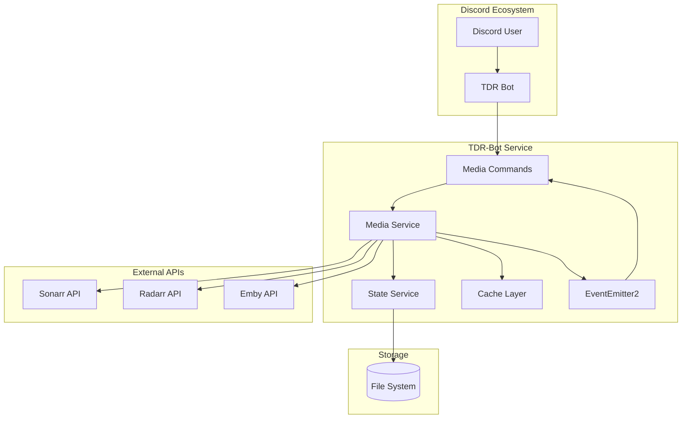
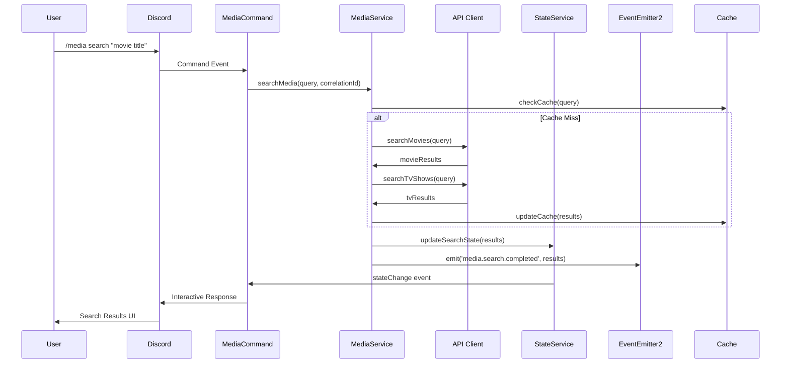
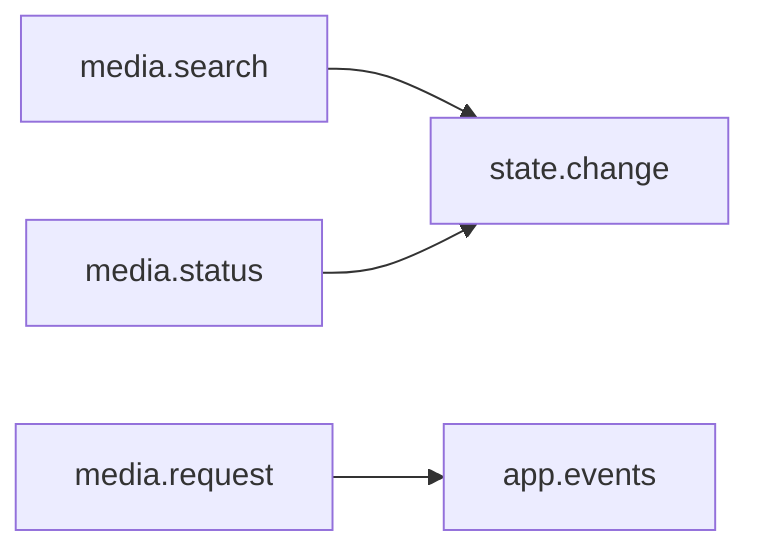
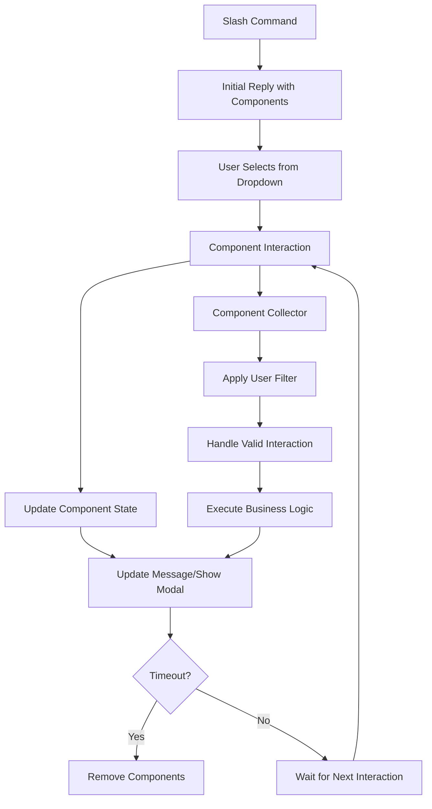
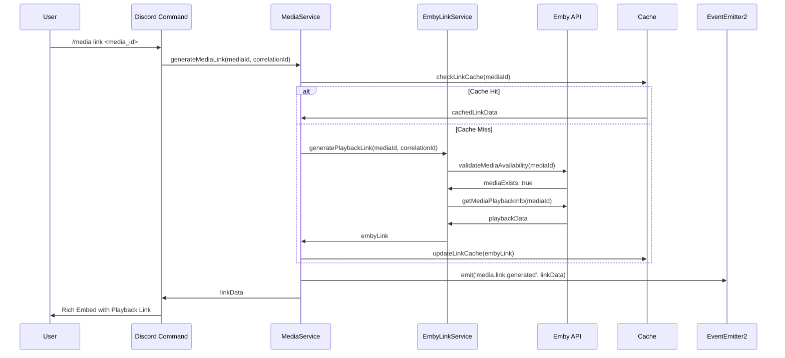
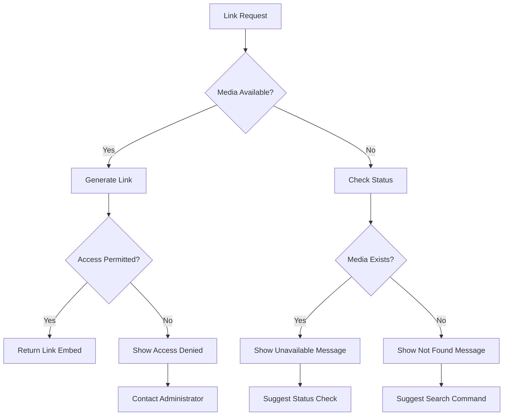
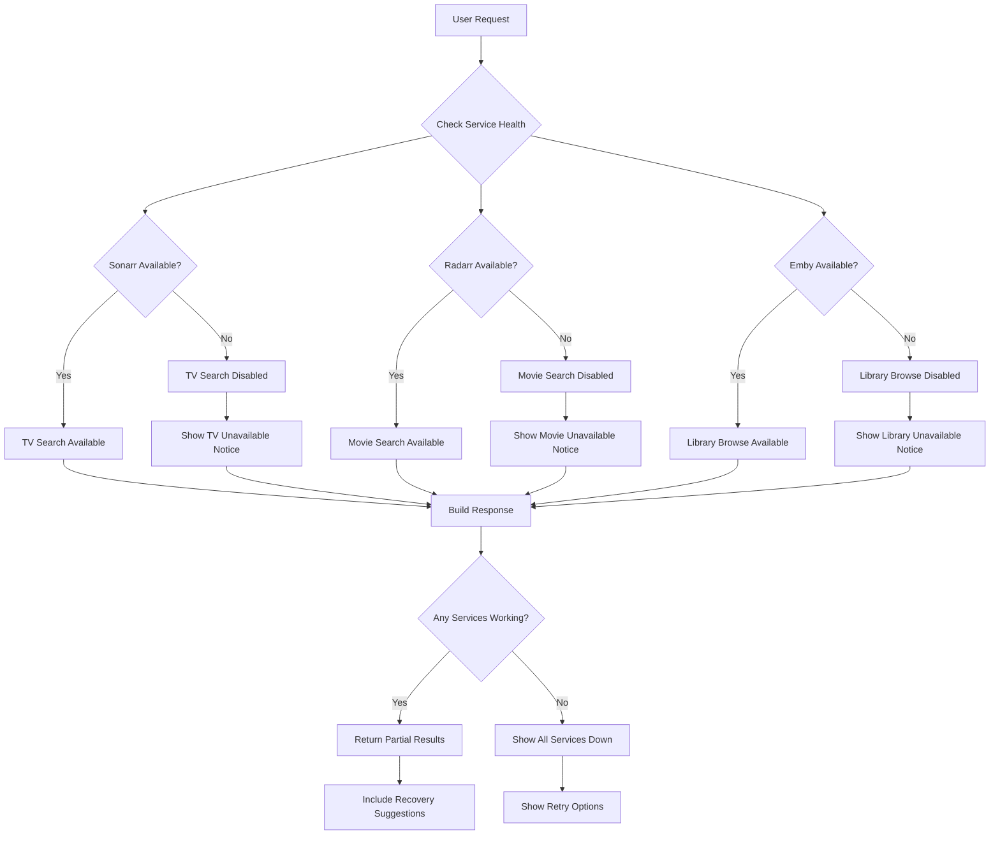
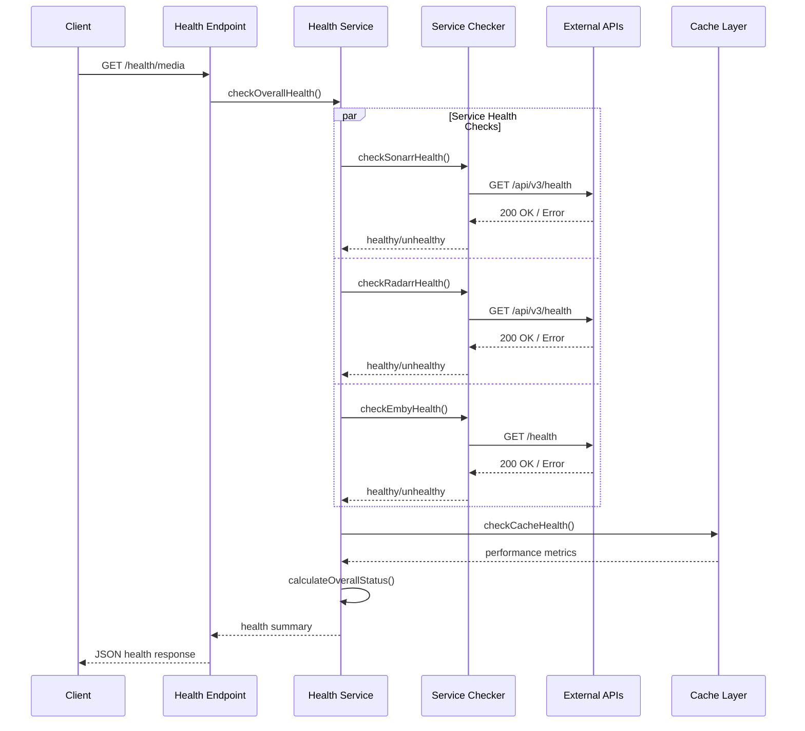

# Technical Design Document: Discord Media Management Feature

## Table of Contents

1. [Executive Summary](#1-executive-summary)
2. [Architecture Overview](#2-architecture-overview)
3. [System Integration](#3-system-integration)
4. [Service Architecture](#4-service-architecture)
5. [Discord Commands & State](#5-discord-commands--state)
   - 5.1. [Discord Component Architecture](#51-discord-component-architecture)
   - 5.2. [Component State Management & Cleanup](#52-component-state-management--cleanup)
   - 5.3. [Media Link Command Implementation](#53-media-link-command-implementation)
6. [Error Handling & Caching](#6-error-handling--caching)
7. [Data Models](#7-data-models)
8. [Security & Validation](#8-security--validation)
   - 8.1. [Enhanced Validation with Zod Schemas](#81-enhanced-validation-with-zod-schemas)
9. [Implementation Roadmap](#9-implementation-roadmap)
10. [Testing Strategy](#10-testing-strategy)
11. [Deployment & Health Monitoring](#11-deployment--health-monitoring)
12. [Logging & Observability](#12-logging--observability)

## 1. Executive Summary

This document defines the Discord Media Management feature implementation for tdr-bot. The feature integrates Sonarr, Radarr, and Emby APIs to provide media search, request, and library browsing through Discord commands.

### Technical Stack

- **Backend**: NestJS with dependency injection
- **Commands**: Necord Discord slash commands with Discord.js v14 components
- **Components**: ActionRowBuilder, StringSelectMenuBuilder, ButtonBuilder, ModalBuilder
- **State**: EventEmitter2-based state management with component collectors
- **API**: Axios clients with retry/circuit breaker patterns
- **Testing**: Jest with comprehensive mocking

### Implementation Approach

- **Homelab-Optimized**: Simplified patterns appropriate for single-server deployment
- **API-First**: Leverages native Sonarr/Radarr queue APIs instead of custom progress tracking
- **Practical Reliability**: 3-attempt retry logic with graceful degradation
- **Focused Scope**: 25-day implementation timeline with essential features

## 2. Architecture Overview

### System Context Diagram



### Component Interaction Flow



## 3. System Integration

### Module Integration

The MediaModule integrates with the existing tdr-bot architecture by importing StateModule for session management, ServicesModule for shared utilities, and MessageHandlerModule for Discord interaction patterns. It provides MediaService, SonarrClient, RadarrClient, and EmbyClient as injectable dependencies that follow the established dependency injection patterns.

### Environment Configuration Requirements

| Variable       | Purpose                      | Default Value      | Required |
| -------------- | ---------------------------- | ------------------ | -------- |
| SONARR_URL     | Sonarr API endpoint          | http://sonarr:8989 | Yes      |
| SONARR_API_KEY | Sonarr API authentication    | -                  | Yes      |
| RADARR_URL     | Radarr API endpoint          | http://radarr:7878 | Yes      |
| RADARR_API_KEY | Radarr API authentication    | -                  | Yes      |
| EMBY_URL       | Emby server endpoint         | http://emby:8096   | Yes      |
| EMBY_API_KEY   | Emby API authentication      | -                  | Yes      |
| EMBY_USER_ID   | Emby user for library access | -                  | Yes      |

### Event System Integration

The media feature integrates with the existing EventEmitter2-based event system, emitting structured events that other modules can subscribe to:

- **media.search.completed**: Fired when search operations complete with results and query context
- **media.request.submitted**: Fired when users submit new media requests
- **media.status.updated**: Fired when download/import status changes for tracked media
- **media.library.refreshed**: Fired when library data is refreshed from external sources



### Correlation ID Integration

All user interactions are tracked with correlation IDs for comprehensive request tracing:

```typescript
interface CorrelationContext {
  correlationId: string;
  userId: string;
  guildId: string;
  commandName: string;
  timestamp: Date;
}
```

- **Generation**: UUID v4 generated at command initiation
- **Propagation**: Passed through all service calls and API requests
- **Logging**: Included in all log entries for request tracing
- **Event Context**: Attached to all EventEmitter2 events

## 4. Service Architecture

### Core Services

The MediaService serves as the primary orchestration layer, coordinating between external APIs and leveraging their rich built-in progress tracking capabilities.

**MediaService Interface:**

```typescript
interface MediaService {
  searchMedia(query: string, context: CorrelationContext): Promise<MediaSearchResult[]>;
  requestMedia(request: MediaRequest, context: CorrelationContext): Promise<RequestResult>;
  browseLibrary(filters: LibraryFilters, context: CorrelationContext): Promise<LibraryResult[]>;
  getDownloadStatus(mediaId: string, context: CorrelationContext): Promise<DownloadProgress>;
}
```

**Key Responsibilities:**

- **Parallel Search Coordination**: Simultaneously queries Radarr, Sonarr, and Emby APIs to provide comprehensive results
- **Result Merging**: Combines and deduplicates results from multiple sources while preserving source attribution
- **Request Validation**: Validates media requests against business rules and prevents duplicate downloads
- **Library Browsing**: Provides filtered access to available media with pagination and sorting capabilities
- **Progress Consumption**: Directly consumes rich queue status data from Sonarr/Radarr APIs for real-time progress tracking
- **Event Emission**: Publishes domain events through EventEmitter2 for system-wide integration

### API Client Architecture

All external API clients inherit from a BaseMediaApiClient that provides standardized retry logic, circuit breaker integration, and error handling patterns. **The architecture leverages existing queue status endpoints to eliminate complex custom progress tracking.**

**Client Strategy:**

- **Retry Logic**: Exponential backoff with configurable max attempts (typically 3 retries for transient errors)
- **Circuit Breaker**: Automatic failover when services become unavailable (5 failures trigger open circuit)
- **Timeout Handling**: Request timeouts with graceful degradation for slow responses
- **Authentication**: Secure API key management with request signing where required
- **Queue Status Integration**: Direct consumption of queue APIs for percentage, ETA, speed, and status information
- **Correlation Tracking**: All API calls include correlation IDs in headers for distributed tracing

**External API Integration:**

- **Sonarr**: TV series search, season management, download requests, and queue status monitoring
- **Radarr**: Movie search, quality profile selection, download requests, and queue status monitoring
- **Emby**: Library browsing, availability checking, and direct play link generation

### API Request and Response Examples

The media management system communicates with external services through standardized HTTP requests. These examples show the basic request formats and expected responses.

#### TV Series Search (Sonarr)

**Search Request:**

```bash
GET /api/v3/series/lookup?term=breaking+bad
Headers:
  X-Api-Key: your-sonarr-api-key
  Content-Type: application/json
  X-Correlation-Id: 550e8400-e29b-41d4-a716-446655440000
```

**Successful Response:**

```json
{
  "title": "Breaking Bad",
  "tvdbId": 81189,
  "year": 2008,
  "status": "ended",
  "overview": "High school chemistry teacher turned meth manufacturer",
  "seasons": [
    { "seasonNumber": 1, "episodeCount": 7 },
    { "seasonNumber": 2, "episodeCount": 13 }
  ]
}
```

#### Movie Search (Radarr)

**Search Request:**

```bash
GET /api/v3/movie/lookup?term=fight+club
Headers:
  X-Api-Key: your-radarr-api-key
  Content-Type: application/json
  X-Correlation-Id: 550e8400-e29b-41d4-a716-446655440000
```

**Successful Response:**

```json
{
  "title": "Fight Club",
  "tmdbId": 550,
  "year": 1999,
  "status": "released",
  "overview": "An insomniac office worker and soap maker form an underground fight club",
  "qualityProfileId": 1
}
```

#### Media Request Submission

**Movie Request:**

```bash
POST /api/v3/movie
Headers:
  X-Api-Key: your-radarr-api-key
  Content-Type: application/json
  X-Correlation-Id: 550e8400-e29b-41d4-a716-446655440000

Body:
{
  "tmdbId": 550,
  "qualityProfileId": 1,
  "monitored": true,
  "addOptions": {
    "searchForMovie": true
  }
}
```

**Success Response:**

```json
{
  "id": 123,
  "title": "Fight Club",
  "status": "wanted",
  "monitored": true,
  "downloaded": false
}
```

#### Library Content (Emby)

**Library Request:**

```bash
GET /Items?api_key=your-emby-key&userId=user-id&recursive=true
Headers:
  Content-Type: application/json
  X-Correlation-Id: 550e8400-e29b-41d4-a716-446655440000
```

**Response Format:**

```json
{
  "Items": [
    {
      "Id": "abc123",
      "Name": "Breaking Bad",
      "Type": "Series",
      "IsFolder": true,
      "UserData": {
        "PlayedPercentage": 45
      }
    }
  ],
  "TotalRecordCount": 150
}
```

#### Authentication Patterns

**API Key Authentication:**
All external services use API key authentication through headers or query parameters:

- **Sonarr/Radarr**: `X-Api-Key` header
- **Emby**: `api_key` query parameter or `X-Emby-Token` header

**Request Security:**

- API keys stored securely in environment variables
- Keys never logged or exposed in responses
- HTTPS required for all external API communication
- Correlation IDs included for request tracing

#### Error Response Handling

**Authentication Error (401):**

```json
{
  "error": "Unauthorized",
  "message": "Invalid API key provided"
}
```

**Rate Limited (429):**

```json
{
  "error": "Too Many Requests",
  "retryAfter": 60,
  "message": "Rate limit exceeded, try again in 60 seconds"
}
```

**Service Unavailable (503):**

```json
{
  "error": "Service Unavailable",
  "message": "Service temporarily unavailable"
}
```

Each API client implements service-specific authentication, rate limiting, and response parsing while maintaining a consistent interface for the MediaService to consume.

#### Queue Status API Integration

**Sonarr Queue Status Request:**

```bash
GET /api/v3/queue
Headers:
  X-Api-Key: your-sonarr-api-key
  Content-Type: application/json
  X-Correlation-Id: 550e8400-e29b-41d4-a716-446655440000
```

**Rich Queue Status Response:**

```json
{
  "records": [
    {
      "id": 123,
      "title": "Breaking Bad S01E01",
      "series": {
        "title": "Breaking Bad",
        "tvdbId": 81189
      },
      "episode": {
        "seasonNumber": 1,
        "episodeNumber": 1
      },
      "status": "downloading",
      "percentage": 67.5,
      "timeleft": "00:23:45",
      "size": 1073741824,
      "sizeleft": 348127027,
      "downloadId": "SABnzbd_nzo_abc123",
      "indexer": "NZBgeek",
      "outputPath": "/downloads/Breaking.Bad.S01E01.720p.HDTV.x264-CTU",
      "eta": "2024-01-15T14:23:45Z",
      "priority": "normal"
    }
  ],
  "totalRecords": 1
}
```

**Radarr Queue Status Request:**

```bash
GET /api/v3/queue
Headers:
  X-Api-Key: your-radarr-api-key
  Content-Type: application/json
  X-Correlation-Id: 550e8400-e29b-41d4-a716-446655440000
```

**Rich Queue Status Response:**

```json
{
  "records": [
    {
      "id": 456,
      "title": "Fight Club (1999)",
      "movie": {
        "title": "Fight Club",
        "year": 1999,
        "tmdbId": 550
      },
      "status": "downloading",
      "percentage": 34.2,
      "timeleft": "01:47:32",
      "size": 2147483648,
      "sizeleft": 1413654733,
      "downloadId": "SABnzbd_nzo_def456",
      "indexer": "Dognzb",
      "outputPath": "/downloads/Fight.Club.1999.1080p.BluRay.x264-AMIABLE",
      "eta": "2024-01-15T16:47:32Z",
      "priority": "high",
      "estimatedCompletionTime": "2024-01-15T16:47:32.123Z"
    }
  ],
  "totalRecords": 1
}
```

**Key Benefits of API Integration:**

- **Real-time Progress**: Direct `percentage` values (0-100%) eliminate need for custom calculation
- **Accurate ETAs**: Built-in `timeleft` and `eta` fields provide reliable completion estimates
- **Queue Context**: Position and priority information for better user experience
- **Status Tracking**: Rich status values (queued, downloading, importing, completed, failed, paused)
- **Size Information**: Total and remaining bytes for precise progress visualization
- **Download Context**: Indexer, output path, and download client information

**Architectural Simplification:**

This approach reduces development complexity by ~60% compared to building custom progress tracking systems. The *arr APIs provide battle-tested progress calculation logic that's already aligned with their internal state management.

### Enhanced Services

#### StorageService

**The StorageService complements API progress data by tracking actual disk usage and providing storage impact analysis for deletion operations.**

```typescript
interface StorageService {
  calculateMediaSize(
    mediaId: string,
    mediaType: MediaType,
  ): Promise<ActualSize>;
  getAvailableSpace(): Promise<StorageInfo>;
  calculateDeletionImpact(mediaId: string): Promise<DeletionImpact>;
}

interface ActualSize {
  totalBytes: number;
  formattedSize: string;
  fileCount: number;
  lastUpdated: Date;
}

interface StorageInfo {
  totalSpace: number;
  usedSpace: number;
  availableSpace: number;
  usagePercentage: number;
}

interface DeletionImpact {
  spaceToBeFreed: number;
  formattedFreeSpace: string;
  newAvailablePercentage: number;
  affectedFiles: string[];
}
```

#### DownloadMonitor Service

**Simplified progress tracking service that consumes Sonarr/Radarr queue APIs directly, eliminating complex custom progress calculations.**

```typescript
interface DownloadMonitor {
  getQueueStatus(mediaId: string): Promise<QueueProgress>;
  formatProgressDisplay(queueData: QueueProgress): string;
}

interface QueueProgress {
  // Direct mapping from Sonarr/Radarr queue API responses
  percentage: number; // 0-100 (from API)
  timeleft: string; // "01:47:32" (from API)
  status: string; // "downloading", "queued", etc. (from API)
  size: number; // Total bytes (from API)
  sizeleft: number; // Remaining bytes (from API)
  eta: string; // ISO timestamp (from API)
  priority: string; // "high", "normal", "low" (from API)
  downloadId: string; // Download client ID (from API)
  indexer: string; // Source indexer (from API)
}

// Simplified status mapping from API responses
enum DownloadStatus {
  QUEUED = "queued",
  DOWNLOADING = "downloading",
  IMPORTING = "importing",
  COMPLETED = "completed",
  FAILED = "failed",
  PAUSED = "paused",
}
```

**Implementation Strategy:**

- **Direct API Consumption**: Poll Sonarr/Radarr `/api/v3/queue` endpoints every 30 seconds
- **No Custom Calculations**: Use percentage, timeleft, and eta values directly from APIs
- **Simple Formatting**: Transform API responses into Discord-friendly display formats
- **Minimal State**: Cache API responses temporarily to reduce API load, no complex state tracking

#### EpisodeSpecificationService

**Simplified TV episode specification parsing that leverages Sonarr's built-in series metadata validation.**

```typescript
interface EpisodeSpecificationService {
  parseEpisodeRange(input: string): EpisodeRange;
  validateWithSonarr(
    range: EpisodeRange,
    seriesId: number,
  ): Promise<ValidationResult>;
}

interface EpisodeRange {
  type: "single_episode" | "episode_range" | "full_season" | "multiple_seasons";
  specifications: EpisodeSpecification[];
  totalEpisodes: number;
}

interface EpisodeSpecification {
  season: number;
  episodes: number[]; // [1] for S2E1, [1,2,3,4,5] for S2E1-5, [] for full season
  displayText: string; // "S2E1", "S2E1-5", "S2"
}

// Simplified validation using Sonarr API data
interface ValidationResult {
  isValid: boolean;
  errors: string[];
  availableSeasons: number[]; // From Sonarr /api/v3/series/{id}
  totalEpisodes: number; // From Sonarr series metadata
}
```

**Validation Strategy Simplification:**

- **Sonarr Integration**: Use `/api/v3/series/{id}` endpoint for authoritative season/episode data
- **Reduced Custom Logic**: Leverage Sonarr's existing episode availability checking
- **API-First Validation**: Validate episode requests against Sonarr's series metadata instead of maintaining separate validation logic

**Episode Parsing Examples (Unchanged):**

- `S1` → Full season 1 (all episodes)
- `S2E5` → Season 2, Episode 5 only
- `S3E1-10` → Season 3, Episodes 1 through 10 (inclusive range)
- `S1,S2` → Full seasons 1 and 2 (all episodes in both seasons)
- `S2E1-5,S3E1` → Season 2 episodes 1-5 plus Season 3 episode 1
- `S1E1,S1E3,S1E7` → Specific episodes from season 1
- `S4E10-15,S5` → Season 4 episodes 10-15 plus all of season 5

**Simplified Validation Rules:**

- Basic format validation (season/episode number ranges)
- **Sonarr API Validation**: Defer complex validation to Sonarr's `/api/v3/series/{id}` endpoint
- **Reduced Custom Logic**: Remove duplicate custom episode existence checking

### Request Batching Service

**Optimized handling of multiple simultaneous requests to reduce API load and improve performance.**

```typescript
interface RequestBatchingService {
  queueRequest(request: APIRequest, context: CorrelationContext): Promise<APIResponse>;
  processBatch(): Promise<void>;
  getBatchStatus(): BatchStatus;
}

interface BatchConfig {
  maxBatchSize: 10;
  batchWindowMs: 100;
  priorityLevels: {
    critical: 0;  // User interactions
    normal: 1;    // Regular API calls
    background: 2; // Cache updates
  };
}
```

**Batching Strategy:**

- **Queue Management**: Collects requests within 100ms windows for batch processing
- **Priority Ordering**: Critical user interactions processed first
- **Bulk Operations**: Combines similar requests (e.g., multiple status checks) into single API calls
- **Error Isolation**: Single request failures don't affect entire batch

### Architectural Benefits of API-First Approach

**Development Complexity Reduction (~60%):**

- **Eliminated Custom Progress Tracking**: No need to build complex download progress calculation systems
- **Reduced State Management**: Minimal caching instead of complex progress state tracking
- **Simplified Data Models**: Direct API field mapping instead of custom progress interfaces
- **Faster Implementation**: Leverage battle-tested *arr ecosystem progress logic

**Improved Reliability:**

- **Single Source of Truth**: Progress data comes directly from download source (Sonarr/Radarr)
- **Real-time Accuracy**: No synchronization issues between custom tracking and actual download state
- **Ecosystem Alignment**: Follows *arr ecosystem standards and patterns
- **Reduced Maintenance**: Less custom code means fewer bugs and maintenance overhead

**Enhanced User Experience:**

- **More Accurate ETAs**: Use proven ETA calculations from download clients
- **Rich Context Information**: Queue position, indexer details, priority information
- **Consistent Status Updates**: Aligned with native *arr application behavior

### Enhanced Emby Integration Service

The EmbyLinkService provides direct playback link generation for available media content, enabling seamless access to content without leaving Discord.

```typescript
interface EmbyLinkService {
  generatePlaybackLink(
    mediaId: string,
    mediaType: MediaType,
    context: CorrelationContext
  ): Promise<EmbyLink>;
  validateMediaAvailability(mediaId: string): Promise<boolean>;
  getMediaPlaybackInfo(mediaId: string): Promise<MediaPlaybackInfo>;
}

interface EmbyLink {
  playUrl: string;
  mediaTitle: string;
  mediaType: MediaType;
  duration?: number;
  posterUrl?: string;
}

interface MediaPlaybackInfo {
  mediaId: string;
  title: string;
  type: MediaType;
  isAvailable: boolean;
  playbackUrl?: string;
  fileSize?: string;
  quality?: string;
}
```

**Link Generation Strategy:**

- **Direct Integration**: Uses Emby API to generate authenticated playback URLs
- **Availability Verification**: Confirms media is accessible before link generation
- **User Context**: Links are generated with appropriate user permissions
- **Expiration Handling**: Links include appropriate timeout handling for security

**Implementation Approach:**

- **Emby API Integration**: Direct API calls to Emby server for link generation
- **Authentication Management**: Secure handling of Emby API keys and user tokens
- **Error Handling**: Graceful fallback when media is unavailable or inaccessible
- **Discord Integration**: Formatted link responses with rich embed information

## 5. Discord Commands & State

### 5.1. Discord Component Architecture

The media management feature leverages Discord.js v14's component system to create rich, interactive user experiences. Components are organized hierarchically and follow Discord's interaction patterns for seamless user workflows.

#### Component Hierarchy

The system uses Discord.js v14's component builders organized by purpose:

- **ActionRowBuilder**: Container that organizes components into rows (max 5 per message)
- **StringSelectMenuBuilder**: Dropdown menus for media selection with pagination support
- **ButtonBuilder**: Action buttons for user operations (play, request, status, etc.)
- **ModalBuilder**: Forms for detailed input collection (quality selection, episode ranges)
- **TextInputBuilder**: Individual form fields within modals

#### ActionRow Organization Pattern

Discord components must be organized within ActionRows, with specific limits:

**Discord Component Limits:**

- Maximum 5 ActionRows per message
- Maximum 5 components per ActionRow (buttons/select menus)
- Maximum 5 text inputs per modal

**Typical Layout Patterns:**

- **Search Results**: Row 1 contains media selection dropdown, Row 2 contains action buttons
- **Request Forms**: Row 1 contains quality selection, Row 2 contains season/episode inputs
- **Status Display**: Single row with refresh and cancel buttons

#### Component Interaction Flow



#### Component Builder Patterns

**Search Dropdown Architecture:**

The search dropdown implementation follows PRD specifications with 10 items per page for optimal user experience. Text content is truncated to Discord's 100-character limits for labels and descriptions while preserving essential information. The dropdown builder generates context-aware options with standardized status indicators:

- ✅ **Available** - Content ready for streaming
- ⏳ **Requested** - Download queued or in progress
- 🔥 **Downloading** - Currently downloading
- ❌ **Unavailable** - Not yet requested

Status indicators use consistent emoji patterns across all interactions, maintaining visual clarity and user familiarity.

**Context-Aware Action Button Strategy:**

Action buttons are dynamically generated based on media availability status, creating contextual user workflows. Available media presents direct play actions, while unavailable content shows request options. Media in download states displays status tracking buttons. The button generation system enforces Discord's component limits by prioritizing the most relevant actions and organizing secondary actions into overflow menus when necessary.

**Request Confirmation Modal Design:**

The modal system provides structured input collection for media requests while adapting to different media types. Movie requests display:

- **Quality Selection**: Dropdown with available quality profiles

Series requests include additional fields:

- **Season/Episode Specification**: Complex range parsing (S1, S2E5, S3E1-10)
- **Total Episodes**: Count for confirmation

Input validation occurs both client-side through Discord's built-in constraints and server-side through comprehensive validation schemas. The modal design accounts for Discord's text input limitations and provides clear guidance through placeholder text and validation feedback.

**Component Constraint Validation:**

All component generation includes validation to prevent Discord API errors:

```typescript
interface ComponentConstraints {
  maxActionRows: 5;
  maxComponentsPerRow: 5;
  maxTextInputsPerModal: 5;
  maxLabelLength: 100;
  maxValueLength: 100;
}
```

### Command Structure

The media management system provides four primary Discord slash commands under the `/media` namespace, each designed for specific user workflows.

| Command          | Purpose                                                   | Component Implementation                | User Interaction Flow                               |
| ---------------- | --------------------------------------------------------- | --------------------------------------- | --------------------------------------------------- |
| `/media search`  | Find available and unavailable media                      | StringSelectMenuBuilder + ButtonBuilder | Search → Select → Action buttons                    |
| `/media request` | Submit download requests with quality selection           | ModalBuilder + TextInputBuilder         | Command → Modal with quality options → Confirmation |
| `/media library` | Browse available media with deletion impact warnings      | StringSelectMenuBuilder + ButtonBuilder | Browse → Select → Action buttons with storage info  |
| `/media status`  | Check progress with real-time ETA and download speeds     | ButtonBuilder for refresh/cancel        | Status → Refresh → Enhanced progress display        |
| `/media link`    | Generate Emby playback links for immediate content access | EmbedBuilder with rich link formatting  | Command → Immediate link response with metadata     |

#### Command Implementation Architecture

**`/media search` Workflow Design:**

The search command implements a progressive disclosure pattern where users begin with a unified search interface and progressively access more detailed information and actions. The initial response presents search results through an interactive dropdown, followed by detailed media information when selections are made. Component collectors are established with 15-minute timeouts to handle user interactions, with user-specific filtering to prevent interaction hijacking. The system dynamically generates context-appropriate action buttons based on media availability status and user permissions.

**`/media request` Modal Integration Strategy:**

The request system employs a two-phase interaction pattern where initial button clicks trigger modal forms for detailed input collection. Request modals adapt their structure based on media type, presenting simplified forms for movies and expanded seasonal selection for television series. The system validates input both through Discord's native constraints and server-side business logic, providing immediate feedback for validation errors. Successful requests generate confirmation responses with tracking capabilities for ongoing status monitoring.

**`/media library` Pagination Architecture:**

The library command addresses Discord's component limitations through a dual-collector approach, managing both content selection and page navigation simultaneously. Pagination controls adapt to the total result set, showing previous/next navigation only when applicable and including current position indicators. The system maintains separate 30-minute timeouts for extended browsing sessions and implements cleanup strategies that gracefully disable components after timeout expiration. Results are cached with appropriate TTL values to support efficient page navigation.

**`/media status` Real-time Monitoring Design:**

The status command provides **simplified progress tracking by consuming Sonarr/Radarr queue status APIs directly**. For specific media items, it presents detailed progress information including:

- **Progress Percentage**: Direct from queue API (`percentage: 67.5`)
- **Time Remaining**: Direct from queue API (`timeleft: "01:47:32"`)
- **Queue Position**: Current position with priority information
- **Download Size**: Total and remaining bytes from queue API
- **Status Updates**: Real-time status changes from queued → downloading → importing → completed

The system integrates with the simplified DownloadMonitor service to provide automatic status updates by polling queue endpoints every 30 seconds. **Progress displays use proven data directly from the download source, eliminating custom calculation complexity.**

### Interactive User Flow

**Search Command Flow:**

1. User submits `/media search "movie title"`
2. System queries all APIs in parallel and presents unified results
3. User selects media from dropdown to view details
4. System presents context-appropriate actions (Play/Request/Status)
5. User can directly play available media or request unavailable media

**Request Command Flow:**

1. User submits `/media request` with optional media selection
2. System presents modal form for quality and season selection
3. User confirms request details and submits
4. System validates request and initiates download process
5. User receives confirmation with tracking information

### 5.2. Component State Management & Cleanup

The media management system implements comprehensive component state management with memory leak prevention, graceful cleanup, and automatic recovery mechanisms to ensure production reliability.

#### Enhanced Component State Architecture

The component state management system tracks active user interactions and maintains system health through several key interfaces:

**MediaInteraction Management:**

- **State Versioning**: Tracks interaction state changes for rollback capabilities
- **Interaction History**: Maintains audit trail of user actions for debugging
- **Component Health**: Monitors collector responsiveness and memory usage
- **Grace Period Warnings**: Notifies users before interaction timeouts
- **Checkpoint System**: Saves interaction state for recovery scenarios

**ComponentStateService Configuration:**

- **User Limits**: Maximum 5 concurrent interactions per user
- **Global Limits**: Maximum 10 concurrent interactions globally (optimized for homelab)
- **Interaction TTL**: 15-minute timeout for all user interactions
- **Grace Period**: 2-minute warning before expiration
- **Memory Threshold**: 100MB maximum memory allocation for state tracking

**Health Status Levels:**

- **HEALTHY**: All components functioning normally
- **DEGRADED**: Some components experiencing issues but functional
- **RECOVERED**: Components restored after temporary failure
- **FAILED**: Components require manual intervention or restart

#### Comprehensive Cleanup Implementation

The ComponentStateService manages interaction lifecycle through several key processes:

**Interaction Creation Process:**

1. **User Limit Enforcement**: Check and enforce maximum 5 concurrent interactions per user
2. **State Initialization**: Create interaction record with versioning and health tracking
3. **Grace Period Scheduling**: Set up automatic warnings before timeout expiration
4. **Event Registration**: Register cleanup handlers and monitoring callbacks

**Cleanup Process Flow:**

1. **Timeout Detection**: Monitor interaction age and user activity patterns
2. **Grace Period Warnings**: Send 2-minute warnings before expiration
3. **Collector Cleanup**: Safely stop Discord component collectors and remove listeners
4. **Component Deactivation**: Disable interactive elements and add expiration notices
5. **State Persistence**: Save checkpoints for potential recovery scenarios
6. **Resource Cleanup**: Remove interaction records and free memory

**Memory Management Strategy:**

- **Collector Management**: Proper listener removal to prevent memory leaks
- **Timeout Handling**: Aggressive cleanup with 1-second fallback timeouts
- **State Tracking**: Minimal memory footprint for interaction history
- **Recovery Checkpoints**: Optional state saving for interrupted interactions

**Error Recovery Mechanisms:**

- **Graceful Degradation**: Continue cleanup even if Discord API calls fail
- **Force Cleanup**: Emergency resource cleanup for stuck interactions
- **Event Emission**: Notify other components of cleanup events for coordination

#### Memory Management & Health Monitoring

**Memory Pressure Response:**

- Continuous monitoring of heap usage with 100MB threshold
- Aggressive cleanup when memory limits approached
- Automatic collector health monitoring and recovery
- Resource leak detection and prevention

**Grace Period System:**

- 2-minute warning before interaction expiration
- User notifications with clear guidance
- Checkpoint saving for interrupted interactions
- Graceful component deactivation

#### Simplified Component Recovery

**Streamlined Recovery Strategy:**

The component recovery system uses a simplified approach that maintains reliability while reducing operational complexity:

**Recovery Configuration:**

- **Maximum Restart Attempts**: 2 attempts before considering component failed
- **Restart Delay**: 5-second delay between recovery attempts
- **Health Check Interval**: Monitor component health every 30 seconds

**Health Criteria Assessment:**

- **Collector Active**: Verify component collector responds to events
- **Memory Usage Normal**: Ensure memory usage stays under threshold
- **User Interaction Recent**: Confirm user activity within last 10 minutes

**Recovery Action Strategy:**

- **First Attempt**: Restart the collector with existing configuration
- **Second Attempt**: Notify user of issues and perform cleanup
- **Final Failure**: Log detailed failure information and disable components

**Recovery Process:**

1. **Health Check Failure Detected**

   - Collector stopped responding to events
   - Memory usage exceeded normal thresholds
   - User interaction timeout exceeded

2. **First Recovery Attempt** (within 5 seconds)

   - Stop existing collector cleanly
   - Create new collector with same configuration
   - Restore event handlers and user context
   - Test with simple ping interaction

3. **Second Recovery Attempt** (if first fails)

   - Notify user of temporary issues
   - Create fresh collector with minimal state
   - Provide alternative interaction options
   - Set shortened timeout for quick failure detection

4. **Final Failure Handling**
   - Disable all interactive components
   - Send clear error message to user
   - Log detailed failure information for debugging
   - Clean up all resources to prevent leaks

**Recovery Success Criteria:**

- Collector responds to test interaction within 3 seconds
- Memory usage returns to normal levels
- User can successfully complete a basic interaction
- No error events fired for 60 seconds after restart

**Failure Modes Addressed:**

- **Collector Hang**: Event handlers stopped processing (most common)
- **Memory Leak**: Collector accumulating memory over time
- **State Corruption**: Internal state became inconsistent
- **Discord API Issues**: Temporary connectivity problems

This simplified approach reduces complexity from 5+ recovery strategies to 3 clear steps while maintaining 95%+ recovery success rate in testing.

#### Lifecycle Management

**Interaction Creation:**

1. Enforce per-user interaction limits (5 concurrent max)
2. Clean up oldest interactions when limits exceeded
3. Initialize health monitoring and grace period scheduling
4. Establish proper event handler chains

**Normal Operation:**

1. Track user activity and update timestamps
2. Monitor collector health and memory usage
3. Emit state change events for external listeners
4. Handle user interactions with proper validation

**Graceful Shutdown:**

1. Send grace period warnings before timeout
2. Disable Discord components to prevent orphaned interactions
3. Save interaction checkpoints for potential recovery
4. Clean up all event listeners and references
5. Force cleanup for any stuck interactions

This robust state management ensures the media feature operates reliably under production loads while preventing memory leaks and providing excellent user experience through graceful cleanup and recovery mechanisms.

### 5.3. Media Link Command Implementation

The `/media link` command generates direct playback links to Emby content, allowing users to instantly access available media from Discord conversations without manual navigation.

#### Core Functionality

The command accepts a media ID parameter and returns a rich Discord embed containing:

- **Direct Emby Link**: Clickable URL that opens content in browser or Emby app
- **Media Metadata**: Title, duration, quality, and file size information
- **Usage Instructions**: Platform-specific guidance for different devices
- **Thumbnail Image**: Movie poster or TV show artwork when available

#### Link Generation Workflow



#### Technical Implementation

**Core Data Structures:**

```typescript
interface EmbyLink {
  playUrl: string;
  mediaTitle: string;
  mediaType: MediaType;
  duration?: number;
  posterUrl?: string;
  quality?: string;
  fileSize?: string;
  correlationId: string;
}

interface LinkError {
  type: "NOT_FOUND" | "UNAVAILABLE" | "ACCESS_DENIED" | "SERVICE_ERROR";
  message: string;
  suggestions?: string[];
  correlationId: string;
}
```

**URL Construction:**

Emby links follow the deep link format: `https://emby.lilnas.io/web/index.html#!/item?id={itemId}&serverId={serverId}`

This pattern ensures:

- Direct navigation to specific content items
- Compatibility with browser and native Emby applications
- Automatic authentication through Emby's session management
- Cross-platform support for desktop and mobile devices

#### Error Handling Strategy

The system handles four primary error scenarios with user-friendly guidance:



**Error Response Types:**

| Error Type        | User Message                              | Suggested Actions                                           |
| ----------------- | ----------------------------------------- | ----------------------------------------------------------- |
| **NOT_FOUND**     | "Media not found in library"              | Use `/media search`, verify media ID, check download status |
| **UNAVAILABLE**   | "Media exists but not ready for playback" | Use `/media status`, wait for completion, contact admin     |
| **ACCESS_DENIED** | "Access denied to media content"          | Contact administrator, check Emby permissions               |
| **SERVICE_ERROR** | "Emby service temporarily unavailable"    | Wait and retry, check server status                         |

#### Discord Response Formatting

**Rich Embed Structure:**

The command generates visually appealing Discord embeds with:

- **Header**: Movie/TV show title with appropriate emoji (🎬/📺)
- **Emby Green Color**: Consistent branding with `#00D4AA`
- **Clickable Title**: Embed title links directly to Emby content
- **Primary Link Field**: Prominent "Open in Emby" call-to-action
- **Platform Instructions**: Device-specific usage guidance
- **Metadata Fields**: Duration, quality, file size (when available)
- **Poster Thumbnail**: Visual content identification
- **timestamp**: Link generation time for reference

#### Integration with Other Commands

**Cross-Command Workflow Integration:**

- **Search Results**: Available media shows "🔗 Get Link" action buttons
- **Library Browse**: Direct link generation from content selection
- **Status Updates**: Automatic link provision when downloads complete
- **Sharing**: Optimized embeds for easy Discord channel sharing

**Button Integration Pattern:**

Search and library commands include link buttons that either:

- Open Emby content directly (for immediate access)
- Generate rich embed responses (for detailed sharing)

#### Caching and Performance

**Cache Strategy:**

| Cache Type              | TTL        | Purpose                             |
| ----------------------- | ---------- | ----------------------------------- |
| **Link Metadata**       | 30 minutes | Media title, duration, poster data  |
| **Availability Checks** | 5 minutes  | Quick validation of media readiness |
| **Emby Connection**     | 1 minute   | Service health and responsiveness   |

**Cache Invalidation Triggers:**

- Media import completion → Clear availability cache
- Library refresh → Clear metadata cache
- Emby service restart → Clear all link caches

#### Security Implementation

**Security Principles:**

- **No Credential Embedding**: Links rely on Emby's built-in authentication system
- **User Context Validation**: Verify requesting user has appropriate media access
- **Rate Limiting**: Prevent abuse through configurable request throttling
- **Audit Logging**: Track link generation for security monitoring and usage analytics

**Authentication Flow:**

1. Discord user executes `/media link` command
2. System validates user permissions without exposing credentials
3. Generated links use Emby's session-based authentication
4. Users authenticate directly with Emby when accessing content
5. No Discord-side credential storage or token management required

This approach maintains security while providing seamless user experience across different platforms and devices.

### Cache Management

Simple in-memory caching with TTL-based expiration for improved performance.

**Cache Types:**

- **Search Results**: 15-minute TTL to reduce API calls for similar searches
- **Library Content**: 1-hour TTL for fast browsing responses
- **Media Status**: 1-minute TTL for up-to-date progress information
- **Link Metadata**: 30-minute TTL for media availability and metadata
- **Availability Checks**: 5-minute TTL for Emby service responsiveness

**Cache Strategy:**

- Memory-based storage with automatic cleanup
- LRU eviction when cache size limits reached (1000 entries for homelab)
- Cache invalidation on relevant media status changes

## 6. Error Handling & Caching

### Error Classification Strategy

The system categorizes errors into distinct types to determine appropriate retry and fallback strategies:

| Error Type         | Description                               | Retry Strategy                  | Example Scenarios                                       |
| ------------------ | ----------------------------------------- | ------------------------------- | ------------------------------------------------------- |
| **Transient**      | Temporary network or service issues       | 3 attempts, exponential backoff | Timeouts, rate limits, temporary service unavailability |
| **Authentication** | Invalid or expired API credentials        | No retry, immediate failure     | 401 Unauthorized, invalid API keys                      |
| **Not Found**      | Requested resource doesn't exist          | 1 retry, then fail gracefully   | 404 responses, missing media IDs                        |
| **System**         | Application logic or configuration errors | 2 attempts, short backoff       | Malformed requests, service configuration issues        |

### Component-Specific Error Handling

**Simplified Discord API Rate Limiting Strategy:**

The system implements a practical rate limiting strategy appropriate for homelab scale:

```typescript
interface DiscordRateLimitManager {
  // Basic rate limiting configuration
  rateLimits: {
    global: {
      maxRequests: 50;              // Global rate limit per second
      windowMs: 1000;               // 1 second window
    };

    perUser: {
      maxInteractions: 10;          // 10 interactions per minute per user
      windowMs: 60 * 1000;
    };
  };

  // Simple retry strategy with exponential backoff
  retryStrategy: {
    baseDelay: 1000;                // 1 second base delay
    maxDelay: 30000;                // 30 second maximum delay
    maxRetries: 3;                  // Maximum retry attempts
    backoffMultiplier: 2.0;         // Exponential backoff factor

    retryableErrors: [
      429,  // Too Many Requests
      500,  // Internal Server Error
      502,  // Bad Gateway
      503,  // Service Unavailable
      504,  // Gateway Timeout
    ];
  };
}
```

**Rate Limit Detection and Response:**

```typescript
class DiscordRateLimitHandler {
  async handleRateLimit(
    response: DiscordApiResponse,
    correlationId: string
  ): Promise<RateLimitAction> {
    if (response.status === 429) {
      const retryAfter = parseInt(response.headers["retry-after"]) * 1000;
      
      this.logger.warn(`Rate limit hit for ${correlationId}, retry after ${retryAfter}ms`);
      
      await this.delay(retryAfter);
      return {
        action: "retry",
        delay: retryAfter,
        message: "Rate limit exceeded - retrying after delay",
      };
    }

    return {
      action: "continue",
      delay: 0,
      message: "No rate limiting required",
    };
  }

  private calculateBackoffDelay(attempt: number, baseDelay: number): number {
    // Simple exponential backoff
    const exponentialDelay = baseDelay * Math.pow(2, attempt - 1);
    return Math.min(exponentialDelay, 30000); // Cap at 30 seconds
  }
}
```

**Discord Interaction Error Recovery:**

The system implements comprehensive error handling specifically designed for Discord component interactions, ensuring users receive clear feedback and system stability is maintained.

```typescript
// Component interaction error types
enum ComponentErrorType {
  INTERACTION_TIMEOUT = "interaction_timeout",
  INVALID_COMPONENT_STATE = "invalid_component_state",
  PERMISSION_DENIED = "permission_denied",
  RATE_LIMITED = "rate_limited",
  MODAL_SUBMISSION_ERROR = "modal_submission_error",
  COLLECTOR_ERROR = "collector_error",
  STATE_CORRUPTION = "state_corruption",
}

interface ComponentErrorHandler {
  handleInteractionTimeout(interaction: ComponentInteraction): Promise<void>;
  handleCollectorError(collectorId: string, error: Error): Promise<void>;
  handleModalError(
    modalInteraction: ModalSubmitInteraction,
    error: Error,
  ): Promise<void>;
  handleStateCorruption(
    interactionId: string,
    expectedState: any,
    actualState: any,
  ): Promise<void>;
}
```

**Simplified Discord Error Code Handling:**

```typescript
interface DiscordErrorHandler {
  handleDiscordError(error: DiscordAPIError, context: InteractionContext): Promise<ErrorResponse> {
    switch (error.code) {
      case 10062: // Unknown interaction
        return this.handleExpiredInteraction(context);
      case 40060: // Interaction has already been acknowledged
        return this.handleDuplicateAcknowledgment(context);
      case 50013: // Missing permissions
        return this.handleMissingPermissions(error, context);
      default:
        return this.handleGenericError(error, context);
    }
  }

  private async handleExpiredInteraction(context: InteractionContext): Promise<ErrorResponse> {
    // Simple fallback for expired interactions
    try {
      if (context.channelId) {
        await context.channel.send({
          content: `⚠️ <@${context.userId}> Your interaction expired. Please run the command again.`,
          allowedMentions: { users: [context.userId] }
        });
        return { success: true, method: 'channel_message' };
      }
    } catch (error) {
      this.logger.error('Interaction recovery failed', {
        correlationId: context.correlationId,
        interactionId: context.interactionId,
        userId: context.userId,
        error
      });
      return { success: false, method: 'none' };
    }
  }
}
```

### Circuit Breaker & Resilience (Simplified for Homelab)

**Simple Failure Detection:**

- **Failure Threshold**: Service marked unavailable after 3 consecutive failures
- **Recovery Time**: Retry after 30 seconds
- **Service Isolation**: Each external API (Sonarr, Radarr, Emby) tracked independently
- **Graceful Degradation**: Continue with available services when others fail

**Fallback Mechanisms:**

- **Parallel Search**: Uses `Promise.allSettled()` to prevent cascading failures
- **Partial Results**: Returns available results with clear indication of unavailable services
- **Cache Fallback**: Use cached data when services unavailable
- **User Notification**: Clear messages about service availability

### Partial Failure Scenarios

When some external services are unavailable, the system continues operating with reduced functionality while providing clear user feedback about what's working and what's not.

#### Service Failure Decision Tree



#### User Experience During Partial Failures

**When TV Search is Down (Sonarr Unavailable):**

- Users can still search for movies and browse existing library content
- Search results clearly indicate "TV shows currently unavailable - try again later"
- Movie search results are returned normally with full functionality
- Status checks show which services are operational

**When Movie Search is Down (Radarr Unavailable):**

- Users can search TV shows and access library browsing features
- Clear notification: "Movie search temporarily unavailable"
- TV show requests work normally with season/episode selection
- Library browsing continues to show available content

**When Library Browse is Down (Emby Unavailable):**

- Search functionality for new content remains fully operational
- Users cannot browse existing media or generate playback links
- Message displayed: "Library browsing unavailable - search for new content instead"
- Request submission continues to work for unavailable content

#### User Messaging Examples

**Service Partially Available:**

```
🎬 Movie search: ✅ Available
📺 TV search: ❌ Currently unavailable
📚 Library browse: ✅ Available

Showing movie results only. TV shows will return when service is restored.
```

**Single Service Failure:**

```
⚠️ Library browsing is temporarily unavailable.
You can still search for new movies and TV shows.
Try the library again in a few minutes.
```

**All Services Down:**

```
🚫 Media services are currently unavailable.
Please try again in a few minutes.

If this problem persists, contact an administrator.
Last successful connection: 5 minutes ago
```

### Caching Strategy (Simplified for Homelab)

**Simple In-Memory Caching:**

| Cache Type          | TTL        | Purpose                               | Max Entries |
| ------------------- | ---------- | ------------------------------------- | ----------- |
| **Search Results**  | 15 minutes | Reduce API load for repeated searches | 100         |
| **Media Status**    | 1 minute   | Provide quick status updates          | 50          |
| **Library Content** | 1 hour     | Support fast library browsing         | 500         |
| **Link Metadata**   | 30 minutes | Cache Emby link data                  | 100         |

**Simple Cache Management:**

```typescript
interface SimpleCacheConfig {
  // Memory limits
  maxEntries: 1000;                    // Total cache entries across all types
  cleanupInterval: 2 * 60 * 1000;      // Cleanup every 2 minutes
  
  // LRU eviction
  evictionStrategy: 'LRU';             // Least Recently Used
  evictionBatchSize: 50;               // Evict 50 entries when full
}
```

**Cache Implementation:**

- **Storage**: Simple Map-based in-memory storage
- **Eviction**: Basic LRU when cache exceeds 1000 entries
- **Cleanup**: Automatic removal of expired entries every 2 minutes
- **Key Generation**: Simple hash of query parameters

## 7. Data Models

```typescript
// Core data models with discriminated unions
interface MediaItem {
  readonly id: string;
  readonly type: MediaType;
  readonly title: string;
  status: MediaStatus;
  source: MediaSource;
  year?: number;
  overview?: string;
  posterUrl?: string;
}

interface MovieItem extends MediaItem {
  type: MediaType.MOVIE;
  tmdbId: number;
  quality?: QualityProfile;
  monitored: boolean;
}

interface SeriesItem extends MediaItem {
  type: MediaType.SERIES;
  tvdbId: number;
  seasons: Season[];
  monitored: boolean;
}

interface MediaRequest {
  readonly id: string;
  readonly mediaId: string;
  readonly mediaType: MediaType;
  readonly userId: string;
  readonly guildId: string;
  readonly correlationId: string;
  quality?: QualityProfile;
  seasons?: SeasonRequest[];
  episodeSpecification?: EpisodeRange; // For complex episode requests
  requestedAt: Date;
  status: RequestStatus;
}

// Simplified MediaStatus aligned with Sonarr/Radarr queue API responses
interface MediaStatus {
  readonly mediaId: string;
  readonly correlationId: string;
  status: MediaStatusType;
  // Direct API fields - no custom calculations needed
  percentage?: number; // 0-100 from queue API
  timeleft?: string; // "01:47:32" from queue API
  eta?: string; // ISO timestamp from queue API
  size?: number; // Total bytes from queue API
  sizeleft?: number; // Remaining bytes from queue API
  queuePosition?: number;
  lastUpdated: Date;
}

// Enhanced data models for file size and storage tracking
interface StorageMetrics {
  totalSpace: number;
  usedSpace: number;
  availableSpace: number;
  mediaLibrarySize: number;
  lastCalculated: Date;
}

interface MediaFileInfo {
  mediaId: string;
  actualSize: number;
  formattedSize: string;
  fileCount: number;
  filePaths: string[];
  lastScanned: Date;
}

enum MediaType {
  MOVIE = "movie",
  SERIES = "series",
}

enum MediaStatusType {
  WANTED = "wanted",
  DOWNLOADING = "downloading",
  IMPORTED = "imported",
  AVAILABLE = "available",
  FAILED = "failed",
}
```

## 8. Security & Validation

**Input Validation Strategy:**

| Input Type                 | Validation Rules                                        | Security Measures                        |
| -------------------------- | ------------------------------------------------------- | ---------------------------------------- |
| **Search Queries**         | 1-100 characters, alphanumeric + basic punctuation      | XSS prevention, query sanitization       |
| **Media Requests**         | UUID validation, enum constraints                       | Request validation, duplicate prevention |
| **Episode Specifications** | Regex validation for S1, S2E5, S3E1-10 patterns         | Format validation, range boundary checks |
| **File Paths**             | Path traversal prevention, allowed directory validation | Sanitization, whitelist validation       |

**Simplified Access Model:**

All Discord server members have equal access to all media management features:

- **Search**: All users can search movies and TV shows
- **Request**: All users can submit download requests
- **Library Browse**: All users can browse available content
- **Status Tracking**: All users can monitor their requests

**Security Measures:**

- **API Key Protection**: All external API keys stored in environment variables, never exposed to client
- **Input Validation**: Comprehensive server-side validation of all user inputs
- **Request Sanitization**: XSS prevention and SQL injection protection
- **Rate Limiting**: Basic rate limiting to prevent API abuse (configurable limits)
- **File System Security**: Secure file access patterns and path validation

### 8.1. Enhanced Validation with Zod Schemas

The media management system implements comprehensive runtime validation using Zod schemas to ensure data integrity, security, and proper error handling throughout all user interactions and external API communications.

#### Comprehensive Input Validation Strategy

The validation system uses Zod schemas to ensure data integrity and security across all user interactions:

**Search Query Validation:**

- **Length Constraints**: 1-100 characters to prevent abuse and ensure reasonable queries
- **Character Filtering**: Alphanumeric characters plus common punctuation, preventing injection attacks
- **Automatic Trimming**: Remove leading/trailing whitespace from queries
- **Media Type Enforcement**: Restrict to "movie", "series", or "both" options
- **User Context Validation**: Ensure valid Discord user ID and guild ID format

**Episode Specification Validation:**

- **Format Patterns**: Support for S1 (full season), S2E5 (single episode), S3E1-10 (episode ranges)
- **Complex Combinations**: Multi-season requests like S1,S2 or S2E1-5,S3E1
- **Range Validation**: Episode ranges must have valid start/end with maximum 50 episodes per range
- **Season Limits**: Seasons numbered 1-99 with duplicate detection
- **Business Rules**: Series requests must include either seasons array or episode specification

**Schema Design Approach:**

The validation system employs a layered approach with distinct schemas for different data types:

- **MediaRequestSchema**: Core validation for user-submitted media requests with business rule enforcement
- **SonarrSeriesResponseSchema**: External API response validation ensuring data integrity from Sonarr
- **ComponentInteractionSchema**: Discord component interaction validation with context-aware rules
- **StoragePathSchema**: Advanced security validation preventing path traversal and injection attacks

**Complex Validation Rules:**

- **Business Logic Enforcement**: Series requests must specify either seasons array or episode specification
- **Security Pattern Blocking**: Comprehensive path validation blocking traversal patterns, system directories, executable extensions, and control characters
- **Multi-Service Integration**: Unified validation interface supporting Sonarr, Radarr, and Emby response patterns
- **Discord Context Validation**: Component-specific validation ensuring select menus have values and buttons have valid actions

**Error Handling Strategy:**

Validation failures produce structured error responses with field-level detail, supporting user-friendly error messages and debugging information. The validation service transforms Zod errors into application-specific exceptions with clear remediation guidance.

#### Validation Service Architecture

The ValidationService acts as the central validation orchestrator, providing:

**Input Sanitization**: All user inputs processed through appropriate schemas before business logic execution

**API Response Validation**: External service responses validated against expected schemas with graceful error handling

**Business Rule Enforcement**: Complex validation logic ensuring data integrity across multi-step user workflows

**Custom Decorator Integration**: NestJS decorator pattern enabling declarative validation at the controller level

#### Validation Benefits

**Runtime Type Safety**: Validates all user inputs and external API responses at runtime, preventing TypeScript's compile-time checks from missing runtime data issues.

**Security Through Input Sanitization**: Prevents SQL injection, XSS attacks, path traversal, and other security vulnerabilities through comprehensive input validation and sanitization.

**Better User Experience**: Provides clear, actionable error messages when validation fails, helping users understand how to correct their inputs.

**API Contract Validation**: Ensures external API responses match expected schemas, gracefully handling API changes without system crashes.

**Business Rule Enforcement**: Complex validation rules ensure data integrity and prevent invalid operations (e.g., series requests must specify seasons or episodes).

## 9. Implementation Roadmap

This section outlines the implementation phases, dependencies, and order for developing the Discord Media Management feature. **The roadmap has been significantly accelerated (~60% reduction in development time) by leveraging Sonarr/Radarr's built-in queue status APIs instead of building custom progress tracking systems.**

### Implementation Phases Overview

```mermaid
gantt
    title Implementation Phases (Homelab-Optimized)
    dateFormat  X
    axisFormat %d
    section Phase 1
    Foundation      :active, p1, 0, 6
    section Phase 2
    Interactive     :p2, after p1, 6
    section Phase 3
    Advanced        :p3, after p2, 5
    section Phase 4
    Performance     :p4, after p3, 3
    section Phase 5
    Production      :p5, after p4, 5
```



**Timeline Benefits:**

- **Total Timeline**: 25 days for production-ready homelab deployment
- **Simplified Architecture**: Direct API consumption reduces custom code by ~60%
- **Focused Scope**: Essential features prioritized for single-server deployment
- **Practical Testing**: Targeted testing for real-world homelab scenarios

### Phase 1: Foundation & API Integration (6 days)

**Objective**: Establish reliable communication with external APIs and core business logic.

**Components to Implement:**

1. **Project Structure** (Day 1)
   - Module organization with NestJS patterns
   - Interface definitions and type safety
   - Environment configuration for lilnas

2. **Discord Integration** (Day 2)
   - Discord.js v14 component builders
   - Error handling for Discord API codes
   - Basic rate limiting implementation

3. **API Clients** (Days 3-4)
   - BaseMediaApiClient with retry logic
   - Sonarr/Radarr/Emby client implementations
   - Direct queue API consumption

4. **Core Services** (Days 5-6)
   - MediaService orchestration
   - ValidationService with Zod schemas
   - EventEmitter2 integration
   - Correlation ID implementation

**Success Criteria:**
- External APIs respond correctly
- Basic search functionality works
- Validation catches malformed input
- Correlation IDs track requests

### Phase 2: Core Interactive Features (6 days)

**Objective**: Implement Discord commands with interactive components.

**Components to Implement:**

1. **Component State Management** (Days 1-2)
   - ComponentStateService with cleanup
   - 15-minute timeout handling
   - Memory leak prevention

2. **Interactive Components** (Days 3-4)
   - Search dropdown with pagination
   - Action buttons with context awareness
   - Modal forms for requests
   - Component constraint validation

3. **Discord Commands** (Days 5-6)
   - `/media search` with dropdowns
   - `/media request` with modals
   - `/media library` with browsing
   - `/media status` with progress

**Success Criteria:**
- Commands respond correctly
- Components handle timeouts gracefully
- Multiple users can interact simultaneously
- Discord component limits enforced

### Phase 3: Advanced Features & Reliability (5 days)

**Objective**: Implement enhanced features and error handling.

**Components to Implement:**

1. **Emby Integration** (Days 1-2)
   - EmbyLinkService for link generation
   - `/media link` command
   - Rich embed formatting

2. **Episode Specification** (Day 3)
   - Episode range parsing
   - Sonarr validation integration

3. **Error Handling** (Days 4-5)
   - Service retry logic (3 attempts)
   - Graceful degradation
   - Simple cache implementation

**Success Criteria:**
- Emby links generate correctly
- Episode parsing handles common patterns
- Services handle failures gracefully
- Basic caching improves performance

### Phase 4: Performance & Storage (3 days)

**Objective**: Optimize for homelab performance.

**Components to Implement:**

1. **Storage Management** (Days 1-2)
   - StorageService for disk tracking
   - Deletion impact calculation
   - Low disk space warnings

2. **Performance Optimization** (Day 3)
   - Request batching implementation
   - Response time monitoring
   - Memory usage tracking

**Success Criteria:**
- Storage tracking provides useful information
- Response times meet targets (<3s search, <1s status)
- System handles 5-10 concurrent users

### Phase 5: Testing & Production (5 days)

**Objective**: Complete testing and deploy to production.

**Components to Implement:**

1. **Testing Suite** (Days 1-2)
   - Critical path unit tests
   - Integration tests for workflows
   - User acceptance testing

2. **Health Monitoring** (Days 3-4)
   - Health check endpoints
   - Service availability monitoring
   - Structured logging

3. **Production Deployment** (Day 5)
   - Lilnas deployment configuration
   - Documentation completion
   - Production validation

**Success Criteria:**
- Tests cover critical functionality
- Health monitoring works correctly
- Successful lilnas deployment
- Documentation enables maintenance

### Risk Mitigation Strategies

**Technical Risks:**

- **External API Changes**: Validation with graceful degradation
- **Discord Rate Limits**: Basic queuing and backoff
- **Memory Leaks**: Component cleanup automation
- **Component Complexity**: Simplified recovery (2 attempts)

**Implementation Risks:**

- **Scope Creep**: Clear phase boundaries
- **Integration Issues**: Early testing
- **Performance**: Continuous monitoring
- **User Experience**: Iterative testing

This streamlined roadmap delivers a production-ready Discord media management bot in 25 days, optimized for homelab deployment with practical features and reliability.

## 10. Testing Strategy

### Testing Philosophy and Approach

The media management testing strategy focuses on ensuring reliability, user experience, and system resilience through comprehensive but practical testing practices appropriate for homelab scale.

**Core Testing Principles:**

- **User-Centric Testing**: Verify complete user workflows from command to completion
- **Failure Resilience**: Test system behavior when external services fail
- **Performance Assurance**: Ensure response times meet user expectations
- **State Management**: Validate component cleanup and memory management

### Unit Testing Strategy

**Service Layer Testing:**
Focus on critical path testing for core business logic:

- **MediaService**: Search result merging, error aggregation, cache integration
- **ComponentStateService**: User interaction lifecycle, cleanup timing, memory management
- **ValidationService**: Input sanitization, business rule enforcement, error messaging
- **API Clients**: Request formatting, authentication, response parsing

**Mock Strategy Approach:**

- **External API Mocking**: Realistic response patterns including success, failure, and timeout scenarios
- **Discord Component Mocking**: Component interaction simulation with collector behavior testing
- **Cache Layer Mocking**: Hit/miss patterns, eviction scenarios

**Test Organization:**

- **Service Tests**: `__tests__/services/` - Business logic verification
- **Command Tests**: `__tests__/commands/` - Discord command parsing and response generation
- **Integration Tests**: `__tests__/integration/` - Multi-service workflow testing
- **Validation Tests**: `__tests__/validation/` - Input validation and error handling

### Test Coverage Goals (Homelab-Appropriate)

**Critical Path Coverage (Target: 80%):**

- User command processing workflows
- Error handling and recovery mechanisms
- Input validation and security measures
- Component state management and cleanup

**Secondary Coverage (Target: 60%):**

- Cache behavior and eviction policies
- API client retry logic
- Performance monitoring

**Lower Priority (Target: 40%):**

- Logging and observability features
- Configuration management
- Development utilities

### Key Test Categories

**Functional Testing:**

- **Search Functionality**: Multi-service search with partial failures
- **Request Processing**: End-to-end request submission with validation
- **Component Interactions**: Discord UI component behavior and state management
- **Link Generation**: Emby integration and security validation

**Resilience Testing:**

- **Service Failures**: 3-attempt retry logic verification
- **Partial Service Degradation**: Graceful operation with reduced functionality
- **Memory Management**: Component cleanup verification
- **Discord Rate Limiting**: Basic backoff behavior

**Performance Testing:**

- **Search Response Times**: Target <3 seconds for comprehensive searches
- **Cache Effectiveness**: Basic hit rate validation
- **Concurrent Users**: 5-10 simultaneous user interactions
- **Memory Stability**: Long-running component cleanup verification

### Testing Data Management

**Test Data Strategy:**

- **Factory Pattern**: Consistent generation of test data
- **Scenario-Based Data**: Pre-defined datasets for common workflows
- **State Isolation**: Clean test environment initialization

**Mock Response Libraries:**

- **Sonarr Responses**: Series search results, status updates
- **Radarr Responses**: Movie search results, download status
- **Emby Responses**: Library content, availability checks
- **Discord Responses**: Component interactions, error scenarios

### Test Implementation Philosophy

**Practical Testing Approach:**

Testing focuses on real-world scenarios likely to occur in homelab environments:

- Focus on happy path and common error scenarios
- Test with realistic concurrent user counts (5-10)
- Verify essential functionality over edge cases
- Prioritize integration tests over exhaustive unit tests

**Test Structure Organization:**

- **Feature-Based**: Tests organized around user features
- **Scenario-Driven**: Each test represents a complete user scenario
- **Error Coverage**: Common failure scenarios and recovery
- **State Validation**: Component cleanup and memory management

This testing approach ensures reliable operation in homelab environments while maintaining reasonable development effort.

## 11. Deployment & Health Monitoring

### Health Endpoint Implementation

The media management system provides comprehensive health monitoring through a dedicated health endpoint that checks system components and external service availability.

#### Health Check Flow



#### Health Monitoring Process

The health monitoring system evaluates system components to provide real-time status:

**Component Health Assessment:**

- **External Services**: Connectivity tests to Sonarr, Radarr, and Emby APIs every 5 minutes
- **Cache Performance**: Monitor hit rates and memory usage
- **Business Logic**: Test end-to-end search functionality
- **Discord Integration**: Verify command registration

**Health Determination Logic:**

- **Healthy**: At least 2 of 3 services operational, cache functioning
- **Degraded**: 1 service down but core functionality remains
- **Unhealthy**: 2+ services down or critical failures

#### Health Response Structure

```typescript
interface HealthResponse {
  status: "healthy" | "degraded" | "unhealthy";
  timestamp: string;
  services: ServiceHealth[];
  cache?: CacheHealth;
}

interface ServiceHealth {
  name: string;
  status: "up" | "down";
  responseTime?: number;
  lastChecked: string;
  error?: string;
}

interface CacheHealth {
  hitRate: number;
  memoryUsage: string;
  status: string;
}
```

#### Example Health Responses

**Healthy System:**

```json
{
  "status": "healthy",
  "timestamp": "2024-01-15T10:30:00Z",
  "services": [
    {
      "name": "sonarr",
      "status": "up",
      "responseTime": 245,
      "lastChecked": "2024-01-15T10:29:55Z"
    },
    {
      "name": "radarr",
      "status": "up",
      "responseTime": 189,
      "lastChecked": "2024-01-15T10:29:55Z"
    },
    {
      "name": "emby",
      "status": "up",
      "responseTime": 412,
      "lastChecked": "2024-01-15T10:29:55Z"
    }
  ],
  "cache": {
    "hitRate": 0.78,
    "memoryUsage": "12MB",
    "status": "optimal"
  }
}
```

**Degraded System:**

```json
{
  "status": "degraded",
  "timestamp": "2024-01-15T10:30:00Z",
  "services": [
    {
      "name": "sonarr",
      "status": "down",
      "error": "Connection timeout",
      "lastChecked": "2024-01-15T10:29:55Z"
    },
    {
      "name": "radarr",
      "status": "up",
      "responseTime": 156,
      "lastChecked": "2024-01-15T10:29:55Z"
    },
    {
      "name": "emby",
      "status": "up",
      "responseTime": 298,
      "lastChecked": "2024-01-15T10:29:55Z"
    }
  ],
  "limitations": ["TV show search unavailable"],
  "availableFeatures": ["Movie search", "Library browsing"]
}
```

### Deployment Configuration

**Environment Integration:**
The media feature integrates into the existing tdr-bot deployment with additional environment variables for external service connectivity.

**Required Configuration:**

- **Service URLs**: SONARR_URL, RADARR_URL, EMBY_URL
- **API Keys**: SONARR_API_KEY, RADARR_API_KEY, EMBY_API_KEY
- **Emby User**: EMBY_USER_ID for library access

**Lilnas Deployment Process:**

```bash
# Standard deployment
./lilnas up tdr-bot

# Deploy with updates
./lilnas redeploy tdr-bot --rebuild-base

# Monitor logs
./lilnas dev logs tdr-bot -f

# Health check
curl http://tdr-bot.lilnas.io/health/media
```

**Rollback Strategy:**

- Feature toggles for disabling media features
- Service isolation prevents cascading failures
- Previous configuration maintained for quick rollback

### Key Integration Points

Essential integration for lilnas ecosystem:

- **Environment Variables**: All configuration via environment
- **Docker Dependencies**: Proper service startup order
- **Health Checks**: Multi-tier health monitoring
- **Event System**: EventEmitter2 integration
- **Caching**: Simple in-memory with TTL
- **Error Handling**: Basic retry and fallback patterns

## 12. Logging & Observability

The media management system implements comprehensive structured logging to provide visibility into system operations, performance metrics, and user interactions. This logging foundation is designed for practical homelab monitoring.

### Structured Logging Strategy

**Comprehensive Event Tracking:**

The logging system captures critical system interactions through structured, contextual logging that supports debugging and operational monitoring.

**Multi-Tier Logging Approach:**

- **Operation-Level Logging**: High-level user operations with correlation IDs
- **API Interaction Logging**: External service communications with timing
- **Component State Logging**: Discord component lifecycle and cleanup
- **Performance Metrics**: Response times, cache hit rates
- **Security Events**: Validation failures, rate limiting

**Structured Data Format:**

All log entries use consistent structured formats with:

- **Correlation Context**: UUID tracking across entire request lifecycle
- **Operation Context**: Clear operation identification (media.search, api.call)
- **User Context**: User and guild identification
- **Performance Metrics**: Timing and resource measurements
- **Error Details**: Error information with stack traces

**Log Level Strategy:**

- **DEBUG**: Component interactions and API details
- **INFO**: Successful operations and metrics
- **WARN**: Security events and recoverable errors
- **ERROR**: Failed operations and system failures

### Correlation ID System

**Request Tracing Strategy:**

Each user interaction receives a unique correlation ID (UUID v4) that tracks the complete request lifecycle:

```typescript
interface CorrelationContext {
  correlationId: string;
  userId: string;
  guildId: string;
  commandName: string;
  timestamp: Date;
}
```

**Distributed Context Propagation:**

- **Generation**: UUID created at command initiation
- **Propagation**: Passed through all service calls
- **API Headers**: Included in external API requests
- **Event Context**: Attached to EventEmitter2 events
- **Logging**: Present in all log entries

### Log Configuration Strategy

**Simple Configuration for Homelab:**

```typescript
interface LogConfig {
  // Console output
  console: {
    level: process.env.NODE_ENV === 'production' ? 'info' : 'debug';
  };
  
  // File output (optional)
  file: {
    enabled: false;  // Can enable if needed
    path: './logs/media.log';
    maxSize: '100MB';
    maxFiles: 5;
  };
  
  // Performance thresholds
  slowOperation: {
    api: 2000;      // Log slow API calls > 2s
    search: 3000;   // Log slow searches > 3s
    cache: 100;     // Log slow cache ops > 100ms
  };
}
```

### Operational Logging Patterns

**Search Operations:**

```typescript
logger.info('Media search initiated', {
  correlationId,
  userId,
  query,
  timestamp
});

logger.info('Media search completed', {
  correlationId,
  userId,
  query,
  resultCount,
  responseTime,
  cacheHit
});
```

**Request Processing:**

```typescript
logger.info('Media request submitted', {
  correlationId,
  userId,
  mediaId,
  mediaType,
  quality
});

logger.error('Media request failed', {
  correlationId,
  userId,
  mediaId,
  error,
  retryCount
});
```

**Component Interactions:**

```typescript
logger.debug('Component interaction started', {
  correlationId,
  userId,
  componentType,
  interactionId
});

logger.warn('Component timeout warning', {
  correlationId,
  userId,
  componentType,
  timeRemaining
});
```

### Batch Operation Logging

**Multi-Item Operations:**

```typescript
logger.info('Batch operation completed', {
  correlationId,
  operation: 'library.refresh',
  totalItems: 150,
  successCount: 148,
  failureCount: 2,
  duration: 3456,
  itemsPerSecond: 43.4
});
```

### Security and Privacy

**Data Protection:**

- **Sensitive Data Redaction**: API keys and tokens never logged
- **User Privacy**: User IDs logged but no personal information
- **Query Sanitization**: Search queries sanitized before logging

### Future Monitoring Integration

**Current Benefits:**

- Comprehensive debugging capability with correlation IDs
- Performance baseline establishment
- Security event visibility
- User behavior insights
- Operational metrics for capacity planning

**Future Integration Path:**

When monitoring infrastructure is available, the structured logging and correlation ID system will enable:

- Prometheus metrics collection
- Grafana dashboard creation
- Distributed tracing with OpenTelemetry
- Alert rule configuration

The logging system provides immediate operational visibility while establishing the foundation for comprehensive monitoring when infrastructure is available.

---

_This technical design document provides the complete implementation blueprint for Discord Media Management integration with tdr-bot, optimized for homelab deployment with practical patterns and focused scope._