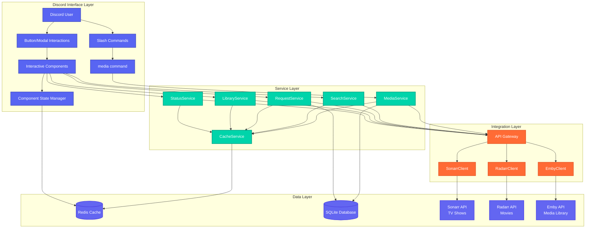
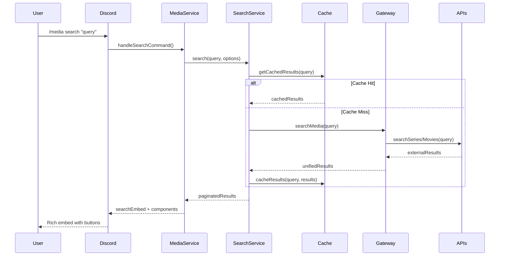
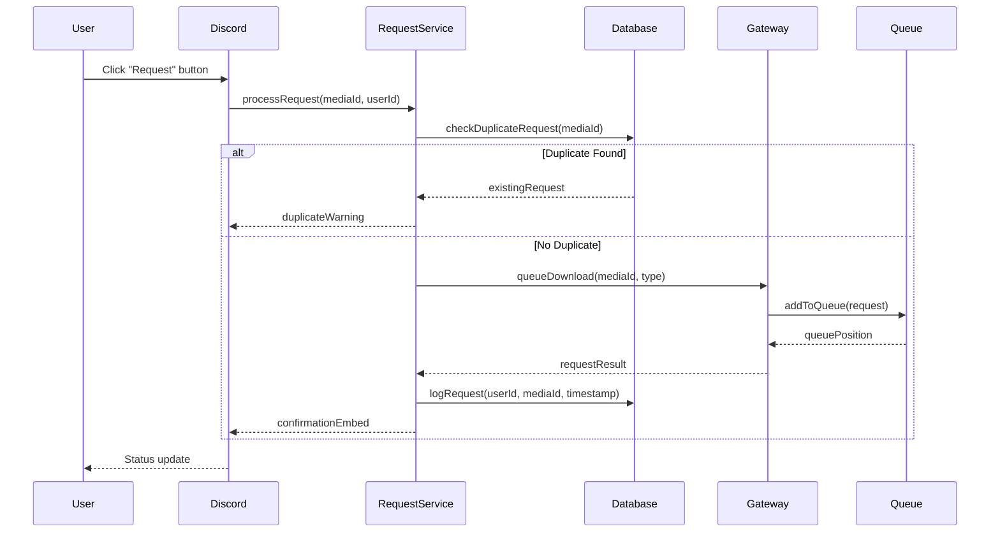
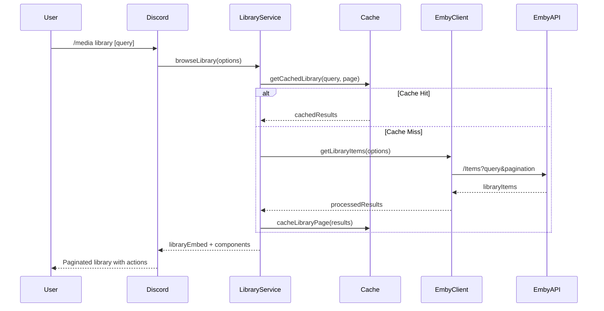
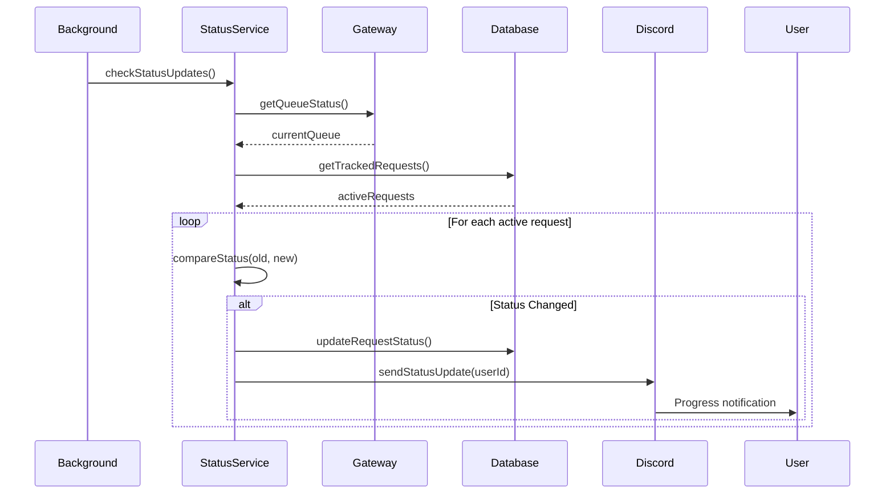

# TDR Media Management Feature - Technical Design Document

## Table of Contents

1. [Executive Summary & Introduction](#1-executive-summary--introduction)
2. [System Architecture](#2-system-architecture)
3. [Discord Command Structure](#3-discord-command-structure) (TBD)
4. [Service Layer Design](#4-service-layer-design) (TBD)
5. [Integration Layer (API Clients)](#5-integration-layer-api-clients) (TBD)
6. [Data Models](#6-data-models) (TBD)
7. [Discord Interaction Layer](#7-discord-interaction-layer) (TBD)
8. [Caching Strategy](#8-caching-strategy) (TBD)
9. [State Management](#9-state-management) (TBD)
10. [Error Handling & Resilience](#10-error-handling--resilience) (TBD)
11. [Security & Audit](#11-security--audit) (TBD)
12. [Performance Optimization](#12-performance-optimization) (TBD)
13. [Testing Strategy](#13-testing-strategy) (TBD)
14. [Implementation Roadmap](#14-implementation-roadmap) (TBD)
15. [Code Examples](#15-code-examples) (TBD)
16. [Visual Documentation](#16-visual-documentation) (TBD)

---

## 1. Executive Summary & Introduction

### Executive Summary

The TDR Media Management Feature represents a comprehensive Discord-based interface for managing media content through the existing TDR-Bot infrastructure. This technical design document outlines the implementation approach for integrating Sonarr (TV shows), Radarr (movies), and Emby (media server) capabilities directly into Discord through intuitive slash commands and interactive components.

The technical approach leverages TDR-Bot's existing NestJS architecture, extending it with specialized media management services that provide a unified interface for content discovery, download requests, library management, and status tracking. The implementation follows established patterns within the codebase while introducing new capabilities for external API integration and complex Discord interaction workflows.

Key technical achievements include: seamless integration with three external media services, implementation of sophisticated Discord interaction patterns using buttons and modals, intelligent caching strategies to optimize performance, and comprehensive state management for multi-step user workflows.

### Technology Stack and Key Architectural Decisions

**Core Technology Stack:**
- **NestJS Framework**: Leveraging the existing TDR-Bot architecture for dependency injection, modular design, and service organization
- **Necord Library**: Extending the current Discord.js integration for slash command handling and interactive component management
- **TypeScript**: Maintaining strict typing throughout the codebase for reliability and developer experience
- **Redis**: Implementing caching and state persistence for Discord component interactions
- **HTTP Clients**: Custom service clients for Sonarr, Radarr, and Emby API integration

**Key Architectural Decisions:**

1. **Service-Oriented Architecture**: Following TDR-Bot's modular approach with dedicated services for media operations (MediaService), search functionality (SearchService), request management (RequestService), and library operations (LibraryService)

2. **API Gateway Pattern**: Implementing a unified interface layer that abstracts the complexity of multiple external APIs (Sonarr, Radarr, Emby) behind consistent internal interfaces

3. **Interactive Component Strategy**: Utilizing Discord's native interactive components (buttons, select menus, modals) with custom ID encoding for stateful interactions and context preservation

4. **Strategic Caching**: Implementing a two-tier caching approach - caching static metadata (5-15 minutes) while always fetching fresh operational data (availability, download status, queue information)

5. **Asynchronous Processing**: Using background job processing for long-running operations like download monitoring and status updates

### Integration Strategy with Existing TDR-Bot Infrastructure

**Seamless Module Integration:**
The media management feature integrates as a new `MediaModule` within the existing TDR-Bot application structure. This module follows established patterns:

- **Command Registration**: Media commands are registered through the existing `CommandsModule` pattern, utilizing the same `@SlashCommand` decorators and option DTOs as current commands
- **Service Architecture**: Media-related services are organized under a dedicated `MediaModule` that imports and depends on existing `ServicesModule`, `StateModule`, and infrastructure modules
- **Dependency Injection**: Leveraging NestJS's existing DI container with proper service registration and cross-module dependencies

**Infrastructure Reuse:**
- **Logging**: Utilizing the existing `nestjs-pino` logging infrastructure with consistent log formatting and structured logging
- **Error Handling**: Extending the current `ErrorClassificationService` and `RetryService` patterns for external API integration reliability
- **Database Integration**: Using the existing SQLite database infrastructure for audit logging and request tracking
- **Event System**: Leveraging the current `EventEmitterModule` for internal service communication and status updates

**Configuration Integration:**
- **Environment Management**: Following the established environment variable patterns using the existing `EnvKey` system
- **API Key Management**: Storing external service credentials using the same secure environment variable approach as current integrations

### Scope and Technical Constraints

**Implementation Scope:**

*Included Features:*
- Unified search across movies and TV shows with paginated results
- Interactive media information display with rich Discord embeds
- Request management with confirmation workflows and progress tracking
- Library browsing and management with contextual actions
- Direct Emby link generation and sharing capabilities
- Comprehensive audit logging and user activity tracking

*Technical Boundaries:*
- Discord API limitations (100-character custom IDs, 25 select menu options, 15-minute component timeouts)
- External API rate limits (estimated 30 req/min for Sonarr/Radarr, 60 req/min for Emby)
- Discord message size constraints (6000 characters for embeds, 4096 for descriptions)
- Component interaction limits (5 buttons per row, 5 rows per message)

**Performance Requirements:**
- Command success rate: >95% successful executions
- API response time: <2 seconds for 95th percentile responses
- Search to request completion: <30 seconds average user workflow time
- Cache hit ratio: >80% for static metadata requests

**Technical Constraints:**
- Must maintain backward compatibility with existing TDR-Bot functionality
- Cannot modify existing database schemas (extend only)
- Must follow established error handling and logging patterns
- Limited to read-only operations on external services (no destructive API calls)
- Component state limited to 15-minute Discord interaction timeouts

### API Integration Overview

**External Service Integration:**

*Sonarr TV Show Management:*
- **Base URL**: `http://sonarr:8989/api/v3/`
- **Authentication**: API key-based authentication via `X-Api-Key` header
- **Core Operations**: Series search and lookup, episode management, download queue manipulation, calendar integration
- **Key Endpoints**: `/series/lookup`, `/episode`, `/command`, `/queue` for comprehensive TV show lifecycle management

*Radarr Movie Management:*
- **Base URL**: `http://radarr:7878/api/v3/`
- **Authentication**: Matching API key pattern with Sonarr
- **Core Operations**: Movie search and discovery, quality profile management, download request processing
- **Key Endpoints**: `/movie/lookup`, `/command`, `/queue`, `/qualityprofile` for complete movie management workflows

*Emby Media Server:*
- **Base URL**: `http://emby:8096/emby/`
- **Authentication**: API key via query parameters
- **Core Operations**: Library querying with advanced filtering, media item details, playback URL generation
- **Key Endpoints**: `/Items` with extensive query capabilities, `/Items/{id}/PlaybackInfo` for streaming integration

**Integration Architecture:**
The API integration layer implements dedicated client services (`SonarrClient`, `RadarrClient`, `EmbyClient`) that handle authentication, request formatting, response processing, and error management. These clients provide clean, typed interfaces that abstract external API complexities and provide consistent error handling across all external service interactions.

Each client implements retry logic with exponential backoff, circuit breaker patterns for service degradation, and comprehensive logging for monitoring and debugging external service interactions.

---

## 2. System Architecture

### 2.1 Architecture Overview

The TDR Media Management Feature implements a layered architecture pattern that provides clear separation of concerns while maintaining high cohesion within each layer. The architecture is designed to handle the complexity of Discord's interactive components, external API integrations, and stateful user workflows while remaining scalable and maintainable.

**Four-Layer Architecture:**

1. **Discord Interface Layer**: Handles Discord slash commands, interactive components (buttons, select menus, modals), and rich embed generation
2. **Service Layer**: Contains business logic, orchestration, caching, and workflow management
3. **Integration Layer**: Abstracts external API interactions with dedicated clients for Sonarr, Radarr, and Emby
4. **Data Layer**: Manages persistent storage (SQLite), caching (Redis), and external API endpoints

This architecture ensures that each layer has a single responsibility while providing clear interfaces between layers. The design facilitates testing, maintainability, and future extensibility while following established TDR-Bot patterns.

**Key Architectural Principles:**

- **Separation of Concerns**: Each layer handles distinct responsibilities without overlap
- **Dependency Inversion**: Higher layers depend on abstractions, not concrete implementations
- **Single Source of Truth**: External APIs are the authoritative source for operational data
- **Strategic Caching**: Static metadata is cached while operational data is always fresh
- **Resilient Design**: Circuit breakers, retries, and graceful degradation patterns throughout

### 2.2 System Architecture Diagram


```mermaid
graph TB
    %% Discord Interface Layer
    subgraph "Discord Interface Layer"
        User[Discord User] --> Commands[Slash Commands]
        User --> Interactions[Button/Modal Interactions]
        Commands --> MediaCmd[media command]
        Interactions --> Components[Interactive Components]
        Components --> StateManager[Component State Manager]
    end

    %% Service Layer
    subgraph "Service Layer"
        MediaCmd --> MediaService[MediaService]
        Components --> SearchService[SearchService]
        Components --> RequestService[RequestService]
        Components --> LibraryService[LibraryService]
        Components --> StatusService[StatusService]
        
        MediaService --> CacheService[CacheService]
        SearchService --> CacheService
        RequestService --> CacheService
        LibraryService --> CacheService
        StatusService --> CacheService
    end

    %% Integration Layer
    subgraph "Integration Layer"
        MediaService --> Gateway[API Gateway]
        SearchService --> Gateway
        RequestService --> Gateway
        LibraryService --> Gateway
        StatusService --> Gateway
        
        Gateway --> SonarrClient[SonarrClient]
        Gateway --> RadarrClient[RadarrClient]
        Gateway --> EmbyClient[EmbyClient]
    end

    %% Data Layer
    subgraph "Data Layer"
        CacheService --> Redis[(Redis Cache)]
        StateManager --> Redis
        
        MediaService --> Database[(SQLite Database)]
        RequestService --> Database
        
        SonarrClient --> SonarrAPI[Sonarr API<br/>TV Shows]
        RadarrClient --> RadarrAPI[Radarr API<br/>Movies]
        EmbyClient --> EmbyAPI[Emby API<br/>Media Library]
    end

    %% Styling
    classDef discord fill:#5865F2,stroke:#4752C4,stroke-width:2px,color:#fff
    classDef service fill:#00D4AA,stroke:#00A085,stroke-width:2px,color:#fff
    classDef integration fill:#FF6B35,stroke:#E55A2B,stroke-width:2px,color:#fff
    classDef data fill:#6366F1,stroke:#4F46E5,stroke-width:2px,color:#fff
    classDef external fill:#9CA3AF,stroke:#6B7280,stroke-width:2px,color:#fff

    class User,Commands,Interactions,MediaCmd,Components,StateManager discord
    class MediaService,SearchService,RequestService,LibraryService,StatusService,CacheService service
    class Gateway,SonarrClient,RadarrClient,EmbyClient integration
    class Redis,Database,SonarrAPI,RadarrAPI,EmbyAPI data
```

### 2.3 Layer Definitions

#### 2.3.1 Discord Interface Layer

The Discord Interface Layer serves as the presentation tier, handling all user interactions and Discord-specific communication patterns. This layer is responsible for translating Discord events into service layer operations and formatting responses into Discord-compatible formats.

**Key Components:**

**Slash Command Handler (`MediaCommands`)**:
- Implements Necord `@SlashCommand` decorators following existing TDR-Bot patterns
- Handles command parsing and validation using established DTO patterns
- Routes commands to appropriate service layer operations
- Manages command-level error handling with user-friendly Discord responses

**Interactive Component Manager (`ComponentManager`)**:
- Processes button clicks, select menu selections, and modal submissions
- Decodes custom component IDs using structured format: `action_mediaType_mediaId_context_page`
- Maintains component state across user interactions
- Handles component timeout scenarios and cleanup

**Embed Builder Service (`EmbedBuilderService`)**:
- Creates rich Discord embeds for media information display
- Handles image embedding for movie/TV show posters
- Formats metadata into Discord-friendly layouts
- Manages embed size limitations (6000 characters total, 4096 for descriptions)

**Response Formatter (`ResponseFormatter`)**:
- Transforms service layer responses into Discord message formats
- Handles pagination controls and navigation components
- Creates context-aware button configurations based on media availability
- Manages Discord API constraints (5 buttons per row, 25 select menu options)

#### 2.3.2 Service Layer

The Service Layer contains the core business logic and orchestrates operations across the system. Each service has a specific domain responsibility and maintains loose coupling through well-defined interfaces.

**MediaService (Core Orchestrator)**:
```typescript
@Injectable()
export class MediaService {
  // Coordinates complex workflows (search → info → request)
  // Implements business rules and validation
  // Manages component state transitions
  // Handles cross-service operations
}
```

**SearchService (Unified Search)**:
```typescript
@Injectable()
export class SearchService {
  // Aggregates results from Sonarr and Radarr
  // Implements result ranking and pagination
  // Manages search result caching (5-15 minutes)
  // Handles search component interactions
}
```

**RequestService (Download Management)**:
```typescript
@Injectable()
export class RequestService {
  // Queues download requests with validation
  // Tracks request status and progress
  // Implements duplicate detection
  // Manages request cancellation workflows
}
```

**LibraryService (Content Browsing)**:
```typescript
@Injectable()
export class LibraryService {
  // Queries available content from Emby
  // Implements library pagination and filtering
  // Handles content deletion with confirmations
  // Generates Emby playback links
}
```

**StatusService (Progress Tracking)**:
```typescript
@Injectable()
export class StatusService {
  // Monitors download queues from Sonarr/Radarr
  // Provides real-time status updates
  // Handles status refresh interactions
  // Tracks completion notifications
}
```

**CacheService (Caching Operations)**:
```typescript
@Injectable()
export class CacheService {
  // Implements Redis cache operations
  // Manages cache invalidation strategies
  // Handles cache-aside patterns
  // Provides cache warming mechanisms
}
```

#### 2.3.3 Integration Layer

The Integration Layer abstracts external API interactions and provides consistent interfaces for the service layer. This layer handles the complexity of different API patterns, authentication methods, and error scenarios.

**API Gateway (`ApiGateway`)**:
```typescript
@Injectable()
export class ApiGateway {
  // Routes requests to appropriate clients
  // Implements rate limiting across all APIs
  // Provides unified error handling
  // Manages circuit breaker patterns
}
```

**SonarrClient (TV Show Operations)**:
```typescript
@Injectable()
export class SonarrClient {
  // Handles TV show search and metadata
  // Manages series and episode operations
  // Implements download queue interactions
  // Provides progress monitoring capabilities
}
```

**RadarrClient (Movie Operations)**:
```typescript
@Injectable()
export class RadarrClient {
  // Handles movie search and metadata
  // Manages movie library operations
  // Implements download request processing
  // Provides quality profile management
}
```

**EmbyClient (Media Library)**:
```typescript
@Injectable()
export class EmbyClient {
  // Queries media library with advanced filtering
  // Provides media item details and metadata
  // Generates playback URLs and sharing links
  // Handles library management operations
}
```

#### 2.3.4 Data Layer

The Data Layer manages all persistent storage, caching, and external data sources. This layer provides data persistence, performance optimization through caching, and serves as the interface to external APIs.

**SQLite Database**:
- **Request Audit Table**: Tracks all user requests with timestamps, user IDs, and request details
- **User Activity Table**: Logs user interactions for accountability and analytics
- **Configuration Table**: Stores system configuration and feature flags
- **Error Log Table**: Persists error occurrences for monitoring and debugging

**Redis Cache**:
- **Metadata Cache**: Static information (posters, descriptions, cast) with 5-15 minute TTL
- **Component State**: Interactive component state with 15-minute TTL
- **Search Results**: Paginated search results with 5-minute TTL
- **Rate Limiting**: Request counters for API rate limiting

**External APIs**:
- **Sonarr API**: TV show management and download orchestration
- **Radarr API**: Movie management and download orchestration  
- **Emby API**: Media library queries and playback link generation

### 2.4 Component Relationships and Responsibilities

**Service Interaction Patterns:**

1. **Command Flow**: Discord Command → MediaService → Specialized Service → Integration Layer → External API
2. **Component Flow**: Discord Interaction → Component Manager → Service Layer → Response Formatting
3. **Status Flow**: Background Job → StatusService → Cache Update → User Notification
4. **Error Flow**: Any Layer → Error Classification → Logging → User-Friendly Response

**Dependency Relationships:**
- **Service Layer** depends on Integration Layer abstractions (interfaces, not implementations)
- **Integration Layer** depends on external API availability and responses
- **Discord Layer** depends on Service Layer for business logic
- **All Layers** depend on Data Layer for persistence and caching

**Responsibility Matrix:**

| Component | Search | Request | Status | Library | Caching | Error Handling |
|-----------|--------|---------|---------|---------|---------|----------------|
| MediaService | ✓ | ✓ | ✓ | ✓ | - | ✓ |
| SearchService | ✓ | - | - | - | ✓ | ✓ |
| RequestService | - | ✓ | ✓ | - | ✓ | ✓ |
| LibraryService | - | - | - | ✓ | ✓ | ✓ |
| StatusService | - | - | ✓ | - | ✓ | ✓ |
| CacheService | - | - | - | - | ✓ | ✓ |

### 2.5 API Gateway Pattern

The API Gateway pattern provides a unified entry point for all external service interactions, abstracting the complexity of multiple APIs behind a consistent interface. This pattern ensures reliability, security, and maintainability while providing cross-cutting concerns like rate limiting, authentication, and error handling.

**Gateway Architecture:**

```typescript
@Injectable()
export class ApiGateway {
  constructor(
    private readonly sonarrClient: SonarrClient,
    private readonly radarrClient: RadarrClient,
    private readonly embyClient: EmbyClient,
    private readonly rateLimiter: RateLimiterService,
    private readonly circuitBreaker: CircuitBreakerService,
    private readonly logger: PinoLogger,
  ) {}

  async searchMedia(query: string, type: MediaType): Promise<SearchResult[]> {
    // Unified search across multiple services
    // Implements rate limiting and circuit breaking
    // Provides consistent error handling
  }

  async requestDownload(mediaId: string, type: MediaType): Promise<RequestResult> {
    // Routes to appropriate service based on media type
    // Implements duplicate detection
    // Provides request tracking
  }
}
```

**Gateway Responsibilities:**

1. **Request Routing**: Directs requests to appropriate clients based on media type and operation
2. **Rate Limiting**: Enforces API rate limits across all external services (30 req/min for Sonarr/Radarr, 60 req/min for Emby)
3. **Circuit Breaking**: Implements circuit breaker pattern to handle service failures gracefully
4. **Authentication Management**: Centralizes API key handling and authentication headers
5. **Response Transformation**: Converts external API responses to internal data models
6. **Error Handling**: Provides consistent error classification and retry logic

**Rate Limiting Strategy:**

```typescript
interface RateLimitConfig {
  sonarr: { requests: 30, window: 60000 }; // 30 requests per minute
  radarr: { requests: 30, window: 60000 }; // 30 requests per minute  
  emby: { requests: 60, window: 60000 }; // 60 requests per minute
}
```

**Circuit Breaker Implementation:**
- **Failure Threshold**: 5 consecutive failures trigger circuit opening
- **Timeout Period**: 30-second cooldown before attempting requests
- **Success Threshold**: 3 consecutive successes close the circuit
- **Fallback Strategy**: Return cached data or graceful degradation messages

### 2.6 Service Boundaries and Interfaces

Clear service boundaries ensure maintainability, testability, and loose coupling between system components. Each service implements well-defined interfaces that abstract implementation details and provide clear contracts.

**Interface Definitions:**

```typescript
// Core Media Operations Interface
interface IMediaService {
  searchMedia(query: string): Promise<SearchResult[]>;
  getMediaInfo(mediaId: string, type: MediaType): Promise<MediaInfo>;
  requestMedia(mediaId: string, type: MediaType, options?: RequestOptions): Promise<RequestResult>;
  getRequestStatus(requestId: string): Promise<RequestStatus>;
}

// Search Operations Interface
interface ISearchService {
  search(query: string, options: SearchOptions): Promise<PaginatedSearchResult>;
  getSearchHistory(userId: string): Promise<SearchHistory[]>;
  cacheSearchResults(query: string, results: SearchResult[]): Promise<void>;
}

// Request Management Interface
interface IRequestService {
  queueRequest(request: MediaRequest): Promise<RequestResult>;
  getRequestStatus(requestId: string): Promise<RequestStatus>;
  cancelRequest(requestId: string, userId: string): Promise<boolean>;
  getActiveRequests(userId?: string): Promise<ActiveRequest[]>;
}

// Library Management Interface
interface ILibraryService {
  browseLibrary(options: BrowseOptions): Promise<PaginatedLibraryResult>;
  getMediaDetails(mediaId: string): Promise<MediaDetails>;
  deleteMedia(mediaId: string, userId: string): Promise<DeletionResult>;
  generatePlaybackLink(mediaId: string): Promise<PlaybackLink>;
}

// Status Tracking Interface
interface IStatusService {
  getDownloadStatus(mediaId: string): Promise<DownloadStatus>;
  refreshStatus(mediaId: string): Promise<DownloadStatus>;
  getQueuePosition(requestId: string): Promise<QueuePosition>;
  subscribeToUpdates(requestId: string, callback: StatusCallback): void;
}
```

**Service Boundary Enforcement:**

1. **Interface Segregation**: Each service implements only the interfaces relevant to its domain
2. **Dependency Injection**: Services depend on interfaces, not concrete implementations
3. **Cross-Service Communication**: Services communicate through well-defined interfaces only
4. **Data Encapsulation**: Internal service data structures are not exposed across boundaries
5. **Error Boundaries**: Each service handles its own domain-specific errors

**Integration Boundaries:**

```typescript
// External API Client Interfaces
interface ISonarrClient {
  searchSeries(query: string): Promise<SonarrSeries[]>;
  getSeriesById(id: number): Promise<SonarrSeries>;
  getEpisodes(seriesId: number): Promise<SonarrEpisode[]>;
  queueDownload(seriesId: number, episodes?: number[]): Promise<QueueResult>;
  getQueue(): Promise<QueueItem[]>;
}

interface IRadarrClient {
  searchMovies(query: string): Promise<RadarrMovie[]>;
  getMovieById(id: number): Promise<RadarrMovie>;
  queueDownload(movieId: number): Promise<QueueResult>;
  getQueue(): Promise<QueueItem[]>;
}

interface IEmbyClient {
  searchItems(query: string, type: ItemType): Promise<EmbyItem[]>;
  getItemById(id: string): Promise<EmbyItem>;
  generatePlayUrl(itemId: string): Promise<string>;
  getLibraryItems(options: LibraryOptions): Promise<PaginatedEmbyResult>;
}
```

### 2.7 Data Flow Documentation

Data flows through the system following predictable patterns that ensure consistency, performance, and reliability. Each workflow has specific entry points, processing stages, and exit points.

**Primary Data Flow Patterns:**

#### 2.7.1 Search Workflow


```mermaid
sequenceDiagram
    participant User
    participant Discord
    participant MediaService
    participant SearchService
    participant Cache
    participant Gateway
    participant APIs

    User->>Discord: /media search "query"
    Discord->>MediaService: handleSearchCommand()
    MediaService->>SearchService: search(query, options)
    SearchService->>Cache: getCachedResults(query)
    
    alt Cache Hit
        Cache-->>SearchService: cachedResults
    else Cache Miss
        SearchService->>Gateway: searchMedia(query)
        Gateway->>APIs: searchSeries/Movies(query)
        APIs-->>Gateway: externalResults
        Gateway-->>SearchService: unifiedResults
        SearchService->>Cache: cacheResults(query, results)
    end
    
    SearchService-->>MediaService: paginatedResults
    MediaService-->>Discord: searchEmbed + components
    Discord-->>User: Rich embed with buttons
```

**Search Flow Steps:**
1. **Input Validation**: Validate search query and sanitize input
2. **Cache Check**: Check Redis cache for recent search results (5-minute TTL)
3. **External Search**: Query Sonarr and Radarr APIs simultaneously if cache miss
4. **Result Aggregation**: Combine and rank results from multiple sources
5. **Result Caching**: Store results in Redis for subsequent requests
6. **Response Formatting**: Create Discord embed with interactive components
7. **Component State**: Store pagination state for navigation interactions

#### 2.7.2 Request Workflow


```mermaid
sequenceDiagram
    participant User
    participant Discord
    participant RequestService
    participant Database
    participant Gateway
    participant Queue

    User->>Discord: Click "Request" button
    Discord->>RequestService: processRequest(mediaId, userId)
    RequestService->>Database: checkDuplicateRequest(mediaId)
    
    alt Duplicate Found
        Database-->>RequestService: existingRequest
        RequestService-->>Discord: duplicateWarning
    else No Duplicate
        RequestService->>Gateway: queueDownload(mediaId, type)
        Gateway->>Queue: addToQueue(request)
        Queue-->>Gateway: queuePosition
        Gateway-->>RequestService: requestResult
        RequestService->>Database: logRequest(userId, mediaId, timestamp)
        RequestService-->>Discord: confirmationEmbed
    end
    
    Discord-->>User: Status update
```

**Request Flow Steps:**
1. **Duplicate Detection**: Check existing requests in database to prevent duplicates
2. **Validation**: Verify media availability and user permissions
3. **Queue Submission**: Submit request to appropriate download service (Sonarr/Radarr)
4. **Audit Logging**: Record request details in SQLite database
5. **Status Tracking**: Initialize status monitoring for the request
6. **User Notification**: Send confirmation with queue position and estimated time

#### 2.7.3 Library Browse Workflow


```mermaid
sequenceDiagram
    participant User
    participant Discord
    participant LibraryService
    participant Cache
    participant EmbyClient
    participant EmbyAPI

    User->>Discord: /media library [query]
    Discord->>LibraryService: browseLibrary(options)
    LibraryService->>Cache: getCachedLibrary(query, page)
    
    alt Cache Hit
        Cache-->>LibraryService: cachedResults
    else Cache Miss
        LibraryService->>EmbyClient: getLibraryItems(options)
        EmbyClient->>EmbyAPI: /Items?query&pagination
        EmbyAPI-->>EmbyClient: libraryItems
        EmbyClient-->>LibraryService: processedResults
        LibraryService->>Cache: cacheLibraryPage(results)
    end
    
    LibraryService-->>Discord: libraryEmbed + components
    Discord-->>User: Paginated library with actions
```

**Library Flow Steps:**
1. **Query Processing**: Parse optional search query and pagination parameters
2. **Cache Consultation**: Check Redis for cached library pages (10-minute TTL)
3. **Emby Query**: Query Emby API with filters and pagination if cache miss
4. **Result Processing**: Transform Emby response to internal data models
5. **Action Generation**: Create context-aware action buttons based on media status
6. **Component Assembly**: Build Discord components with proper state encoding

#### 2.7.4 Status Update Workflow


```mermaid
sequenceDiagram
    participant Background
    participant StatusService
    participant Gateway
    participant Database
    participant Discord
    participant User

    Background->>StatusService: checkStatusUpdates()
    StatusService->>Gateway: getQueueStatus()
    Gateway-->>StatusService: currentQueue
    StatusService->>Database: getTrackedRequests()
    Database-->>StatusService: activeRequests
    
    loop For each active request
        StatusService->>StatusService: compareStatus(old, new)
        alt Status Changed
            StatusService->>Database: updateRequestStatus()
            StatusService->>Discord: sendStatusUpdate(userId)
            Discord->>User: Progress notification
        end
    end
```

**Status Flow Steps:**
1. **Background Polling**: Periodic job queries download queues every 30 seconds
2. **Status Comparison**: Compare current status with last known status
3. **Change Detection**: Identify status changes (queued → downloading → completed)4. **Database Update**: Persist new status information
5. **User Notification**: Send Discord notifications for significant status changes
6. **Cache Invalidation**: Clear relevant cache entries when status changes

### 2.8 Cross-Cutting Concerns

Cross-cutting concerns are system-wide responsibilities that span multiple layers and components. These concerns ensure the system operates reliably, securely, and maintainably.

#### 2.8.1 Security

**API Key Management:**
```typescript
// Environment-based configuration following TDR-Bot patterns
export const API_CONFIG = {
  SONARR_API_KEY: process.env.SONARR_API_KEY,
  RADARR_API_KEY: process.env.RADARR_API_KEY,
  EMBY_API_KEY: process.env.EMBY_API_KEY,
} as const;
```

**Input Validation:**
```typescript
// Zod schemas for request validation
export const SearchQuerySchema = z.object({
  query: z.string().min(1).max(100).regex(/^[a-zA-Z0-9\s\-_]+$/),
  page: z.number().int().min(1).max(100).optional(),
  limit: z.number().int().min(1).max(25).optional(),
});
```

**Security Measures:**
- **Input Sanitization**: All user inputs validated with Zod schemas
- **API Key Protection**: Keys stored in environment variables, never logged
- **Rate Limiting**: Per-user rate limiting to prevent abuse
- **Audit Logging**: Complete audit trail of all user actions
- **Permission Validation**: Discord user ID verification for all operations

#### 2.8.2 Logging and Monitoring

**Structured Logging:**
```typescript
// Following TDR-Bot logging patterns with Pino
export class MediaService {
  constructor(private readonly logger: PinoLogger) {
    this.logger.setContext('MediaService');
  }

  async searchMedia(query: string, userId: string) {
    this.logger.info({ query, userId }, 'Starting media search');
    try {
      // Implementation
      this.logger.info({ query, userId, resultCount }, 'Search completed');
    } catch (error) {
      this.logger.error({ query, userId, error }, 'Search failed');
      throw error;
    }
  }
}
```

**Monitoring Points:**
- **API Response Times**: Track external API performance
- **Cache Hit Rates**: Monitor caching effectiveness  
- **Error Rates**: Track failure rates by component
- **User Activity**: Monitor command usage patterns
- **Queue Status**: Track download queue health

#### 2.8.3 Error Handling

**Error Classification:**
```typescript
export enum ErrorType {
  USER_INPUT = 'USER_INPUT',           // Invalid user input
  EXTERNAL_API = 'EXTERNAL_API',       // External service errors
  RATE_LIMIT = 'RATE_LIMIT',          // API rate limiting
  NETWORK = 'NETWORK',                 // Network connectivity
  SYSTEM = 'SYSTEM',                   // Internal system errors
}

export class MediaError extends Error {
  constructor(
    public readonly type: ErrorType,
    public readonly message: string,
    public readonly userMessage: string,
    public readonly retryable: boolean = false,
  ) {
    super(message);
  }
}
```

**Error Recovery Strategies:**
- **Retry Logic**: Exponential backoff for transient failures
- **Circuit Breaking**: Prevent cascading failures
- **Graceful Degradation**: Fallback to cached data when possible
- **User-Friendly Messages**: Convert technical errors to understandable responses
- **Error Reporting**: Structured error logging for debugging

#### 2.8.4 Performance Optimization

**Caching Strategy:**
- **Static Metadata**: 5-15 minute TTL for posters, descriptions, cast information
- **Search Results**: 5-minute TTL for search result pages
- **Component State**: 15-minute TTL for Discord interaction state
- **Never Cache**: Availability status, download progress, queue positions

**Performance Patterns:**
- **Async Operations**: All external API calls are non-blocking
- **Connection Pooling**: Reuse HTTP connections for external APIs
- **Request Batching**: Combine multiple operations where possible
- **Lazy Loading**: Load data only when needed
- **Background Processing**: Status updates and cleanup in background jobs

**Resource Management:**
- **Memory Usage**: Implement proper cleanup for large response objects
- **Database Connections**: Use connection pooling for SQLite operations
- **Redis Connections**: Maintain persistent Redis connections with proper error handling
- **Request Queuing**: Prevent API flooding with intelligent queuing

---

*This document continues with detailed technical specifications for each system component. Sections 3-16 provide comprehensive implementation guidance for service design, data models, and deployment strategies.*