# TDR Media Management Feature - Technical Design Document

## Table of Contents

1. [Executive Summary](#1-executive-summary)
2. [System Architecture](#2-system-architecture)
3. [Discord Command Structure](#3-discord-command-structure)
4. [Service Layer Design](#4-service-layer-design) (TBD)
5. [Integration Layer (API Clients)](#5-integration-layer-api-clients)
6. [Data Models](#6-data-models) (TBD)
7. [Discord Interaction Layer](#7-discord-interaction-layer)
8. [State Management](#8-state-management)
9. [Advanced State Management](#9-advanced-state-management) (TBD)
10. [Error Handling & Resilience](#10-error-handling--resilience) (TBD)
11. [Security & Audit](#11-security--audit) (TBD)
12. [Performance Optimization](#12-performance-optimization)
13. [Testing Strategy](#13-testing-strategy) (TBD)
14. [Implementation Roadmap](#14-implementation-roadmap) (TBD)
15. [Code Examples](#15-code-examples) (TBD)
16. [Visual Documentation](#16-visual-documentation) (TBD)

**Appendix A:** [Technical Boundaries & Constraints](#appendix-a-technical-boundaries--constraints)
**Appendix B:** [API Integration Specifications](#appendix-b-api-integration-specifications)

---

## 1. Executive Summary

> **Requirements Reference**: For functional requirements, user workflows, and business context, see the [TDR Media Management PRD](./tdr-media-prd.md).

### 1.1 Technical Architecture Overview

The TDR Media Management Feature implements a service-oriented architecture that integrates Discord's interactive component system with three external media management APIs (Sonarr, Radarr, and Emby). The technical approach prioritizes real-time data accuracy, stateless design, and seamless integration with existing TDR-Bot infrastructure.

The architecture follows a four-layer design pattern: Discord Interface Layer for command and component handling, Service Layer for business logic orchestration, Integration Layer for external API abstraction, and Data Layer for in-memory state management. This separation enables independent scaling, comprehensive error handling, and maintainable service boundaries.

The implementation strategy leverages existing TDR-Bot patterns including NestJS dependency injection, Necord Discord integration, structured logging with Pino, and established error classification systems. This approach ensures operational consistency while minimizing development complexity and integration risk.

### 1.2 Core Technical Capabilities

The system implements four primary technical capabilities through specialized service components:

**Unified Search Engine**: Multi-API aggregation service that queries Sonarr, Radarr, and Emby APIs simultaneously, implements result normalization and deduplication, and provides paginated response handling with Discord component integration. The search architecture supports real-time availability detection and contextual action button generation.

**Request Orchestration System**: API routing service that automatically directs movie requests to Radarr and TV requests to Sonarr, implements real-time duplicate detection through direct queue API queries, and provides comprehensive request lifecycle management with status tracking and queue position monitoring.

**Interactive Component Management**: Discord.js component lifecycle system with structured state management, 15-minute automatic cleanup, custom ID encoding patterns, and multi-step workflow support. The component system enables complex user interactions while maintaining stateless service architecture.

**Real-time Data Integration**: Direct API integration strategy that fetches fresh data from external services for all operational queries, implements circuit breaker patterns for service resilience, and provides comprehensive error handling with automatic retry mechanisms.

### 1.3 Implementation Strategy

The technical implementation extends TDR-Bot's established NestJS/Necord architecture through modular service integration that preserves existing operational patterns while introducing media-specific capabilities. The approach prioritizes architectural consistency over framework-specific optimizations to ensure seamless integration and maintainable code.

**Real-time Data Architecture**: The system implements a direct API strategy that fetches fresh data from external services for all operational queries, eliminating cache synchronization complexity while ensuring data accuracy. This approach supports dynamic availability detection, real-time queue monitoring, and immediate duplicate request prevention.

**Component State Management**: Interactive Discord components utilize in-memory state storage with automatic 15-minute cleanup, structured custom ID encoding for component identification, and atomic state updates to support complex multi-step workflows without persistent data requirements.

**Service Integration Patterns**: The implementation leverages existing TDR-Bot infrastructure including dependency injection containers, structured logging with correlation IDs, established error classification systems, and configuration management patterns to ensure operational consistency and reduce integration complexity.

### 1.4 Technical Scope & Integration Boundaries

**Implementation Scope:**
- **Core Services:** Media search aggregation, request orchestration, status monitoring, library access coordination
- **Discord Integration:** Slash command handlers, interactive component management, rich embed generation, modal form processing
- **API Integration:** Sonarr client, Radarr client, Emby client with unified gateway pattern
- **Infrastructure:** Error handling, logging, validation, circuit breaker patterns, automatic cleanup

**Technical Boundaries:**
The system functions as an API orchestration layer that coordinates external service interactions without modifying their core functionality. All media operations, file management, and download processing remain within their respective external systems while the TDR integration provides unified access patterns.

**Service Architecture:**
Implementation follows domain-driven design principles with service boundaries aligned to media management workflows: SearchService for multi-API query aggregation, RequestService for download orchestration, StatusService for progress monitoring, and LibraryService for content access coordination.

**TDR-Bot Integration:**
The feature implements as a dedicated MediaModule within existing application structure, utilizing established dependency injection patterns, command registration systems, logging infrastructure, and error handling mechanisms to ensure seamless integration with existing bot operations.

### 1.5 Technical Constraints & Design Decisions

**Discord Platform Constraints:**
Interactive component limitations enforce specific architectural patterns: 15-minute component lifecycle management with automatic cleanup, 100-character custom ID encoding requiring structured format (`action_mediaType_mediaId_context_page`), and embed size constraints necessitating progressive disclosure for complex data presentation.

**External API Dependencies:**
Three-service integration architecture requires comprehensive resilience patterns: circuit breaker implementation for each API client, exponential backoff retry logic with configurable thresholds, graceful degradation strategies that maintain partial functionality during service outages, and unified error handling that abstracts service-specific failure modes.

**Homelab Performance Characteristics:**
Personal infrastructure constraints influence technical decisions: variable network latency handling through configurable timeout settings, resource-conscious design targeting <512MB memory usage and <25% CPU utilization, background processing for long-running operations, and efficient connection pooling for external API interactions.

**Stateless Architecture Requirements:**
Minimal persistent state design enables horizontal scaling and simplifies deployment: in-memory component state with automatic expiration, external APIs as single source of truth for all operational data, no database dependencies for core functionality, and stateless service design supporting concurrent user interactions.

**Real-time Data Strategy:**
Direct API integration eliminates cache consistency issues while ensuring data accuracy: all availability checks query live external APIs, queue status fetched in real-time for immediate feedback, duplicate detection through live API queries rather than local state tracking, and background refresh patterns for long-running status monitoring.

---

## 2. System Architecture

### 2.1 Architecture Overview & Principles

The TDR Media Management Feature implements a four-layer architecture pattern that provides clear separation of concerns while maintaining high cohesion within each layer. The architecture handles Discord's interactive components, external API integrations, and stateful user workflows while remaining scalable and maintainable.

**Four-Layer Architecture:**

1. **Discord Interface Layer**: Handles Discord slash commands, interactive components, and rich embed generation
2. **Service Layer**: Contains business logic, orchestration, and workflow management
3. **Integration Layer**: Abstracts external API interactions with dedicated clients for Sonarr, Radarr, and Emby
4. **Data Layer**: Manages in-memory state and external API endpoints

**Key Architectural Principles:**

- **Separation of Concerns**: Each layer handles distinct responsibilities without overlap
- **Dependency Inversion**: Higher layers depend on abstractions, not concrete implementations
- **Single Source of Truth**: External APIs are the authoritative source for operational data
- **Real-time Data**: All operational metadata is fetched fresh from external APIs
- **Resilient Design**: Circuit breakers, retries, and graceful degradation patterns throughout

**Service Integration with TDR-Bot:**

The media commands integrate as a new `MediaModule` within the existing TDR-Bot application structure, following established patterns for command registration, service architecture, dependency injection, logging infrastructure, and error handling mechanisms.

**Component Interaction Patterns:**

1. **Command Flow**: Discord Command → MediaService → Specialized Service → Integration Layer → External API
2. **Component Flow**: Discord Interaction → Component Manager → Service Layer → Response Formatting
3. **Status Flow**: Background Job → StatusService → User Notification
4. **Error Flow**: Any Layer → Error Classification → Logging → User-Friendly Response

**Responsibility Matrix:**

| Component      | Search | Request | Status | Library | State Management | Error Handling |
| -------------- | ------ | ------- | ------ | ------- | ---------------- | -------------- |
| MediaService   | ✓      | ✓       | ✓      | ✓       | -                | ✓              |
| SearchService  | ✓      | -       | -      | -       | ✓                | ✓              |
| RequestService | -      | ✓       | ✓      | -       | ✓                | ✓              |
| LibraryService | -      | -       | -      | ✓       | ✓                | ✓              |
| StatusService  | -      | -       | ✓      | -       | ✓                | ✓              |

### 2.2 System Diagrams & Data Flow

**System Architecture Overview:**

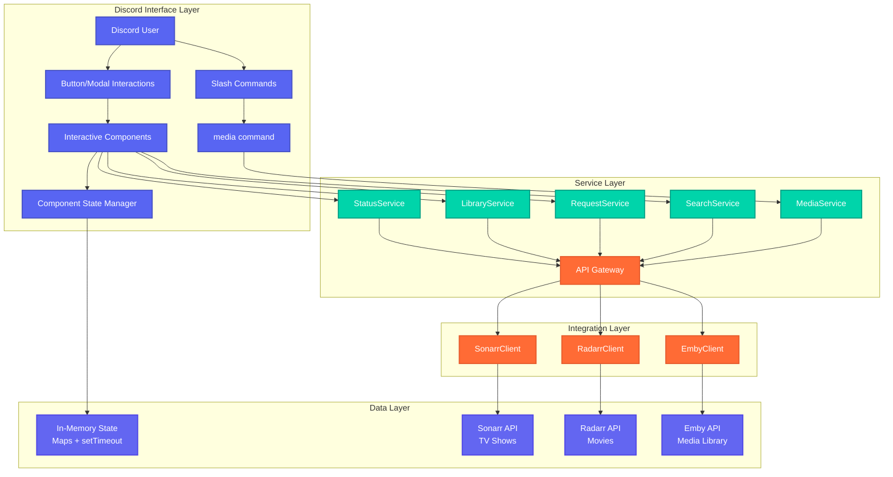
```mermaid
graph TB
    %% Discord Interface Layer
    subgraph "Discord Interface Layer"
        User[Discord User] --> Commands[Slash Commands]
        User --> Interactions[Button/Modal Interactions]
        Commands --> MediaCmd[media command]
        Interactions --> Components[Interactive Components]
        Components --> StateManager[Component State Manager]
    end

    %% Service Layer
    subgraph "Service Layer"
        MediaCmd --> MediaService[MediaService]
        Components --> SearchService[SearchService]
        Components --> RequestService[RequestService]
        Components --> LibraryService[LibraryService]
        Components --> StatusService[StatusService]

        MediaService --> Gateway[API Gateway]
        SearchService --> Gateway
        RequestService --> Gateway
        LibraryService --> Gateway
        StatusService --> Gateway
    end

    %% Integration Layer
    subgraph "Integration Layer"
        Gateway --> SonarrClient[SonarrClient]
        Gateway --> RadarrClient[RadarrClient]
        Gateway --> EmbyClient[EmbyClient]
    end

    %% Data Layer
    subgraph "Data Layer"
        StateManager --> MemoryStore[In-Memory State<br/>Maps + setTimeout]

        SonarrClient --> SonarrAPI[Sonarr API<br/>TV Shows]
        RadarrClient --> RadarrAPI[Radarr API<br/>Movies]
        EmbyClient --> EmbyAPI[Emby API<br/>Media Library]
    end

    %% Styling
    classDef discord fill:#5865F2,stroke:#4752C4,stroke-width:2px,color:#fff
    classDef service fill:#00D4AA,stroke:#00A085,stroke-width:2px,color:#fff
    classDef integration fill:#FF6B35,stroke:#E55A2B,stroke-width:2px,color:#fff
    classDef data fill:#6366F1,stroke:#4F46E5,stroke-width:2px,color:#fff

    class User,Commands,Interactions,MediaCmd,Components,StateManager discord
    class MediaService,SearchService,RequestService,LibraryService,StatusService service
    class Gateway,SonarrClient,RadarrClient,EmbyClient integration
    class MemoryStore,SonarrAPI,RadarrAPI,EmbyAPI data
```

**Primary Data Flow Patterns:**

**Search Workflow:**
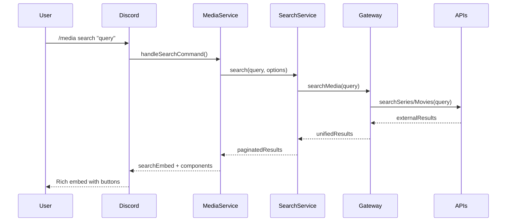
```mermaid
sequenceDiagram
    participant User
    participant Discord
    participant MediaService
    participant SearchService
    participant Gateway
    participant APIs

    User->>Discord: /media search "query"
    Discord->>MediaService: handleSearchCommand()
    MediaService->>SearchService: search(query, options)
    SearchService->>Gateway: searchMedia(query)
    Gateway->>APIs: searchSeries/Movies(query)
    APIs-->>Gateway: externalResults
    Gateway-->>SearchService: unifiedResults
    SearchService-->>MediaService: paginatedResults
    MediaService-->>Discord: searchEmbed + components
    Discord-->>User: Rich embed with buttons
```

**Request Workflow:**
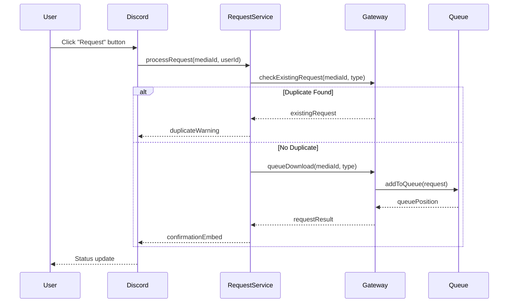
```mermaid
sequenceDiagram
    participant User
    participant Discord
    participant RequestService
    participant Gateway
    participant Queue

    User->>Discord: Click "Request" button
    Discord->>RequestService: processRequest(mediaId, userId)
    RequestService->>Gateway: checkExistingRequest(mediaId, type)

    alt Duplicate Found
        Gateway-->>RequestService: existingRequest
        RequestService-->>Discord: duplicateWarning
    else No Duplicate
        RequestService->>Gateway: queueDownload(mediaId, type)
        Gateway->>Queue: addToQueue(request)
        Queue-->>Gateway: queuePosition
        Gateway-->>RequestService: requestResult
        RequestService-->>Discord: confirmationEmbed
    end

    Discord-->>User: Status update
```

**Key Data Flow Characteristics:**

- **Input Validation**: All user inputs validated and sanitized before processing
- **Real-time Operations**: Always fetch fresh data from external APIs for accuracy
- **Component State**: Store pagination and interaction state in memory with 15-minute cleanup
- **Background Processing**: Status monitoring and cleanup operations run asynchronously

### 2.3 Layer Definitions & Responsibilities

**Discord Interface Layer:**
- **Slash Command Handlers**: Implement Necord decorators following TDR-Bot patterns
- **Interactive Component Manager**: Process button clicks, select menus, and modal submissions
- **Embed Builder Service**: Create rich Discord embeds with proper formatting and constraints
- **Response Formatter**: Transform service responses into Discord message formats

**Service Layer Core Interfaces:**
```typescript
interface IMediaService {
  searchMedia(query: string): Promise<SearchResult[]>;
  getMediaInfo(mediaId: string, type: MediaType): Promise<MediaInfo>;
  requestMedia(mediaId: string, type: MediaType, options?: RequestOptions): Promise<RequestResult>;
  getRequestStatus(requestId: string): Promise<RequestStatus>;
}

interface ISearchService {
  search(query: string, options: SearchOptions): Promise<PaginatedSearchResult>;
  formatSearchResults(results: SearchResult[]): Promise<FormattedResult>;
}

interface IRequestService {
  queueRequest(request: MediaRequest): Promise<RequestResult>;
  getRequestStatus(requestId: string): Promise<RequestStatus>;
  cancelRequest(requestId: string, userId: string): Promise<boolean>;
  getActiveRequests(userId?: string): Promise<ActiveRequest[]>;
}

interface ILibraryService {
  browseLibrary(options: BrowseOptions): Promise<PaginatedLibraryResult>;
  getMediaDetails(mediaId: string): Promise<MediaDetails>;
  generatePlaybackLink(mediaId: string): Promise<PlaybackLink>;
}

interface IStatusService {
  getDownloadStatus(mediaId: string): Promise<DownloadStatus>;
  refreshStatus(mediaId: string): Promise<DownloadStatus>;
  subscribeToUpdates(requestId: string, callback: StatusCallback): void;
}
```

**Integration Layer:**
- **API Gateway**: Routes requests to appropriate clients with circuit breaking and error handling
- **External API Clients**: Dedicated clients for Sonarr, Radarr, and Emby with authentication and retry logic
- **Response Transformation**: Convert external API responses to internal data models

**Data Layer:**
- **In-Memory State Store**: Component state and session management with automatic cleanup
- **External API Endpoints**: Direct integration with Sonarr, Radarr, and Emby APIs

### 2.4 Service Interfaces & Integration Contracts

**API Gateway Pattern:**

The API Gateway implements a centralized routing and circuit breaker pattern that manages all external service communications. The gateway provides unified error handling, request routing, and health monitoring across all media management services.

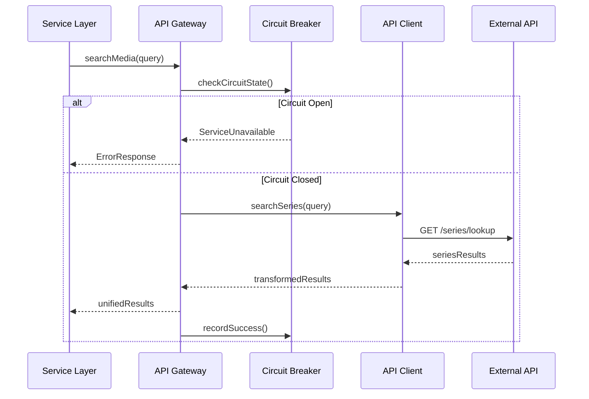
```mermaid
sequenceDiagram
    participant Service as Service Layer
    participant Gateway as API Gateway
    participant Circuit as Circuit Breaker
    participant Client as API Client
    participant External as External API

    Service->>Gateway: searchMedia(query)
    Gateway->>Circuit: checkCircuitState()
    
    alt Circuit Open
        Circuit-->>Gateway: ServiceUnavailable
        Gateway-->>Service: ErrorResponse
    else Circuit Closed
        Gateway->>Client: searchSeries(query)
        Client->>External: GET /series/lookup
        External-->>Client: seriesResults
        Client-->>Gateway: transformedResults
        Gateway-->>Service: unifiedResults
        Gateway->>Circuit: recordSuccess()
    end
```

**Service Layer Contracts:**

The service layer defines clear contracts for media operations while abstracting implementation details from the command layer. Each service provides focused functionality with comprehensive error handling and type safety.

```typescript
interface IMediaService {
  searchMedia(query: string): Promise<SearchResult[]>;
  getMediaInfo(mediaId: string, type: MediaType): Promise<MediaInfo>;
  requestMedia(mediaId: string, type: MediaType, options?: RequestOptions): Promise<RequestResult>;
  getRequestStatus(requestId: string): Promise<RequestStatus>;
}

interface ISearchService {
  search(query: string, options: SearchOptions): Promise<PaginatedSearchResult>;
  formatSearchResults(results: SearchResult[]): Promise<FormattedResult>;
}

interface IRequestService {
  queueRequest(request: MediaRequest): Promise<RequestResult>;
  getRequestStatus(requestId: string): Promise<RequestStatus>;
  cancelRequest(requestId: string, userId: string): Promise<boolean>;
  getActiveRequests(userId?: string): Promise<ActiveRequest[]>;
}
```

### 2.4.2 API Integration Architecture

**External API Client Interfaces:**

Dedicated clients for each external service provide type-safe interactions while handling authentication and error recovery. Each client implements standardized patterns for request handling and response transformation.

```typescript
interface ISonarrClient {
  searchSeries(query: string): Promise<SonarrSeries[]>;
  getSeriesById(id: number): Promise<SonarrSeries>;
  addSeries(series: SonarrSeries, options: AddSeriesOptions): Promise<SonarrSeries>;
  getQueue(): Promise<SonarrQueueItem[]>;
  getEpisodes(seriesId: number): Promise<SonarrEpisode[]>;
}

interface IRadarrClient {
  searchMovies(query: string): Promise<RadarrMovie[]>;
  getMovieById(id: number): Promise<RadarrMovie>;
  addMovie(movie: RadarrMovie, options: AddMovieOptions): Promise<RadarrMovie>;
  getQueue(): Promise<RadarrQueueItem[]>;
}

interface IEmbyClient {
  searchItems(query: string, options: EmbySearchOptions): Promise<EmbyItem[]>;
  getItemById(id: string): Promise<EmbyItem>;
  getLibraryItems(options: LibraryQueryOptions): Promise<PaginatedEmbyResult>;
  generatePlayUrl(itemId: string, userId: string): Promise<PlayUrl>;
}
```

**Unified API Gateway Interface:**

The API Gateway provides a single integration point that coordinates requests across multiple external services while implementing consistent error handling and response transformation.

```typescript
interface IApiGateway {
  searchMedia(query: string, options: SearchOptions): Promise<UnifiedSearchResult>;
  requestMedia(mediaId: string, type: MediaType, options: RequestOptions): Promise<RequestResult>;
  getMediaStatus(mediaId: string, type: MediaType): Promise<MediaStatus>;
  checkDuplicate(mediaId: string, type: MediaType): Promise<DuplicateCheckResult>;
}
```

**Circuit Breaker Configuration:**
- **Failure Threshold**: 5 consecutive failures trigger circuit opening
- **Timeout Period**: 30-second cooldown before attempting requests
- **Success Threshold**: 3 consecutive successes close the circuit
- **Fallback Strategy**: Graceful degradation with retry mechanisms

### 2.5 Cross-Cutting Concerns

**Security:**
- **API Key Management**: Environment-based configuration following TDR-Bot patterns
- **Input Validation**: Zod schemas for comprehensive request validation
- **Permission Validation**: Discord user ID verification for all operations
- **Input Sanitization**: Regex patterns and length limits for all user inputs

**Error Handling:**
The system implements a comprehensive error classification system that provides user-friendly messages while maintaining operational visibility.

```typescript
export enum MediaErrorType {
  VALIDATION_ERROR = "VALIDATION_ERROR",
  EXTERNAL_API = "EXTERNAL_API", 
  MEDIA_NOT_FOUND = "MEDIA_NOT_FOUND",
  DUPLICATE_REQUEST = "DUPLICATE_REQUEST",
  API_UNAVAILABLE = "API_UNAVAILABLE",
}

export class MediaError extends Error {
  constructor(
    public readonly type: MediaErrorType,
    public readonly message: string,
    public readonly userMessage: string,
    public readonly retryable: boolean = false,
  ) {
    super(message);
  }
}
```

**Logging & Monitoring:**
- **Structured Logging**: Pino logger with consistent context and correlation IDs
- **Performance Monitoring**: API response times, error rates, user activity patterns
- **Queue Monitoring**: Download queue health and completion rates

### 2.6 Technology Stack & Implementation Architecture

**Core Technology Stack:**

The implementation leverages the existing TDR-Bot technology foundation while extending capabilities for media management:

- **Framework**: NestJS with Necord for Discord integration
- **Language**: TypeScript with strict type checking
- **Discord Library**: Discord.js v14 with full interaction support
- **HTTP Client**: Axios with connection pooling and retry logic
- **Validation**: Zod schemas for runtime type validation
- **Logging**: Pino structured logging with correlation IDs
- **Error Handling**: Custom MediaError classes with user-friendly messaging

**Integration Architecture:**

The system integrates with three primary external services through dedicated API clients:

- **Sonarr Integration**: TV series search, request, and queue management
- **Radarr Integration**: Movie search, request, and queue management
- **Emby Integration**: Library browsing and direct media access

**Implementation Patterns:**

- **Service-Oriented Architecture**: Clear separation of concerns across service layers
- **Dependency Injection**: NestJS container for service lifecycle management
- **Circuit Breaker Pattern**: Resilient external API communication
- **Command Pattern**: Structured Discord command handling with validation
- **Observer Pattern**: Real-time status updates and user notifications

**Performance Optimization:**
- **Real-time Data**: Direct API calls without caching for data freshness
- **Connection Pooling**: Reuse HTTP connections for external APIs
- **Memory Management**: 15-minute automatic cleanup of component state
- **Async Operations**: Non-blocking external API calls with proper error handling
- **Background Processing**: Status updates and cleanup in separate job queues

---

## 3. Discord Command Structure

### 3.1 Command Architecture Overview

The Discord Command Structure implements a layered architectural approach that seamlessly integrates with TDR-Bot's existing NestJS infrastructure while introducing advanced media management capabilities. The design prioritizes maintainability, type safety, and user experience through a well-structured command hierarchy and robust service integration.

**Architectural Philosophy:**

The command architecture follows a thin-controller pattern where Discord command handlers serve as lightweight presentation layer components that orchestrate business logic through service layer interactions. This approach ensures clear separation of concerns, with commands focusing solely on input validation, service coordination, and response formatting while delegating complex operations to specialized services.

**Integration Strategy with TDR-Bot:**

The media command system extends the established `CommandsModule` architecture using the same dependency injection patterns, logging infrastructure, and error handling mechanisms currently used by existing commands such as `/cookies`, `/flip-coin`, and `/restart`. This ensures consistency in development patterns and leverages existing infrastructure investments.

**Design Decisions & Rationale:**

The command structure adopts a hierarchical organization under the `/media` root command to provide logical grouping while avoiding Discord's slash command limitations. This design choice balances discoverability with complexity, allowing users to access related functionality through a consistent interface while maintaining clear functional boundaries.

**Service Layer Integration:**

Commands act as orchestration points that coordinate multiple service layer components to fulfill user requests. The architecture ensures that commands remain stateless and focus on workflow coordination while business logic resides in appropriate service components.

**Core Command Interface:**

```typescript
interface IMediaCommands {
  onMediaSearch(interaction: SlashCommandContext, options: SearchOptionsDto): Promise<void>;
  onRequestMovie(interaction: SlashCommandContext, options: RequestMovieOptionsDto): Promise<void>;
  onRequestTv(interaction: SlashCommandContext, options: RequestTvOptionsDto): Promise<void>;
  onLibrary(interaction: SlashCommandContext, options: LibraryOptionsDto): Promise<void>;
  onStatus(interaction: SlashCommandContext, options: StatusOptionsDto): Promise<void>;
  onDelete(interaction: SlashCommandContext, options: DeleteOptionsDto): Promise<void>;
}
```

**Integration Points:**

The command layer interfaces with existing TDR-Bot infrastructure through established patterns: service injection via NestJS dependency injection container, logging through the existing Pino configuration, and error handling through the centralized error classification system. This approach ensures that media commands benefit from existing monitoring, logging, and error recovery mechanisms.

**Key Architectural Considerations:**

The command architecture anticipates future extensibility through interface-based design and modular service composition. New media operations can be added by extending the service interfaces and implementing corresponding command handlers, while the core architectural patterns remain unchanged. This design supports the system's evolution while maintaining backward compatibility and operational consistency.

### 3.2 Command Hierarchy Implementation

> **Command Structure Reference**: For the complete command hierarchy, parameters, and user workflows, see [PRD Section 4.1 Command Structure](./tdr-media-prd.md#41-command-structure) and [PRD Section 6 Command Examples](./tdr-media-prd.md#6-command-structure--examples).

**Technical Implementation Architecture:**

The command hierarchy implements a service-oriented dispatch pattern where each command handler acts as a lightweight orchestration layer coordinating multiple service components. The `/media` root command with sub-command branching (`search`, `request`, `status`, `delete`, `library`) maps directly to specialized service classes while maintaining clear architectural boundaries.

**Command Parameter Validation Architecture:**

```typescript
// Technical validation interfaces for command parameters
interface ICommandValidator {
  validateSearchOptions(input: unknown): Promise<SearchOptionsDto>;
  validateRequestOptions(input: unknown, mediaType: 'movie' | 'tv'): Promise<RequestOptionsDto>;
  validateLibraryOptions(input: unknown): Promise<LibraryOptionsDto>;
  validateMediaIdOptions(input: unknown): Promise<MediaIdOptionsDto>;
}

// Runtime validation schemas using Zod
const SearchOptionsSchema = z.object({
  query: z.string().min(1).max(100),
  page: z.number().int().min(1).max(100).optional(),
  limit: z.number().int().min(5).max(25).optional(),
});

const MediaIdOptionsSchema = z.object({
  mediaId: z.string().min(1).max(50).regex(/^[a-zA-Z0-9_-]+$/),
});
```

**Service Layer Integration Patterns:**

Command handlers implement a consistent service orchestration pattern: input validation through Zod schemas, permission verification via Discord interaction context, service layer delegation with comprehensive error handling, and response formatting through dedicated formatter services. This pattern ensures uniform behavior across all media commands while enabling independent service evolution.

**Request Routing Architecture:**

The `request` sub-command implements media type-aware routing that automatically directs movie requests to RadarrService and TV show requests to SonarrService based on validated media type parameters. This routing decision occurs at the command level before service layer interaction, ensuring proper service boundary enforcement.

**Error Handling Integration:**

Command-level error handling integrates with the broader error management system through structured error classification, user-friendly response generation, and comprehensive logging with correlation IDs. Each command handler implements consistent error recovery patterns while delegating error classification to specialized error services.

**Extensibility Framework:**

The command architecture supports extension through established patterns: new sub-commands can be added by implementing the ICommandHandler interface, new parameter types integrate through schema extension patterns, and new service integrations follow the existing dependency injection and orchestration patterns.

### 3.3 Necord Integration Patterns

The media command system leverages Necord's architectural patterns to provide seamless integration with TDR-Bot's existing Discord.js infrastructure. The design maintains consistency with established patterns while introducing media-specific capabilities that extend the framework's functionality in a maintainable and scalable manner.

**Architectural Integration Philosophy:**

The Necord integration follows a modular approach that builds upon existing TDR-Bot command patterns without disrupting established workflows. The media commands utilize the same decorator patterns, dependency injection mechanisms, and service orchestration approaches currently used by commands such as `/cookies`, `/flip-coin`, and `/restart`. This approach ensures consistency in development patterns and operational characteristics.

**Framework Integration Architecture:**

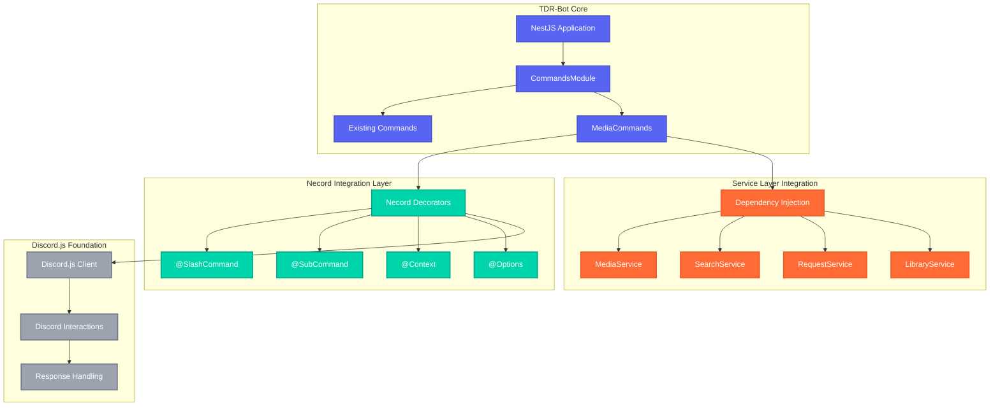
```mermaid
graph TB
    subgraph "TDR-Bot Core"
        App[NestJS Application] --> CommandsModule[CommandsModule]
        CommandsModule --> ExistingCommands[Existing Commands]
        CommandsModule --> MediaCommands[MediaCommands]
    end
    
    subgraph "Necord Integration Layer"
        MediaCommands --> Decorators[Necord Decorators]
        Decorators --> SlashCmd["@SlashCommand"]
        Decorators --> SubCmd["@SubCommand"]  
        Decorators --> Context["@Context"]
        Decorators --> Options["@Options"]
    end
    
    subgraph "Service Layer Integration"
        MediaCommands --> DI[Dependency Injection]
        DI --> MediaService[MediaService]
        DI --> SearchService[SearchService]
        DI --> RequestService[RequestService]
        DI --> LibraryService[LibraryService]
    end
    
    subgraph "Discord.js Foundation"
        Decorators --> DiscordJS[Discord.js Client]
        DiscordJS --> Interactions[Discord Interactions]
        Interactions --> Responses[Response Handling]
    end
    
    classDef core fill:#5865F2,stroke:#4752C4,stroke-width:2px,color:#fff
    classDef necord fill:#00D4AA,stroke:#00A085,stroke-width:2px,color:#fff
    classDef service fill:#FF6B35,stroke:#E55A2B,stroke-width:2px,color:#fff
    classDef discord fill:#9CA3AF,stroke:#6B7280,stroke-width:2px,color:#fff
    
    class App,CommandsModule,ExistingCommands,MediaCommands core
    class Decorators,SlashCmd,SubCmd,Context,Options necord
    class DI,MediaService,SearchService,RequestService,LibraryService service
    class DiscordJS,Interactions,Responses discord
```

**Design Decisions & Rationale:**

The integration strategy prioritizes consistency with existing TDR-Bot patterns over framework-specific optimizations. This decision ensures that developers familiar with the current codebase can immediately understand and contribute to the media command functionality without learning new architectural patterns. The approach also simplifies maintenance and reduces the risk of integration conflicts.

**Decorator Pattern Implementation:**

The media commands utilize Necord's decorator system to provide clean separation between Discord interaction handling and business logic. Commands are organized using the established `@SlashCommand` and `@SubCommand` patterns, with parameter handling through `@Options` decorators that provide automatic validation and type safety.

**Command Handler Interface:**

```typescript
interface IMediaCommandHandlers {
  onMediaSearch(context: SlashCommandContext, options: SearchOptions): Promise<void>;
  onRequestMovie(context: SlashCommandContext, options: RequestOptions): Promise<void>;
  onRequestTv(context: SlashCommandContext, options: RequestOptions): Promise<void>;
  onLibrary(context: SlashCommandContext, options: LibraryOptions): Promise<void>;
  onStatus(context: SlashCommandContext, options: MediaIdOptions): Promise<void>;
  onDelete(context: SlashCommandContext, options: MediaIdOptions): Promise<void>;
}
```

**Module Registration Architecture:**

The media commands integrate into the existing module structure through established NestJS patterns, ensuring proper dependency injection and service lifecycle management. The integration leverages existing infrastructure services such as logging, error handling, and configuration management.

**Context Handling Patterns:**

Command contexts provide structured access to Discord interaction data while maintaining type safety throughout the processing pipeline. The context interfaces extend existing TDR-Bot patterns to include media-specific information while preserving compatibility with established error handling and logging mechanisms.

**Integration Points:**

The Necord integration connects to existing TDR-Bot infrastructure through three primary touch points: the dependency injection container for service access, the logging infrastructure for operational monitoring, and the error handling system for consistent user experience. These integration points ensure that media commands benefit from existing operational capabilities while maintaining architectural consistency.

**Extensibility and Future Development:**

The integration architecture supports future expansion through established patterns. New commands can be added by implementing the same decorator patterns and service injection mechanisms, while new functionality can be introduced through additional service interfaces without modifying the command layer architecture.

### 3.4 Command DTOs and Type Safety

The command validation architecture implements a multi-layered approach to ensure type safety and input validation throughout the media command processing pipeline. The design leverages runtime validation frameworks while maintaining clear architectural boundaries between validation logic and business processing.

**Architectural Validation Philosophy:**

The validation system adopts a defense-in-depth strategy that validates input at multiple points: Discord's native validation, runtime schema validation, and business logic validation. This approach ensures that invalid data cannot propagate through the system while providing clear feedback to users about input requirements and constraints.

**Validation Pipeline Architecture:**

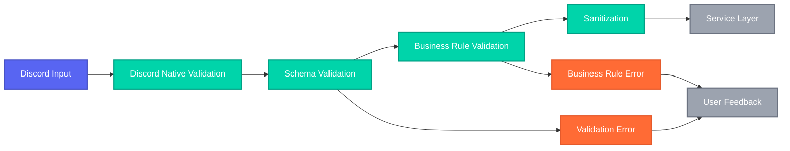
```mermaid
graph LR
    A[Discord Input] --> B[Discord Native Validation]
    B --> C[Schema Validation]
    C --> D[Business Rule Validation]
    D --> E[Sanitization]
    E --> F[Service Layer]
    
    C --> G[Validation Error]
    D --> H[Business Rule Error]
    
    G --> I[User Feedback]
    H --> I
    
    classDef input fill:#5865F2,stroke:#4752C4,stroke-width:2px,color:#fff
    classDef validation fill:#00D4AA,stroke:#00A085,stroke-width:2px,color:#fff
    classDef error fill:#FF6B35,stroke:#E55A2B,stroke-width:2px,color:#fff
    classDef output fill:#9CA3AF,stroke:#6B7280,stroke-width:2px,color:#fff
    
    class A input
    class B,C,D,E validation
    class G,H error
    class F,I output
```

**Design Decisions & Rationale:**

The validation architecture uses Zod schemas for runtime type validation, providing both compile-time type safety and runtime validation in a single system. This approach reduces the potential for type/validation mismatches while providing comprehensive error reporting. The multi-stage validation ensures that Discord limitations, security constraints, and business rules are all enforced consistently.

**Type Safety Strategy:**

The system employs TypeScript interfaces derived from validation schemas to ensure consistency between runtime validation and compile-time type checking. This approach eliminates the potential for drift between validation rules and type definitions while providing clear contracts for service layer interactions.

**Command Validation Interfaces:**

```typescript
interface ICommandValidationService {
  validateSearchCommand(input: unknown): SearchCommandDto;
  validateRequestCommand(input: unknown, type: MediaType): RequestCommandDto;
  validateLibraryCommand(input: unknown): LibraryCommandDto;
  validateComponentInteraction(customId: string): ComponentInteractionDto;
  validateModalSubmission(data: FormData): ModalSubmissionDto;
}

interface ValidationResult<T> {
  valid: boolean;
  data?: T;
  errors: ValidationError[];
}
```

**Input Sanitization Architecture:**

Input sanitization operates as a separate concern from validation, focusing on transforming potentially unsafe input into safe formats while preserving user intent. The sanitization layer handles common attack vectors and normalizes input formats before validation processing.

**Security Validation Patterns:**

The validation system implements security-first patterns that prevent common attack vectors including injection attacks, buffer overflows, and malformed data processing. All string inputs are length-limited, pattern-validated, and sanitized before processing to ensure system security.

**Error Handling Integration:**

Validation errors are classified and routed through the established error handling system, providing consistent user feedback and operational logging. The validation layer integrates with the broader error management architecture to ensure proper error recovery and user guidance.

**Performance Considerations:**

Validation operations are optimized for low latency through schema compilation and caching strategies. The validation pipeline is designed to fail fast, providing immediate feedback for invalid input while minimizing processing overhead for valid requests.

**Extensibility and Maintenance:**

The validation architecture supports extension through schema composition and inheritance patterns. New validation rules can be added through schema extension while maintaining backward compatibility. The clear separation between validation logic and business processing ensures that validation requirements can evolve independently of core functionality.

### 3.5 Permission and Validation Systems

The permission and validation architecture implements a multi-tiered security model that provides comprehensive access control while maintaining user experience quality. The system integrates Discord's native permission model with application-specific authorization rules to ensure secure resource usage.

**Security Architecture Philosophy:**

The permission system adopts a defense-in-depth approach with multiple validation layers: Discord platform permissions, application-level authorization, and operation-specific permissions. This layered approach ensures that security breaches at any single level cannot compromise system integrity while maintaining transparent user feedback about access limitations.

**Permission Architecture Visualization:**

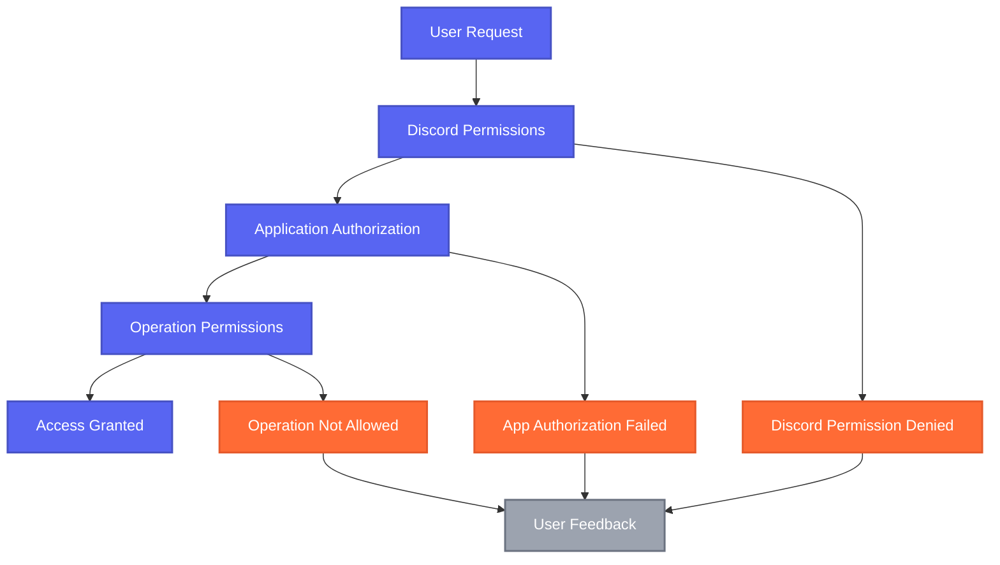
```mermaid
graph TD
    A[User Request] --> B[Discord Permissions]
    B --> C[Application Authorization]
    C --> D[Operation Permissions]
    D --> F[Access Granted]
    
    B --> G[Discord Permission Denied]
    C --> H[App Authorization Failed]
    D --> I[Operation Not Allowed]
    
    G --> K[User Feedback]
    H --> K
    I --> K
    
    classDef permission fill:#5865F2,stroke:#4752C4,stroke-width:2px,color:#fff
    classDef denied fill:#FF6B35,stroke:#E55A2B,stroke-width:2px,color:#fff
    classDef feedback fill:#9CA3AF,stroke:#6B7280,stroke-width:2px,color:#fff
    
    class A,B,C,D,F permission
    class G,H,I denied
    class K feedback
```

**Design Decisions & Rationale:**

The permission architecture prioritizes explicit authorization over implicit access, requiring clear permission checks at each operation level. This approach ensures that new operations are secure by default and that permission requirements are clearly documented and enforceable. The separation between Discord permissions and application permissions allows for flexible authorization policies that can evolve independently of platform constraints.

**Multi-Level Authorization Strategy:**

The system implements authorization at three distinct levels: platform permissions ensure Discord API access, application permissions control feature access, and operation permissions govern specific actions. Each level serves a specific security purpose while contributing to overall system protection.

**Permission Service Interfaces:**

```typescript
interface IPermissionService {
  validateUserPermissions(interaction: Interaction, operation: MediaOperation): Promise<PermissionResult>;
  checkOperationPermissions(userId: string, operation: MediaOperation): Promise<PermissionResult>;
}

interface PermissionResult {
  allowed: boolean;
  reason?: string;
  code?: string;
}
```

**Input Validation Architecture:**

Input validation ensures all user data is properly sanitized and validated before processing. The system implements comprehensive validation for all user interactions while maintaining a responsive user experience appropriate for a personal homelab environment.

**Validation Service Architecture:**

Input validation operates independently of permission checking, focusing on data integrity and security rather than authorization. The validation system provides comprehensive error reporting that guides users toward correct input formats while preventing malicious input from reaching business logic components.

**Integration with Discord Permission Model:**

The system leverages Discord's native permissions for platform-level access control while extending them with application-specific rules. This approach ensures compatibility with Discord's permission model while providing the flexibility needed for complex media management operations.

**Security Considerations:**

All permission checks are performed server-side with no reliance on client-side validation. Permission results are logged for security monitoring, and access patterns are analyzed for abuse detection. The system implements graceful degradation when permission services are unavailable, defaulting to secure denial rather than permissive access.

**Extensibility and Configuration:**

The permission architecture supports dynamic configuration through role-based access control patterns that can be extended without code changes. New operations can be added to the permission system through configuration updates, while maintaining backward compatibility with existing permission policies.

### 3.6 Command Routing and Handler Flow

The command routing system provides a structured approach to handling Discord interactions, routing them through appropriate validation, processing, and response generation stages. The flow integrates seamlessly with the service layer while maintaining clear separation of concerns.

**Command Execution Flow:**

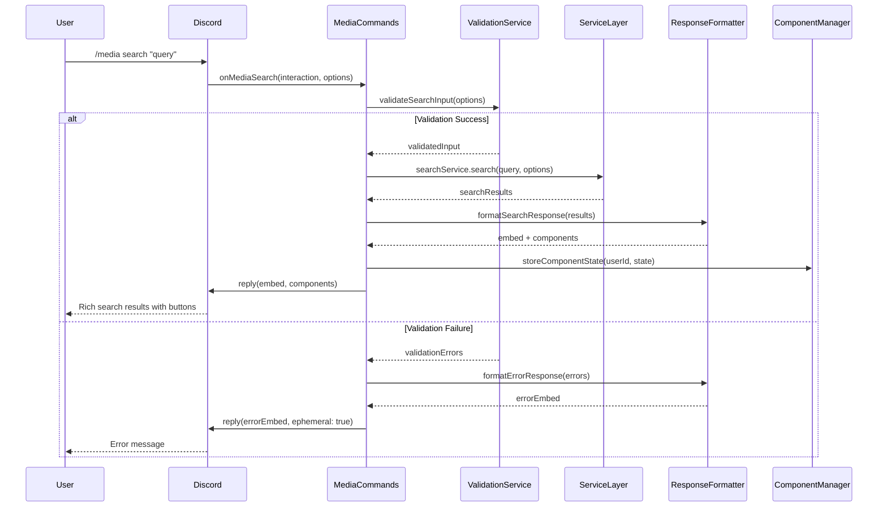
```mermaid
sequenceDiagram
    participant User
    participant Discord
    participant MediaCommands
    participant ValidationService
    participant ServiceLayer
    participant ResponseFormatter
    participant ComponentManager

    User->>Discord: /media search "query"
    Discord->>MediaCommands: onMediaSearch(interaction, options)
    MediaCommands->>ValidationService: validateSearchInput(options)
    
    alt Validation Success
        ValidationService-->>MediaCommands: validatedInput
        MediaCommands->>ServiceLayer: searchService.search(query, options)
        ServiceLayer-->>MediaCommands: searchResults
        MediaCommands->>ResponseFormatter: formatSearchResponse(results)
        ResponseFormatter-->>MediaCommands: embed + components
        MediaCommands->>ComponentManager: storeComponentState(userId, state)
        MediaCommands->>Discord: reply(embed, components)
        Discord-->>User: Rich search results with buttons
    else Validation Failure
        ValidationService-->>MediaCommands: validationErrors
        MediaCommands->>ResponseFormatter: formatErrorResponse(errors)
        ResponseFormatter-->>MediaCommands: errorEmbed
        MediaCommands->>Discord: reply(errorEmbed, ephemeral: true)
        Discord-->>User: Error message
    end
```

**Design Decisions & Rationale:**

The command routing architecture implements a pipeline pattern that ensures consistent processing across all media commands while maintaining flexibility for command-specific requirements. The design prioritizes reliability and observability through comprehensive logging and error handling at each stage of the pipeline.

**Service Integration Architecture:**

Command handlers act as orchestration points that coordinate multiple service layer components to fulfill user requests. The architecture ensures that commands remain stateless while maintaining clear separation between presentation logic (Discord formatting) and business logic (media operations).

**Command Handler Interface Definitions:**

```typescript
interface ICommandHandler {
  validatePermissions(interaction: Interaction, operation: string): Promise<boolean>;
  validateInput(input: unknown, schema: ValidationSchema): Promise<ValidationResult>;
  executeOperation(validatedInput: any, context: CommandContext): Promise<OperationResult>;
  formatResponse(result: OperationResult, context: CommandContext): Promise<DiscordResponse>;
  handleErrors(error: Error, context: CommandContext): Promise<void>;
}

interface CommandExecutionPipeline {
  preExecute(context: CommandContext): Promise<void>;
  execute(context: CommandContext): Promise<CommandResult>;
  postExecute(context: CommandContext, result: CommandResult): Promise<void>;
}
```

**Response Formatting Architecture:**

Response formatting operates as a separate architectural concern that transforms service layer results into Discord-compatible formats. The formatting layer handles Discord-specific constraints such as embed limits, component restrictions, and message size limitations while maintaining consistent user experience patterns.

**Error Handling Integration:**

Command-level error handling integrates with the broader error management system to provide consistent user feedback and operational logging. Errors are classified at the command level and routed through appropriate response channels based on their type and severity.

**State Management Strategy:**

Command execution maintains minimal state requirements, relying on external services for data persistence and Discord interactions for user session management. This approach ensures scalability while simplifying the command handler architecture.

**Performance and Monitoring Considerations:**

The command routing system implements comprehensive monitoring through structured logging and metrics collection. Each command execution is tracked from initiation to completion, providing visibility into performance patterns and error rates. This monitoring approach supports operational excellence and system optimization.

### 3.7 Interaction Component Integration

The interaction component system provides rich user interfaces through Discord's native components, enabling complex workflows while maintaining state across multiple user interactions. The architecture implements structured component lifecycle management with automatic state cleanup and comprehensive error handling.

**Component Handler Architecture Interface:**

```typescript
interface IComponentInteractionHandler {
  handleButtonInteraction(interaction: ButtonInteraction): Promise<void>;
  handleSelectMenuInteraction(interaction: StringSelectMenuInteraction): Promise<void>;
  handleModalSubmit(interaction: ModalSubmitInteraction): Promise<void>;
}

interface IComponentStateManager {
  storeComponentState(userId: string, messageId: string, state: ComponentState): Promise<string>;
  getComponentState(userId: string, messageId: string): Promise<ComponentState | undefined>;
  updateComponentState(userId: string, messageId: string, updates: Partial<ComponentState>): Promise<void>;
  cleanupExpiredStates(): Promise<void>;
}
```

**Component Integration Patterns:**

The component system operates through a centralized handler managing three interaction types: button clicks for actions (info, request, play, delete), select menus for media selection with dynamic button enabling, and modal submissions for complex TV show requests. All components use standardized custom ID encoding (`media_action_type_id_context_page`) respecting Discord's 100-character limitations.

**State Management Strategy:**

Component state is maintained in-memory using Map-based storage with composite keys (userId_messageId), 15-minute TTL with automatic cleanup timers, and atomic updates with conflict resolution. The system implements automatic garbage collection of expired states to prevent memory leaks while supporting concurrent user interactions.

**TDR-Bot Infrastructure Integration:**

Component interactions integrate with existing patterns through NestJS dependency injection, structured logging with context correlation, established error classification patterns, and Discord permission model integration. All component data is validated before processing with user authorization verification ensuring users can only interact with their own components.

### 3.8 Error Handling and Response Patterns

The error handling system provides comprehensive error classification, user-friendly responses, and recovery mechanisms while maintaining system stability and providing clear feedback to users. The architecture extends TDR-Bot's established error handling patterns with media-specific error scenarios and recovery strategies.

**Error Handler Architecture Interface:**

```typescript
interface IErrorHandler {
  handleCommandError(interaction: Interaction, error: Error, context?: ErrorContext): Promise<void>;
  handleValidationError(interaction: Interaction, errors: ValidationError[]): Promise<void>;
  handleServiceError(interaction: Interaction, service: string, error: ServiceError): Promise<void>;
  handlePermissionError(interaction: Interaction, operation: string, reason: string): Promise<void>;
}

interface IErrorResponseFormatter {
  createErrorEmbed(title: string, description: string, errorType: MediaErrorType): EmbedBuilder;
  createValidationErrorEmbed(errors: ValidationError[]): EmbedBuilder;
  createServiceUnavailableEmbed(serviceName: string, retryTime?: number): EmbedBuilder;
  createPermissionDeniedEmbed(operation: string, reason: string): EmbedBuilder;
}
```

**Error Classification Strategy:**

The system implements hierarchical error classification categorizing errors by source, severity, and recovery potential: user input errors (validation failures, invalid media IDs), permission errors (authorization failures, unauthorized interactions), external service errors (API timeouts, service unavailability), media-specific errors (media not found, duplicate requests, download failures), and system errors (component state corruption, Discord API errors).

**User Experience Patterns:**

Error responses provide immediate feedback through Discord embeds with clear explanations, progressive disclosure with appropriate detail levels for users versus administrators, actionable guidance including specific resolution suggestions and retry instructions, and comprehensive error context with correlation IDs for debugging support.

**Recovery Architecture:**

The system implements intelligent retry mechanisms with exponential backoff, circuit breaker patterns for external service failures, graceful degradation triggering fallback operations, and automatic retry for transient failures (up to 3 times) while providing clear retry guidance for non-automatic failures.

**TDR-Bot Infrastructure Integration:**

Error handling leverages existing TDR-Bot infrastructure through established Pino logging patterns with structured context, integration with existing error rate monitoring and alerting, extension of existing error types while maintaining compatibility, and established Discord response formatting patterns.

---

## 4. Service Layer Design

> **Requirements Reference**: For functional specifications and user workflows, see [PRD Section 4.1 Core Features](./tdr-media-prd.md#41-core-features).

### 4.1 Service Layer Architecture Overview

The service layer functions as the orchestration hub between Discord command handlers and external API integrations, implementing business logic coordination, workflow management, and cross-service communication patterns. This layer abstracts complex multi-API operations into cohesive service interfaces while maintaining integration with existing TDR-Bot architectural patterns.

**Service Layer Responsibilities:**

- **Command Orchestration**: Transform Discord command inputs into coordinated multi-service operations
- **Workflow Management**: Handle complex operations requiring multiple API calls and state coordination
- **Business Logic Implementation**: Apply media management rules, duplicate detection, and user permission validation
- **Error Aggregation**: Collect and normalize errors from multiple external services into coherent user feedback
- **State Coordination**: Manage temporary operation state and component lifecycle integration

**Integration with TDR-Bot Architecture:**

The service layer extends TDR-Bot's established NestJS patterns through dedicated MediaModule integration, utilizing existing dependency injection containers, structured logging with correlation IDs, configuration management systems, and error handling infrastructure. This approach ensures operational consistency while introducing media-specific capabilities.

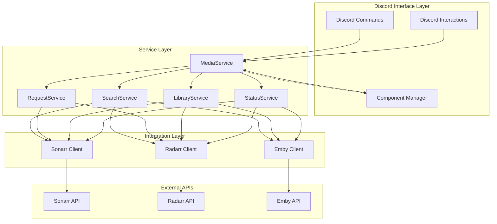
```mermaid
graph TB
    subgraph "Discord Interface Layer"
        DC[Discord Commands]
        DI[Discord Interactions]
        CM[Component Manager]
    end
    
    subgraph "Service Layer"
        MS[MediaService]
        SS[SearchService]
        RS[RequestService]
        LS[LibraryService]
        STS[StatusService]
    end
    
    subgraph "Integration Layer"
        SC[Sonarr Client]
        RC[Radarr Client]
        EC[Emby Client]
    end
    
    subgraph "External APIs"
        SA[Sonarr API]
        RA[Radarr API]
        EA[Emby API]
    end
    
    DC --> MS
    DI --> MS
    CM --> MS
    
    MS --> SS
    MS --> RS
    MS --> LS
    MS --> STS
    
    SS --> SC
    SS --> RC
    SS --> EC
    
    RS --> SC
    RS --> RC
    
    LS --> SC
    LS --> RC
    LS --> EC
    
    STS --> SC
    STS --> RC
    STS --> EC
    
    SC --> SA
    RC --> RA
    EC --> EA
    
    MS -.-> CM
```

**Service Boundaries and Responsibilities:**

| Service | Primary Responsibility | External APIs | Component Integration |
|---------|------------------------|---------------|----------------------|
| MediaService | Cross-service orchestration, workflow coordination | All (via other services) | Direct component lifecycle management |
| SearchService | Multi-API search aggregation, result normalization | Sonarr, Radarr, Emby | Search result pagination |
| RequestService | Download request management, duplicate detection | Sonarr, Radarr | Request confirmation workflows |
| LibraryService | Content browsing, availability checking | Sonarr, Radarr, Emby | Library browsing pagination |
| StatusService | Progress monitoring, queue status | Sonarr, Radarr | Real-time status updates |

### 4.2 Core Service Interfaces

#### 4.2.1 MediaService - Primary Orchestration

The MediaService serves as the main coordination point for complex multi-service operations, managing workflow orchestration and component state integration.

```typescript
interface MediaService {
  searchMedia(query: string, type?: MediaType): Promise<SearchResultSet>;
  requestMedia(mediaId: string, options: RequestOptions): Promise<RequestResult>;
  getLibraryContent(type: MediaType, filters: LibraryFilters): Promise<LibraryContent>;
  getMediaStatus(mediaId: string): Promise<MediaStatus>;
  handleComponentInteraction(interaction: ComponentInteraction): Promise<InteractionResponse>;
}
```

**Key Responsibilities:**
- Coordinate complex workflows involving multiple external APIs
- Manage Discord component lifecycle and state transitions
- Implement business logic for media management operations
- Provide unified error handling and user feedback coordination
- Handle cross-service operations like search-to-request workflows

#### 4.2.2 SearchService - Multi-API Search Aggregation

The SearchService aggregates search results from Sonarr, Radarr, and Emby APIs, implementing result normalization and deduplication patterns.

```typescript
interface SearchService {
  searchAll(query: string): Promise<UnifiedSearchResults>;
  searchMovies(query: string): Promise<MovieSearchResults>;
  searchTVShows(query: string): Promise<TVSearchResults>;
  searchLibrary(query: string): Promise<LibrarySearchResults>;
  normalizeResults(results: ExternalSearchResults[]): Promise<NormalizedResults>;
}
```

**Implementation Patterns:**
- Concurrent API queries with configurable timeout handling
- Result normalization to unified data models with metadata preservation
- Deduplication logic based on external IDs (TMDB, TVDB, IMDB)
- Pagination support for large result sets with Discord embed optimization
- Real-time availability status integration through library API queries

#### 4.2.3 RequestService - Download Request Management

The RequestService manages download requests to Sonarr and Radarr with comprehensive duplicate detection and lifecycle tracking.

```typescript
interface RequestService {
  submitRequest(media: MediaItem, options: RequestOptions): Promise<RequestResult>;
  checkDuplicates(media: MediaItem): Promise<DuplicateStatus>;
  getRequestStatus(requestId: string): Promise<RequestStatus>;
  cancelRequest(requestId: string): Promise<CancelResult>;
  validateRequest(media: MediaItem): Promise<ValidationResult>;
}
```

**Duplicate Detection Strategy:**
- Real-time API queries to check existing downloads and requests
- Cross-service duplicate detection (Sonarr queue vs Radarr queue)
- Library availability verification through Emby API integration
- Request validation including quality profile and root folder verification

#### 4.2.4 LibraryService - Content Browsing Coordination

The LibraryService provides unified access to existing media content across all external services with advanced filtering and browsing capabilities.

```typescript
interface LibraryService {
  browseContent(type: MediaType, filters: BrowseFilters): Promise<ContentCollection>;
  getContentDetails(contentId: string): Promise<ContentDetails>;
  searchLibrary(query: string, type?: MediaType): Promise<LibrarySearchResults>;
  getRecentlyAdded(limit: number): Promise<RecentContent>;
  getContentStatistics(): Promise<LibraryStatistics>;
}
```

**Content Coordination Features:**
- Unified browsing across Sonarr, Radarr, and Emby libraries
- Advanced filtering with quality, release date, and genre support
- Recently added content aggregation with cross-service timeline integration
- Content availability status with real-time file verification

#### 4.2.5 StatusService - Progress Monitoring

The StatusService provides real-time monitoring of download progress, queue status, and system health across all external services.

```typescript
interface StatusService {
  getDownloadProgress(mediaId: string): Promise<DownloadProgress>;
  getQueueStatus(): Promise<QueueStatus>;
  getSystemHealth(): Promise<SystemHealth>;
  monitorProgress(mediaId: string, callback: ProgressCallback): Promise<void>;
  getRecentActivity(hours: number): Promise<ActivitySummary>;
}
```

**Monitoring Capabilities:**
- Real-time download progress tracking with percentage and ETA calculation
- Queue position monitoring with automatic updates
- System health aggregation across all external services
- Background progress monitoring with Discord component updates

### 4.3 Service Implementation Patterns

#### 4.3.1 NestJS Integration Patterns

Services integrate with existing TDR-Bot infrastructure through established NestJS dependency injection patterns and module organization.

```typescript
@Injectable()
export class MediaService {
  constructor(
    private readonly searchService: SearchService,
    private readonly requestService: RequestService,
    private readonly libraryService: LibraryService,
    private readonly statusService: StatusService,
    private readonly logger: Logger,
    private readonly configService: ConfigService
  ) {}
}
```

**Dependency Injection Integration:**
- Utilize existing ConfigService for API configuration and credentials
- Integrate with established Logger infrastructure using correlation IDs
- Leverage existing error handling and monitoring service patterns
- Extend current health check system with media service monitoring

#### 4.3.2 Error Handling Integration

Error handling extends existing TDR-Bot patterns with media-specific error classification and recovery strategies.

```typescript
export class MediaErrorHandler extends BaseErrorHandler {
  handleServiceError(error: ServiceError): UserFeedback {
    return this.classifyError(error)
      .withRetryStrategy()
      .withUserMessage()
      .withLogging();
  }
}
```

**Error Handling Patterns:**
- Extend existing error classification system with media-specific error types
- Implement circuit breaker patterns for external API resilience
- Provide graceful degradation strategies maintaining partial functionality
- Generate structured error responses compatible with Discord component updates

#### 4.3.3 Structured Logging Integration

Logging follows established TDR-Bot Pino patterns with media operation context and correlation ID tracking.

```typescript
export class MediaLogger extends BaseLogger {
  logMediaOperation(operation: string, context: MediaContext): void {
    this.logger.info({
      operation,
      mediaId: context.mediaId,
      mediaType: context.type,
      correlationId: context.correlationId,
      userId: context.userId,
      timestamp: new Date().toISOString()
    }, `Media operation: ${operation}`);
  }
}
```

**Logging Enhancements:**
- Media-specific context including media IDs, types, and user information
- Operation tracking for complex multi-step workflows
- Performance metrics for external API response times
- Error correlation across service boundaries for debugging complex failures

#### 4.3.4 Homelab Resource Management

Services implement resource-conscious patterns optimized for homelab deployment constraints with efficient resource utilization.

```typescript
export class ResourceManager {
  private readonly maxConcurrentRequests = 5;
  private readonly requestQueue = new RequestQueue();
  
  async executeWithResourceLimit<T>(operation: () => Promise<T>): Promise<T> {
    return this.requestQueue.add(operation);
  }
}
```

**Resource Optimization Patterns:**
- Connection pooling for external API clients with configurable limits
- Request queuing to prevent API rate limit violations
- Memory-conscious result caching with automatic cleanup
- Background processing for long-running operations to prevent Discord timeout

### 4.4 Service Coordination and Orchestration

#### 4.4.1 Workflow Orchestration Patterns

Complex operations requiring multiple service coordination implement structured workflow patterns with comprehensive state management.

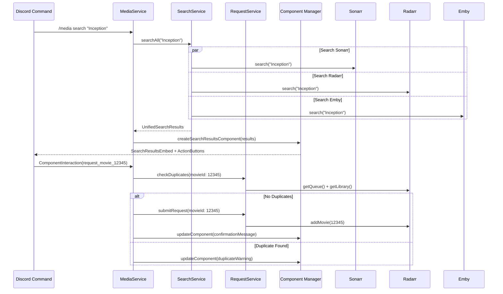
```mermaid
sequenceDiagram
    participant DC as Discord Command
    participant MS as MediaService
    participant SS as SearchService
    participant RS as RequestService
    participant CM as Component Manager
    
    DC->>MS: /media search "Inception"
    MS->>SS: searchAll("Inception")
    
    par Search Sonarr
        SS->>Sonarr: search("Inception")
    and Search Radarr  
        SS->>Radarr: search("Inception")
    and Search Emby
        SS->>Emby: search("Inception")
    end
    
    SS-->>MS: UnifiedSearchResults
    MS->>CM: createSearchResultsComponent(results)
    CM-->>DC: SearchResultsEmbed + ActionButtons
    
    DC->>MS: ComponentInteraction(request_movie_12345)
    MS->>RS: checkDuplicates(movieId: 12345)
    RS->>Radarr: getQueue() + getLibrary()
    
    alt No Duplicates
        MS->>RS: submitRequest(movieId: 12345)
        RS->>Radarr: addMovie(12345)
        MS->>CM: updateComponent(confirmationMessage)
    else Duplicate Found
        MS->>CM: updateComponent(duplicateWarning)
    end
```

**Orchestration Capabilities:**
- Multi-step workflow coordination with checkpoint recovery
- Parallel API operations with result aggregation and error handling
- Component state transitions with user feedback integration
- Background processing for long-running operations with progress updates

#### 4.4.2 State Management Integration

Service-level state management coordinates with component state manager for complex user interactions and workflow persistence.

```typescript
export class WorkflowStateManager {
  private readonly activeWorkflows = new Map<string, WorkflowState>();
  
  async initiateWorkflow(workflowId: string, initialState: WorkflowState): Promise<void> {
    this.activeWorkflows.set(workflowId, initialState);
    this.scheduleCleanup(workflowId, 15 * 60 * 1000); // 15 minutes
  }
  
  async updateWorkflowState(workflowId: string, update: Partial<WorkflowState>): Promise<void> {
    const currentState = this.activeWorkflows.get(workflowId);
    if (currentState) {
      this.activeWorkflows.set(workflowId, { ...currentState, ...update });
    }
  }
}
```

**State Coordination Features:**
- Workflow state persistence for multi-step operations
- Automatic cleanup integration with component lifecycle management
- State recovery mechanisms for interrupted operations
- Cross-service state sharing for complex coordination scenarios

#### 4.4.3 Cross-Service Communication

Services communicate through well-defined interfaces with event-driven patterns for loosely coupled coordination.

```typescript
export class ServiceEventBus {
  async publishEvent(event: ServiceEvent): Promise<void> {
    const handlers = this.getHandlersForEvent(event.type);
    await Promise.all(handlers.map(handler => handler.handle(event)));
  }
}

// Example events
interface MediaRequestedEvent extends ServiceEvent {
  type: 'media.requested';
  payload: { mediaId: string; userId: string; requestOptions: RequestOptions };
}

interface DownloadCompletedEvent extends ServiceEvent {
  type: 'download.completed';
  payload: { mediaId: string; filePath: string; quality: string };
}
```

**Communication Patterns:**
- Event-driven architecture for service decoupling
- Async operation coordination with callback registration
- Service health monitoring with cross-service dependency tracking
- Centralized event logging for workflow debugging and audit trails

#### 4.4.4 Background Processing Coordination

Long-running operations utilize background processing patterns integrated with Discord component lifecycle management.

```typescript
export class BackgroundProcessor {
  private readonly activeJobs = new Map<string, ProcessingJob>();
  
  async startMonitoring(mediaId: string, componentId: string): Promise<void> {
    const job = new ProgressMonitoringJob(mediaId, componentId);
    this.activeJobs.set(mediaId, job);
    
    job.onProgress((progress) => {
      this.componentManager.updateComponent(componentId, {
        progress: `${progress.percentage}% - ${progress.eta}`
      });
    });
    
    job.onComplete(() => {
      this.componentManager.updateComponent(componentId, {
        status: 'Download Complete',
        actions: ['view_library', 'download_another']
      });
    });
  }
}
```

**Background Processing Features:**
- Progress monitoring with real-time Discord component updates
- Job queuing with priority handling for user-initiated operations
- Automatic cleanup of completed or failed background operations
- Integration with existing component lifecycle for user feedback

### 4.5 Integration with Existing TDR-Bot Architecture

#### 4.5.1 MediaModule Integration

The MediaModule integrates seamlessly into existing TDR-Bot application structure through established NestJS module patterns and dependency injection.

```typescript
@Module({
  imports: [
    ConfigModule,
    LoggerModule,
    HttpModule,
    NecordModule.forFeature()
  ],
  providers: [
    MediaService,
    SearchService,
    RequestService,
    LibraryService,
    StatusService,
    SonarrClient,
    RadarrClient,
    EmbyClient,
    MediaErrorHandler,
    ComponentStateManager
  ],
  exports: [MediaService]
})
export class MediaModule {}
```

**Module Integration Features:**
- Seamless integration with existing ConfigModule for API credentials and settings
- Utilization of established LoggerModule with correlation ID support
- Extension of current HttpModule patterns for external API communication
- Integration with NecordModule for Discord slash command and component registration

#### 4.5.2 Infrastructure Reuse Patterns

Media services leverage existing TDR-Bot infrastructure components to maintain operational consistency and reduce implementation complexity.

**Configuration Management:**
- Extend existing configuration validation patterns with media-specific settings
- Utilize established environment variable loading and validation systems  
- Integrate with current configuration hot-reload capabilities for development
- Maintain configuration documentation standards for operational consistency

**Error Handling Infrastructure:**
- Extend existing error classification system with media-specific error types
- Utilize established Discord error response formatting and user feedback patterns
- Integrate with current monitoring and alerting infrastructure for operations
- Maintain existing log aggregation and analysis patterns for debugging

**HTTP Client Patterns:**
- Extend existing HTTP client configuration with media API specific settings
- Utilize established retry logic and circuit breaker patterns for resilience
- Integrate with current request logging and metrics collection systems
- Maintain existing timeout and connection pooling configurations

#### 4.5.3 Operational Consistency

Media services maintain operational consistency with existing TDR-Bot patterns through standardized interfaces and shared infrastructure utilization.

**Command Registration Patterns:**
Media commands follow established Necord patterns for slash command registration, parameter validation, and response handling, ensuring consistent user experience across all bot functionality.

**Logging and Monitoring Integration:**
All media operations integrate with existing Pino logging infrastructure, utilizing established correlation ID patterns, structured log formatting, and existing log aggregation systems for operational visibility.

**Health Check Integration:**
Media services extend existing health check endpoints with service-specific monitoring, external API health verification, and integration with current monitoring dashboards and alerting systems.

#### 4.5.4 Homelab-Specific Performance Optimizations

Service implementation includes homelab-specific optimizations that account for resource constraints and network characteristics typical of personal infrastructure deployments.

**Resource Management:**
- Memory-conscious service initialization with lazy loading patterns
- CPU usage optimization through efficient concurrent operation limiting
- Connection pooling tuned for homelab network characteristics and API rate limits
- Background processing designed to operate within homelab resource constraints

**Network Optimization:**
- Configurable timeout values optimized for variable homelab network latency
- Request batching strategies to minimize API call frequency and bandwidth usage
- Efficient caching patterns for frequently accessed data with automatic cleanup
- Graceful degradation strategies that maintain core functionality during network issues

**Deployment Integration:**
- Integration with existing Docker deployment patterns and resource limit configurations
- Compatibility with current backup and restore procedures for operational data
- Support for existing deployment automation and configuration management systems
- Integration with established monitoring and log collection infrastructure for operations

---

## 5. Integration Layer (API Clients)

> **Requirements Reference**: For functional specifications and user workflows, see [PRD Section 4.2 Technical Requirements](./tdr-media-prd.md#42-technical-requirements).

### 5.1 API Integration Architecture

The integration layer implements a layered architecture that abstracts external media management APIs (Sonarr, Radarr, and Emby) through dedicated service clients. The design prioritizes real-time data accuracy, service resilience, and unified response handling while maintaining clear separation of concerns between API communication and business logic.

**Integration Architecture Overview:**

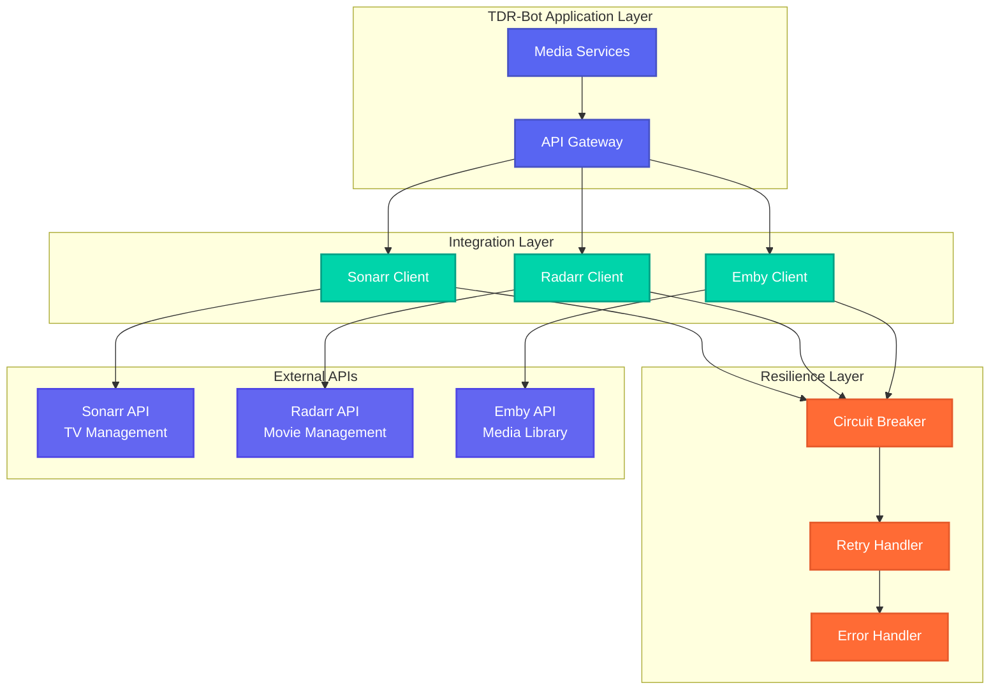
```mermaid
graph TB
    subgraph "TDR-Bot Application Layer"
        Services[Media Services]
        Gateway[API Gateway]
    end
    
    subgraph "Integration Layer"
        SonarrClient[Sonarr Client]
        RadarrClient[Radarr Client]
        EmbyClient[Emby Client]
    end
    
    subgraph "Resilience Layer"
        CircuitBreaker[Circuit Breaker]
        RetryHandler[Retry Handler]
        ErrorHandler[Error Handler]
    end
    
    subgraph "External APIs"
        SonarrAPI[Sonarr API<br/>TV Management]
        RadarrAPI[Radarr API<br/>Movie Management]
        EmbyAPI[Emby API<br/>Media Library]
    end
    
    Services --> Gateway
    Gateway --> SonarrClient
    Gateway --> RadarrClient
    Gateway --> EmbyClient
    
    SonarrClient --> CircuitBreaker
    RadarrClient --> CircuitBreaker
    EmbyClient --> CircuitBreaker
    
    CircuitBreaker --> RetryHandler
    RetryHandler --> ErrorHandler
    
    SonarrClient --> SonarrAPI
    RadarrClient --> RadarrAPI
    EmbyClient --> EmbyAPI
    
    classDef app fill:#5865F2,stroke:#4752C4,stroke-width:2px,color:#fff
    classDef integration fill:#00D4AA,stroke:#00A085,stroke-width:2px,color:#fff
    classDef resilience fill:#FF6B35,stroke:#E55A2B,stroke-width:2px,color:#fff
    classDef external fill:#6366F1,stroke:#4F46E5,stroke-width:2px,color:#fff
    
    class Services,Gateway app
    class SonarrClient,RadarrClient,EmbyClient integration
    class CircuitBreaker,RetryHandler,ErrorHandler resilience
    class SonarrAPI,RadarrAPI,EmbyAPI external
```

**Core Integration Principles:**

- **Real-time Data Strategy**: Always fetch fresh data from external APIs to ensure accuracy for library availability status, download queue/progress, and request status
- **Direct API Integration**: External metadata searches and static media information fetched fresh without caching to guarantee current state
- **Live Duplicate Detection**: Query Sonarr/Radarr APIs directly to check for existing requests and downloads, preventing unnecessary duplicate processing
- **Service Isolation**: Each API client handles authentication, rate limiting, and error handling independently to prevent cascade failures
- **Layered Resilience**: Circuit breaker and retry patterns provide fault tolerance without compromising system stability

**Architectural Design Decisions:**

The integration layer adopts a dedicated client pattern rather than a generic HTTP wrapper approach. This design choice provides several key benefits: type-safe API interactions with compile-time validation, service-specific error handling tailored to each API's behavior patterns, independent authentication and configuration management per service, and simplified testing through focused client responsibilities.

**Configuration and Service Discovery:**

Integration clients utilize environment-based configuration following TDR-Bot established patterns, with API endpoints, authentication keys, and timeout settings managed through the existing ConfigService. This approach ensures consistent credential management while supporting different deployment environments (development vs production) without code changes.

### 5.1.3 Proactive Rate Limiting Strategy

The integration layer implements comprehensive rate limiting architecture that proactively manages API request rates to prevent service degradation and ensure optimal resource utilization across all external services. This approach prioritizes homelab stability and external service relationship management.

**Rate Limiting Architecture Overview:**

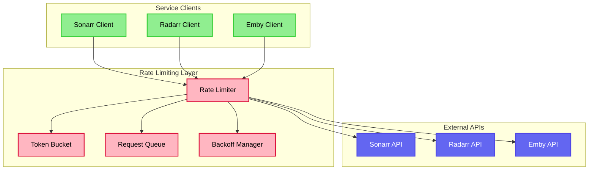
```mermaid
graph TB
    subgraph "Rate Limiting Layer"
        RateLimiter[Rate Limiter]
        TokenBucket[Token Bucket]
        RequestQueue[Request Queue]
        BackoffManager[Backoff Manager]
    end
    
    subgraph "Service Clients"
        SonarrClient[Sonarr Client]
        RadarrClient[Radarr Client]
        EmbyClient[Emby Client]
    end
    
    subgraph "External APIs"
        SonarrAPI[Sonarr API]
        RadarrAPI[Radarr API]
        EmbyAPI[Emby API]
    end
    
    SonarrClient --> RateLimiter
    RadarrClient --> RateLimiter
    EmbyClient --> RateLimiter
    
    RateLimiter --> TokenBucket
    RateLimiter --> RequestQueue
    RateLimiter --> BackoffManager
    
    RateLimiter --> SonarrAPI
    RateLimiter --> RadarrAPI
    RateLimiter --> EmbyAPI
    
    classDef rateLimit fill:#FFB6C1,stroke:#DC143C,stroke-width:2px,color:#000
    classDef client fill:#90EE90,stroke:#32CD32,stroke-width:2px,color:#000
    classDef external fill:#6366F1,stroke:#4F46E5,stroke-width:2px,color:#fff
    
    class RateLimiter,TokenBucket,RequestQueue,BackoffManager rateLimit
    class SonarrClient,RadarrClient,EmbyClient client
    class SonarrAPI,RadarrAPI,EmbyAPI external
```

**Rate Limiting Interface Contracts:**

The rate limiting system provides comprehensive interfaces for managing request flow and service protection:

```typescript
interface IRateLimiter {
  acquirePermit(serviceId: string, operation: string): Promise<RateLimitPermit>;
  releasePermit(permit: RateLimitPermit): Promise<void>;
  getServiceLimits(serviceId: string): ServiceRateLimits;
  updateServiceLimits(serviceId: string, limits: ServiceRateLimits): Promise<void>;
  getMetrics(serviceId: string): RateLimitMetrics;
}

interface RateLimitPermit {
  id: string;
  serviceId: string;
  operation: string;
  acquiredAt: Date;
  expiresAt: Date;
  cost: number;
}

interface ServiceRateLimits {
  requestsPerSecond: number;
  requestsPerMinute: number;
  requestsPerHour: number;
  burstCapacity: number;
  backoffMultiplier: number;
  maxBackoffDelay: number;
  operationLimits: Record<string, OperationRateLimit>;
}

interface OperationRateLimit {
  ratePerSecond: number;
  priority: RequestPriority;
  cost: number;
  maxConcurrent: number;
}

enum RequestPriority {
  LOW = 1,
  NORMAL = 2,
  HIGH = 3,
  URGENT = 4
}

interface RateLimitMetrics {
  totalRequests: number;
  allowedRequests: number;
  throttledRequests: number;
  averageWaitTime: number;
  currentTokens: number;
  lastResetTime: Date;
}
```

**Adaptive Rate Limiting Strategy:**

The system implements intelligent rate limiting that adapts to external service behavior and homelab usage patterns:

- **Service-Specific Limits**: Each external API has customized rate limits based on documented API constraints and observed behavior patterns
- **Dynamic Adjustment**: Rate limits automatically adjust based on response times, error rates, and service health indicators
- **Priority-Based Queuing**: Critical operations (user-initiated searches) receive higher priority over background operations (periodic updates)
- **Burst Handling**: Token bucket algorithm allows short-term burst capacity while maintaining overall rate compliance
- **Backoff Coordination**: Intelligent backoff strategies coordinate with circuit breaker patterns to prevent cascade failures

**Homelab-Optimized Configuration:**

Rate limiting configuration is optimized for typical homelab usage patterns and resource constraints:

```typescript
interface HomelabRateConfig {
  // Conservative defaults for stable operation
  sonarrLimits: ServiceRateLimits;
  radarrLimits: ServiceRateLimits;
  embyLimits: ServiceRateLimits;
  
  // Homelab-specific optimizations
  preferenceForReliability: boolean;      // Favor stability over speed
  backgroundTaskThrottling: boolean;      // Reduce background API usage
  userRequestPrioritization: boolean;     // Prioritize interactive requests
  adaptiveBackoff: boolean;               // Learn from service behavior
}

const defaultHomelabConfig: HomelabRateConfig = {
  sonarrLimits: {
    requestsPerSecond: 2,
    requestsPerMinute: 30,
    requestsPerHour: 500,
    burstCapacity: 5,
    backoffMultiplier: 1.5,
    maxBackoffDelay: 30000,
    operationLimits: {
      search: { ratePerSecond: 1, priority: RequestPriority.HIGH, cost: 2, maxConcurrent: 2 },
      queue: { ratePerSecond: 0.5, priority: RequestPriority.NORMAL, cost: 1, maxConcurrent: 1 },
      add: { ratePerSecond: 0.2, priority: RequestPriority.HIGH, cost: 3, maxConcurrent: 1 }
    }
  },
  // Similar configurations for Radarr and Emby...
  preferenceForReliability: true,
  backgroundTaskThrottling: true,
  userRequestPrioritization: true,
  adaptiveBackoff: true
};
```

**Request Queue Management:**

The rate limiting system implements sophisticated queue management to handle peak usage while maintaining service stability:

- **Priority Queue Processing**: User-initiated requests bypass background tasks during high load periods
- **Request Coalescing**: Similar requests (e.g., duplicate searches) are coalesced to reduce API load
- **Timeout Management**: Queued requests have configurable timeouts to prevent indefinite waiting
- **Load Shedding**: During service degradation, low-priority requests are dropped to maintain core functionality
- **Metrics Collection**: Comprehensive metrics enable monitoring and tuning of rate limiting effectiveness

**Integration with Resilience Patterns:**

Rate limiting integrates seamlessly with existing resilience patterns:

- **Circuit Breaker Coordination**: Rate limiter respects circuit breaker states and adjusts limits accordingly
- **Retry Logic Integration**: Failed requests consume rate limit tokens only on actual external API calls
- **Error Correlation**: Rate limiting metrics correlate with error patterns to identify optimal rate configurations
- **Health Check Integration**: Service health status influences dynamic rate limit adjustments

### 5.2 Service Client Implementation

The service client architecture implements a layered approach using abstract base classes and concrete service implementations. This design provides consistent patterns across all external API integrations while allowing service-specific customization for authentication, error handling, and response transformation requirements.

**Client Architecture Patterns:**

The integration layer utilizes an inheritance-based pattern where all service clients extend a common `BaseApiClient` abstract class. This architectural decision provides several key benefits: shared infrastructure for HTTP communication, connection pooling, and retry logic; consistent authentication and header management across all services; unified logging and monitoring patterns with correlation ID support; and standardized error handling with service-specific customization points.

**Service Client Relationship Architecture:**


```mermaid
classDiagram
    class BaseApiClient {
        <<abstract>>
        #httpClient: AxiosInstance
        #logger: Logger
        #circuitBreaker: CircuitBreaker
        #retryHandler: RetryHandler
        +constructor(baseURL, apiKey, timeout)
        #setupInterceptors()*
        #transformResponse()* T
        #handleApiError()* MediaError
    }
    
    class ISonarrClient {
        <<interface>>
        +searchSeries(query): Promise~SonarrSeries[]~
        +getSeriesById(id): Promise~SonarrSeries~
        +addSeries(series, options): Promise~SonarrSeries~
        +getQueue(): Promise~SonarrQueueItem[]~
        +checkSeriesAvailability(id): Promise~SeriesAvailability~
    }
    
    class IRadarrClient {
        <<interface>>
        +searchMovies(query): Promise~RadarrMovie[]~
        +getMovieById(id): Promise~RadarrMovie~
        +addMovie(movie, options): Promise~RadarrMovie~
        +getQueue(): Promise~RadarrQueueItem[]~
        +checkMovieAvailability(id): Promise~MovieAvailability~
    }
    
    class IEmbyClient {
        <<interface>>
        +searchItems(query, options): Promise~EmbyItem[]~
        +getItemById(id): Promise~EmbyItem~
        +getLibraryItems(options): Promise~PaginatedEmbyResult~
        +generatePlayUrl(itemId, userId): Promise~PlayUrl~
        +getLibraryAvailability(title, year): Promise~EmbyAvailability~
    }
    
    class SonarrClient {
        +searchSeries()
        +checkSeriesAvailability()
        +addSeries()
        +getQueue()
        -calculateMissingSeasons()
    }
    
    class RadarrClient {
        +searchMovies()
        +checkMovieAvailability()
        +addMovie()
        +getQueue()
        -validateMovieRequest()
    }
    
    class EmbyClient {
        +searchItems()
        +getLibraryAvailability()
        +generatePlayUrl()
        +getItemImage()
        -matchMediaByTitleAndYear()
    }
    
    BaseApiClient <|-- SonarrClient
    BaseApiClient <|-- RadarrClient
    BaseApiClient <|-- EmbyClient
    
    ISonarrClient <|.. SonarrClient
    IRadarrClient <|.. RadarrClient
    IEmbyClient <|.. EmbyClient
    
    classDef abstract fill:#FFE4B5,stroke:#DEB887,stroke-width:2px
    classDef interface fill:#E6F3FF,stroke:#4A90E2,stroke-width:2px
    classDef concrete fill:#90EE90,stroke:#32CD32,stroke-width:2px
    
    class BaseApiClient abstract
    class ISonarrClient interface
    class IRadarrClient interface
    class IEmbyClient interface
    class SonarrClient concrete
    class RadarrClient concrete
    class EmbyClient concrete
```

**Service-Specific Contract Definitions:**

Each service client implements a dedicated interface that defines the contract for external API interactions. These interfaces focus on the essential operations required by the media management system while abstracting implementation complexity.

```typescript
interface ISonarrClient {
  searchSeries(query: string): Promise<SonarrSeries[]>;
  getSeriesById(id: number): Promise<SonarrSeries>;
  addSeries(series: SonarrSeries, options: AddSeriesOptions): Promise<SonarrSeries>;
  getQueue(): Promise<SonarrQueueItem[]>;
  checkSeriesAvailability(seriesId: number): Promise<SeriesAvailability>;
}

interface IRadarrClient {
  searchMovies(query: string): Promise<RadarrMovie[]>;
  getMovieById(id: number): Promise<RadarrMovie>;
  addMovie(movie: RadarrMovie, options: AddMovieOptions): Promise<RadarrMovie>;
  getQueue(): Promise<RadarrQueueItem[]>;
  checkMovieAvailability(movieId: number): Promise<MovieAvailability>;
}

interface IEmbyClient {
  searchItems(query: string, options: EmbySearchOptions): Promise<EmbyItem[]>;
  getItemById(id: string): Promise<EmbyItem>;
  getLibraryItems(options: LibraryQueryOptions): Promise<PaginatedEmbyResult>;
  generatePlayUrl(itemId: string, userId: string): Promise<PlayUrl>;
  getLibraryAvailability(mediaTitle: string, mediaYear?: number): Promise<EmbyAvailability>;
}
```

**Common Implementation Patterns:**

All service clients share common architectural patterns through the base class abstraction: **HTTP Client Configuration** with connection pooling, timeout management, and header standardization; **Authentication Management** through API key injection and request signing; **Error Classification** with retryable vs non-retryable error detection; **Response Transformation** from external API formats to internal data models; and **Logging Integration** with structured logging and correlation ID propagation.

**Design Decisions and Trade-offs:**

The inheritance-based architecture was chosen over composition to maximize code reuse and ensure consistent behavior across all external integrations. This approach provides several advantages: simplified client instantiation and configuration; guaranteed consistency in cross-cutting concerns like logging and error handling; reduced code duplication for common HTTP operations; and simplified testing through shared base class mocking patterns.

The trade-off of this approach is tighter coupling between base and derived classes, but this is mitigated by well-defined abstract method contracts and clear separation of service-specific logic in concrete implementations.

**TDR-Bot Integration Patterns:**

Service clients integrate with existing TDR-Bot infrastructure through established dependency injection patterns, utilizing the existing ConfigService for API endpoint and credential management, Logger service for structured logging with correlation IDs, and existing HTTP interceptor patterns for request/response monitoring and error handling.

### 5.2.2 Authentication Token Management

The service client architecture implements comprehensive authentication token management to ensure secure and reliable access to external APIs. This system handles multiple authentication methods, token lifecycle management, and secure credential storage optimized for homelab deployment patterns.

**Authentication Architecture Overview:**

```typescript
interface IAuthenticationManager {
  authenticateService(serviceId: string, credentials: ServiceCredentials): Promise<AuthenticationResult>;
  refreshToken(serviceId: string): Promise<TokenRefreshResult>;
  validateToken(serviceId: string, token: string): Promise<TokenValidationResult>;
  revokeToken(serviceId: string): Promise<void>;
  getTokenMetadata(serviceId: string): Promise<TokenMetadata>;
  scheduleTokenRefresh(serviceId: string, refreshTime: Date): Promise<void>;
}

interface ServiceCredentials {
  type: AuthenticationType;
  apiKey?: string;
  username?: string;
  password?: string;
  accessToken?: string;
  refreshToken?: string;
  certificatePath?: string;
  customHeaders?: Record<string, string>;
}

enum AuthenticationType {
  API_KEY = 'API_KEY',           // Static API key authentication
  BASIC_AUTH = 'BASIC_AUTH',     // Username/password authentication
  BEARER_TOKEN = 'BEARER_TOKEN', // JWT or OAuth token
  OAUTH2 = 'OAUTH2',             // OAuth2 flow with refresh tokens
  CERTIFICATE = 'CERTIFICATE',   // Client certificate authentication
  CUSTOM = 'CUSTOM'              // Service-specific authentication
}

interface AuthenticationResult {
  success: boolean;
  token?: string;
  tokenType: string;
  expiresAt?: Date;
  refreshToken?: string;
  scope?: string[];
  metadata: AuthenticationMetadata;
}

interface TokenMetadata {
  serviceId: string;
  tokenType: string;
  issuedAt: Date;
  expiresAt?: Date;
  lastUsed?: Date;
  usageCount: number;
  isActive: boolean;
  permissions?: string[];
}
```

**Service-Specific Authentication Strategies:**

Each external service implements tailored authentication patterns based on their security requirements:

```typescript
interface ServiceAuthenticationStrategy {
  // Sonarr authentication
  sonarrAuth: {
    type: AuthenticationType.API_KEY;
    keyHeader: 'X-Api-Key';
    keyValidation: boolean;        // Validate key format
    keyRotation: boolean;          // Support key rotation
    encryptionRequired: boolean;   // Encrypt stored keys
  };
  
  // Radarr authentication
  radarrAuth: {
    type: AuthenticationType.API_KEY;
    keyHeader: 'X-Api-Key';
    keyValidation: boolean;
    ipWhitelisting: boolean;       // IP-based access control
    rateLimitByKey: boolean;       // Rate limiting per key
  };
  
  // Emby authentication
  embyAuth: {
    type: AuthenticationType.BEARER_TOKEN;
    tokenHeader: 'X-Emby-Token';
    tokenRefreshSupported: boolean; // Automatic token refresh
    sessionManagement: boolean;     // Session-based authentication
    deviceRegistration: boolean;    // Device-specific tokens
  };
}
```

**Secure Credential Storage:**

The authentication system implements secure credential storage optimized for homelab security requirements:

```typescript
interface ICredentialStore {
  storeCredentials(serviceId: string, credentials: ServiceCredentials): Promise<void>;
  retrieveCredentials(serviceId: string): Promise<ServiceCredentials | null>;
  updateCredentials(serviceId: string, updates: Partial<ServiceCredentials>): Promise<void>;
  deleteCredentials(serviceId: string): Promise<void>;
  rotateCredentials(serviceId: string): Promise<CredentialRotationResult>;
  listServiceCredentials(): Promise<string[]>;
}

interface SecureStorageConfig {
  encryptionEnabled: boolean;
  encryptionAlgorithm: 'aes-256-gcm' | 'chacha20-poly1305';
  keyDerivation: 'pbkdf2' | 'scrypt' | 'argon2';
  keyRotationInterval: number;     // Days between key rotations
  backupEncryptionEnabled: boolean;
  auditLoggingEnabled: boolean;
}

interface CredentialRotationResult {
  rotationId: string;
  oldCredentialsRevoked: boolean;
  newCredentialsActive: boolean;
  rollbackPossible: boolean;
  rotationCompletedAt: Date;
}
```

**Token Lifecycle Management:**

The system implements comprehensive token lifecycle management to ensure optimal security and reliability:

- **Proactive Refresh**: Automatically refresh tokens before expiration to prevent service interruptions
- **Retry on Authentication Failure**: Implement intelligent retry strategies for authentication failures
- **Token Validation**: Regularly validate stored tokens to detect revoked or expired credentials
- **Usage Tracking**: Monitor token usage patterns to detect anomalies and optimize refresh schedules
- **Backup Authentication**: Maintain fallback authentication methods for resilience

**Authentication Error Handling:**

The authentication system provides specialized error handling for authentication-specific failures:

```typescript
interface AuthenticationError extends MediaError {
  authErrorType: AuthenticationErrorType;
  serviceId: string;
  authMethod: AuthenticationType;
  suggestedAction: AuthenticationAction;
  retryable: boolean;
  credentialStatus: CredentialStatus;
}

enum AuthenticationErrorType {
  INVALID_CREDENTIALS = 'INVALID_CREDENTIALS',
  TOKEN_EXPIRED = 'TOKEN_EXPIRED',
  TOKEN_REVOKED = 'TOKEN_REVOKED',
  RATE_LIMITED = 'RATE_LIMITED',
  SERVICE_UNAVAILABLE = 'SERVICE_UNAVAILABLE',
  PERMISSION_DENIED = 'PERMISSION_DENIED',
  ENCRYPTION_FAILURE = 'ENCRYPTION_FAILURE'
}

enum AuthenticationAction {
  REFRESH_TOKEN = 'REFRESH_TOKEN',
  RE_AUTHENTICATE = 'RE_AUTHENTICATE',
  CHECK_CREDENTIALS = 'CHECK_CREDENTIALS',
  CONTACT_ADMIN = 'CONTACT_ADMIN',
  WAIT_AND_RETRY = 'WAIT_AND_RETRY'
}

enum CredentialStatus {
  VALID = 'VALID',
  EXPIRED = 'EXPIRED',
  REVOKED = 'REVOKED',
  ENCRYPTED = 'ENCRYPTED',
  MISSING = 'MISSING',
  CORRUPTED = 'CORRUPTED'
}
```

**Homelab Security Considerations:**

Authentication management is optimized for homelab security requirements and constraints:

- **Local Network Security**: Optimize for local network trust while maintaining security best practices
- **Certificate Management**: Support self-signed certificates common in homelab environments
- **Backup and Recovery**: Secure credential backup and recovery procedures for disaster scenarios
- **Monitoring Integration**: Integrate with existing homelab monitoring for security event tracking
- **Resource Efficiency**: Minimize CPU and memory overhead of encryption and token management

**Authentication Monitoring and Auditing:**

The system provides comprehensive monitoring capabilities for authentication security:

```typescript
interface IAuthenticationMonitor {
  trackAuthenticationAttempts(serviceId: string): Promise<AuthenticationMetrics>;
  detectAnomalousActivity(serviceId: string): Promise<SecurityAlert[]>;
  generateSecurityReport(timeRange: TimeRange): Promise<SecurityReport>;
  auditCredentialAccess(serviceId: string): Promise<AccessAuditLog[]>;
}

interface AuthenticationMetrics {
  totalAttempts: number;
  successfulAttempts: number;
  failedAttempts: number;
  tokenRefreshCount: number;
  averageTokenLifetime: number;
  lastSuccessfulAuth: Date;
  securityIncidents: number;
}

interface SecurityAlert {
  type: 'failed_auth' | 'token_theft' | 'rate_limit' | 'anomalous_usage';
  severity: 'low' | 'medium' | 'high' | 'critical';
  serviceId: string;
  timestamp: Date;
  description: string;
  recommendedAction: string;
}
```

**Integration with Circuit Breaker Pattern:**

Authentication management integrates with circuit breaker patterns to handle authentication service failures:

- **Authentication Circuit Breaker**: Separate circuit breaker for authentication endpoints
- **Fallback Strategies**: Use cached tokens when authentication services are unavailable
- **Graceful Degradation**: Continue operations with existing valid tokens during auth service outages
- **Recovery Testing**: Automatically test authentication recovery when services become available

### 5.2.4 API Version Management and Compatibility

The integration layer implements comprehensive API version management to ensure compatibility with evolving external services while maintaining system stability. This approach provides forward and backward compatibility handling for homelab deployments where external services may upgrade independently.

**Version Management Architecture:**

```typescript
interface IVersionManager {
  getSupportedVersions(serviceId: string): Promise<SupportedVersions>;
  negotiateVersion(serviceId: string, requestedVersion?: string): Promise<NegotiatedVersion>;
  validateCompatibility(serviceId: string, version: string): Promise<CompatibilityResult>;
  migrateApiCall(serviceId: string, fromVersion: string, toVersion: string, request: ApiRequest): Promise<ApiRequest>;
}

interface SupportedVersions {
  current: string;
  minimum: string;
  maximum: string;
  deprecated: string[];
  supported: VersionInfo[];
  recommended: string;
}

interface VersionInfo {
  version: string;
  releaseDate: Date;
  features: string[];
  breaking_changes: string[];
  deprecation_warnings: string[];
  compatibility_level: CompatibilityLevel;
}

enum CompatibilityLevel {
  FULL = 'FULL',           // Complete compatibility, all features available
  PARTIAL = 'PARTIAL',     // Some features may be unavailable
  LIMITED = 'LIMITED',     // Basic functionality only
  UNSUPPORTED = 'UNSUPPORTED' // Version not supported
}

interface NegotiatedVersion {
  version: string;
  compatibility: CompatibilityLevel;
  availableFeatures: string[];
  unavailableFeatures: string[];
  warnings: string[];
  fallbackStrategies: FallbackStrategy[];
}

interface CompatibilityResult {
  isCompatible: boolean;
  compatibilityLevel: CompatibilityLevel;
  requiredMigrations: Migration[];
  potentialIssues: CompatibilityIssue[];
  recommendations: string[];
}
```

**Service-Specific Version Handling:**

Each external service implements version-specific handling strategies tailored to their API evolution patterns:

```typescript
interface ServiceVersionStrategy {
  // Sonarr version management
  sonarrVersioning: {
    v3Support: boolean;        // Legacy v3 API support
    v4Migration: boolean;      // v4 API migration capability
    featureDetection: boolean; // Dynamic feature detection
    backwardCompatibility: VersionRange;
  };
  
  // Radarr version management  
  radarrVersioning: {
    v3Compatibility: boolean;  // v3 API compatibility
    v4Features: boolean;       // v4 enhanced features
    customFormatSupport: boolean; // Custom format handling
    qualityProfileMigration: boolean;
  };
  
  // Emby version management
  embyVersioning: {
    coreApiStability: boolean; // Core API version stability
    pluginCompatibility: boolean; // Plugin API compatibility
    authenticationMethods: string[]; // Supported auth methods
    mediaInfoApi: boolean;     // Enhanced media info API
  };
}
```

**Dynamic Feature Detection:**

The version management system implements runtime feature detection to adapt to service capabilities:

```typescript
interface IFeatureDetector {
  detectAvailableFeatures(serviceId: string, version: string): Promise<FeatureSet>;
  testFeatureAvailability(serviceId: string, feature: string): Promise<boolean>;
  getCachedFeatures(serviceId: string): FeatureSet | null;
  refreshFeatureCache(serviceId: string): Promise<void>;
}

interface FeatureSet {
  coreFeatures: CoreFeature[];
  advancedFeatures: AdvancedFeature[];
  experimentalFeatures: ExperimentalFeature[];
  deprecatedFeatures: DeprecatedFeature[];
  featureFlags: Record<string, boolean>;
}

interface CoreFeature {
  name: string;
  available: boolean;
  version: string;
  endpoint: string;
  parameters: FeatureParameter[];
}

interface FeatureParameter {
  name: string;
  type: 'string' | 'number' | 'boolean' | 'object';
  required: boolean;
  defaultValue?: any;
  validationRules?: ValidationRule[];
}
```

**Migration and Transformation Strategies:**

Version management includes sophisticated migration strategies for handling API changes:

- **Request Transformation**: Automatically transform requests between API versions using mapping rules
- **Response Adaptation**: Convert responses from different API versions to unified internal formats
- **Feature Fallbacks**: Provide alternative implementations when features are unavailable in specific versions
- **Graceful Degradation**: Maintain core functionality even when advanced features are unavailable
- **Schema Evolution**: Handle schema changes through versioned transformation rules

**Compatibility Testing and Validation:**

The system implements comprehensive compatibility testing for reliable version management:

```typescript
interface ICompatibilityTester {
  runCompatibilityTests(serviceId: string, version: string): Promise<TestResults>;
  validateApiEndpoints(serviceId: string, endpoints: string[]): Promise<EndpointValidation[]>;
  testAuthenticationMethods(serviceId: string, authMethods: string[]): Promise<AuthTestResults>;
  benchmarkPerformance(serviceId: string, version: string): Promise<PerformanceMetrics>;
}

interface TestResults {
  overall: TestStatus;
  endpoint_tests: EndpointTest[];
  feature_tests: FeatureTest[];
  performance_tests: PerformanceTest[];
  compatibility_score: number; // 0-100 compatibility rating
}

enum TestStatus {
  PASSED = 'PASSED',
  FAILED = 'FAILED',
  WARNING = 'WARNING',
  PARTIAL = 'PARTIAL'
}
```

**Version Upgrade Strategy:**

The version management system provides structured upgrade paths for external services:

- **Staged Rollout**: Test new versions in isolated environments before full deployment
- **Rollback Capability**: Maintain ability to revert to previous API versions if issues occur
- **Feature Parity Validation**: Ensure feature parity between versions before migration
- **Monitoring Integration**: Track version performance and stability metrics
- **Alert Systems**: Notify administrators of version compatibility issues or required updates

**Homelab-Specific Considerations:**

Version management is optimized for homelab deployment characteristics:

- **Conservative Update Strategy**: Prioritize stability over cutting-edge features
- **Manual Override Capability**: Allow manual version pinning for specific services
- **Offline Compatibility**: Handle scenarios where services may be temporarily unavailable for version detection
- **Resource Constraint Handling**: Optimize version detection processes for limited homelab resources
- **Documentation Generation**: Automatically generate compatibility documentation for homelab administrators

### 5.3 API Gateway Pattern

The API Gateway pattern provides a unified interface for coordinating operations across multiple external media management services. This architectural pattern centralizes cross-cutting concerns such as request orchestration, error aggregation, and response transformation while maintaining loose coupling between the service layer and individual API clients.

**Gateway Pattern Benefits:**

The MediaApiGateway serves as the primary orchestration layer that coordinates complex multi-service operations. Key architectural benefits include: **Service Orchestration** through coordinated parallel API calls with intelligent result aggregation; **Unified Interface** providing a single entry point for all external API interactions; **Error Aggregation** collecting and normalizing errors from multiple services into coherent responses; **Cross-Service Operations** enabling complex workflows like cross-platform duplicate detection; and **Request Routing** automatically directing operations to appropriate service clients based on media type and operation requirements.

**Gateway Interface Contract:**

The gateway exposes a clean, operation-focused interface that abstracts the complexity of multi-service coordination from consuming services.

```typescript
interface IApiGateway {
  searchMedia(query: string, options: SearchOptions): Promise<UnifiedSearchResult>;
  requestMedia(mediaId: string, type: MediaType, options: RequestOptions): Promise<RequestResult>;
  getMediaStatus(mediaId: string, type: MediaType): Promise<MediaStatus>;
  checkDuplicate(mediaId: string, type: MediaType): Promise<DuplicateCheckResult>;
}
```

**Request Orchestration Flow:**

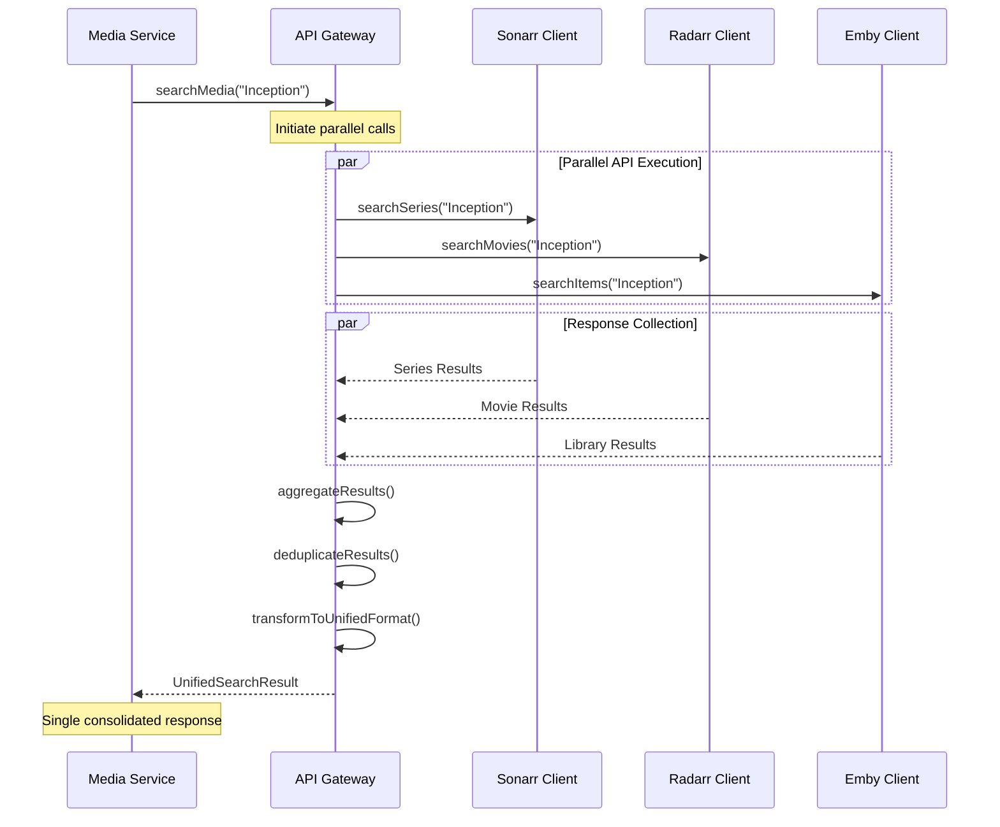
```mermaid
sequenceDiagram
    participant Service as Media Service
    participant Gateway as API Gateway
    participant Sonarr as Sonarr Client
    participant Radarr as Radarr Client
    participant Emby as Emby Client
    
    Service->>Gateway: searchMedia("Inception")
    
    Note over Gateway: Initiate parallel calls
    
    par Parallel API Execution
        Gateway->>Sonarr: searchSeries("Inception")
        Gateway->>Radarr: searchMovies("Inception")
        Gateway->>Emby: searchItems("Inception")
    end
    
    par Response Collection
        Sonarr-->>Gateway: Series Results
        Radarr-->>Gateway: Movie Results
        Emby-->>Gateway: Library Results
    end
    
    Gateway->>Gateway: aggregateResults()
    Gateway->>Gateway: deduplicateResults()
    Gateway->>Gateway: transformToUnifiedFormat()
    
    Gateway-->>Service: UnifiedSearchResult
    
    Note over Service: Single consolidated response
```

**Design Decisions and Architecture Trade-offs:**

The gateway pattern was chosen over direct client access to address several architectural challenges: **Complexity Management** by centralizing multi-service coordination logic rather than distributing it across consuming services; **Error Handling Consistency** through unified error aggregation and classification patterns; **Performance Optimization** via intelligent parallel execution strategies and result caching at the gateway level; and **Interface Stability** providing a stable contract for consuming services while allowing internal client implementation changes.

**Cross-Service Operation Patterns:**

The gateway implements sophisticated cross-service operations that would be complex to coordinate at the service layer: **Duplicate Detection** queries both Sonarr and Radarr queues to prevent duplicate requests across different media types; **Availability Verification** cross-references search results with Emby library content to determine current availability status; **Request Routing** automatically directs movie requests to Radarr and TV requests to Sonarr based on media type classification; and **Status Aggregation** combines download progress from multiple services into unified status reports.

**Error Handling and Partial Failure Management:**

The gateway implements comprehensive strategies for handling partial service failures while maintaining system functionality. When one or more services are unavailable, the gateway provides graceful degradation by returning partial results with clear indication of service availability status, implementing retry logic with exponential backoff for transient failures, and maintaining request correlation across service boundaries for debugging and monitoring purposes.

**Integration Architecture:**

The gateway integrates seamlessly with existing TDR-Bot patterns through dependency injection of service clients, structured logging with request correlation IDs, and configuration management through the established ConfigService patterns. This integration approach ensures that gateway operations benefit from existing monitoring, error handling, and operational infrastructure.

### 5.3.3 Performance Caching Strategy

The API Gateway implements a sophisticated multi-layered caching strategy optimized for homelab environments to reduce external API calls, improve response times, and minimize bandwidth usage while ensuring data accuracy for critical operations.

**Caching Architecture Overview:**

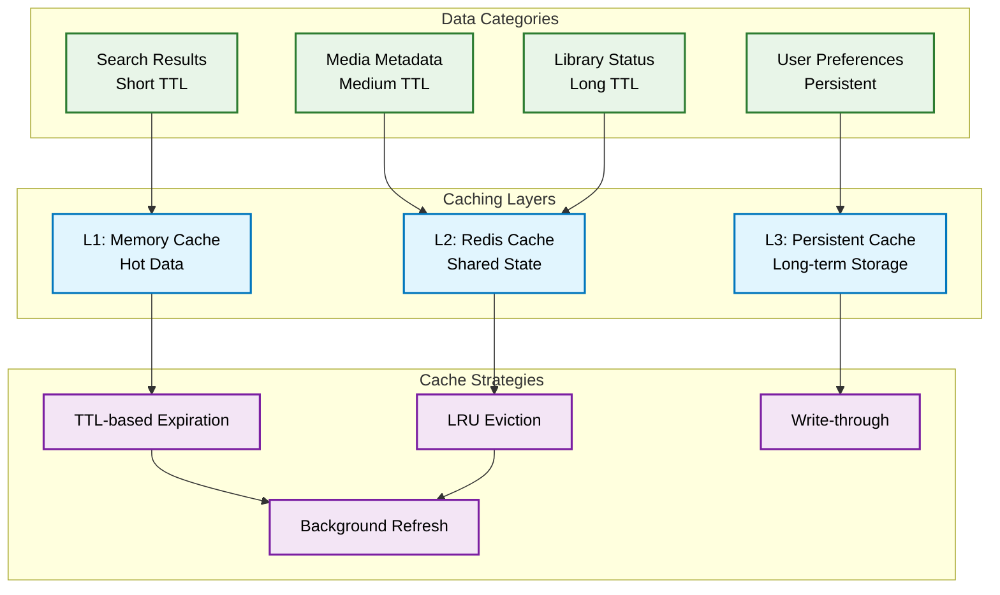
```mermaid
graph TB
    subgraph "Caching Layers"
        L1[L1: Memory Cache<br/>Hot Data]
        L2[L2: Redis Cache<br/>Shared State]
        L3[L3: Persistent Cache<br/>Long-term Storage]
    end
    
    subgraph "Cache Strategies"
        TTL[TTL-based Expiration]
        LRU[LRU Eviction]
        WriteThrough[Write-through]
        Refresh[Background Refresh]
    end
    
    subgraph "Data Categories"
        SearchResults[Search Results<br/>Short TTL]
        MediaMetadata[Media Metadata<br/>Medium TTL]
        LibraryStatus[Library Status<br/>Long TTL]
        UserPreferences[User Preferences<br/>Persistent]
    end
    
    L1 --> TTL
    L2 --> LRU
    L3 --> WriteThrough
    
    SearchResults --> L1
    MediaMetadata --> L2
    LibraryStatus --> L2
    UserPreferences --> L3
    
    TTL --> Refresh
    LRU --> Refresh
    
    classDef cache fill:#E1F5FE,stroke:#0277BD,stroke-width:2px,color:#000
    classDef strategy fill:#F3E5F5,stroke:#7B1FA2,stroke-width:2px,color:#000
    classDef data fill:#E8F5E8,stroke:#2E7D32,stroke-width:2px,color:#000
    
    class L1,L2,L3 cache
    class TTL,LRU,WriteThrough,Refresh strategy
    class SearchResults,MediaMetadata,LibraryStatus,UserPreferences data
```

**Cache Interface Contracts:**

The caching system provides comprehensive interfaces for multi-layered cache management:

```typescript
interface ICacheManager {
  get<T>(key: string, layer?: CacheLayer): Promise<T | null>;
  set<T>(key: string, value: T, options: CacheOptions): Promise<void>;
  delete(key: string, layer?: CacheLayer): Promise<void>;
  clear(pattern?: string, layer?: CacheLayer): Promise<void>;
  getMetrics(layer?: CacheLayer): Promise<CacheMetrics>;
  warmup(keys: string[]): Promise<void>;
}

interface CacheOptions {
  ttl: number;                    // Time to live in seconds
  layer: CacheLayer;              // Target cache layer
  tags: string[];                 // Cache invalidation tags
  priority: CachePriority;        // Eviction priority
  refreshStrategy: RefreshStrategy;
  compressionEnabled?: boolean;
  serializationFormat?: 'json' | 'msgpack' | 'protobuf';
}

enum CacheLayer {
  MEMORY = 'MEMORY',              // L1: In-memory cache
  DISTRIBUTED = 'DISTRIBUTED',    // L2: Redis/shared cache
  PERSISTENT = 'PERSISTENT'       // L3: Database/disk cache
}

enum CachePriority {
  LOW = 1,
  NORMAL = 2,
  HIGH = 3,
  CRITICAL = 4
}

enum RefreshStrategy {
  PASSIVE = 'PASSIVE',            // Refresh on cache miss
  ACTIVE = 'ACTIVE',              // Background refresh before expiry
  REALTIME = 'REALTIME'           // Immediate refresh on update
}

interface CacheMetrics {
  hitRate: number;
  missRate: number;
  evictionCount: number;
  totalSize: number;
  keyCount: number;
  averageAccessTime: number;
  lastCleanup: Date;
}
```

**Data-Specific Caching Strategies:**

The caching system implements tailored strategies for different types of media data:

```typescript
interface MediaDataCacheStrategy {
  // Search results: Short-lived, high frequency
  searchResults: {
    ttl: 300;                     // 5 minutes
    layer: CacheLayer.MEMORY;
    maxSize: 1000;                // Max cached searches
    compressionEnabled: true;
    refreshStrategy: RefreshStrategy.PASSIVE;
  };
  
  // Media metadata: Medium-lived, moderate frequency
  mediaMetadata: {
    ttl: 3600;                    // 1 hour
    layer: CacheLayer.DISTRIBUTED;
    tags: ['metadata', 'media'];
    refreshStrategy: RefreshStrategy.ACTIVE;
    backgroundRefreshThreshold: 0.8; // Refresh at 80% TTL
  };
  
  // Library status: Long-lived, low frequency updates
  libraryStatus: {
    ttl: 86400;                   // 24 hours
    layer: CacheLayer.DISTRIBUTED;
    tags: ['library', 'availability'];
    refreshStrategy: RefreshStrategy.REALTIME;
    invalidationTriggers: ['media_added', 'media_removed'];
  };
  
  // User preferences: Persistent, infrequent changes
  userPreferences: {
    ttl: 604800;                  // 7 days
    layer: CacheLayer.PERSISTENT;
    priority: CachePriority.CRITICAL;
    refreshStrategy: RefreshStrategy.REALTIME;
    writeThrough: true;
  };
}
```

**Smart Cache Invalidation:**

The caching system implements intelligent invalidation strategies to maintain data consistency:

```typescript
interface ICacheInvalidator {
  invalidateByTag(tags: string[]): Promise<void>;
  invalidateByPattern(pattern: string): Promise<void>;
  invalidateByEvent(event: CacheInvalidationEvent): Promise<void>;
  scheduleInvalidation(key: string, triggerTime: Date): Promise<void>;
  cascadeInvalidation(key: string, depth: number): Promise<void>;
}

interface CacheInvalidationEvent {
  type: 'media_updated' | 'library_changed' | 'user_action' | 'external_trigger';
  source: string;
  affectedKeys: string[];
  affectedTags: string[];
  timestamp: Date;
  metadata?: Record<string, any>;
}

interface CacheInvalidationRule {
  trigger: string;
  action: 'invalidate' | 'refresh' | 'cascade';
  targets: CacheTarget[];
  conditions?: CacheCondition[];
  delay?: number;               // Delayed invalidation in seconds
}

interface CacheTarget {
  type: 'key' | 'tag' | 'pattern';
  value: string;
  layer?: CacheLayer;
}
```

**Background Refresh and Preloading:**

The system implements proactive cache management to minimize cache misses:

- **Predictive Preloading**: Anticipate likely requests based on user patterns and preload relevant data
- **Background Refresh**: Refresh expiring cache entries before they become stale
- **Usage Pattern Analysis**: Learn from access patterns to optimize cache allocation and refresh schedules
- **Batch Operations**: Group related cache operations to reduce overhead
- **Circuit Breaker Integration**: Respect circuit breaker states during cache refresh operations

**Homelab-Optimized Configuration:**

Cache configuration is optimized for typical homelab constraints and usage patterns:

```typescript
interface HomelabCacheConfig {
  // Memory constraints optimization
  memoryLimits: {
    maxMemoryUsage: string;       // "256MB" - Conservative memory usage
    evictionPolicy: 'lru' | 'lfu' | 'ttl';
    compressionThreshold: number; // Compress entries larger than threshold
  };
  
  // Network optimization for limited bandwidth
  networkOptimization: {
    compressionEnabled: boolean;  // Enable response compression
    batchRequestsEnabled: boolean; // Batch multiple requests
    offPeakRefreshEnabled: boolean; // Schedule refreshes during low usage
  };
  
  // Storage optimization
  persistentStorage: {
    enabled: boolean;
    maxDiskUsage: string;         // "1GB" - Conservative disk usage
    cleanupSchedule: string;      // Cron schedule for cleanup
    compressionEnabled: boolean;
  };
  
  // Homelab-specific features
  homelabFeatures: {
    offlineMode: boolean;         // Enable offline cache usage
    lowPowerMode: boolean;        // Reduce background operations
    maintenanceWindow: TimeWindow; // Schedule heavy operations
  };
}
```

**Cache Performance Monitoring:**

The caching system provides comprehensive monitoring and optimization insights:

```typescript
interface ICacheMonitor {
  getPerformanceMetrics(): Promise<CachePerformanceMetrics>;
  analyzeAccessPatterns(): Promise<AccessPatternAnalysis>;
  generateOptimizationRecommendations(): Promise<OptimizationRecommendation[]>;
  trackCacheEfficiency(timeWindow: TimeWindow): Promise<EfficiencyReport>;
}

interface CachePerformanceMetrics {
  globalHitRate: number;
  layerHitRates: Record<CacheLayer, number>;
  averageResponseTime: number;
  memoryUsage: ResourceUsage;
  networkSavings: NetworkSavings;
  costEffectiveness: number;    // API calls saved per cache hit
}

interface NetworkSavings {
  bandwidthSaved: number;       // Bytes saved
  apiCallsAvoided: number;      // External API calls prevented
  responseTimeImprovement: number; // Average improvement in ms
}
```

**Integration with API Gateway:**

The caching strategy integrates seamlessly with the API Gateway pattern:

- **Request Interception**: Cache checks occur before external API calls
- **Response Caching**: Successful responses are automatically cached based on data type
- **Cache-Aware Routing**: Gateway routes requests through appropriate cache layers
- **Fallback Handling**: Cache misses gracefully fall back to external API calls
- **Metrics Integration**: Cache performance metrics integrate with overall gateway monitoring

### 5.4 Error Handling and Retry Logic

The error handling architecture implements a multi-layered resilience strategy that provides fault tolerance and graceful degradation when external services experience failures or performance issues. This approach combines circuit breaker patterns for service protection with intelligent retry strategies for transient failure recovery.

**Error Handling Architecture:**

The resilience layer operates at multiple levels to provide comprehensive failure management: **Circuit Breaker Protection** prevents cascade failures by temporarily isolating unhealthy services; **Intelligent Retry Logic** handles transient failures with exponential backoff and jitter; **Error Classification** distinguishes between retryable and permanent failures for appropriate response strategies; **Graceful Degradation** maintains partial functionality when services are unavailable; and **Error Propagation** provides meaningful feedback to users while preserving system stability.

**Circuit Breaker State Management:**

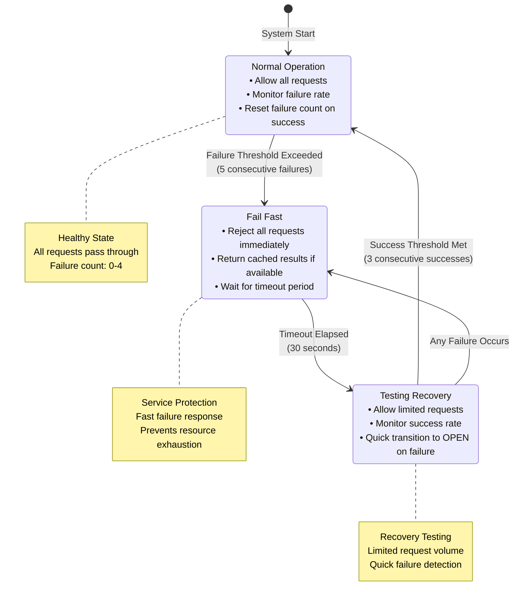
```mermaid
stateDiagram-v2
    [*] --> CLOSED: System Start
    
    CLOSED --> OPEN: Failure Threshold Exceeded<br/>(5 consecutive failures)
    OPEN --> HALF_OPEN: Timeout Elapsed<br/>(30 seconds)
    HALF_OPEN --> CLOSED: Success Threshold Met<br/>(3 consecutive successes)
    HALF_OPEN --> OPEN: Any Failure Occurs
    
    CLOSED: Normal Operation<br/>• Allow all requests<br/>• Monitor failure rate<br/>• Reset failure count on success
    
    OPEN: Fail Fast<br/>• Reject all requests immediately<br/>• Return cached results if available<br/>• Wait for timeout period
    
    HALF_OPEN: Testing Recovery<br/>• Allow limited requests<br/>• Monitor success rate<br/>• Quick transition to OPEN on failure
    
    note right of CLOSED
        Healthy State
        All requests pass through
        Failure count: 0-4
    end note
    
    note right of OPEN
        Service Protection
        Fast failure response
        Prevents resource exhaustion
    end note
    
    note right of HALF_OPEN
        Recovery Testing
        Limited request volume
        Quick failure detection
    end note
```

**Retry Strategy Architecture:**

The retry mechanism implements intelligent backoff strategies that balance responsiveness with service protection: **Exponential Backoff** increases delay between retries exponentially (1s, 2s, 4s, 8s) to reduce service load during degradation; **Jitter Addition** adds randomization to prevent synchronized retry storms across multiple clients; **Error Classification** determines retry eligibility based on error type and HTTP status codes; **Maximum Retry Limits** prevent infinite retry loops while allowing reasonable recovery attempts; and **Timeout Management** ensures overall operation timeouts are respected regardless of retry attempts.

**Error Classification and Handling Patterns:**

The system implements a comprehensive error taxonomy that categorizes errors according to PRD requirements for proper error handling and user experience optimization. The classification system distinguishes between error sources and appropriate handling strategies:

```typescript
interface MediaError {
  type: MediaErrorType;
  category: ErrorCategory;
  severity: ErrorSeverity;
  message: string;
  userMessage: string;
  isRetryable: boolean;
  correlationId?: string;
  sourceService?: string;
  context?: ErrorContext;
}

enum MediaErrorType {
  // User-category errors (USER)
  VALIDATION_ERROR = 'VALIDATION_ERROR',
  AUTHENTICATION_ERROR = 'AUTHENTICATION_ERROR', 
  AUTHORIZATION_ERROR = 'AUTHORIZATION_ERROR',
  RATE_LIMIT_ERROR = 'RATE_LIMIT_ERROR',
  QUOTA_EXCEEDED_ERROR = 'QUOTA_EXCEEDED_ERROR',
  
  // System-category errors (SYSTEM)
  CONFIGURATION_ERROR = 'CONFIGURATION_ERROR',
  STORAGE_ERROR = 'STORAGE_ERROR',
  INTERNAL_SERVICE_ERROR = 'INTERNAL_SERVICE_ERROR',
  CIRCUIT_BREAKER_ERROR = 'CIRCUIT_BREAKER_ERROR',
  
  // External-category errors (EXTERNAL)
  NETWORK_ERROR = 'NETWORK_ERROR',
  EXTERNAL_API_ERROR = 'EXTERNAL_API_ERROR',
  EXTERNAL_SERVICE_UNAVAILABLE = 'EXTERNAL_SERVICE_UNAVAILABLE',
  TIMEOUT_ERROR = 'TIMEOUT_ERROR'
}

enum ErrorCategory {
  USER = 'USER',        // User-correctable errors
  SYSTEM = 'SYSTEM',    // Internal system errors
  EXTERNAL = 'EXTERNAL' // External dependency errors
}

enum ErrorSeverity {
  LOW = 'LOW',         // Minimal impact, operation can continue
  MEDIUM = 'MEDIUM',   // Partial functionality affected
  HIGH = 'HIGH',       // Core functionality impacted
  CRITICAL = 'CRITICAL' // System-wide failure
}

interface ErrorContext {
  operation: string;
  mediaId?: string;
  mediaType?: MediaType;
  service?: string;
  timestamp: Date;
  retryCount?: number;
  stackTrace?: string;
}
```

**Error Category Handling Strategies:**

- **USER Category Errors**: User-correctable issues that require clear feedback and actionable guidance
  - Authentication failures: Prompt for credential verification
  - Validation errors: Provide specific field-level error messages
  - Rate limiting: Display wait time and retry suggestions
  - Authorization issues: Explain permission requirements

- **SYSTEM Category Errors**: Internal system failures requiring administrative attention
  - Configuration errors: Log for system administrator review
  - Storage failures: Trigger capacity alerts and cleanup processes
  - Internal service errors: Escalate to monitoring systems
  - Circuit breaker activation: Enable graceful degradation mode

- **EXTERNAL Category Errors**: Third-party service failures with appropriate fallback handling
  - Network timeouts: Retry with exponential backoff
  - API failures: Implement fallback data sources where possible
  - Service unavailability: Cache responses and provide degraded functionality
  - External rate limiting: Respect service limits and queue requests

**Resilience Pattern Integration:**

The error handling system integrates multiple resilience patterns for comprehensive failure management: **Bulkhead Pattern** isolates failures in one service from affecting others through independent circuit breakers per service; **Timeout Pattern** prevents hanging operations with configurable timeout values per operation type; **Fallback Pattern** provides alternative responses when primary services are unavailable; and **Health Check Integration** monitors service health and adjusts circuit breaker sensitivity based on overall system state.

**Operational Monitoring and Alerting:**

The resilience layer provides comprehensive operational visibility: **Circuit Breaker State Monitoring** tracks state transitions and failure patterns across all services; **Retry Metrics** monitor retry success rates, backoff effectiveness, and overall resilience performance; **Error Rate Tracking** provides real-time visibility into failure patterns and service health trends; **Alert Integration** triggers notifications when circuit breakers open or error rates exceed thresholds; and **Performance Impact Analysis** measures the overhead of resilience patterns on overall system performance.

**TDR-Bot Integration and Configuration:**

Error handling integrates with existing TDR-Bot infrastructure through structured logging patterns, configuration management via environment variables, and monitoring integration with existing health check endpoints. Circuit breaker thresholds, retry limits, and timeout values are configurable per environment to support different operational characteristics between development and production deployments.

### 5.5 Response Transformation and Data Models

The response transformation architecture implements a unified data model that normalizes diverse external API responses into consistent internal data structures. This approach enables seamless integration across different media management services while maintaining type safety and data integrity throughout the system.

**Data Transformation Architecture:**

The transformation layer serves as the boundary between external API formats and internal data models, providing several key architectural benefits: **Schema Normalization** converts diverse external formats into consistent internal structures; **Data Quality Assurance** validates and sanitizes external data before internal processing; **Type Safety Enforcement** ensures compile-time validation of data transformations; **Metadata Preservation** maintains service-specific information while providing unified access patterns; and **Version Compatibility** isolates internal systems from external API schema changes.

**Unified Data Model Design:**

The system adopts a unified media item structure that encompasses both movies and TV series while maintaining service-specific metadata. This design decision balances consistency with flexibility, enabling common processing patterns while preserving unique characteristics of different media types.

```typescript
interface UnifiedMediaItem {
  id: string;                    // Composite ID: "sonarr_123" | "radarr_456" | "emby_789"
  type: 'tv' | 'movie';         // Media type classification
  title: string;                // Normalized title string
  year: number;                 // Release year
  overview: string;             // Description/synopsis
  posterUrl?: string;           // Normalized image URL
  status: MediaAvailabilityStatus;  // Availability state
  source: 'sonarr' | 'radarr' | 'emby';  // Originating service
  externalId: string;           // Original service ID
  metadata: MediaMetadata;      // Service-specific additional data
}

type MediaAvailabilityStatus = 
  | 'available'      // Fully downloaded and available
  | 'unavailable'    // Not downloaded, can be requested
  | 'partial'        // Partially available (TV series)
  | 'downloading'    // Currently being downloaded
  | 'failed';        // Download failed

interface MediaMetadata {
  // Common metadata
  imdbId?: string;
  posterUrls?: string[];
  genres?: string[];
  
  // TV-specific metadata (Sonarr)
  tvdbId?: number;
  seasonCount?: number;
  episodeCount?: number;
  
  // Movie-specific metadata (Radarr)
  tmdbId?: number;
  runtime?: number;
  quality?: string;
  
  // Library-specific metadata (Emby)
  playUrl?: string;
  libraryId?: string;
  userId?: string;
  
  // Storage impact metadata
  storageRequirements?: StorageImpact;
}

interface StorageImpact {
  estimatedSize: StorageSize;
  diskSpaceRequired: StorageSize;
  storageLocation: string;
  compressionRatio?: number;
  qualitySettings: QualityProfile;
  downloadPriority: DownloadPriority;
}

interface StorageSize {
  bytes: number;
  humanReadable: string;    // "1.2 GB", "450 MB", etc.
  category: StorageSizeCategory;
}

type StorageSizeCategory = 'small' | 'medium' | 'large' | 'extra_large';
type DownloadPriority = 'low' | 'normal' | 'high' | 'urgent';

interface QualityProfile {
  name: string;
  resolution: string;       // "1080p", "720p", "4K", etc.
  codec: string;           // "h264", "h265", "av1", etc.
  bitrate?: number;        // Average bitrate in kbps
  audioCodec?: string;     // "aac", "dts", "atmos", etc.
}
```

**Storage Impact Analysis Interface:**

The response transformation layer includes comprehensive storage impact analysis capabilities that provide storage requirement calculations and space management insights for homelab deployments:

```typescript
interface IStorageAnalyzer {
  calculateStorageImpact(mediaItem: UnifiedMediaItem): Promise<StorageImpact>;
  estimateDownloadSize(mediaId: string, qualityProfile: QualityProfile): Promise<StorageSize>;
  validateStorageCapacity(requiredSpace: StorageSize): Promise<StorageValidationResult>;
  categorizeStorageRequirement(size: StorageSize): StorageSizeCategory;
}

interface StorageValidationResult {
  hasCapacity: boolean;
  availableSpace: StorageSize;
  recommendedCleanup?: CleanupRecommendation[];
  alternativeQuality?: QualityProfile[];
}

interface CleanupRecommendation {
  type: 'old_downloads' | 'duplicate_files' | 'failed_downloads';
  potentialSpace: StorageSize;
  riskLevel: 'safe' | 'moderate' | 'risky';
  description: string;
}
```

**Availability Status Architecture:**

The system implements a sophisticated availability status model that provides granular information about media accessibility across different services:

```typescript
interface SeriesAvailability {
  totalEpisodes: number;
  availableEpisodes: number;
  isFullyAvailable: boolean;
  isPartiallyAvailable: boolean;
  missingSeasons: number[];
  downloadProgress?: {
    totalSize: number;
    downloadedSize: number;
    estimatedTimeRemaining: number;
  };
  storageImpact?: StorageImpact;
  totalStorageUsed?: StorageSize;
}

interface MovieAvailability {
  isAvailable: boolean;
  quality?: string;
  fileSize?: number;
  filePath?: string;
  downloadProgress?: {
    percentage: number;
    speed: number;
    eta: number;
  };
  storageImpact?: StorageImpact;
  storageLocation?: string;
}
```

**Storage Impact Integration:**

The response transformation layer incorporates comprehensive storage impact analysis to support homelab storage planning and capacity management. This integration provides several key capabilities:

- **Proactive Space Planning**: Calculate storage requirements before initiating downloads to prevent insufficient disk space failures
- **Quality Optimization**: Recommend optimal quality profiles based on available storage capacity and user preferences
- **Storage Health Monitoring**: Track storage utilization patterns and provide cleanup recommendations for optimal space management
- **Multi-Media Storage Coordination**: Coordinate storage allocation across movies and TV series to optimize overall storage efficiency

The storage analysis integrates with external API responses during transformation to provide accurate size estimates based on service-specific quality profiles and download options. This approach ensures that storage considerations are available at decision time without requiring additional API calls during the request process.

**Schema Design Rationale:**

The unified data model design addresses several architectural challenges: **Service Abstraction** allows consuming services to work with media items without knowledge of their source API; **Consistent Operations** enable common processing patterns across different media types and sources; **Extensibility** supports adding new external services without modifying existing processing logic; **Type Safety** provides compile-time validation of data access patterns; and **Backward Compatibility** isolates internal systems from external API changes through stable internal contracts.

**Data Quality and Validation Patterns:**

The transformation process implements comprehensive data quality assurance: **Input Validation** ensures external data meets minimum quality standards before transformation; **Data Sanitization** removes potentially harmful content and normalizes text encoding; **Missing Data Handling** provides sensible defaults and graceful degradation for incomplete external data; **Image URL Normalization** converts relative URLs to absolute URLs and validates image accessibility; and **Metadata Enrichment** combines data from multiple sources to provide comprehensive media information.

**Performance and Caching Considerations:**

Response transformation implements performance optimizations for homelab deployment: **Lazy Transformation** defers expensive transformation operations until data is actually needed; **Result Memoization** caches transformation results for frequently accessed media items; **Batch Processing** optimizes transformation of large result sets through efficient batch operations; **Memory Management** implements cleanup patterns for transformation caches to prevent memory leaks; and **Error Recovery** provides fallback transformation strategies when primary transformation fails.

**Integration with Service Layer:**

The transformation architecture integrates seamlessly with service layer components through well-defined interfaces and dependency injection patterns. Transformation services are injected into API clients and gateway services, ensuring consistent data normalization across all external integrations while maintaining loose coupling between transformation logic and service implementations.

---

## 7. Discord Interaction Layer

> **Requirements Reference**: For component behavior specifications and user interaction patterns, see [PRD Section 4.1 Core Features](./tdr-media-prd.md#41-core-features) and [PRD Section 4.2 T2 - Discord Interface Requirements](./tdr-media-prd.md#42-technical-requirements).

### 7.1 Discord.js Integration Architecture

> **Architecture Integration**: This layer extends the [Section 3 Discord Command Structure](./tdr-media-design-doc.md#3-discord-command-structure) with interactive components and integrates with [Section 4 Service Layer Design](./tdr-media-design-doc.md#4-service-layer-design) through established dependency injection patterns.

The Discord Interaction Layer implements comprehensive Discord.js v14+ integration with Necord framework to provide rich interactive components without external dependencies. The architecture handles component lifecycle management, state persistence, and multi-step workflows while maintaining stateless service design principles.

**Core Discord Integration Principles:**

- **Discord.js v14+ with Necord Framework**: Full slash command and interaction support following established TDR-Bot patterns (see [Section 3.3 Necord Integration Patterns](./tdr-media-design-doc.md#33-necord-integration-patterns))
- **Rich Embed Generation**: Comprehensive media display with thumbnail support and Discord formatting constraints
- **Interactive Component Management**: Buttons, select menus, and modals with structured state persistence
- **Component State Persistence**: Cross-session state management with automatic cleanup and timeout handling
- **Service Layer Integration**: Direct integration with [SearchService](./tdr-media-design-doc.md#422-searchservice---multi-api-search-aggregation), [RequestService](./tdr-media-design-doc.md#423-requestservice---download-request-management), and [LibraryService](./tdr-media-design-doc.md#424-libraryservice---content-browsing-coordination) through dependency injection

### 7.2 Interactive Component Management

> **TDR-Bot Architecture Integration**: This component management system extends the existing TDR-Bot message handling patterns found in `packages/tdr-bot/src/message-handler/base-message-handler.service.ts` and integrates with established command service patterns from `packages/tdr-bot/src/commands/command.service.ts` for consistent bot behavior and user experience.

**Component Lifecycle Architecture:**

```typescript
interface IComponentManager {
  createComponent(type: ComponentType, options: ComponentOptions): Promise<MessageComponent>;
  updateComponent(componentId: string, updates: ComponentUpdates): Promise<void>;
  deleteComponent(componentId: string): Promise<void>;
  storeComponentState(userId: string, messageId: string, state: ComponentState): Promise<string>;
  getComponentState(userId: string, messageId: string): Promise<ComponentState | undefined>;
  cleanupExpiredStates(): Promise<void>;
}

interface ComponentState {
  userId: string;
  messageId: string;
  currentPage: number;
  selectedMedia?: string;
  searchQuery?: string;
  searchResults?: SearchResult[];
  lastUpdate: Date;
  interactionType: 'search' | 'request' | 'status' | 'library';
}
```

**Component State Management Patterns:**

- **15-minute TTL with automatic cleanup timers**: In-memory state store using composite keys (userId_messageId)
- **Concurrent access protection**: Map-based locking mechanism for thread-safe state operations
- **Memory management**: Automatic cleanup process runs every 5 minutes with configurable limits
- **State persistence strategy**: Stateless design with external APIs as source of truth

**Custom ID Encoding Strategy:**

```typescript
interface ICustomIdEncoder {
  encode(action: ComponentAction, mediaType: MediaType, mediaId: string, context?: string, page?: number): string;
  decode(customId: string): ComponentIdentifier;
}
```

**Custom ID Format Specification:**
- **Structure**: `media_action_mediaType_mediaId_context_page`
- **Discord Constraints**: 100-character maximum length with validation
- **ID Truncation**: Media IDs truncated to 20 characters to prevent overflow
- **Default Values**: Context defaults to 'default', page defaults to '1'

### 7.3 Component Performance Optimization

**Performance Optimization Interfaces:**

```typescript
interface IComponentOptimizer {
  scheduleUpdate(componentId: string, updateData: ComponentUpdate, debounceTime?: number): Promise<void>;
  refreshComponents(messageId: string, newData: any): Promise<boolean>;
  detectChanges(currentData: any, newData: any): string[];
  optimizeComponentRefresh(componentId: string, changes: string[]): Promise<void>;
}

interface IConcurrentStateManager {
  updateState(userId: string, messageId: string, updates: Partial<ComponentState>): Promise<void>;
  atomicStateUpdate(userId: string, messageId: string, updateFunction: (state: ComponentState) => Partial<ComponentState>): Promise<boolean>;
  safeStateOperation<T>(userId: string, messageId: string, operation: (state?: ComponentState) => Promise<T>): Promise<T>;
}
```

**Component Optimization Patterns:**

- **Debounced Updates**: 500ms debounce timer to prevent excessive API calls with update merging
- **Intelligent Refreshing**: Change detection system that only updates modified components
- **Component Caching**: In-memory cache with smart invalidation based on data changes
- **Concurrent State Protection**: Map-based locking for thread-safe state operations
- **Performance Monitoring**: Metrics collection for optimization analysis and bottleneck detection

### 7.4 Advanced Component Patterns

The advanced component patterns implement sophisticated user interface behaviors that adapt dynamically to user interactions and media states. These patterns prioritize progressive disclosure, contextual actions, and multi-step workflows while maintaining consistent user experience across all media management operations.

#### 7.4.1 Progressive Disclosure Architecture

**Core Pattern Interfaces:**

```typescript
interface IProgressiveDisclosureBuilder {
  buildSearchInterface(results: SearchResult[], page: number): MessageComponents;
  buildContextualActions(media: MediaItem): MessageComponent;
  shouldShowNavigation(page: number, total: number): boolean;
}

interface IComponentStateManager {
  updateComponentState(userId: string, messageId: string, state: ComponentState): Promise<void>;
  getComponentState(userId: string, messageId: string): Promise<ComponentState>;
  cleanupExpiredStates(): Promise<void>;
}
```

**Progressive Disclosure Flow:**

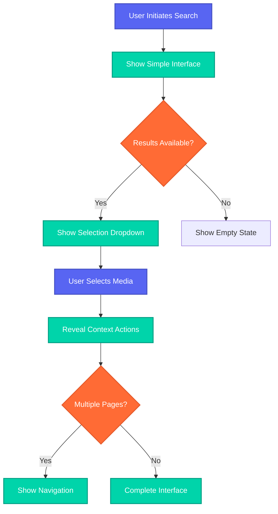
```mermaid
graph TD
    A[User Initiates Search] --> B[Show Simple Interface]
    B --> C{Results Available?}
    C -->|Yes| D[Show Selection Dropdown]
    C -->|No| E[Show Empty State]
    D --> F[User Selects Media]
    F --> G[Reveal Context Actions]
    G --> H{Multiple Pages?}
    H -->|Yes| I[Show Navigation]
    H -->|No| J[Complete Interface]
    
    classDef user fill:#5865F2,stroke:#4752C4,stroke-width:2px,color:#fff
    classDef system fill:#00D4AA,stroke:#00A085,stroke-width:2px,color:#fff
    classDef decision fill:#FF6B35,stroke:#E55A2B,stroke-width:2px,color:#fff
    
    class A,F user
    class B,D,G,I,J system
    class C,H decision
```

**Architectural Principles:**
- **Layered Complexity**: Start with minimal interface, progressively reveal features
- **State-Driven Visibility**: Component visibility determined by current interaction state
- **Context-Aware Actions**: Action buttons adapt to media availability and user permissions
- **Smart Navigation**: Pagination controls appear only when necessary

#### 7.4.2 Multi-Step Workflow Management

**Workflow Coordination Interfaces:**

```typescript
interface IWorkflowManager {
  initiateWorkflow(type: WorkflowType, context: WorkflowContext): Promise<WorkflowState>;
  processStep(interaction: Interaction, step: WorkflowStep): Promise<WorkflowResult>;
  getCurrentStep(userId: string, workflowId: string): Promise<WorkflowStep>;
  cleanupWorkflow(workflowId: string): Promise<void>;
}

enum WorkflowType {
  TV_REQUEST = 'tv_request',
  MOVIE_REQUEST = 'movie_request', 
  DELETE_CONFIRM = 'delete_confirm',
  BULK_OPERATION = 'bulk_operation'
}
```

**Multi-Step Workflow Architecture:**

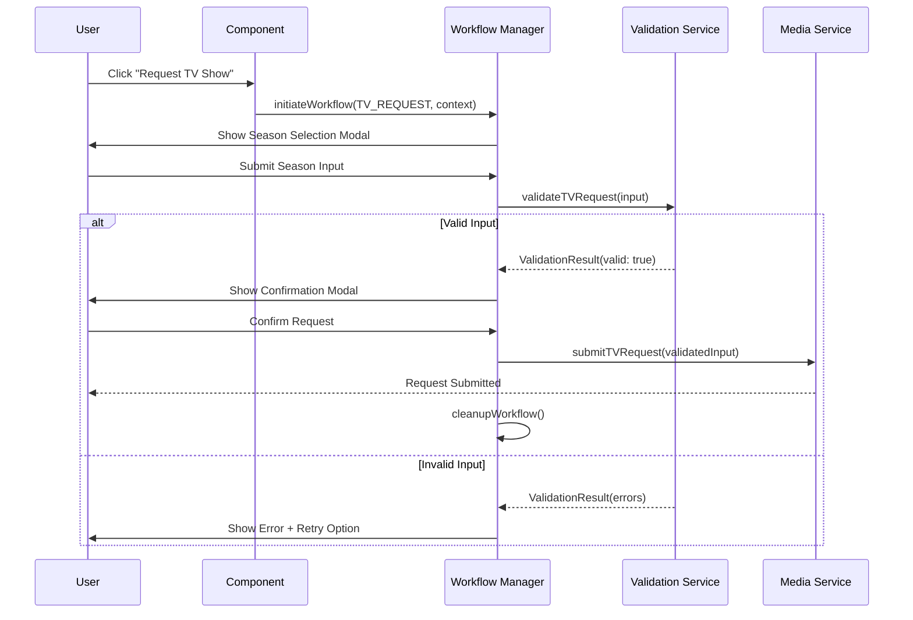
```mermaid
sequenceDiagram
    participant User
    participant Component
    participant WorkflowMgr as Workflow Manager
    participant ValidationSvc as Validation Service
    participant MediaSvc as Media Service
    
    User->>Component: Click "Request TV Show"
    Component->>WorkflowMgr: initiateWorkflow(TV_REQUEST, context)
    WorkflowMgr->>User: Show Season Selection Modal
    
    User->>WorkflowMgr: Submit Season Input
    WorkflowMgr->>ValidationSvc: validateTVRequest(input)
    
    alt Valid Input
        ValidationSvc-->>WorkflowMgr: ValidationResult(valid: true)
        WorkflowMgr->>User: Show Confirmation Modal
        User->>WorkflowMgr: Confirm Request
        WorkflowMgr->>MediaSvc: submitTVRequest(validatedInput)
        MediaSvc-->>User: Request Submitted
        WorkflowMgr->>WorkflowMgr: cleanupWorkflow()
    else Invalid Input
        ValidationSvc-->>WorkflowMgr: ValidationResult(errors)
        WorkflowMgr->>User: Show Error + Retry Option
    end
```

**Workflow Pattern Features:**
- **State Persistence**: Workflow state maintained across multiple interactions
- **Validation Pipeline**: Multi-stage input validation with clear error feedback  
- **Error Recovery**: Graceful handling of invalid inputs with retry mechanisms
- **Automatic Cleanup**: Workflow state cleanup after completion or timeout

#### 7.4.3 Context-Aware Component Factory

**Component Factory Architecture:**

```typescript
interface IContextAwareComponentFactory {
  createMediaActionButtons(media: MediaItem, userContext: UserContext): ActionRow;
  createWorkflowComponents(workflowType: WorkflowType, step: WorkflowStep): MessageComponents;
  createStatusComponents(status: MediaStatus, capabilities: SystemCapabilities): MessageComponents;
}

interface UserContext {
  userId: string;
  permissions: UserPermissions;
  preferences: UserPreferences;
  currentSession: SessionInfo;
}
```

**Context-Aware Button Generation:**

The factory pattern dynamically generates appropriate action buttons based on media status, user permissions, and system capabilities:

- **Available Media**: Play, Share, Info, Delete (if permitted)
- **Unavailable Media**: Request, Info, Add to Watchlist
- **Requested Media**: Status, Cancel Request, Info
- **Downloading Media**: Progress, Cancel Download, Info

**Component State Coordination:**

Components maintain coordinated state through a centralized state manager that handles component lifecycle, automatic cleanup, and cross-component communication for complex workflows requiring multiple interaction steps.

### 7.5 Error Handling for Interactive Components

**Error Handling Interfaces:**

```typescript
interface IComponentErrorHandler {
  handleComponentError(interaction: Interaction, error: Error, fallbackStrategy: FallbackStrategy): Promise<void>;
  validateComponentInteraction(customId: string, userId: string): Promise<boolean>;
  fallbackToTextInterface(interaction: Interaction): Promise<void>;
  offerRetryOption(interaction: Interaction, error: Error): Promise<void>;
}

type FallbackStrategy = 'text_only' | 'retry' | 'cancel';

interface ComponentValidationResult {
  isValid: boolean;
  error?: string;
  requiresRefresh?: boolean;
}
```

**Error Handling Patterns:**

- **Graceful Degradation**: Fallback to text-based interfaces when interactive components fail
- **Component State Validation**: Pre-interaction validation to prevent expired or invalid component access
- **Automatic Retry Logic**: Smart retry mechanisms with exponential backoff for transient failures
- **User-Friendly Error Messages**: Clear error communication with actionable next steps
- **Comprehensive Logging**: Detailed error tracking for debugging and monitoring
- **Timeout Handling**: Graceful timeout management with clear user notification

### 7.6 Component Security Implementation

**Security Interface Specifications:**

```typescript
interface IComponentSecurityManager {
  sanitizeComponentData(data: any): any;
  verifyComponentPermissions(interaction: Interaction, action: ComponentAction): Promise<boolean>;
  encryptCustomIdData(sensitiveData: string): string;
  checkActionPermissions(userId: string, action: ComponentAction): Promise<boolean>;
}

interface ComponentSecurityPolicy {
  maxStringLength: number;    // 1000 characters
  maxArraySize: number;       // 100 items
  maxObjectKeys: number;      // 50 keys
  maxKeyLength: number;       // 100 characters
  customIdObfuscation: boolean;
}
```

**Security Architecture Patterns:**

- **Input Sanitization**: Comprehensive data sanitization with configurable limits for strings, arrays, and objects
- **Permission Verification**: User-owned component validation ensuring users can only interact with their own components
- **Custom ID Security**: Base64 obfuscation for sensitive data in Discord custom IDs with length constraints
- **Action-Based Permissions**: Granular permission checking based on specific component actions
- **Validation Pipeline**: Multi-layer validation including state validation, permission checks, and data sanitization
- **Security Logging**: Comprehensive security event logging for audit and monitoring purposes

### 7.7 Media-Specific Component Factories

> **Requirements Reference**: For interactive component specifications and user workflow patterns, see [PRD Section 4.1 Interactive Search Components](./tdr-media-prd.md#41-core-features) and [PRD Section 4.2 Interactive Info Components](./tdr-media-prd.md#42-technical-requirements).
> 
> **Architecture Integration**: These factories integrate with [Section 3.2 Command Hierarchy Implementation](./tdr-media-design-doc.md#32-command-hierarchy-implementation) for slash command responses and connect to [Section 5 External API Integration](./tdr-media-design-doc.md#5-external-api-integration) for real-time data retrieval and media status updates.

**Core Factory Interface Specifications:**

```typescript
interface IMediaComponentFactory {
  createSearchResultsInterface(results: SearchResult[], page: number): MessageComponents;
  createMediaInfoInterface(media: MediaItem): MessageComponents;
  createLibraryBrowseInterface(items: LibraryItem[], page: number): MessageComponents;
  createRequestConfirmationModal(media: MediaItem): ModalBuilder;
}

interface ISearchComponentFactory extends IMediaComponentFactory {
  buildMediaSelectionDropdown(results: SearchResult[], placeholder: string): StringSelectMenuBuilder;
  buildContextualActionButtons(actions: ActionButton[]): ActionRowBuilder;
  buildPaginationControls(currentPage: number, totalPages: number): ActionRowBuilder;
}

interface ITVRequestModalFactory {
  createTVRequestModal(tvShow: TVMediaItem): ModalBuilder;
  parseSeasonEpisodeInput(input: string): ParsedTVRequest[];
  validateTVRequest(parsed: ParsedTVRequest[], tvShow: TVMediaItem): ValidationResult;
  generateRequestSummary(parsed: ParsedTVRequest[]): string;
}

interface IContextAwareActionButtonBuilder {
  buildMediaActionButtons(media: MediaItem): ActionRowBuilder;
  buildTvShowActionButtons(tvShow: TvShowItem): ActionRowBuilder;
  determineButtonsBasedOnStatus(status: MediaStatus): ButtonConfig[];
}
```

**Component Factory Architecture Patterns:**

- **Layered Factory System**: SearchComponentFactory, InfoComponentFactory, LibraryComponentFactory, and RequestComponentFactory with specialized builders
- **PRD-Specific Implementation**: Dropdown selection menus with status indicators, context-aware action buttons, and pagination controls
- **TV Show Availability Logic**: Smart request button display based on partial vs full availability
- **Modal Workflow Integration**: TV request modals with season/episode parsing and validation
- **Status-Aware Components**: Dynamic button configurations based on media availability status
- **Storage Impact Integration**: Comprehensive storage requirement warnings and impact calculations

**Search Component Implementation Patterns:**

- **Search Results Display**: Dropdown menus with media type indicators and availability status icons
- **Context-Aware Action Buttons**: Initially disabled buttons that activate based on user selections
- **Pagination System**: Page controls with indicators for large result sets
- **Status Integration**: Real-time status updates reflected in component states

**TV Show Request Modal Architecture:**

```typescript
interface TVRequestModalConfig {
  title: string;
  seasonEpisodeInputLabel: string;
  seasonInfoLabel: string;
  placeholder: string;
  defaultValue: string;
  validation: TVRequestValidation;
}

interface TVRequestValidation {
  supportedFormats: string[];  // ['S1', 'S2E5', 'S3E1-5', 'S1-3']
  maxInputLength: number;      // 1000 characters
  minInputLength: number;      // 2 characters
  seasonValidation: boolean;
  episodeValidation: boolean;
}
```

**TV Show Request Processing Patterns:**

- **Flexible Input Parsing**: Support for multiple season/episode formats (S1, S2E5, S3E1-10, S1-3)
- **Real-time Validation**: Input validation against available seasons and episode counts
- **Smart Defaults**: Pre-populate with first missing season for user convenience
- **Availability Context**: Display current season availability in read-only field
- **Request Summary Generation**: Comprehensive confirmation summaries with validation warnings

**Input Processing Architecture:**

```typescript
interface ParsedTVRequest {
  type: 'full_season' | 'single_episode' | 'episode_range' | 'season_range' | 'invalid';
  season?: number;
  episode?: number;
  episodeStart?: number;
  episodeEnd?: number;
  description: string;
  valid: boolean;
  originalInput?: string;
}

interface ValidationResult {
  valid: boolean;
  errors: string[];
  warnings: string[];
  requestCount: number;
}
```

**TV Request Processing Patterns:**

- **Pattern Recognition**: Regex-based parsing for standard TV request formats
- **Validation Pipeline**: Multi-stage validation against season availability and episode counts
- **Error Handling**: Clear error messages with format examples for invalid inputs
- **Request Summarization**: Generate user-friendly confirmation summaries with detailed breakdowns

**Library Management Interface Specifications:**

```typescript
interface ILibraryComponentFactory {
  createLibraryBrowseInterface(items: LibraryItem[], page: number, filters?: LibraryFilters): Promise<MessageComponents>;
  createMediaDetailsInterface(media: LibraryItem): Promise<MessageComponents>;
  createLibraryActionButtons(selectedItem: LibraryItem, userPermissions: UserPermissions): ActionRowBuilder[];
  createStorageManagementInterface(items: LibraryItem[], storageInfo: StorageInfo): Promise<MessageComponents>;
}

interface IDeleteConfirmationFactory {
  createDeleteConfirmationModal(items: LibraryItem[]): Promise<ModalBuilder>;
  createDeleteWarningInterface(impact: StorageImpact): Promise<MessageComponents>;
  validateDeletionPermissions(userId: string, items: LibraryItem[]): Promise<DeletionPermissionResult>;
}

interface IStorageImpactCalculator {
  calculateRequestImpact(request: MediaRequest): Promise<StorageImpact>;
  calculateDeletionImpact(items: LibraryItem[]): Promise<StorageImpact>;
  getSystemStorageStatus(): Promise<SystemStorageStatus>;
}
```

**Library Management Patterns:**

- **Comprehensive Browsing**: Library item browsing with filtering, sorting, and pagination
- **Storage Impact Warnings**: Pre-action storage requirement calculations and warnings
- **Safety-First Deletion**: Multi-step confirmation processes with risk assessment
- **Permission Integration**: Granular permission checking for library management actions
- **Quality Profile Management**: Movie request quality selection with storage impact analysis


### 7.8 Homelab Service Integration Patterns

> **Requirements Reference**: For service integration requirements and TDR-Bot architecture patterns, see [PRD Section 4.2 Technical Requirements](./tdr-media-prd.md#42-technical-requirements) and existing TDR-Bot service patterns.
> 
> **TDR-Bot Integration**: This section extends existing TDR-Bot service patterns including Docker integration (see `packages/tdr-bot/src/commands/command.service.ts:117-128`), NestJS dependency injection patterns from [Section 2.6 Technology Stack](./tdr-media-design-doc.md#26-technology-stack--implementation-architecture), and operational monitoring aligned with [Section 12 Performance & Scalability](./tdr-media-design-doc.md#12-performance--scalability).

**Homelab Integration Interface Specifications:**

```typescript
interface IHomelabServiceIntegrator {
  initializeServices(): Promise<ServiceHealthReport>;
  syncMediaStatus(componentId: string): Promise<MediaStatusUpdate>;
  handleMediaRequest(request: MediaRequest, userId: string): Promise<RequestResult>;
  generateEmbyPlaybackLink(mediaId: string, userId: string): Promise<PlaybackLink>;
  getServiceHealth(): Promise<ServiceHealthStatus>;
  handleContainerRestart(serviceName: string): Promise<void>;
}

interface IHomelabServiceDiscovery {
  discoverServices(): Promise<ServiceEndpoints>;
  resolveServiceEndpoint(serviceName: string, config: ServiceConfig): Promise<ServiceEndpoint>;
  createFallbackEndpoint(serviceName: string, config: ServiceConfig): ServiceEndpoint;
  getAuthHeaders(serviceName: string): Record<string, string>;
}

interface IContainerRecoveryManager {
  handleContainerRestart(serviceName: string): Promise<RecoveryResult>;
  executeRecoveryStep(serviceName: string, step: RecoveryStep): Promise<RecoveryStepResult>;
  waitForServiceStartup(serviceName: string, timeout: number): Promise<void>;
}

interface IHomelabPermissionManager {
  getUserPermissions(userId: string): Promise<HomelabUserPermissions>;
  canPerformAction(permissions: HomelabUserPermissions, action: MediaAction): boolean;
  determinePermissionLevel(userId: string): 'family' | 'friend' | 'guest';
}
```

**Homelab Integration Architecture Patterns:**

- **Docker Service Discovery**: Dynamic service resolution with container hostname mapping (sonarr:8989, radarr:7878, emby:8096)
- **Container Recovery Management**: Graceful recovery sequences for service restarts with startup verification
- **Friend/Family Permission Integration**: Simplified permission patterns optimized for trusted homelab usage
- **Network Latency Optimization**: Homelab-appropriate timeouts and retry strategies
- **Health Monitoring**: Continuous service health checking with degraded service handling
- **Environment-Based Configuration**: Simple configuration through environment variables for homelab deployment

**Service Discovery Patterns:**

- **Static Endpoint Configuration**: Pre-configured service endpoints with health check paths
- **Fallback Endpoint Strategy**: Graceful degradation for offline services with cached endpoint information
- **Authentication Header Management**: Service-specific API key handling (X-Api-Key for Sonarr/Radarr, X-Emby-Token for Emby)
- **Discovery Time Tracking**: Performance monitoring for service resolution times
- **Version and Feature Detection**: Automatic capability detection for service integration optimization


**Container Recovery Architecture Patterns:**

- **Graceful Recovery Sequences**: Multi-step recovery process (wait_for_startup, verify_health, restore_connections, sync_state)
- **Timeout Management**: Configurable timeouts for each recovery step with appropriate defaults
- **Recovery Strategy Mapping**: Service-specific recovery strategies with fallback procedures
- **Progress Tracking**: Comprehensive recovery result tracking with success/failure metrics
- **Automatic Retry Logic**: Smart retry mechanisms with exponential backoff for failed recovery steps

**Permission Management Patterns:**

- **Three-Tier Permission System**: Family (full access), Friend (limited), Guest (read-only) permission levels
- **Environment-Based Configuration**: Simple user assignment through HOMELAB_FAMILY_USERS and HOMELAB_FRIEND_USERS environment variables
- **Conservative Resource Quotas**: Homelab-appropriate limits (Family: 10/50, Friend: 5/20, Guest: 2/10 concurrent/daily requests)
- **Action-Based Authorization**: Granular permission checking for search, request, status, play, share, delete, and library actions
- **Simplified Administration**: No complex permission management interface - environment variable configuration for homelab simplicity

### 7.9 Real-time Status Management

> **Requirements Reference**: For status tracking requirements and real-time feedback patterns, see [PRD Section 4.6 Status Management](./tdr-media-prd.md#46-status-management) and [PRD Section 4.2 Interactive Status Components](./tdr-media-prd.md#42-technical-requirements).
> 
> **System Integration**: This status management system leverages [Section 5 External API Integration](./tdr-media-design-doc.md#5-external-api-integration) for real-time data polling, integrates with [Section 8 Data Management](./tdr-media-design-doc.md#8-data-management) for state persistence, and utilizes [Section 10 Error Handling](./tdr-media-design-doc.md#10-error-handling--resilience) patterns for robust status tracking in network-constrained homelab environments.

**Real-time Status Interface Specifications:**

```typescript
interface IStatusManager {
  startStatusMonitoring(mediaId: string, componentId: string, userId: string): Promise<void>;
  stopStatusMonitoring(mediaId: string): Promise<void>;
  getStatusUpdate(mediaId: string): Promise<StatusUpdate>;
  broadcastStatusChange(update: StatusUpdate): Promise<void>;
  handleComponentRefresh(componentId: string): Promise<ComponentUpdate>;
}

interface IRealTimeStatusManager extends IStatusManager {
  updateComponentStatus(componentId: string, update: StatusUpdate): Promise<void>;
  buildUpdatedComponents(update: StatusUpdate): Promise<MessageComponents>;
  createStatusIndicator(status: MediaStatus, progress?: ProgressInfo): EmbedBuilder;
  createStatusActionButtons(update: StatusUpdate): ActionRowBuilder;
}

interface IStatusMonitor {
  addComponent(componentId: string): void;
  start(options: MonitoringOptions): Promise<void>;
  stop(): Promise<void>;
  onStatusChange(callback: (update: StatusUpdate) => Promise<void>): void;
}
```

**Status Management Architecture Patterns:**

- **Real-time Component Synchronization**: Live synchronization between Discord components and external service status
- **Homelab-Optimized Polling**: 10-second intervals for active downloads with configurable retry strategies
- **Status-Based Component Updates**: Dynamic button configurations and embed updates based on current media status
- **Progress Tracking Integration**: Comprehensive download progress display with speed, ETA, and quality information
- **Multi-Component Broadcasting**: Status updates automatically propagated to all active components displaying the same media

**Status Component Update Patterns:**

- **Dynamic Status Indicators**: EmbedBuilder components with status-specific colors, titles, and progress information
- **Action Button State Management**: Context-aware buttons that change based on current status (downloading: refresh/cancel, available: play/share, failed: retry)
- **Progress Display Integration**: Real-time progress updates with percentage, download speed, ETA, and file size information
- **Status Color Coding**: Visual status indication through embed colors (green: available, blue: downloading, yellow: requested, red: failed)
- **Component Broadcasting**: Automatic propagation of status updates to all Discord components displaying the same media

**Status-Based Action Button Implementation:**

```typescript
private createStatusActionButtons(update: StatusUpdate): ActionRowBuilder<ButtonBuilder> {
  const buttons: ButtonBuilder[] = [];
  
  switch (update.status) {
    case 'available':
      buttons.push(
        new ButtonBuilder()
          .setCustomId(`play_${update.mediaId}`)
          .setLabel('▶️ Play Now')
          .setStyle(ButtonStyle.Success),
        new ButtonBuilder()
          .setCustomId(`share_${update.mediaId}`)
          .setLabel('🔗 Share')
          .setStyle(ButtonStyle.Secondary)
      );
      break;
      
    // Similar patterns for 'downloading', 'failed', 'requested' statuses...
  }
  
  return new ActionRowBuilder<ButtonBuilder>().addComponents(buttons);
}

private getStatusColor(status: MediaStatus): number {
  const colors = {
    'downloading': 0x50C878,    // Green
    'available': 0x00FF00,      // Bright Green  
    'failed': 0xFF6B6B,         // Red
    // ... other status colors
  };
  return colors[status] || 0x9CA3AF;
}
```

### 7.10 Architecture Integration Summary

> **Cross-System Integration**: This section consolidates the Discord Interaction Layer's integration points with [Section 3 Discord Command Structure](./tdr-media-design-doc.md#3-discord-command-structure), [Section 4 Service Layer Design](./tdr-media-design-doc.md#4-service-layer-design), [Section 5 External API Integration](./tdr-media-design-doc.md#5-external-api-integration), and [Section 8 State Management](./tdr-media-design-doc.md#8-state-management).

**Discord Interaction Layer Integration Points:**

- **Command-to-Component Flow**: Slash commands from Section 3 trigger component factories to generate interactive Discord elements
- **Component-to-Service Flow**: User interactions invoke service layer operations from Section 4 through dependency injection patterns
- **Service-to-API Flow**: Service layer operations translate to external API calls using Section 5 integration patterns
- **State-to-Component Flow**: Component state management leverages Section 8 in-memory storage with automatic lifecycle management
- **Status-to-Component Flow**: Real-time API status changes trigger component updates through synchronized refresh mechanisms

**Architectural Integration Benefits:**

- **Unified User Experience**: Consistent interaction patterns across all Discord media management operations
- **Real-time Responsiveness**: Immediate visual feedback through component state synchronization with external services
- **Homelab Optimization**: Tailored integration patterns for friend-based usage and resource-constrained homelab environments
- **Scalable State Management**: Efficient in-memory component state handling with 15-minute TTL and automatic cleanup
- **Robust Error Handling**: Comprehensive error recovery with graceful degradation to text-based interface fallbacks

**Performance Integration Characteristics:**

- **Component Lifecycle**: 15-minute TTL with automatic cleanup, maximum 10,000 concurrent states with LRU eviction
- **Status Monitoring**: 10-second polling intervals optimized for homelab network conditions with configurable retry policies
- **API Integration**: Direct external service calls with 5-second timeouts, 3-retry policies, and connection pooling
- **Memory Management**: Intelligent state eviction with performance monitoring and comprehensive cleanup procedures

This integration ensures that the Discord Interaction Layer provides a seamless, responsive, and reliable interface while maintaining architectural consistency with existing TDR-Bot infrastructure and operational patterns.

---

## 8. State Management

> **Requirements Reference**: For data management requirements and operational context, see [PRD Section 4.2 T4 - Data Management](./tdr-media-prd.md#42-technical-requirements).

### 8.1 Stateless Architecture Principles

The state management architecture implements a stateless design that maintains minimal persistent state while supporting complex multi-step workflows. The system relies on external APIs as the single source of truth for operational data, with component state managed in-memory for Discord interaction continuity.

**Core State Management Principles:**

- **Component State Management**: Store Discord interaction state in memory for multi-step workflows with automatic cleanup
- **Real-time Duplicate Detection**: Query Sonarr/Radarr APIs directly instead of maintaining local request history
- **No Database Required**: All media data fetched fresh from external APIs
- **External APIs as Source of Truth**: Sonarr, Radarr, and Emby APIs provide authoritative operational data

### 8.2 In-Memory Component State Architecture

**Component State Storage Implementation:**

```typescript
interface ComponentStateEntry {
  state: ComponentState;
  expiresAt: Date;
  userId: string;
  messageId: string;
  createdAt: Date;
  lastAccessedAt: Date;
}

interface ComponentState {
  userId: string;
  messageId: string;
  interactionType: 'search' | 'request' | 'status' | 'library';
  currentPage: number;
  selectedMedia?: string;
  searchQuery?: string;
  searchResults?: SearchResult[];
  requestContext?: RequestContext;
  workflowStep?: string;
  lastUpdate: Date;
}

class InMemoryStateManager implements IStateManager {
  private readonly stateStore = new Map<string, ComponentStateEntry>();
  private readonly cleanupTimers = new Map<string, NodeJS.Timeout>();
  private readonly maxStates = 10000; // Prevent memory exhaustion
  private readonly defaultTTL = 15 * 60 * 1000; // 15 minutes

  constructor(private readonly logger: Logger) {
    // Start periodic cleanup process
    setInterval(() => this.performMaintenanceCleanup(), 5 * 60 * 1000); // Every 5 minutes
  }

  async storeState(
    userId: string,
    messageId: string,
    state: ComponentState,
    ttl: number = this.defaultTTL
  ): Promise<string> {
    const stateKey = this.generateStateKey(userId, messageId);
    const now = new Date();
    const expiresAt = new Date(now.getTime() + ttl);

    // Prevent memory exhaustion
    if (this.stateStore.size >= this.maxStates) {
      await this.evictOldestStates(1000);
    }

    const stateEntry: ComponentStateEntry = {
      state,
      expiresAt,
      userId,
      messageId,
      createdAt: now,
      lastAccessedAt: now,
    };

    this.stateStore.set(stateKey, stateEntry);
    this.scheduleCleanup(stateKey, ttl);

    this.logger.debug('Component state stored', {
      userId,
      messageId,
      stateKey,
      expiresAt: expiresAt.toISOString(),
      totalStates: this.stateStore.size
    });

    return stateKey;
  }

  async getState(userId: string, messageId: string): Promise<ComponentState | undefined> {
    const stateKey = this.generateStateKey(userId, messageId);
    const stateEntry = this.stateStore.get(stateKey);

    if (!stateEntry) {
      return undefined;
    }

    // Check if state has expired
    if (new Date() > stateEntry.expiresAt) {
      await this.deleteState(userId, messageId);
      return undefined;
    }

    // Update last accessed time
    stateEntry.lastAccessedAt = new Date();

    return stateEntry.state;
  }

  async updateState(
    userId: string,
    messageId: string,
    updates: Partial<ComponentState>
  ): Promise<boolean> {
    const stateKey = this.generateStateKey(userId, messageId);
    const stateEntry = this.stateStore.get(stateKey);

    if (!stateEntry || new Date() > stateEntry.expiresAt) {
      return false;
    }

    stateEntry.state = {
      ...stateEntry.state,
      ...updates,
      lastUpdate: new Date()
    };
    stateEntry.lastAccessedAt = new Date();

    this.logger.debug('Component state updated', {
      userId,
      messageId,
      updatedFields: Object.keys(updates)
    });

    return true;
  }

  private scheduleCleanup(stateKey: string, ttl: number): void {
    // Clear existing timer if present
    const existingTimer = this.cleanupTimers.get(stateKey);
    if (existingTimer) {
      clearTimeout(existingTimer);
    }

    // Schedule new cleanup
    const timer = setTimeout(() => {
      this.stateStore.delete(stateKey);
      this.cleanupTimers.delete(stateKey);
    }, ttl);

    this.cleanupTimers.set(stateKey, timer);
  }
}
```

### 8.3 Real-time Data Integration Strategy

**External API as Source of Truth:**

```typescript
class RealTimeDataManager {
  constructor(
    private readonly apiGateway: IApiGateway,
    private readonly logger: Logger
  ) {}

  // Always fetch fresh data - no caching for operational queries
  async getMediaAvailability(mediaId: string, mediaType: MediaType): Promise<MediaAvailability> {
    this.logger.debug('Fetching fresh availability data', { mediaId, mediaType });
    
    try {
      // Direct API call for real-time accuracy
      const availability = await this.apiGateway.getMediaStatus(mediaId, mediaType);
      
      return {
        isAvailable: availability.status === 'available',
        isRequested: availability.status === 'requested',
        isDownloading: availability.status === 'downloading',
        queuePosition: availability.queuePosition,
        estimatedTime: availability.estimatedTime,
        quality: availability.quality,
        lastChecked: new Date()
      };
    } catch (error) {
      this.logger.error('Failed to fetch availability data', {
        mediaId,
        mediaType,
        error: error.message
      });
      
      throw new MediaError(
        MediaErrorType.EXTERNAL_API,
        'Unable to check media availability',
        'Unable to check availability status. Please try again.',
        true
      );
    }
  }

  // Real-time duplicate detection through live API queries
  async checkForDuplicateRequest(mediaId: string, mediaType: MediaType): Promise<DuplicateResult> {
    this.logger.debug('Checking for duplicate requests', { mediaId, mediaType });
    
    try {
      const duplicateCheck = await this.apiGateway.checkDuplicate(mediaId, mediaType);
      
      if (duplicateCheck.isDuplicate) {
        this.logger.info('Duplicate request detected', {
          mediaId,
          mediaType,
          existingRequest: duplicateCheck.existingRequest
        });
      }
      
      return duplicateCheck;
    } catch (error) {
      this.logger.error('Duplicate check failed', {
        mediaId,
        mediaType,
        error: error.message
      });
      
      // Return non-duplicate on API failure to allow request
      return { isDuplicate: false };
    }
  }

  // Fresh library data for browse operations
  async getLibraryContents(options: LibraryOptions): Promise<LibraryResult> {
    this.logger.debug('Fetching fresh library data', options);
    
    const libraryData = await this.apiGateway.getLibraryItems(options);
    
    // Transform API results to internal format
    return {
      items: libraryData.items.map(item => this.transformLibraryItem(item)),
      pagination: libraryData.pagination,
      totalSize: libraryData.totalSize,
      fetchedAt: new Date()
    };
  }
}
```

### 8.4 Component State Lifecycle Management

**Automatic State Cleanup Implementation:**

```typescript
class StateLifecycleManager {
  private readonly stateMetrics = {
    created: 0,
    expired: 0,
    evicted: 0,
    accessed: 0
  };

  constructor(
    private readonly stateManager: InMemoryStateManager,
    private readonly logger: Logger
  ) {}

  async performMaintenanceCleanup(): Promise<void> {
    const startTime = Date.now();
    let cleanedCount = 0;

    for (const [stateKey, stateEntry] of this.stateManager.stateStore.entries()) {
      if (new Date() > stateEntry.expiresAt) {
        await this.cleanupExpiredState(stateKey, stateEntry);
        cleanedCount++;
      }
    }

    const duration = Date.now() - startTime;
    
    this.logger.info('State maintenance cleanup completed', {
      cleanedStates: cleanedCount,
      totalStates: this.stateManager.stateStore.size,
      durationMs: duration,
      metrics: this.stateMetrics
    });
  }

  private async cleanupExpiredState(stateKey: string, stateEntry: ComponentStateEntry): Promise<void> {
    try {
      // Remove from state store
      this.stateManager.stateStore.delete(stateKey);
      
      // Cancel any scheduled cleanup timers
      const timer = this.stateManager.cleanupTimers.get(stateKey);
      if (timer) {
        clearTimeout(timer);
        this.stateManager.cleanupTimers.delete(stateKey);
      }

      this.stateMetrics.expired++;
      
      this.logger.debug('Expired state cleaned up', {
        stateKey,
        userId: stateEntry.userId,
        messageId: stateEntry.messageId,
        age: Date.now() - stateEntry.createdAt.getTime()
      });
    } catch (error) {
      this.logger.error('Failed to cleanup expired state', {
        stateKey,
        error: error.message
      });
    }
  }

  // Evict oldest states when approaching memory limits
  async evictOldestStates(count: number): Promise<void> {
    const sortedStates = Array.from(this.stateManager.stateStore.entries())
      .sort(([, a], [, b]) => a.lastAccessedAt.getTime() - b.lastAccessedAt.getTime())
      .slice(0, count);

    for (const [stateKey, stateEntry] of sortedStates) {
      await this.cleanupExpiredState(stateKey, stateEntry);
      this.stateMetrics.evicted++;
    }

    this.logger.info('Evicted oldest states for memory management', {
      evictedCount: count,
      remainingStates: this.stateManager.stateStore.size
    });
  }
}
```

### 8.5 Concurrent State Management

**Thread-Safe State Operations:**

```typescript
class ConcurrentStateManager {
  private readonly operationLocks = new Map<string, Promise<void>>();
  private readonly concurrencyMetrics = {
    lockWaits: 0,
    concurrentOperations: 0,
    maxConcurrency: 0
  };

  constructor(
    private readonly stateManager: InMemoryStateManager,
    private readonly logger: Logger
  ) {}

  async safeStateOperation<T>(
    userId: string,
    messageId: string,
    operation: (currentState?: ComponentState) => Promise<T>
  ): Promise<T> {
    const lockKey = `${userId}_${messageId}`;
    
    // Wait for any existing operation to complete
    while (this.operationLocks.has(lockKey)) {
      this.concurrencyMetrics.lockWaits++;
      await this.operationLocks.get(lockKey);
    }

    // Create lock for this operation
    const operationPromise = this.executeStateOperation(userId, messageId, operation);
    this.operationLocks.set(lockKey, operationPromise.then(() => {}));
    
    this.concurrencyMetrics.concurrentOperations++;
    this.concurrencyMetrics.maxConcurrency = Math.max(
      this.concurrencyMetrics.maxConcurrency,
      this.concurrencyMetrics.concurrentOperations
    );

    try {
      return await operationPromise;
    } finally {
      this.operationLocks.delete(lockKey);
      this.concurrencyMetrics.concurrentOperations--;
    }
  }

  private async executeStateOperation<T>(
    userId: string,
    messageId: string,
    operation: (currentState?: ComponentState) => Promise<T>
  ): Promise<T> {
    const currentState = await this.stateManager.getState(userId, messageId);
    
    try {
      return await operation(currentState);
    } catch (error) {
      this.logger.error('State operation failed', {
        userId,
        messageId,
        error: error.message,
        stack: error.stack
      });
      throw error;
    }
  }

  // Atomic state updates with conflict resolution
  async atomicStateUpdate(
    userId: string,
    messageId: string,
    updateFunction: (currentState: ComponentState) => Partial<ComponentState>
  ): Promise<boolean> {
    return this.safeStateOperation(userId, messageId, async (currentState) => {
      if (!currentState) {
        this.logger.warn('Attempted atomic update on non-existent state', {
          userId,
          messageId
        });
        return false;
      }

      const updates = updateFunction(currentState);
      return await this.stateManager.updateState(userId, messageId, updates);
    });
  }
}
```

### 8.6 State Persistence Strategy

**Minimal Persistence Requirements:**

```typescript
interface StateMetadata {
  totalStates: number;
  activeUsers: number;
  averageStateAge: number;
  memoryUsage: number;
  cleanupFrequency: number;
}

class StatePersistenceManager {
  constructor(
    private readonly stateManager: InMemoryStateManager,
    private readonly logger: Logger
  ) {}

  // State is intentionally NOT persisted - only metadata for monitoring
  getStateMetadata(): StateMetadata {
    const states = Array.from(this.stateManager.stateStore.values());
    const now = Date.now();
    
    return {
      totalStates: states.length,
      activeUsers: new Set(states.map(s => s.userId)).size,
      averageStateAge: states.length > 0 
        ? states.reduce((sum, s) => sum + (now - s.createdAt.getTime()), 0) / states.length / 1000
        : 0,
      memoryUsage: this.estimateMemoryUsage(states),
      cleanupFrequency: this.calculateCleanupFrequency(states)
    };
  }

  private estimateMemoryUsage(states: ComponentStateEntry[]): number {
    // Rough estimate: 1KB per state entry
    return states.length * 1024;
  }

  private calculateCleanupFrequency(states: ComponentStateEntry[]): number {
    const now = Date.now();
    const expiringSoon = states.filter(s => s.expiresAt.getTime() - now < 60000).length;
    return expiringSoon;
  }

  // Export state metadata for monitoring (no actual state data)
  async exportStateMetrics(): Promise<Record<string, any>> {
    const metadata = this.getStateMetadata();
    
    return {
      timestamp: new Date().toISOString(),
      stateManager: {
        implementation: 'in-memory',
        persistent: false,
        ...metadata
      },
      configuration: {
        defaultTTL: 15 * 60 * 1000,
        maxStates: 10000,
        cleanupInterval: 5 * 60 * 1000
      }
    };
  }
}
```

---

## 12. Performance Optimization

> **Requirements Reference**: For performance requirements and scalability context, see [PRD Section 4.2 T3 - Performance & Scalability](./tdr-media-prd.md#42-technical-requirements) and [PRD Section 7.1 Performance Goals](./tdr-media-prd.md#71-performance-goals).

### 12.1 Direct API Strategy for Data Freshness

The performance architecture implements a direct API integration strategy that prioritizes data accuracy over caching mechanisms, ensuring users always receive current availability and queue status information while maintaining responsive user experience.

**Core Performance Principles:**

- **Direct API Strategy**: Always fetch fresh data from external APIs to ensure accuracy
- **Real-time Operational Queries**: Maintain real-time operational queries for availability, status, and queue information
- **Component State Optimization**: Store only essential component state in memory with automatic cleanup
- **Async Processing**: Long-running operations processed asynchronously to maintain responsiveness

### 12.2 API Performance Optimization

**Connection Pooling and HTTP Client Optimization:**

```typescript
class OptimizedHttpClient {
  private readonly httpClient: AxiosInstance;
  private readonly connectionPool: Agent;
  private readonly requestCache = new Map<string, Promise<any>>();

  constructor(baseURL: string, options: HttpClientOptions) {
    this.connectionPool = new Agent({
      keepAlive: true,
      maxSockets: 10,
      maxFreeSockets: 2,
      timeout: 60000,
      freeSocketTimeout: 30000,
    });

    this.httpClient = axios.create({
      baseURL,
      timeout: options.timeout || 10000,
      httpAgent: this.connectionPool,
      httpsAgent: this.connectionPool,
      headers: {
        'X-Api-Key': options.apiKey,
        'Connection': 'keep-alive',
      },
    });

    this.setupResponseCaching();
    this.setupPerformanceMonitoring();
  }

  // Request deduplication for concurrent identical requests
  async makeRequest<T>(endpoint: string, options: RequestOptions = {}): Promise<T> {
    const cacheKey = this.generateCacheKey(endpoint, options);
    
    // Return existing promise if identical request is in flight
    if (this.requestCache.has(cacheKey)) {
      return this.requestCache.get(cacheKey);
    }

    const requestPromise = this.executeRequest<T>(endpoint, options);
    this.requestCache.set(cacheKey, requestPromise);

    // Clean up cache entry after request completes
    requestPromise.finally(() => {
      setTimeout(() => this.requestCache.delete(cacheKey), 1000);
    });

    return requestPromise;
  }

  private async executeRequest<T>(endpoint: string, options: RequestOptions): Promise<T> {
    const startTime = Date.now();
    
    try {
      const response = await this.httpClient.get(endpoint, options);
      
      this.recordApiMetrics('success', endpoint, Date.now() - startTime);
      return response.data;
    } catch (error) {
      this.recordApiMetrics('error', endpoint, Date.now() - startTime, error);
      throw error;
    }
  }
}
```

**Parallel API Calls with Circuit Breaking:**

```typescript
class ParallelApiManager {
  constructor(
    private readonly sonarrClient: ISonarrClient,
    private readonly radarrClient: IRadarrClient,
    private readonly embyClient: IEmbyClient,
    private readonly logger: Logger
  ) {}

  async searchAllServices(query: string): Promise<UnifiedSearchResult> {
    const searchPromises = [
      this.safeApiCall('sonarr', () => this.sonarrClient.searchSeries(query)),
      this.safeApiCall('radarr', () => this.radarrClient.searchMovies(query)),
      this.safeApiCall('emby', () => this.embyClient.searchItems(query))
    ];

    // Execute all searches in parallel with timeout
    const results = await Promise.allSettled(searchPromises);
    
    return this.aggregateSearchResults(results);
  }

  private async safeApiCall<T>(
    serviceName: string,
    apiCall: () => Promise<T>
  ): Promise<T> {
    const timeout = 5000; // 5 second timeout per service
    
    try {
      return await Promise.race([
        apiCall(),
        this.createTimeoutPromise<T>(timeout, serviceName)
      ]);
    } catch (error) {
      this.logger.warn(`API call failed for ${serviceName}`, {
        service: serviceName,
        error: error.message
      });
      
      // Return empty result for failed service
      return [] as T;
    }
  }

  private createTimeoutPromise<T>(timeout: number, serviceName: string): Promise<T> {
    return new Promise((_, reject) => {
      setTimeout(() => {
        reject(new MediaError(
          MediaErrorType.API_TIMEOUT,
          `${serviceName} API timeout`,
          `${serviceName} service is taking too long to respond`,
          true
        ));
      }, timeout);
    });
  }
}
```

### 12.3 Component Performance Optimization

**Debounced Updates and Intelligent Refreshing:**

```typescript
class ComponentPerformanceOptimizer {
  private readonly updateQueue = new Map<string, DebouncedUpdate>();
  private readonly componentMetrics = new Map<string, ComponentMetrics>();

  constructor(private readonly logger: Logger) {}

  // Debounced updates to prevent excessive API calls
  async scheduleComponentUpdate(
    componentId: string,
    updateFunction: () => Promise<void>,
    debounceTime: number = 500
  ): Promise<void> {
    const existingUpdate = this.updateQueue.get(componentId);
    
    if (existingUpdate) {
      // Cancel existing update and merge
      clearTimeout(existingUpdate.timer);
    }

    const timer = setTimeout(async () => {
      try {
        const startTime = Date.now();
        await updateFunction();
        
        this.recordComponentMetric(componentId, 'update_success', Date.now() - startTime);
        this.updateQueue.delete(componentId);
      } catch (error) {
        this.recordComponentMetric(componentId, 'update_error', 0, error);
        this.logger.error('Component update failed', {
          componentId,
          error: error.message
        });
      }
    }, debounceTime);

    this.updateQueue.set(componentId, {
      timer,
      scheduledAt: new Date(),
      componentId
    });
  }

  // Intelligent component refreshing - only update changed data
  async optimizedComponentRefresh(
    componentId: string,
    currentData: any,
    newData: any
  ): Promise<boolean> {
    const changes = this.detectDataChanges(currentData, newData);
    
    if (changes.length === 0) {
      this.recordComponentMetric(componentId, 'no_update_needed', 0);
      return false; // No update needed
    }

    // Only update components with actual changes
    this.recordComponentMetric(componentId, 'partial_update', 0);
    await this.updateChangedComponents(componentId, changes);
    return true;
  }

  private detectDataChanges(current: any, updated: any): string[] {
    const changes: string[] = [];
    
    if (JSON.stringify(current) !== JSON.stringify(updated)) {
      // Detailed change detection for specific fields
      const currentKeys = Object.keys(current || {});
      const updatedKeys = Object.keys(updated || {});
      
      const allKeys = new Set([...currentKeys, ...updatedKeys]);
      
      allKeys.forEach(key => {
        if (current?.[key] !== updated?.[key]) {
          changes.push(key);
        }
      });
    }
    
    return changes;
  }
}
```

### 12.4 Memory Management and Cleanup

**Automatic Memory Management:**

```typescript
class MemoryManager {
  private readonly memoryThresholds = {
    warning: 400 * 1024 * 1024,  // 400MB
    critical: 450 * 1024 * 1024, // 450MB
    maximum: 500 * 1024 * 1024   // 500MB
  };

  private memoryCheckInterval: NodeJS.Timeout;

  constructor(
    private readonly stateManager: InMemoryStateManager,
    private readonly logger: Logger
  ) {
    this.startMemoryMonitoring();
  }

  private startMemoryMonitoring(): void {
    this.memoryCheckInterval = setInterval(() => {
      this.checkMemoryUsage();
    }, 30000); // Check every 30 seconds
  }

  private async checkMemoryUsage(): Promise<void> {
    const memoryUsage = process.memoryUsage();
    const heapUsed = memoryUsage.heapUsed;

    this.logger.debug('Memory usage check', {
      heapUsed: Math.round(heapUsed / 1024 / 1024) + 'MB',
      heapTotal: Math.round(memoryUsage.heapTotal / 1024 / 1024) + 'MB',
      external: Math.round(memoryUsage.external / 1024 / 1024) + 'MB',
      rss: Math.round(memoryUsage.rss / 1024 / 1024) + 'MB'
    });

    if (heapUsed > this.memoryThresholds.critical) {
      this.logger.warn('Critical memory usage detected', {
        heapUsed: heapUsed / 1024 / 1024,
        threshold: this.memoryThresholds.critical / 1024 / 1024
      });
      
      await this.performAggressiveCleanup();
    } else if (heapUsed > this.memoryThresholds.warning) {
      this.logger.info('High memory usage detected', {
        heapUsed: heapUsed / 1024 / 1024,
        threshold: this.memoryThresholds.warning / 1024 / 1024
      });
      
      await this.performStandardCleanup();
    }
  }

  private async performStandardCleanup(): Promise<void> {
    // Clean up expired states
    await this.stateManager.cleanupExpiredStates();
    
    // Force garbage collection if available
    if (global.gc) {
      global.gc();
      this.logger.debug('Forced garbage collection completed');
    }
  }

  private async performAggressiveCleanup(): Promise<void> {
    const statesBeforeCleanup = this.stateManager.stateStore.size;
    
    // Evict oldest 25% of states
    const statesToEvict = Math.floor(statesBeforeCleanup * 0.25);
    await this.stateManager.evictOldestStates(statesToEvict);
    
    // Clean up all expired states
    await this.stateManager.cleanupExpiredStates();
    
    // Clear any cached data
    await this.clearCaches();
    
    // Force garbage collection
    if (global.gc) {
      global.gc();
    }
    
    const statesAfterCleanup = this.stateManager.stateStore.size;
    
    this.logger.info('Aggressive memory cleanup completed', {
      statesEvicted: statesBeforeCleanup - statesAfterCleanup,
      remainingStates: statesAfterCleanup,
      memoryAfterCleanup: Math.round(process.memoryUsage().heapUsed / 1024 / 1024) + 'MB'
    });
  }
}
```

### 12.5 Background Processing and Async Operations

**Async Processing for Long-Running Operations:**

```typescript
class BackgroundProcessManager {
  private readonly activeJobs = new Map<string, BackgroundJob>();
  private readonly jobQueue: BackgroundJob[] = [];
  private readonly maxConcurrentJobs = 5;

  constructor(private readonly logger: Logger) {
    this.startJobProcessor();
  }

  async scheduleJob(jobType: JobType, payload: any, userId?: string): Promise<string> {
    const jobId = this.generateJobId();
    const job: BackgroundJob = {
      id: jobId,
      type: jobType,
      payload,
      userId,
      status: 'queued',
      createdAt: new Date(),
      retryCount: 0,
      maxRetries: 3
    };

    this.jobQueue.push(job);
    
    this.logger.debug('Background job scheduled', {
      jobId,
      type: jobType,
      queueLength: this.jobQueue.length
    });

    return jobId;
  }

  private startJobProcessor(): void {
    setInterval(() => {
      this.processJobQueue();
    }, 1000); // Check every second
  }

  private async processJobQueue(): Promise<void> {
    const availableSlots = this.maxConcurrentJobs - this.activeJobs.size;
    
    if (availableSlots <= 0 || this.jobQueue.length === 0) {
      return;
    }

    const jobsToProcess = this.jobQueue.splice(0, availableSlots);
    
    for (const job of jobsToProcess) {
      this.activeJobs.set(job.id, job);
      this.executeJob(job);
    }
  }

  private async executeJob(job: BackgroundJob): Promise<void> {
    job.status = 'processing';
    job.startedAt = new Date();

    try {
      await this.processJobByType(job);
      
      job.status = 'completed';
      job.completedAt = new Date();
      
      this.logger.info('Background job completed', {
        jobId: job.id,
        type: job.type,
        duration: job.completedAt.getTime() - job.startedAt!.getTime()
      });
    } catch (error) {
      job.status = 'failed';
      job.error = error.message;
      job.retryCount++;

      this.logger.error('Background job failed', {
        jobId: job.id,
        type: job.type,
        error: error.message,
        retryCount: job.retryCount
      });

      // Retry logic
      if (job.retryCount < job.maxRetries) {
        setTimeout(() => {
          job.status = 'queued';
          this.jobQueue.push(job);
        }, Math.pow(2, job.retryCount) * 1000); // Exponential backoff
      }
    } finally {
      this.activeJobs.delete(job.id);
    }
  }

  private async processJobByType(job: BackgroundJob): Promise<void> {
    switch (job.type) {
      case 'status_update':
        await this.processStatusUpdate(job);
        break;
      case 'queue_refresh':
        await this.processQueueRefresh(job);
        break;
      case 'cleanup_expired_states':
        await this.processStateCleanup(job);
        break;
      default:
        throw new Error(`Unknown job type: ${job.type}`);
    }
  }
}
```

### 12.6 Performance Monitoring and Metrics

**Performance Metrics Collection:**

```typescript
class PerformanceMonitor {
  private readonly metrics = {
    apiCalls: new Map<string, ApiMetrics>(),
    componentUpdates: new Map<string, ComponentMetrics>(),
    memoryUsage: [] as MemorySnapshot[],
    responseTypes: new Map<string, number>()
  };

  constructor(private readonly logger: Logger) {
    this.startMetricsCollection();
  }

  recordApiCall(service: string, endpoint: string, duration: number, success: boolean): void {
    const key = `${service}_${endpoint}`;
    const existing = this.metrics.apiCalls.get(key) || {
      totalCalls: 0,
      successCount: 0,
      errorCount: 0,
      totalDuration: 0,
      averageDuration: 0,
      maxDuration: 0,
      minDuration: Infinity
    };

    existing.totalCalls++;
    existing.totalDuration += duration;
    existing.averageDuration = existing.totalDuration / existing.totalCalls;
    existing.maxDuration = Math.max(existing.maxDuration, duration);
    existing.minDuration = Math.min(existing.minDuration, duration);

    if (success) {
      existing.successCount++;
    } else {
      existing.errorCount++;
    }

    this.metrics.apiCalls.set(key, existing);

    // Log slow API calls
    if (duration > 5000) {
      this.logger.warn('Slow API call detected', {
        service,
        endpoint,
        duration,
        threshold: 5000
      });
    }
  }

  async generatePerformanceReport(): Promise<PerformanceReport> {
    const memoryUsage = process.memoryUsage();
    
    return {
      timestamp: new Date().toISOString(),
      system: {
        memoryUsage: {
          heapUsed: Math.round(memoryUsage.heapUsed / 1024 / 1024),
          heapTotal: Math.round(memoryUsage.heapTotal / 1024 / 1024),
          external: Math.round(memoryUsage.external / 1024 / 1024),
          rss: Math.round(memoryUsage.rss / 1024 / 1024)
        },
        uptime: process.uptime(),
        cpuUsage: process.cpuUsage()
      },
      apis: Object.fromEntries(this.metrics.apiCalls),
      components: Object.fromEntries(this.metrics.componentUpdates),
      targets: {
        apiResponseTime: '< 2000ms (95th percentile)',
        memoryUsage: '< 512MB average',
        commandSuccessRate: '> 95%',
        componentUpdateLatency: '< 500ms'
      },
      current: this.calculateCurrentPerformance()
    };
  }

  private calculateCurrentPerformance(): CurrentPerformance {
    const apiMetrics = Array.from(this.metrics.apiCalls.values());
    const avgResponseTime = apiMetrics.reduce((sum, m) => sum + m.averageDuration, 0) / apiMetrics.length || 0;
    const successRate = apiMetrics.reduce((sum, m) => sum + m.successCount, 0) / 
                       apiMetrics.reduce((sum, m) => sum + m.totalCalls, 0) || 1;

    return {
      averageApiResponseTime: Math.round(avgResponseTime),
      apiSuccessRate: Math.round(successRate * 100),
      memoryUsageMB: Math.round(process.memoryUsage().heapUsed / 1024 / 1024),
      activeStates: this.stateManager?.stateStore.size || 0
    };
  }
}
```

---

## Appendix A: Technical Boundaries & Constraints

### A.1 Platform Constraints

**Discord Platform Limitations:**
- **Slash Command Limit**: Maximum 100 global slash commands per application
- **Component Limitations**: Maximum 25 components per message, 100 character custom IDs
- **Embed Constraints**: Maximum 6000 characters total, 25 fields per embed, 256 characters per field name
- **Interaction Timeout**: 15-minute maximum lifespan for message components
- **Command Limits**: Discord application command constraints and timeouts

**External Service Dependencies:**
- **Sonarr API**: Personal homelab instance with standard API access patterns
- **Radarr API**: Personal homelab instance with standard API access patterns
- **Emby API**: Personal media server with standard access patterns
- **Network Latency**: External API response times affect user experience (typically 100-500ms)

### A.2 Technical Constraints

**Resource Limitations:**
- **Memory Usage**: Target <512MB average to maintain TDR-Bot performance
- **CPU Usage**: Target <25% average to avoid impacting other bot functions
- **Storage Requirements**: Minimal persistent storage, primarily in-memory state management
- **Network Bandwidth**: External API calls represent primary bandwidth usage

**Security Boundaries:**
- **No Direct File Access**: All media access through Emby streaming URLs
- **API Key Security**: External service credentials stored in environment variables
- **User Permission Model**: Relies on Discord permission system and guild membership
- **Input Validation**: All user inputs validated and sanitized before processing

**Architectural Constraints:**
- **Stateless Design**: No persistent user sessions or long-term data storage
- **Real-time Requirements**: All data fetched fresh from external APIs
- **Error Recovery**: Must gracefully handle external service outages
- **Backwards Compatibility**: Must not interfere with existing TDR-Bot functionality

### A.3 Operational Constraints

**Deployment Requirements:**
- **Zero-Downtime Updates**: Feature updates must not interrupt existing bot functionality
- **Configuration Management**: All settings managed through environment variables
- **Monitoring Integration**: Must integrate with existing logging and monitoring systems
- **Backup Considerations**: No additional backup requirements due to stateless design

**Maintenance Boundaries:**
- **External API Changes**: Must adapt to breaking changes in Sonarr, Radarr, and Emby APIs
- **Discord API Updates**: Must maintain compatibility with Discord.js and platform changes
- **Performance Monitoring**: Ongoing monitoring of response times and error rates required
- **User Support**: Clear error messages and troubleshooting guidance for common issues

---

## Appendix B: API Integration Specifications

> **Requirements Reference**: For detailed API integration technical requirements, see [PRD Section 4.2 T1 - API Integration](./tdr-media-prd.md#42-technical-requirements).

### B.1 Comprehensive API Integration Architecture

The API integration layer provides comprehensive specifications for all external service interactions, implementing real-time data strategies, live duplicate detection, and TV show availability tracking. This section consolidates all technical specifications extracted from functional requirements into implementable API contracts.

**Core Integration Specifications:**

- **Service Class Implementation**: Dedicated classes for Sonarr, Radarr, and Emby APIs following TDR-Bot HTTP client patterns
- **Real-time Data Integration**: Direct API calls for library availability status, download queue/progress, and request status
- **Live Duplicate Detection**: Query Sonarr/Radarr APIs directly to check for existing requests and downloads
- **TV Show Availability Logic**: Full availability checks comparing total episode count against downloaded episodes

### B.2 TV Show Availability Detection Implementation

**TV Show Availability Algorithm:**

```typescript
interface SeriesAvailabilityCheck {
  seriesId: number;
  totalEpisodes: number;
  availableEpisodes: number;
  isFullyAvailable: boolean;
  isPartiallyAvailable: boolean;
  missingSeasons: MissingSeason[];
  availabilityPercentage: number;
}

interface MissingSeason {
  seasonNumber: number;
  totalEpisodes: number;
  availableEpisodes: number;
  missingEpisodes: number[];
}

class TvShowAvailabilityDetector {
  constructor(private readonly sonarrClient: ISonarrClient) {}

  async checkSeriesAvailability(seriesId: number): Promise<SeriesAvailabilityCheck> {
    // Fetch series metadata and episode data in parallel
    const [series, episodes] = await Promise.all([
      this.sonarrClient.getSeriesById(seriesId),
      this.sonarrClient.getEpisodes(seriesId)
    ]);

    const availableEpisodes = episodes.filter(episode => episode.hasFile);
    const totalEpisodes = episodes.length;
    const missingSeasons = this.calculateMissingSeasons(episodes);

    return {
      seriesId,
      totalEpisodes,
      availableEpisodes: availableEpisodes.length,
      isFullyAvailable: availableEpisodes.length === totalEpisodes,
      isPartiallyAvailable: availableEpisodes.length > 0 && availableEpisodes.length < totalEpisodes,
      missingSeasons,
      availabilityPercentage: Math.round((availableEpisodes.length / totalEpisodes) * 100)
    };
  }

  private calculateMissingSeasons(episodes: SonarrEpisode[]): MissingSeason[] {
    const seasonMap = new Map<number, { total: number; available: number; missing: number[] }>();

    episodes.forEach(episode => {
      const seasonNum = episode.seasonNumber;
      if (!seasonMap.has(seasonNum)) {
        seasonMap.set(seasonNum, { total: 0, available: 0, missing: [] });
      }

      const season = seasonMap.get(seasonNum)!;
      season.total++;

      if (episode.hasFile) {
        season.available++;
      } else {
        season.missing.push(episode.episodeNumber);
      }
    });

    return Array.from(seasonMap.entries())
      .filter(([, season]) => season.missing.length > 0)
      .map(([seasonNumber, season]) => ({
        seasonNumber,
        totalEpisodes: season.total,
        availableEpisodes: season.available,
        missingEpisodes: season.missing.sort((a, b) => a - b)
      }));
  }

  // Smart Request Button Logic: Show request button unless ALL episodes are downloaded
  shouldShowRequestButton(availability: SeriesAvailabilityCheck): boolean {
    return !availability.isFullyAvailable;
  }

  // Generate availability display text for Discord embeds
  formatAvailabilityDisplay(availability: SeriesAvailabilityCheck): string {
    if (availability.isFullyAvailable) {
      return `✅ All episodes available (${availability.totalEpisodes} episodes)`;
    }

    if (availability.isPartiallyAvailable) {
      return `⚠️ Partially available (${availability.availableEpisodes}/${availability.totalEpisodes} episodes, ${availability.availabilityPercentage}%)`;
    }

    return `❌ Not available (0/${availability.totalEpisodes} episodes)`;
  }
}
```

**Live Duplicate Detection Implementation:**

```typescript
class DuplicateDetectionService {
  constructor(
    private readonly sonarrClient: ISonarrClient,
    private readonly radarrClient: IRadarrClient,
    private readonly logger: Logger
  ) {}

  async checkForDuplicateRequest(
    mediaId: string,
    mediaType: MediaType
  ): Promise<DuplicateCheckResult> {
    this.logger.debug('Performing live duplicate detection', { mediaId, mediaType });

    try {
      if (mediaType === 'tv') {
        return await this.checkTvDuplicate(parseInt(mediaId));
      } else {
        return await this.checkMovieDuplicate(parseInt(mediaId));
      }
    } catch (error) {
      this.logger.error('Duplicate detection failed', {
        mediaId,
        mediaType,
        error: error.message
      });

      // Return non-duplicate on API failure to allow request
      return {
        isDuplicate: false,
        reason: 'duplicate_check_failed',
        message: 'Unable to verify duplicate status'
      };
    }
  }

  private async checkTvDuplicate(seriesId: number): Promise<DuplicateCheckResult> {
    // Check both existing series and active queue
    const [existingSeries, queueItems] = await Promise.all([
      this.sonarrClient.getSeriesById(seriesId).catch(() => null),
      this.sonarrClient.getQueue()
    ]);

    // Check if series already exists in library
    if (existingSeries && existingSeries.monitored) {
      return {
        isDuplicate: true,
        reason: 'series_already_monitored',
        message: `"${existingSeries.title}" is already being monitored`,
        existingItem: {
          id: existingSeries.id,
          title: existingSeries.title,
          status: 'monitored'
        }
      };
    }

    // Check if series is currently being downloaded
    const queuedSeries = queueItems.find(item => item.seriesId === seriesId);
    if (queuedSeries) {
      return {
        isDuplicate: true,
        reason: 'series_in_queue',
        message: `"${queuedSeries.title}" is currently downloading`,
        existingItem: {
          id: queuedSeries.seriesId,
          title: queuedSeries.title,
          status: 'downloading',
          progress: this.calculateProgress(queuedSeries)
        }
      };
    }

    return { isDuplicate: false };
  }

  private async checkMovieDuplicate(movieId: number): Promise<DuplicateCheckResult> {
    // Check both existing movies and active queue
    const [existingMovie, queueItems] = await Promise.all([
      this.radarrClient.getMovieById(movieId).catch(() => null),
      this.radarrClient.getQueue()
    ]);

    // Check if movie already exists and has file
    if (existingMovie && existingMovie.hasFile) {
      return {
        isDuplicate: true,
        reason: 'movie_already_available',
        message: `"${existingMovie.title}" is already available`,
        existingItem: {
          id: existingMovie.id,
          title: existingMovie.title,
          status: 'available',
          quality: existingMovie.movieFile?.quality?.quality?.name
        }
      };
    }

    // Check if movie is currently being downloaded
    const queuedMovie = queueItems.find(item => item.movieId === movieId);
    if (queuedMovie) {
      return {
        isDuplicate: true,
        reason: 'movie_in_queue',
        message: `"${queuedMovie.title}" is currently downloading`,
        existingItem: {
          id: queuedMovie.movieId,
          title: queuedMovie.title,
          status: 'downloading',
          progress: this.calculateProgress(queuedMovie)
        }
      };
    }

    return { isDuplicate: false };
  }

  private calculateProgress(queueItem: SonarrQueueItem | RadarrQueueItem): number {
    if (queueItem.size === 0) return 0;
    return Math.round(((queueItem.size - queueItem.sizeleft) / queueItem.size) * 100);
  }
}
```

### B.3 Real-time Data Integration Patterns

**Always-Fresh Data Strategy:**

```typescript
class RealTimeDataManager {
  private readonly apiCallMetrics = new Map<string, ApiCallMetric>();

  constructor(
    private readonly apiGateway: IApiGateway,
    private readonly logger: Logger
  ) {}

  // Always fetch fresh data - never use cached results for operational queries
  async getFreshMediaStatus(mediaId: string, mediaType: MediaType): Promise<MediaStatus> {
    const cacheKey = `${mediaType}_${mediaId}_status`;
    const startTime = Date.now();

    try {
      // Direct API call for real-time accuracy
      const status = await this.apiGateway.getMediaStatus(mediaId, mediaType);
      
      this.recordApiMetric(cacheKey, Date.now() - startTime, 'success');
      
      return {
        ...status,
        lastUpdated: new Date(),
        dataFreshness: 'real-time'
      };
    } catch (error) {
      this.recordApiMetric(cacheKey, Date.now() - startTime, 'error');
      
      this.logger.error('Failed to fetch real-time status', {
        mediaId,
        mediaType,
        error: error.message
      });
      
      throw new MediaError(
        MediaErrorType.EXTERNAL_API,
        'Real-time status unavailable',
        'Unable to get current status. Please try again.',
        true
      );
    }
  }

  // Fresh queue data for accurate position and ETA information
  async getFreshQueueStatus(mediaType: MediaType): Promise<QueueStatus[]> {
    this.logger.debug('Fetching fresh queue data', { mediaType });

    if (mediaType === 'tv') {
      const queue = await this.apiGateway.getSonarrQueue();
      return queue.map(item => this.transformSonarrQueueItem(item));
    } else {
      const queue = await this.apiGateway.getRadarrQueue();
      return queue.map(item => this.transformRadarrQueueItem(item));
    }
  }

  // Fresh library search for browse operations
  async getFreshLibraryResults(
    query?: string,
    options: LibrarySearchOptions = {}
  ): Promise<LibrarySearchResult> {
    const searchStartTime = Date.now();
    
    this.logger.debug('Performing fresh library search', { query, options });

    try {
      const results = await this.apiGateway.searchLibrary(query, {
        includeAvailable: true,
        includeMonitored: true,
        sortBy: options.sortBy || 'title',
        sortDirection: options.sortDirection || 'asc',
        page: options.page || 1,
        pageSize: options.pageSize || 10
      });

      this.recordApiMetric('library_search', Date.now() - searchStartTime, 'success');

      return {
        ...results,
        searchDuration: Date.now() - searchStartTime,
        dataFreshness: 'real-time',
        searchedAt: new Date()
      };
    } catch (error) {
      this.recordApiMetric('library_search', Date.now() - searchStartTime, 'error');
      throw error;
    }
  }

  private recordApiMetric(operation: string, duration: number, result: 'success' | 'error'): void {
    const existing = this.apiCallMetrics.get(operation) || {
      totalCalls: 0,
      successCount: 0,
      errorCount: 0,
      totalDuration: 0,
      averageDuration: 0
    };

    existing.totalCalls++;
    existing.totalDuration += duration;
    existing.averageDuration = existing.totalDuration / existing.totalCalls;

    if (result === 'success') {
      existing.successCount++;
    } else {
      existing.errorCount++;
    }

    this.apiCallMetrics.set(operation, existing);

    // Log slow operations
    if (duration > 3000) {
      this.logger.warn('Slow real-time data operation', {
        operation,
        duration,
        threshold: 3000
      });
    }
  }
}
```

### B.4 API Contract Specifications

**Search API Contract:**

```typescript
// Search Request Contract
interface SearchRequest {
  query: string;                    // Required: 1-100 characters
  type?: 'movie' | 'tv' | 'all';   // Optional: defaults to 'all'
  page?: number;                   // Optional: 1-100, defaults to 1
  limit?: number;                  // Optional: 5-25, defaults to 10
}

// Search Response Contract  
interface SearchResponse {
  results: SearchResultItem[];
  pagination: {
    currentPage: number;
    totalPages: number;
    totalResults: number;
    hasNext: boolean;
    hasPrevious: boolean;
  };
  metadata: {
    searchTime: number;             // Response time in milliseconds
    sources: string[];              // APIs queried (sonarr, radarr, emby)
    cached: boolean;                // Always false for real-time data
  };
}

// Search Result Item Contract
interface SearchResultItem {
  id: string;                       // Unique identifier across services
  type: 'movie' | 'tv';
  title: string;
  year?: number;
  overview?: string;
  posterUrl?: string;
  status: 'available' | 'requested' | 'downloading' | 'unavailable';
  source: 'sonarr' | 'radarr' | 'emby';
  externalId: string;               // Source-specific identifier
}
```

**Request API Contract:**

```typescript
// Media Request Contract
interface MediaRequestPayload {
  mediaId: string;                  // Required: source-specific media identifier
  mediaType: 'movie' | 'tv';       // Required: determines routing to service
  options?: {
    quality?: QualityProfile;       // Optional: quality selection
    seasons?: number[];             // TV only: specific seasons to request
    language?: string;              // Optional: audio/subtitle language
    monitor?: boolean;              // Optional: monitor for future releases
  };
  userId: string;                   // Required: Discord user ID for tracking
}

// Request Response Contract
interface RequestResponse {
  requestId: string;                // Unique request identifier
  status: 'queued' | 'processing' | 'completed' | 'failed';
  queuePosition?: number;           // Position in download queue
  estimatedTime?: string;           // Human-readable ETA
  mediaInfo: {
    title: string;
    type: 'movie' | 'tv';
    year?: number;
    quality?: string;
    size?: string;                  // Estimated file size
  };
  timestamps: {
    requested: string;              // ISO datetime of request
    started?: string;               // ISO datetime of download start
    completed?: string;             // ISO datetime of completion
  };
}
```

**Status API Contract:**

```typescript
// Status Request Contract
interface StatusRequest {
  mediaId?: string;                 // Optional: specific media status
  userId?: string;                  // Optional: user-specific requests
  type?: 'movie' | 'tv';           // Optional: filter by media type
  status?: 'active' | 'completed' | 'failed';  // Optional: filter by status
}

// Status Response Contract
interface StatusResponse {
  requests: ActiveRequest[];
  summary: {
    total: number;
    queued: number;
    downloading: number;
    completed: number;
    failed: number;
  };
  queueInfo: {
    totalSize: string;              // Total queue size
    estimatedTime: string;          // ETA for queue completion
    activeDownloads: number;        // Currently downloading items
  };
}

// Active Request Contract
interface ActiveRequest {
  requestId: string;
  mediaInfo: MediaInfo;
  status: RequestStatus;
  progress?: {
    percentage: number;             // 0-100
    downloaded: string;             // Human-readable size
    speed: string;                  // Download speed
    eta: string;                    // Estimated completion time
  };
  userId: string;
  timestamps: RequestTimestamps;
}
```

**Error Response Contract:**

```typescript
// Standardized Error Response
interface ErrorResponse {
  error: {
    code: string;                   // Machine-readable error code
    message: string;                // Technical error message
    userMessage: string;            // User-friendly error message
    retryable: boolean;             // Whether operation can be retried
    details?: Record<string, any>;  // Additional error context
  };
  timestamp: string;                // ISO datetime of error
  requestId: string;                // Correlation ID for logging
  service?: string;                 // Service that generated the error
}

// Error Code Classifications
enum ErrorCode {
  // User Input Errors (4xx equivalent)
  VALIDATION_ERROR = 'VALIDATION_ERROR',
  INVALID_MEDIA_ID = 'INVALID_MEDIA_ID',
  MEDIA_NOT_FOUND = 'MEDIA_NOT_FOUND',
  DUPLICATE_REQUEST = 'DUPLICATE_REQUEST',
  PERMISSION_DENIED = 'PERMISSION_DENIED',
  
  // External Service Errors (5xx equivalent)
  SONARR_API_ERROR = 'SONARR_API_ERROR',
  RADARR_API_ERROR = 'RADARR_API_ERROR',
  EMBY_API_ERROR = 'EMBY_API_ERROR',
  API_TIMEOUT = 'API_TIMEOUT',
  API_UNAVAILABLE = 'API_UNAVAILABLE',
  
  // System Errors
  INTERNAL_ERROR = 'INTERNAL_ERROR',
  COMPONENT_STATE_ERROR = 'COMPONENT_STATE_ERROR',
  DISCORD_API_ERROR = 'DISCORD_API_ERROR',
}
```

### B.2 External Service Integration Details

**Sonarr API Integration:**

```typescript
// Sonarr-specific interfaces
interface SonarrSeries {
  id: number;
  title: string;
  year: number;
  tvdbId: number;
  imdbId?: string;
  status: 'continuing' | 'ended';
  overview: string;
  images: SonarrImage[];
  seasons: SonarrSeason[];
  qualityProfileId: number;
  languageProfileId: number;
  monitored: boolean;
  path?: string;
}

interface SonarrQueueItem {
  id: number;
  seriesId: number;
  episodeId: number;
  title: string;
  status: 'queued' | 'downloading' | 'completed';
  sizeleft: number;
  size: number;
  downloadClient?: string;
  estimatedCompletionTime?: string;
}

// Sonarr API endpoints
const SONARR_ENDPOINTS = {
  SEARCH: '/api/v3/series/lookup',
  SERIES: '/api/v3/series',
  QUEUE: '/api/v3/queue',
  EPISODES: '/api/v3/episode',
  QUALITY_PROFILES: '/api/v3/qualityprofile',
};
```

**Radarr API Integration:**

```typescript
// Radarr-specific interfaces
interface RadarrMovie {
  id: number;
  title: string;
  year: number;
  tmdbId: number;
  imdbId?: string;
  status: 'announced' | 'in-cinemas' | 'released';
  overview: string;
  images: RadarrImage[];
  qualityProfileId: number;
  monitored: boolean;
  hasFile: boolean;
  path?: string;
  sizeOnDisk?: number;
}

interface RadarrQueueItem {
  id: number;
  movieId: number;
  title: string;
  status: 'queued' | 'downloading' | 'completed';
  sizeleft: number;
  size: number;
  downloadClient?: string;
  estimatedCompletionTime?: string;
}

// Radarr API endpoints
const RADARR_ENDPOINTS = {
  SEARCH: '/api/v3/movie/lookup',
  MOVIES: '/api/v3/movie',
  QUEUE: '/api/v3/queue',
  QUALITY_PROFILES: '/api/v3/qualityprofile',
};
```

**Emby API Integration:**

```typescript
// Emby-specific interfaces
interface EmbyItem {
  Id: string;
  Name: string;
  Type: 'Movie' | 'Series' | 'Episode';
  ProductionYear?: number;
  Overview?: string;
  ImageTags: Record<string, string>;
  UserData?: {
    PlaybackPositionTicks: number;
    PlayCount: number;
    IsFavorite: boolean;
  };
  MediaSources?: EmbyMediaSource[];
}

interface EmbyMediaSource {
  Id: string;
  Container: string;
  Size: number;
  Bitrate: number;
  MediaStreams: EmbyMediaStream[];
}

// Emby API endpoints
const EMBY_ENDPOINTS = {
  SEARCH: '/emby/Items',
  ITEM_INFO: '/emby/Items/{itemId}',
  PLAY_URL: '/emby/Audio/{itemId}/stream',
  LIBRARY: '/emby/Users/{userId}/Items',
  IMAGE: '/emby/Items/{itemId}/Images/{imageType}',
};
```

---

