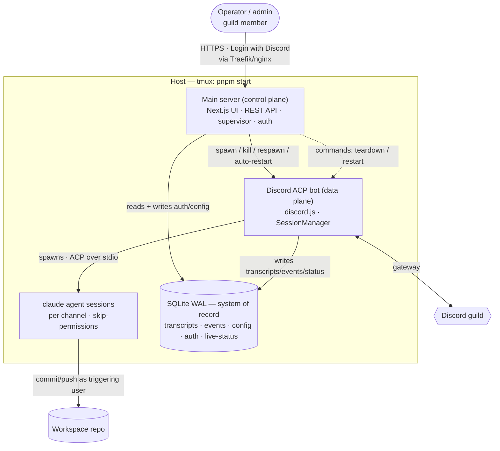
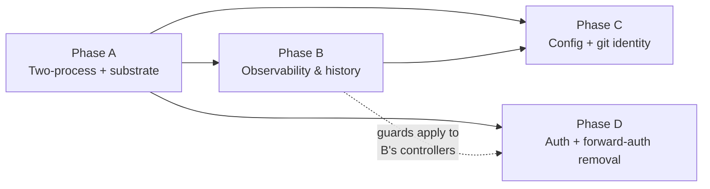

# tdr-code Web Admin Console — Feature Landscape & Research

## Purpose

This is the **master feature catalog and grounded research** for the `@lilnas/tdr-code`
web admin console. It is the bridge between the requirements brainstorm
(`docs/brainstorms/2026-06-27-tdr-code-web-ui-requirements.md`) and the per-phase
implementation plans that will follow.

**This is not an implementation plan.** It carries no implementation units, file lists, or
test scenarios. It exists so that each phase can be brainstormed and planned **independently**
without re-deriving the architecture, re-doing the external research, or re-discovering the
integration seams every time.

### How to use this document

The build is large (~40 features → ~25–30 implementation units across 4 phases). Each phase is
itself a healthy plan-sized chunk. The intended workflow:

1. Pick the next phase to build (dependency order below).
2. `/ce-brainstorm` that phase only **if** it has open product questions; otherwise skip straight to planning.
3. `/ce-plan` that phase, using **this document plus the origin brainstorm** as input.
4. Resolve that phase's open decisions (see [Open Decisions](#open-decisions)) during its plan.

The **cross-phase contracts** (full schema, generation-id, command transport, auth boundary)
must be designed coherently — whichever phase lands first owns locking them. See
[Cross-Phase Contracts](#cross-phase-contracts).

---

## Architecture at a glance

The decisive shape is a **two-process split sharing one SQLite database**:

- **Main server (control plane)** — the always-up process kept alive in tmux. Serves the Next.js
  UI + REST API, owns SQLite, runs migrations, supervises the bot, and owns auth.
- **Bot process (data plane)** — where "bad state" accumulates (wedged gateway, leaked sessions).
  A managed child that can be killed and respawned. Writes transcripts/events/live-status.
- **Shared SQLite is the primary coupling.** Durable data survives bot restarts; the UI reads it
  even while the bot is down. **One refinement from research:** SQLite alone cannot carry
  *commands* (control plane → bot), so a small command channel is added — see
  [Open Decision 1](#decision-1--commandsignaling-transport).

### Why two processes (carried from origin)

Gives a restart button that always works (the control plane isn't the thing that's hung), keeps
the dashboard up precisely when the bot is sick, and yields crash auto-recovery for free. Chosen
over in-process "soft restart" (can't survive a truly hung process) and over an OS-level restart
button (self-defeating without an external supervisor; `pnpm start` in tmux has none).

---

## Current state (grounded)

What exists today in `apps/tdr-code/` — verified by reading the code. Future cycles should start
from this truth, not from the brainstorm's prose.

**Already built (reuse, don't rebuild):**

- **DB substrate is wired but unused.** `src/db/database.module.ts` opens better-sqlite3 with
  `journal_mode=WAL`, `synchronous=NORMAL`, `foreign_keys=ON`, `busy_timeout=5000`, and a boot-time
  Drizzle migrator. `src/db/schema.ts` is an **empty stub** (`export {}`) — all persistence is net-new.
- **ACP agent machinery.** `src/agent/session-manager.service.ts` spawns one `claude` child per
  channel (`detached: true`, `--dangerously-skip-permissions`), tracks live state in an in-memory
  `Map`, and exposes `cancel(channelId, turnId?)` / `teardown(channelId)` / `killProcessTree()`
  (negative-PID SIGTERM→SIGKILL). `ManagedSession` already holds the ACP `sessionId`,
  `prompting`, `queue`, `activeUserId`, `lastActivity`, `currentTurnId`.
- **The event seam.** `src/agent/agent.types.ts` defines `AcpEventHandlers`
  (`onToolCall` / `onToolCallUpdate` / `onAgentMessageChunk` / `onAgentMessageImage` /
  `onPromptStart` / `onPromptComplete`). `src/discord/discord.module.ts` binds the
  `ACP_EVENT_HANDLERS` token via `useExisting: DiscordHandlerService`. **This is the hook point
  for transcript/event persistence** — a composite handler can fan events to Discord *and* SQLite.
- **Sibling work shipped.** `stop-clear` (cancel + `/clear` + cleared-turn watermark) and
  `typing-images` (typing lifecycle, inbound/outbound images, `buildPromptBlocks`) are landed.
  Their race invariants (C1–C4: **no `await` between `connection.prompt` resuming and the
  `finally` drain**; service-global `turnCounter`) must survive any new mid-turn hooks.

**Empty / net-new (everything the console needs):**

- **No HTTP controllers.** The backend only handles Discord events. The entire REST API is net-new.
- **Stub frontend.** `src/app/page.tsx` renders a heading; `layout.tsx` + Tailwind v4 are wired,
  but there are no providers, no React Query, no pages. `@tanstack/react-query@5.90.2` is a
  dependency but unused.
- **One process, not two.** `src/main.ts` → `src/bootstrap.ts` boots a single NestJS `AppModule`
  (DB + Necord + agent + schedule). No supervisor, no child process, no generation id.
- **Config frozen at construction.** `SessionManagerService` caches cwd / idle timeout / max
  sessions / claude command into instance fields in its constructor from `env()`. R13 "edit without
  redeploy" needs a re-read path that does not exist.
- **`turnCounter` resets to 0 on restart** (in-memory) — collides with cross-restart persistence.
- **No auth in the app.** Traefik `forward-auth` gates the whole host today
  (`apps/tdr-code/deploy.yml`, `infra/proxy.yml`). tdr-code would be the **first** lilnas app to
  own its auth. Better Auth is not yet a dependency.
- **No encryption, no supervisor, no per-user guild check** anywhere in the repo.

### Deployment today

`apps/tdr-code/deploy.yml` is an `nginx:alpine` container on the `lilnas-proxy` network that
reverse-proxies `tdr-code.lilnas.io` → `host.docker.internal:8080` (the Next.js frontend on the
host) behind the `forward-auth` middleware, with an `unreachable.html` fallback on 502/503/504.
The host runs `pnpm start` (`run-p start:backend start:frontend`): NestJS on `:8082`, Next.js
standalone on `:8080`, with `/api/*` rewritten to `:8082`. **tdr-code is the only repo app using
the nginx→host-process bridge** — it fits the supervisor model (the bot needs host fs/git/claude).

---

## Integration seams (where new work attaches)

| Seam | Location | Used by |
|---|---|---|
| **ACP event fan-out** | `ACP_EVENT_HANDLERS` token, `src/discord/discord.module.ts` | Transcript + event persistence (compose a multiplexer alongside `DiscordHandlerService`) |
| **Live session state** | `SessionManagerService.sessions` map | Live-status upserts (channel, user, prompting, queue depth, age) |
| **Turn lifecycle** | `executePrompt` / `onPromptStart` / `onPromptComplete` | Turn rows, event rows — **must not add `await` before the finally-drain (C1)** |
| **JSONL linkage** | `ManagedSession.sessionId` (ACP) + `claudeCwd` | Reconciliation against `~/.claude/projects/<escaped-cwd>/<sessionId>.jsonl` |
| **Lifecycle controls** | `cancel()` / `teardown()` / `killProcessTree()` | Per-channel teardown (R11), bot restart reaping (R12) |
| **Process entry** | `src/main.ts` / `src/bootstrap.ts` | Split into main-server entry + bot entry; supervisor spawns the bot |
| **Config source** | `SessionManagerService` constructor fields | Replace `env()` reads with a config-table re-read path (R13) |
| **Discord identity** | `message.author.id` in `DiscordHandlerService.onMessage` | Same snowflake as Better Auth `account.accountId` — keys git identity |
| **Frontend shell** | `src/app/layout.tsx`, `src/styles/globals.css` | React Query provider (copy yoink's), Tailwind v4, `cns()` from `@lilnas/utils/cns` |

---

## Cross-phase contracts (design once)

These span phases and must be coherent. Whichever phase lands first locks them; later phases
extend without migration churn.

### Full schema map (directional — not DDL)

Design the whole shape up front even though phases populate it incrementally. Anticipated tables:

| Table | Phase | Purpose / key columns |
|---|---|---|
| `bot_generation` | A | Supervisor-stamped epoch: `id`, `started_at`, `status`, `last_heartbeat_at`. The primitive behind crash reconciliation, turn identity, readiness. |
| `commands` | A | Control→bot command queue: `id`, `type` (`teardown_channel` …), `target`, `created_at`, `consumed_at`, `status`. (Pending [Decision 1](#decision-1--commandsignaling-transport).) |
| `sessions` | B | Per-channel agent session: `id`, `channel_id`, `generation_id`, `triggering_user_id`, `acp_session_id`, `cwd`, `created_at`, `ended_at`, `end_reason`. |
| `turns` | B | Per-turn: `id` (DB-assigned), `session_id`, `turn_index`, `user_id`, `started_at`, `ended_at`, `stop_reason`, `status` (`completed`/`cancelled`/`errored`/`interrupted`). |
| `turn_content` | B | Transcript blocks: `id`, `turn_id`, `seq`, `kind` (`prompt`/`agent_text`/`tool_call`/`diff`), `payload` (json), `created_at`. Written incrementally. |
| `events` | B | Structured feed: `id`, `generation_id`, `session_id?`, `channel_id?`, `type`, `level`, `context` (json), `created_at`. |
| `live_status` | B | Poll-fresh snapshot: `channel_id` (pk), `generation_id`, `triggering_user_id`, `prompting`, `queue_depth`, `last_activity_at`, `last_heartbeat_at`. |
| `config` | C | Editable global settings: cwd, idle timeout, max sessions, claude command/args. Single typed row or key/value. |
| `git_identity` | C | `discord_user_id` (pk), `name`, `email`, `ssh_key_ciphertext`, `ssh_key_iv`, `ssh_key_auth_tag`, `key_version`, `fingerprint`, `updated_at`. |
| `user` / `session` / `account` / `verification` | D | Better Auth schema (its required shapes), same SQLite file, managed by drizzle-kit. |

**Schema discipline:** generate Better Auth tables via `@better-auth/cli generate` into the app's
schema, then manage everything with the existing `drizzle-kit generate` + boot-time `migrate()`.
**Never** use Better Auth's Kysely-only `migrate`.

### Bot generation / epoch id

A supervisor-stamped id per bot spawn, written to `bot_generation` and stamped on every row the
bot writes (`sessions`, `turns`, `live_status`, `events`). It is the single primitive that solves
four otherwise-separate problems:

- **Crash reconciliation** — on bot exit/startup, mark all *prior-generation* `live_status` rows
  terminated and close dangling `turns` as `interrupted`.
- **Turn identity** — DB-assigned turn ids (or `(generation, counter)`) so the in-memory
  `turnCounter` resetting to 0 on restart can't collide across generations.
- **Readiness / status** — distinguish "process up, gateway connecting" from "running."
- **Orphan reaping** — track which generation's `claude` PGIDs the supervisor must reap.

### Command / signaling transport

Whole-bot restart can ride **SIGTERM** (supervisor → child, reusing the existing graceful-shutdown
path). Per-channel teardown (R11) has **no transport today**. See [Decision 1](#decision-1--commandsignaling-transport).

### Auth boundary

The app becomes the **sole security boundary** (forward-auth removed) in front of an agent running
`--dangerously-skip-permissions`. Therefore: **deny-by-default on every `/api/*` route and page**
from the first controller onward, public-allow only the OAuth callback + login + static assets, and
keep forward-auth in place until app-owned auth is live and verified (cutover ordering matters).

---

## Feature catalog by phase

Tags: `(Rn)` = requirement from origin; **[net-new]** = surfaced by research/flow-analysis, not
explicit in the brainstorm; ⚠ = shaped by an open decision. UI-facing features are the console
surfaces; the rest is the substrate they require.

### Phase A — Two-process architecture & shared substrate *(foundation; unblocks everything)*

| # | Feature | Req | Notes |
|---|---|---|---|
| A1 | Process split: main-server entry + bot entry (two Nest bootstraps) | R1 | Supervisor lives in main server; bot is the restartable child |
| A2 | Bot supervisor: spawn / graceful stop / respawn / auto-restart, backoff + crash-loop breaker, lifecycle state machine, "expected shutdown" flag | R2 | **[net-new: backoff, readiness, expected-vs-crash]** Model as a pure FSM separate from the side-effecting service |
| A3 | Bot generation/epoch id | — | **[net-new]** See [contracts](#bot-generation--epoch-id) |
| A4 | Shared SQLite across both processes (WAL, busy_timeout); main server migrates on boot | R4 | Both processes open the same file; main server also writes (auth/config) → two writers, not "bot writes only" |
| A5 | Command transport (SIGTERM restart + polled command table for teardown) | — | **[net-new]** ⚠ [Decision 1](#decision-1--commandsignaling-transport) |
| A6 | Crash reconciliation sweep (mark stale live-status terminated, close dangling turns) | — | **[net-new]** Runs on bot exit + on startup, keyed by generation |
| A7 | Orphan reaping by supervisor (reap detached `claude` trees a SIGKILLed bot left) | R12 escape | **[net-new mechanism]** Bot writes claude PGIDs; supervisor kills `-pgid` after force-kill. Container boundary is the clean alternative if the bot is ever containerized |
| **A8** | **Bot-status UI surface** (online / starting / offline-last-seen / never-seen) | R3 | First UI surface; reads `bot_generation` heartbeat |
| A9 | Process/deploy model: `pnpm start` → main server spawns bot child; nginx→host routes to main server | R4 | Keep the nginx→host bridge |

### Phase B — Observability & history *(read surfaces; the "see & recover" half)*

| # | Feature | Req | Notes |
|---|---|---|---|
| B1 | Persistence schema (sessions, turns, turn_content, events, live_status) | R6, R9 | Design the full [schema map](#full-schema-map-directional--not-ddl) here |
| B2 | ACP→SQLite writer (composite handler on the `ACP_EVENT_HANDLERS` seam) | R6 | Fans events to Discord *and* SQLite; **must not break the C1 no-`await` invariant** |
| B3 | Per-turn transcript persistence (prompts, agent text, tool calls, diffs), incremental writes | R6 | **[net-new: incremental vs end-of-turn]** Incremental so a mid-turn crash leaves partial-but-readable data |
| B4 | Session lifecycle rows (created/evicted by `createSession`/`teardown`) | R6 | |
| B5 | Live-status upserts (channel, user, prompting/idle, queue depth, last activity, age) + heartbeat | R5 | **[net-new: heartbeat + cadence]** state-change upserts + periodic heartbeat; reader uses freshness check |
| B6 | JSONL linkage + early verification probe | R8 | **[partly verified]** Interactive claude writes `~/.claude/projects/<escaped-cwd>/<sessionId>.jsonl`; persist `(acpSessionId, cwd)`; probe whether ACP `newSession` id == on-disk filename *before* building reconcile |
| B7 | Reconciliation flow (persisted transcript vs claude JSONL; missing-file handling) | R8, AE4 | **[net-new: flow/UI undefined]** Define trigger (manual? job?) and mismatch rendering, or defer |
| **B8** | **Live activity view** (UI+API): poll-fresh, degrades to last-known + offline | R5 | |
| **B9** | **Transcript browse** (UI+API): list past sessions by channel/time, read full transcript | R7 | |
| **B10** | **Event/error feed** (UI+API): filterable, linkable to session/channel | R9, R10 | |
| **B11** | **Lifecycle controls** (UI): teardown one channel (F1), restart whole bot (F4) | R11, R12 | Wired to A5 command transport + A2 supervisor |
| **B12** | **Empty/edge states**: never-seen vs offline vs online; empty lists | — | **[net-new]** |

### Phase C — Configuration & per-user git identity *(write surfaces; security-sensitive)*

| # | Feature | Req | Notes |
|---|---|---|---|
| **C1** | **Global config** (table + API + UI): cwd, idle timeout, max sessions, claude command/args | R13 | |
| C2 | Config apply semantics (per-setting timing + bot re-read + validation + UI "takes effect when") | R13 | **[net-new]** cwd/command = new-sessions-only; idle = next reset; max = next create |
| C3 | Git identity mapping (table: Discord ID → name/email/SSH key) | R14 | |
| C4 | SSH encryption at rest (AES-256-GCM, master key from host file, key_version) | R15 | **[net-new scheme]** See [research](#ssh-key-encryption-at-rest-r15) |
| **C5** | **Fingerprint + write-only readback** (sshpk fingerprint; API never returns key) | R15, AE6 | |
| **C6** | **Git identity settings UI** (enter name/email/key; show fingerprint/status only) | F3 | |
| C7 | Per-turn identity application (apply triggering user's identity to git ops) | R16 | ⚠ [Decision 2](#decision-2--git-identity-concurrency-model) — concurrency model |
| C8 | Block git writes when unconfigured (withhold key + hook for UX, allowed/blocked op set, agent-visible failure, Discord message + event) | R16, AE3 | **[net-new mechanism]** See [research](#blocking-git-writes-r16) |
| C9 | Decrypt-failure branch (treat as effectively-unconfigured → block + distinct event) | — | **[net-new]** |

### Phase D — Authentication & access *(the security cutover)*

| # | Feature | Req | Notes |
|---|---|---|---|
| D1 | Better Auth + Discord provider + Drizzle/SQLite adapter (same db) + session cookies | R17 | better-auth ≥1.6.22; see [research](#better-auth--discord-r17r19) |
| D2 | Better Auth schema (user/session/account/verification in same SQLite via drizzle-kit) | R17 | |
| D3 | NestJS mount (`auth.handler`, `basePath=/auth` — rewrite strips `/api`, body parser) | R17 | ⚠ basePath/baseURL mismatch is the top `state_mismatch` cause |
| D4 | Guild gate (reject non-members at sign-in, no rows provisioned; verify-no-rows; fail-closed) | R18, AE5 | **[net-new]** `databaseHooks.account.create.before` + runtime "no rows" verification |
| D5 | Discord ID linkage (`account.accountId` = the `author.id` the bot sees) | R14/R18 | |
| **D6** | **Auth guards** (deny-by-default on `/api/*` + pages; public allow callback/login/static) | R19 | |
| **D7** | **Next.js auth UI** (login page, server-component session reads, redirect-to-login) | R17 | |
| D8 | Flat admin model (every authed guild member is full admin) | R19 | |
| D9 | Forward-auth removal + deploy rework (cutover: auth verified *then* remove label) | R17 | **[net-new ordering]** |
| D10 | Guild re-check posture (sign-in only; mid-session departure persists to expiry) | — | **[net-new]** Checking via OAuth `guilds` scope keeps auth independent of the (possibly-down) bot |

**Non-goal:** `R20` — no agent-driving from the web (no prompt input / web chat). Conversing stays in Discord.

---

## Open decisions

None of these are settled. Each is owned by the phase that first needs it.

### Decision 1 — Command/signaling transport
**Owned by Phase A.** The origin's "shared SQLite is the only coupling" cannot carry commands
(control plane → bot). Whole-bot restart (R12) can ride SIGTERM; per-channel teardown (R11) needs
a transport.
- **(a) Command table the bot polls** — preserves the SQLite-only lean; ~poll-interval latency
  (fine vs R5's "within a few seconds"); a *crashed* bot never drains it (acceptable — teardown of
  a dead bot is moot). *Lowest machinery.*
- **(b) Thin internal bot HTTP API** (localhost) — immediate; contradicts the SQLite-only decision;
  the origin already named this a "possible later add."
- **(c) OS signals only** — works for whole-bot restart, **cannot** target one channel.

### Decision 2 — Git-identity concurrency model
**Owned by Phase C.** R16 + the "single global workspace" scope boundary collide: turns are
serialized *per channel* but **not across channels**, so two channels committing concurrently in
one shared `.git` race on identity/attribution — a trust/security failure given
`--dangerously-skip-permissions`. (The origin's "serialized per channel, so it's tractable" is
correct per-channel, wrong cross-channel.)
- **(a) Global git-write lock** — serialize git-writing turns across all channels; preserves the
  single-workspace boundary; cost is brief loss of cross-channel concurrency during git ops only.
- **(b) Per-channel worktrees** — full concurrency; **relaxes** the "single global working
  directory" boundary (a product change).
- **(c) Accept best-effort** — document the race, no mitigation (silent mis-attribution; not advised).

### Decision 3 — Document/planning granularity
**Owned now (meta).** Resolved by this document's existence: we plan **each phase independently**.
Remaining sub-choice when starting: brainstorm-then-plan vs plan-directly per phase (Phase A and B
are well-specified enough to plan directly; C and D may warrant a short brainstorm for the
security/UX decisions).

### Smaller decisions to settle at plan time

- **Master-key location** (Phase C) — env var vs `chmod 600` host file. Research leans host file,
  but the bot must read it to decrypt per-turn keys, and the agent can read the bot's environment
  regardless → at-rest encryption is **backup/disk-theft protection only**. Document the threat
  model honestly.
- **Live-status cadence + staleness threshold** (Phase B) — default: state-change upserts + ~5–10s
  heartbeat; reader treats heartbeat older than ~3× interval as stale.
- **Transcript write granularity** (Phase B) — default incremental (survives mid-turn crash).
- **Guild re-check** (Phase D) — sign-in only vs periodic; default sign-in only to keep auth
  independent of the bot.
- **Config apply timing per setting** (Phase C) — default: cwd/command = new sessions only;
  idle = next timer reset; max sessions = next create (no live eviction).

---

## Consolidated research findings (grounded reference)

So future plans cite this instead of re-researching. Versions confirmed June 2026.

### Better Auth + Discord (R17–R19)
- **Versions:** `better-auth` ≥ **1.6.22** (security fixes — bump each `@better-auth/*` package
  individually; avoid the 1.7 line for now). `@better-auth/drizzle-adapter`.
  `@thallesp/nestjs-better-auth` **2.6.1** for the NestJS mount (peer: express ^5.1.0 — satisfied by
  `@nestjs/platform-express@11.1.6`), or mount `auth.handler` manually.
- **Adapter:** pass the **same** Drizzle `db` instance the app already opens (the `DB` token) to
  `drizzleAdapter(db, { provider: 'sqlite' })`. It does not open its own connection.
- **Schema coexistence:** `@better-auth/cli generate` emits the table defs; manage them with the
  app's `drizzle-kit` pipeline. The CLI's `migrate` is Kysely-only — **don't** use it.
- **Discord provider:** `scope: ['identify', 'email', 'guilds.members.read']`;
  `mapProfileToUser` to synthesize an email when Discord returns `null`. Callback
  `/api/auth/callback/discord`.
- **Guild gate:** inspect the Discord token in `databaseHooks.account.create.before` and
  `throw new APIError('FORBIDDEN', …)` for non-members. Minimal check:
  `GET /users/@me/guilds/{GUILD_ID}/member` (200 = member, 404 = not) with `guilds.members.read`.
  **Verify at runtime that a rejected sign-in leaves zero `user`/`account`/`session` rows** —
  the transaction-rollback boundary is not documented; have a request-level `hooks.before` on the
  callback path as fallback.
- **⚠ The `/api/*` rewrite strips `/api`** (`/api/:path*` → `/:path*`), so the backend receives
  `/auth/...`. Set Better Auth `basePath: '/auth'` and `baseURL`/`trustedOrigins` to the public Next
  origin, or the OAuth `state` cookie mismatches → `state_mismatch`. Verify with a backend request log.
- **Discord ID:** stored as `account.accountId` (snowflake) — the same id the bot sees as
  `message.author.id`. Keys per-user git identity.
- Sources: better-auth.com docs (installation, drizzle adapter, discord, hooks, nestjs),
  github.com/thallesp/nestjs-better-auth, Discord developer docs (user resource, OAuth2 scopes).

### SSH key encryption at rest (R15)
- **AES-256-GCM** via Node `crypto.createCipheriv` (the keyless `createCipher` is deprecated).
  Per record store **iv (12-byte random) + authTag (16-byte) + ciphertext** as separate BLOBs.
  `setAAD(recordId)` to bind ciphertext to its row (prevents row-swap). Decrypt throws on tamper —
  treat any throw as "discard."
- **Master key:** 32 random bytes from a `chmod 600` host file (preferred over env), validated at
  boot. Add a `key_version` column for future rotation. **Envelope encryption is YAGNI** for a
  single self-hosted host with no HSM/KMS.
- **Threat model (state plainly):** the agent runs arbitrary shell and can read the master key, so
  at-rest encryption protects against **disk/backup theft only**, not against the agent.
- **Fingerprint:** `sshpk.parsePrivateKey(blob,'auto').toPublic().fingerprint('sha256').toString()`
  — matches `ssh-keygen -lf`, pure JS, no disk write. `sshpk` 1.18.0 (mature). **Validate** by
  parse-attempt; **reject passphrase-protected keys** (catch `KeyEncryptedError`); enforce a size cap.
- Sources: nodejs.org crypto docs, sshpk/ssh2 npm, AES-256-GCM canonical patterns.

### Per-turn git identity on a shared-cwd agent (R16)
- Env vars (`GIT_AUTHOR_*`, `GIT_SSH_COMMAND`) are **frozen at claude spawn** — useless per-turn for
  a long-lived process. Use an **out-of-band channel git reads per invocation**: rewrite the repo's
  **local `.git/config`** (`user.*` + `core.sshCommand`) per turn (atomic temp-then-rename, or
  `git config --local`), and/or a `core.sshCommand` **wrapper** that reads the current key path from
  a bot-written state file.
- Per-turn decrypted key → `chmod 600` file in **tmpfs** (`/run/...`), deleted at turn end.
  `IdentitiesOnly=yes`, `StrictHostKeyChecking=accept-new`, `-F /dev/null`.
- **⚠ Race:** safe only if a given `.git` has one serialized writer. The single shared workspace +
  concurrent channels breaks that — see [Decision 2](#decision-2--git-identity-concurrency-model).
- Sources: git-scm config/env docs, Atlassian git config, GIT_SSH_COMMAND best-practice writeups.

### Blocking git writes (R16)
- Against an arbitrary-shell agent, **client-side hooks are not a security boundary**
  (`--no-verify`, `-c core.hooksPath=/dev/null`, absolute-path git all bypass). `core.hooksPath` is
  **protected config** — ignored from local `.git/config`; only honored from global/system.
- **Real boundary = withhold the SSH key** (no key file / wrapper exits non-zero → push impossible)
  **+ server-side enforcement** (GitHub branch protection / `pre-receive`). Local commit can't be
  hard-blocked, but an un-pushable commit is inert.
- **Local hook + sentinel = friendly UX** (clear "configure your identity" message + a nonzero exit
  the agent reports), not security. Surface to Discord + an event row.
- Sources: git-scm githooks, Xygeni/systemshardening on hook bypass, GitHub branch-protection docs.

### Node child-process supervision (R2, R12)
- Explicit **state machine** (stopped/starting/running/stopping/crashed) + an **intent flag** set
  before deliberate kills to distinguish intentional vs crash exits.
- **Capped exponential backoff + jitter + circuit breaker**; reset failure count only after the
  child is *stably* running for a window; surface a terminal "failed to start" rather than looping.
- **Graceful shutdown:** SIGTERM → grace → SIGKILL; the bot installs its own SIGTERM handler (stop
  new turns, abort in-flight, kill claude grandchildren, exit) with a force-exit backstop.
- **Reaping detached trees:** `detached:true` children are killable via `process.kill(-pid)`. If the
  bot is SIGKILLed it can't clean up → supervisor reaps. Pragmatic: bot persists claude PGIDs (to a
  file or `bot_generation`), supervisor kills them after force-kill. `PR_SET_CHILD_SUBREAPER` is
  YAGNI; a **container boundary** (bot in its own container) makes orphan reaping free.
- Sources: nodejs.org child_process/process docs, Node graceful-shutdown (2026) writeups,
  PR_SET_CHILD_SUBREAPER man page.

### Multi-process SQLite WAL (R4, R5)
- WAL **supports** multiple processes (one writer + concurrent readers) on one file — better-sqlite3
  docs call this out explicitly. Current pragmas (`WAL`, `synchronous=NORMAL`, `busy_timeout=5000`)
  are already correct; **set `busy_timeout` in both processes.**
- better-sqlite3 is **synchronous** — the busy handler **blocks the whole event loop** while waiting,
  so keep write transactions short; treat `SQLITE_BUSY` as retryable. Use `BEGIN IMMEDIATE`
  (`db.transaction(cb, { behavior: 'immediate' })`) for read-then-write mutations (see
  `docs/solutions/conventions/begin-immediate-for-read-then-write-mutations-2026-05-27.md` — note its
  "concurrency is invisible" cost model **does not hold** under two processes).
- **Reality check on R4's "bot writes, main server reads":** the main server *also* writes (auth,
  config, reconciliation) → genuinely two writers. Acceptable under WAL + busy_timeout for this low
  write volume, but design writes to be short. Add a `wal_checkpoint(RESTART)` watcher in the bot if
  `-wal` grows. WAL requires a **local** filesystem (no NFS) and a directory writable by both.
- Sources: WiseLibs/better-sqlite3 performance.md + api.md, swole's `pragmas.ts`/`client.ts`/`migrate.ts`.

### ACP → claude JSONL reconciliation (R8) — partly verified
- **Confirmed:** interactive claude writes `~/.claude/projects/<escaped-cwd>/<uuid>.jsonl` where the
  filename uuid **==** the internal `sessionId`, and the escaped-cwd dir is deterministic
  (`/`→`-`, `.`→`-`). `claude` is at `/opt/nflx/bin/claude`.
- **Unverified:** that the **ACP** `newSession` sessionId equals the on-disk filename (interactive
  vs ACP mode). → Persist `(acpSessionId, cwd)`; **probe this in ~5 min as the first Phase B step**
  (spawn one ACP session, check `~/.claude/projects/<escaped-cwd>/<that-id>.jsonl` exists). If it
  doesn't hold, fall back to cwd + time-window linkage or defer reconciliation.

### Monorepo patterns to mirror (lilnas)
- **HTTP/REST:** thin controller + `nestjs-zod` `createZodDto` + service delegation
  (`apps/download`). Bootstrap with helmet + cookie-parser + `enableShutdownHooks` + log redaction
  (`apps/yoink/src/bootstrap.ts`). No global Zod pipe exists — registering one would be a new
  convention. No standard HTTP error envelope exists — pick one (swole's `{ ok:false; kind; code }`
  is the most mature).
- **Drizzle/SQLite:** copy swole's `pragmas.ts`, `client.ts` (prod one-shot / dev `globalThis`),
  `migrate.ts` (**`process.cwd()`, never `__dirname`** — Turbopack rewrites it), `test-db.ts`
  (`:memory:` + `createTestDb()`). Functions-over-classes data layer.
- **Frontend:** copy yoink's `query-provider.tsx` (same RQ 5.90.2); Tailwind v4 already wired;
  use `cns()` from `@lilnas/utils/cns` for all class composition (CLAUDE.md mandate).
- **Auth precedent (shape only):** yoink is Passport/JWT on Postgres — reuse the *shape*
  (httpOnly cookie, RSC `getAuthenticatedUser()` via `jose`, `CanActivate` guard with a short cache,
  `timingSafeEqual` API-key route for a service principal) but not the library.
- **Deploy:** keep the nginx→`host.docker.internal` bridge (tdr-code is the only host-process app).
  Borrow swole's `deploy.yml` extras for the WAL file: `stop_grace_period: 30s`,
  `/storage/app-data/tdr-code` volume + `chown 1000:1000`, `/api/health` `SELECT 1` probe,
  `/metrics` ip-allowlist deny router. **The production supervisor is greenfield** (only `lilnas dev`
  spawn/SIGTERM is a loose analog).
- **Testing:** reuse `apps/tdr-code/src/__tests__/setup.ts` (discord.js/child_process/necord/ACP
  mocks); add swole's `server-only` jest stub once a db client lands. `.spec.ts`/`.test.ts` are
  runner-identical — prefer `.spec.ts` for new files.
- **Forward-auth:** production uses bare `forward-auth` (Docker-provider), not `@file`; removing it
  = drop the `...middlewares=forward-auth` label. Watch silent `Host()` shadowing; set
  `traefik.docker.network` if multi-network; set Next `allowedDevOrigins` for dev behind TLS
  (`docs/solutions/architecture-patterns/expose-external-compose-via-lilnas-proxy-2026-06-25.md`).

### Institutional learnings to honor (`docs/solutions/`)
- `begin-immediate-for-read-then-write-mutations-2026-05-27.md` — `{ behavior: 'immediate' }` for
  read-then-write; all calls through `tx`. (Cost model assumes single process — see WAL note.)
- `atomicity-tests-must-reach-the-write-phase-2026-06-03.md` — race/atomicity tests must hit the
  real write window, not a pre-write guard.
- `pure-fsm-core-for-stateful-domain-logic-2026-05-27.md` — model the supervisor as a pure FSM;
  matrix-cover crash-during-shutdown and kill-during-respawn.
- `type-guards-over-nonnull-assertions-on-db-rows-2026-05-30.md` — model R16 "has-identity vs not"
  as a discriminated union + type guard, not a nullable column with `!`.
- `drawer-history-marker-repush-on-keystroke-2026-05-30.md` (generalized) — every long-lived handle
  (child process, timers, polling intervals) created once per key, never overwritten without
  release, torn down on every path.

---

## Sequencing & dependencies

- **A is the hard unblocker** — nothing else works until the two-process split, shared SQLite,
  generation id, and command transport exist. Build and *verify* it first.
- **B** depends on A's schema + generation id. The read surfaces (live view, history, events) are
  mostly additive and lower-risk — a good second deliverable.
- **C** depends on A (config re-read path) + B (schema, event feed). Security-sensitive (encryption,
  git writes). Resolves [Decision 2](#decision-2--git-identity-concurrency-model).
- **D** is somewhat independent but its **deny-by-default guards must apply to every controller
  added in B and C**. Practical ordering: keep **forward-auth in place** through A/B/C (the app stays
  gated), then do D as the cutover (stand up app-owned auth, verify, *then* remove forward-auth).
- **Recommended order: A → B → C → D**, or A → B then C/D as appetite dictates.

### Per-phase planning checklist (deferred questions mapped to phases)

- **Before planning A:** resolve [Decision 1](#decision-1--commandsignaling-transport)
  (command transport); confirm WAL two-writer model; design the full schema map + generation id.
- **Before planning B:** run the R8 JSONL probe (B6); decide transcript write granularity and
  live-status cadence; define the reconciliation flow or defer it.
- **Before planning C:** resolve [Decision 2](#decision-2--git-identity-concurrency-model)
  (git concurrency); decide master-key location; decide config apply-timing per setting; decide the
  git-write block mechanism + allowed/blocked op set.
- **Before planning D:** confirm `basePath`/`baseURL` against the rewrite; design the guild-gate
  "no rows" verification; decide guild re-check posture; script the forward-auth cutover order +
  public-route allowlist.

---

## Sources & references

- **Origin brainstorm:** `docs/brainstorms/2026-06-27-tdr-code-web-ui-requirements.md`
- **Sibling brainstorm:** `docs/brainstorms/2026-06-27-tdr-code-stop-clear-requirements.md`
- **Sibling plans (shipped machinery to honor):**
  `docs/plans/2026-06-27-001-feat-tdr-code-stop-clear-plan.md`,
  `docs/plans/2026-06-27-002-feat-tdr-code-typing-images-plan.md`
- **Key current files:** `apps/tdr-code/src/agent/session-manager.service.ts`,
  `apps/tdr-code/src/discord/discord-handler.service.ts`, `apps/tdr-code/src/agent/acp-client.ts`,
  `apps/tdr-code/src/agent/agent.types.ts`, `apps/tdr-code/src/db/database.module.ts`,
  `apps/tdr-code/src/db/schema.ts`, `apps/tdr-code/src/env.ts`, `apps/tdr-code/src/bootstrap.ts`,
  `apps/tdr-code/next.config.js`, `apps/tdr-code/deploy.yml`, `apps/tdr-code/deploy/nginx.conf`,
  `infra/proxy.yml`
- **Patterns to mirror:** `apps/download/` (REST), `apps/yoink/` (auth shape, bootstrap),
  `apps/swole/src/db/` (Drizzle/SQLite/WAL), `packages/utils/src/cns.ts`
- **External:** better-auth.com docs, github.com/thallesp/nestjs-better-auth, Discord developer
  docs, WiseLibs/better-sqlite3 docs, nodejs.org crypto + child_process docs, sshpk/ssh2,
  git-scm config/githooks docs
- **Institutional:** `docs/solutions/conventions/`, `docs/solutions/architecture-patterns/`
  (see [learnings](#institutional-learnings-to-honor-docssolutions))
