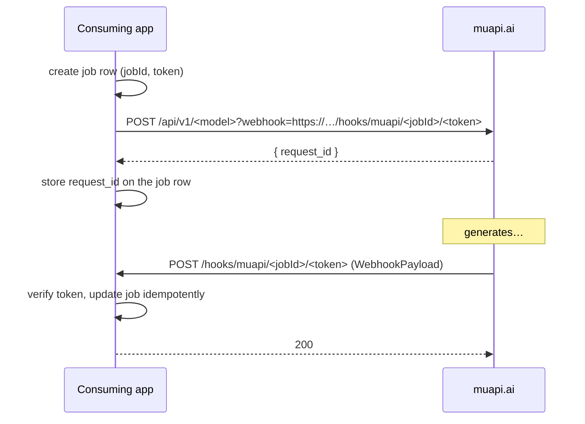

# @lilnas/muapi

TypeScript client for the [muapi.ai](https://muapi.ai) generative-media API (image, video, audio, 3D, LLM). Almost all of it is generated from muapi's OpenAPI spec; `src/index.ts` adds the client factory and a few hand-written types.

```bash
pnpm fetch-spec   # download the latest spec into apis/muapi.json
pnpm generate     # regenerate src/generated from the spec
pnpm build
```

## Basic usage

```ts
import { createMuapiClient } from '@lilnas/muapi'

const client = createMuapiClient({ apiKey: process.env.MUAPI_API_KEY! })
```

Every generation endpoint is a generated function that takes `{ client, body, query }`. The function names are long (one per operation); search `src/generated/sdk.gen.ts` for the model you want.

## Generation is async — use webhooks

Every generation `POST` returns `{ request_id }` immediately (typed as `SubmitResponse`); the work runs in the background. **This package intentionally has no polling helper.** Pass a `webhook` URL on submit and muapi will POST the result to it when the job finishes. See [muapi's webhook docs](https://muapi.ai/docs/webhooks).



### 1. Submit with a webhook

`webhook` is a query parameter on ~786 endpoints (typed in each endpoint's `query`). Check that the one you call has it.

```ts
const jobId = crypto.randomUUID()
const token = crypto.randomBytes(32).toString('hex')

// Persist { jobId, token, status: 'submitted' } BEFORE submitting, so a fast
// webhook can never arrive for a job you don't know about.

const { data } = await someGenerationEndpoint({
  client,
  body: { prompt: 'a lighthouse at dusk' },
  query: {
    webhook: `${PUBLIC_BASE_URL}/hooks/muapi/${jobId}/${token}`,
  },
  throwOnError: true,
})

const { request_id } = data as SubmitResponse
// Persist request_id on the job row (it equals `payload.id` in the webhook).
```

### 2. Receive the webhook

muapi sends `POST` with a JSON `WebhookPayload`:

```json
{
  "id": "<request_id>",
  "status": "completed",
  "outputs": ["https://…/result.mp4"],
  "has_nsfw_contents": [false],
  "urls": {
    "get": "https://api.muapi.ai/api/v1/predictions/<request_id>/result"
  },
  "created_at": "…",
  "executionTime": "…",
  "timings": { "inference": "…" }
}
```

On failure `status` is `"failed"`, `outputs` is absent and `error` is set.

A NestJS-style receiver:

```ts
@Post('hooks/muapi/:jobId/:token')
@HttpCode(200)
async onMuapi(
  @Param('jobId') jobId: string,
  @Param('token') token: string,
  @Body() payload: WebhookPayload,
) {
  const job = await this.jobs.find(jobId)
  if (!job || !timingSafeEqualStr(job.token, token)) throw new NotFoundException()

  // Idempotent: muapi retries, so a job may be delivered more than once.
  if (job.status === 'completed' || job.status === 'failed') return

  await this.jobs.finish(jobId, payload) // save outputs / error, then return 200
  // Do heavy work (downloading outputs, etc.) after responding / on a queue.
}
```

### Things to get right

| Concern             | What to do                                                                                                                                                                                                                                                                                                                                                    |
| ------------------- | ------------------------------------------------------------------------------------------------------------------------------------------------------------------------------------------------------------------------------------------------------------------------------------------------------------------------------------------------------------- |
| **No signature**    | muapi does not sign deliveries (none documented). Treat the URL as the secret: put an unguessable per-job token in the path, compare it in constant time, and 404 on mismatch. Never reuse one token across jobs.                                                                                                                                             |
| **HTTPS only**      | The webhook URL must be a public HTTPS endpoint. In prod that means a Traefik router for the receiver that does **not** use `lilnas-auth@docker` (muapi can't authenticate). Scope that router to the `/hooks/muapi/` path only.                                                                                                                              |
| **Respond fast**    | Return 2xx quickly. muapi retries up to 3 times with exponential backoff on errors/unreachable. Do slow work asynchronously.                                                                                                                                                                                                                                  |
| **Idempotency**     | Retries mean duplicates. Key updates on the job (or `payload.id`) and ignore deliveries for jobs already finished.                                                                                                                                                                                                                                            |
| **Lost deliveries** | After the retries, nothing more is sent, and `cancelled` isn't documented as delivered. Run a periodic sweep over jobs stuck in `submitted` for longer than the model's expected runtime and call `getPredictionResultApiV1PredictionsIdResultGet` **once per stuck job** (typed as `PredictionResult`) to reconcile. This is a fallback, not a polling loop. |
| **Local dev**       | muapi can't reach `localhost`. Use an exposed dev URL (`https://<name>.dev.lilnas.io`, see `docs/lilnas-expose.md`) as `PUBLIC_BASE_URL`.                                                                                                                                                                                                                     |
| **Sandbox keys**    | Keys created with `is_test: true` return mock outputs without billing — use one while building the receiver.                                                                                                                                                                                                                                                  |

### The body-level `webhook_url` field

Many request schemas also have an optional `webhook_url` body field. It is not documented and its relationship to the `?webhook=` query param is unknown; use the query param.
